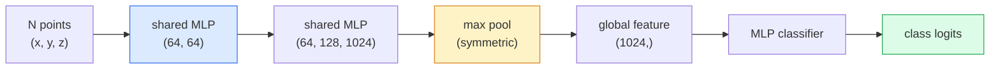

# 3D视觉 点云和NeRF

> 3D视觉有两种形式.点云是传感器的原始输出.NeRF是学习的体积场.

**类型：**学习+建设
**语言：**字符串
**先修：**阶段4课03 (CNN),阶段1课12 (光器操作)
**时间：**时间45分钟

## 学习目标
- 区分显式(点云、网格、声像) 和隐式(签名距离场域、NeRF) 3D表示,并理解各自的适用场景
- 了解PointNet的对称函数技巧:它如何使神经网络对无序点集具有变量变异性质
- 追踪NeRF前进传递:射线造,体积成像,位置编码,MLP密度+颜色头
- 使用 `nerfstudio`或`instant-ngp`基于少量带姿势的图像进行预训练的3D重建

## 问题
摄像头产生2D图像――LIDAR 产生一组无序的3D点――结构-从动作管道产生稀疏的3D关键点云――NeRF可以从少量带着姿势的图像重建完整的3D场景――这些都属于视,但它们都不像CNN想要的密集度――

3D视觉很重要,因为几乎所有高价值机器人任务都在3D中运行:抓住,避免障碍,导航,AR封闭,捕获3D内容.

这两类表示因不同原因占据主导地位. 点云是传感器免费给你的东西.

## 概念
### 点云

点云是 R^3 中 N 个点的无序集合,每个点可选地带有特征 ((颜色,强度,正常) ⋅

```
cloud = [
  (x1, y1, z1, r1, g1, b1),
  (x2, y2, z2, r2, g2, b2),
  ...
  (xN, yN, zN, rN, gN, bN),
]
```

没有电网,没有连接. 这两个因素使得神经网络很难实现:

- **Permutation invariance**输出不能依赖于序列.
- **Variable N** 单个模型必须能够处理不同大小的云.

点网 (Qi et al., 2017) 用一个想法解决了两件事:对每个点应用共享MLP,然后使用对称函数(最大池)聚合.结果是一个固定大小的向量,并且不依赖顺序.

```
f(P) = max_{p in P} MLP(p)
```

这就是PointNet的整个核心.更深层次的变体.

### 点网架构



共享MLP表示同一个MLP独立地运行在每个点上.为了效率,通常实现为沿点维度的1x1 conv.

### 神经辐射场 (Neural Radiance Fields)

尼尔德哈尔等专家提出了问题:我们能否从N张照片重建一个3D场景?`(x, y, z, viewing_direction)`映射到`(density, colour)`染新视角就是一个围绕该网络的射线循环.

```
NeRF MLP:  (x, y, z, theta, phi) -> (sigma, r, g, b)

To render a pixel (u, v) of a new view:
  1. Cast a ray from the camera through pixel (u, v)
  2. Sample points along the ray at distances t_1, t_2, ..., t_N
  3. Query the MLP at each point
  4. Composite the colours weighted by (1 - exp(-sigma * dt))
  5. The sum is the rendered pixel colour
```

通过染步骤做回来更新MLP──没有3D地面真相,没有显式几何学场景存储在MLP重量中──

### 在 NeRF 中的位置编码

作用在`(x, y, z)`上的尼拉MLP 无法表示高频细节,因为MLPs 在频谱上偏向低频.NeRF 通过在送入MLP前,将每个坐标编码为Fourier特征矢量来修改这一点:

```
gamma(p) = (sin(2^0 pi p), cos(2^0 pi p), sin(2^1 pi p), cos(2^1 pi p), ...)
```

最高到L=10个频率水平――这与变压器使用位置的技巧相同,也会在扩散时间调节中再次出现――没有它,NeRF看起来会很模糊――

### 量度表现

```
C(r) = sum_i T_i * (1 - exp(-sigma_i * delta_i)) * c_i

T_i  = exp(- sum_{j<i} sigma_j * delta_j)
delta_i = t_{i+1} - t_i
```

`T_i`传输量也就是有多少光能到达点.`(1 - exp(-sigma_i * delta_i))`是点在处的光度.`c_i`终极像素是沿线射线的加权和.

### 什么替代了NeRF

纯 NeRFs 训练慢(数小时),染也慢(每张图数秒) ・后的发展脉络如下:

- **Instant-NGP**(2022) 哈希网编码 替代MLP的位置输入;数秒内完成训练――
- **Mip-NeRF 360** 处理无限场景和反化.
- **3D Gaussian Splatting** 用数百万的3D高斯人 替代体积场数分钟训练,实时染──当前生产环境的默认选择──

2026年几乎所有真实的NeRF产品实际上都是3D高斯人布.

### 数据集和基准

- **ShapeNet**将3DCAD模型作为点云进行分类和细分.
- **ScanNet** 用于分类的真实室内扫描.
- **KITTI** 用于自动驾驶户外LIDAR点云
- **NeRF Synthetic**现在,**Blended MVS** 用于查看合成的姿势图数据集──
- **Mip-NeRF 360**数据集 无限的真实场景──


```figure
nerf-rays
```

## 构建它
### 步骤1:PointNet分类器

```python
import torch
import torch.nn as nn

class PointNet(nn.Module):
    def __init__(self, num_classes=10):
        super().__init__()
        self.mlp1 = nn.Sequential(
            nn.Conv1d(3, 64, 1),    nn.BatchNorm1d(64),   nn.ReLU(inplace=True),
            nn.Conv1d(64, 64, 1),   nn.BatchNorm1d(64),   nn.ReLU(inplace=True),
        )
        self.mlp2 = nn.Sequential(
            nn.Conv1d(64, 128, 1),  nn.BatchNorm1d(128),  nn.ReLU(inplace=True),
            nn.Conv1d(128, 1024, 1), nn.BatchNorm1d(1024), nn.ReLU(inplace=True),
        )
        self.head = nn.Sequential(
            nn.Linear(1024, 512),   nn.BatchNorm1d(512),  nn.ReLU(inplace=True),
            nn.Dropout(0.3),
            nn.Linear(512, 256),    nn.BatchNorm1d(256),  nn.ReLU(inplace=True),
            nn.Dropout(0.3),
            nn.Linear(256, num_classes),
        )

    def forward(self, x):
        # x: (N, 3, num_points) — transposed for Conv1d
        x = self.mlp1(x)
        x = self.mlp2(x)
        x = torch.max(x, dim=-1)[0]       # (N, 1024)
        return self.head(x)

pts = torch.randn(4, 3, 1024)
net = PointNet(num_classes=10)
print(f"output: {net(pts).shape}")
print(f"params: {sum(p.numel() for p in net.parameters()):,}")
```

约1.6M参数. 每个云运行在1024个点上.

### 步骤 2: 位置编码

```python
def positional_encoding(x, L=10):
    """
    x: (..., D) -> (..., D * 2 * L)
    """
    freqs = 2.0 ** torch.arange(L, dtype=x.dtype, device=x.device)
    args = x.unsqueeze(-1) * freqs * 3.141592653589793
    sinc = torch.cat([args.sin(), args.cos()], dim=-1)
    return sinc.reshape(*x.shape[:-1], -1)

x = torch.randn(5, 3)
y = positional_encoding(x, L=10)
print(f"input:  {x.shape}")
print(f"encoded: {y.shape}     # (5, 60)")
```

乘以`2^l * pi`频率越来越高.

### 步骤3:小 NeRF MLP

```python
class TinyNeRF(nn.Module):
    def __init__(self, L_pos=10, L_dir=4, hidden=128):
        super().__init__()
        self.L_pos = L_pos
        self.L_dir = L_dir
        pos_dim = 3 * 2 * L_pos
        dir_dim = 3 * 2 * L_dir
        self.trunk = nn.Sequential(
            nn.Linear(pos_dim, hidden), nn.ReLU(inplace=True),
            nn.Linear(hidden, hidden),  nn.ReLU(inplace=True),
            nn.Linear(hidden, hidden),  nn.ReLU(inplace=True),
            nn.Linear(hidden, hidden),  nn.ReLU(inplace=True),
        )
        self.sigma = nn.Linear(hidden, 1)
        self.color = nn.Sequential(
            nn.Linear(hidden + dir_dim, hidden // 2), nn.ReLU(inplace=True),
            nn.Linear(hidden // 2, 3), nn.Sigmoid(),
        )

    def forward(self, x, d):
        x_enc = positional_encoding(x, self.L_pos)
        d_enc = positional_encoding(d, self.L_dir)
        h = self.trunk(x_enc)
        sigma = torch.relu(self.sigma(h)).squeeze(-1)
        rgb = self.color(torch.cat([h, d_enc], dim=-1))
        return sigma, rgb

nerf = TinyNeRF()
x = torch.randn(128, 3)
d = torch.randn(128, 3)
s, c = nerf(x, d)
print(f"sigma: {s.shape}   rgb: {c.shape}")
```

与原始NeRF (有2个深度为8个MLP干) 相比非常小.

### 步骤 4:沿线射线的体积表现

```python
def volumetric_render(sigma, rgb, t_vals):
    """
    sigma: (..., N_samples)
    rgb:   (..., N_samples, 3)
    t_vals: (N_samples,) distances along the ray
    """
    delta = torch.cat([t_vals[1:] - t_vals[:-1], torch.full_like(t_vals[:1], 1e10)])
    alpha = 1.0 - torch.exp(-sigma * delta)
    trans = torch.cumprod(torch.cat([torch.ones_like(alpha[..., :1]), 1.0 - alpha + 1e-10], dim=-1), dim=-1)[..., :-1]
    weights = alpha * trans
    rendered = (weights.unsqueeze(-1) * rgb).sum(dim=-2)
    depth = (weights * t_vals).sum(dim=-1)
    return rendered, depth, weights


N = 64
t_vals = torch.linspace(2.0, 6.0, N)
sigma = torch.rand(N) * 0.5
rgb = torch.rand(N, 3)
rendered, depth, weights = volumetric_render(sigma, rgb, t_vals)
print(f"rendered colour: {rendered.tolist()}")
print(f"depth:           {depth.item():.2f}")
```

一条射线,64个样本,合成一个RGB像素和一个深度.

## 使用它
用于真实工作:

- `nerfstudio`现在用于NeRF /即时NGP /高斯斯分光的参考库――命令行加网页浏览器――
- `pytorch3d`可分化染,点云实用程序,网页操作.
- `open3d`点云处理,注册,可视化.

部署时,3D高斯式光已经基本取代了纯 NeRF,因为它染速度快100倍.

## 交付它
本课产出:

- `outputs/prompt-3d-task-router.md` 一个提示,根据任务和输入数据 路由到合适的3D表示(点云,网格,声素,NeRF,高斯) 
- `outputs/skill-point-cloud-loader.md`一个技能,用于编写PyTorch`Dataset`文件,并进行正确的规范化,中心和点样本化.

## 练习
1. **（Easy）**证明PointNet是变量变化:将同一个云运行两次,一次保持原序,一次打乱点――验证输出除了浮点噪音之外完全相同――
2. **（Medium）**实现最小射线生成函数:给定摄像头内在和姿势,为每一个H x W图像的像素 生成射线的起源和方向.
3. **（Hard）**在彩色立方的呈现图像 合成数据集 上训练 TinyNeRF(可通过可分化呈现或简单射线追踪 生成) ⋅报告时代1、10 和100的呈现损失──模型 在哪个时代产生可识别的视图?

## 关键术语
| Term | 人们常说 | 实际含义 |
|------|----------------|----------------------|
| Point cloud | “来自 LIDAR 的 3D points” | 无序的 (x, y, z) 集合 + 每个点可选的 features |
| PointNet | “第一个用于 point clouds 的 neural net” | 每个点一个 shared MLP + symmetric (max) pool；结构上天然 permutation-invariant |
| NeRF | “本身就是 scene 的 MLP” | 将 (x, y, z, dir) 映射到 (density, colour) 的 network；通过 ray casting 渲染 |
| Positional encoding | “Fourier features” | 将每个 coordinate 编码为多个 frequencies 下的 sin/cos，以克服 MLP 的低频偏置 |
| Volumetric rendering | “Ray integration” | 使用 transmittance 和 alpha 将 ray 上的 samples 合成为单个 pixel |
| Instant-NGP | “Hash-grid NeRF” | 用 multi-resolution hash grid 替换 NeRF 的 coordinate MLP；快 100-1000 倍 |
| 3D Gaussian splatting | “数百万个 Gaussians” | Scene = 3D Gaussians 的集合；实时渲染，数分钟训练 |
| SDF | “Signed distance field” | 返回到最近 surface 的 signed distance 的 function；另一种 implicit representation |

## 延伸阅读
- [PointNet (Qi et al., 2017)](https://arxiv.org/abs/1612.00593)变量变量分类器
- [NeRF (Mildenhall et al., 2020)](https://arxiv.org/abs/2003.08934)让照片进行3D重建 成为神经网络问题 的论文
- [Instant-NGP (Müller et al., 2022)](https://arxiv.org/abs/2201.05989)哈希网,1000倍加速
- [3D Gaussian Splatting (Kerbl et al., 2023)](https://arxiv.org/abs/2308.04079) 在生产中取代NeRF的架构
