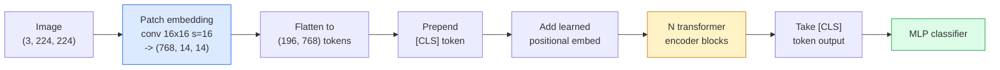

# 视力转换器 (ViT)

> 将图像切成补丁,把每个补丁当作一个词,运行标准变压器――不要回头看――

**类型：**构建
**语言：**字符串
**前置要求：**阶段7课时02 (自我注意),阶段4课时04 (图像分类)
**时间：**时间45分钟

## 学习目标

- 从零实现补丁嵌入,学习定位嵌入,类代币和变压器编码区块,构建一个最小的ViT
- 解释为什么VIT曾被认为需要海量预训练数据,直到DeiT和MAE证明并非如此
- 从架构先验角度比较ViT、Swin 和 ConvNeXt(无先验、本地窗口注意、conv脊柱)
- 使用 `timm`和标准线性探测 /细调流程,在小数据集上细调预训 ViT

## 问题

十年来,转变几乎就是计算机视觉的同义词.CNN具有强大的诱导偏见,包括本地化,翻译等式,没有人认为你能替代它们.

关键在于规模足够大──在ImageNet-1k上,ViT输送了ResNet──先在ImageNet-21k或JFT-300M上预训练,再在ImageNet-1k上精细调的ViT则超过它──当时的结论是:变压器缺乏有用的先验,但可以从足够多的数据中学习这些先验──后续工作 ((DeiT、MAE、DINO) 表明,只要训练配方正确,例如强增强、自监督预训练、蒸,ViT在小数据上也可以训练很好──

到2026年,纯CNN在边缘设备上仍然有竞争力,但变压器主导了其他几乎所有方向:分类,检测,Clip,VJEPA,视频,维特区块结构是必须掌握的内容.

## 核心概念

### 流程



七步骤――补丁 -> 代币 -> 注意 -> 分类器――每个变体(DeiT、Swin、ConvNeXt、MAE预训) 都只改变这七步中的一个两个,其余保持不变――

### 补丁嵌入

第一个卷是关键──内核尺寸16节,因此一张224x224 图像会变成14x14的网格,由16x16补丁组成,每个补丁被投影为768维嵌入──这个单独的卷同时完成补丁和线性投影──

```
Input:  (3, 224, 224)
Conv (3 -> 768, k=16, s=16, no padding):
Output: (768, 14, 14)
Flatten spatial: (196, 768)
```

196个补丁 = 196个代币――每个代币的特征尺寸是768个.

### 类代币

在序列前加上一个学习的向量:

```
tokens = [CLS; patch_1; patch_2; ...; patch_196]   shape (197, 768)
```

经过N 个变压器块后,`[CLS]`输出就是全局图像表示──分类头只读取这个向量──

### 位置嵌入

变形器没有内置的空间位置概念.

```
tokens = tokens + learned_pos_embedding   (also shape (197, 768))
```

这个嵌入是模型的一个参数;基于梯度的训练将使它适应2D图像结构.

### 变压器编码器块

标准结构――多头自主关注――MLP、残留连接――前层规则――

```
x = x + MSA(LN(x))
x = x + MLP(LN(x))

MLP is two-layer with GELU: Linear(d -> 4d) -> GELU -> Linear(4d -> d)
```

维特-B/16 堆积了12个这样的块,每个块都有12个注意力头,总计86M参数.

### 为什么使用前LN

早期变压器 使用后LN(`x = LN(x + sublayer(x))`没有加热,训练超过6-8层就很难――`x = x + sublayer(LN(x))`) 在没有加热的情况下可以稳定训练更深的网络――每个VIT和每个现代LLM都使用LN前――

### 补丁尺寸权衡

-  16x16补丁 -> 196 个代币,标准设置──
- 它们的分辨率更低.
- 八倍八倍的补丁 -> 784个代币,更精细,但O(n^2) 关注成本很差.

更大的补丁 = 更少的代币 = 更快但空间细节更少──SwinV2 在等级窗户中使用4x4补丁──

### 通过视频,我们可以看到

首先,我们需要JFT-300M才能超过CNN――DeiT(Touvron等,2020) 只使用ImageNet-1k,就通过四项改动把ViT-B训练到81.8%的前一:

1. 强大的增强:随机增长,混合,切割混合,随机删除.
2. 随时丢弃整个块)
3. 复制增强,每批中采样3次)
4. 通过CNN老师进行蒸,将进一步提升精度.

每个现代的ViT训练配方都源于DeiT.

### 斯文 VS 康文

- **Swin**(Liu et al., 2021) 基于窗口的注意力. 每个块只在本地窗口内进行注意力.
- **ConvNeXt** 重新设计的CNN,匹配Swin的架构选择 深度的 convs、LayerNorm、GELU、反向瓶)  表明差距并不是注意力与卷曲,而是现代训练配方+架构──

在2026年,ConvNeXt-V2 和 Swin-V2 都是生产级选择;正确选择取决于你的推理堆(ConvNeXt 更适合边缘编译) 和预训练体──

### 预训练

面具自动编码器 (Masked Autoencoder) 随机面具 75%的补丁,训练编码器只处理可见的 25%,再训练一个小编码器,根据编码器输出重建被掩盖的补丁――预训练完成后,丢弃了编码器并调整了编码器――

让ViT只能使用ImageNet-1k也可训练,达到SOTA,并且是当前默认的自我监督配方.


```figure
batchnorm-inference
```

## 构建它

### 步骤1: 补丁嵌入

```python
import torch
import torch.nn as nn

class PatchEmbedding(nn.Module):
    def __init__(self, in_channels=3, patch_size=16, dim=192, image_size=64):
        super().__init__()
        assert image_size % patch_size == 0
        self.proj = nn.Conv2d(in_channels, dim, kernel_size=patch_size, stride=patch_size)
        num_patches = (image_size // patch_size) ** 2
        self.num_patches = num_patches

    def forward(self, x):
        x = self.proj(x)
        return x.flatten(2).transpose(1, 2)
```

一个共存,一个平坦,一个转换.

### 步骤 2:变压器块

带着GELU的MLP,残留连接.

```python
class Block(nn.Module):
    def __init__(self, dim, num_heads, mlp_ratio=4, dropout=0.0):
        super().__init__()
        self.ln1 = nn.LayerNorm(dim)
        self.attn = nn.MultiheadAttention(dim, num_heads, dropout=dropout, batch_first=True)
        self.ln2 = nn.LayerNorm(dim)
        self.mlp = nn.Sequential(
            nn.Linear(dim, dim * mlp_ratio),
            nn.GELU(),
            nn.Dropout(dropout),
            nn.Linear(dim * mlp_ratio, dim),
            nn.Dropout(dropout),
        )

    def forward(self, x):
        a, _ = self.attn(self.ln1(x), self.ln1(x), self.ln1(x), need_weights=False)
        x = x + a
        x = x + self.mlp(self.ln2(x))
        return x
```

`nn.MultiheadAttention`负责拆分头,量化点产品和输出投影.`batch_first=True`于是,形状是`(N, seq, dim)`,我知道.

### 步骤3: 

```python
class ViT(nn.Module):
    def __init__(self, image_size=64, patch_size=16, in_channels=3,
                 num_classes=10, dim=192, depth=6, num_heads=3, mlp_ratio=4):
        super().__init__()
        self.patch = PatchEmbedding(in_channels, patch_size, dim, image_size)
        num_patches = self.patch.num_patches
        self.cls_token = nn.Parameter(torch.zeros(1, 1, dim))
        self.pos_embed = nn.Parameter(torch.zeros(1, num_patches + 1, dim))
        self.blocks = nn.ModuleList([
            Block(dim, num_heads, mlp_ratio) for _ in range(depth)
        ])
        self.ln = nn.LayerNorm(dim)
        self.head = nn.Linear(dim, num_classes)
        nn.init.trunc_normal_(self.pos_embed, std=0.02)
        nn.init.trunc_normal_(self.cls_token, std=0.02)

    def forward(self, x):
        x = self.patch(x)
        cls = self.cls_token.expand(x.size(0), -1, -1)
        x = torch.cat([cls, x], dim=1)
        x = x + self.pos_embed
        for blk in self.blocks:
            x = blk(x)
        x = self.ln(x[:, 0])
        return self.head(x)

vit = ViT(image_size=64, patch_size=16, num_classes=10, dim=192, depth=6, num_heads=3)
x = torch.randn(2, 3, 64, 64)
print(f"output: {vit(x).shape}")
print(f"params: {sum(p.numel() for p in vit.parameters()):,}")
```

实际的VIT-B是86M;使用同一个类定义,并设置`dim=768, depth=12, num_heads=12`,我知道.

### 步骤4: 智力检查  单图像推断

```python
logits = vit(torch.randn(1, 3, 64, 64))
print(f"logits: {logits}")
print(f"probs:  {logits.softmax(-1)}")
```

应该能无错运行――概率总和为1――

## 使用它

`timm`提供了所有VT变体及其ImageNet预训练的权重.

```python
import timm

model = timm.create_model("vit_base_patch16_224", pretrained=True, num_classes=10)
```

`timm`它在同一个API下支持VIT、DeiT、Swin、Swin-V2、ConvNeXt、ConvNeXt-V2、MaxViT、MViT、EfficientFormer以及数十种其他模型.

对于多模式工作 (图片+文本),`transformers`提供Clip、SigLIP、BLIP-2、LLaVA──这些模型中的图像编码器都是某种VIT变体──

## 交付它

本课会产出:

- `outputs/prompt-vit-vs-cnn-picker.md` 一个提示,根据数据集尺寸,计算和推断堆,在VIT,ConvNeXt或Swin之间做选择.
- `outputs/skill-vit-patch-and-pos-embed-inspector.md` 一个技能,用于验证VIT的补丁嵌入和位置嵌入形状 是否匹配模型期望的序列长度,捕获最常见的移植 bug──

## 练习

1. **（Easy）**打印上小型ViT 中一次前进传递的每个中间子形状──确认:输入`(N, 3, 64, 64)`-> 补丁`(N, 16, 192)`-> 与CLS`(N, 17, 192)`-> 分类器输入`(N, 192)`-> 输出`(N, num_classes)`,我知道.
2. **（Medium）**在第4课中,合成CIFAR数据集进行精细调节,`timm`报告训练时间和最终准确性
3. **（Hard）**为小型 ViT 实现MAE预训练:面具75%的补丁,训练编码器 + 一个小解码器 来重建被面具补丁――比较预训练前后在合成数据上的线性探测精度――

## 关键术语

| Term | 人们常说 | 实际含义 |
|------|----------------|----------------------|
| Patch embedding | “第一个 conv” | kernel size = stride = patch size 的 conv；将图像转换为 token embeddings 的网格 |
| Class token | “[CLS]” | 加在 token sequence 前面的 learned vector；它的最终 output 是全局图像表示 |
| Positional embedding | “Learned pos” | 添加到每个 token 上的 learned vector，让 transformer 知道每个 patch 来自哪里 |
| Pre-LN | “LayerNorm before sublayer” | 稳定的 transformer 变体：使用 `x + sublayer(LN(x))`，而不是 `LN(x + sublayer(x))` |
| Multi-head attention | “Parallel attention” | 标准 transformer attention，被拆分为 num_heads 个独立子空间，之后再 concatenated |
| ViT-B/16 | “Base, patch 16” | 规范尺寸：dim=768、depth=12、heads=12、patch_size=16、image=224；约 86M params |
| DeiT | “Data-efficient ViT” | 只用 ImageNet-1k 并配合强 augmentation 训练的 ViT；证明大型 pretraining datasets 并非绝对必要 |
| MAE | “Masked autoencoder” | Self-supervised pretraining：mask 75% 的 patches 并重建；主流 ViT pretraining 配方 |

## 延伸阅读

- [An Image is Worth 16x16 Words (Dosovitskiy et al., 2020)](https://arxiv.org/abs/2010.11929) ViT 论文
- [DeiT: Data-efficient Image Transformers (Touvron et al., 2020)](https://arxiv.org/abs/2012.12877)如何只使用ImageNet-1k 训练ViT
- [Masked Autoencoders are Scalable Vision Learners (He et al., 2022)](https://arxiv.org/abs/2111.06377) 预训练
- [timm documentation](https://huggingface.co/docs/timm) 你在生产中使用的每种视觉变压器的参考文档
