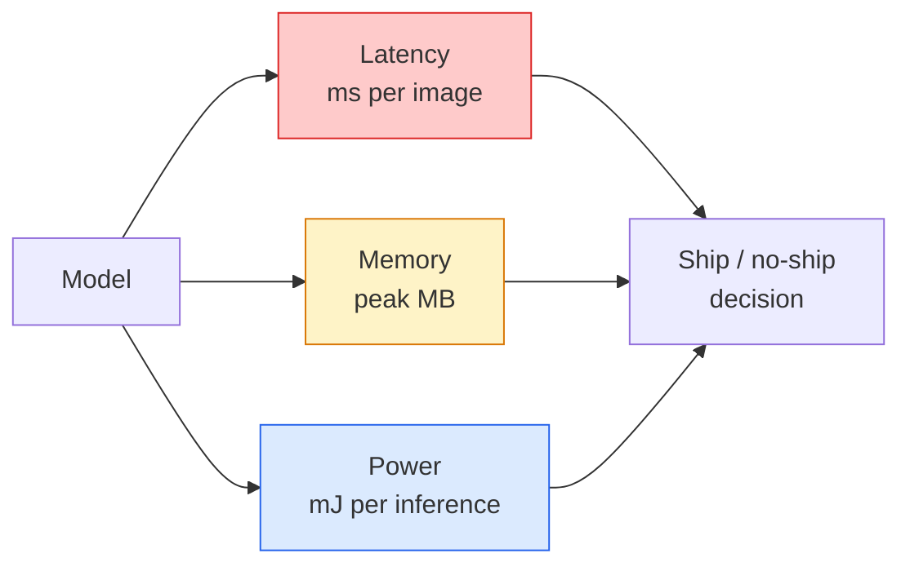

# 实时视觉 边缘部署

> 边缘推断是让一个90度精度模型在只有2GB的RAM设备上运行30fps的工程学科. 每个百分点的精度都需要与毫秒级延迟进行交换.

**Type:** Learn + Build
**Languages:** Python
**Prerequisites:** Phase 4 Lesson 04 (Image Classification), Phase 10 Lesson 11 (Quantization)
**Time:** ~75 minutes

## 学习目标
- 测量任意 PyTorch模型的推断延迟、峰值内存和吞吐量,并读懂FLOPs / params /延迟 之间的权衡
- 使用 PyTorch 的训练后量化将视觉模型量化为INT8,并验证精度损失 < 1%
- 导出到ONNX,并使用ONNX运行时间或TensorRT 编译;说出三种最常见的导出失败原因及其修复方式
- 解释在边缘 约束下何时选择移动网V3、EfficientNet-Lite、ConvNeXt-Tiny 或移动ViT

## 问题
训练阶段的视觉模型通常是一个浮点 巨兽──100M参数──每次前进通过10GFLOP──2GBVRAM──这些都无法安装在手机,车载信息娱乐单元、工业相机或无人机──交付一个视觉系统,这意味着要把同样的预测能力塞进小的预算中100倍──

大部分工作由三个旋转完成:模型选择(使用相同的配方的更小架构) 量化(使用INT8 替代FP32) 和推断运行时间(ONNX运行时间、TensorRT、Core ML、TFLite) ⋅把它们调整,决定你做的是一个只能在工作站上运行的演示,还有一个可以部署到30美元的摄像头模块的产品──

本课首先建立测量学科,然后讲述这三个旋律. 目标不是学习每一个边缘运行时间,而是知道有哪些杆,以及如何验证每一个杆确实完成了你认为它正在做的事情.

## 概念
### 三个预算



- **Latency**只有看p50 平均值会掩盖对实时系统的重要尾部行为.
- **Peak memory**设备曾经见过的最大值,而不是稳定状态平均值.
- **Power / energy**电池供电设备上每次推断的千元――通常使用CPU/GPU利用 *时间近似――

边缘决策依赖于一个张 (模型,延迟,内存,精度) 表――每个单元都必须在目标设备上测量,而不是在工作站上――

### 测量纪律

每次边缘配置文件都应该遵守三条规则:

1. 在测量前使用5-10次的木偶前进通过**Warm up**模型──冷缓存和JIT编译 会产生不代表性的首次数值──
2. 在时间区块前后使用`torch.cuda.synchronize()` **Synchronise**没有,你测到的是内核发射,而不是内核执行.
3. 将输入尺寸**Fix**产量分辨率224x224 上的延迟不仅仅是512x512 上的延迟.

### 作为代理

作为一个FLOPs多10%的模型,实践中可能快2x,因为它使用了更适合硬件的 ops,深度合合合合合合合合,大7x7合合合不一定).

规则:使用FLOP做建筑搜索,使用设备上的延迟做部署决定.

### 量化 一段话说明

用INT8 替换FP32重量和激活式. 模型大小降低4x,内存带宽降低4x,在拥有INT8内核的硬件上计算降低2~4x.

类型:

- **Dynamic** 将重量量化为INT8,激活以FP计算.
- **Static (post-training)** 量化重量,并设置小型校准上校准激活范围──比动态快得多──
- **Quantisation-aware training (QAT)** 在训练期间模拟量化,让模型学会适应它.

对于视觉来说,在训练后,使用5%的工作量获得95%的收益.

### 切割和蒸

- **Pruning** 移除不重要的重量 (基于大小) 或道 (基于结构) ⋅对过度参数模型 (过度参数) 很有效;对已经非常紧的架构 (使用较小).
- **Distillation** 训练一个小学生 去模仿大老师的逻辑――通常能恢复缩小模型 后损失的大部分精度――生产边缘模型的标准做法――

### 推移运行时间

- **PyTorch eager** 慢,不适合部署――仅用于开发――
- **TorchScript**遗产──已被被`torch.compile`和 ONNX出口取代
- **ONNX Runtime** 中立运行时间──CPU、CUDA、CoreML、TensorRT、OpenVINO 都有ONNX供应商──从这里开始──
- **TensorRT** NVIDIA 的编译器──在NVIDIA GPUs(工作站和Jetson) 上延迟 最佳──可与 ONNX 运行时间 集成,也可独立使用──
- **Core ML**果的iOS/macOS运行时间.`.mlmodel`或`.mlpackage`,我知道.
- **TFLite**谷歌的Android/ARM运行时间.`.tflite`,我知道.
- **OpenVINO**英特尔的CPU/VPU运行时间.`.xml`其他`.bin`,我知道.

实践中:出口 PyTorch -> ONNX -> 为目标选择运行时间。ONNX 是语言法语。

### 边缘建筑选手

| Budget | Model | Why |
|--------|-------|-----|
| < 3M params | MobileNetV3-Small | 到处都能编译，是很好的 baseline |
| 3-10M | EfficientNet-Lite-B0 | TFLite 上每 param 的 accuracy 最好 |
| 10-20M | ConvNeXt-Tiny | accuracy-per-param 最好，且 CPU-friendly |
| 20-30M | MobileViT-S or EfficientViT | 具备 ImageNet accuracy 的 Transformer |
| 30-80M | Swin-V2-Tiny | 如果 stack 支持 window attention |

除非有明确的理由不这样做,否则将所有这些量化为INT8──


```figure
cnn-param-count
```

## 构建它
### 步骤1: 正确测量延迟

```python
import time
import torch

def measure_latency(model, input_shape, device="cpu", warmup=10, iters=50):
    model = model.to(device).eval()
    x = torch.randn(input_shape, device=device)
    with torch.no_grad():
        for _ in range(warmup):
            model(x)
        if device == "cuda":
            torch.cuda.synchronize()
        times = []
        for _ in range(iters):
            if device == "cuda":
                torch.cuda.synchronize()
            t0 = time.perf_counter()
            model(x)
            if device == "cuda":
                torch.cuda.synchronize()
            times.append((time.perf_counter() - t0) * 1000)
    times.sort()
    return {
        "p50_ms": times[len(times) // 2],
        "p95_ms": times[int(len(times) * 0.95)],
        "p99_ms": times[int(len(times) * 0.99)],
        "mean_ms": sum(times) / len(times),
    }
```

热,同步,使用 `time.perf_counter()`△报告百分比,而不仅仅是意思.

### 步骤 2:参数和FLOP数量

```python
def parameter_count(model):
    return sum(p.numel() for p in model.parameters())

def flops_estimate(model, input_shape):
    """
    Rough FLOP count for a conv/linear-only model. For production use `fvcore` or `ptflops`.
    """
    total = 0
    def conv_hook(m, inp, out):
        nonlocal total
        c_out, c_in, kh, kw = m.weight.shape
        h, w = out.shape[-2:]
        total += 2 * c_in * c_out * kh * kw * h * w
    def linear_hook(m, inp, out):
        nonlocal total
        total += 2 * m.in_features * m.out_features
    hooks = []
    for m in model.modules():
        if isinstance(m, torch.nn.Conv2d):
            hooks.append(m.register_forward_hook(conv_hook))
        elif isinstance(m, torch.nn.Linear):
            hooks.append(m.register_forward_hook(linear_hook))
    model.eval()
    with torch.no_grad():
        model(torch.randn(input_shape))
    for h in hooks:
        h.remove()
    return total
```

真实项目中使用 `fvcore.nn.FlopCountAnalysis`或`ptflops`它们可以正确处理每个模块类型.

### 步骤3:训练后的静态定量化

```python
def quantise_ptq(model, calibration_loader, backend="x86"):
    import torch.ao.quantization as tq
    model = model.eval().cpu()
    model.qconfig = tq.get_default_qconfig(backend)
    tq.prepare(model, inplace=True)
    with torch.no_grad():
        for x, _ in calibration_loader:
            model(x)
    tq.convert(model, inplace=True)
    return model
```

三个步骤:配置,准备,插入观察者,用真实数据校准,转换,接,量化.`Conv -> BN -> ReLU`其他`ConvBnReLU`),可由`torch.ao.quantization.fuse_modules`处理.

### 步骤 4: 导出到ONNX

```python
def export_onnx(model, sample_input, path="model.onnx"):
    model = model.eval()
    torch.onnx.export(
        model,
        sample_input,
        path,
        input_names=["input"],
        output_names=["output"],
        dynamic_axes={"input": {0: "batch"}, "output": {0: "batch"}},
        opset_version=17,
    )
    return path
```

`opset_version=17`据悉,`dynamic_axes`让你可以使用任意的批量大小运行ONNX模型.

### 步骤5:基准并与不同制度进行比较

```python
import torch.nn as nn
from torchvision.models import mobilenet_v3_small

def compare_regimes():
    model = mobilenet_v3_small(weights=None, num_classes=10)
    params = parameter_count(model)
    flops = flops_estimate(model, (1, 3, 224, 224))
    lat_fp32 = measure_latency(model, (1, 3, 224, 224), device="cpu")
    print(f"FP32 MobileNetV3-Small: {params:,} params  {flops/1e9:.2f} GFLOPs  "
          f"p50={lat_fp32['p50_ms']:.2f}ms  p95={lat_fp32['p95_ms']:.2f}ms")
```

对于`resnet50`,我知道.`efficientnet_v2_s`和 `convnext_tiny`运行同一个函数,你就能得到部署决策所需的比较表.

## 使用它
生产堆通常收到三条路径之一:

- **Web / serverless**对于大多数场景来说,最简单的就是足够好.
- **NVIDIA edge (Jetson, GPU server)**电器:PyTorch -> ONNX -> 电压RT──延迟 最佳,工程努力最大──
- **Mobile**鱼 -> ONNX -> 核心ML (iOS) 或 TFLite (Android) 导出前先量化。

测量方面,`torch-tb-profiler`,我知道.`nvprof`现在,`nsys`对于 macOS 上的仪器,可以提供层次的分类.`benchmark_app`酒,酒,酒,酒,酒,酒,酒,酒,酒,酒,酒,酒,酒,酒,酒,酒,酒.`trtexec`能给出一个独立的CLI数字.

## 交付它
本课会产出:

- `outputs/prompt-edge-deployment-planner.md`一个提示,根据目标设备和延迟SLA 选择后台、定量化策略和运行时间――
- `outputs/skill-latency-profiler.md` 一个技能,用于编写完整的延迟标记脚本,包含加热,同步,百分比和记忆跟踪.

## 练习
1. **(Easy)**在CPU上以224x224测量`resnet18`,我知道.`mobilenet_v3_small`,我知道.`efficientnet_v2_s`和 `convnext_tiny`报告表格,并指出哪个建筑的精度-per-ms 最好――
2. **(Medium)**对于`mobilenet_v3_small`应用训练后静态定量化――报告 CIFAR-10 或类似数据集 持久子集 上的FP32与INT8延迟和准确性损失――
3. **(Hard)**将`convnext_tiny`导出到ONNX,用`CPUExecutionProvider`通过`onnxruntime`运行,并将延迟与 PyTorch 热情基线比较.

## 关键术语
| Term | What people say | What it actually means |
|------|----------------|----------------------|
| Latency | “有多快” | 从 input 到 output 的时间；看 p50/p95/p99 percentiles，而不是 mean |
| FLOPs | “Model size” | 每次 forward pass 的 floating-point ops；compute cost 的粗略 proxy |
| INT8 quantisation | “8-bit” | 用 8-bit integers 替代 FP32 weights/activations；体积约小 4x，速度快 2-4x |
| PTQ | “Post-training quantisation” | 在不 retraining 的情况下量化 trained model；简单，通常足够 |
| QAT | “Quantisation-aware training” | 训练期间模拟 quantisation；accuracy 最好，需要 labelled data |
| ONNX | “中立格式” | 每个主流 inference runtime 都支持的 model exchange format |
| TensorRT | “NVIDIA compiler” | 将 ONNX 编译为面向 NVIDIA GPUs 的 optimised engine |
| Distillation | “Teacher -> student” | 训练 small model 去模仿 big model 的 logits；恢复大部分损失的 accuracy |

## 延伸阅读
- [EfficientNet (Tan & Le, 2019)](https://arxiv.org/abs/1905.11946) 高效架构的复合扩展
- [MobileNetV3 (Howard et al., 2019)](https://arxiv.org/abs/1905.02244)移动首要架构,包含h-swish 和挤压-激动
- [A Practical Guide to TensorRT Optimization (NVIDIA)](https://developer.nvidia.com/blog/accelerating-model-inference-with-tensorrt-tips-and-best-practices-for-pytorch-users/) 如何真正获得论文中的吞吐量数
- [ONNX Runtime docs](https://onnxruntime.ai/docs/)量化,图表优化,供应商选择
