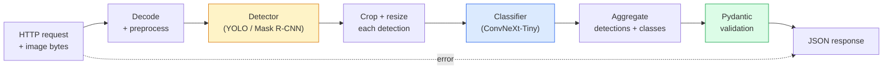

# 构建完整的视觉管道  石头

> 生产级视觉系统是由模型和规则组成的链条,并通过数据合同 串联起来.本阶段的组件已经准备好;这个结石将把它们端到端连接起来.

**Type:** Build
**Languages:** Python
**Prerequisites:** Phase 4 Lessons 01-15
**Time:** ~120 minutes

## 学习目标
- 设计一个生产级视觉管道,用于检测对象,对其分类,并输出结构化JSON,同时处理所有失败路径
- 将检测器 (R-CNN或YOLO) 类别器 (ConvNeXt-Tiny) 和数据合同 (Pydantic) 接入同一个服务
- 进行标识,并识别第一个瓶 (通常是预处理,然后是检测器)
- 发布最小的FastAPI服务,接受图像上传,运行管道,并返回带有分类的检测结果

## 问题
单个视觉模型 很有用;视觉产品是由它们组成的链条.零售货架审计是检测器 加产品分类器 再加价格-OCR管道.自动驾驶是二维检测器 加3D检测器 加段器 加跟踪器 加规划器.

把这些链接连接起来,正是区分ML原型和产品的关键部分.模型之间的每个界面都是新的错误源. 每次坐标转换,每次正常化,每次面具大小变化,都可能成为沉默失败点.

这个顶石 建立最小可用的管道:检测+分类+结构化输出+服务层――4阶段中其他内容可以插入这个结构:把面具R-CNN换成YOLOv8,添加OCR头,添加细分分支,添加跟踪器――架构是稳定的;组件是可插拔的――

## 概念
### 管道



七阶段――两个模型阶段 开销很大;另一个五阶段则是出现错误的最常见的地方――

### 使用Pydantic 定义数据合同

每个模型的边界都变成了一个类型化对象.

```
Detection(
    box: tuple[float, float, float, float],   # (x1, y1, x2, y2), absolute pixels
    score: float,                              # [0, 1]
    class_id: int,                             # from detector's label map
    mask: Optional[list[list[int]]],           # RLE-encoded if present
)

PipelineResult(
    image_id: str,
    detections: list[Detection],
    classifications: list[Classification],
    inference_ms: float,
)
```

当探测器回归的是`(cx, cy, w, h)`而不是`(x1, y1, x2, y2)`时,Pydantic的验证会在边界处失败,你会立即发现问题,而不是去调试一个下游作物,它只是静静返回空域.

### 延迟花在哪里

几乎每个视觉管道都满足三条事实:

1. **Preprocessing 通常是最大的单个模块。**解码JPEG,转换颜色空间,尺寸,这些都是CPU绑定,而且很容易被忽略.
2. **Detector 主导 GPU 时间。**显示器的时间在检测前进通过上.
3. **Postprocessing（NMS、RLE encode/decode）在 GPU 上便宜，在 CPU 上昂贵。**一定要用真实目标环境来进行配置.

了解分布,才能使优化成为优先清单.

### 失败模式

- **Empty detections** 返回空列表,不要崩――记录日志――
- **Out-of-bounds boxes**剪切前到图像尺寸.
- **Tiny crops**对小于分类器 最小输入尺寸的盒子 跳过分类.
- **Corrupt upload** 返回带有具体错误代码的400个响应,而不是500个.
- **Model load failure** 在服务启动中失败,而不是在第一个请求中失败.

产品级管道将处理每一个情况,而不是写一个普遍的.`try/except`把失败隐藏起来. 每个失败都有命名代码和答案.

### 批量

生产级服务 会服务多个客户──跨请求 对检测和分类 进行批量可成倍提升吞吐量──代价是:等待批量 填满会带来额外延迟──典型设置:最多收集20ms的请求,合并成批量,处理,再发送响应──`torchserve`和 `triton`预测可负载的小型服务通常会自行实现微型批量.


```figure
v4-vision-pipeline
```

## 构建它
### 步骤1:数据合同

```python
from pydantic import BaseModel, Field
from typing import List, Optional, Tuple

class Detection(BaseModel):
    box: Tuple[float, float, float, float]
    score: float = Field(ge=0, le=1)
    class_id: int = Field(ge=0)
    mask_rle: Optional[str] = None


class Classification(BaseModel):
    detection_index: int
    class_id: int
    class_name: str
    score: float = Field(ge=0, le=1)


class PipelineResult(BaseModel):
    image_id: str
    detections: List[Detection]
    classifications: List[Classification]
    inference_ms: float
```

五秒钟的代码,可以为任何严格的管道节省一小时调试时间.

### 步骤2: 一个最小的管道类

```python
import time
import numpy as np
import torch
from PIL import Image

class VisionPipeline:
    def __init__(self, detector, classifier, class_names,
                 device="cpu", min_crop=32):
        self.detector = detector.to(device).eval()
        self.classifier = classifier.to(device).eval()
        self.class_names = class_names
        self.device = device
        self.min_crop = min_crop

    def preprocess(self, image):
        """
        image: PIL.Image or np.ndarray (H, W, 3) uint8
        returns: CHW float tensor on device
        """
        if isinstance(image, Image.Image):
            image = np.asarray(image.convert("RGB"))
        tensor = torch.from_numpy(image).permute(2, 0, 1).float() / 255.0
        return tensor.to(self.device)

    @torch.no_grad()
    def detect(self, image_tensor):
        return self.detector([image_tensor])[0]

    @torch.no_grad()
    def classify(self, crops):
        if len(crops) == 0:
            return []
        batch = torch.stack(crops).to(self.device)
        logits = self.classifier(batch)
        probs = logits.softmax(-1)
        scores, cls = probs.max(-1)
        return list(zip(cls.tolist(), scores.tolist()))

    def run(self, image, image_id="anonymous"):
        t0 = time.perf_counter()
        tensor = self.preprocess(image)
        det = self.detect(tensor)

        crops = []
        detections = []
        valid_indices = []
        for i, (box, score, cls) in enumerate(zip(det["boxes"], det["scores"], det["labels"])):
            x1, y1, x2, y2 = [max(0, int(b)) for b in box.tolist()]
            x2 = min(x2, tensor.shape[-1])
            y2 = min(y2, tensor.shape[-2])
            detections.append(Detection(
                box=(x1, y1, x2, y2),
                score=float(score),
                class_id=int(cls),
            ))
            if (x2 - x1) < self.min_crop or (y2 - y1) < self.min_crop:
                continue
            crop = tensor[:, y1:y2, x1:x2]
            crop = torch.nn.functional.interpolate(
                crop.unsqueeze(0),
                size=(224, 224),
                mode="bilinear",
                align_corners=False,
            )[0]
            crops.append(crop)
            valid_indices.append(i)

        class_preds = self.classify(crops)

        classifications = []
        for valid_idx, (cls_id, cls_score) in zip(valid_indices, class_preds):
            classifications.append(Classification(
                detection_index=valid_idx,
                class_id=int(cls_id),
                class_name=self.class_names[cls_id],
                score=float(cls_score),
            ))

        return PipelineResult(
            image_id=image_id,
            detections=detections,
            classifications=classifications,
            inference_ms=(time.perf_counter() - t0) * 1000,
        )
```

每个界面都是类型化的. 每个失败路径都有明确的处理决策.

### 步骤3:连接一个探测器和一个分类器

```python
from torchvision.models.detection import maskrcnn_resnet50_fpn_v2
from torchvision.models import convnext_tiny

# Use ImageNet-pretrained weights for a realistic pipeline without training
detector = maskrcnn_resnet50_fpn_v2(weights="DEFAULT")
classifier = convnext_tiny(weights="DEFAULT")
class_names = [f"imagenet_class_{i}" for i in range(1000)]

pipe = VisionPipeline(detector, classifier, class_names)

# Smoke test with a synthetic image
test_image = (np.random.rand(400, 600, 3) * 255).astype(np.uint8)
result = pipe.run(test_image, image_id="demo")
print(result.model_dump_json(indent=2)[:500])
```

### 步骤4:快速API服务

```python
from fastapi import FastAPI, UploadFile, HTTPException
from io import BytesIO

app = FastAPI()
pipe = None  # initialised on startup

@app.on_event("startup")
def load():
    global pipe
    detector = maskrcnn_resnet50_fpn_v2(weights="DEFAULT").eval()
    classifier = convnext_tiny(weights="DEFAULT").eval()
    pipe = VisionPipeline(detector, classifier, class_names=[f"c{i}" for i in range(1000)])

@app.post("/detect")
async def detect_endpoint(file: UploadFile):
    if file.content_type not in {"image/jpeg", "image/png", "image/webp"}:
        raise HTTPException(status_code=400, detail="unsupported image type")
    data = await file.read()
    try:
        img = Image.open(BytesIO(data)).convert("RGB")
    except Exception:
        raise HTTPException(status_code=400, detail="cannot decode image")
    result = pipe.run(img, image_id=file.filename or "upload")
    return result.model_dump()
```

使用 `uvicorn main:app --host 0.0.0.0 --port 8000`运行.`curl -F 'file=@dog.jpg' http://localhost:8000/detect`测试――

### 步骤5:标记这个管道

```python
import time

def benchmark(pipe, num_runs=20, image_size=(400, 600)):
    img = (np.random.rand(*image_size, 3) * 255).astype(np.uint8)
    pipe.run(img)  # warm up

    stages = {"preprocess": [], "detect": [], "classify": [], "total": []}
    for _ in range(num_runs):
        t0 = time.perf_counter()
        tensor = pipe.preprocess(img)
        t1 = time.perf_counter()
        det = pipe.detect(tensor)
        t2 = time.perf_counter()
        crops = []
        for box in det["boxes"]:
            x1, y1, x2, y2 = [max(0, int(b)) for b in box.tolist()]
            x2 = min(x2, tensor.shape[-1])
            y2 = min(y2, tensor.shape[-2])
            if (x2 - x1) >= pipe.min_crop and (y2 - y1) >= pipe.min_crop:
                crop = tensor[:, y1:y2, x1:x2]
                crop = torch.nn.functional.interpolate(
                    crop.unsqueeze(0), size=(224, 224), mode="bilinear", align_corners=False
                )[0]
                crops.append(crop)
        pipe.classify(crops)
        t3 = time.perf_counter()
        stages["preprocess"].append((t1 - t0) * 1000)
        stages["detect"].append((t2 - t1) * 1000)
        stages["classify"].append((t3 - t2) * 1000)
        stages["total"].append((t3 - t0) * 1000)

    for stage, times in stages.items():
        times.sort()
        print(f"{stage:12s}  p50={times[len(times)//2]:7.1f} ms  p95={times[int(len(times)*0.95)]:7.1f} ms")
```

在 GPU 上,检测是 20-40 ms,此时预处理+分类在相对占比上开始更重要.

## 使用它
生产模板最终会收到相同的结构,外加:

- **Model versioning** 始终在回应中记录模型名称 和权重哈希──
- **Per-request trace IDs**记录每个请求的每个阶段时间,这样就可以把缓慢的反应和阶段关联起来.
- **Fallback path** 如果分类器的时间过期,返回不带分类的检测,而不是让整个请求失败.
- **Safety filters** NSFW/PII过 在分类之后 响应 离开服务之前运行。
- **Batch endpoint**一个`/detect_batch`列表用于批量处理.

对于生产服务,`torchserve`,我知道.`Triton Inference Server`和 `BentoML`开箱即可处理批量,版本,计量和健康检查.`FastAPI`适合原型和小规模产品.

## 交付它
本课会产出:

- `outputs/prompt-vision-service-shape-reviewer.md` 一个提示,用于检查视觉服务 代码中的合同/响应形式 违规,并指出第一个破解 bug──
- `outputs/skill-pipeline-budget-planner.md`一个技能,给定目标延迟和吞吐量,为每个管道阶段分配时间预算,并标记哪个阶段会先超出预算――

## 练习
1. **(Easy)**在任意开放数据集中的10张图像 上运行管道――报告每个阶段的平均时间,以及每个张图像的检测数分布――
2. **(Medium)**给我一个`Detection`添加面具输出字段,并将其编码为RLE──验证即使是10个对象图像,JSON也保持在1MB以下──
3. **(Hard)**在分类器前添加一个微分组:最多收集10ms的收获,使用一次GPU调用它们全部分类,然后根据请求返回结果――测量在每秒5次同时请求下的吞吐量增长和延迟增加――

## 关键术语
| Term | What people say | What it actually means |
|------|----------------|----------------------|
| Pipeline | “系统” | 由 preprocessing、inference 和 postprocessing step 组成的有序链条，每一对 step 之间都有类型化 interface |
| Data contract | “schema” | 每个 stage 的 input 和 output 都必须符合的 Pydantic / dataclass 定义；在边界处捕获 integration bug |
| Preprocessing | “model 之前” | 解码、颜色转换、resizing、normalising；通常是最大的 CPU 时间消耗点 |
| Postprocessing | “model 之后” | NMS、mask resize、threshold、RLE encode；在 GPU 上便宜，在 CPU 上昂贵 |
| Microbatcher | “先收集再 forward” | 在固定窗口内等待多个 request，然后运行一次 batched forward pass 的 aggregator |
| Trace ID | “Request id” | 每个 request 的标识符，会在每个 stage 记录，因此 slow request 可以端到端追踪 |
| Failure code | “命名错误” | 每类 failure 都有具体 error code，而不是泛化的 500；支持 client retry logic |
| Health check | “Readiness probe” | 一个低成本 endpoint，用于报告 service 是否可以响应；loadbalancer 依赖它 |

## 延伸阅读
- [Full Stack Deep Learning — Deploying Models](https://fullstackdeeplearning.com/course/2022/lecture-5-deployment/) 生产级 ML部署的经典概述
- [BentoML docs](https://docs.bentoml.com) 支持批发,版本和指标的服务框架
- [torchserve docs](https://pytorch.org/serve/) PyTorch 官方服务图书馆
- [NVIDIA Triton Inference Server](https://developer.nvidia.com/triton-inference-server) 支持批发和多型的高吞吐量服务
