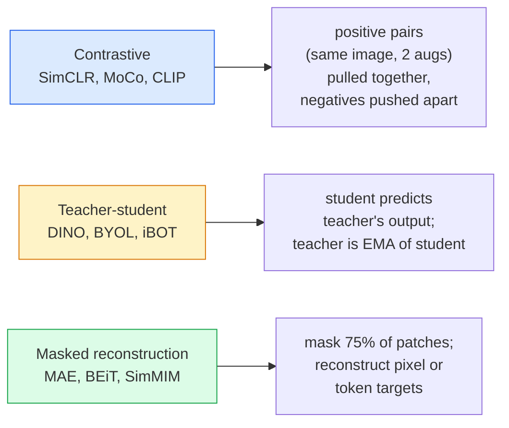

# 自我监督视觉  SimCLR,DINO,MAE

> 标签是监督视觉的瓶──自监督预训 移除它们:从100M张无标记图像中学习视觉特征,再在10k张有标记图像上细调──

**类型：**学习 + 构建
**语言：**字符串
**先修要求：**阶段4课04(图像分类,4课14(ViT)
**时间：**约75分钟

## 学习目标

- 理三大自我监督家庭 对比性                                                                                                                                                                                                                                                        
- 从零实现InfoNCE损失,并解释为什么批量规模为512可行,而批量规模为32会失败
- 解释为什么MAE的75%的隐藏比不随意设定,以及它与BERT的15%的文本有什么不同
- 使用DINOv2或MAE图像网检查站 进行线性探测和零射击检索

## 问题

监督图像网有1.3亿张有标记图像,据估计标记成本为10亿美元. 医疗和工业数据集更小,标记成本也更高. 每个视觉团队都会问:我们能否先在廉价的无标记数据上预训练?

通过监督学习,可以实现或超过监督的图像网准确率. 它也比监督预训练更好地迁移到下游任务.

概念上的转变是:前文任务  模型被训练完成任务  不一定是下游任务――关键在于它是否迫使模型学习有用特征――预测灰度尺度 图像的颜色、旋转图像并让模型分类旋转角度、面具补丁并重建它们

## 概念

### 三个家庭



### 具有对比性学习 (SimCLR)

取一张图像,应用两次随机增强,得到两个视图.将将二者送入同一个编码器加投影头.最小化一个损失.含义是:

```
Loss for positive pair (z_i, z_j) among 2N views per batch:

   L_ij = -log( exp(sim(z_i, z_j) / tau) / sum_k in batch \ {i} exp(sim(z_i, z_k) / tau) )

sim = cosine similarity
tau = temperature (0.1 standard)
```

这就是InfoNCE损失. 它要求每个正面都有许多负面,因此批量大小很重要. SimCLR需要512-8192.

### 学生教师 (DINO)

两个结构相同的网络:学生和教师――教师是学生权重的指数动态平均值 (EMA) ――二者都看到相同图像的增强视图――学生的输出被训练为匹配教师的输出

```
loss = CE( student_output(view_1),  teacher_output(view_2) )
     + CE( student_output(view_2),  teacher_output(view_1) )

teacher_weights = m * teacher_weights + (1 - m) * student_weights   (m ≈ 0.996)
```

为什么不会崩 成预测一个常量:教师的输出会被集中了(减去每个维度的平均值) 并被磨损了(除了较小的温度) ⋅中心化 防止某个维度占主导;磨损 防止输出崩 为统一──

是DINOv2 规模化基础,DINOv2 在 142M张 策划图像上训练――所得特征是当前零射击视觉检索和密集预测的SOTA──

### 面具重建 (MAE)

面具一个 ViT 输入中75%的补丁──只会看到25%的输入编码器──一个小的解码器 接收编码器──输出以及位于面具位置的面具代币,并被训练重建面具补丁的像素──

```
Encoder:  visible 25% of patches -> features
Decoder:  features + mask tokens at masked positions -> reconstructed pixels
Loss:     MSE between reconstructed and original pixels on masked patches only
```

让MAE 有效的关键设计选择:

- **75% mask ratio** 很高──迫使编码器 学习语义特征;重建25% 会接近微不足道的相邻像素的相关性太强,使得CNN都能轻松完成)──
- **Asymmetric encoder/decoder** 大型 ViT编码器只看到可见补丁;小解码器(8-层,512-dim) 处理重建――比朴素 BEiT预训练 快3倍――
- **Pixel-space reconstruction target**比BEIT的标记目标更简单,并且在ViT上效果更好.

之后,丢弃了解码器.

### 为什么是75%而不是15%

面膜 15% 的代币――MAE面膜 75%――差异在于信息密度――

- 预测 15% 的代币仍然很难,因为每个隐藏的位置都有很多可行的完成.
- 图像补丁的很低  一个未被掩盖的邻域通常几乎可以精确决定掩盖补丁的像素――要让预测需要语义理解,就必须激进地掩盖――

编码器必须表示图像内容.

### 线性探测评估

经过自我监督的预训 之后,标准评估是**linear probe**基于ImageNet标签的编码器 训练一个单层线性分类器――报告最准的准确性――

- 据悉,该公司的产品价格在中国的总产量上达到了75%的水平.
- 子子子子子子子子子子子子子子子子子子子子子子子子子子子子子子子子子子子子子子子子子子子子子子子子子子子子子子子子子子子子子子子子子子子子子子子子子子子子子子子子子子子子子子子子子子子子子子子子子子子子子子子子子子子子子子子子子子子子子子子子子子子子子子子子子子子子子子子子子子子子子子子子
- 果产品:大约76%
- 子子子子子子子子子子子子子子子子子子子子子子子子子子子子子子子子子子子子子子子子子子子子子子子子子子子子子子子子子子子子子子子子子子子子子子子子子子子子子子子子子子子子子子子子子子子子子子子子子子子子子子子子子子子子子子子子子子子子子子子子子子子子子子子子子子子子子子子

线性探测是对特征质量的纯衡量;细调通常会增加2-5个点,但也会混入头部重训的影响.


```figure
data-augmentation
```

## 构建它

### 步骤1:双视图增强管道

```python
import torch
import torchvision.transforms as T

two_view_train = lambda: T.Compose([
    T.RandomResizedCrop(96, scale=(0.2, 1.0)),
    T.RandomHorizontalFlip(),
    T.ColorJitter(0.4, 0.4, 0.4, 0.1),
    T.RandomGrayscale(p=0.2),
    T.ToTensor(),
])


class TwoViewDataset(torch.utils.data.Dataset):
    def __init__(self, base):
        self.base = base
        self.aug = two_view_train()

    def __len__(self):
        return len(self.base)

    def __getitem__(self, i):
        img, _ = self.base[i]
        v1 = self.aug(img)
        v2 = self.aug(img)
        return v1, v2
```

每个__getitem__返回同一图像的两个增长视图;不需要标签.

### 步骤2:信息丢失

```python
import torch.nn.functional as F

def info_nce(z1, z2, tau=0.1):
    """
    z1, z2: (N, D) L2-normalised embeddings of paired views
    """
    N, D = z1.shape
    z = torch.cat([z1, z2], dim=0)  # (2N, D)
    sim = z @ z.T / tau              # (2N, 2N)

    mask = torch.eye(2 * N, dtype=torch.bool, device=z.device)
    sim = sim.masked_fill(mask, float("-inf"))

    targets = torch.cat([torch.arange(N, 2 * N), torch.arange(0, N)]).to(z.device)
    return F.cross_entropy(sim, targets)
```

调用前先对嵌入 进行L2正常化.`tau=0.1`较低的值会让损失更尖,并需要更多的负面.

### 步骤3:卫生检查 InfoNCE

```python
z1 = F.normalize(torch.randn(16, 32), dim=-1)
z2 = z1.clone()
loss_same = info_nce(z1, z2, tau=0.1).item()
z2_random = F.normalize(torch.randn(16, 32), dim=-1)
loss_random = info_nce(z1, z2_random, tau=0.1).item()
print(f"InfoNCE with identical pairs:  {loss_same:.3f}")
print(f"InfoNCE with random pairs:     {loss_random:.3f}")
```

相同的对应应应得到较低的损失(大批和低温度下接近0) ・・・随机对应应得到log(2N-1) = ~log(31) = ~3.4,针对16对批──

### 步骤4:MAE风格的掩饰

```python
def random_mask_indices(num_patches, mask_ratio=0.75, seed=0):
    g = torch.Generator().manual_seed(seed)
    n_keep = int(num_patches * (1 - mask_ratio))
    perm = torch.randperm(num_patches, generator=g)
    visible = perm[:n_keep]
    masked = perm[n_keep:]
    return visible.sort().values, masked.sort().values


num_patches = 196
visible, masked = random_mask_indices(num_patches, mask_ratio=0.75)
print(f"visible: {len(visible)} / {num_patches}")
print(f"masked:  {len(masked)} / {num_patches}")
```

简单、快速,并且对给定种子是决定性的.

## 使用它

诺二是2026年生产标准:

```python
import torch
from transformers import AutoImageProcessor, AutoModel

processor = AutoImageProcessor.from_pretrained("facebook/dinov2-base")
model = AutoModel.from_pretrained("facebook/dinov2-base")
model.eval()

# Per-image embeddings for zero-shot retrieval
with torch.no_grad():
    inputs = processor(images=[pil_image], return_tensors="pt")
    outputs = model(**inputs)
    embedding = outputs.last_hidden_state[:, 0]  # CLS token
```

现在,我们已经开始使用了768维嵌入式的模拟器,它是现代图像检索,密集通信和零射传输管道的骨干.

对于图像文本嵌入,SigLIP或OpenCLIP 是应对方案;对于MAE风格的细节调整,`timm`报告提供了所有MAE检查点.

## 交付它

本课会产出:

- `outputs/prompt-ssl-pretraining-picker.md` 一个提示,根据数据集的大小,计算和下游任务 选择 SimCLR / MAE / DINOv2──
- `outputs/skill-linear-probe-runner.md` 一个技能,为任意的结编码器 +标记数据集编写线性探测评估――

## 练习

1. **（Easy）**验证:对于对齐良的嵌入,降温会使InfoNCE损失下降;对于随机嵌入,降温会使损失上升――生成一张`tau in [0.05, 0.1, 0.2, 0.5]`损失的图片
2. **（Medium）**实现一个DINO式中心缓冲器――展示如果没有中心,学生会在几个时代内崩为常量向量――
3. **（Hard）**使用10课中的小网 作为脊柱,在CIFAR-100上训练MAE──报告10、50和200个时代的线性探测精度──展示在同一个1000图片子集上,MAE训练的线性探测器 优于从零开始监督的线性探测器──

## 关键术语

| Term | 人们的说法 | 实际含义 |
|------|----------------|----------------------|
| Self-supervised | “Label-free” | 一种 pretext task，用于从无标注数据中产生有用 representations |
| Pretext task | “假任务” | SSL 期间使用的 objective（reconstruct patches、match views）；pretraining 后会被丢弃 |
| Linear probe | “Frozen encoder + linear head” | 标准 SSL 评估：只在 frozen features 之上训练一个 linear classifier |
| InfoNCE | “Contrastive loss” | 对 cosine similarities 做 softmax；positive pair 是目标类别，所有其他项都是 negatives |
| EMA teacher | “Moving-average teacher” | 权重是 student 的 exponential moving average 的 teacher；BYOL、MoCo、DINO 使用它 |
| Mask ratio | “隐藏的 patches 百分比” | MAE 期间被 mask 的 patches 比例；vision 为 75%，text 为 15% |
| Representation collapse | “Constant output” | SSL 失败模式：encoder 对所有输入输出一个常量 Vector；通过 centring、sharpening 或 negatives 防止 |
| DINOv2 | “生产级 SSL backbone” | Meta 2023 年的 self-supervised ViT；2026 年最强的通用 image features |

## 延伸阅读

- [SimCLR (Chen et al., 2020)](https://arxiv.org/abs/2002.05709)对比性学习 参考
- [DINO (Caron et al., 2021)](https://arxiv.org/abs/2104.14294)带动力,中心化,炼的教师-学生
- [MAE (He et al., 2022)](https://arxiv.org/abs/2111.06377) 面向 ViT 的隐形自动编码器预训
- [DINOv2 (Oquab et al., 2023)](https://arxiv.org/abs/2304.07193)将自主监督的VT 扩展到生产级特征
