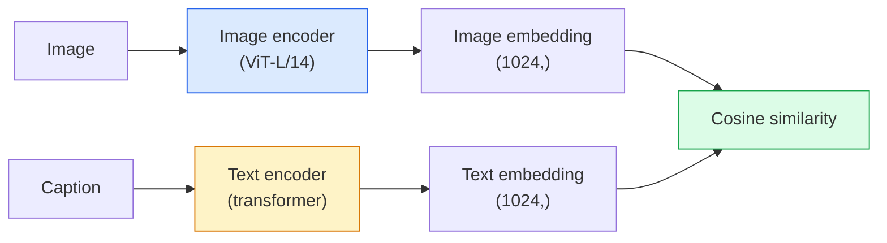

# 开放语境视觉 CLIP

> 让一个图像编码器和一个文本编码器开始训练,让匹配 (图像,标题) 落在共享空间中的同一个点――这就是整个技巧――

**Type:** Build + Use
**Languages:** Python
**Prerequisites:** Phase 4 Lesson 14 (ViT), Phase 4 Lesson 17 (Self-Supervised)
**Time:** ~45 分钟

## 学习目标

- 解释CIP的两塔建筑和对比训练目标
- 使用预训练的 CLIP (或 SigLIP) 进行零射分类,无需任何任务特定的培训
- 从零实现零射分类:编码类提示、计算共数相似性、取 argmax
- 区分 CLIP、SigLIP、OpenCLIP 和 LLaVA/LLaMA视觉模型它们各自在2026年用于什么

## 问题

传统分类器是封闭的词汇:一个1000级图像网模型只能预测1000个标签――每个新类别都需要标签数据和重新训练的头――

通过从网上抓取的400万个 (图片,标题) 双子上训练,可以得到一个模型,它可以在推断时分类到任何类别集合中,而这些类别只需要使用自然语言描述.

这种能力零射传输就是每个现代视觉系统都从CLIP-家庭检查点开始的原因.

## 概念

### 两个塔楼



两个编码器 最后都会通过线性投影 投影到相同的嵌入维度 ((CLIP-B/32 为 512,CLIP-L/14 为 1024) ⋅进行L2-正常化并计算宇宙相似性──

### 目标

给定一个包含N 个 (图片,字幕) 双的批量,构建一个NxN相似性矩阵──训练两个编码器,使对角 (相似的双) 有高相似性,而非对角 (非相似的) 有低相似性──

```
sim_matrix = image_embeddings @ text_embeddings.T / tau

loss_i2t = cross_entropy(sim_matrix,       targets=arange(N))
loss_t2i = cross_entropy(sim_matrix.T,     targets=arange(N))
loss = (loss_i2t + loss_t2i) / 2
```

图像对图像的检索应该是可用的.`tau`温度通常作为规模参数 学习初始化为0.07──

### 更多关于""的文章

和其他, 2023) 用每对的模块 替换了软max:

```
loss = mean over pairs of log(1 + exp(-y_ij * sim_ij))
y_ij = +1 if matching, -1 otherwise
```

双损失 移除了CLIP所需的批量级标准化.

### 零射分类

给定一个好的训练 CLIP:

1. 对于每个类,组合一个提示:"一个 {类}的照片"
2. 用文字编码符编码所有类提示 -> `T`形状 (C,d) △
3. 编码测试图像 -> `I`形状 (1,d) 〔
4. 类似性`I @ T.T`形状 (1,C) 〔
5. 预测类――

快速工程很重要. 为图像网,OpenAI发布了80个快速模板. 对于每个类的所有模板嵌入式,平均可以额外提升1到3%的准确度.

### 2026年Clip型模型的使用场景

- **Zero-shot classification**直接使用.
- **Image retrieval**一次性编码所有图像,在推断中 时嵌入查询.
- **Text-conditioned detection**基层DINO、OWL-ViT将CLIP文本塔包装在探测器周围
- **Text-conditioned segmentation**CLIPSeg;SAM 通过CLIIP 使用文字即时输入──
- **VLMs**LLaVA、Qwen-VL、InternVL将CLIP家族视觉编码器 接入LLM──
- **Text-to-image gen**稳定扩散、DALL-E 3 以CLIP文本嵌入为条件──

一旦你有了共享嵌入空间,每个视觉+语言任务都会变成距离计算.


```figure
clip-contrastive
```

## 构建它

### 步骤1:一个极小的两个塔的模型

真正的CLIP是VT+变压器. 本课中,塔楼是基于预提取功能的小型MLP,因此训练信号在CPU上也可以看到.

```python
import torch
import torch.nn as nn
import torch.nn.functional as F


class TwoTower(nn.Module):
    def __init__(self, img_in=128, txt_in=64, emb=64):
        super().__init__()
        self.image_proj = nn.Sequential(nn.Linear(img_in, 128), nn.ReLU(), nn.Linear(128, emb))
        self.text_proj = nn.Sequential(nn.Linear(txt_in, 128), nn.ReLU(), nn.Linear(128, emb))
        self.logit_scale = nn.Parameter(torch.ones([]) * 2.6592)  # ln(1/0.07)

    def forward(self, img_feats, txt_feats):
        i = F.normalize(self.image_proj(img_feats), dim=-1)
        t = F.normalize(self.text_proj(txt_feats), dim=-1)
        return i, t, self.logit_scale.exp()
```

两个投影,共享模糊输出,学习温度,形状与真实Clip API相似.

### 步骤2:相对的损失

```python
def clip_loss(image_emb, text_emb, logit_scale):
    N = image_emb.size(0)
    sim = logit_scale * image_emb @ text_emb.T
    targets = torch.arange(N, device=sim.device)
    l_i = F.cross_entropy(sim, targets)
    l_t = F.cross_entropy(sim.T, targets)
    return (l_i + l_t) / 2
```

更多的软max = 更自信,但有不稳定的风险.

### 步骤3:零射分类器

```python
@torch.no_grad()
def zero_shot_classify(model, image_feats, class_text_feats, class_names):
    """
    image_feats:      (N, img_in)
    class_text_feats: (C, txt_in)   one averaged embedding per class
    """
    i = F.normalize(model.image_proj(image_feats), dim=-1)
    t = F.normalize(model.text_proj(class_text_feats), dim=-1)
    sim = i @ t.T
    pred = sim.argmax(dim=-1)
    return [class_names[p] for p in pred.tolist()]
```

这就是生产Clip检查点中使用的精确零射程.

### 步骤4:卫生检查

```python
torch.manual_seed(0)
model = TwoTower()

img = torch.randn(8, 128)
txt = torch.randn(8, 64)
i, t, scale = model(img, txt)
loss = clip_loss(i, t, scale)
print(f"batch size: {i.size(0)}   loss: {loss.item():.3f}")
```

对于随机初始化模式,`log(N) = log(8) = 2.08`这是还没有学到的结构时的对称交叉透目标.

## 使用它

开放CLIP是2026年社区默认选择:

```python
import open_clip
import torch
from PIL import Image

model, _, preprocess = open_clip.create_model_and_transforms("ViT-B-32", pretrained="laion2b_s34b_b79k")
tokenizer = open_clip.get_tokenizer("ViT-B-32")

image = preprocess(Image.open("dog.jpg")).unsqueeze(0)
text = tokenizer(["a photo of a dog", "a photo of a cat", "a photo of a car"])

with torch.no_grad():
    image_features = model.encode_image(image)
    text_features = model.encode_text(text)
    image_features = image_features / image_features.norm(dim=-1, keepdim=True)
    text_features = text_features / text_features.norm(dim=-1, keepdim=True)
    probs = (100.0 * image_features @ text_features.T).softmax(dim=-1)

print(probs)
```

更新,在小规模下训练更好,并且更适合新工作:`google/siglip-base-patch16-224`抱着脸 同时提供两者

## 交付它

本课会产出:

- `outputs/prompt-zero-shot-class-picker.md`一个提示,用于给定的类别列表和域名时,为零射击的CLIP 设计类型模板.
- `outputs/skill-image-text-retriever.md`一个技能,使用任何CLIP检查点 构建图像嵌入索引,支持文本查询 和图像查询.

## 练习

1. **（Easy）**使用预训练的OpenCLIP ViT-B/32,并使用CIFAR-10 上80模板提示集做零射分类――报告前一准确性;它应该大约在85-90%――
2. **（Medium）**在同一个CIFAR-10任务上比较单个模板的"一个 {}") 与80个模板平均嵌入式――量化差距并解释为什么模板有帮助――
3. **（Hard）**构建零镜头图像检索索引:使用Clip嵌入1000张图像,构建FAISS索引,使用自然语言描述进行查询.

## 关键术语

| Term | 人们怎么说 | 它实际意味着什么 |
|------|----------------|----------------------|
| Two-tower | "Dual encoder" | 独立的 image 和 text encoders，末端是 shared-dim projection head |
| Zero-shot | "No task-specific training" | 在 inference 时分类到仅由文本描述的 classes；不接触 labels |
| Temperature / logit_scale | "tau" | 在 softmax 前缩放 similarity matrix 的 learned scalar |
| Prompt template | "A photo of a {}" | 包裹 class names 的自然语言包装器；平均多个 templates 会提升 zero-shot accuracy |
| CLIP | "Image+text model" | 2021 年的 OpenAI model；2026 年该领域的通用语汇 |
| SigLIP | "Sigmoid CLIP" | 将 softmax 替换为 per-pair sigmoid；在小 batch 下训练更好 |
| OpenCLIP | "Open reproduction" | 社区在 LAION 上训练的 CLIP variants；open-source pipelines 的 production default |
| VLM | "Vision-language model" | CLIP-family encoder 加上 LLM，训练用来回答关于 images 的问题 |

## 延伸阅读

- [CLIP：从自然语言监督中学习可迁移视觉模型（Radford et al., 2021）](https://arxiv.org/abs/2103.00020)
- [SigLIP：用于 Language-Image Pre-Training 的 Sigmoid Loss（Zhai et al., 2023）](https://arxiv.org/abs/2303.15343)
- [OpenCLIP](https://github.com/mlfoundations/open_clip)社区代码基础
- [DINOv2 vs CLIP vs MAE：features comparison](https://huggingface.co/blog/dinov2)包含并排使用案例的HF指南
