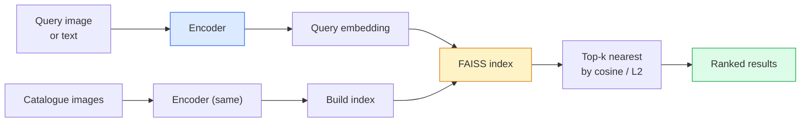

# 图像检索与测量学习

> 测量学习是塑造这个空间的学科,使距离表达你想要的含义.

**Type:** Build
**Languages:** Python
**Prerequisites:** Phase 4 Lesson 14 (ViT), Phase 4 Lesson 18 (CLIP)
**Time:** ~45 minutes

## 学习目标
- 解释三分钟的反驳和基于代理的指标学习损失,并为给定数据集选择合适的方法
- 正确实现L2规范化和共数相似性,并审计"同样项目"与"同类"检索的区别
- 构建FAISS索引,使用文本和图像查询它,并为持久查询集 报告回忆@K
- 将DINOv2、CLIP 和 SigLIP 用作现货嵌入脊椎,并知道各自何时胜出

## 问题
检索在生产视觉系统中无处不在:复制检测,反向图像搜索,视觉搜索, "找到类似的产品",面部重新识别,用于监控的人的重新识别,用于电商的实例级匹配.

两个设计决策决定整个系统.嵌入式,也就是由什么模型产生向量. 索引,也就是如何在规模化场景中找到近邻. 到2026年,两者都已被商品化.

这种塑造就是测量学习.

## 概念
### 一眼发现



### 失去的四个家庭

| Loss | Requires | Pros | Cons |
|------|----------|------|------|
| **Contrastive** | (anchor, positive) + negatives | 简单，可用于任何 pair label | 没有大量 negatives 时收敛较慢 |
| **Triplet** | (anchor, positive, negative) | 直观；可直接控制 margin | Hard-triplet mining 成本高 |
| **NT-Xent / InfoNCE** | Pairs + batch-mined negatives | 可扩展到大 batch | 需要大 batch 或 momentum queue |
| **Proxy-based (ProxyNCA)** | 仅 class labels | 快速、稳定、无需 mining | 在小数据集上可能 overfit 到 proxies |

对于大多数生产用例,先从预训练的脊椎开始;只有当现货嵌入式在你的测试集表现不足时,再加入测量学习细节调.

### 官方的三分之一损失

```
L = max(0, ||f(a) - f(p)||^2 - ||f(a) - f(n)||^2 + margin)
```

着`a`拉近积极`p`让它从负面上推出`n`,并使用`margin`确保间隔──三图结构可以泛化到任何相似度排序──

矿业 很重要:易于三重`n`已经离了`a`很远) 贡献零 损失;只有硬三人才教会模型――半硬挖矿(`n`比比`p`尽管如此,它仍然是2016年FacNet的方案,

### 子相似性与L2

两种指标,两套约定:

- **Cosine**需要L2规范化嵌入式.
- **L2**圆距离──可用于原料或正常化嵌入式,但通常与L2正常化+L2二方搭配──

对于大多数现代网络来说,`||a|| = ||b|| = 1`时,`||a - b||^2 = 2 - 2 cos(a, b)`△选择与你的嵌入 训练一致的约定;混用会改变"最近"的含义──

### 提醒@K

标准检索指标:

```
recall@K = fraction of queries where at least one correct match is in the top K results
```

排行报告回忆@1、@5、@10──若回忆@10 高于0.95 而回忆@1 低于0.5,说明嵌入空间 结构正确,但排序有噪音;可以尝试更长的细节或重新排名 步骤──

对于重复检测,精确性更重要,因为每个假正是用户可见的错误.

### 单一段落中的 FAISS

实际标准的近邻搜索 库──三种索引 选择:

- `IndexFlatIP`现在,`IndexFlatL2`原力、精确、无需训练――可用到约1M向量――
- `IndexIVFFlat` 分成K细胞,只搜索最近的少数细胞――近似、快速、需要训练数据――
- `IndexHNSW`基于图表,对大量查询最快,指数规模较大.

对于100k向量,你可能想在宇宙相似性上使用`IndexFlatIP`△对于10M,使用`IndexIVFFlat`△对于100M+,结合产品量化`IndexIVFPQ`

### 实例级别与类别级别检索

两个名称相同,但非常不同的问题:

- **Category-level** "在我的目录中找猫──"类条件相似性;非架式CLIP/DINOv2嵌入式 效果很好──
- **Instance-level** "在我的目录中找*这个确切产品*──" 需要在同一类内视觉相似对象之间做细分分;

在选择模型之前,始终先问清楚你解决哪个问题.


```figure
metric-embedding
```

## 构建它
### 步骤1:三分钟损失

```python
import torch
import torch.nn.functional as F

def triplet_loss(anchor, positive, negative, margin=0.2):
    d_ap = F.pairwise_distance(anchor, positive, p=2)
    d_an = F.pairwise_distance(anchor, negative, p=2)
    return F.relu(d_ap - d_an + margin).mean()
```

一行──适用于L2标准化或原料嵌入式──

### 步骤 2:半硬的采矿

给定一批嵌入和标签,为每一个 找到最难的半硬负面.

```python
def semi_hard_negatives(emb, labels, margin=0.2):
    dist = torch.cdist(emb, emb)
    same_class = labels[:, None] == labels[None, :]
    diff_class = ~same_class
    N = emb.size(0)

    positives = dist.clone()
    positives[~same_class] = float("-inf")
    positives.fill_diagonal_(float("-inf"))
    pos_idx = positives.argmax(dim=1)

    semi_hard = dist.clone()
    semi_hard[same_class] = float("inf")
    d_ap = dist[torch.arange(N), pos_idx].unsqueeze(1)
    semi_hard[dist <= d_ap] = float("inf")
    neg_idx = semi_hard.argmin(dim=1)

    fallback_mask = semi_hard[torch.arange(N), neg_idx] == float("inf")
    if fallback_mask.any():
        hardest = dist.clone()
        hardest[same_class] = float("inf")
        neg_idx = torch.where(fallback_mask, hardest.argmin(dim=1), neg_idx)
    return pos_idx, neg_idx
```

每个都会得到最难的正面,以及一个比正面更远但在边缘的半硬负面.

### 步骤3:回忆@K

```python
def recall_at_k(query_emb, gallery_emb, query_labels, gallery_labels, k=1):
    sim = query_emb @ gallery_emb.T
    _, top_k = sim.topk(k, dim=-1)
    matches = (gallery_labels[top_k] == query_labels[:, None]).any(dim=-1)
    return matches.float().mean().item()
```

在 L2 标准化嵌入式上按内部产品取高-k,等于按共数取高-k.报告至少有一个正确的邻居查询平均比例.

### 步骤 4: 组合

```python
import torch
import torch.nn as nn
from torch.optim import Adam

class Encoder(nn.Module):
    def __init__(self, in_dim=128, emb_dim=64):
        super().__init__()
        self.net = nn.Sequential(
            nn.Linear(in_dim, 128), nn.ReLU(),
            nn.Linear(128, emb_dim),
        )

    def forward(self, x):
        return F.normalize(self.net(x), dim=-1)

torch.manual_seed(0)
num_classes = 6
protos = F.normalize(torch.randn(num_classes, 128), dim=-1)

def sample_batch(bs=32):
    labels = torch.randint(0, num_classes, (bs,))
    x = protos[labels] + 0.15 * torch.randn(bs, 128)
    return x, labels

enc = Encoder()
opt = Adam(enc.parameters(), lr=3e-3)

for step in range(200):
    x, y = sample_batch(32)
    emb = enc(x)
    pos_idx, neg_idx = semi_hard_negatives(emb, y)
    loss = triplet_loss(emb, emb[pos_idx], emb[neg_idx])
    opt.zero_grad(); loss.backward(); opt.step()
```

几百步后,嵌入集群将形成每个类一个集群.

## 使用它
2026 年的生产:

- **DINOv2 + FAISS** 通用视觉检索――可自动使用――
- **CLIP + FAISS** 当查询是文本时
- **Fine-tuned DINOv2 + FAISS**实例级检索,面部重新识别,时尚,电子商务.
- **Milvus / Weaviate / Qdrant** 围绕 FAISS 或 HNSW 的管理向量 DB包装.

对于SOTA实例检索,配方是:DINOv2脊柱,添加嵌入头,在实例标记的对上使用三小单或InfoNCE损失细调,并在 FAISS建立索引──

## 交付它
本课产出:

- `outputs/prompt-retrieval-loss-picker.md` 一个提示,用于给定检索问题选择三小部分 / InfoNCE / ProxyNCA。
- `outputs/skill-recall-at-k-runner.md` 一个技能,用于编写干净的回忆@K评估带,包含火车/val/图库分区和正确的数据契约.

## 练习
1. **(Easy)**运行上述玩具示例――使用PCA绘制训练前后的嵌入,观察六个集群如何形成――
2. **(Medium)**添加ProxyNCA 损失实现:每个类一个学习的"代理",在宇宙相似性上做标准交叉化――比较它与三小时损失在玩具数据上收速度――
3. **(Hard)**取1000张图像网验证图像,通过 HuggingFace使用DINOv2 生成嵌入式,构建 FAISS 平面索引,并报告以相同批量图像为查询 时回忆@{1, 5, 10}(应为 1.0),以及以持久的分区 和图像网标签 作为基础真相 时的结果.

## 关键术语
| Term | What people say | What it actually means |
|------|----------------|----------------------|
| Metric learning | "Shape the space" | 训练一个 encoder，使其输出空间中的距离反映目标相似度 |
| Triplet loss | "Pull and push" | L = max(0, d(a, p) - d(a, n) + margin)；经典的 metric-learning Loss |
| Semi-hard mining | "Useful negatives" | 比 positive 更远但仍在 margin 内的 negatives；经验上信息量最大 |
| Proxy-based loss | "Class prototypes" | 每个 class 一个 learned proxy；对 similarity-to-proxies 做 cross-entropy；无需 pair mining |
| Recall@K | "Top-K hit rate" | top K 中至少有一个正确结果的查询比例 |
| Instance retrieval | "Find this exact thing" | 细粒度匹配；off-the-shelf features 通常表现不足 |
| FAISS | "The NN library" | Facebook 的 nearest-neighbour 库；支持精确和近似 indexes |
| HNSW | "Graph index" | Hierarchical navigable small world；内存开销小的快速近似 NN |

## 延伸阅读
- [FaceNet: A Unified Embedding for Face Recognition (Schroff et al., 2015)](https://arxiv.org/abs/1503.03832)三块损失 /半硬矿业 论文
- [In Defense of the Triplet Loss for Person Re-Identification (Hermans et al., 2017)](https://arxiv.org/abs/1703.07737)三小单细调 实践指南
- [FAISS documentation](https://github.com/facebookresearch/faiss/wiki) 每种指数,每种交易
- [SMoT: Metric Learning Taxonomy (Kim et al., 2021)](https://arxiv.org/abs/2010.06927) 现代损失及其相关的综述
