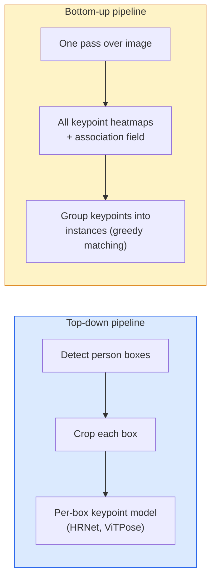

# 关键点检测和姿势估计

> 一个姿势是一组有序的关键点. 一个关键点检测器是热地图回归器.

**Type:** Build
**Languages:** Python
**Prerequisites:** Phase 4 Lesson 06 (Detection), Phase 4 Lesson 07 (U-Net)
**Time:** ~45 分钟

## 学习目标
- 区分上下和下上姿势估计,并说明各自何时使用
- 使用高斯式按键点目标为K 个键点 逆转热地图,并推断时提取键点坐标
- 解释部分亲密性场 (PAF),以及下向上管道 如何把关键点 关联成实例
- 使用MediaPipe Pose或MMPose做生产级关键点估计,并理解它们的输出格式

## 问题
关键任务 有许多名称:人体姿势;;17个体关节) 面部地标;;68个或478个点) 手;;21个点) 动物姿势;;机器人对象姿势;;医疗解剖地标;;它们都共享同一个结构:在一个对象上检测 K个离散点,并输出它们的 (x, y) 坐标──

姿势估计是运动捕捉,健身应用,体育分析,手势控制,动画,AR试验和机器人捕捉的基础.

工程问题在尺度上.单图,单人姿势是一个20ms的问题. 人群中的多人姿势是30fps下运行的,则是一个完全不同的结构问题.

## 概念
### 向上和下



- **Top-down**先检测人,再对每种作物运行人均关键点模型――准确率最高;随人数线性扩展――
- **Bottom-up** 一次前进传输 预测所有关键点加一个协会场;再把它们分组──无论群众规模如何,耗时恒定──

顶下 (HRNet,ViTPose) 是准确率领先方案;下下 (OpenPose,HigherHRNet) 是拥挤的场景中的吞吐量领先方案.

### 热图回归

不要直接退缩`(x, y)`而是为每一个关键点预测一个`H x W`在真实位置中心有一个高斯斑点.

```
target[k, y, x] = exp(-((x - cx_k)^2 + (y - cy_k)^2) / (2 sigma^2))
```

在推断时,每个热图的 argmax 就是预测的关键点位置.

为什么热地图比直接回归更好:网络的空间结构(conv功能地图) 自然对齐空间输出――高斯目标也起到规范作用  小的定位错误会产生小的损失,而不是零――

### 亚像素定位

为了获得子像素精度,可以对 argmax 和其邻近域进行适应抛物线,或者使用常见的偏移.`(dx, dy) = 0.25 * (heatmap[y, x+1] - heatmap[y, x-1], ...)`方向:

### 部分亲密性领域 (PAF)

开放Pose 用于下方上方协同技巧. 对每对连接的关键点 (例如左肩到左肘),预测一个2通道的领域,编码从一个点指向另一个点的单元向量.

```
For each connection (limb):
  PAF channels: 2 (unit vector x, y)
  Line integral: sum over sample points of (PAF . line_direction)
  Higher integral = stronger match
```

这种方法很优雅,而且不需要每个人种植,

### COCO关键点

标准的体位数据集:每个人使用17个关键点,使用PCK (%) 和OKS (%) 作为指标.

### 两维对三维

- **2D pose**图像坐标;已达到生产质量 (MediaPipe,HRNet,ViTPose) ⋅
- **3D pose**世界/摄像头坐标;仍是活跃研究方向──常见方法:
  - 用一个小的MLP将2D预测升到3D
  - 直接从图像做3D回归 (PyMAF,MHFormer)
  - 对于地图真相而言,


```figure
cv3-pose-heatmap
```

## 构建它
### 步骤1:高斯热图目标

```python
import numpy as np
import torch

def gaussian_heatmap(size, cx, cy, sigma=2.0):
    yy, xx = np.meshgrid(np.arange(size), np.arange(size), indexing="ij")
    return np.exp(-((xx - cx) ** 2 + (yy - cy) ** 2) / (2 * sigma ** 2)).astype(np.float32)

hm = gaussian_heatmap(64, 32, 32, sigma=2.0)
print(f"peak: {hm.max():.3f} at ({hm.argmax() % 64}, {hm.argmax() // 64})")
```

沿着道轴 堆积每个键点热图,就得到完整的目标度.

### 步骤 2: 小键点头

一个U-Net型模型,输出K个热地图道.

```python
import torch.nn as nn
import torch.nn.functional as F

class TinyKeypointNet(nn.Module):
    def __init__(self, num_keypoints=4, base=16):
        super().__init__()
        self.down1 = nn.Sequential(nn.Conv2d(3, base, 3, 2, 1), nn.ReLU(inplace=True))
        self.down2 = nn.Sequential(nn.Conv2d(base, base * 2, 3, 2, 1), nn.ReLU(inplace=True))
        self.mid = nn.Sequential(nn.Conv2d(base * 2, base * 2, 3, 1, 1), nn.ReLU(inplace=True))
        self.up1 = nn.ConvTranspose2d(base * 2, base, 2, 2)
        self.up2 = nn.ConvTranspose2d(base, num_keypoints, 2, 2)

    def forward(self, x):
        h1 = self.down1(x)
        h2 = self.down2(h1)
        h3 = self.mid(h2)
        u1 = self.up1(h3)
        return self.up2(u1)
```

输入`(N, 3, H, W)`输出`(N, K, H, W)`损是针对高斯目标的每像素MSE.

### 步骤3: 推理 提取键点坐标

```python
def heatmap_to_coords(heatmaps):
    """
    heatmaps: (N, K, H, W)
    returns:  (N, K, 2) float coordinates in image pixels
    """
    N, K, H, W = heatmaps.shape
    hm = heatmaps.reshape(N, K, -1)
    idx = hm.argmax(dim=-1)
    ys = (idx // W).float()
    xs = (idx % W).float()
    return torch.stack([xs, ys], dim=-1)

coords = heatmap_to_coords(torch.randn(2, 4, 32, 32))
print(f"coords: {coords.shape}")  # (2, 4, 2)
```

对于子像素的精炼,在 argmax 周围插值.

### 步骤 4:合成关键点数据集

很简单:在白色的布上画四个点,并学习预测它们.

```python
def make_synthetic_sample(size=64):
    img = np.ones((3, size, size), dtype=np.float32)
    rng = np.random.default_rng()
    kps = rng.integers(8, size - 8, size=(4, 2))
    for cx, cy in kps:
        img[:, cy - 2:cy + 2, cx - 2:cx + 2] = 0.0
    hms = np.stack([gaussian_heatmap(size, cx, cy) for cx, cy in kps])
    return img, hms, kps
```

这个任务很简单,小模型一分钟就能学会了.

### 步骤5:培训

```python
model = TinyKeypointNet(num_keypoints=4)
opt = torch.optim.Adam(model.parameters(), lr=3e-3)

for step in range(200):
    batch = [make_synthetic_sample() for _ in range(16)]
    imgs = torch.from_numpy(np.stack([b[0] for b in batch]))
    hms = torch.from_numpy(np.stack([b[1] for b in batch]))
    pred = model(imgs)
    # Upsample pred to full resolution
    pred = F.interpolate(pred, size=hms.shape[-2:], mode="bilinear", align_corners=False)
    loss = F.mse_loss(pred, hms)
    opt.zero_grad(); loss.backward(); opt.step()
```

## 使用它
- **MediaPipe Pose**谷歌的生产级姿势估计器;提供WebGL+移动运行时间,延迟低于10ms──
- **MMPose**包含每种SOTA架构及预训练的重量.
- **YOLOv8-pose** 最快的实时多人姿势,使用单次前进通行.
- **transformers HumanDPT / PoseAnything** 用于开放词汇姿势 (任意对象,任意关键点集合) 的新视觉语言方法.

## 交付它
本课产出:

- `outputs/prompt-pose-stack-picker.md` 一个提示,可根据延迟,群众规模以及2D对3D需求选择MediaPipe / YOLOv8-pose / HRNet / ViTPose。
- `outputs/skill-heatmap-to-coords.md` 一个技能,用于编写每个生产姿势模型都会使用到的子像素热图-到协调的常规.

## 练习
1. **(Easy)**在合成4点数据集上训练小键点模型――报告200步后预测与真实键点之间的平均L2错误――
2. **(Medium)**添加子像素精炼:给定 argmax位置,沿 x 和 y 方向使用邻近像素 适合1D抛物线――报告对整数 argmax的精度提高――
3. **(Hard)**构建一个2人合成数据集,其中每张图片显示两个4键点模式实例──训练一个带 PAF的下游管道,预测哪个键点属于哪个实例,并评估OKS──

## 关键术语
| Term | 人们怎么说 | 它实际是什么意思 |
|------|----------------|----------------------|
| Keypoint | "一个 landmark" | object 上的一个特定有序点（joint、corner、feature） |
| Pose | "skeleton" | 属于一个 instance 的一组有序 keypoints |
| Top-down | "先 detect，再 pose" | Two-stage pipeline：person detector + per-crop keypoint model；准确率最高 |
| Bottom-up | "先 pose，后 group" | Single-pass all-keypoint prediction + grouping；在 crowd size 上耗时恒定 |
| Heatmap | "Gaussian target" | 每个 keypoint 一个 H x W tensor，峰值位于真实位置；首选的 Regression target |
| PAF | "Part Affinity Field" | 编码 limb directions 的 2-channel unit vector field；用于把 keypoints 分组为 instances |
| OKS | "Keypoint IoU" | Object Keypoint Similarity；COCO 的 pose metric |
| HRNet | "High-Resolution Net" | 主流 top-down keypoint architecture；全程保留 high-res features |

## 延伸阅读
- [OpenPose (Cao et al., 2017)](https://arxiv.org/abs/1812.08008)使用PAF的底部上;仍然是该方法的最佳说明材料
- [HRNet (Sun et al., 2019)](https://arxiv.org/abs/1902.09212)上下 参考架构
- [ViTPose (Xu et al., 2022)](https://arxiv.org/abs/2204.12484) 使用简单的VIT 作为姿势的脊柱;在许多基准上是当前SOTA
- [MediaPipe Pose](https://developers.google.com/mediapipe/solutions/vision/pose_landmarker) 生产级实时姿势;2026年部署最快的堆
