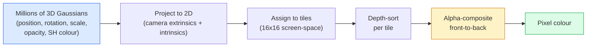

# 从零实现3D高斯分光

> 一场景是一个由数百万3D高西亚人组成的云.每个高西亚人都具有位置,方向,规模,度以及一种依赖观测方向的颜色.

**类型：**构建
**语言：**字符串
**先修要求：**阶段4 第13课 (3D视觉和NeRF) 阶段1 第12课 (光器操作) 阶段4 第10课 (分散基础可选)
**时间：**约90分钟

## 学习目标

- 解释为什么到2026年,3D高斯式光已经取代了NeRF,成为光现实 3D重建的生产默认方案
- 说出每个高斯的六类参数 (位置,旋转四旋翼,尺度,度,球状和色,可选特征),以及每个类贡献的几个浮动
- 从零实现一个使用`alpha`复制的2D高斯式喷拉斯特राइزر,然后说明3D情况如何投影到同一个循环
- 使用 `nerfstudio`,我知道.`gsplat`或`SuperSplat`从20-50张照片重建一个场景,并导出为`KHR_gaussian_splatting`延长GTF或OpenUSD 26.03 `UsdVolParticleField3DGaussianSplat`方案

## 问题

 NeRF 将场景存储为一个MLP的权重. 每个出色的像素都需要沿着一条光线进行数百次MLP查询. 训练需要几个小时,染需要几秒钟,并且权重无法编辑.

3D高斯人分彩(Kerbl、Kopanas、Leimkühler、Drettakis,SIGGRAPH 2023) 取代了这一切.一个场景是一个显而易见的3D高斯人分彩集. 染色在 GPU 上以100+fps进行的化. 训练只需要几分钟. 编辑是直接的:平移部分高斯人,你就移动了椅子. 到2026年,克罗诺斯集团已经批准用于高斯人分彩扩展,OpenUSD 26.03 已内置高斯人分彩计划,Zillow 和染色公寓内容,而大多数关于3D重建的新研究论文都是核心3DGS思路体变化.

心智模型很简单,但数学上有足够多的活动部件,以至于大多数介绍将从化开始,然后跳过投影和球形和. 本课程将构建完整内容:先做2D版本,再扩展到3D.

## 核心概念

### 一个高斯人带着什么

一个3D高斯系是空间中的一个参数化,具有这些属性:

```
position         mu         (3,)    centre in world coordinates
rotation         q          (4,)    unit quaternion encoding orientation
scale            s          (3,)    log-scales per axis (exponentiated at render time)
opacity          alpha      (1,)    post-sigmoid opacity [0, 1]
SH coefficients  c_lm       (3 * (L+1)^2,)   view-dependent colour
```

转换+规模会构建一个3x3的变量:`Sigma = R S S^T R^T`△这是高斯人在3D中的形状──球状和 让颜色随着视觉方向变化:特殊的亮点、微微的光、视觉依赖的光,不需要存储每视觉纹理──使用SH度3时,每个颜色频道有16个系数,也就是每个高斯人只有48个颜色需要漂浮──

一场场景通常有1-500万个高斯人. 每个大约存储60个浮游器.

### 是化,不是射线游行



五步,全都对 GPU 友好――没有每个像素的 MLP 查询――一张RTX 3080 Ti 可以以 147 fps 染色 600 万个位置――

### 投影 步骤

位于世界位置`mu`、具有3D共变性`Sigma`现在,我们在看电影的位置.`mu'`、具有二维共变性`Sigma'`两个维的高斯人:

```
mu' = project(mu)
Sigma' = J W Sigma W^T J^T          (2 x 2)

W = viewing transform (rotation + translation of camera)
J = Jacobian of the perspective projection at mu'
```

两维高斯人的足迹是圆形,其轴是`Sigma'`对于这个圆的每个像素都会接收这个高斯人的贡献,权重为`exp(-0.5 * (p - mu')^T Sigma'^-1 (p - mu'))`,我知道.

### 编译字母规则

对于一个像素,覆盖它的高西人会按前后排序,或等价地,使用反向公式按前后排序) ・颜色自1980年代以来使用的所有半透明拉斯特里斯器都在使用相同的方程进行复制:

```
C_pixel = sum_i alpha_i * T_i * c_i

T_i = prod_{j < i} (1 - alpha_j)       transmittance up to i
alpha_i = opacity_i * exp(-0.5 * d^T Sigma'^-1 d)   local contribution
c_i = eval_SH(SH_i, view_direction)    view-dependent colour
```

这与**NeRF 的 volumetric render 是同一个方程**虽然这里是显而易见的稀疏高素集合计算,而不是在射线上密集的样本计算.

### 为什么它是可分化的

每一步:投影,布分配,阿尔法编译,SH评估,都相对于高斯参数是可分化的的.给定一张真实图像,计算呈现的像素损失,通过拉斯特里زر进行后向,使用渐进下降更新所有.`(mu, q, s, alpha, c_lm)`通过3万次的回复,高斯人会找到正确的位置,尺寸和颜色.

### 密度和剪裁

固定数量的高斯人无法覆盖复杂场景.

- **Clone**现在,它需要更多细节.
- **Split**很高时,将它拆成两个更小的高西亚. 这说明一个大高西亚对该地区来说很滑,不适合.
- **Prune**它们没有贡献.

每次加密 运行一次──一个场景通常从100万个初始高斯人 (由SfM点初始化) 增长到训练结束时的1-5M──

### 用一段话理解球形和

视图依赖的颜色是球面的单位函数`c(direction)`球面上的里基,截至度.`L`每个频道都会得到`(L+1)^2`个基因函数――为一个新视角评估颜色,就是将学到的SH系数与在观测方向上求值的基础做点产品――0级 =一个系数 =恒定颜色――3级 =16个系数 =足以捕捉拉伯特色、光谱和轻微反射――3D高斯的光论文默认使用3级――

### 2026 年的生产技术

```
1. Capture         smartphone / DJI drone / handheld scanner
2. SfM / MVS       COLMAP or GLOMAP derives camera poses + sparse points
3. Train 3DGS      nerfstudio / gsplat / inria official / PostShot (~10-30 min on RTX 4090)
4. Edit            SuperSplat / SplatForge (clean floaters, segment)
5. Export          .ply -> glTF KHR_gaussian_splatting or .usd (OpenUSD 26.03)
6. View            Cesium / Unreal / Babylon.js / Three.js / Vision Pro
```

### 4D 与生成变体

- **4D Gaussian Splatting**时间的函数是Gaussians;用于体积视频.
- **Generative splats**们可以幻出来.
- **3D Gaussian Unscented Transform**据悉,这项技术是自动驾驶模拟的变体.


```figure
cv3-gaussian-splat
```

## 构建它

### 步骤1:一个2D高斯人

我们先构建一个2D拉斯特雷斯仪.

```python
import torch
import torch.nn as nn
import torch.nn.functional as F


def eval_2d_gaussian(means, covs, points):
    """
    means:  (G, 2)      centres
    covs:   (G, 2, 2)   covariance matrices
    points: (H, W, 2)   pixel coordinates
    returns: (G, H, W)  density at every pixel for every Gaussian
    """
    G = means.size(0)
    H, W, _ = points.shape
    flat = points.view(-1, 2)
    inv = torch.linalg.inv(covs)
    diff = flat[None, :, :] - means[:, None, :]
    d = torch.einsum("gpi,gij,gpj->gp", diff, inv, diff)
    density = torch.exp(-0.5 * d)
    return density.view(G, H, W)
```

`einsum`会对每个 (高斯,像素) 双 计算方形形式`diff^T Sigma^-1 diff`,我知道.

### 步骤 2:2D 片片

在2D中深度没有意义,所以我们使用一个学到的每高斯式尺度来表示顺序.

```python
def rasterise_2d(means, covs, colours, opacities, depths, image_size):
    """
    means:     (G, 2)
    covs:      (G, 2, 2)
    colours:   (G, 3)
    opacities: (G,)     in [0, 1]
    depths:    (G,)     per-Gaussian scalar used for ordering
    image_size: (H, W)
    returns:   (H, W, 3) rendered image
    """
    H, W = image_size
    yy, xx = torch.meshgrid(
        torch.arange(H, dtype=torch.float32, device=means.device),
        torch.arange(W, dtype=torch.float32, device=means.device),
        indexing="ij",
    )
    points = torch.stack([xx, yy], dim=-1)

    densities = eval_2d_gaussian(means, covs, points)
    alphas = opacities[:, None, None] * densities
    alphas = alphas.clamp(0.0, 0.99)

    order = torch.argsort(depths)
    alphas = alphas[order]
    colours_sorted = colours[order]

    T = torch.ones(H, W, device=means.device)
    out = torch.zeros(H, W, 3, device=means.device)
    for i in range(means.size(0)):
        a = alphas[i]
        out += (T * a)[..., None] * colours_sorted[i][None, None, :]
        T = T * (1.0 - a)
    return out
```

它不是快速的,真正的实现将使用基于的CUDA核,但数学完全正确,而且完全可分化.

### 步骤3:一个可训练的2D喷场景

```python
class Splats2D(nn.Module):
    def __init__(self, num_splats=128, image_size=64, seed=0):
        super().__init__()
        g = torch.Generator().manual_seed(seed)
        H, W = image_size, image_size
        self.means = nn.Parameter(torch.rand(num_splats, 2, generator=g) * torch.tensor([W, H]))
        self.log_scale = nn.Parameter(torch.ones(num_splats, 2) * math.log(2.0))
        self.rot = nn.Parameter(torch.zeros(num_splats))  # single angle in 2D
        self.colour_logits = nn.Parameter(torch.randn(num_splats, 3, generator=g) * 0.5)
        self.opacity_logit = nn.Parameter(torch.zeros(num_splats))
        self.depth = nn.Parameter(torch.rand(num_splats, generator=g))

    def covs(self):
        s = torch.exp(self.log_scale)
        c, si = torch.cos(self.rot), torch.sin(self.rot)
        R = torch.stack([
            torch.stack([c, -si], dim=-1),
            torch.stack([si, c], dim=-1),
        ], dim=-2)
        S = torch.diag_embed(s ** 2)
        return R @ S @ R.transpose(-1, -2)

    def forward(self, image_size):
        covs = self.covs()
        colours = torch.sigmoid(self.colour_logits)
        opacities = torch.sigmoid(self.opacity_logit)
        return rasterise_2d(self.means, covs, colours, opacities, self.depth, image_size)
```

`log_scale`,我知道.`opacity_logit`和 `colour_logits`通过合适的激活映射,这是每个3DGS实现的标准模式.

### 步骤 4:将2D高斯人 拟合到目标图像

```python
import math
import numpy as np

def make_target(size=64):
    yy, xx = np.meshgrid(np.arange(size), np.arange(size), indexing="ij")
    img = np.zeros((size, size, 3), dtype=np.float32)
    # Red circle
    mask = (xx - 20) ** 2 + (yy - 20) ** 2 < 10 ** 2
    img[mask] = [1.0, 0.2, 0.2]
    # Blue square
    mask = (np.abs(xx - 45) < 8) & (np.abs(yy - 40) < 8)
    img[mask] = [0.2, 0.3, 1.0]
    return torch.from_numpy(img)


target = make_target(64)
model = Splats2D(num_splats=64, image_size=64)
opt = torch.optim.Adam(model.parameters(), lr=0.05)

for step in range(200):
    pred = model((64, 64))
    loss = F.mse_loss(pred, target)
    opt.zero_grad(); loss.backward(); opt.step()
    if step % 40 == 0:
        print(f"step {step:3d}  mse {loss.item():.4f}")
```

经过200步,64个高西人会收到这两个形状中.

### 步骤5:从2D到3D

3D 扩展保留同一个循环――新增部分包括:

1. 每个高斯人的旋转是四角,而不是单个角.
2. 率是`R S S^T R^T`在其中`R`由四方构建,`S = diag(exp(log_scale))`,我知道.
3. 投影`(mu, Sigma) -> (mu', Sigma')`使用摄像头外观,以及在`mu`处的视角投影 雅可比亚──
4. 颜色变得圆形和的扩张;在观看方向上评估它.
5. 根据实际的相机空间,而不是学习的尺度.

每个生产实现`gsplat`,我知道.`inria/gaussian-splatting`,我知道.`nerfstudio`通过基于的CUDA核进行了这些操作.

### 步骤 6: 球状和评价

每个频道都有16个项.

```python
def eval_sh_degree_3(sh_coeffs, dirs):
    """
    sh_coeffs: (..., 16, 3)   last dim is RGB channels
    dirs:      (..., 3)       unit vectors
    returns:   (..., 3)
    """
    C0 = 0.282094791773878
    C1 = 0.488602511902920
    C2 = [1.092548430592079, 1.092548430592079,
          0.315391565252520, 1.092548430592079,
          0.546274215296039]
    x, y, z = dirs[..., 0], dirs[..., 1], dirs[..., 2]
    x2, y2, z2 = x * x, y * y, z * z
    xy, yz, xz = x * y, y * z, x * z

    result = C0 * sh_coeffs[..., 0, :]
    result = result - C1 * y[..., None] * sh_coeffs[..., 1, :]
    result = result + C1 * z[..., None] * sh_coeffs[..., 2, :]
    result = result - C1 * x[..., None] * sh_coeffs[..., 3, :]

    result = result + C2[0] * xy[..., None] * sh_coeffs[..., 4, :]
    result = result + C2[1] * yz[..., None] * sh_coeffs[..., 5, :]
    result = result + C2[2] * (2.0 * z2 - x2 - y2)[..., None] * sh_coeffs[..., 6, :]
    result = result + C2[3] * xz[..., None] * sh_coeffs[..., 7, :]
    result = result + C2[4] * (x2 - y2)[..., None] * sh_coeffs[..., 8, :]

    # degree 3 terms omitted here for brevity; full 16-coefficient version in the code file
    return result
```

学到的`sh_coeffs`存储该高斯的颜色在每个方向──在染时间,将其与当前视觉方向求值,得到一个3向量RGB──

## 使用它

真实的3DGS 工作请使用 `gsplat`没有什么可做.`nerfstudio`其他:

```bash
pip install nerfstudio gsplat
ns-download-data example
ns-train splatfacto --data path/to/data
```

`splatfacto`对于典型场景而言,在RTX 4090上一次运行需要10-30分钟.

2026年值得关注的导出选项:

- `.ply`现在,我们已经开始了.
- `.splat`片/超级片 格式
- 鱼`KHR_gaussian_splatting`克罗诺斯标准,可在观众间移植(2026年 2月 RC) 』
- 开通美元`UsdVolParticleField3DGaussianSplat`美国元,用于NVIDIA Omniverse和Vision Pro管道.

对于4D/动态场景,`4DGS`和 `Deformable-3DGS`使用时间变化的手段与不透明度 扩展同样的机制──

## 交付它

本课会产出:

- `outputs/prompt-3dgs-capture-planner.md`提示:用于给定场景类型的规划捕捉会议 (图片数量,摄像头路径,照明)
- `outputs/skill-3dgs-export-router.md`根据下游观众或引擎的出口格式`.ply`现在,`.splat`美国人民币

## 练习

1. **（简单）**在另一个合成图像上运行上面的2D光训练器.`num_splats`在`[16, 64, 256]`转变中,并绘制每种情况的MSE与步骤的曲线――找出收益递减点――
2. **（中等）**扩展2D拉斯特莱زر,使其支持每加斯的RGB颜色,这些颜色通过2级和依赖一个标量 视角──在一组目标图像对上训练,并验证模型能重建二者──
3. **（困难）**克隆`nerfstudio`通过自己的场景拍摄20张照片,`splatfacto`导出到GTF`KHR_gaussian_splatting`现在,我们在看看了`GaussianSplats3D` 超级,巴比伦.js V9) 中打开.

## 关键术语

| Term | 人们通常怎么说 | 它实际意味着什么 |
|------|----------------|----------------------|
| 3DGS | "Gaussian splats" | 将场景显式表示为数百万个 3D Gaussians，每个 Gaussian 带有 position、rotation、scale、opacity、SH colour |
| Covariance | "Shape of the Gaussian" | `Sigma = R S S^T R^T`；一个 Gaussian 的 orientation 与 anisotropic scale |
| Alpha compositing | "Back-to-front blend" | 与 NeRF 的 volumetric render 相同的方程，但现在作用在显式稀疏集合上 |
| Densification | "Clone and split" | 在 reconstruction under-fit 的位置自适应添加新 Gaussians |
| Pruning | "Delete low-opacity" | 移除训练过程中 opacity 已塌缩到接近零的 Gaussians |
| Spherical harmonics | "View-dependent colour" | 球面上的 Fourier basis；将 colour 存储为 viewing direction 的函数 |
| Splatfacto | "nerfstudio's 3DGS" | 2026 年训练 3DGS 最简单的路径 |
| `KHR_gaussian_splatting` | "glTF standard" | Khronos 2026 extension，使 3DGS 能在 viewers 和 engines 之间移植 |

## 延伸阅读

- [3D Gaussian Splatting for Real-Time Radiance Field Rendering (Kerbl et al., SIGGRAPH 2023)](https://repo-sam.inria.fr/fungraph/3d-gaussian-splatting/) 原始论文
- [gsplat (Meta/nerfstudio)](https://github.com/nerfstudio-project/gsplat) 生产级 CUDA 缩机
- [nerfstudio Splatfacto](https://docs.nerf.studio/nerfology/methods/splat.html) 参考训练方案
- [Khronos KHR_gaussian_splatting extension](https://github.com/KhronosGroup/glTF/blob/main/extensions/2.0/Khronos/KHR_gaussian_splatting/README.md) 2026 年可移植格式
- [OpenUSD 26.03 release notes](https://openusd.org/release/) `UsdVolParticleField3DGaussianSplat`方案
- [THE FUTURE 3D State of Gaussian Splatting 2026](https://www.thefuture3d.com/blog-0/2026/4/4/state-of-gaussian-splatting-2026) 行业概览
