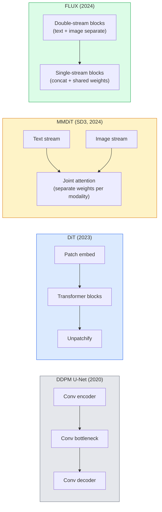

# 透变压器和调整流量

> 转换它为变压器,将噪声时间表转换为直线路径流量,你突然得到了SD3、FLUX,以及每一个2026年的文字到图像模型.

**类型：**学习 + 构建
**语言：**字符串
**前置要求：**阶段4课10 (分散DDPM),阶段4课14 (ViT),阶段7课02 (自我注意)
**时间：**约75分钟

## 学习目标

- 追踪从U-Net DDPM (第十课) 到散变压器 (DiT) 、MMDiT (SD3),以及单+双流的DiT (FLUX) 的演变
- 解释调整流量:为什么噪音与数据之间的直线轨迹能让模型使用20步而不是1000步完成采样
- 实现一个小的DIT块和一个正流训练循环,两者都控制在100行内
- 按架构,参数数和许可区分模型变体SD3、FLUX.1-dev、FLUX.1-schnell、Z-Image、Qwen-Image)

## 问题

课10 用U-Net指标器构建一个DDPM──这个配方主导了2020-2023年:U-Net +beta时间表 +噪音预测损失──它产生了稳定分散1.5、2.1 和DALL-E 2──

每一个2026年最先进的文本到图像模型都已经过去了它. 稳定传播3、FLUX、SD4、Z-图像、Qwen-图像、Hunyuan-图像没有一个使用U-Net.它们使用了扩散变压器 (DiT) ・SD3 和FLUX. 还将DDPM噪声时间表转换为修复流程,这将从噪声到数据的路径直,并通过一致性或蒸变体支持1-4步推断.

这种转变很重要,因为它正是基于扩散的图像生成, 变得可控, 快速准确, 解决了文本染色) 并且足够快投入生产的原因.

## 核心概念

### 从U-Net到变压器



- **DiT**通过适应性层规范 (AdaLN) 进行调节.
- **MMDiT**为了文字代币和图像代币使用两个拥有独立权重的流,并共享一个共同的关注.
- **FLUX**(黑森林实验室, 2024) 前N个块像SD3一样采用双流,后续块将代币连接并共享重量(单流),以提高更深层结构的效率──
- **Z-Image**高效的单流DT,不惜一切代价扩大规模的思路.

### 用一段话解释 修改流量

声的SDE将定义为一个声的SDE,其中`x_t`学习到的逆转是第二个SDE,需要1000个小步的解决.

修改流量 定义了清洁数据与清洁噪音之间的**直线**插值:

```
x_t = (1 - t) * x_0 + t * epsilon,     t in [0, 1]
```

训练一个网络来预测速度`v_theta(x_t, t) = epsilon - x_0`也就是从清洁数据到噪音的直线路径的前进方向`dx_t/dt`采用时,你向后积分这个速度,从噪音 逐步走向数据.

SD3将其称为**Rectified Flow Matching**△FLUX、Z-Image 和大多数2026年模型 使用相同的目标──典型推断:20-30个尤勒步骤(确定性),相比旧的DDPM体系中的50多个DDIM步骤──蒸 /轮 /快速 /LCM变体可以将其降至1-4步──

### 适应性调节

通过**adaptive layer norm**在时间步骤 和类/文本 上做调节:从调节向量 中预测 `scale`和 `shift`并且在LayerNorm之后应用它们.

```
cond -> MLP -> (scale, shift, gate)
norm(x) * (1 + scale) + shift, then residual add * gate
```

### SD3 和 FLUX 中的文本编码器

- **SD3**使用三个文本编码器:两个CLIP模型+T5-XXL──嵌入式被连接后作为文本调节 送入图像流──
- **FLUX**使用一个Clip-L+T5-XXL.
- **Qwen-Image / Z-Image**采用与其基础LLM的变体对齐自开发文本编码器.

文字编码器是 SD3/FLUX 之所以比 SD1.5 更能理解提示的重要原因――单独T5-XXL就有4.7B参数――

### 仍然成立的无分类指导

修改流量 变化是样本,而不是条件化――无类型指导方针(训练时以10% 概率丢弃文本,推理时混合条件和无条件预测) 在修改流中同样适用――大多数2026年模型使用指导方针尺度3.5-5低于SD1.5的7.5,因为修改流量模型默认就更紧密地遵循提示――

### 连贯性,土波,施内尔,LCM

四个名称指向同一个想法:把一个慢速多步模型蒸成一个快速几步模型――

- **LCM (Latent Consistency Model)**训练一个学生,使其能够从任意的中间`x_t`一步预测最终的`x_0`,我知道.
- **SDXL Turbo / FLUX schnell**使用逆向扩散蒸的训练1-4步模型──
- **SD Turbo**将OpenAI式一致性模型适配到隐形传播――

任何新型号的生产服务通常都会同时发布一个完整的质量检查点和一个轮波/快速变体.

### 2026年 模特风景

| Model | Size | Architecture | License |
|-------|------|--------------|---------|
| Stable Diffusion 3 Medium | 2B | MMDiT | SAI Community |
| Stable Diffusion 3.5 Large | 8B | MMDiT | SAI Community |
| FLUX.1-dev | 12B | Double + Single Stream DiT | non-commercial |
| FLUX.1-schnell | 12B | same, distilled | Apache 2.0 |
| FLUX.2 | — | iterated FLUX.1 | mixed |
| Z-Image | 6B | S3-DiT (Scalable Single-Stream) | permissive |
| Qwen-Image | ~20B | DiT + Qwen text tower | Apache 2.0 |
| Hunyuan-Image-3.0 | ~80B | DiT | research |
| SD4 Turbo | 3B | DiT + distillation | SAI Commercial |

果图像是效率领先者.果图像2和SD4是目前质量最靠谱的模型.

### 为什么这个阶段的转变很重要

工作 工作 工作 工作 工作 工作**更好、更快，并且扩展得更干净**△这种转变类似于NLP 中从RNN到变压器的转变:两种架构 解决了同一个问题,但变压器更能扩大,并且现在占据主导地位.


```figure
cv3-rectified-flow
```

## 构建它

### 步骤1:带 AdaLN 的DT区块

```python
import torch
import torch.nn as nn


class AdaLNZero(nn.Module):
    """
    Adaptive LayerNorm with a gate. Predicts (scale, shift, gate) from the conditioning.
    Init such that the whole block starts as identity ("zero init").
    """

    def __init__(self, dim, cond_dim):
        super().__init__()
        self.norm = nn.LayerNorm(dim, elementwise_affine=False)
        self.mlp = nn.Linear(cond_dim, dim * 3)
        nn.init.zeros_(self.mlp.weight)
        nn.init.zeros_(self.mlp.bias)

    def forward(self, x, cond):
        scale, shift, gate = self.mlp(cond).chunk(3, dim=-1)
        h = self.norm(x) * (1 + scale.unsqueeze(1)) + shift.unsqueeze(1)
        return h, gate.unsqueeze(1)


class DiTBlock(nn.Module):
    def __init__(self, dim=192, heads=3, mlp_ratio=4, cond_dim=192):
        super().__init__()
        self.adaln1 = AdaLNZero(dim, cond_dim)
        self.attn = nn.MultiheadAttention(dim, heads, batch_first=True)
        self.adaln2 = AdaLNZero(dim, cond_dim)
        self.mlp = nn.Sequential(
            nn.Linear(dim, dim * mlp_ratio),
            nn.GELU(),
            nn.Linear(dim * mlp_ratio, dim),
        )

    def forward(self, x, cond):
        h, gate1 = self.adaln1(x, cond)
        a, _ = self.attn(h, h, h, need_weights=False)
        x = x + gate1 * a
        h, gate2 = self.adaln2(x, cond)
        x = x + gate2 * self.mlp(h)
        return x
```

`AdaLNZero`一开始是一个身份映射,因为它的MLP重量被初始化为零.

### 步骤2:一个小的

```python
def timestep_embedding(t, dim):
    import math
    half = dim // 2
    freqs = torch.exp(-math.log(10000) * torch.arange(half, device=t.device) / half)
    args = t[:, None].float() * freqs[None]
    return torch.cat([args.sin(), args.cos()], dim=-1)


class TinyDiT(nn.Module):
    def __init__(self, image_size=16, patch_size=2, in_channels=3, dim=96, depth=4, heads=3):
        super().__init__()
        self.patch_size = patch_size
        self.num_patches = (image_size // patch_size) ** 2
        self.patch = nn.Conv2d(in_channels, dim, kernel_size=patch_size, stride=patch_size)
        self.pos = nn.Parameter(torch.zeros(1, self.num_patches, dim))
        self.time_mlp = nn.Sequential(
            nn.Linear(dim, dim * 2),
            nn.SiLU(),
            nn.Linear(dim * 2, dim),
        )
        self.blocks = nn.ModuleList([DiTBlock(dim, heads, cond_dim=dim) for _ in range(depth)])
        self.norm_out = nn.LayerNorm(dim, elementwise_affine=False)
        self.head = nn.Linear(dim, patch_size * patch_size * in_channels)

    def forward(self, x, t):
        n = x.size(0)
        x = self.patch(x)
        x = x.flatten(2).transpose(1, 2) + self.pos
        t_emb = self.time_mlp(timestep_embedding(t, self.pos.size(-1)))
        for blk in self.blocks:
            x = blk(x, t_emb)
        x = self.norm_out(x)
        x = self.head(x)
        return self._unpatchify(x, n)

    def _unpatchify(self, x, n):
        p = self.patch_size
        h = w = int(self.num_patches ** 0.5)
        x = x.view(n, h, w, p, p, -1).permute(0, 5, 1, 3, 2, 4).reshape(n, -1, h * p, w * p)
        return x
```

### 步骤3:修改流程训练

```python
import torch.nn.functional as F

def rectified_flow_train_step(model, x0, optimizer, device):
    model.train()
    x0 = x0.to(device)
    n = x0.size(0)
    t = torch.rand(n, device=device)
    epsilon = torch.randn_like(x0)
    x_t = (1 - t[:, None, None, None]) * x0 + t[:, None, None, None] * epsilon

    target_velocity = epsilon - x0
    pred_velocity = model(x_t, t)

    loss = F.mse_loss(pred_velocity, target_velocity)
    optimizer.zero_grad()
    loss.backward()
    optimizer.step()
    return loss.item()
```

与DDPM的噪音预测损失相比:结构相同,目标不同.`epsilon`只是预测**velocity** `epsilon - x_0`通过直线插入值,从数据向噪音.

### 步骤 4: 埃勒样本

修改流程是ODE的方法. 尤勒的方法是最简单的方法,并且对于一个训练好的修改流程模型,在20+步骤中几乎与更高级解决器一样准确.

```python
@torch.no_grad()
def rectified_flow_sample(model, shape, steps=20, device="cpu"):
    model.eval()
    x = torch.randn(shape, device=device)
    dt = 1.0 / steps
    t = torch.ones(shape[0], device=device)
    for _ in range(steps):
        v = model(x, t)
        x = x - dt * v
        t = t - dt
    return x
```

在一个训练好的模型上,这会产生可与1000步DDPM相比的样本.

### 步骤5:端到端烟雾测试

```python
import numpy as np

def synthetic_blobs(num=200, size=16, seed=0):
    rng = np.random.default_rng(seed)
    out = np.zeros((num, 3, size, size), dtype=np.float32)
    yy, xx = np.meshgrid(np.arange(size), np.arange(size), indexing="ij")
    for i in range(num):
        cx, cy = rng.uniform(4, size - 4, size=2)
        r = rng.uniform(2, 4)
        mask = (xx - cx) ** 2 + (yy - cy) ** 2 < r ** 2
        colour = rng.uniform(-1, 1, size=3)
        for c in range(3):
            out[i, c][mask] = colour[c]
    return torch.from_numpy(out)
```

用调整流量在这个数据集训练一个`TinyDiT`△500步后,样本输出应该看起来像淡淡的彩色斑点.

## 使用它

对于使用FLUX/SD3/Z-Image的真实图像生成,`diffusers`为每一个模型提供统一的API:

```python
from diffusers import FluxPipeline, StableDiffusion3Pipeline
import torch

pipe = FluxPipeline.from_pretrained(
    "black-forest-labs/FLUX.1-schnell",
    torch_dtype=torch.bfloat16,
).to("cuda")

out = pipe(
    prompt="a golden retriever surfing a tsunami, hyperrealistic, studio lighting",
    guidance_scale=0.0,           # schnell was trained without CFG
    num_inference_steps=4,
    max_sequence_length=256,
).images[0]
out.save("surf.png")
```

没有什么可做.`FLUX.1-schnell`四步完成.把模型的标识 换成`black-forest-labs/FLUX.1-dev`通过20-30步的 CFG下载,可以获得更高质量.

对于 SD3:

```python
pipe = StableDiffusion3Pipeline.from_pretrained(
    "stabilityai/stable-diffusion-3.5-large",
    torch_dtype=torch.bfloat16,
).to("cuda")
out = pipe(prompt, guidance_scale=3.5, num_inference_steps=28).images[0]
```

## 交付它

本课会产出:

- `outputs/prompt-dit-model-picker.md`在给定质量、延迟和许可 约束时,在 SD3、FLUX.1-dev、FLUX.1-schnell、Z-Image、SD4 Turbo 之间做选择.
- `outputs/skill-rectified-flow-trainer.md`编写完整的修改流程训练循环,包含AdaLN DiT和Euler样本.

## 练习

1. **（简单）**在合成块数据集上训练上面的TinyDiT500步骤──比较使用10、20和50个尤勒步骤 产生的样本──
2. **（中等）**通过把一个学习的类嵌入 拼接到时间嵌入 上,加入文本调节(按颜色划分的10个斑点 类) △分别用类0、5 和 9 采样,并验证颜色匹配──
3. **（困难）**计算在同样大小的网络、同样数据、同样训练步数下,修改流和DDPM版本生成样本之间的频率距离

## 关键术语

| Term | 人们常说 | 实际含义 |
|------|----------------|----------------------|
| DiT | “Diffusion transformer” | 替代 U-Net 作为 diffusion denoiser 的 Transformer；在 patchified latents 上运行 |
| AdaLN | “Adaptive layer norm” | 通过学习到的 scale、shift、gate 进行 timestep/text conditioning，并在 LayerNorm 之后应用；每个现代 DiT 的标准做法 |
| MMDiT | “Multi-modal DiT (SD3)” | 为 text tokens 和 image tokens 使用独立 weight streams，并共享一个 joint self-attention |
| Single-stream / double-stream | “FLUX trick” | 前 N 个 blocks 为 double-stream（每种 modality 使用独立 weights），后续 blocks 为 single-stream（concat + shared weights），以提升效率 |
| Rectified flow | “Straight-line noise-to-data” | data 与 noise 之间的线性插值；网络预测 velocity；inference 所需 ODE steps 更少 |
| Velocity target | “epsilon - x_0” | rectified flow 中的 Regression target；从 clean data 指向 noise |
| CFG guidance | “classifier-free guidance” | 混合 conditional 与 unconditional predictions；rectified-flow models 中仍然使用 |
| Schnell / turbo / LCM | “1-4 step distillation” | 从 full-quality models distill 得到的小步数 variants；用于生产实时场景 |

## 延伸阅读

- [Scalable Diffusion Models with Transformers (Peebles & Xie, 2023)](https://arxiv.org/abs/2212.09748)DiT 论文
- [Scaling Rectified Flow Transformers (Esser et al., SD3 paper)](https://arxiv.org/abs/2403.03206)大规模的MMDiT和正流
- [FLUX.1 model card and technical report (Black Forest Labs)](https://huggingface.co/black-forest-labs/FLUX.1-dev)双式+单流 细节
- [Z-Image: Efficient Image Generation Foundation Model (2025)](https://arxiv.org/html/2511.22699v1)6B单流式
- [Elucidating the Design Space of Diffusion (Karras et al., 2022)](https://arxiv.org/abs/2206.00364)每一个传播 设计交易的参考
- [Latent Consistency Models (Luo et al., 2023)](https://arxiv.org/abs/2310.04378)LCM-LoRA 如何实现四步推断
