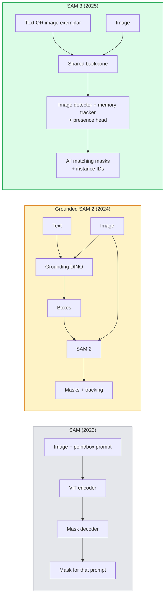

# SAM3与开放词库分类

> 给模型一个文本提示和一张图像,即可获得每个匹配的对象的面具.

**类型：**使用 + 构建
**语言：**字符串
**先修要求：**阶段4课07 (U-Net),阶段4课08 (面具R-CNN),阶段4课18 (CLIP)
**时间：**时间60分钟

## 学习目标

- 区分 SAM(仅视觉提示) √ 基层 SAM / SAM 2(检测器 + SAM) 和 SAM 3(通过即时概念分类 原生支持文本提示)
- 解释SAM 3架构:共享脊柱+图像探测器+基于内存的视频追踪器+存在头+离合的探测器-追踪器设计
- 用拥抱的脸`transformers` SAM 3 集成进行文本提示检测,分类和视频跟踪
- 根据延迟,概念复杂性和部署目标,在SAM3之间做选择,

## 问题

2023年SAM是一个仅支持视觉提示的模型:你点击一个点或画一个框,它返回一个面具.对于把这张照片中的所有子都找出来,你需要一个探测器.

SAM 3(Meta,2025年11月,ICLR 2026) 缩小了这个级联――它接受一个简短的名词短语或一个图像示范 作为提示,并一次向前传递 中返回所有匹配的面具和实例ID――这就是**Promptable Concept Segmentation (PCS)**结合2026年3月的对象多重更新(SAM 3.1),它可以高效地在视频中跟踪同一概念的多个实例──

本课程关注的是它所代表的结构性转变――2D分辨和文字图像的定位已经合并到一个模型里――生产问题不再是要把哪些管道串起来,而是哪些快速的模型可以端到端处理我的使用案例──

## 概念

### 三代模型



### 可快速的概念分类

概念提示 是一个简短的名词短语`"yellow school bus"`,我知道.`"striped red umbrella"`,我知道.`"hand holding a mug"`) 或一个图像示例――模型会为图像中每个匹配的概念实例 返回分类面具,并返回每个匹配项目的唯一实例ID――

这与经典视觉快速SAM有三个不同:

1. 不需要个别实例 提供提示:一个文本提示 返回所有匹配项.
2. 开放词汇:概念可以是任何可以用自然语言描述的内容.
3. 一次回复多次,而不是每次回复一个面具.

### 关键架构组件

- **Shared backbone**视频处理图片,检测器头,基于内存的跟踪器都从中读取信息.
- **Presence head**预测概念是否存在图像中──将在这里有没有?和它在哪里?解──减少概念 不存在时的虚假积极性──
- **Decoupled detector-tracker**视频水平跟踪 使用独立头,避免相互干扰
- **Memory bank**跨框架 存储每个实例的功能,用于视频跟踪(与SAM 2 使用的机制相同) ⋅

### 大规模训练

 SAM 3 在**400 万个 unique concepts**上训练,这些概念由一个数据引擎发明,该引擎通过AI+人工审核代标注并修改. 新**SA-CO benchmark**包含270万个独特概念,比以前的基准大50倍.SAM3在SA-CO上达到人类表现的75-80%,并提高了现有系统的图像+视频PCS表现两倍.

###  SAM 3.1 物体多重

时间:2026 年 3 月更新:**Object Multiplex**引入了一种共享内存机制,用于同时联合跟踪同一概念的多个实例.此前,跟踪N个实例意味着需要N个独立的内存银行.多个复合将其缩小到一个共享内存,并使用每次实例查询.结果是在不牺牲准确性的前提下,显著加速多对象跟踪.

### 2026年 地面 SAM 仍然是重要的场景

- 当你需要更换特定的开放词汇探测器时
- 当SAM3许可证 (HF上门)成为阻碍时――
- 当你需要控制探测器门时,
- 用于探测器组件的研究/除工作.

模块化管道 仍然有价值.

### 约洛世界vs三星

- **YOLO-World**只有开放语音检测器 (无面具) 实时――当你需要高光率的盒子时最合适――
- **SAM 3**完整的细分+跟踪――更慢,但输出更丰富――

生产场景划分:YOLO-世界 适合快速检测的管道(机器人导航、快速仪表板),SAM 3 适合任何需要面具或跟踪的场景──

### 效率

解决SAM的解码瓶──关键思想:

- **Sparse point prompting**通过使用少量精心选择的点,而不是密集提示;将解码器调用减少96%──
- **Shallow mask aggregation**面具将被整成更清晰的面具.
- **Decoupled mask injection**解码器接收预计算的面具功能,而不是重新运行.

结果:在开放词汇基准上相比,基层SAM约有1.6×速度.

### 三个模型的输出格式

它们都回归相同的一般结构 (盒子+标签+分数+面具+身份证),这很有帮助:你的下游管道不需要根据运行的模型来分支.


```figure
cv3-open-vocab
```

## 构建

### 步骤1: 立即构建

构建一个辅助器,将用户句子转换为SAM 3概念提示列表.

```python
def split_concepts(sentence):
    """
    Heuristic splitter for multi-concept prompts.
    Returns list of short noun phrases.
    """
    for sep in [",", ";", "and", "or", "&"]:
        if sep in sentence:
            parts = [p.strip() for p in sentence.replace("and ", ",").split(",")]
            return [p for p in parts if p]
    return [sentence.strip()]

print(split_concepts("cats, dogs and balloons"))
```

SAM 3 每次前进通过 接受一个概念;对于多概念查询,循环或批量处理它们.

### 步骤2:后处理辅助员

为了匹配我们第4阶段16课的管道合同.

```python
from dataclasses import dataclass
from typing import List

@dataclass
class ConceptDetection:
    concept: str
    instance_id: int
    box: tuple          # (x1, y1, x2, y2)
    score: float
    mask_rle: str       # run-length encoded


def rle_encode(binary_mask):
    flat = binary_mask.flatten().astype("uint8")
    runs = []
    prev, count = flat[0], 0
    for v in flat:
        if v == prev:
            count += 1
        else:
            runs.append((int(prev), count))
            prev, count = v, 1
    runs.append((int(prev), count))
    return ";".join(f"{v}x{c}" for v, c in runs)
```

即使有很多高分辨率面具,RLE 也能让响应有效载荷保持较小.

### 步骤3:统一的开放语音分区接口

将你拥有的任意后端 ((SAM 3、Grounded SAM 2、YOLO-World + SAM 2) 封装在一个统一方法之后――当后端 改变时,下游代码不需要改变――

```python
from abc import ABC, abstractmethod
import numpy as np

class OpenVocabSeg(ABC):
    @abstractmethod
    def detect(self, image: np.ndarray, concept: str) -> List[ConceptDetection]:
        ...


class StubOpenVocabSeg(OpenVocabSeg):
    """
    Deterministic stub used for pipeline testing when real models are not loaded.
    """
    def detect(self, image, concept):
        h, w = image.shape[:2]
        return [
            ConceptDetection(
                concept=concept,
                instance_id=0,
                box=(w * 0.2, h * 0.3, w * 0.5, h * 0.8),
                score=0.89,
                mask_rle="0x100;1x50;0x200",
            ),
            ConceptDetection(
                concept=concept,
                instance_id=1,
                box=(w * 0.55, h * 0.25, w * 0.85, h * 0.75),
                score=0.74,
                mask_rle="0x80;1x40;0x220",
            ),
        ]
```

真正的`SAM3OpenVocabSeg`亚级 会封装 `transformers.Sam3Model`和 `Sam3Processor`,我知道.

### 步骤4: 抱着脸SAM 3 用法(参考)

实际模型的`transformers`集成:

```python
from transformers import Sam3Processor, Sam3Model
import torch

processor = Sam3Processor.from_pretrained("facebook/sam3")
model = Sam3Model.from_pretrained("facebook/sam3").eval()

inputs = processor(images=pil_image, return_tensors="pt")
inputs = processor.set_text_prompt(inputs, "yellow school bus")

with torch.no_grad():
    outputs = model(**inputs)

masks = processor.post_process_masks(
    outputs.masks, inputs.original_sizes, inputs.reshaped_input_sizes
)
boxes = outputs.boxes
scores = outputs.scores
```

一个提示,一次调用返回所有匹配项.

### 步骤5:测量地面SAM2 免费提供什么

一个诚实的基准:在真实管道中使用SAM3 取代地面SAM2会发生什么?

- 延迟:SAM 3 省掉一次前进传输 (没有独立探测器),但模型本身更重;通常总体持平或略有速度.
- 精度:SAM 3 在罕见或组合概念中`"striped red umbrella"`上明显更好──在常见单词概念上相近──
- 灵活性:地面 SAM 2 允许您替换探测器 ((DINO-X、佛罗伦萨-2、地面 DINO 1.5);SAM 3 是单色的──

结论:SAM 3 是2026年开放口语分类的默认选择.

## 使用

生产部署模式:

- **Real-time annotation**:SAM 3 + CVAT的标签作为文本提示功能──标注员选择一个标签名称;SAM 3 预标注每个匹配的实例──再进行审核和修改──
- **Video analytics**:SAM 3.1 对象多重用于多重对象跟踪;将框架输入基于内存的跟踪器──
- **Robotics**作为规划原始的运行.
- **Medical imaging**需要在HF上申请访问.

超分析在其Python包中封装了SAM3:

```python
from ultralytics import SAM

model = SAM("sam3.pt")
results = model(image_path, prompts="yellow school bus")
```

与YOLO和SAM2使用相同的界面.

## 交付

本课会产出:

- `outputs/prompt-open-vocab-stack-picker.md`根据延迟,概念复杂性和许可选择SAM 3 /地面SAM 2 /YOLO-World /SAM-MI的提示──
- `outputs/skill-concept-prompt-designer.md`作为一个用户话语转换为一个好的 SAM 3概念提示的技能(分开,含,倒退)

## 练习

1. **（Easy）**在10张图像上运行SAM 3,并使用你自己选择的概念提示──与上图片相同的SAM 2 + Grounding DINO 1.5对比──报告每个模型错过了哪些概念──
2. **（Medium）**在 SAM 3 之上构建一个 点击加入/点击排除 UI:text prompt 返回候选实例;用户点击保留哪些算作正面──将最终概念集合输出为 JSON──
3. **（Hard）**在自定义概念组中 (例如5种电子组件) 细调SAM 3,每种标记的图像为20张――与相同的测试组上的零射SAM 3对比;测量面具IoU的改善――

## 关键术语

| Term | 人们通常怎么说 | 实际含义 |
|------|----------------|----------------------|
| Open-vocabulary segmentation | “Segment by text” | 为自然语言描述的 objects 生成 masks，而不是使用固定 label set |
| PCS | “Promptable Concept Segmentation” | SAM 3 的核心任务：给定一个 noun-phrase 或 image exemplar，segment 所有匹配 instances |
| Concept prompt | “The text input” | 简短名词短语或 image exemplar；不是完整句子 |
| Presence head | “Is it here?” | SAM 3 中的模块，用于在 localisation 之前判断 concept 是否存在于 image 中 |
| SA-CO | “SAM 3 benchmark” | 包含 270K concepts 的 open-vocabulary segmentation benchmark；比以往 open-vocab benchmarks 大 50 倍 |
| Object Multiplex | “SAM 3.1 update” | Shared-memory multi-object tracking；快速联合跟踪多个 instances |
| Grounded SAM 2 | “Modular pipeline” | Detector + SAM 2 级联；当 detector 替换很重要时仍然相关 |
| SAM-MI | “Efficient SAM variant” | Mask Injection，相比 Grounded-SAM 实现 1.6x speedup |

## 延伸阅读

- [SAM 3: Segment Anything with Concepts (arXiv 2511.16719)](https://arxiv.org/abs/2511.16719)
- [SAM 3.1 Object Multiplex (Meta AI, March 2026)](https://ai.meta.com/blog/segment-anything-model-3/)
- [SAM 3 model page on Hugging Face](https://huggingface.co/facebook/sam3)
- [Grounded SAM 2 tutorial (PyImageSearch)](https://pyimagesearch.com/2026/01/19/grounded-sam-2-from-open-set-detection-to-segmentation-and-tracking/)
- [Ultralytics SAM 3 docs](https://docs.ultralytics.com/models/sam-3/)
- [SAM3-I: Instruction-aware SAM (arXiv 2512.04585)](https://arxiv.org/abs/2512.04585)
