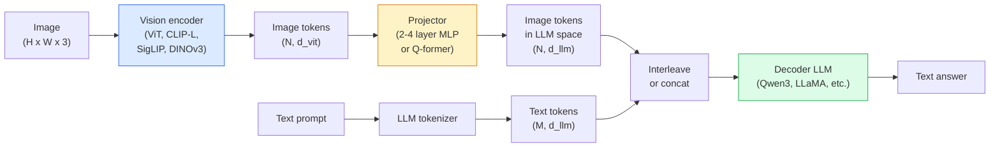

# 视觉语言模型  ViT-MLP-LLM 模式

> 视觉编码器将图像转换为代币――MLP投影机将这些代币映射到LLM的嵌入空间――语言模型完成剩下的工作――这个模式 ViT-MLP-LLM  就是2026年所有生产级VLM的共同结构――

**类型：**学习 + 使用
**语言：**字符串
**前置要求：**阶段4课14 (ViT),阶段4课18 (CLIP),阶段7课02 (自我注意)
**时间：**七十五分钟

## 学习目标

- 说清VIT-MLP-LLM架构,并解释三个组件各自贡献什么
- 从参数,文本长度和基准性能角度比较 Qwen3-VL、InternVL3.5、LLaVA-Next 和 GLM-4.6V
- 解释DeepStack:为什么多层 ViT功能比单一最后层功能更能紧紧视觉语言的配合
- 在生产环境中使用跨模式错误率 (CMER) 衡量VLM幻觉,并基于该信号采取行动

## 问题

CLIP (阶段4课 18) 为图像和文本提供共享嵌入空间,这足以支持零射分类和检索. 它无法回答这个图片里有多少红色汽车?

视觉语言模型 (VLMs)  Qwen3-VL、InternVL3.5、LLaVA-Next、GLM-4.6V  将CLIP-家庭图像编码器 接到一个完整的语言模型上――模型看一张图像加一个问题,然后生成答案――到2026年,开源VLM在多模拟基准 (MMMU,MMBench, DocVQA, ChartQA,MathVista,OSWorld) 上已经可以比肩甚至超过GPT-5 和 Gemini-2.5-Pro──

这组三件套装 (ViT,投影机,LLM) 是标准结构.模型之间的差异在于使用哪个ViT,哪个投影机,哪个LLM,训练数据以及配列配方.

## 概念

### 架构 ViT-MLP-LLM



1. **Vision encoder** 预训练 ViT(CLIP-L/14、SigLIP、DINOv3,或细调变体) ・产出补丁代币──
2. **Projector** 一个小模块 ((2-4 层 MLP,或 Q-former),将视觉代币映射到LLM的嵌入维度――大多数细调都发生在这里――
3. **LLM**仅使用解码器的语言模型 ((Qwen3、Llama、Mistral、GLM、InternLM) ⋅按序读取视觉+文本代币,并生成文本。

实际上,视觉编码器和LLM大多保持冷,只训练投影机,这样可以以低成本承担数十亿参数规模的信号.

### 子

通常的投影只使用最后层的VT层――DeepStack(Qwen3-VL) 将从多个VT深度采样功能中进行堆并将它们堆起来――更深层携带高层语义;更浅层携带细粒度的空间和纹理信息――把两者都送进LLM,可以弥合图像包含什么语义) 和具体在哪里空间接地) 之间的差距――

### 三个训练阶段

现代VLM 分阶段训练:

1. **Alignment**结结ViT 和LLM──只在图像标题对上训练投影机──教会投影机将视觉空间映射到语言空间──
2. **Pre-training** 解所有部分──大规模交错图像文本数据(500万+对) 上训练──构建模型的视觉知识──
3. **Instruction tuning** 在精选的(图像,问题,答案) 三元组上细节调──教会对话行为 和任务格式──这一步把视觉意识的LM变成可用的助手──

大多数LoRA细节调节将使用小规模标签数据集针对第3阶段进行.

### 模型家族比较(2026年初)

| Model | Params | Vision encoder | LLM | Context | Strengths |
|-------|--------|----------------|-----|---------|-----------|
| Qwen3-VL-235B-A22B (MoE) | 235B (22B active) | custom ViT + DeepStack | Qwen3 | 256K | 综合 SOTA，GUI agent |
| Qwen3-VL-30B-A3B (MoE) | 30B (3B active) | custom ViT + DeepStack | Qwen3 | 256K | 更小的 MoE 替代方案 |
| Qwen3-VL-8B (dense) | 8B | custom ViT | Qwen3 | 128K | 生产环境 dense 默认选择 |
| InternVL3.5-38B | 38B | InternViT-6B | Qwen3 + GPT-OSS | 128K | MMBench / MMVet 表现强 |
| InternVL3.5-241B-A28B | 241B (28B active) | InternViT-6B | Qwen3 | 128K | 可与 GPT-4o 竞争 |
| LLaVA-Next 72B | 72B | SigLIP | Llama-3 | 32K | 开放，易于 fine-tune |
| GLM-4.6V | ~70B | custom | GLM | 64K | Open-source，OCR 强 |
| MiniCPM-V-2.6 | 8B | SigLIP | MiniCPM | 32K | 适合边缘部署 |

### 视觉剂

文3VL-235B 在OSWorld上达到全球顶尖表现,OSWorld是面向的**visual agents**模型看到截图,理解UI,并输出操作,点击,类型,滚动. 结合工具后,它可以关闭完成常见桌面任务.

### 代理能力+ROPE 变体

视频中发生了什么事**什么时候**△Qwen3-VL 从T-RoPE (时间旋转位置嵌入) 演进到**基于文本的时间 alignment**视频框架与图像图像图像`<timestamp 00:32>`时间关系的时间.

### 调整问题

爬取数据集中的12%的图像文字对不完全由图像支的描述.

太空工作.ai 引入了**Cross-Modal Error Rate (CMER)**追踪它:

```
CMER = fraction of outputs where the text confidence is high but the image-text similarity (via a CLIP-family checker) is low
```

高CMER意味着模型正在自信地说没有被图像支的内容――监控CMER,并将其作为生产KPI,在他们的部署中将降低大约35%的幻觉率――关键不是修复模型,而是把高CMER输出路由到人工审核──

### 使用 LoRA / QLoRA 进行细调

对于70BVLM做完整的细调 超出了大多数团队的能力范围. 在注意力+投影器层上使用LoRA(排名16-64),或使用4位基重的QLoRA,可以装入单张A100/H100──成本:5,000-50,000个样本,$100-$计算成本5000,2-10小时训练时间

### 空间推理仍然薄弱

当前VLM在空间推理基准中 ((上下左右数量、距离) 上分为50-60%. 如果你的使用情况依赖于其他物体上的物体,需要大量验证,一般VLM性能低于人类.


```figure
v4-vlm-projector
```

## 构建它

### 步骤1:投影机

这是你最常训练的部分.

```python
import torch
import torch.nn as nn


class Projector(nn.Module):
    def __init__(self, vit_dim=768, llm_dim=4096, hidden=4096):
        super().__init__()
        self.net = nn.Sequential(
            nn.Linear(vit_dim, hidden),
            nn.GELU(),
            nn.Linear(hidden, llm_dim),
        )

    def forward(self, x):
        return self.net(x)
```

输入一个`(N_patches, d_vit)`标志性子.`(N_patches, d_llm)`,我会把每一行输出都作为另一个标志.

### 步骤2: 端到端组装 ViT-MLP-LLM

下面是VLM的最小前进通行骨架.`transformers`现场展示的概念布局

```python
class MinimalVLM(nn.Module):
    def __init__(self, vit, projector, llm, image_token_id):
        super().__init__()
        self.vit = vit
        self.projector = projector
        self.llm = llm
        self.image_token_id = image_token_id  # placeholder token in text prompt

    def forward(self, image, input_ids, attention_mask):
        # 1. vision features
        vision_tokens = self.vit(image)                     # (B, N_patches, d_vit)
        vision_embeds = self.projector(vision_tokens)       # (B, N_patches, d_llm)

        # 2. text embeddings
        text_embeds = self.llm.get_input_embeddings()(input_ids)  # (B, M, d_llm)

        # 3. replace image placeholder tokens with vision embeds
        merged = self._merge(text_embeds, vision_embeds, input_ids)

        # 4. run LLM
        return self.llm(inputs_embeds=merged, attention_mask=attention_mask)

    def _merge(self, text_embeds, vision_embeds, input_ids):
        out = text_embeds.clone()
        expected = vision_embeds.size(1)
        for b in range(input_ids.size(0)):
            positions = (input_ids[b] == self.image_token_id).nonzero(as_tuple=True)[0]
            if len(positions) != expected:
                raise ValueError(
                    f"batch item {b} has {len(positions)} image tokens but vision_embeds has {expected} patches."
                    " Every sample in the batch must be pre-padded to the same number of image placeholder tokens.")
            out[b, positions] = vision_embeds[b]
        return out
```

文本中`<image>`位置持有符号将被替换为真实图像嵌入,LLaVA、Qwen-VL 和 InternVL 使用的都是相同的模式.

### 步骤3: CMER 计算

一个轻量运行时检查.

```python
import torch.nn.functional as F


def cross_modal_error_rate(image_emb, text_emb, text_confidence, sim_threshold=0.25, conf_threshold=0.8):
    """
    image_emb, text_emb: embeddings of image and generated text (normalised internally)
    text_confidence:     mean per-token probability in [0, 1]
    Returns:             fraction of high-confidence outputs with low image-text alignment
    """
    image_emb = F.normalize(image_emb, dim=-1)
    text_emb = F.normalize(text_emb, dim=-1)
    sim = (image_emb * text_emb).sum(dim=-1)        # cosine similarity
    high_conf_low_sim = (text_confidence > conf_threshold) & (sim < sim_threshold)
    return high_conf_low_sim.float().mean().item()
```

将CMER作为生产KPI──按终点、即时类型、客户分别监控它──CMER 上升表示模型开始在某些输入分布上幻觉──

### 步骤 4:玩具VLM分类器 (可运行)

演示投影机是可以训练的. 伪造的.

```python
class ToyVLM(nn.Module):
    def __init__(self, vit_dim=32, llm_dim=64, num_classes=5):
        super().__init__()
        self.projector = Projector(vit_dim, llm_dim, hidden=64)
        self.head = nn.Linear(llm_dim, num_classes)

    def forward(self, vision_tokens):
        projected = self.projector(vision_tokens)
        pooled = projected.mean(dim=1)
        return self.head(pooled)
```

您可以在合成的模中使用不到200个步骤,这足以说明投影机模式是有效的.

## 使用它

2026年生产团队使用VLM的三种方式:

- **Hosted API**OpenAI Vision、人类的克劳德视觉、谷歌双胞胎视觉──零基础设施,存在供应商风险──
- **Open-source self-host**通过`transformers`和 `vllm`使用Qwen3-VL或InternVL3.5──完全控制,前期投入更高──
- **在领域数据上 fine-tune** 加载Qwen2.5-VL-7B或LLaVA-1.6-7B,在5k-50k自定义样本上做LoRA,用 `vllm`或`TGI`服务.

```python
from transformers import AutoProcessor, AutoModelForVision2Seq
import torch
from PIL import Image

model_id = "Qwen/Qwen3-VL-8B-Instruct"
processor = AutoProcessor.from_pretrained(model_id)
model = AutoModelForVision2Seq.from_pretrained(model_id, torch_dtype=torch.bfloat16, device_map="auto")

messages = [{
    "role": "user",
    "content": [
        {"type": "image", "image": Image.open("plot.png")},
        {"type": "text", "text": "What does this chart show?"},
    ],
}]
inputs = processor.apply_chat_template(messages, add_generation_prompt=True, tokenize=True, return_dict=True, return_tensors="pt").to("cuda")
generated = model.generate(**inputs, max_new_tokens=256)
answer = processor.decode(generated[0][inputs["input_ids"].shape[1]:], skip_special_tokens=True)
```

`apply_chat_template`隐藏了`<image>`模型会在内部处理合并.

## 交付它

本课会产出:

- `outputs/prompt-vlm-selector.md` 在给定准确度,延迟,文本长度和预算的情况下选择Qwen3-VL / InternVL3.5 / LLaVA-Next / API──
- `outputs/skill-cmer-monitor.md` 生成代码,使用跨模式错误率为生产级VLM终点加上仪器,按终点的仪表板以及警报门.

## 练习

1. **（简单）**在五张图像上,用任意开放的VLM 跑三个提示(这是什么?、数对象、描述场景) ・手动将每个答案评为正确 /部分正确 /幻觉──计算一个第一次通过CMER类似的率──
2. **（中等）**在目标领域的500张带标题图像上,使用LoRA(排名 16)精确调 Qwen2.5-VL-3B或 LLaVA-1.6-7B──比较零射和精确调的MMBench风格准确性──
3. **（困难）**将VLM的图像编码器从默认SigLIP/CLIP 替换为DINOv3──只重新训练投影机(冷的LLM +冷的DINOv3)──衡量密集预测任务(计算、空间推理) 是否提升──

## 关键术语

| Term | 人们常说 | 实际含义 |
|------|----------------|----------------------|
| ViT-MLP-LLM | “VLM pattern” | Vision encoder + projector + language model；每个 2026 年 VLM 都如此 |
| Projector | “桥梁” | 2-4 层 MLP（或 Q-former），将 vision tokens 映射到 LLM embedding space |
| DeepStack | “Qwen3-VL feature trick” | stack 多层级 ViT features，而不是只使用最后一层 |
| Image token | “<image> placeholder” | text stream 中的 special token，会被 projected vision embeddings 替换 |
| CMER | “Hallucination KPI” | Cross-Modal Error Rate；当 text confidence 高但 image-text similarity 低时，该值较高 |
| Visual agent | “会点击的 VLM” | 通过 tool calls 操作 GUI（OSWorld、mobile、web）的 VLM |
| Q-former | “固定数量的 token bridge” | BLIP-2 风格的 projector，产出固定数量的 visual query tokens |
| Alignment / pre-training / instruction tuning | “三个阶段” | 标准 VLM 训练 pipeline |

## 延伸阅读

- [Qwen3-VL Technical Report (arXiv 2511.21631)](https://arxiv.org/abs/2511.21631)
- [InternVL3.5 Advancing Open-Source Multimodal Models (arXiv 2508.18265)](https://arxiv.org/html/2508.18265v1)
- [LLaVA-Next series](https://llava-vl.github.io/blog/2024-05-10-llava-next-stronger-llms/)
- [BentoML: Best Open-Source VLMs 2026](https://www.bentoml.com/blog/multimodal-ai-a-guide-to-open-source-vision-language-models)
- [MMMU: Multi-discipline Multimodal Understanding benchmark](https://mmmu-benchmark.github.io/)
- [VLMs in manufacturing (Robotics Tomorrow, March 2026)](https://www.roboticstomorrow.com/story/2026/03/when-machines-learn-to-see-like-experts-the-rise-of-vision-language-models-in-manufacturing/26335/)
