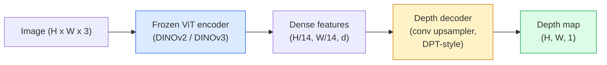

# 单光深度与几何估计

> 深度地图是单通道图像,其中每个像素都表示到相机的距离.过去,如果没有立体音频或LiDAR,只从RGB预测到2026年,一个结结合的ViT编码器加上轻量级头,就能达到与地面真相差的几百分点效果.

**类型：**构建 + 使用
**语言：**字符串
**前置要求：**阶段4课14 (ViT),阶段4课17 (自我监督视觉),阶段4课07 (U-Net)
**时间：**约60分钟

## 学习目标

- 区分相对深度和度量深度,并说明每个生产级模型 ((MiDaS,Marigold,深度任何V3, ZoeDepth) 解决的是哪种
- 使用 深度任何东西 V3(DINOv2脊柱) 在无需校准的情况下,为任意单张图像预测深度
- 解释为什么单张图像中形成的单张图像深度 (从单张图像中形成的视角线索,纹理梯度,学习的先例),以及它无法恢复什么 (从绝对尺度,被排除的几何学)
- 使用深度地图和孔摄像头内在将2D检测升级为3D点

## 问题

深度是2D计算机视觉中缺失的轴――给定RGB,你知道物体在图像平面中出现的位置;但你不知道它们有多远――深度传感器 (stereo rigs、LiDAR、飞行时间) 可以直接解决这个问题,但它们昂贵、脆弱,而且范围受限──

单张RGB框架预测深度,过去常常产生模糊且不可靠的输出――到2026年,大型预训练编码器改变了这一点:深度任何东西 V3 使用结的DINOv2脊柱,并产生能够泛化到室内,户外,医疗和卫星域的深度地图――马里戈尔德将重新表述为条件扩散问题――果深度回归真实的测量距离――

深度也就是2D检测和3D理解之间的桥梁:将检测盒子的像素乘以深度,可以将2D对象升级到3D点云――这是每个AR遮蔽系统,每个障碍避免管道以及每个起杯的机器人核心――

## 概念

### 相对对对度深度

- **Relative depth**没有真实世界单位的序列`z`像素A比像素B更接近,但距离比例并未确定到米.
- **Metric depth** 从相机出发 以米的绝对距离 要求模型 学习图像线索与真实距离之间的统计关系

子子子子子子子子子子子子子子子子子子子子子子子子子子子子子子子子子子子子子子子子子子子子子子子子子子子子子子子子子子子子子子子子子子子子子子子子子子子子子子子子子子子子子子子子子子子子子子子子子子子子子子子子子子子子子子子子子子子子子子子子子子子子子子子子子子子子子子子子子子子子子

### 编码器-解码器模式



结编码器,只训练 DPT式编码器――编码器提供丰富的功能;编码器将这些功能插入值回图像分辨率,并回归深度――

### 为什么单张图像也能产生深度

一张2D图像包含许多与深度相关的单光线线:

- **Perspective** 3D 中的平行线在 2D 中会收收──
- **Texture gradient** 远处的表面具有更小的度.
- **Occlusion order**更近的物体会遮更远的物体.
- **Size constancy**已知物体 (汽车,人类) 提供近似尺度.
- **Atmospheric perspective**在室外场景中,远处的物体看起来更、更偏蓝.

只有足够的数据,足够强大的脊椎,单形深度,即使没有任何显而易见的3D监控,也能达到合理的精度.

### 单光深度 不能做什么

- 没有内在或场景中已知物体,无法得到**absolute metric scale**网络可以预测杯距离是子的两倍,但不知道杯是1米还是10米远.
- **Occluded geometry** 椅子背面是不可见的,可靠的推断.
- **真正无 texture / reflective surfaces**镜子,玻璃,均的墙壁.

### 2026年深度任何东西V3

- 使用原生 DINOv2 ViT-L/14 作为编码器
- 其他类型的设备
- 在多种来源的插图对上训练,除了光学一致性,不需要显而易见的深度监督)
- 能够从**任意数量的 visual inputs 中预测空间一致的 geometry，无论是否已知 camera poses**,我知道.
- 在单光深度,任何视图几何,视觉染,摄像头姿势估计上达到SOTA.

这就是2026年需要深度的调用模式.

###   用于深度的扩散

根据"图像与图像扩散条件"",RGB"",目标:深度地图"",使用预训练的稳定扩散2U-Net作为脊柱"",输出深度地图在对象边界处格外清晰"",权衡:比进取模型更慢 ((10-50个个指责步骤) ").

### 内部和孔相机

需要带来深度.`d`的像素`(u, v)`提升为摄像头坐标 中的3D点`(X, Y, Z)`其他:

```
fx, fy, cx, cy = camera intrinsics
X = (u - cx) * d / fx
Y = (v - cy) * d / fy
Z = d
```

内部数据来自EXIF元数据,校准模式,或单元内在估计器 (Perspective Fields,UniDeepth) ⋅没有内在数据,你仍然可以通过假设60-70° FOV和中等分辨率主点 来染点云,这适合可视化,但不适合测量──

### 评估

两个标准指标:

- **AbsRel**(绝对相对错误):`mean(|d_pred - d_gt| / d_gt)`越低越好――生产级模型通常为0.05-0.1――
- **delta < 1.25**(门准确性):满足 `max(d_pred/d_gt, d_gt/d_pred) < 1.25`像素占比越高越好.

对于相对深度 (度任何东西 V3、MiDaS),评估使用这两个指标的尺度和转移不变版本.


```figure
depth-sweep
```

## 构建

### 步骤1:深度指标

```python
import torch

def abs_rel_error(pred, target, mask=None):
    if mask is not None:
        pred = pred[mask]
        target = target[mask]
    return (torch.abs(pred - target) / target.clamp(min=1e-6)).mean().item()


def delta_accuracy(pred, target, threshold=1.25, mask=None):
    if mask is not None:
        pred = pred[mask]
        target = target[mask]
    ratio = torch.maximum(pred / target.clamp(min=1e-6), target / pred.clamp(min=1e-6))
    return (ratio < threshold).float().mean().item()
```

在评估前,始终面具无效的深度像素 ((零、Na、N、和) ⋅

### 步骤2:规模和转变的配合

对于相对深度模型,在计算指标中前先将预测对齐到底的真相.`a * pred + b = target`做最小平方的适合:

```python
def align_scale_shift(pred, target, mask=None):
    if mask is not None:
        p = pred[mask]
        t = target[mask]
    else:
        p = pred.flatten()
        t = target.flatten()
    A = torch.stack([p, torch.ones_like(p)], dim=1)
    coeffs, *_ = torch.linalg.lstsq(A, t.unsqueeze(-1))
    a, b = coeffs[:2, 0]
    return a * pred + b
```

在评估MiDaS / 深度任何时,先运行 `align_scale_shift`运行`abs_rel_error`,我知道.

### 步骤3:将深度升级为点云

```python
import numpy as np

def depth_to_point_cloud(depth, intrinsics):
    H, W = depth.shape
    fx, fy, cx, cy = intrinsics
    v, u = np.meshgrid(np.arange(H), np.arange(W), indexing="ij")
    z = depth
    x = (u - cx) * z / fx
    y = (v - cy) * z / fy
    return np.stack([x, y, z], axis=-1)


depth = np.random.uniform(0.5, 4.0, (240, 320))
intr = (320.0, 320.0, 160.0, 120.0)
pc = depth_to_point_cloud(depth, intr)
print(f"point cloud shape: {pc.shape}  (H, W, 3)")
```

一个函数,适用于所有3D升级应用.`.ply`在 MeshLab或CloudCompare中打开.

### 步骤4:使用合成深度场景做烟雾测试

```python
def synthetic_depth(size=96):
    yy, xx = np.meshgrid(np.arange(size), np.arange(size), indexing="ij")
    # Floor: linear gradient from near (top) to far (bottom)
    depth = 1.0 + (yy / size) * 4.0
    # Box in the middle: closer
    mask = (np.abs(xx - size / 2) < size / 6) & (np.abs(yy - size * 0.6) < size / 6)
    depth[mask] = 2.0
    return depth.astype(np.float32)


gt = torch.from_numpy(synthetic_depth(96))
pred = gt + 0.3 * torch.randn_like(gt)  # simulated prediction
aligned = align_scale_shift(pred, gt)
print(f"before align  absRel = {abs_rel_error(pred, gt):.3f}")
print(f"after align   absRel = {abs_rel_error(aligned, gt):.3f}")
```

### 步骤 5: 任何东西的深度 V3 使用方式(引用)

```python
import torch
from transformers import pipeline
from PIL import Image

pipe = pipeline(task="depth-estimation", model="LiheYoung/depth-anything-v2-large")

image = Image.open("street.jpg").convert("RGB")
out = pipe(image)
depth_np = np.array(out["depth"])
```

没有什么可做.`out["depth"]`是PIL灰度尺度;转换为 numpy 后用于数学计算──对于深度任何V3,发布后替换模型 id 即可;API 保持不变──

## 使用

- **Depth Anything V3**相对深度的默认选择――生产中最快的VIT大骨干模型――
- **Marigold**视觉质量最高, 传感慢.
- **UniDepth**米特里深度并带摄像头内在估计
- **ZoeDepth**米特里深度较旧,但仍然可靠.
- **MiDaS v3.1**遗产但稳定;适合作为比较基线.

典型的集成模式:

1. 现在我们已经到达了.
2. 深度模型 生成深度地图
3. 检测器生成盒子.
4. 通过深度将盒子中轴升级到3D;如果有点云,则与其合并.
5. 下游:AR封闭,路径规划,对象尺寸估计,立体变换.

对于实时使用,任何深度V2小 ((INT8量化) 在消费者GPU上以518x518可达到约30fps.

## 交付

本课会生成:

- `outputs/prompt-depth-model-picker.md` 根据延迟,测量对相对需求和场景类型,在深度任何东西 V3、玛丽戈德、UniDeepth、MiDaS 之间做选择──
- `outputs/skill-depth-to-pointcloud.md`从深度地图 构建点云的技能,正确处理内在并导出`.ply`,我知道.

## 练习

1. **（Easy）**在您的桌面任意10张图像上运行 深度任何东西 V2――将深度保存为灰度PNG并检查――找到一个预测深度看起来错误的对象,并解释为什么单光线线标志失败――
2. **（Medium）**给定深度任何V2的RGB+深度,将其升级为点云并没有使用`open3d`染色──比较两个场景,并记录哪个看起来更可信──
3. **（Hard）**拍摄五对图像,每对只改变已知物体的位置 (例如瓶向近处移动30厘米) ⋅使用UniDepth在两张图像上预测测度深度――报告预测距离与真实的30厘米的差异――

## 关键术语

| Term | 人们常说 | 实际含义 |
|------|----------------|----------------------|
| Monocular depth | "Single-image depth" | 从一帧 RGB 进行 depth estimation，不使用 stereo 或 LiDAR |
| Relative depth | "Ordered depth" | 没有真实世界单位的有序 z-values |
| Metric depth | "Absolute distance" | 以 metres 表示的 depth；需要 calibration 或使用 metric supervision 训练的 model |
| AbsRel | "Absolute relative error" | |d_pred - d_gt| / d_gt 的平均值；标准 depth metric |
| Delta accuracy | "delta < 1.25" | prediction 位于 ground truth 25% 以内的 pixels 占比 |
| Pinhole camera | "fx, fy, cx, cy" | 用于将 (u, v, d) 提升到 (X, Y, Z) 的 camera model |
| DPT | "Dense Prediction Transformer" | 位于冻结 ViT encoders 之上的 conv-based decoder，用于 depth |
| DINOv2 backbone | "The reason it works" | 无需 depth labels 即可跨 domains 泛化的 self-supervised features |

## 延伸阅读

- [Depth Anything V3 paper page](https://depth-anything.github.io/) 使用DINOv2编码器的SOTA单光深度
- [Marigold (Ke et al., CVPR 2024)](https://marigoldmonodepth.github.io/) 基于扩散的深度估计
- [UniDepth (Piccinelli et al., 2024)](https://arxiv.org/abs/2403.18913) 带内在的尺度深度
- [MiDaS v3.1 (Intel ISL)](https://github.com/isl-org/MiDaS)可尼克式相对深度基线
- [DINOv3 blog post (Meta)](https://ai.meta.com/blog/dinov3-self-supervised-vision-model/) 提升深度精度的编码器家族
