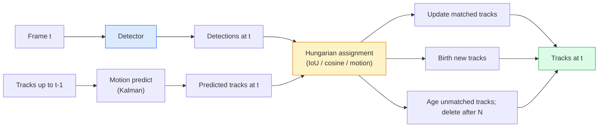

# 多个对象跟踪和视频内存

> 追踪是检测加关联――检测每一──按ID将当前的检测匹配上一的痕迹──

**Type:** Build
**Languages:** Python
**Prerequisites:** Phase 4 Lesson 06 (YOLO Detection), Phase 4 Lesson 08 (Mask R-CNN), Phase 4 Lesson 24 (SAM 3)
**Time:** ~60 分钟

## 学习目标

- 区分跟踪-通过检测 与基于查询的跟踪,并说出算法家族名称(SORT,DeepSORT,ByteTrack,BoT-SORT,SAM 2内存跟踪器,SAM 3.1对象多重)
- 从零实现IoU+匈牙利任务,用于经典的追踪-检测
- 解释SAM2的存储库以及为什么它比基于IoU更能处理结
- 读懂三种跟踪指标(MOTA,IDF1,HOTA),并为给定使用情况选择最重要的

## 问题

探测器会告诉你单个物体在哪里.`t`检测和框架中哪个`t-1`没有这个点,你就无法统计穿过一条线的物体数量,无法在封闭中持续跟踪一颗球,也无法知道4号车已经停在车道上8秒.

追踪对每一个视频面向的产品都至关重要:体育分析,监控,自动驾驶,医学视频分析,野生动物监测,字符号计算.核心构件是共同的:每框探测器,运动模型.

2026年带来了两种新模式:**SAM 2 memory-based tracking**(用特征记忆 替代运动模型协会) 和 **SAM 3.1 Object Multiplex**为了同样的概念的多个例子共享记忆) 本课先讲经典,再讲基于记忆的方法

## 核心概念

### 通过检测进行跟踪



现在,我们在2026年会遇到的每一个追踪器都是这个循环的变化.

- **SORT**(2016):卡尔曼过器+IoU 匈牙利语──简单、快速,没有外观模型──
- **DeepSORT**(2017):SORT + 每条轨道 一个基于CNN的外观功能 (ReID嵌入) 更多能处理交叉场景.
- **ByteTrack**(2021):将低可信度检测 作为第二阶段进行协作;不需要外观特征,但在MOT17上表现领先.
- **BoT-SORT**(2022):字节+相机运动补偿+ReID──
- **StrongSORT / OC-SORT** 字节轨道的后继方法,具有更好的运动和外观──

### 一段话理解卡尔曼过器

卡尔曼过器为每条轨道 维护一个带变量状态`(x, y, w, h, dx, dy, dw, dh)`,它首先使用常态速度模型.**predict**状态,然后使用匹配到的检测**update**△当预测的不确定性较高时,更新 会更信任检测――这会产生平滑轨迹,并让轨迹能够穿过短暂的封闭1-5 ) 继续存在――

每个经典追踪器都会在运动预测步骤使用卡尔曼过器.

### 匈牙利算法

给定一个`M x N`查找使总成本 最小的一对一任务――成本通常是`1 - IoU(track_bbox, detection_bbox)`运行时间是O(((M+N) ^3);当M、N最高约为1000时,通过`scipy.optimize.linear_sum_assignment`在Python中足够快.

### 通过"ByteTrack"的关键思想

标准跟踪器会丢弃低置信度检测(<0.5) ――ByteTrack会保留它们作为**second-stage candidates**首先将轨道与高信任检测匹配,然后让未匹配的轨道使用稍宽松的IoU门尝试匹配低信任检测.

### 基于内存的SAM2追踪

通过维护每次空间时间特征的**memory bank**在后续中,记忆会与新功能进行交叉关注,解码器则为新中的同一实例生成面具.

没有卡尔曼过器,也没有匈牙利任务.

优点:
- 对于大范围的隐藏 鲁棒(记忆 会跨多携带实例身份)
- 与SAM3的文本提示结合时支持开放词汇──
- 无需单独的运动模式.

缺点:
- 对于多个物体的追踪比ByteTrack更慢.
- 记忆银行 会增长;文本窗口受限.

###  SAM 3.1 物体多重

此前的SAM2 /SAM3追踪会为每一个实例保留独立的存储库――50个对象就是50个存储库――对象多重(2026年3月) 将它们缩小为带有**per-instance query tokens**共有内存的成本随着数量呈线性增长的情况而增长.

许多人都在车上,

### 需要掌握的三种指标

- **MOTA (Multi-Object Tracking Accuracy)** 1 - (FN + FP + ID 开关) / GT──按错误类型加权;这是一个将检测和关联失败混合在一起的单一指标──
- **IDF1 (ID F1)** ID精度与回忆的和平均值――专注衡量每条基本真相轨道在时间保持其 ID 的程度――对 ID 交换敏感任务来说比 MOTA 更好――
- **HOTA (Higher Order Tracking Accuracy)**分解为检测精度 (DetA) 与关联精度 (AssA) 社区标准自2020年以来;最全面的――

对于监视的: 对于运动分析的: 对于一般学术的: 对于


```figure
cv3-track-assoc
```

## 构建它

### 步骤1:基于IU的成本矩阵

```python
import numpy as np


def bbox_iou(a, b):
    """
    a, b: [x1, y1, x2, y2] 的 (N, 4) arrays。
    返回 (N_a, N_b) IoU matrix。
    """
    ax1, ay1, ax2, ay2 = a[:, 0], a[:, 1], a[:, 2], a[:, 3]
    bx1, by1, bx2, by2 = b[:, 0], b[:, 1], b[:, 2], b[:, 3]
    inter_x1 = np.maximum(ax1[:, None], bx1[None, :])
    inter_y1 = np.maximum(ay1[:, None], by1[None, :])
    inter_x2 = np.minimum(ax2[:, None], bx2[None, :])
    inter_y2 = np.minimum(ay2[:, None], by2[None, :])
    inter = np.clip(inter_x2 - inter_x1, 0, None) * np.clip(inter_y2 - inter_y1, 0, None)
    area_a = (ax2 - ax1) * (ay2 - ay1)
    area_b = (bx2 - bx1) * (by2 - by1)
    union = area_a[:, None] + area_b[None, :] - inter
    return inter / np.clip(union, 1e-8, None)
```

### 步骤 2: 最小 SORT 风格追踪器

为简洁起见,省略固定恒速卡尔曼;这里使用简单的IoU协会;在生产环境中,卡尔曼预测是不可或缺的.`sort`提供完整版本的Python包.

```python
from scipy.optimize import linear_sum_assignment


class Track:
    def __init__(self, tid, bbox, frame):
        self.id = tid
        self.bbox = bbox
        self.last_frame = frame
        self.hits = 1

    def update(self, bbox, frame):
        self.bbox = bbox
        self.last_frame = frame
        self.hits += 1


class SimpleTracker:
    def __init__(self, iou_threshold=0.3, max_age=5):
        self.tracks = []
        self.next_id = 1
        self.iou_threshold = iou_threshold
        self.max_age = max_age

    def step(self, detections, frame):
        if not self.tracks:
            for d in detections:
                self.tracks.append(Track(self.next_id, d, frame))
                self.next_id += 1
            return [(t.id, t.bbox) for t in self.tracks]

        track_boxes = np.array([t.bbox for t in self.tracks])
        det_boxes = np.array(detections) if len(detections) else np.empty((0, 4))

        iou = bbox_iou(track_boxes, det_boxes) if len(det_boxes) else np.zeros((len(track_boxes), 0))
        cost = 1 - iou
        cost[iou < self.iou_threshold] = 1e6

        matched_track = set()
        matched_det = set()
        if cost.size > 0:
            row, col = linear_sum_assignment(cost)
            for r, c in zip(row, col):
                if cost[r, c] < 1.0:
                    self.tracks[r].update(det_boxes[c], frame)
                    matched_track.add(r); matched_det.add(c)

        for i, d in enumerate(det_boxes):
            if i not in matched_det:
                self.tracks.append(Track(self.next_id, d, frame))
                self.next_id += 1

        self.tracks = [t for t in self.tracks if frame - t.last_frame <= self.max_age]
        return [(t.id, t.bbox) for t in self.tracks]
```

60 行──接收每框检测,返回每框轨道ID──真实系统也会加入卡尔曼预测──ByteTrack的第二阶段重匹配,以及外观功能──

### 步骤3:合成轨迹测试

```python
def synthetic_frames(num_frames=20, num_objects=3, H=240, W=320, seed=0):
    rng = np.random.default_rng(seed)
    starts = rng.uniform(20, 200, size=(num_objects, 2))
    velocities = rng.uniform(-5, 5, size=(num_objects, 2))
    frames = []
    for f in range(num_frames):
        dets = []
        for i in range(num_objects):
            cx, cy = starts[i] + f * velocities[i]
            dets.append([cx - 10, cy - 10, cx + 10, cy + 10])
        frames.append(dets)
    return frames


tracker = SimpleTracker()
for f, dets in enumerate(synthetic_frames()):
    tracks = tracker.step(dets, f)
```

三个直线运动中的物体应在全部20个中保持各自的身份.

### 步骤 4: 识别开关的指标

```python
def count_id_switches(tracks_per_frame, gt_per_frame):
    """
    tracks_per_frame:  list of list of (track_id, bbox)
    gt_per_frame:      list of list of (gt_id, bbox)
    返回 ID switches 的数量。
    """
    prev_assignment = {}
    switches = 0
    for tracks, gts in zip(tracks_per_frame, gt_per_frame):
        if not tracks or not gts:
            continue
        t_boxes = np.array([b for _, b in tracks])
        g_boxes = np.array([b for _, b in gts])
        iou = bbox_iou(g_boxes, t_boxes)
        for g_idx, (gt_id, _) in enumerate(gts):
            j = iou[g_idx].argmax()
            if iou[g_idx, j] > 0.5:
                t_id = tracks[j][0]
                if gt_id in prev_assignment and prev_assignment[gt_id] != t_id:
                    switches += 1
                prev_assignment[gt_id] = t_id
    return switches
```

这是一个简化,接近 IDF1 的指标:统计一个实地实物更换其分配预测轨道ID的次数.`py-motmetrics`和 `TrackEval`在中.

## 使用它

2026年生产级追踪器:

- `ultralytics` YOLOv8 + 内置字节轨迹 / 波特-SORT──`results = model.track(source, tracker="bytetrack.yaml")`默认选择.
- `supervision` 字节轨迹包装加注释工具──
- 通过SAM2 /SAM3.1`processor.track()`进行基于内存的追踪――
- 定制堆:探测器 (YOLOv8 / RT-DETR) + `sort-tracker`现在,`OC-SORT`现在,`StrongSORT`,我知道.

选择方式:

- 步行者/车辆/盒子:**ByteTrack with ultralytics**,我知道.
- 人群中某一类的大量例:**SAM 3.1 Object Multiplex**,我知道.
- 带有可识别的外观的重度罩:**DeepSORT / StrongSORT**其他信息
- 运动/复杂的相互作用:**BoT-SORT**其他研究人员也在研究.

## 交付它

本课会产出:

- `outputs/prompt-tracker-picker.md` 根据场景类型、封闭模式 和延迟预算 选择SORT / ByteTrack / BoT-SORT / SAM 2 / SAM 3.1。
- `outputs/skill-mot-evaluator.md`编写一个完整的评估带,用于对地面真相轨道进行评估MOTA/IDF1/HOTA。

## 练习

1. **(Easy)**使用上述合成跟踪器分别运行3、10 和30个物体. 报告每种情况的ID开关数量. 找出简单的IoU-仅关联.
2. **(Medium)**在协会之前加入恒速预测步骤――展示短暂(2-3 ) 排斥 不再导致ID开关――
3. **(Hard)**集成SAM2的基于内存的追踪器(通过 `transformers`) 作为替代跟踪器后台──在一段30秒的人群片 上同时运行SimpleTracker 和 SAM 2,并比较ID开关数量;为5个显著人物手动标注地址真相ID──

## 关键术语

| Term | 常见说法 | 实际含义 |
|------|----------------|----------------------|
| Tracking-by-detection | “先 detect 再 associate” | Per-frame detector + 基于 IoU / appearance 的 Hungarian assignment |
| Kalman filter | “Motion predict” | Linear dynamics + covariance，用于平滑 track predictions 和处理 occlusion |
| Hungarian algorithm | “Optimal assignment” | 求解 minimum-cost bipartite matching 问题；`scipy.optimize.linear_sum_assignment` |
| ByteTrack | “低置信度 second pass” | 将未匹配 tracks 重新匹配到低置信度 detections，以恢复短暂 occlusions |
| DeepSORT | “SORT + appearance” | 添加 ReID feature 用于跨帧匹配；更利于保持 ID |
| Memory bank | “SAM 2 trick” | 跨帧存储的 per-instance spatio-temporal features；cross-attention 替代显式 association |
| Object Multiplex | “SAM 3.1 shared memory” | 使用带 per-instance queries 的单一 shared memory，实现快速 many-object tracking |
| HOTA | “现代 tracking metric” | 分解为 detection 和 association accuracy；社区标准 |

## 延伸阅读

- [SORT (Bewley et al., 2016)](https://arxiv.org/abs/1602.00763) 最小追踪通过检测论文
- [DeepSORT (Wojke et al., 2017)](https://arxiv.org/abs/1703.07402) 添加外观功能
- [ByteTrack (Zhang et al., 2022)](https://arxiv.org/abs/2110.06864) 低置信度第二次通过
- [BoT-SORT (Aharon et al., 2022)](https://arxiv.org/abs/2206.14651)摄像头运动补偿
- [HOTA (Luiten et al., 2020)](https://arxiv.org/abs/2009.07736) 分解式跟踪指标
- [SAM 2 video segmentation (Meta, 2024)](https://ai.meta.com/sam2/)基于内存的追踪器
- [SAM 3.1 Object Multiplex (Meta, March 2026)](https://ai.meta.com/blog/segment-anything-model-3/)
