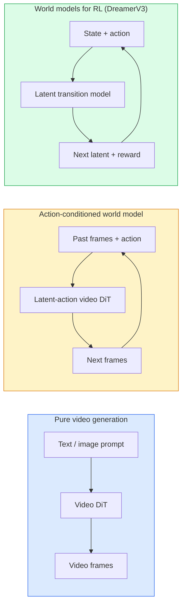

# 世界模式与视频传播

> 一个能够预测未来几秒钟场景的视频模型就是一个世界模拟器.

**Type:** Learn + Build
**Languages:** Python
**Prerequisites:** Phase 4 Lesson 10 (Diffusion), Phase 4 Lesson 12 (Video Understanding), Phase 4 Lesson 23 (DiT + Rectified Flow)
**Time:** ~75 分钟

## 学习目标
- 解释纯视频生成模型(Sora 2) 与动作条件世界模型(Genie 3,DreamerV3) 的区别
- 描述视频:DIT:空间时间补丁,3D位置编码跨`(T, H, W)`标记的共同关注
- 追踪世界模型 如何接入机器人:VLM 规划 →视频模型 模拟 →逆动态 输出动作
- 针对给定使用案例 (创意视频,互动的模拟,自动驾驶合成) 在 Sora 2、Genie 3、跑道 GWM-1 世界、Wan-Video 和 HunyuanVideo 之间做选择

## 问题
视频生成和世界模型在2026年走向融合――一个能够产生连贯一分钟视频的模型,在某种意义上已经学会了世界如何运动:物体永久性,重力,因果性,风格――如果你把这个预测条件化在动作上 ((向左走、开门),视频模型将变成一个可学习的模拟器,可以替代游戏引擎,驾驶模拟器或机器人环境――

影响非常具体.Genie 3可以从单张图像生成可玩的环境中进行操作.GWM-1世界 合成无限可探索的场景.Sora 2 生成带有同步音频和建模物理效果一分钟视频.NVIDIA宇宙驱动器、韦维盖亚-2 和特斯拉驾驶世界 为自动驾驶训练数据生成真实驾驶视频.世界模型范式正在然接管机器人中的真实到真实.

本课程是第四阶段的大图景课程. 它将图像生成,视频理解和代理推理与主流研究正在转向的建筑模式联系在一起.

## 概念
### 世界模型的三类体系



- **Sora 2**没有动作接口,你无法在推出中部操作它.
- **Genie 3**,我知道.**GWM-1 Worlds**,我知道.**Mirage / Magica**它们从观测视频中推断隐藏的行动,然后将未来预测条件化在动作上.
- **DreamerV3**和经典RL世界模型 家族在隐藏空间进行预测,并带有显而易见的行动条件,基于奖励信号训练――视觉性较弱;但对样本效率RL更有用――

### 视频 设计

```
Video latent:          (C, T, H, W)
Patchify (spatial):    grid of P_h x P_w patches per frame
Patchify (temporal):   group P_t frames into a temporal patch
Resulting tokens:      (T / P_t) * (H / P_h) * (W / P_w) tokens
```

位置编码是3D 的:针对每个`(t, h, w)`坐标使用旋转或学习嵌入式.

- **Full joint** 所有代币都参加到所有代币──对于N 个代币是O(N ^2)──对长视频来说代价过高──
- **Divided** 交替执行时间注意 相同的空间位置、跨时间:`(H*W) * T^2`空间的关注:`T * (H*W)^2`时间表和大多数视频节目都使用这种方式.
- **Window** 在`(t, h, w)`中使用局部窗户──视频Swin 使用这种方式──

每个2026年的视频传播模型都将使用这三种模式之一,再加上AdaLN调节 (课3) 和修改流量.

### 基于动作的条件:隐藏的行动模式

精灵通过判别式地预测一对连续之间的动作,为每一个学习一个**latent action**△然后模型的解码器 条件化在推断的隐藏行动上,而不是显式键盘按键上. 在推断时,用户可以指定一个隐藏行动 (或从新的先前中样本中一个),模型将生成与该动作一致的下一──

索拉完全跳过动作接口. 通过过去的空间时间代币来解码,预测下一个空间时间代币.

### 物理可靠性

索拉2的2026年发布明确宣传了**physical plausibility**团队通过人工评分测量可靠性分数;与Sora1相比,该模型在落下物体,角色碰撞以及故意失败等场景上明显改善了──

合理性仍然是主要的失败模式――2024-2025年人们吃意大利面或用玻璃杯喝水的视频暴露了模型缺乏持久物体表示的问题――2026年模型 ((Sora 2、Runway Gen-5、HunyuanVideo) 减少了这些问题,但没有消除――

### 自动驾驶世界模型

驾驶世界模型会基于轨迹的生成, 结合框或导航地图 条件化的真实道路场景.

- **Cosmos-Drive-Dreams**为了RL训练 生成数分钟驾驶视频
- **Gaia-2** 用于政策评估的轨迹条件的场景综合.
- **DrivingWorld**模拟多样气候,日间和交通条件.
- **Vista** 响应式驾驶场景合成.

它们取代了昂贵的真实世界数据采集,用于覆盖角落案件,例如夜间行人穿过马路乱"",结冰路口"",罕见车辆类型;否则这些情况需要数百万英里的驾驶才能收集.

### 机器人技术:VLM + 视频模型 + 反动态

现在出现了三组件的机器人循环:

1. **VLM**解析目标 (拿起红色杯子),规划高层次的行动序列.
2. **Video generation model**模拟执行每动作会是什么样子,预测未来 N 观测――
3. **Inverse dynamics model**提取会产生这些观察的具体动机命令.

这取代了奖励塑造和样本重的RL――世界模型负责想象;逆向动态在执行层面的闭环――Genie Envisioner是一个例子;许多研究团队正在获得这种结构――

### 评估

- **Visual quality**FVD (Fréchet视频距离) 、用户研究──
- **Prompt alignment** 每个CLIPSscore、VQA类评估──
- **Physical plausibility** 在基准套件上人工评分(Sora 2 的内部基准、VBench) 👇
- **Controllability**行动 →观察一致性;你能否回到以前的状态?

### 模型版图 2026 年

| Model | Use | Parameters | Output | License |
|-------|-----|------------|--------|---------|
| Sora 2 | text-to-video, audio | — | 1-min 1080p + audio | API only |
| Runway Gen-5 | text/image-to-video | — | 10s clips | API |
| Runway GWM-1 Worlds | interactive world | — | infinite 3D rollout | API |
| Genie 3 | interactive world from image | 11B+ | playable frames | research preview |
| Wan-Video 2.1 | open text-to-video | 14B | high-quality clips | non-commercial |
| HunyuanVideo | open text-to-video | 13B | 10s clips | permissive |
| Cosmos / Cosmos-Drive | autonomous driving sim | 7-14B | driving scenes | NVIDIA open |
| Magica / Mirage 2 | AI-native game engine | — | modifiable worlds | product |


```figure
v4-world-rollout
```

## 构建它
### 步骤1:视频的3D补丁

```python
import torch
import torch.nn as nn


class VideoPatch3D(nn.Module):
    def __init__(self, in_channels=4, dim=64, patch_t=2, patch_h=2, patch_w=2):
        super().__init__()
        self.proj = nn.Conv3d(
            in_channels, dim,
            kernel_size=(patch_t, patch_h, patch_w),
            stride=(patch_t, patch_h, patch_w),
        )
        self.patch_t = patch_t
        self.patch_h = patch_h
        self.patch_w = patch_w

    def forward(self, x):
        # x: (N, C, T, H, W)
        x = self.proj(x)
        n, c, t, h, w = x.shape
        tokens = x.reshape(n, c, t * h * w).transpose(1, 2)
        return tokens, (t, h, w)
```

一步就像内核的3D结会充满空间时间补丁器.`(T, H, W) -> (T/2, H/2, W/2)`网格──的代币

### 步骤 2: 3D旋转位置编码

旋转位置嵌入 (RoPE) 分别沿 `t`,我知道.`h`,我知道.`w`轴应用:

```python
def rope_3d(tokens, t_dim, h_dim, w_dim, grid):
    """
    tokens: (N, T*H*W, D)
    grid: (T, H, W) sizes
    t_dim + h_dim + w_dim == D
    """
    T, H, W = grid
    n, seq, d = tokens.shape
    if t_dim + h_dim + w_dim != d:
        raise ValueError(f"t_dim+h_dim+w_dim ({t_dim}+{h_dim}+{w_dim}) must equal D={d}")
    assert seq == T * H * W
    t_idx = torch.arange(T, device=tokens.device).repeat_interleave(H * W)
    h_idx = torch.arange(H, device=tokens.device).repeat_interleave(W).repeat(T)
    w_idx = torch.arange(W, device=tokens.device).repeat(T * H)
    # Simplified: just scale channels by frequencies. Real RoPE rotates pairs.
    freqs_t = torch.exp(-torch.log(torch.tensor(10000.0)) * torch.arange(t_dim // 2, device=tokens.device) / (t_dim // 2))
    freqs_h = torch.exp(-torch.log(torch.tensor(10000.0)) * torch.arange(h_dim // 2, device=tokens.device) / (h_dim // 2))
    freqs_w = torch.exp(-torch.log(torch.tensor(10000.0)) * torch.arange(w_dim // 2, device=tokens.device) / (w_dim // 2))
    emb_t = torch.cat([torch.sin(t_idx[:, None] * freqs_t), torch.cos(t_idx[:, None] * freqs_t)], dim=-1)
    emb_h = torch.cat([torch.sin(h_idx[:, None] * freqs_h), torch.cos(h_idx[:, None] * freqs_h)], dim=-1)
    emb_w = torch.cat([torch.sin(w_idx[:, None] * freqs_w), torch.cos(w_idx[:, None] * freqs_w)], dim=-1)
    return tokens + torch.cat([emb_t, emb_h, emb_w], dim=-1)
```

这里是简化的添加形式. 真实的ROPE会按频率旋转成频道.位置信息是一样的.

### 步骤3: 分开注意力区块

```python
class DividedAttentionBlock(nn.Module):
    def __init__(self, dim=64, heads=2):
        super().__init__()
        self.time_attn = nn.MultiheadAttention(dim, heads, batch_first=True)
        self.space_attn = nn.MultiheadAttention(dim, heads, batch_first=True)
        self.ln1 = nn.LayerNorm(dim)
        self.ln2 = nn.LayerNorm(dim)
        self.ln3 = nn.LayerNorm(dim)
        self.mlp = nn.Sequential(nn.Linear(dim, 4 * dim), nn.GELU(), nn.Linear(4 * dim, dim))

    def forward(self, x, grid):
        T, H, W = grid
        n, seq, d = x.shape
        # time attention: same (h, w), across t
        xt = x.view(n, T, H * W, d).permute(0, 2, 1, 3).reshape(n * H * W, T, d)
        a, _ = self.time_attn(self.ln1(xt), self.ln1(xt), self.ln1(xt), need_weights=False)
        xt = (xt + a).reshape(n, H * W, T, d).permute(0, 2, 1, 3).reshape(n, seq, d)
        # space attention: same t, across (h, w)
        xs = xt.view(n, T, H * W, d).reshape(n * T, H * W, d)
        a, _ = self.space_attn(self.ln2(xs), self.ln2(xs), self.ln2(xs), need_weights=False)
        xs = (xs + a).reshape(n, T, H * W, d).reshape(n, seq, d)
        xs = xs + self.mlp(self.ln3(xs))
        return xs
```

时间注意 在每一个空间位置内跨时间出席;空间注意 在每一个内跨位置出席──用两个 O(T^2 + (HW) ^2) 操作,替换一个 O((THW) ^2) 操作──这是TimeSformer 和每个现代视频的核心──

### 步骤4: 组合一个小视频

```python
class TinyVideoDiT(nn.Module):
    def __init__(self, in_channels=4, dim=64, depth=2, heads=2):
        super().__init__()
        self.patch = VideoPatch3D(in_channels=in_channels, dim=dim, patch_t=2, patch_h=2, patch_w=2)
        self.blocks = nn.ModuleList([DividedAttentionBlock(dim, heads) for _ in range(depth)])
        self.out = nn.Linear(dim, in_channels * 2 * 2 * 2)

    def forward(self, x):
        tokens, grid = self.patch(x)
        for blk in self.blocks:
            tokens = blk(tokens, grid)
        return self.out(tokens), grid
```

这不是一个可操作的视频发电机;它是一个结构演示,证明每个部分的形状都是正确的.

### 步骤 5: 检查形状

```python
vid = torch.randn(1, 4, 8, 16, 16)  # (N, C, T, H, W)
model = TinyVideoDiT()
out, grid = model(vid)
print(f"input  {tuple(vid.shape)}")
print(f"tokens grid {grid}")
print(f"output {tuple(out.shape)}")
```

补丁 后预期 `grid = (4, 8, 8)`且`out = (1, 256, 32)`后投影到每个代币对应的空间-时间补丁,准备不补丁回视频.

## 使用它
2026年生产访问模式:

- **Sora 2 API**文字到视频,同步音频,
- **Runway Gen-5 / GWM-1**互动世界.
- **Wan-Video 2.1 / HunyuanVideo** 开源自托管──
- **Cosmos / Cosmos-Drive**驾驶模拟开放权重.
- **Genie 3**研究预览,需要申请访问.

构建互动世界模型演示:从 Wan-Video 开始以获得质量,再叠加一个隐形动作适配器来实现交互性――对于自动驾驶模拟:Cosmos-Drive是2026年的开放参考――

现实中的机器人堆:

1. 语言目标 -> VLM (Qwen3-VL) -> 高级计划──
2. 计划 -> 隐形行动视频模型 -> 想象中的推广――
3. 推出 -> 反动力模型 -> 低级操作──
4. 执行行动 -> 观察回归步骤1──

## 交付它
本课产出:

- `outputs/prompt-video-model-picker.md` 根据任务、许可和延迟,在 Sora 2 / 跑道 / Wan / HunyuanVideo / Cosmos 之间做选择──
- `outputs/skill-physical-plausibility-checks.md` 一个定义自动检查的技能,用于交付前检查任何生成视频.

## 练习
1. **(Easy)**计算一个 5 秒 360p 视频在补丁 t=2、补丁 h=8、补丁 w=8 时的代币数量――推理这个规模下关注内存需求――
2. **(Medium)**把上面的分视频块 换成全关键分视频块并测量形状和参数数量.
3. **(Hard)**构建一个最小潜伏视频模型:使用 `(frame_t, action_t, frame_{t+1})`练习一个基于动作嵌入式 条件化的小视频 展示不同动作会产生不同的下一──

## 关键术语
| Term | What people say | What it actually means |
|------|----------------|----------------------|
| World model | “Learned simulator” | 一个在给定 state 和 action 时预测未来 observations 的模型 |
| Video DiT | “Spacetime transformer” | 使用 3D patchification 和 divided attention 的 Diffusion transformer |
| Latent action | “Inferred control” | 从帧对中推断出的离散或连续 action latent；用于条件化 next-frame generation |
| Divided attention | “Time then space” | 每个 block 中的两个 attention 操作：先跨时间，再跨空间，用来让 O(N^2) 保持可控 |
| Object permanence | “Things stay real” | video models 必须学会的场景属性；在食物、玻璃器皿上的经典失败模式 |
| FVD | “Fréchet Video Distance” | FID 的视频等价物；主要 visual quality metric |
| Inverse dynamics model | “Observations to actions” | 给定 `(state, next state)`，输出连接二者的 action；闭合 robotics loop |
| Cosmos-Drive | “NVIDIA driving sim” | 用于 RL 和 evaluation 的 open-weights autonomous-driving world model |

## 延伸阅读
- [Sora technical report (OpenAI)](https://openai.com/index/video-generation-models-as-world-simulators/)
- [Genie: Generative Interactive Environments (Bruce et al., 2024)](https://arxiv.org/abs/2402.15391)隐藏的行动世界模型
- [TimeSformer (Bertasius et al., 2021)](https://arxiv.org/abs/2102.05095) 用于视频转换器的分离注意力
- [DreamerV3 (Hafner et al., 2023)](https://arxiv.org/abs/2301.04104) 用于RL的世界模型
- [Cosmos-Drive-Dreams (NVIDIA, 2025)](https://research.nvidia.com/labs/toronto-ai/cosmos-drive-dreams/)驾驶世界模式
- [Top 10 Video Generation Models 2026 (DataCamp)](https://www.datacamp.com/blog/top-video-generation-models)
- [From Video Generation to World Model — survey repo](https://github.com/ziqihuangg/Awesome-From-Video-Generation-to-World-Model/)
