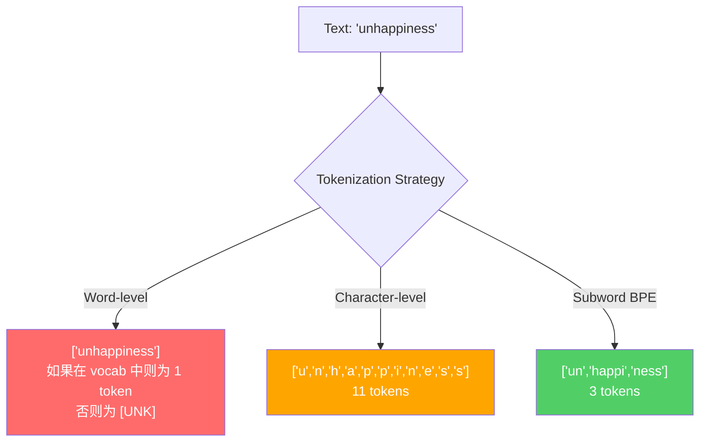
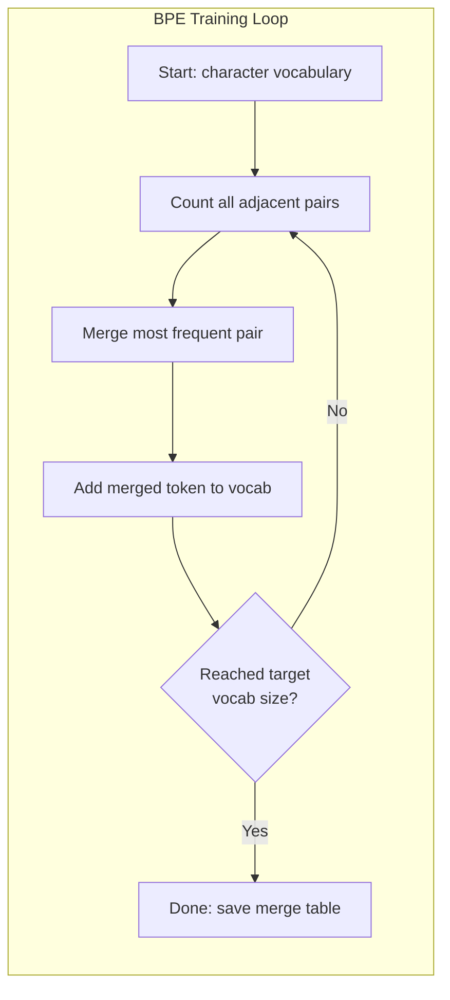
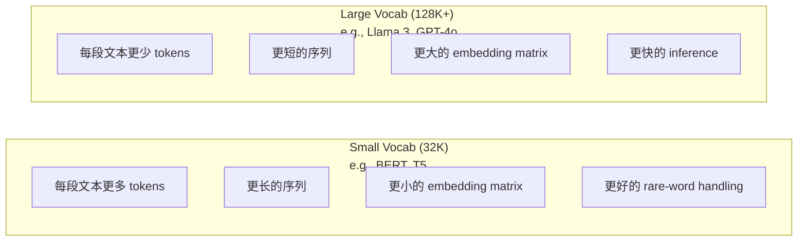

# 标记:BPE,WordPiece,SentencePiece

> 你的LLM 不读取英文. 它读取整数.

**Type:** Build
**Languages:** Python
**Prerequisites:** Phase 05 (NLP Foundations)
**Time:** ~90 minutes

## 学习目标
- 从零实现BPE、WordPiece 和 Unigram标记化算法,并比较它们的合并策略
- 解释词汇大小 如何影响模型效率:过小会产生长序列,过大会浪费嵌入参数
- 分析不同语言和代码中的代币化文物,识别特定的代币化者 在哪里失效
- 使用TikToken 和句子图书馆对文本进行代币化,并检查生成的代币ID

## 问题
你的LLM 不读取英文. 它不读取任何语言. 它读取数字.

从"你好,世界!"到 [15496, 11, 995, 0] 之间的差距就是Tokenizer. 每个词, 每个空格, 每个标点符号, 都必须先转换为整数,模型才能处理它. 这种转换不是中性. 它将一些假设放入模型中,而这些假设之后无法撤销.

如果这里做错,模型就会浪费容量,使用多个代币编码常见词. "不幸的是"将变成四个代币,而不是一个. 对多音节词密集的文本,你的128K文本窗口实际上刚刚缩小了75%.

你对GPT-4或Claude发起的每一次API调用都是按代币定价.

## 概念
### 三种失败的方法以及一个胜出的方法)

转换文本为数字有三种明显的方法.

**Word-level tokenization**按空格和标点切分──"猫坐了" 会变成 ["The", "cat", "sat"]──很简单──但"代码化" 怎么办?"GPT-4o" 这?或像"Geschwindigkeitsbegrenzung" 这样的德语复合词呢?`[UNK]`标记--这是模型在说我完全不知道这是什么──仅英文就有超过一百万种词形──再加上代码,URL,科学计数法以及另外100种语言,你就需要一个无限的词汇──

**Character-level tokenization**走向另一个方向──"你好"会变成 ["h", "e", "l", "l", "o"]──词汇很小(几百个字符)──永远不会有未知的代币──但序列会变得极长──一个本来就是10个字面级代币的句子,会变成50个字符级代币──模型必须学会"t", h"",e" 放在一起表示"the"--把注意力消耗在一个人类三岁就能学会的东西上──

**Subword tokenization**找到了平衡点──常见词保持完整:"the" 是一个代币──罕见词会分解成有意义的片段:"不快乐" 变成 ["un", "happy", "ness"]──词汇保持可控(30K到128K代币)──序列保持较短──未知代币基本消失,因为任何词都可以由子词组成──构成出来──

每个现代的LLM都使用子词代码化――GPT-2、GPT-4、BERT、Llama 3、Claude-- 全都是――问题在于使用哪种算法──



### 字节对编码

BPE是一种贪心压缩算法,后来重新被使用为代币化.

从单个字符开始――统计训练语料中每个相邻对――将出现的频率最高的对合成一个新的标志――重复这个过程,直到达到目标词汇规模――

下面是一个很小的集体上运行的BPE,其中包含"低""",低"和"最新":

```
Corpus（带 word frequencies）:
  "lower"  x5
  "lowest" x2
  "newest" x6

Step 0 -- 从字符开始:
  l o w e r       (x5)
  l o w e s t     (x2)
  n e w e s t     (x6)

Step 1 -- 统计相邻 pairs:
  (e,s): 8    (s,t): 8    (l,o): 7    (o,w): 7
  (w,e): 13   (e,r): 5    (n,e): 6    ...

Step 2 -- Merge 最高频 pair (w,e) -> "we":
  l o we r        (x5)
  l o we s t      (x2)
  n e we s t      (x6)

Step 3 -- 重新统计并 merge (e,s) -> "es":
  l o we r        (x5)
  l o we s t      (x2)    <- 'es' 只由 'e'+'s' 形成，不是 'we'+'s'
  n e we s t      (x6)    <- 等等，'we' 前面有 'e'，'we' 后面有 's'

实际精确跟踪如下:
  在 "we" merge 之后，剩余 pairs:
  (l,o): 7   (o,we): 7   (we,r): 5   (we,s): 8
  (s,t): 8   (n,e): 6    (e,we): 6

Step 3 -- Merge (we,s) -> "wes" 或 (s,t) -> "st"（同为 8，选第一个）:
  Merge (we,s) -> "wes":
  l o we r        (x5)
  l o wes t       (x2)
  n e wes t       (x6)

Step 4 -- Merge (wes,t) -> "west":
  l o we r        (x5)
  l o west        (x2)
  n e west        (x6)

...继续，直到达到目标 vocab size。
```

合并表就是一个代码器. 要编码新文本,就按照学习到的顺序应用合并. 训练组决定哪些合并存在,而这个选择会永久塑造模型看到的内容.



### 字节级BPE (GPT-2,GPT-3,GPT-4)

标准BPE 在 Unicode字符上运行――字节级BPE 在原始字节中运行――0-255) 这会给你一个非常好的256的基础词汇,能够处理任何语言或编码,并且永远不会产生未知的代币――

GPT-2 引入了这种方法.基础词汇覆盖每种可能的字节.BPE 合并在此构建.OpenAI的TikTok库实现了字节级BPE,并使用这些词汇尺寸:

- 其他: 其他: 其他:
- 基因代码 (GPT-3.5/GPT-4: ~100,256个代码 (cl100k_base编码)
- 其他类型: 子,子,子,子,子,子,子,子,子,子,子,子,子,子,子,子,子,子,子,子,子,子,子,子,子,子,子,子,子,子,子,子,子,子,子,子,子,子,子,子,子,子,子,子,子,子,子,子,子,子,子,子,子,子,子,子,子,子,子,子,子,子,子,子,子,子,子,子,子,子,子,子,子,子,子,子,子,子,子,子,子,子,子,子,子,子,子,子,子,子,子,子,子,子,子,子,子,子,子

### 字体 (BERT)

WordPiece看起来类似于BPE,但选择合并的方式不同. 它不是使用原始频率,而是最大化训练数据的可能性:

```
BPE merge criterion:      count(A, B)
WordPiece merge criterion: count(AB) / (count(A) * count(B))
```

Pee 问:哪个对出现最频繁?WordPiece 问:哪个对出现频率高于随机情况的预期?这个微小差异会产生不同的词汇库――WordPiece 偏好那些共现令人惊的合并,而不是只是频繁的合并――

WordPiece还使用"##"前表示延续子词:

```
"unhappiness" -> ["un", "##happi", "##ness"]
"embedding"   -> ["em", "##bed", "##ding"]
```

预写"##" 告诉你这个部分 延续前一个代币――BERT 使用WordPiece,词汇为30,522代币――每个BERT变体--DistilBERT,RoBERTa的代币化器实际上是BPE,但BERT本身是WordPiece――

### 句子 (拉马,T5)

文本Piece 把输入视为原始的Unicode字符流,其中包括空白符.没有预代码化步骤.没有关于词边界的语言特定规则.

支持两种算法:
- **BPE mode**类似于标准BPE的合并逻辑,应用于原始字符序列
- **Unigram mode**从一个大词汇库开始,然后代移除对整体概率影响最小的代币――它是BPE的反向过程--不是合并,而是剪切――

拉马2 使用SentencePiece BPE,词汇为32,000代币――T5 使用SentencePiece Unigram,词汇为32,000代币――注意:拉马3 切换到了基于TikToken的字节级BPE代币,包含128,256代币――

### 词汇尺寸交易

这是一个真正的工程决策,而且有可测量的后果.



具体数字──对于一个128K词汇和4,096维嵌入,仅嵌入矩阵就是128,000 x4,096 =5.24亿参数──对于32K词汇,则是1.31亿参数──仅仅因为Tokenizer 选择不同,就会产生400M参数的差异──

但更大的词汇会更激进地缩写文本――同一个段落,使用32K词汇可能需要100个代币,使用128K词汇可能只需要70个代币――这意味着在生成期间的前进传递率减少了30%――对于数百万请求的服务模型来说,这将直接降低计算成本――

趋势很明确:语音库大小 正在增长──GPT-2 使用 50,257──GPT-4 使用 ~100K──Llama 3 使用 128K──GPT-4o 使用 200K──

| Model | Vocab Size | Tokenizer Type | Avg Tokens per English Word |
|-------|-----------|----------------|---------------------------|
| BERT | 30,522 | WordPiece | ~1.4 |
| GPT-2 | 50,257 | Byte-level BPE | ~1.3 |
| Llama 2 | 32,000 | SentencePiece BPE | ~1.4 |
| GPT-4 | ~100,256 | Byte-level BPE | ~1.2 |
| Llama 3 | 128,256 | Byte-level BPE (tiktoken) | ~1.1 |
| GPT-4o | 200,019 | Byte-level BPE | ~1.0 |

### 多语言税

基于英语的托克尼斯人对其他语言非常残酷――GPT-2的托克尼斯人中平均每个词需要2-3个代币――中文可能更糟――这意味着韩文用户的文本窗口实际上只有一半的英语用户支付相同的价格,但获得更低的信息密度――

这就是Llama 3将词汇从32K扩大到128K的原因.


```figure
tokenizer-bpe
```

```figure
tokenizer-tradeoff
```

## 构建它
### 步骤1:字符级标记器

从基础开始──字符级代码符将每个字符映射到其Unicode代码点──不需要训练──没有未知的代码──只是直接映射──

```python
class CharTokenizer:
    def encode(self, text):
        return [ord(c) for c in text]

    def decode(self, tokens):
        return "".join(chr(t) for t in tokens)
```

"你好" 会变成 [104, 101, 108, 108, 111]──每个字符都是自己的标志──这是我们要改进的基线────

### 步骤 2:从零开始的BPE标记器

真正的实现──我们在原始字节上训练(像GPT-2 一样),统计对,并排序记录每次并──并表就是Tokenizer──

```python
from collections import Counter

class BPETokenizer:
    def __init__(self):
        self.merges = {}
        self.vocab = {}

    def _get_pairs(self, tokens):
        pairs = Counter()
        for i in range(len(tokens) - 1):
            pairs[(tokens[i], tokens[i + 1])] += 1
        return pairs

    def _merge_pair(self, tokens, pair, new_token):
        merged = []
        i = 0
        while i < len(tokens):
            if i < len(tokens) - 1 and tokens[i] == pair[0] and tokens[i + 1] == pair[1]:
                merged.append(new_token)
                i += 2
            else:
                merged.append(tokens[i])
                i += 1
        return merged

    def train(self, text, num_merges):
        tokens = list(text.encode("utf-8"))
        self.vocab = {i: bytes([i]) for i in range(256)}

        for i in range(num_merges):
            pairs = self._get_pairs(tokens)
            if not pairs:
                break
            best_pair = max(pairs, key=pairs.get)
            new_token = 256 + i
            tokens = self._merge_pair(tokens, best_pair, new_token)
            self.merges[best_pair] = new_token
            self.vocab[new_token] = self.vocab[best_pair[0]] + self.vocab[best_pair[1]]

        return self

    def encode(self, text):
        tokens = list(text.encode("utf-8"))
        for pair, new_token in self.merges.items():
            tokens = self._merge_pair(tokens, pair, new_token)
        return tokens

    def decode(self, tokens):
        byte_sequence = b"".join(self.vocab[t] for t in tokens)
        return byte_sequence.decode("utf-8", errors="replace")
```

训练循环是BPE的核心:统计对,合并 胜出的对,重复.`num_merges`轮后,词汇从256个字节增加到256个+数组合.

编码会按照学习到的精确顺序应用合并. 这点很重要. 如果合并1 创建"th",合并5 创建"the",那么编码必须先应用合并1,这样"the"才能在合并5 中由"th" +"e"形成──

解码是反向过程:在词汇中查找每个代币ID,连接字节,然后解码为UTF-8──

### 步骤3: 编码和解码回路

```python
corpus = (
    "The cat sat on the mat. The cat ate the rat. "
    "The dog sat on the log. The dog ate the frog. "
    "Natural language processing is the study of how computers "
    "understand and generate human language. "
    "Tokenization is the first step in any NLP pipeline."
)

tokenizer = BPETokenizer()
tokenizer.train(corpus, num_merges=40)

test_sentences = [
    "The cat sat on the mat.",
    "Natural language processing",
    "tokenization pipeline",
    "unhappiness",
]

for sentence in test_sentences:
    encoded = tokenizer.encode(sentence)
    decoded = tokenizer.decode(encoded)
    raw_bytes = len(sentence.encode("utf-8"))
    ratio = len(encoded) / raw_bytes
    print(f"'{sentence}'")
    print(f"  Tokens: {len(encoded)} (from {raw_bytes} bytes) -- ratio: {ratio:.2f}")
    print(f"  Roundtrip: {'PASS' if decoded == sentence else 'FAIL'}")
```

压缩比率 告诉你Tokenizer 有多有效的比率 为0.50表示Tokenizer将文本压缩到原始字节的一半的Token量越低越好. 在训练组上,比率会很好. 在"不快乐"这种分布式的文本上,它没有出现在组中,比率会更差.

### 步骤 4:与TikTok进行比较

```python
import tiktoken

enc = tiktoken.get_encoding("cl100k_base")

texts = [
    "The cat sat on the mat.",
    "unhappiness",
    "Hello, world!",
    "def fibonacci(n): return n if n < 2 else fibonacci(n-1) + fibonacci(n-2)",
    "Geschwindigkeitsbegrenzung",
]

for text in texts:
    our_tokens = tokenizer.encode(text)
    tiktoken_tokens = enc.encode(text)
    tiktoken_pieces = [enc.decode([t]) for t in tiktoken_tokens]
    print(f"'{text}'")
    print(f"  Our BPE:   {len(our_tokens)} tokens")
    print(f"  tiktoken:  {len(tiktoken_tokens)} tokens -> {tiktoken_pieces}")
```

tiktoken 使用完全相同的算法,但它在数百GB 文本上训练,并包含100,000 个合并.算法是相同的.

### 步骤5:词汇分析

```python
def analyze_vocabulary(tokenizer, test_texts):
    total_tokens = 0
    total_chars = 0
    token_usage = Counter()

    for text in test_texts:
        encoded = tokenizer.encode(text)
        total_tokens += len(encoded)
        total_chars += len(text)
        for t in encoded:
            token_usage[t] += 1

    print(f"Vocabulary size: {len(tokenizer.vocab)}")
    print(f"Total tokens across all texts: {total_tokens}")
    print(f"Total characters: {total_chars}")
    print(f"Avg tokens per character: {total_tokens / total_chars:.2f}")

    print(f"\nMost used tokens:")
    for token_id, count in token_usage.most_common(10):
        token_bytes = tokenizer.vocab[token_id]
        display = token_bytes.decode("utf-8", errors="replace")
        print(f"  Token {token_id:4d}: '{display}' (used {count} times)")

    unused = [t for t in tokenizer.vocab if t not in token_usage]
    print(f"\nUnused tokens: {len(unused)} out of {len(tokenizer.vocab)}")
```

这会揭示你的词汇中的Zipf分布. 少数代币占据主导.

## 使用它
你的 BPE 可以工作了.现在看看生产级工具是什么样子.

### 投资者

```python
import tiktoken

enc = tiktoken.get_encoding("cl100k_base")

text = "Tokenizers convert text to integers"
tokens = enc.encode(text)
print(f"Tokens: {tokens}")
print(f"Pieces: {[enc.decode([t]) for t in tokens]}")
print(f"Roundtrip: {enc.decode(tokens)}")
```

标使用Rust编写,并提供Python绑定. 它每秒可以编码数百万个代币.

### 拥抱脸标记器

```python
from tokenizers import Tokenizer
from tokenizers.models import BPE
from tokenizers.trainers import BpeTrainer
from tokenizers.pre_tokenizers import ByteLevel

tokenizer = Tokenizer(BPE())
tokenizer.pre_tokenizer = ByteLevel()

trainer = BpeTrainer(vocab_size=1000, special_tokens=["<pad>", "<eos>", "<unk>"])
tokenizer.train(["corpus.txt"], trainer)

output = tokenizer.encode("The cat sat on the mat.")
print(f"Tokens: {output.tokens}")
print(f"IDs: {output.ids}")
```

拥抱面孔代币库 底层也是化. 它可以在几秒钟内基于GB级体体训练BPE.

### 装载拉马的标记器

```python
from transformers import AutoTokenizer

tokenizer = AutoTokenizer.from_pretrained("meta-llama/Llama-3.1-8B")

text = "Tokenizers are the unsung heroes of LLMs"
tokens = tokenizer.encode(text)
print(f"Token IDs: {tokens}")
print(f"Tokens: {tokenizer.convert_ids_to_tokens(tokens)}")
print(f"Vocab size: {tokenizer.vocab_size}")

multilingual = ["Hello world", "Hola mundo", "Bonjour le monde"]
for text in multilingual:
    ids = tokenizer.encode(text)
    print(f"'{text}' -> {len(ids)} tokens")
```

拉马3的128K词汇对非英语文本的压缩明显优于GPT-2的50K词汇.你可以自己验证这一点--使用多种语言编码同一句话,然后统计代币.

## 交付它
本课会产出 `outputs/prompt-tokenizer-analyzer.md`-- 一个可复制的提示,用于分析任意文本和模型组合的标记化效率――把一个文本样本给它,它会告诉你哪个模型的标记器处理最好――

## 练习
1. 修改BPE标记器,让它在每个结合步骤中打印词汇. 观察"t"+"h"如何变成"th",然后"th"+"e"如何变成"the"――跟踪常见英文词如何一步组装出来――

2. 向BPE标记器 添加特殊标记(`<pad>`,我知道.`<eos>`,我知道.`<unk>`为了实现预先标记化步骤,在运行BPE之前按白色空间切分.

3. 实现WordPiece合并标准 (使用概率比率而不是频率) ,在同一组上,使用相同的合并数量训练BPE和WordPiece.

4. 构建一个多语言的代币器效率基准――选取英语、西班牙语、中文、韩语和阿拉伯语各10个句子――使用tiktoken(cl100k_base) 对每个句子代币化,并测量平均每字符的代币――量化每种语言的"多语言税"――

5. 在更大的体内上训练你的BPE标记器(下载一篇维基百科文章) ⋅调整并并数量,使其在同一文本上的压缩比达到10%的标.

## 关键术语
| Term | What people say | What it actually means |
|------|----------------|----------------------|
| Token | “一个词” | 模型 vocabulary 中的一个单元 -- 可以是字符、subword、word，或 multi-word chunk |
| BPE | “某种压缩东西” | Byte Pair Encoding -- 迭代 merge 出现最频繁的相邻 token pair，直到达到目标 vocabulary size |
| WordPiece | “BERT 的 Tokenizer” | 类似 BPE，但 merges 最大化 likelihood ratio count(AB)/(count(A)*count(B))，而不是原始 frequency |
| SentencePiece | “一个 Tokenizer library” | 一种 language-agnostic Tokenizer，在没有 pre-tokenization 的情况下直接处理原始 Unicode，并支持 BPE 和 Unigram algorithms |
| Vocabulary size | “它知道多少词” | 唯一 Tokens 的总数：GPT-2 有 50,257，BERT 有 30,522，Llama 3 有 128,256 |
| Fertility | “不是 Tokenizer 术语” | 每个词的平均 Tokens 数 -- 衡量 Tokenizer 在不同语言上的效率（1.0 是理想值，3.0 表示模型要多工作三倍） |
| Byte-level BPE | “GPT 的 Tokenizer” | 在原始 bytes（0-255）而不是 Unicode characters 上运行的 BPE，保证任何输入都不会产生 unknown tokens |
| Merge table | “Tokenizer 文件” | 训练期间学习到的有序 pair merges 列表 -- 这就是 Tokenizer 本身，而且顺序很重要 |
| Pre-tokenization | “按空格切分” | 在 subword tokenization 之前应用的规则：whitespace splitting、digit separation、punctuation handling |
| Compression ratio | “Tokenizer 有多高效” | 生成的 Tokens 数除以输入 bytes 数 -- 越低表示压缩越好，inference 越快 |

## 延伸阅读
- [Sennrich et al., 2016 -- "Neural Machine Translation of Rare Words with Subword Units"](https://arxiv.org/abs/1508.07909)这篇论文将将BPE引入NLP,将1994年的压缩算法变成现代代币化的基础.
- [Kudo & Richardson, 2018 -- "SentencePiece: A simple and language independent subword tokenizer"](https://arxiv.org/abs/1808.06226)语言-无知标记化,使多语言模型成为实用
- [OpenAI tiktoken repository](https://github.com/openai/tiktoken)-- 用Rust编写并带有Python绑定的生产级BPE实现,由GPT-3.5/4/4o使用
- [Hugging Face Tokenizers documentation](https://huggingface.co/docs/tokenizers)-- 具有性能的生产级标记器培训
