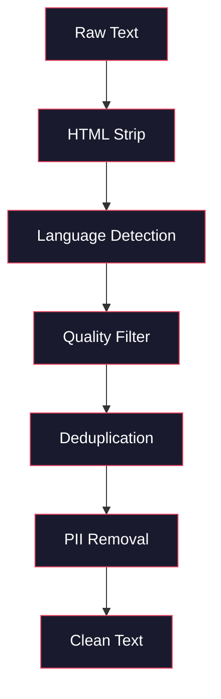
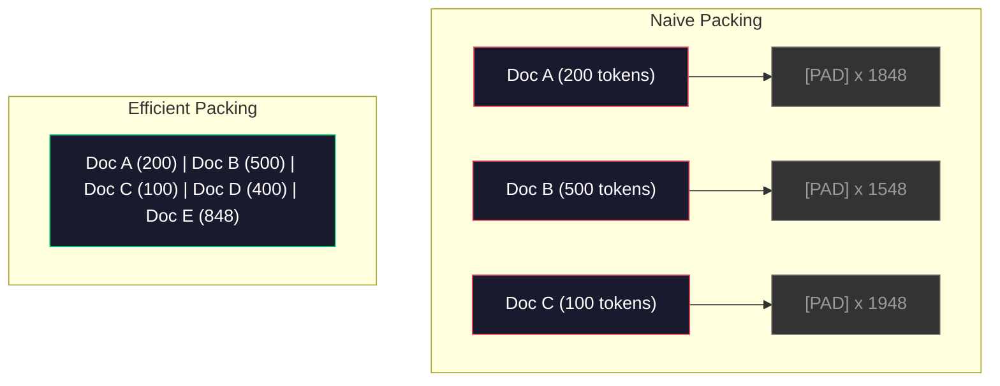

# 预训练的数据管道

> 模型是一个镜子. 它会反映你给它任何数据.

**Type:** Build
**Languages:** Python
**Prerequisites:** Phase 10, Lessons 01-02 (Tokenizers, Building a Tokenizer)
**Time:** ~90 minutes

## 学习目标

- 构建一个流媒体数据管道,在没有把全部数据加载到内存的情况下,对TB级文本进行代码化、切块、混动和批量
- 实现真实预训管道 中使用的数据质量过器
- 创建固定长度训练序列,并正确处理注意力面具和文档边界
- 配置文件管道吞吐量,确保数据加载器能跟上GPU 训练速度

## 问题

你已经有了一个代码器了.

不是一个数据集,而不是一个CSV文件.而是通过清洗,减倍,质量过,托克化,成固定长度序列,并以足够快速的速度作为随机批量提供,确保你的8GPU集群永远不会等待下一批.

大多数人认为训练一个LLM的核心是模型架构――并不是――Llama 3使用了156万亿代币――GPT-3使用了300亿――DeepSeek-V2使用了8.1万亿――这三者的架构大体相同:堆叠的变压器块,包含注意和前层――输出质量差异压倒性地来自数据――

深思之中的基拉论文精确说明这一点.对于给定的计算预算,模型参数与训练代币数量之间存在最优的比例.基拉表明,2022年的大多数模型都严重受过训练:相比它们所看到的数据量,它们的参数太多.

你的数据管道决定了你学习的模型是语言还是噪音.

## 核心概念

### 数据来自哪里

每个大型语言模型都在多种来源的混合数据上训练.对于大多数实验室来说,确切的数据组成都是密密的,但我们已经知道足够多,可以理解这些类别.

| Source | Size | Quality | Used By |
|--------|------|---------|---------|
| Common Crawl | ~250 TB raw | 低（需要大量过滤） | GPT-3, Llama, most open models |
| Wikipedia | ~20 GB | 高 | Every major LLM |
| GitHub code | ~1 TB+ | 中等（大量重复、废弃代码） | StarCoder, CodeLlama, DeepSeek-Coder |
| Books (BookCorpus, Pile) | ~100 GB | 高 | GPT-2, GPT-3, early models |
| Academic papers (arXiv, S2ORC) | ~100 GB | STEM 领域质量高 | Llama, Galactica |
| StackOverflow, Reddit | ~100 GB | 中等 | Llama, Falcon |
| Curated web (C4, RefinedWeb) | ~5 TB | 中高（已预过滤） | T5, Falcon |

拉马3 披露其数据混合比例:大约50%的网页数据,25%的代码,13%的书籍和学术论文,8%的数学数据,以及4%的多语言网页数据.

比如和总量同样重要. 网络数据太多,模型会变成Reddit 复读机. 代码太少,它就无法编程. 数学太少,它就会在推理上失败.

### 数据清洗

原始网页数据很脏.

- HTML标签和JavaScript
- 模板化标题,脚,导航菜单
- 重复页面(完全重复和近似重复)
- 机器生成的垃圾邮件
- 个人身份信息 (PII)
- 低质量文本(关键词列表、SEO垃圾邮件)
- 以文本形式编码的非文本内容

清洗不是一个可选项. 它决定模型是生成连贯段落,还是输出混杂的产品列表的HTML标签.



每一步都会消除一类噪音:

**HTML stripping:**移除所有标记. 仅保留可见文本内容.`trafilatura`或`readability`这样库会提取文章内容,同时丢弃导航,广告和模板化内容.

**Language detection:**使用快文本的语言识别模型 (FASTTExt的语言识别模型) 进行分类.

**Quality filtering:**这里开始变得有意思――精炼的Web (Falcon 背后的数据集) 使用基于杂的过器:先在维基百科上训练一个小型语言模型,然后给每个文档打分――高杂意味着这个文档不像维基百科:很可能是垃圾邮件、关键词列表或机器生成内容――杂高于值的文档会被移除――

**Deduplication:**单个最有影响力的清理步骤――常见爬行 包含海量重复页面:法律免责声明、cookie通知、服务条款――在重复数据上训练会浪费计算,并可能导致模型记忆并逐字吐出特定段落――

**PII removal:**姓名、电子邮件地址、电话号码、社会安全号码――对结构化 PII 使用基于regex的检测,对上下文中的姓名使用NER模型――

### 使用MinHash做减倍

精确的排版 很容易:对每个文档进行哈希,移除重复项――但真正的问题是近似重复――两份相同的新闻文章的副本,周围广告略有不同,就是近似重复――内容 95%相同,但按字节比较不一致――

微软+本地敏感微软 (LSH) 可以高效解决这个问题.


想象如下:

1. **Shingling:**将每个文档转换为 n-gram 集合(例如词或字符的 5gram) ――"快速棕狐"使用3字的章会变成 {"快速棕色","快速棕色狐"}。

2. **MinHash:**对于每个文件的牌集合,计算 k 个哈希值. 每个哈希值是不同的哈希函数下所有牌的最小哈希.这样会创建一个固定大小的签名,用于近似估计两个文件之间的Jaccard相似性.

3. **LSH:**根据MinHash签名带,把文档分组到桶中. 同一个桶中文档就是候选近似重复项.

4. **Verify:**对于每个候选对,计算精确的Jaccard相似性. 如果相似性超过值,通常为0.8,就移除其中一个副本.

通过排版,他们移除了约38%的网络数据.

### 序列包装

你的模型期望固定长度的输入序列. 你的文档长度是可变的. 有些是50个标记. 有些是50,000个标记.

简单的做法:把每个文档到最大序列长度.

更好的做法:把多个文档包到一个序列中,并使用末序列代币 分隔──一个2048代币的序列可能包含三个短文档,中间使用 [EOS]代币拼接──



需要一个区块横向的注意力面具.

长文档会在序列边界处被切断或分成碎片. 分断点很重要:在句子中分断会迫使模型看到不完整的思路.

### 奇拉尺度定律

对于固定计算预算 C 以FLOP 衡量),最优模型大小N 和数据集大小D 遵循:

```
N_opt ~ C^0.5
D_opt ~ C^0.5
```

实际上,这意味着你应该大致等比例扩展模型大小和数据集大小──一个参数多于10倍的模型,需要大约多于10倍的训练标志,才能达到相同的损失──

| Model | Parameters | Training Tokens | Chinchilla-Optimal? |
|-------|-----------|----------------|-------------------|
| GPT-3 | 175B | 300B | 否（undertrained 3-4x） |
| Chinchilla | 70B | 1.4T | 是（按设计） |
| Llama 2 | 70B | 2T | Overtrained（有意为之） |
| Llama 3 | 70B | 15T | 严重 overtrained |

拉马3故意违反了辛奇拉法. 测试发现,在更多数据上过度训练,远超计算-最佳比率,会产生更适合推断的模型. 额外训练成本只支付一次,但较小的模型在长期服务时成本更低. 这有时被称为"准确-最佳缩小方法,自2024年以来已成为行业标准.


```figure
l5-data-pipeline
```

## 构建它

### 步骤1: 文字清洁

剥离HTML、规范化白色空间、移除文本内容──我们将使用公共领域文本 (Gutenberg项目) 作为小型文本.

```python
import re

def clean_text(text):
    text = re.sub(r"<[^>]+>", "", text)
    text = re.sub(r"http\S+", "", text)
    text = re.sub(r"[^\x20-\x7E\n]", "", text)
    text = re.sub(r"\n{3,}", "\n\n", text)
    text = re.sub(r" {2,}", " ", text)
    return text.strip()

def quality_filter(text, min_words=50, max_ratio_caps=0.3, max_ratio_special=0.1):
    words = text.split()
    if len(words) < min_words:
        return False
    caps_ratio = sum(1 for w in words if w.isupper()) / len(words)
    if caps_ratio > max_ratio_caps:
        return False
    special_chars = sum(1 for c in text if not c.isalnum() and not c.isspace())
    if special_chars / max(len(text), 1) > max_ratio_special:
        return False
    return True
```

这种质量过器会捕捉到SEO垃圾邮件 (所有 CAPS) 机器生成噪音 (高特殊字符比例) 和页面 (过短) 只有这三个检查,就能从网页爬虫中移动大量惊人的垃圾内容.

### 步骤 2: 微量缩小

从零实现MinHash──不需要外部库,只需要`hashlib`,我知道.

```python
import hashlib
from collections import defaultdict

def get_shingles(text, k=5):
    words = text.lower().split()
    if len(words) < k:
        return set()
    return {" ".join(words[i:i+k]) for i in range(len(words) - k + 1)}

def minhash_signature(shingles, num_hashes=128):
    signature = []
    for i in range(num_hashes):
        min_hash = float("inf")
        for shingle in shingles:
            h = int(hashlib.sha256(f"{i}:{shingle}".encode()).hexdigest(), 16)
            min_hash = min(min_hash, h)
        signature.append(min_hash)
    return signature

def lsh_buckets(signature, bands=16):
    rows_per_band = len(signature) // bands
    buckets = []
    for b in range(bands):
        start = b * rows_per_band
        band_data = tuple(signature[start:start + rows_per_band])
        bucket_hash = hashlib.md5(str(band_data).encode()).hexdigest()
        buckets.append((b, bucket_hash))
    return buckets

def deduplicate(documents, threshold=0.8, num_hashes=128, bands=16):
    signatures = []
    shingle_sets = []
    for doc in documents:
        shingles = get_shingles(doc)
        shingle_sets.append(shingles)
        signatures.append(minhash_signature(shingles, num_hashes))

    bucket_map = defaultdict(list)
    for doc_idx, sig in enumerate(signatures):
        for band_id, bucket_hash in lsh_buckets(sig, bands):
            bucket_map[(band_id, bucket_hash)].append(doc_idx)

    duplicate_pairs = set()
    for bucket_docs in bucket_map.values():
        if len(bucket_docs) < 2:
            continue
        for i in range(len(bucket_docs)):
            for j in range(i + 1, len(bucket_docs)):
                duplicate_pairs.add((bucket_docs[i], bucket_docs[j]))

    removed = set()
    for i, j in duplicate_pairs:
        if i in removed or j in removed:
            continue
        s1, s2 = shingle_sets[i], shingle_sets[j]
        if not s1 or not s2:
            continue
        jaccard = len(s1 & s2) / len(s1 | s2)
        if jaccard >= threshold:
            removed.add(j)

    return [doc for idx, doc in enumerate(documents) if idx not in removed], len(removed)
```

`num_hashes=128`和 `bands=16`参数控制精度回忆交易比较多.更多的哈希将给出更准确的相似性.

### 步骤3:标记并打包序列

获取干净且分复的文本,对其进行标记化,并用于训练的固定长度序列.

```python
def tokenize_corpus(documents, tokenizer):
    all_tokens = []
    for doc in documents:
        tokens = tokenizer.encode(doc)
        all_tokens.extend(tokens)
        all_tokens.append(tokenizer.eos_id)
    return all_tokens

def pack_sequences(token_ids, seq_length, pad_id=0):
    sequences = []
    attention_masks = []
    for i in range(0, len(token_ids), seq_length):
        seq = token_ids[i:i + seq_length]
        mask = [1] * len(seq)
        if len(seq) < seq_length:
            pad_count = seq_length - len(seq)
            seq = seq + [pad_id] * pad_count
            mask = mask + [0] * pad_count
        sequences.append(seq)
        attention_masks.append(mask)
    return sequences, attention_masks
```

### 步骤 4: 用训练的数据载体

产出包装序列的随机批量.

```python
import random

class PreTrainingDataLoader:
    def __init__(self, sequences, attention_masks, batch_size, shuffle=True):
        self.sequences = sequences
        self.attention_masks = attention_masks
        self.batch_size = batch_size
        self.shuffle = shuffle

    def __len__(self):
        return (len(self.sequences) + self.batch_size - 1) // self.batch_size

    def __iter__(self):
        indices = list(range(len(self.sequences)))
        if self.shuffle:
            random.shuffle(indices)
        for start in range(0, len(indices), self.batch_size):
            batch_idx = indices[start:start + self.batch_size]
            batch_seqs = [self.sequences[i] for i in batch_idx]
            batch_masks = [self.attention_masks[i] for i in batch_idx]
            yield batch_seqs, batch_masks
```

### 步骤5:数据集统计

计算重要数字:总代币 数、唯一代币 数、压缩比、文档长度分布――

```python
from collections import Counter

def compute_statistics(documents, token_ids, sequences, tokenizer_vocab_size):
    total_chars = sum(len(d) for d in documents)
    total_tokens = len(token_ids)
    unique_tokens = len(set(token_ids))
    compression_ratio = total_chars / total_tokens

    doc_lengths = [len(d.split()) for d in documents]
    avg_doc_length = sum(doc_lengths) / max(len(doc_lengths), 1)
    max_doc_length = max(doc_lengths) if doc_lengths else 0
    min_doc_length = min(doc_lengths) if doc_lengths else 0

    token_counts = Counter(token_ids)
    top_tokens = token_counts.most_common(10)

    non_pad_tokens = sum(sum(1 for t in seq if t != 0) for seq in sequences)
    total_positions = sum(len(seq) for seq in sequences)
    utilization = non_pad_tokens / max(total_positions, 1)

    stats = {
        "total_documents": len(documents),
        "total_characters": total_chars,
        "total_tokens": total_tokens,
        "unique_tokens": unique_tokens,
        "vocab_utilization": unique_tokens / tokenizer_vocab_size,
        "compression_ratio": compression_ratio,
        "avg_doc_length_words": avg_doc_length,
        "max_doc_length_words": max_doc_length,
        "min_doc_length_words": min_doc_length,
        "num_sequences": len(sequences),
        "sequence_utilization": utilization,
        "top_10_tokens": top_tokens,
    }
    return stats
```

压缩比率告诉你,这个代币在这个组中有多高效――英语文本通常会压缩到每个代币约3~4个字符――如果你看到每个代币1.5个字符,说明你的代币器已经过于激进――如果你看到8+,说明它学到了非常特定领域的融合――

序列利用率 告诉你包装序列中有多少是真实数据,而不是填充.

## 使用它

### 与"抱抱抱脸"数据集相比

通过 HuggingFace的数据集库加载同一个体积,并比较管道速度.

```python
from datasets import load_dataset
from transformers import AutoTokenizer

ds = load_dataset("wikitext", "wikitext-2-raw-v1", split="train")
tokenizer = AutoTokenizer.from_pretrained("meta-llama/Meta-Llama-3-8B")

import time

start = time.time()
tokenized = ds.map(
    lambda x: tokenizer(x["text"], truncation=True, max_length=2048),
    batched=True,
    num_proc=4,
)
hf_time = time.time() - start
total_tokens = sum(len(t) for t in tokenized["input_ids"])
print(f"HuggingFace: {total_tokens:,} tokens in {hf_time:.2f}s ({total_tokens/hf_time:,.0f} tokens/sec)")
```

接脸管道在底层使用断代币,并在4个核心上进行并行处理.

## 交付它

本课会产出一个快速,用于验证和调试LLM 训练管道 中的数据质量──见`outputs/prompt-data-quality-checker.md`,我知道.

## 练习

1. **Easy:**使用一个简单启发式方法 (字符集分析) 进入清洁管道 添加语言检测――只保留英文文档,并测量有多少文档被移除――
2. **Medium:**在 MinHash 接近排版之外,使用 SHA-256 哈希实现精确排版. 在一个网页剪辑的体内,
3. **Hard:**构建基于杂性的质量过器──在维基百科文本上训练一个小型大法语模型,根据杂性给每个文档打分,并移除底部20%──比较在过和未过的数据上训练时的模型输出质量──

## 关键术语

| Term | 人们通常怎么说 | 它真正的含义 |
|------|----------------|----------------------|
| Common Crawl | “互联网” | 一个每月抓取 web 的非营利组织：约 250TB 原始数据，是大多数 LLM 训练数据的起点 |
| MinHash | “某种 hashing trick” | 一种使用固定大小 signature 来估计集合间 Jaccard similarity 的技术：支持大规模 near-duplicate detection |
| LSH | “Locality-Sensitive Hashing” | 一种把相似项分到同一 bucket 的方法：将 pairwise comparisons 从 O(n^2) 降到接近线性 |
| Sequence packing | “拼接文档” | 用正确的 attention masks 把多个文档放入固定长度序列：消除 padding 浪费 |
| Chinchilla scaling | “在更多数据上训练” | 对于固定计算预算，最优性能要求模型大小和训练 Token 数大致等比例扩展 |
| Fertility | “Tokens per word” | 每个词平均对应的 Token 数：GPT-4 中英文约为 1.3，非拉丁文字系统更高 |
| Data mixing | “选择训练数据” | code、text、math、multilingual data 之间的比例：没有公式，需要实验 |
| Perplexity filter | “质量打分” | 使用小型语言模型给文档打分：高 perplexity 意味着文本不像干净的 reference data |
| Deduplication | “移除副本” | 消除完全重复和近似重复文档：通常会移除 30-40% 的原始 web data |
| Attention mask | “要看哪些 Token” | 一种 binary mask，用于阻止 packed sequences 中跨文档边界的 Attention |

## 延伸阅读

- [Hoffmann et al., 2022 -- Training Compute-Optimal Large Language Models (Chinchilla)](https://arxiv.org/abs/2203.15556)-- 改变我们理解数据规模的方式论文
- [Penedo et al., 2023 -- The RefinedWeb Dataset for Falcon LLM](https://arxiv.org/abs/2306.01116)-- 如何将普通爬虫 过成高质量数据
- [Touvron et al., 2023 -- Llama 2: Open Foundation and Fine-Tuned Chat Models](https://arxiv.org/abs/2307.09288)-- 拉马2的数据管道 细节
- [Lee et al., 2022 -- Deduplicating Training Data Makes Language Models Better](https://arxiv.org/abs/2107.06499)- 为什么减倍比你想象的更重要
- [Broder, 1997 -- On the Resemblance and Containment of Documents](https://ieeexplore.ieee.org/document/666900)-- 首先的MinHash纸
- [Meta, 2024 -- Llama 3 Technical Report](https://arxiv.org/abs/2407.21783)-- 15.6T 标志,数据混合比,过管道
