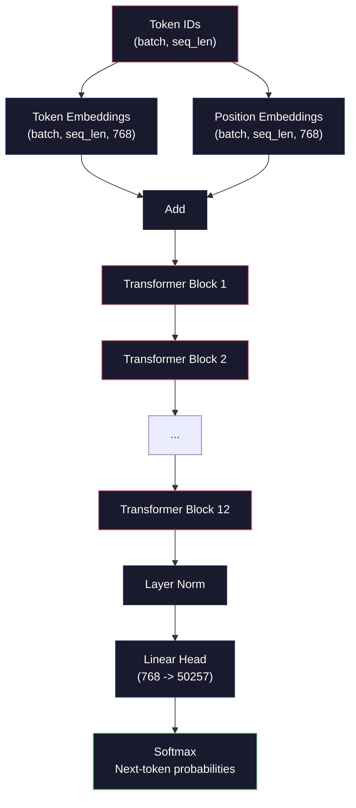
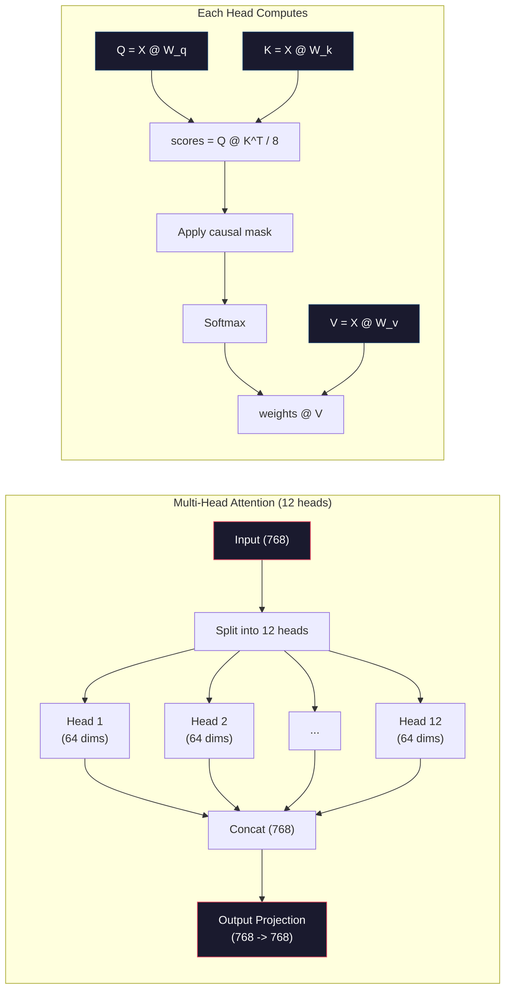
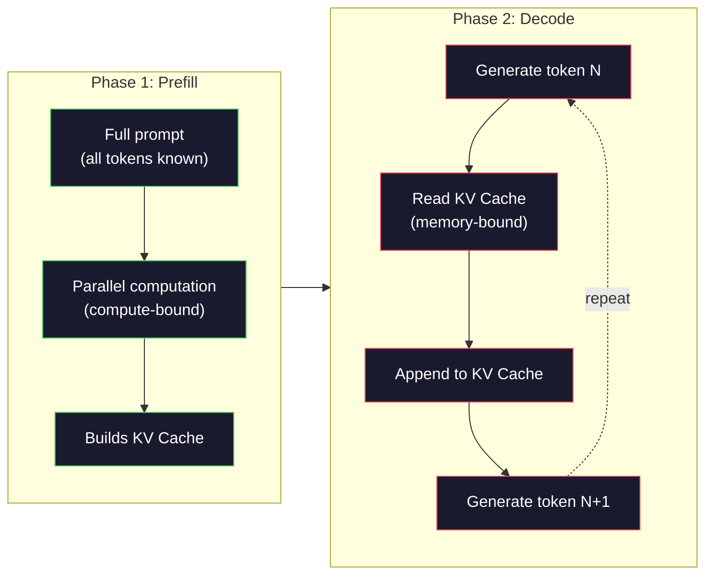

# 从零预训练 一个小GPT(124M参数)

> 简单的GPT-2小组有12亿参数――也就是12个变压器层,12个注意力头,以及768维嵌入式――你可以在单块GPU上使用几个小时从零开始训练它――大多数人从来不会这样做――他们使用预训练的检查点――但如果你没有亲自训练过一个,你实际上不知道你正在构建产品的模型内部发生了什么――

**类型：**建立
**语言：**鱼 (鱼)
**前置要求：**阶段10课01-03(托克尼斯人、建立托克尼斯人、数据管道)
**时间：**时间120分钟

## 学习目标
- 从零实现完整的GPT-2架构(124M参数):代码嵌入式、位置嵌入式、变压器块以及语言模型头
- 使用下一个代币预测和交叉缩损失,在文本语料上训练GPT模型
- 实现带温度采样与顶-k/top-p过的自行降低性 文本生成
- 监控训练损失曲线,并验证模型学到了连贯的语言模式

## 问题
你知道变压器是什么. 你看过这些图片. 你能背出注意力,也能在白板上画出标志.

这些都不意味着你明白模型生成文本时发生了什么.

GPT-2 小 (重量绑定) 有124,438,272个参数. 每个参数都是通过运行训练循环设置出来的:前进通过,计算损失,后退通过,更新权重. 12个变压器块. 每块 12个注意力头. 一个 768 维的嵌入空间. 一个包含 50,257 个接收代币的词汇库. 每当模型生成一个代币时,所有1.24亿个参数都会参与一条矩阵乘法链:它接到一串代币 ID,并输出下一个代币的概率分布.

如果你从未亲自构建过这一切,你就在使用一个黑盒子.你可以使用API.你可以调整.但是当出现问题时,当模型幻觉,重复自己,拒绝遵循指令时,你没有关于 *为什么*的心理模型.

本课程将从零构建GPT-2小――不是用 PyTorch――用 numpy――每次矩阵乘法都可见――每一个梯度都由你的代码计算――你将确实看到1.24亿个数字如何共同作用来预测下一个词――

## 概念
### GPT架构

GPT是一种自主降低语言模型. 它意味着它一次生成一个代币,每个代币都基于所有代币.

下面是从代币 ID 到下一个代币概率的完整计算图:

1. 输入. 形状: (批量大小,seq_len)
2. 标志嵌入查找──每个ID 映射到一个 768 维向量──形状: (批量大小,seq_len,768)──
3. 位置嵌入查找──每个位置(0, 1, 2, ...)映射到一个 768 维向量──形相同──
4. 将代币嵌入式 + 位置嵌入式 相加。
5. 通过12个变压器块.
6. 最终的层正常化.
7. 线性投影到词汇尺寸──形状: (批量尺寸,seq_len,语音尺寸)──
8. 软max 得到概率.

这就是整个模型. 没有转变. 没有复发.



### 变压器块

12个区块中的每个都遵循相同的模式――前规范架构(GPT-2 使用前规范,而不是原始变压器那样的后规范):

1. 标准层
2. 多头自律
3. 剩余连接 (将输入加回来)
4. 标准层
5. 输送网络 (MLP)
6. 剩余连接 (将输入加回来)

剩余连接 至关重要.没有它们,在后传播过程中,渐进到达区块1时会消失.有它们,渐进可以通过从损失直接流向任意层的路径.这就是为什么你可以堆叠12、32,甚至96个区块.

### 注意: 核心机制

让每个代币查看前面所有代币并决定应该关注每个代币.

对于每个代币位置,从输入 计算三个向量:
- **Query (Q)**我在寻找什么?
- **Key (K)**我包含什么?
- **Value (V)**我带着什么信息?

```
Q = input @ W_q    (768 -> 768)
K = input @ W_k    (768 -> 768)
V = input @ W_v    (768 -> 768)

attention_scores = Q @ K^T / sqrt(d_k)
attention_scores = mask(attention_scores)   # causal mask: -inf for future positions
attention_weights = softmax(attention_scores)
output = attention_weights @ V
```

原因面具是让GPT具有自主降低特性的机制――位置5可以参加0-5的位置,但不能参加6、7、8,根据此类推――这将防止模型在训练时通过查看未来代币 来作弊──

**Multi-head attention**将 768 维空间分成 12 个头,每个头 64 维──每个头 学习一种不同的注意力模式──一个头可能追踪句法关系(主题-动词协议)──另一个可能追踪语义相似性(同义)──还有一个可能追踪位置邻近性(附近的词)──来自所有 12 头的输遇被连接,并重新项目回 768 维──



除以平方 (d_k) sqrt)  (64) = 8是缩小.没有它,高维向量的点产量会变得很大,把软max 推到 Gradient 几乎为零的区域.这是原始的注意力是你需要的 纸 中的关键洞见之一.

### 推理为什么快

训练时,你会一次处理整个序列――推理时,你会一次生成一个代币――如果没有优化,生成代币 N 需要为前面所有N-1个代币 重新计算 注意――对于每个生成代币,这是O(N),对于长度为N的序列,总体是O(N^2) 的注意分数 计算,并且还会重复执行大量输入侧矩阵乘数――

 KV Cache 解决了这个问题.为每个代币计算出 K 和 V 后,把它们存储起来.当生成代币 N+1 时,你只需要为新代币计算 Q,并查找所有之前的代币的缓存 K 和 V 之计.这将将 K 和 V 计算的代币成本从 O(N) 降至 O(1) ・注意点计算仍然是 O(N,因为你要关注之前的位置,但你避免对输入进行冗余的矩阵乘法.

对于包含12层和12个头的GPT-2,KV缓存 会为每个代币存储 2(K + V) x 12层 x 12头 x 64个 = 18,432个个值.对于1024个代币序列,这在FP32下大约是75MB.对于拥有128层的Llama 3 405B,单个序列的KV缓存可能超过10GB.

### 预填与解码:推理的两个阶段

当你发送到法师事务所时, 会议分为两个不同阶段.

**Prefill**会并行处理您的整个提示――所有代币都已知,所以模型可以同时计算所有位置的注意――这个阶段是计算的GPU 正在执行全吞吐量矩阵乘法――在A100上,一个1000代币提示的预填需要约20-50ms――

**Decode**会一次生成一个代币――每个新代币都依赖于所有之前的代币――这个阶段是记忆绑定瓶是从GPU内存读取模型权重和KV缓存,而不是矩阵数学本人――GPU的计算核心 大部分时间都在等待记忆阅读――对于GPT-2,每个解码步骤,花费的时间几乎与模块需要多少FLOP 无关,因为约束是记忆带宽――

这种区别对生产系统很重要. 预填输量 随着GPU计算扩展. 更多的FLOPS = 更快的预填) 更多的解码输量 随着内存带宽扩展. 更快的内存 = 更快的解码. 这就是为什么NVIDIA的H100与A100相比重点提升内存带宽.



### 训练循环

训练 LLM 就是下一个代币预测――给定代币 [0, 1, 2, ..., N-1],预测代币 [1, 2, 3, ..., N]――损失函数 是模型预测概率分布与真实下一个代币之间的交叉化――

一个训练步骤:

1. **Forward pass**让批量通过全部12个块.
2. **Compute loss**输入向后平移一位) 与目标代币之间的交叉透.
3. **Backward pass**使用 背扩散 为全部 124M 参数计算 渐进式。
4. **Optimizer step**由于这些因素,我们可以看到一些新的变化.

学习率时间表比你想象的更重要――GPT-2 在前2000步中从0升温到峰值学习率,然后按曲线减弱――从很高的学习率开始导致模型的分歧――保持恒定的高率会导致训练后期的波动――升温-然后-衰退模式被每个主流 LLM使用――

### 简体中文版-2 小号:数字

| Component | Shape | Parameters |
|-----------|-------|------------|
| Token embeddings | (50257, 768) | 38,597,376 |
| Position embeddings | (1024, 768) | 786,432 |
| Per-block attention (W_q, W_k, W_v, W_out) | 4 x (768, 768) | 2,359,296 |
| Per-block FFN (up + down) | (768, 3072) + (3072, 768) | 4,718,592 |
| Per-block LayerNorms (2x) | 2 x 768 x 2 | 3,072 |
| Final LayerNorm | 768 x 2 | 1,536 |
| **Total per block** | | **7,080,960** |
| **Total (12 blocks)** | | **85,054,464 + 39,383,808 = 124,438,272** |

输出投影 (logits head) 与代币嵌入矩阵共享权重. 这叫重量绑定. 它减少了38M参数,并提升了性能,因为它迫使模型对输入和输出使用同一个表示空间.


```figure
sampling-decoder
```

## 构建它
### 步骤1: 嵌入层

符号嵌入式将将50,257个可能的符号中每一个映射到一个768维向量.

```python
import numpy as np

class Embedding:
    def __init__(self, vocab_size, embed_dim, max_seq_len):
        self.token_embed = np.random.randn(vocab_size, embed_dim) * 0.02
        self.pos_embed = np.random.randn(max_seq_len, embed_dim) * 0.02

    def forward(self, token_ids):
        seq_len = token_ids.shape[-1]
        tok_emb = self.token_embed[token_ids]
        pos_emb = self.pos_embed[:seq_len]
        return tok_emb + pos_emb
```

初期化使用0.02的标准偏差,来源于GPT-2纸――太大,初始前进传递 会产生极端值,破坏训练稳定性――太小,初始输出对所有输入几乎相同,让早期渐进信号失去作用――

### 步骤2:带因果面具的自我注意

先实现单头注意力――因果面具 会在软max 之前把未来位置 设置为负无限,确保每个位置只能关注自己和更早的位置――

```python
def attention(Q, K, V, mask=None):
    d_k = Q.shape[-1]
    scores = Q @ K.transpose(0, -1, -2 if Q.ndim == 4 else 1) / np.sqrt(d_k)
    if mask is not None:
        scores = scores + mask
    weights = np.exp(scores - scores.max(axis=-1, keepdims=True))
    weights = weights / weights.sum(axis=-1, keepdims=True)
    return weights @ V
```

软max 实现会在指数化前减去最大值──否则,exp(大_数) 会溢出成无限──这是一个数值稳定性技巧,不会改变输出,因为对于任意常数c,软max(x - c) =软max(x)──

### 步骤3:多头注意力

将 768 维输入 拆分成 12 个头,每个头 64 维──每个头 独立计算 注意──将结果连接,并项目 回 768 维──

```python
class MultiHeadAttention:
    def __init__(self, embed_dim, num_heads):
        self.num_heads = num_heads
        self.head_dim = embed_dim // num_heads
        self.W_q = np.random.randn(embed_dim, embed_dim) * 0.02
        self.W_k = np.random.randn(embed_dim, embed_dim) * 0.02
        self.W_v = np.random.randn(embed_dim, embed_dim) * 0.02
        self.W_out = np.random.randn(embed_dim, embed_dim) * 0.02

    def forward(self, x, mask=None):
        batch, seq_len, d = x.shape
        Q = (x @ self.W_q).reshape(batch, seq_len, self.num_heads, self.head_dim).transpose(0, 2, 1, 3)
        K = (x @ self.W_k).reshape(batch, seq_len, self.num_heads, self.head_dim).transpose(0, 2, 1, 3)
        V = (x @ self.W_v).reshape(batch, seq_len, self.num_heads, self.head_dim).transpose(0, 2, 1, 3)

        scores = Q @ K.transpose(0, 1, 3, 2) / np.sqrt(self.head_dim)
        if mask is not None:
            scores = scores + mask
        weights = np.exp(scores - scores.max(axis=-1, keepdims=True))
        weights = weights / weights.sum(axis=-1, keepdims=True)
        attn_out = weights @ V

        attn_out = attn_out.transpose(0, 2, 1, 3).reshape(batch, seq_len, d)
        return attn_out @ self.W_out
```

这套操作是多头关注中最容易让人困惑的部分.发生的是:形状为 (批量, seq_len, 768) 的子变 (批量, seq_len, 12, 64),再变成 (批量, 12, seq_len, 64) ⋅现在12个头中每一个都有自己的 (seq_len, 64) 矩阵 来运行注意.注意.

### 步骤 4:变压器区块

一个完整的变压器块:LayerNorm、带残余的多头注意、LayerNorm、带残余的输送――

```python
class LayerNorm:
    def __init__(self, dim, eps=1e-5):
        self.gamma = np.ones(dim)
        self.beta = np.zeros(dim)
        self.eps = eps

    def forward(self, x):
        mean = x.mean(axis=-1, keepdims=True)
        var = x.var(axis=-1, keepdims=True)
        return self.gamma * (x - mean) / np.sqrt(var + self.eps) + self.beta


class FeedForward:
    def __init__(self, embed_dim, ff_dim):
        self.W1 = np.random.randn(embed_dim, ff_dim) * 0.02
        self.b1 = np.zeros(ff_dim)
        self.W2 = np.random.randn(ff_dim, embed_dim) * 0.02
        self.b2 = np.zeros(embed_dim)

    def forward(self, x):
        h = x @ self.W1 + self.b1
        h = np.maximum(0, h)  # GELU approximation: ReLU for simplicity
        return h @ self.W2 + self.b2


class TransformerBlock:
    def __init__(self, embed_dim, num_heads, ff_dim):
        self.ln1 = LayerNorm(embed_dim)
        self.attn = MultiHeadAttention(embed_dim, num_heads)
        self.ln2 = LayerNorm(embed_dim)
        self.ffn = FeedForward(embed_dim, ff_dim)

    def forward(self, x, mask=None):
        x = x + self.attn.forward(self.ln1.forward(x), mask)
        x = x + self.ffn.forward(self.ln2.forward(x))
        return x
```

输入将扩大到3,072维(4x),应用一个非线性,然后项目回768维──这种扩张-缩减模式使模型在每个位置上都有一个更宽的内部表示可使用──GPT-2使用GELU激活,但在这里为了简单地使用RELU对理解架构的差异不大──

### 步骤 5: 完整的GPT模型

堆叠 12 个变压器块──在前面加入嵌入层,在后面加入输出投影──

```python
class MiniGPT:
    def __init__(self, vocab_size=50257, embed_dim=768, num_heads=12,
                 num_layers=12, max_seq_len=1024, ff_dim=3072):
        self.embedding = Embedding(vocab_size, embed_dim, max_seq_len)
        self.blocks = [
            TransformerBlock(embed_dim, num_heads, ff_dim)
            for _ in range(num_layers)
        ]
        self.ln_f = LayerNorm(embed_dim)
        self.vocab_size = vocab_size
        self.embed_dim = embed_dim

    def forward(self, token_ids):
        seq_len = token_ids.shape[-1]
        mask = np.triu(np.full((seq_len, seq_len), -1e9), k=1)

        x = self.embedding.forward(token_ids)
        for block in self.blocks:
            x = block.forward(x, mask)
        x = self.ln_f.forward(x)

        logits = x @ self.embedding.token_embed.T
        return logits

    def count_parameters(self):
        total = 0
        total += self.embedding.token_embed.size
        total += self.embedding.pos_embed.size
        for block in self.blocks:
            total += block.attn.W_q.size + block.attn.W_k.size
            total += block.attn.W_v.size + block.attn.W_out.size
            total += block.ffn.W1.size + block.ffn.b1.size
            total += block.ffn.W2.size + block.ffn.b2.size
            total += block.ln1.gamma.size + block.ln1.beta.size
            total += block.ln2.gamma.size + block.ln2.beta.size
        total += self.ln_f.gamma.size + self.ln_f.beta.size
        return total
```

注意重量绑定:`logits = x @ self.embedding.token_embed.T`△输出投影 复用代币嵌入矩阵 (转置) △这不仅仅是一个节省参数的技巧──它意味着模型使用同一个向量空间来理解代币 (嵌入) 和预测代币 (输出) △

### 步骤 6: 训练循环

对于真正的124M参数训练,你需要GPU和PyTorch. 这个训练循环在一个可以用纯粹的运而成的小模型演示机制中.

```python
def cross_entropy_loss(logits, targets):
    batch, seq_len, vocab_size = logits.shape
    logits_flat = logits.reshape(-1, vocab_size)
    targets_flat = targets.reshape(-1)

    max_logits = logits_flat.max(axis=-1, keepdims=True)
    log_softmax = logits_flat - max_logits - np.log(
        np.exp(logits_flat - max_logits).sum(axis=-1, keepdims=True)
    )

    loss = -log_softmax[np.arange(len(targets_flat)), targets_flat].mean()
    return loss


def train_mini_gpt(text, vocab_size=256, embed_dim=128, num_heads=4,
                   num_layers=4, seq_len=64, num_steps=200, lr=3e-4):
    tokens = np.array(list(text.encode("utf-8")[:2048]))
    model = MiniGPT(
        vocab_size=vocab_size, embed_dim=embed_dim, num_heads=num_heads,
        num_layers=num_layers, max_seq_len=seq_len, ff_dim=embed_dim * 4
    )

    print(f"Model parameters: {model.count_parameters():,}")
    print(f"Training tokens: {len(tokens):,}")
    print(f"Config: {num_layers} layers, {num_heads} heads, {embed_dim} dims")
    print()

    for step in range(num_steps):
        start_idx = np.random.randint(0, max(1, len(tokens) - seq_len - 1))
        batch_tokens = tokens[start_idx:start_idx + seq_len + 1]

        input_ids = batch_tokens[:-1].reshape(1, -1)
        target_ids = batch_tokens[1:].reshape(1, -1)

        logits = model.forward(input_ids)
        loss = cross_entropy_loss(logits, target_ids)

        if step % 20 == 0:
            print(f"Step {step:4d} | Loss: {loss:.4f}")

    return model
```

随着训练推进,损失会下降,因为模型学会预测常见模式:如t 后面的th、句号后空格等等等.

在生产中,你会使用亚当优化器,配合渐进积累,学习率加热和渐进剪辑.

### 步骤7:文本生成

几代使用训练好的模型一次预测一个代币. 每次预测都从输出分布中样本.

```python
def generate(model, prompt_tokens, max_new_tokens=100, temperature=0.8):
    tokens = list(prompt_tokens)
    seq_len = model.embedding.pos_embed.shape[0]

    for _ in range(max_new_tokens):
        context = np.array(tokens[-seq_len:]).reshape(1, -1)
        logits = model.forward(context)
        next_logits = logits[0, -1, :]

        next_logits = next_logits / temperature
        probs = np.exp(next_logits - next_logits.max())
        probs = probs / probs.sum()

        next_token = np.random.choice(len(probs), p=probs)
        tokens.append(next_token)

    return tokens
```

温度 控制随机性――温度 1.0 使用原始分布――温度 0.5 会让分布更尖(更确定模型更经常选择顶级选择) ・温度 1.5 会让分布更平坦(更随机低概率代币 获得更大的机会) ・温度 0.0 是贪的解码(总是选择最高概率代币) ――

`tokens[-seq_len:]`这一窗口是必要的,因为模型有最大的文本长度 ((GPT-2 为 1024) ⋅一旦超过它,就必须丢掉最旧的标记――这是所有人都在讨论的文本窗口──

## 使用它
### 完整训练与生成演示

```python
corpus = """The transformer architecture has revolutionized natural language processing.
Attention mechanisms allow the model to focus on relevant parts of the input.
Self-attention computes relationships between all pairs of positions in a sequence.
Multi-head attention splits the representation into multiple subspaces.
Each attention head can learn different types of relationships.
The feedforward network provides nonlinear transformations at each position.
Residual connections enable gradient flow through deep networks.
Layer normalization stabilizes training by normalizing activations.
Position embeddings give the model information about token ordering.
The causal mask ensures autoregressive generation during training.
Pre-training on large text corpora teaches the model general language understanding.
Fine-tuning adapts the pre-trained model to specific downstream tasks."""

model = train_mini_gpt(corpus, num_steps=200)

prompt = list("The transformer".encode("utf-8"))
output_tokens = generate(model, prompt, max_new_tokens=100, temperature=0.8)
generated_text = bytes(output_tokens).decode("utf-8", errors="replace")
print(f"\nGenerated: {generated_text}")
```

在小语料和小模型上,生成文本最多只能计算半连贯.它从训练文本中学到一些字节级模式,但无法像GPT-2那样借助40GB的训练数据和完整的124M参数架构进行概括.重点不是输出质量.重点是你可以追踪每一步:嵌入式查找,注意计算,传输前转,登录投影,软max和样本.每个操作都是可见的.

## 交付它
本课会产出 `outputs/prompt-gpt-architecture-analyzer.md`一个用于分析任意的GPT型模型 架构选择的提示――把模型卡或技术报告交给它,它会解开参数配置、注意设计和扩展决策──

## 练习
1. 将模型改为使用24层和16头,而不是12/12──统计参数──加倍深度与加倍宽度 (嵌入式尺寸) 相比有什么区别?

2. 实现GELU激活函数(GELU(x) = x * 0.5 * (1 + erf(x / sqrt(2)))),并替换输送网络 中的 ReLU。分别使用两种激活函数 训练500步,并比较最终损失──

3. 给生成函数 添加KV缓存. 在第一次前进传递后,存储每个层的K和V子,并在后续代币中复用它们.

4. 实现顶级k样本测试 (只考虑概率最高的 k 个标志) 和顶级p样本测试 (核样本测试:考虑累计概率超过p的最小的标志集合) ⋅在温度下0.8 下比较顶级k=50与顶级p=0.95的输出质量──

5. 构建一个训练损失曲线图案设计者──训练模型1000步,并绘制损失与步骤──识别三个阶段:快速初始下降(学习常见字节)、较慢的中间阶段(学习字节模式) 以及平板块(在小语料上过度配合)──无论你训练的是128-维模型还是GPT-4,这条曲线的形状都是一样的──

## 关键术语
| Term | What people say | What it actually means |
|------|----------------|----------------------|
| Autoregressive | “它一次生成一个词” | 每个输出 Token 都基于所有之前的 Token——模型预测 P(token_n \| token_0, ..., token_{n-1}) |
| Causal mask | “它看不到未来” | 一个由 -infinity 值组成的 upper-triangular Matrix，用于在训练期间阻止 Attention 指向未来 position |
| Multi-head attention | “多种 Attention pattern” | 将 Q、K、V 拆成并行 heads（例如 GPT-2 中 12 个 head，每个 64 dims），让每个 head 学习不同的关系类型 |
| KV Cache | “用于提速的缓存” | 存储来自之前 Token 的已计算 Key 和 Value tensors，以避免 autoregressive generation 期间的冗余计算 |
| Prefill | “处理 prompt” | 第一个 inference 阶段，所有 prompt Token 并行处理——在 GPU FLOPS 上 compute-bound |
| Decode | “生成 Token” | 第二个 inference 阶段，Token 一次生成一个——在 GPU bandwidth 上 memory-bound |
| Weight tying | “共享 embeddings” | 对 input Token embeddings 和 output projection head 使用同一个 Matrix——在 GPT-2 中节省 38M 参数 |
| Residual connection | “Skip connection” | 将 input 直接加到 sublayer 的 output 上（x + sublayer(x)）——支持 deep networks 中的 Gradient flow |
| Layer normalization | “规范化 activations” | 沿 feature dimension 规范化到 mean 0 和 variance 1，并带有可学习的 scale 与 bias 参数 |
| Cross-entropy loss | “预测错得有多离谱” | -log(分配给正确 next Token 的概率)，在所有 position 上取平均——标准 LLM 训练目标 |

## 延伸阅读
- [Radford et al., 2019 -- "Language Models are Unsupervised Multitask Learners" (GPT-2)](https://cdn.openai.com/better-language-models/language_models_are_unsupervised_multitask_learners.pdf)-- 介绍 124M 到 1.5B 参数家族的GPT-2纸
- [Vaswani et al., 2017 -- "Attention Is All You Need"](https://arxiv.org/abs/1706.03762)-- 提出了扩展的点产品关注和多头关注的原始变压器纸
- [Llama 3 Technical Report](https://arxiv.org/abs/2407.21783)-- 如何使用16KGPU将GPT架构扩展到405B参数
- [Pope et al., 2022 -- "Efficiently Scaling Transformer Inference"](https://arxiv.org/abs/2211.05102)-- 将预填与解码与KV缓存分析 形式化纸
