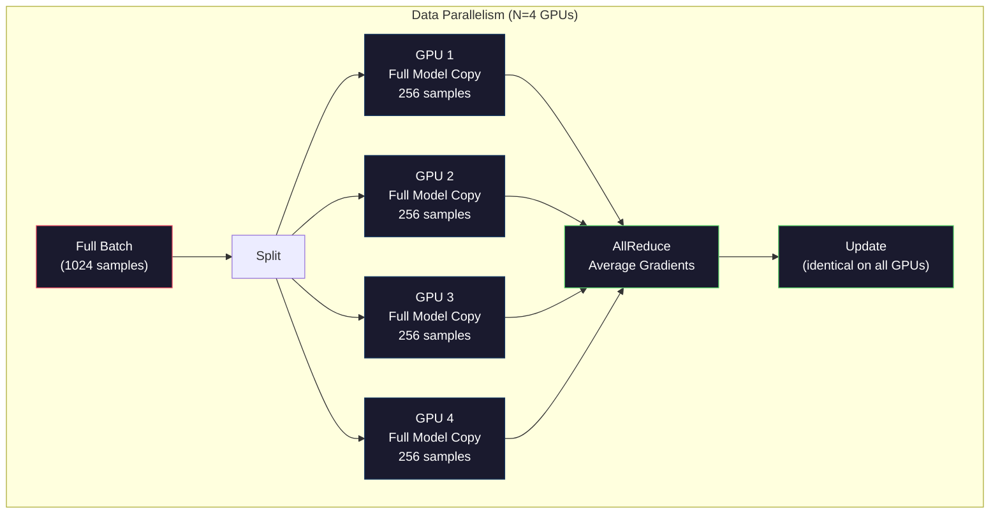
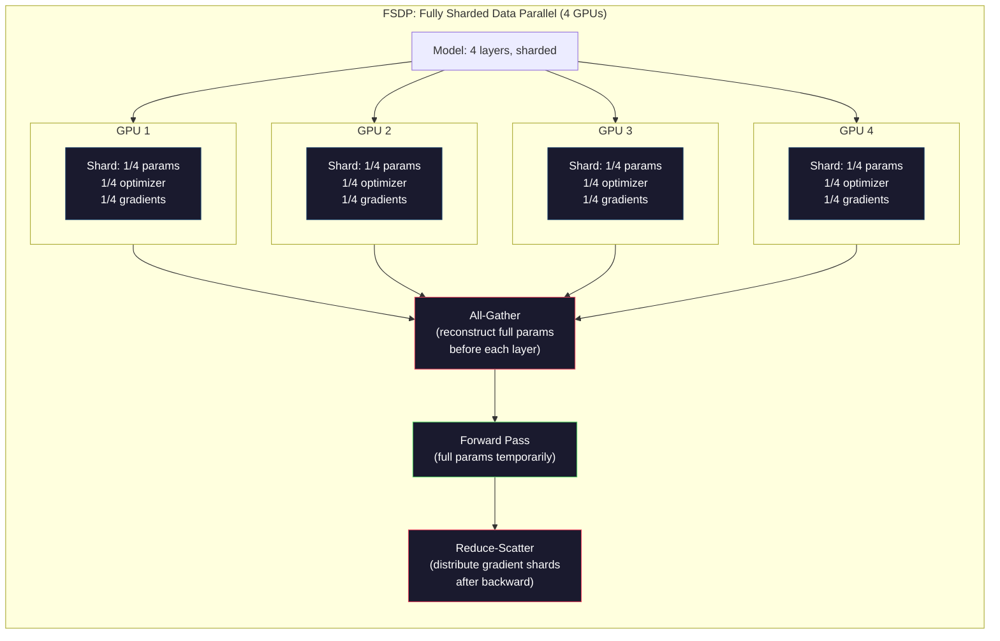
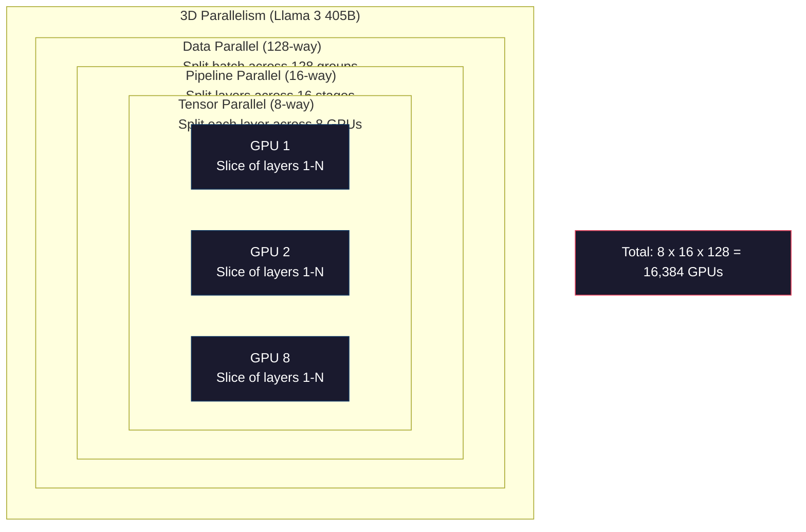

# 规模化:分布式培训,FSDP,深度速度

> 你的124M模型已经在一个GPU块上进行了训练完成了.现在试试70亿参数.模型放入显存.

**Type:** Build
**Languages:** Python
**Prerequisites:** Phase 10, Lesson 04 (Pre-Training a Mini GPT)
**Time:** ~120 minutes

## 学习目标
- 解释三种平行性 (数据、ensor、管道),以及根据模型规模和集群规模判断何时需要使用它们
- 使用PyTorch DDP 实现数据并行训练,并与多块GPU 相步 渐进
- 计算给定模型规模的显存预算(重量+优化状态+梯度+激活),以确定最低硬件需求
- 配置FSDP或DeepSpeed ZeRO阶段,将模型状态分为多块GPU上,从而容纳超过单卡显存的模型

## 问题
一个7B参数模型使用FP16时,仅需要14GB的权重――亚当优化器会为每个参数额外存储两副本――第一时和第二时估计――这也需要28GB――反的时间内的格里第ಂಟ್再增加14GB――还没有存储任何激活,你已经用掉了56GB――

一块NVIDIA A100 有80GB的存储量.

80GB 中已经消耗了56GB──剩下的24GB 给激活,也就是在前传期间计算的中间值,它们必须保留到后传使用──对于2048代币序列和4096维模型,单层激活大约使用64MB──32层就需要每样本2GB──批量尺寸为8个需要16GB──你有24GB──批量尺寸为12个就会爆发显着──

现在试试70B参数――仅重量:FP16 下140GB――单块GPU 放不下――你至少需要2块A100(2 x 80GB =160GB)才能只放下重量――加上优化状态和梯度,需要的GPU 远不止这些:最低3+块,实际上通常取决于碎片化策略,需要8-16块――

拉马3405B 使用16,384块NVIDIA H100GPU 训练――该训练运行估计花费约10亿美元计算 成本――DeepSeek V3 通过更巧妙的架构(专家混合体意味着每个代币只激活一小部分参数) 和训练效率,以约560万美元训练一个可比模型――

本课介绍让大规模训练成为可能的四种策略:数据平行主义、光平行主义、管道平行主义和完全碎片数据平行主义――你先使用纯字thon 模拟每种策略,理解其机制,然后再接触分布式训练框架――

## 概念
### 为什么需要分布式

下面是真实模型的显存计算.

| Model | Params | Weights (FP16) | Adam States | Gradients (FP16) | Total (no activations) |
|-------|--------|----------------|-------------|------------------|----------------------|
| GPT-2 Small | 124M | 248 MB | 992 MB | 248 MB | 1.5 GB |
| Llama 3 8B | 8B | 16 GB | 64 GB | 16 GB | 96 GB |
| Llama 3 70B | 70B | 140 GB | 560 GB | 140 GB | 840 GB |
| Llama 3 405B | 405B | 810 GB | 3,240 GB | 810 GB | 4,860 GB |

亚当国家 这一列才是真正的显存杀手――亚当会为每个参数存储运行平均 (m) 和运行变量 (v),两者都是FP32――对于70B模型,这就是70B × 4字节 × 2 = 560GB――只有优化器就需要七块A100――

单块H100有80GB──Llama3405B 至少需要61块H100才能容纳重量、优化和梯度──加上激活,数量也会继续增加──Meta使用16384块GPU不是因为他们想这样,而是因为他们必须这样──

### 数据平行

最简单的分布式策略――把完整模型复制到N块GPU――把每个训练批次分成N个相等部分――每个块GPU在自己的数据片上运行向前和向后通过――向后通过 之后,在所有GPU之间平均梯度――每个块GPU使用相同的平均梯度更新自己的重量副本,从而保持所有副本同步――

**优点：**吞吐量近似线性扩展――N块GPU 每一步处理N倍数据――通信仅限于梯度平均值,并且可以与计算重叠――

**缺点：**每块GPU都拥有完整的模型"",优化状态和梯度"",对于70B模型,每块GPU都需要840GB.

**计算：**有效批量量 = per_gpu_batch_size x N。对于 N=64块GPU 且每GPU批量为 16,有效批量为 1,024──Llama 3 使用的有效批量量是每步160000个代币──



### 度平行

把单个层 拆分成多块GPU 上――一次矩阵乘法被分成多块GPU,每个块GPU 计算结果的一部分――

考虑一个形状为 (8192, 8192) 的重量矩阵. 时,每个 GPU 块拥有一个 (8192, 2048) 片段. 每个 GPU 块用输入乘以自己的片段,产生一个部分结果. 部分结果将被组合.

**优点：**降低每块GPU的模型重量显存占用量. 一个70B模型被拆除为8块GPU上,这意味着每个块GPU拥有约8.75B参数规模的重量.

**缺点：**每层后都需要高速GPU间通信――每层后的全减会增加延迟――这在NVLink中就像GPU间900GB/s一样的节点,效果很好,但通过InfiniBand的连接节点之间效果差异400 Gb/s,约50 GB/s.

**真实用法：**龙-LM 开创了光平行性――Llama 3 405B 在每个节点内使用8个方向的光平行性――

### 管道平行

按层次 拆分模型。GPU 1 运行层次 1-8。GPU 2 运行层次 9-16。GPU 3 运行层次 17-24。GPU 4 运行层次 25-32。数据流经管道:GPU 1 计算自己的层次 并把激活 发送给GPU 2,GPU 2 计算自己的层次 后发送给GPU 3,依此类推──

**优点：**由于宽度需求较低,所以可以跨节点工作.

**缺点：**当GPU4正计算1个微批次的前行传输时,GPU1、2、3都处于空状态(它们已经完成了自己的前行传输部分) ・后行传输期间,模式反过来──使用天真的管道传输时,N个管道阶段的GPU利用率只有1/N──

**GPipe and PipeDream**通过把批量拆分成微批量来解决泡 问题──GPU 1 一完成微批量 1 的前进,就开始处理微批量 2──这让不同的管道阶段的计算发生重叠──使用M 个微批量 和 N 个阶段,泡分数 降为 (N-1) /M──N=4阶段、M=16个微批量 时,泡 为 3/16 = 18.75%的空时间──

### FSDP:完全分碎的数据并行

FSDP 结合了数据平行化的可扩展性和碎片化的显着存储效率. 每块GPU不再拥有完整的模型副本,而是仅拥有1/N的参数,梯度和优化状态.

在某一层的前进通过之前,FSDP 会运行**all-gather**之后,每个块GPU丢弃非本地参数. 后期,所有回收再次运行,以重建用于梯度计算的参数.**reduce-scatter**发出梯度片段,让每个 GPU 块只存储1/N的梯度.

**70B 模型在 8 块 GPU 上的计算：**

| Component | Without FSDP | With FSDP |
|-----------|-------------|-----------|
| Weights (FP16) | 140 GB per GPU | 17.5 GB per GPU |
| Adam States (FP32) | 560 GB per GPU | 70 GB per GPU |
| Gradients (FP16) | 140 GB per GPU | 17.5 GB per GPU |
| **Total** | **840 GB per GPU** | **105 GB per GPU** |

没有FSDP,你无法把70B模型放进单块80GB的GPU. 后使用8块GPU的FSDP,每块GPU使用105GB等等,这仍然放不下. 你至少需要16块GPU才能让每个块GPU低于80GB,或者把FSDP与激活检查点结合使用.

通信成本高于尼拉数据平行性,因为每个层次都需要全部收集.



### 极速飞行器

根据FSD的概念,它与FSDP相似,但由微软独立开发. 它定义了三个阶段,每个阶段的分化更激进:

| Stage | Shards | Memory Savings | Communication |
|-------|--------|---------------|---------------|
| ZeRO-1 | 仅 Optimizer states | ~4x reduction | 与 data parallel 相同 |
| ZeRO-2 | + Gradients | ~8x reduction | 略多 |
| ZeRO-3 | + Parameters | ~Nx reduction (N GPUs) | 每层 All-gather |

后,PyTorch 加入了FSDP 作为原生实现.

速也引入了Zero-Offload (Zero-Offload) 系统. 优化器状态将将其卸载到CPU RAM,CPU RAM更便宜且容量更大) 和Zero-Infinity (Zero-Infinity) 系统将其卸载到NVMe SSD. 这些方案使用计算速度来换取显存容量:卸载运作更慢,但可以释放显存的GPU.

### 混合精准训练

现代训练会同时使用多种浮点格式:

- **Forward pass**显存是FP32的一半. 在光芯上运行速度快2倍.
- **Master weights**通过优化器维护,用于在重量更新期间保持数值精度.
- **Loss scaling**为了防止FP16梯度下溢为零──优化步骤 前再除以相同常数──

BF16(Brain Float 16) 与FP32相似的指数范围,8个指数位),但精度更低,7个 mantissa位,而FP32是 23) ――它很少需要损失规模化,因为它能表示相同范围的数值――FP16有5个指数位和10个 mantissa位,可以表示更细粒度的数值,但在极端量级下会溢出/下流――

谷歌的TPUs原生使用BF16──NVIDIA的A100和H100同时支持FP16和BF16──行业基本已转向BF16,因为它消除了损失扩展带来的麻烦──

**7B 模型的显存对比：**

| Precision | Weights | Optimizer | Gradients | Total |
|-----------|---------|-----------|-----------|-------|
| FP32 everywhere | 28 GB | 56 GB | 28 GB | 112 GB |
| Mixed (BF16 + FP32 master) | 14 GB | 56 GB | 14 GB | 84 GB |

在这个模型上,混合精度节省28GB──优化状态仍然保持FP32,这也是显著的存储消耗所在.

### 龙-LM 与3D平行

实际上,大规模训练会结合所有三种平行:

- **Data parallelism**跨节点组(扩展批量大小)
- **Tensor parallelism**在节点内 (把层拆到8块GPU)
- **Pipeline parallelism**跨节点 (把层组拆到多台机器)

拉马3405B 在 16,384块H100 上:
- 每节点内8个方向的子平行性 (每节点8块GPU)
- 跨节点16个管道平行性16个管道阶段)
- 剩余维度上128个方向数据平行性16384 / 8 / 16 = 128)

这个3D分解方法是扩展到数千块GPU的方法. 每块GPU 看到不同的数据片段,持有每个层的片段,并计算不同的层次,并计算不同的层次.

果V3采用了不同的方法.它们的专家结构在每个代币上只激活671B参数中的37B. 这意味着每个块GPU只需要计算,并为其存储激活) 活参数.它们在2,048块H800GPU上完成训练,GPU数量不到Meta的1/8,成本为560,000美元,而Meta估计约为10亿美元.




```figure
paged-kv-cache
```

## 构建它
### 步骤1:模拟数据平行

把一个批量拆分成模拟的GPU 上――每个块GPU 在自己的碎片上计算进度传递――平均梯度(这里我们把损失值模拟为梯度) 』

```python
import numpy as np

def simulate_data_parallelism(data, num_gpus, model_fn):
    batch_size = len(data)
    shard_size = batch_size // num_gpus
    remainder = batch_size % num_gpus

    gpu_losses = []
    gpu_gradients = []

    offset = 0
    for gpu_id in range(num_gpus):
        extra = 1 if gpu_id < remainder else 0
        shard = data[offset:offset + shard_size + extra]
        offset += shard_size + extra

        loss, grad = model_fn(shard)
        gpu_losses.append(loss)
        gpu_gradients.append(grad)

    avg_loss = np.mean(gpu_losses)
    avg_gradient = np.mean(gpu_gradients, axis=0)

    return avg_loss, avg_gradient
```

在实践中,NVIDIA GPU 上会使用NCCL图书馆,它实现了环节降低:每块 GPU 将自己降低的1/N 发送给相邻 GPU,从另一边相邻 GPU 接收1/N,经过N-1 步后,每个块 GPU 都拥有完整的平均量:总通信:2 x gradient_size x (N-1) /N,当N 很大时接近梯度大小的2倍.

### 步骤 2:模拟度平行

把重量矩阵分解成多块GPU 上――每块GPU 计算部分矩阵乘积――组合结果――

```python
def simulate_tensor_parallelism(input_data, weight_matrix, num_gpus):
    d_in, d_out = weight_matrix.shape
    assert d_out % num_gpus == 0, f"d_out {d_out} not divisible by num_gpus {num_gpus}"
    shard_size = d_out // num_gpus

    partial_results = []
    for gpu_id in range(num_gpus):
        start = gpu_id * shard_size
        end = start + shard_size
        weight_shard = weight_matrix[:, start:end]

        partial = input_data @ weight_shard
        partial_results.append(partial)

    full_output = np.concatenate(partial_results, axis=-1)

    direct_output = input_data @ weight_matrix
    error = np.abs(full_output - direct_output).max()

    return full_output, error
```

应严格为零(或机器圆) ・电压平行在数学上是精确的,它产生的结果与在一个块GPU上计算完整的图像相同――切分沿输出维度进行,因此每个块GPU产生不同的列块,连接会重建完整的结果――

对于列平行线性层 (切分输出维度),你执行连接.对于列平行 (切分输入维度),你执行总量. 在变压器 FFN 中,第一个线性层 (扩展) 使用列平行 (column-parallel),第二个线性层 (contract) 使用列平行 (row-parallel)).这样可以避免两层之间一次的全部减少──

### 步骤3:模拟管道平行

把模型层 拆到虚拟GPU上――展示泡问题:早期阶段 会在后续阶段 计算时处于空──

```python
def simulate_pipeline_parallelism(num_layers, num_stages, num_microbatches):
    layers_per_stage = num_layers // num_stages

    timeline = {}
    clock = 0

    for mb in range(num_microbatches):
        for stage in range(num_stages):
            start_time = max(
                timeline.get((stage, mb - 1, "fwd"), (0, 0))[1] if mb > 0 else 0,
                timeline.get((stage - 1, mb, "fwd"), (0, 0))[1] if stage > 0 else 0,
            )
            end_time = start_time + layers_per_stage
            timeline[(stage, mb, "fwd")] = (start_time, end_time)

    last_fwd_end = max(v[1] for v in timeline.values())

    for mb in range(num_microbatches - 1, -1, -1):
        for stage in range(num_stages - 1, -1, -1):
            deps = [last_fwd_end]
            if mb < num_microbatches - 1 and (stage, mb + 1, "bwd") in timeline:
                deps.append(timeline[(stage, mb + 1, "bwd")][1])
            if stage < num_stages - 1 and (stage + 1, mb, "bwd") in timeline:
                deps.append(timeline[(stage + 1, mb, "bwd")][1])
            start_time = max(deps)
            end_time = start_time + layers_per_stage
            timeline[(stage, mb, "bwd")] = (start_time, end_time)

    total_time = max(v[1] for v in timeline.values())
    compute_time = num_microbatches * num_stages * layers_per_stage * 2
    bubble_fraction = 1.0 - compute_time / (total_time * num_stages)

    return timeline, total_time, bubble_fraction
```

使用4个阶段和1个微批次,泡分数为75%,也就是任意时刻四块GPU中有三块空──使用16个微批次时,它会降至约19%──消除泡的成本显着存储:你必须同时存储所有飞行中的微批次的激活──

### 步骤 4: 记忆计算器

计算任意模型规模训练时的精确显现需求――

```python
def memory_calculator(
    params_billions,
    precision_bytes=2,
    optimizer="adam",
    num_gpus=1,
    sharding="none",
    sequence_length=2048,
    batch_size_per_gpu=1,
    hidden_dim=None,
    num_layers=None,
):
    params = params_billions * 1e9

    weight_memory = params * precision_bytes

    if optimizer == "adam":
        optimizer_memory = params * 4 * 2
    elif optimizer == "sgd":
        optimizer_memory = params * 4
    else:
        optimizer_memory = 0

    gradient_memory = params * precision_bytes

    total_no_activation = weight_memory + optimizer_memory + gradient_memory

    if hidden_dim and num_layers:
        activation_per_layer = (
            sequence_length * batch_size_per_gpu * hidden_dim * precision_bytes * 4
        )
        activation_memory = activation_per_layer * num_layers
    else:
        activation_memory = params * precision_bytes * 0.5

    if sharding == "fsdp" or sharding == "zero3":
        weight_memory /= num_gpus
        optimizer_memory /= num_gpus
        gradient_memory /= num_gpus
    elif sharding == "zero2":
        optimizer_memory /= num_gpus
        gradient_memory /= num_gpus
    elif sharding == "zero1":
        optimizer_memory /= num_gpus

    per_gpu_total = weight_memory + optimizer_memory + gradient_memory + activation_memory

    return {
        "params_billions": params_billions,
        "weights_gb": weight_memory / 1e9,
        "optimizer_gb": optimizer_memory / 1e9,
        "gradients_gb": gradient_memory / 1e9,
        "activations_gb": activation_memory / 1e9,
        "per_gpu_total_gb": per_gpu_total / 1e9,
        "total_across_gpus_gb": per_gpu_total * num_gpus / 1e9,
        "fits_on_80gb": per_gpu_total / 1e9 <= 80,
        "num_gpus": num_gpus,
        "sharding": sharding,
    }
```

这个计算器回答了每个ML工程师都会问的问题:我需要多少块GPU?输入模型大小,看看是否放下了.

### 步骤 5:混合精密模拟

与混合精度训练的显存使用相比.

```python
def mixed_precision_comparison(params_billions):
    params = params_billions * 1e9

    fp32_weights = params * 4
    fp32_optimizer = params * 4 * 2
    fp32_gradients = params * 4
    fp32_total = fp32_weights + fp32_optimizer + fp32_gradients

    fp16_weights = params * 2
    fp16_master = params * 4
    fp16_optimizer = params * 4 * 2
    fp16_gradients = params * 2
    fp16_total = fp16_weights + fp16_master + fp16_optimizer + fp16_gradients

    mixed_weights = params * 2
    mixed_optimizer = params * 4 * 2
    mixed_gradients = params * 2
    mixed_total = mixed_weights + mixed_optimizer + mixed_gradients

    return {
        "fp32_total_gb": fp32_total / 1e9,
        "fp16_with_master_gb": fp16_total / 1e9,
        "mixed_bf16_gb": mixed_total / 1e9,
        "savings_vs_fp32": 1 - mixed_total / fp32_total,
    }
```

对大多数人来说,最大的意外是:混合精度将不会显现减半――优化状态 (Adam的 m 和 v) 不管精度如何都保持FP32――对于7B模型,FP32训练使用112GB――混合精度使用84GB――这是25%的减少,而不是50%――优化器占主导地位――

## 使用它
### 运行所有模拟

```python
def run_all_demos():
    print("=" * 70)
    print("DATA PARALLELISM SIMULATION")
    print("=" * 70)

    np.random.seed(42)
    data = np.random.randn(64, 32)
    weight = np.random.randn(32, 16)

    def model_fn(batch):
        output = batch @ weight
        loss = np.mean(output ** 2)
        grad = 2 * batch.T @ (batch @ weight) / len(batch)
        return loss, grad

    for n_gpus in [1, 2, 4, 8]:
        loss, grad = simulate_data_parallelism(data, n_gpus, model_fn)
        print(f"  {n_gpus} GPUs: loss={loss:.4f}, grad_norm={np.linalg.norm(grad):.4f}")

    print()
    print("=" * 70)
    print("TENSOR PARALLELISM SIMULATION")
    print("=" * 70)

    x = np.random.randn(4, 8192)
    W = np.random.randn(8192, 8192)

    for n_gpus in [1, 2, 4, 8]:
        output, error = simulate_tensor_parallelism(x, W, n_gpus)
        print(f"  {n_gpus} GPUs: output_shape={output.shape}, max_error={error:.2e}")

    print()
    print("=" * 70)
    print("PIPELINE PARALLELISM SIMULATION")
    print("=" * 70)

    for n_mb in [1, 4, 8, 16, 32]:
        _, total_t, bubble = simulate_pipeline_parallelism(32, 4, n_mb)
        print(f"  {n_mb:2d} micro-batches: total_time={total_t:4d}, bubble={bubble:.1%}")

    print()
    print("=" * 70)
    print("MEMORY CALCULATOR")
    print("=" * 70)

    configs = [
        (7, "none", 1),
        (7, "fsdp", 8),
        (70, "none", 1),
        (70, "fsdp", 8),
        (70, "fsdp", 16),
        (405, "fsdp", 64),
        (405, "fsdp", 128),
    ]

    print(f"  {'Model':>8} {'Sharding':>8} {'GPUs':>5} {'Per-GPU':>10} {'Fits 80GB':>10}")
    print("  " + "-" * 50)
    for params, shard, gpus in configs:
        result = memory_calculator(params, num_gpus=gpus, sharding=shard)
        fits = "Yes" if result["fits_on_80gb"] else "No"
        print(f"  {params:>6}B {shard:>8} {gpus:>5} {result['per_gpu_total_gb']:>8.1f}GB {fits:>10}")

    print()
    print("=" * 70)
    print("MIXED PRECISION COMPARISON")
    print("=" * 70)

    for params_b in [7, 13, 70, 405]:
        result = mixed_precision_comparison(params_b)
        print(f"  {params_b}B: FP32={result['fp32_total_gb']:.0f}GB, "
              f"Mixed BF16={result['mixed_bf16_gb']:.0f}GB, "
              f"Savings={result['savings_vs_fp32']:.0%}")
```

## 交付它
本课会产出 `outputs/prompt-distributed-training-planner.md`接收模型尺寸和可用的硬件,然后生成完整的分布式培训计划:平行战略,记忆预算,通信总费和预期吞吐量.

## 练习
1. 修改记忆计算器,加入激活检查点──使用检查点时,只在每第 K 层存储激活中,表示全部重算) ─展示记忆计算交易off:检查点能节省多少显存,以及会让训练变慢多少(完全检查点大约增加 33%的计算)?

2. 扩展管道平行模拟,实现 PipeDream 使用的1F1B(一个前进,一个后退) 时间表――对4个阶段和8个微批次,比较它与天真时间表的泡分数――1F1B时间表应该具有更低的峰值内存,因为它更早开始回转――

3. 实现梯度积累模拟器――不要在每个微批次中全部降低,而是在本地积累K步梯度,然后再全部降低――展示这如何把通信减少K倍,同时产生完全相同的最终梯度――因此训练也完全相同)

4. 构建一个成本估计器――给定模型大小、目标代币数量、GPU类型(A100在 $2/hr，H100 at $据估计, 美国人民币的成本是约3405B美元.$100M，DeepSeek V3 成本约 $五,六米

5. 在内存计算器中加入 ZeRO-Offload──假设每个节点有512GB CPU RAM和2TB NVMe──展示把优化状态下载到CPU后,如何让70B模型从需要16块GPU的4块GPU变得可用,代价是优化步骤变慢30-50%.

## 关键术语
| Term | What people say | What it actually means |
|------|----------------|----------------------|
| Data parallelism | “把模型复制到每块 GPU” | 每块 GPU 处理不同的 data shard；每一步之后通过 all-reduce 平均 gradients |
| Tensor parallelism | “把一层拆到多块 GPU 上” | 切分 weight matrices，让每块 GPU 计算 matmul 的一部分；需要高速 NVLink interconnect |
| Pipeline parallelism | “把 layers 拆到多块 GPU 上” | 每块 GPU 运行不同的一组 layers；数据通过 pipeline 流动，并使用 micro-batches 减少 bubbles |
| FSDP | “Shard everything” | Fully Sharded Data Parallel：每块 GPU 持有 1/N 的 weights、gradients 和 optimizer states；计算前执行 all-gather |
| ZeRO | “DeepSpeed 版本的 FSDP” | Zero Redundancy Optimizer，包含 3 个 stages：shard optimizer（Stage 1）、+ gradients（Stage 2）、+ parameters（Stage 3） |
| All-reduce | “在 GPU 之间求平均” | collective operation，让每块 GPU 最终都拥有所有 GPU 输入的 sum（或 average），通常实现为 ring all-reduce |
| All-gather | “从所有 GPU 收集” | collective operation，让每块 GPU 最终都拥有所有 GPU 数据的 concatenation；FSDP 中用于重建完整 parameters |
| Reduce-scatter | “求和并分发” | collective operation，对数据进行 reduce（sum）并把不同 chunks scatter 到不同 GPU；FSDP 中用于 gradient sharding |
| Mixed precision | “用 half precision 训练” | forward/backward 使用 FP16/BF16，optimizer states 使用 FP32；节省约 25% 显存，而不是 50%，因为 optimizer 占主导 |
| Pipeline bubble | “pipeline 中的 idle time” | GPU 等待上一 stage 数据时处于空闲的时间比例；可通过使用更多 micro-batches 降低 |

## 延伸阅读
- [Rajbhandari et al., 2020 -- "ZeRO: Memory Optimizations Toward Training Trillion Parameter Models"](https://arxiv.org/abs/1910.02054)-- 定义三个碎片阶段的深度速度 ZeRO 纸
- [Shoeybi et al., 2020 -- "Megatron-LM: Training Multi-Billion Parameter Language Models Using Model Parallelism"](https://arxiv.org/abs/1909.08053)-- NVIDIA 面向变压器的子平行性
- [Narayanan et al., 2021 -- "Efficient Large-Scale Language Model Training on GPU Clusters Using Megatron-LM"](https://arxiv.org/abs/2104.04473)-- 结合数据、ensor 和管道的3D平行性
- [Zhao et al., 2023 -- "PyTorch FSDP: Experiences on Scaling Fully Sharded Data Parallel"](https://arxiv.org/abs/2304.11277)-- PyTorch 的原生FSDP实现
- [Llama 3 Technical Report](https://arxiv.org/abs/2407.21783)-- 16,384 GPU训练的3D平行性 细节
- [DeepSeek-V3 Technical Report](https://arxiv.org/abs/2412.19437)-- 如何将训练成本降低一个数量级
