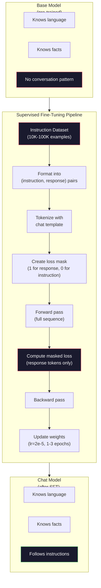

# 指示调整 (SFT)

> 基本模型 会预测下一个代币――仅此而已――它不会遵循指令,回答问题,也不会拒绝有害请求――SFT 是代币 预测器与有用助手之间的桥梁――你曾经交谈过的每个模型――Claude、GPT、Llama Chat――都经历过这个步骤――

**类型：**建立
**语言：**字符串 (含)
**前置要求：**第十阶段 第四课 (预训练小GPT)
**时间：**时间90分钟

## 学习目标

- 实现监督细节调整 (SFT),将基础语言模型转换为遵循指令的助理
- 使用包含系统、用户和助手 角色的聊天模板 格式化训练数据,并对非助手代币 屏蔽损失
- 解释为什么SFT是必要的:基础模型会继续文本,而不是回答问题
- 通过在保留的指令集 上比较基模型与细调模型的回复,评估SFT质量

## 问题

你在04课中训练了一个模型.给定一个序列,它可以预测下一个代币.向它输入"变压器架构",它可能会继续输出"已经彻底改变了自然语言处理".对下一个代币预测器来说,这是很强大的.

现在试试这个:向它输入"法国的首都是什么?"基模型不会回答"巴黎".它会继续这个模式――它可能产生"德国的首都是什么?西班牙的首都是什么?",因为它从包含问题列表的文档中学到了这种模式――或者它可能产生"这是许多人问的问题",因为这是一个合理的下一个代码的延续――这个模型没有*答*的概念――它只知道*继续*――

这就是2020年6月发布的GPT-3和ChatGPT之间的差异.

斯坦福阿尔帕卡证明你不需要数百万个例子. 2023年3月,他们只使用GPT-3.5 生成的52,000个指示响应对Llama 7B进行了细节调整.总成本:600美元.结果是一个能够遵循指令,回答问题并进行对话的聊天机器人.

在初步的SFT阶段,Meta的Llama 2聊天只使用了约27,000个高质量示例――关键洞见是:质量比数量更重要――由熟练标记员编写的27,000个示例超过了互联网抓取的100万个噪音示例――

## 概念

### 实际上做了什么

监督精细调节 延续了预训练中相同的训练循环 - 前进通过,计算损失,后退通过更新权重 - 但使用的是另一类数据.

```json
{
  "system": "You are a helpful assistant.",
  "user": "What is the capital of France?",
  "assistant": "The capital of France is Paris."
}
```

已知道巴黎是法国的首都. 它在维基百科,教材和网页上学到了这一点.

可以这样理解――预训 给模型 知识――SFT 给模型礼仪――

### 数据格式

业内主要有三种格式. 每种格式都编码相同的信息.

**Alpaca Format**美国政府的要求

```json
{
  "instruction": "Summarize the following article in 3 sentences.",
  "input": "The European Central Bank raised interest rates...",
  "output": "The ECB increased rates by 25 basis points..."
}
```

简单且广泛使用.`input`字段是可选的-- 许多指令不需要额外的下文──斯坦福发布了52,000个这样的格式的例子,由GPT-3.5 以600美元的成本产生──这开启了开源指令调整运动──

**ShareGPT Format**(共同体,2023年):

```json
{
  "conversations": [
    {"from": "system", "value": "You are a helpful assistant."},
    {"from": "human", "value": "What causes tides?"},
    {"from": "gpt", "value": "Tides are caused by the gravitational pull of the Moon..."},
    {"from": "human", "value": "How often do they occur?"},
    {"from": "gpt", "value": "Most coastal areas experience two high tides and two low tides per day..."}
  ]
}
```

支持多轮对话――按照惯例",从"字段使用"人" 和"gpt",不管实际模型是什么――Vicuna使用从用户共享的ChatGPT抄本中抓取的70,000条分享GPT对话进行训练――

**ChatML Format**(OpenAI,许多开源模型使用):

```
<|im_start|>system
You are a helpful assistant.<|im_end|>
<|im_start|>user
What is the capital of France?<|im_end|>
<|im_start|>assistant
The capital of France is Paris.<|im_end|>
```

使用特殊标志`<|im_start|>`,我知道.`<|im_end|>`为了分隔角色──这些代币会在调整期间添加到代币器的词汇中──Qwen、Yi 和许多其他模型使用ChatML──

三种格式都实现了相同的事情:它们告诉模型这是指令,这是答案,学习这个模式.

### 为什么它有效

模型已经从预训练中学学会了语言――它已经看到数十亿个问题后跟答,命令后跟补充,以及人与人之间的对话的例子――这些模式已经编码在重量中――

通过几千个例子,模型会学到:当你看到助理角色标记时,产生有帮助的回复.

这就是为什么27000个例子足够的原因. 你不是在教学英语模型. 你不是在教它关于世界的事实.

### 隐藏的损失

这是在SFT中最重要的技术细节,

在预训期间,你会对每个代币计算损失. 在SFT期间,你只对*响应*代币计算损失.

为什么?因为你不希望模型 学会*生成*指令――你希望它学会*响应*指令――如果你对指示代币计算损失,你就是在训练模型预测"法国的首都是什么?",仿佛它才是问者――这会浪费渐进信号,并可能让模型对自己的角色产生混――

实践中,你会创建一个损失面具:响应代币为 1,指示代币为 0――在取平均之前,将每个代币的损失乘以这个面具――

```
Tokens:    [SYS] You are helpful [USER] What is the capital? [ASST] Paris is the capital [EOS]
Loss mask:   0    0    0     0      0     0   0  0     0       1     1    1   1     1      1
```

只有`[ASST]`后的代币会贡献损失――模型在前进传递期间会看到完整的对话(它需要指令才能产生正确的反应),但只根据它的预测反应的效果来更新重量――

### 训练 超参数

您不是从头上训练.您正在调整一个已经能工作的模型.

| Parameter | Pre-Training (Llama 2 7B) | SFT (Llama 2 Chat) |
|-----------|---------------------------|---------------------|
| Learning rate | 3e-4 (peak) | 2e-5 |
| Epochs | 1（单次遍历数据） | 2 |
| Batch size | 4M tokens | 64 examples |
| Warmup steps | 2,000 | 0-100 |
| Weight decay | 0.1 | 0.0-0.1 |
| Data size | 2T tokens | 27,000 examples |

对于SFT的学习率是非常关键的. 细节调整期间的学习率会破坏预训练知识.

两个时代意味着模型将看到每个训练示例两次. 在小数据集中超过3个时代会导致记忆化.

### 遗忘是灾难性的

细调可能破坏通用能力――在跟随指令的数据上训练太久,模型可能会失去编码,做数学或创意文本的能力――它会非常擅长训练数据中的特定格式,但在其他方面表现很差――

三种缓解方式:

1. **低 learning rate。**更新更小意味着对预训练的功能造成更少的破坏.

2. **短训练。**在模型过度适应之前停止.

3. **混入 pre-training 数据。**拉马2聊将一小部分 ((2-5%) 原始预训 数据混入SFT数据集──这样可以在学习新指令后行为时,提醒模型保持通用能力──

### 真实数字

在1万个高质量指令对上调整一个7B模型,使用单张NVIDIA A100 80GB GPU大约需要1小时.

- 10,000个例子 x 平均 512个代币 = 5.12M代币
- 两个时代 = 总数10.24M代币
- 率:~3,000个代币/秒
- 时间: 时间:

对于我们的小型GPT (四层,128个),训练几乎是瞬间的.




```figure
loss-masking
```

## 构建

### 步骤1:指令数据集

创建一个合成指令数据集. 在生产环境中,像AI和人类这样的公司会雇佣人工标记员编写这些数据.

```python
import numpy as np

INSTRUCTION_DATA = [
    {
        "instruction": "What is the capital of France?",
        "response": "The capital of France is Paris."
    },
    {
        "instruction": "Explain gravity in one sentence.",
        "response": "Gravity is the force that attracts objects with mass toward each other."
    },
    {
        "instruction": "Write a haiku about the ocean.",
        "response": "Waves crash on the shore, salt and foam beneath the sun, endless blue expanse."
    },
    {
        "instruction": "What is 15 multiplied by 7?",
        "response": "15 multiplied by 7 is 105."
    },
    {
        "instruction": "Name three programming languages.",
        "response": "Three programming languages are Python, Rust, and TypeScript."
    },
    {
        "instruction": "Summarize photosynthesis.",
        "response": "Photosynthesis converts sunlight, water, and carbon dioxide into glucose and oxygen."
    },
    {
        "instruction": "What year did World War II end?",
        "response": "World War II ended in 1945."
    },
    {
        "instruction": "Define machine learning.",
        "response": "Machine learning is a field where algorithms learn patterns from data to make predictions."
    },
]
```

八个例子非常少.斯坦福阿尔帕卡使用了52,000个.

### 步骤2: 使用聊天模板 进行标记

将指示-响应对进行转换为带有特殊角色标记的标记序列. 这些标记告诉模型指示 在哪里结束,响应 从哪里开始.

```python
SPECIAL_TOKENS = {
    "INST_START": 253,
    "INST_END": 254,
    "RESP_START": 255,
}


def tokenize_instruction_pair(instruction, response, vocab_size=256):
    inst_tokens = list(instruction.encode("utf-8"))
    resp_tokens = list(response.encode("utf-8"))

    inst_tokens = [min(t, vocab_size - 4) for t in inst_tokens]
    resp_tokens = [min(t, vocab_size - 4) for t in resp_tokens]

    tokens = (
        [SPECIAL_TOKENS["INST_START"]]
        + inst_tokens
        + [SPECIAL_TOKENS["INST_END"]]
        + [SPECIAL_TOKENS["RESP_START"]]
        + resp_tokens
    )

    return tokens


def create_loss_mask(tokens):
    mask = np.zeros(len(tokens), dtype=np.float32)
    in_response = False

    for i, token in enumerate(tokens):
        if token == SPECIAL_TOKENS["RESP_START"]:
            in_response = True
            continue
        if in_response:
            mask[i] = 1.0

    return mask
```

输失面具对指示令子 全部为零,对响应令子 全部为一.`RESP_START`标志本身面具为0,因为它是分隔符,不是响应内容的一部分.

### 步骤3: 面具的跨性损失

标准跨,但乘以损失面具――只有响应代币 会贡献 渐进式――

```python
def masked_cross_entropy_loss(logits, targets, loss_mask):
    batch, seq_len, vocab_size = logits.shape
    logits_flat = logits.reshape(-1, vocab_size)
    targets_flat = targets.reshape(-1)
    mask_flat = loss_mask.reshape(-1)

    max_logits = logits_flat.max(axis=-1, keepdims=True)
    log_softmax = logits_flat - max_logits - np.log(
        np.exp(logits_flat - max_logits).sum(axis=-1, keepdims=True)
    )

    per_token_loss = -log_softmax[np.arange(len(targets_flat)), targets_flat]

    masked_loss = per_token_loss * mask_flat
    num_response_tokens = mask_flat.sum()
    if num_response_tokens == 0:
        return 0.0
    loss = masked_loss.sum() / num_response_tokens

    return loss
```

分母是`num_response_tokens`没有`seq_len`△除总序列长度,更长的指示会稀释渐进信号――除响应符号数可以确保无论命令长度如何,每个响应符号的权重相同――

### 步骤4:SFT 训练循环

复用04课中的MiniGPT──训练循环看起来几乎与预训练相似,只是加入了指令格式化和掩盖损失──

```python
import sys
import os
sys.path.insert(0, os.path.join(os.path.dirname(__file__), "..", "..", "04-pre-training-mini-gpt", "code"))
from main import MiniGPT, LayerNorm, FeedForward, MultiHeadAttention, TransformerBlock, Embedding


def sft_train(model, dataset, num_epochs=2, lr=2e-5, seq_len=64):
    formatted_data = []
    for example in dataset:
        tokens = tokenize_instruction_pair(example["instruction"], example["response"])
        mask = create_loss_mask(tokens)
        formatted_data.append((tokens, mask))

    print(f"SFT Training: {len(formatted_data)} examples, {num_epochs} epochs, lr={lr}")
    print(f"Total tokens: {sum(len(t) for t, _ in formatted_data):,}")
    print()

    losses = []

    for epoch in range(num_epochs):
        epoch_loss = 0.0
        num_batches = 0

        indices = np.random.permutation(len(formatted_data))

        for idx in indices:
            tokens, mask = formatted_data[idx]

            if len(tokens) < 3:
                continue
            if len(tokens) > seq_len:
                tokens = tokens[:seq_len]
                mask = mask[:seq_len]

            input_ids = np.array(tokens[:-1]).reshape(1, -1)
            target_ids = np.array(tokens[1:]).reshape(1, -1)
            loss_mask = np.array(mask[1:]).reshape(1, -1)

            logits = model.forward(input_ids)
            loss = masked_cross_entropy_loss(logits, target_ids, loss_mask)

            batch_size, s_len, v_size = logits.shape
            probs = np.exp(logits - logits.max(axis=-1, keepdims=True))
            probs = probs / probs.sum(axis=-1, keepdims=True)
            dlogits = probs.copy()
            dlogits[np.arange(batch_size)[:, None], np.arange(s_len), target_ids] -= 1.0

            mask_expanded = loss_mask[:, :, np.newaxis]
            num_resp = loss_mask.sum()
            if num_resp > 0:
                dlogits = dlogits * mask_expanded / num_resp

            for block in model.blocks:
                block.ffn.W1 -= lr * np.random.randn(*block.ffn.W1.shape) * 0.01
                block.ffn.W2 -= lr * np.random.randn(*block.ffn.W2.shape) * 0.01
                block.ffn.b1 -= lr * np.random.randn(*block.ffn.b1.shape) * 0.01
                block.ffn.b2 -= lr * np.random.randn(*block.ffn.b2.shape) * 0.01

            epoch_loss += loss
            num_batches += 1
            losses.append(loss)

        avg_loss = epoch_loss / max(num_batches, 1)
        print(f"Epoch {epoch + 1}/{num_epochs} | Avg Loss: {avg_loss:.4f}")

    return model, losses
```

学习率是2e-5,与Llama2聊天匹配――将它与预训练中使用的3e-4对比―― 小15倍――级别 被掩盖:指令令令令 产生零级别――只有响应令令 推动权重――

### 步骤5:比较基础与SFT模型

通过检查模型来衡量如何应对命令格式输入和原始文本延续.

```python
def generate_response(model, prompt_tokens, max_new_tokens=50, temperature=0.8):
    tokens = list(prompt_tokens)
    seq_len = model.embedding.pos_embed.shape[0]

    for _ in range(max_new_tokens):
        context = np.array(tokens[-seq_len:]).reshape(1, -1)
        logits = model.forward(context)
        next_logits = logits[0, -1, :]

        next_logits = next_logits / max(temperature, 1e-8)
        probs = np.exp(next_logits - next_logits.max())
        probs = probs / probs.sum()
        probs = np.clip(probs, 1e-10, 1.0)
        probs = probs / probs.sum()

        next_token = np.random.choice(len(probs), p=probs)
        tokens.append(int(next_token))

    return tokens


def evaluate_instruction_following(model, instructions):
    print("Evaluating instruction following:")
    print("-" * 50)

    for instruction in instructions:
        tokens = (
            [SPECIAL_TOKENS["INST_START"]]
            + [min(t, 252) for t in list(instruction.encode("utf-8"))]
            + [SPECIAL_TOKENS["INST_END"]]
            + [SPECIAL_TOKENS["RESP_START"]]
        )

        output = generate_response(model, tokens, max_new_tokens=30, temperature=0.6)
        response_start = len(tokens)
        response_tokens = output[response_start:]
        response_bytes = bytes([t for t in response_tokens if t < 128])
        response_text = response_bytes.decode("utf-8", errors="replace")

        print(f"  Q: {instruction}")
        print(f"  A: {response_text[:80]}")
        print()
```

在只有8个例子中的小模型上,回复不会有实际意义――这是预期的――重要的是*结构*:模型学习在响应标记后生成输出,而不是继续生成更多的指示――

### 步骤 6: 衡量灾难性遗忘

较SFT前后模型的下一个代币预测能力.如果SFT损坏了通用能力,原始文本上的损失会上升.

```python
def measure_forgetting(model, test_text, seq_len=64):
    tokens = np.array(list(test_text.encode("utf-8")[:512]))

    total_loss = 0.0
    num_windows = 0

    for start in range(0, len(tokens) - seq_len - 1, seq_len):
        input_ids = tokens[start:start + seq_len].reshape(1, -1)
        target_ids = tokens[start + 1:start + seq_len + 1].reshape(1, -1)

        logits = model.forward(input_ids)

        batch, s_len, vocab_size = logits.shape
        logits_flat = logits.reshape(-1, vocab_size)
        targets_flat = target_ids.reshape(-1)

        max_logits = logits_flat.max(axis=-1, keepdims=True)
        log_softmax = logits_flat - max_logits - np.log(
            np.exp(logits_flat - max_logits).sum(axis=-1, keepdims=True)
        )

        loss = -log_softmax[np.arange(len(targets_flat)), targets_flat].mean()
        total_loss += loss
        num_windows += 1

    return total_loss / max(num_windows, 1)
```

在真实细节调整中,你会随着整个训练过程跟踪这个指标. 如果原始文本损失增加超过10-15%,说明你的SFT过于激进.

## 使用

### 完整的SFT管道演示

```python
if __name__ == "__main__":
    np.random.seed(42)

    test_text = """The transformer architecture processes sequences through self-attention.
Each layer applies multi-head attention followed by a feedforward network.
Residual connections and layer normalization stabilize deep networks.
The model learns to predict the next token given all previous tokens."""

    print("=" * 70)
    print("INSTRUCTION TUNING (SFT) DEMO")
    print("=" * 70)
    print()

    model = MiniGPT(
        vocab_size=256, embed_dim=128, num_heads=4,
        num_layers=4, max_seq_len=128, ff_dim=512
    )
    print(f"Model: {model.count_parameters():,} parameters")
    print(f"Config: 4 layers, 4 heads, 128 dims (mini GPT from Lesson 04)")
    print()

    print("PRE-SFT: Measuring base model loss on raw text")
    base_loss = measure_forgetting(model, test_text)
    print(f"  Base model loss: {base_loss:.4f}")
    print()

    print("=" * 70)
    print("SFT TRAINING")
    print("=" * 70)

    model, losses = sft_train(
        model, INSTRUCTION_DATA, num_epochs=3, lr=2e-5, seq_len=128
    )

    print()
    print("POST-SFT: Measuring fine-tuned model loss on raw text")
    sft_loss = measure_forgetting(model, test_text)
    print(f"  SFT model loss: {sft_loss:.4f}")
    print(f"  Change: {((sft_loss - base_loss) / base_loss * 100):+.1f}%")
    if abs(sft_loss - base_loss) / base_loss < 0.15:
        print("  Minimal forgetting (< 15% change)")
    else:
        print("  Significant forgetting detected")
    print()

    print("=" * 70)
    print("INSTRUCTION FOLLOWING EVALUATION")
    print("=" * 70)
    print()

    test_instructions = [
        "What is the capital of France?",
        "Name a programming language.",
        "Define gravity.",
    ]
    evaluate_instruction_following(model, test_instructions)

    print("=" * 70)
    print("DATA FORMAT EXAMPLES")
    print("=" * 70)
    print()

    for i, example in enumerate(INSTRUCTION_DATA[:3]):
        tokens = tokenize_instruction_pair(example["instruction"], example["response"])
        mask = create_loss_mask(tokens)
        resp_count = int(mask.sum())
        total_count = len(tokens)
        print(f"  Example {i + 1}: {total_count} tokens, {resp_count} response tokens ({resp_count/total_count:.0%} of sequence)")
        print(f"    Instruction: {example['instruction']}")
        print(f"    Response: {example['response']}")
        print()

    print("=" * 70)
    print("TRAINING LOSS CURVE")
    print("=" * 70)
    print()

    if losses:
        window = max(1, len(losses) // 5)
        for i in range(0, len(losses), window):
            chunk = losses[i:i + window]
            avg = sum(chunk) / len(chunk)
            print(f"  Steps {i:3d}-{i + len(chunk) - 1:3d}: avg loss = {avg:.4f}")
```

## 交付

本课会产出 `outputs/prompt-sft-data-curator.md`-- 一个提示,帮助你为SFT设计和策划指令数据集提供目标能力 ((代码生成、数学、对话),它将生成包含格式规范、质量标准和多样性要求的数据收集计划──

## 练习

1. 添加系统提示 支持──修改 `tokenize_instruction_pair`创建 5个带有不同的系统提示:"你是诗人"",你是数学教师") 的例子,并验证模型在训练期间会看到不同的系统提示──

2. 实现数据混合──创建一个函数,接收一个SFT数据集和一个原始文本体,然后生成训练批量,其中5%的例子是原始文本(无掩饰),95%是指令对(掩饰)──运行3个时代,并将忘记指标与纯SFT训练进行比较──

3. 构建数据质量评分器──对每个指示-响应对,计算:(a) 代币中的响应长度,(b) 指示-响应比率,(c) 词汇多样性(独特代币/总代币)──过掉响应长度 < 10 代币或多样性 < 0.3 的示例──展示过如何影响最终损失──

4. 实现多轮对话培训――扩展代码化,使其处理3轮对话(用户助理-用户助理-用户助理) ・损失面具应覆盖全部三个助理转──通过打印一个示例的代码面具配合 来验证面具 是否正确──

5. 比较学习率──用lr=1e-4、lr=2e-5 和 lr=1e-6 分别训练同一个模型三次──绘制损失曲线──1e-4的运行应显示快速初始下降但最终损失更高(过度适应)──1e-6的运行应几乎没有变化──2e-5的运行应该是最佳点──

## 关键术语

| Term | 常见说法 | 实际含义 |
|------|----------------|----------------------|
| SFT | “在对话上 fine-tuning” | Supervised Fine-Tuning：在 (instruction, response) pairs 上继续训练，并且只对 response Token 计算 Loss |
| Instruction tuning | “教 model 遵循指令” | 在显式 instruction-response pairs 上训练，使 base model 学会对话模式，而不是新知识 |
| Loss masking | “忽略 prompt” | 将 instruction Token 的 Loss 设为零，使 Gradient 只来自 response Token 预测 |
| ChatML | “Chat Markup Language” | 一种 Token 格式，使用 `<\|im_start\|>` 和 `<\|im_end\|>` 分隔符标记 conversation data 中的说话者角色 |
| Alpaca format | “Stanford 的格式” | 一种包含 instruction/input/output 字段的 JSON 格式，用于 52K 个由 GPT-3.5 生成、成本为 600 美元的示例 |
| Catastrophic forgetting | “model 变笨了” | Fine-tuning 会破坏 pre-trained capabilities，因为 Gradient 更新会用 task-specific patterns 覆盖 general knowledge |
| Weight tying | “共享 Embeddings” | 对 input Token Embeddings 和 output prediction head 使用同一个 Matrix，从而节省参数并提升一致性 |
| Chat template | “prompt 的格式化方式” | 用于为 model 结构化对话的特定 Token 序列（role markers、delimiters） |

## 延伸阅读

- [Ouyang et al., 2022 -- "Training language models to follow instructions with human feedback" (InstructGPT)](https://arxiv.org/abs/2203.02155)-- 在OpenAI 引入指令调整+RLHF 的论文
- [Taori et al., 2023 -- "Stanford Alpaca: An Instruction-following LLaMA Model"](https://github.com/tatsu-lab/stanford_alpaca)-- 以600美元生成的52K指令示例,证明SFT在小数据集上也有效
- [Touvron et al., 2023 -- "Llama 2: Open Foundation and Fine-Tuned Chat Models"](https://arxiv.org/abs/2307.09288)-- Meta 使用27K高质量示例的SFT+RLHF管道
- [Chiang et al., 2023 -- "Vicuna: An Open-Source Chatbot Impressing GPT-4"](https://lmsys.org/blog/2023-03-30-vicuna/)-- 在70K分享GPT对话上进行训练
- [Zhou et al., 2023 -- "LIMA: Less Is More for Alignment"](https://arxiv.org/abs/2305.11206)-- 证明1000个精心策划的例子可以匹配更大的数据集中的SFT
