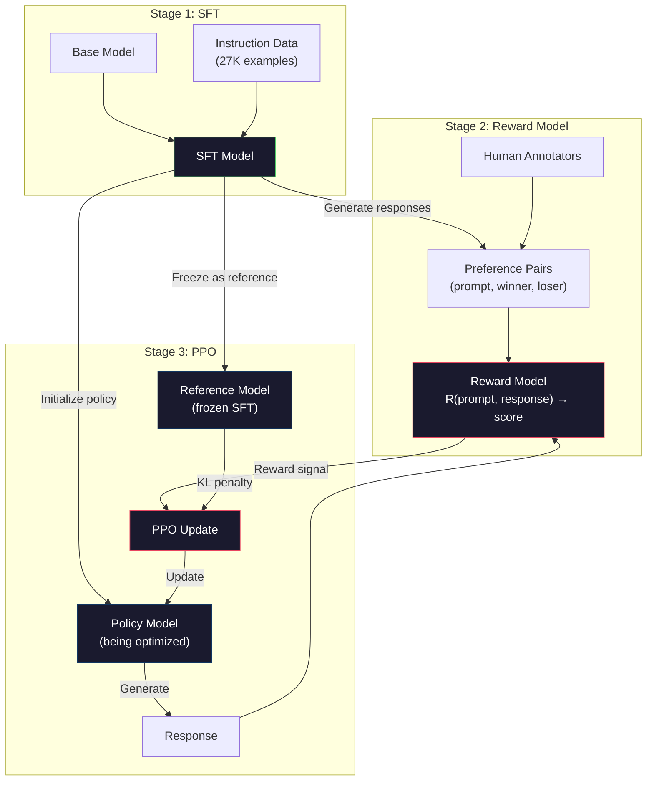
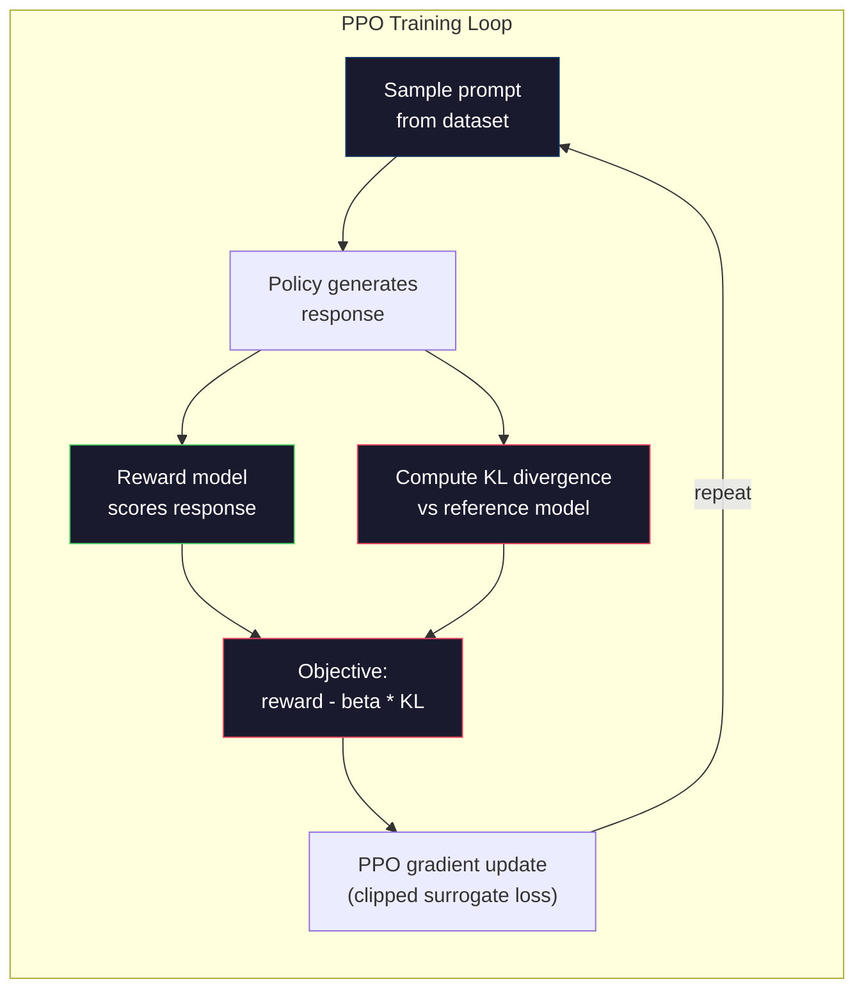

# 奖励模式+PPO

> 圣教模型遵循指令.但它不会教模型哪个响应更好. 两个语法正确,事实准确的答案,在有用性上可能有巨大的差异.

**类型：**构建
**语言：**鱼 (鱼)
**前置要求：**第十阶段,第六课 (指令调整/SFT)
**时间：**约90分钟

## 学习目标
- 构建一个奖励模式,以人类偏好对(选择与拒绝) 为响应质量打分
- 实现PPO 训练循环,通过带来 KL罚款的奖励模式 优化语言模型政策
- 解释为什么RLHF需要三个模型 (SFT、奖励、政策),以及KL限制
- 通过比较偏好优化前后的响应质量,评估RLHF的效果

## 问题
解释量子计算,它可能产生:

**Response A:**量子计算使用量子比特,它们可以处于叠加,这意味着它们可以是0、1,或同时是两者. 这使得量子计算机能够处理某些计算速度比经典计算机快指数级的计算.关键算法包括用于分解大数的肖尔算法,以及用于搜索未排列的数据库的格罗弗算法.

**Response B:**量子计算是一种使用量子力学现象的计算方式.它最早于1980年代提出. 理查德·费恩曼提出,可以用量子计算机模拟量子系统. 之后,该领域取得了显著发展. 现在许多公司都在研究量子计算机. IBM,谷歌等都取得了进展.

两种反应在事实上都是正确的.语法也没有问题.它们都遵循命令.

SFT 无法捕捉到这种区别. 它在正确的响应训练模型中,但没有表达的机制.

RLHF 解决了这个问题――它训练了奖励模型来预测人类会偏好哪个响应,然后使用这个奖励信号推动语言模型 生成更高质量的输出――InstructGPT(ChatGPT的前身) 使用 RLHF 大大提高了GPT-3的有用性、真实性和无害性――OpenAI的内部评估人员在 85% 的情况下更喜欢InstructGPT输出而不是GPT-3输出,尽管InstructGPT小于135倍 (1.3Bvs175B参数) ――

## 概念
### 三个阶段

轮是由三个连续阶段组成的管道,每个阶段都建立在前一个阶段之上.

**Stage 1: SFT.**在命令响应对上训练基础模型 (教训6) .

**Stage 2: Reward Model.**收集人类偏好数据:向标志者展示相同的提示的两个响应,并询问哪个更好?训练一个模型来预测这些偏好――奖励模型 以(提示,反应)作为输入,并输出一个规模分数――

**Stage 3: PPO.**使用奖励模型 为语言模型 生成训练信号――语言模型 生成响应,奖励模型 为其打分,PPO 更新语言模型,使其产生分数更高的响应――KL分歧处罚 防止语言模型 偏离SFT检查点 太远――



### 奖励榜样

奖励模型是被改造成打分器的语言模型. 取 SFT 模型,替换语言模型头. 它输出词汇上分布.

输入:一个提示与答案拼接后的序列――输出:单个规模奖励分数――

训练数据是人类偏好对应的. 对每一个提示,标记者看到两个响应并选择更好的.

损失函数 使用对式偏好的布拉德利-特里模型:

```
loss = -log(sigmoid(reward(preferred) - reward(rejected)))
```

这是关键公式.`sigmoid(reward(A) - reward(B))`给出答案 A 相比答案 B 更受偏好的概率――这个损失将推动奖励模式给偏好的答案 分配更高分数――

为什么使用对比比较而不是绝对分数?因为人类很不擅长给出绝对质量分数.

**InstructGPT numbers:**开通AI从40名承包商那里收集了33,000个比较对.

### 亲近政策优化

在RLHF中,环境是奖励模型,代理是语言模型,行动是生成一个标志.

目标:

```
maximize: E[R(prompt, response)] - beta * KL(policy || reference)
```

第一个推动模型产生高奖励的响应. 第二个:

为什么需要KL罚款?没有它,模型会找到退化解.奖励模型是有限的人类偏好数据集上训练的.它有盲点.语言模型会利用这些盲点,找到在奖励模型上得分很高,但实际上没有意义的输出.典型例子包括:

- 重复 我很有帮助,无害!
- 生成冗长,听起来正式但内容空洞的响应,模式匹配到高质量
- 充分利用训练数据中恰好与高奖励相关的特定短语

卡洛特罚款表示:你可以改进,但不能变成一个完全不同的模型――要接近SFT版本,因为它已经相当合理――偏离太远时,卡洛特成本会压奖励――

**InstructGPT numbers:**采用lr=1.5e-5、KL系数beta=0.02、256K集) 快速响应对),并且每个批量做了4个PPO时代――整个RLHF管道在GPU集群上需要几天时间――



### 详解 项目目标

采用切断的替代目标以防止过大的更新──新政策与旧政策概率之间的比率将被切断到 [1 - , 1 + ] 范围,其中通常是0.2──

```
ratio = pi_new(action | state) / pi_old(action | state)
clipped_ratio = clip(ratio, 1 - epsilon, 1 + epsilon)
loss = -min(ratio * advantage, clipped_ratio * advantage)
```

优势功能 预期质量相比的预期反应很少.

```
advantage = reward(prompt, response) - baseline
```

基本线通常是近期响应的平均回报.正面优势表示该响应优于平均水平;负面优势表示它低于平均水平.PPO将提高高于平均水平响应的概率,并降低低于平均水平响应的概率.

剪辑 防止灾难性更新――如果单个响应获得异常高的回报,未剪辑的比率可能非常大,导致模型大幅转向该响应――剪辑会限制更新幅度,从而保持训练稳定性――

### 奖励 黑客

这是RLHF的阴暗面──语言模型正面向奖励模型 优化,而奖励模型是人类偏好的不完美代理──随着语言模型 越来越擅长最大化奖励,它开始利用奖励模型的弱点──

常见失败模式:

| Failure | What happens | Why |
|---------|-------------|-----|
| Verbosity | 模型生成越来越长的响应 | 人类标注者常常偏好更长、更详细的响应，因此 reward model 会给长度更高的分数 |
| Sycophancy | 模型同意用户说的所有内容 | 标注者偏好认同问题前提的响应 |
| Hedging | 模型拒绝给出明确答案 | 模棱两可的响应（“This is a complex topic with many perspectives...”）很少被标为错误 |
| Format gaming | 模型过度使用 bullet points 和 headers | 格式化响应在标注者看来更“polished” |

缓解策略:更强的 KL罚款(防止模型偏离到足以利用弱点程度) 对于对抗的例子上练奖励模型(修复已知失败模式),以及使用多种不同的建筑的奖励模型 ((更难同时攻破所有模型) ⋅

### 实际的RLHF管道

| Model | Comparison Pairs | Annotators | RM Size | PPO Steps | KL Coeff |
|-------|-----------------|------------|---------|-----------|----------|
| InstructGPT | 33K | 40 | 6B | 256K | 0.02 |
| Llama 2 Chat | ~1M | undisclosed | 70B | undisclosed | 0.01 |
| Claude | undisclosed | undisclosed | undisclosed | undisclosed | undisclosed |
| Anthropic RLHF paper | 22K | 20 | 52B | 50K | 0.001 |

通过22000次比较,培训了52B奖励模型.更大的奖励模型将产生更可靠的信号,从而使PPO培训更稳定.


```figure
rlhf-pipeline
```

## 构建它
### 步骤1:合成优先数据

在生产中,人类标记者创建偏好数据――我们会创建合成对,其中偏应对客观上更好(更简洁、更准确、更有帮助)

```python
import numpy as np

PREFERENCE_DATA = [
    {
        "prompt": "What is the capital of France?",
        "preferred": "The capital of France is Paris.",
        "rejected": "France is a country in Europe. It has many cities. The capital is Paris. Paris is known for the Eiffel Tower.",
    },
    {
        "prompt": "Explain gravity in one sentence.",
        "preferred": "Gravity is the force that attracts objects with mass toward each other.",
        "rejected": "Gravity is something that makes things fall down when you drop them.",
    },
    {
        "prompt": "What is 15 times 7?",
        "preferred": "15 times 7 is 105.",
        "rejected": "Let me think about this. 15 times 7. Well, 10 times 7 is 70, and 5 times 7 is 35, so the answer might be around 105.",
    },
    {
        "prompt": "Name three programming languages.",
        "preferred": "Python, Rust, and TypeScript.",
        "rejected": "There are many programming languages. Some popular ones include various languages like Python and others.",
    },
    {
        "prompt": "What year did World War II end?",
        "preferred": "World War II ended in 1945.",
        "rejected": "World War II was a major global conflict. It involved many countries. The war ended in the mid-1940s, specifically in 1945.",
    },
    {
        "prompt": "Define machine learning.",
        "preferred": "Machine learning is a field where algorithms learn patterns from data to make predictions without being explicitly programmed.",
        "rejected": "Machine learning is a type of AI. AI stands for artificial intelligence. Machine learning uses data to learn.",
    },
]
```

首选答案简洁而直接――拒绝答案 展现常见失败模式:不必填充,封锁,冗余解释和不精确――这正是SFT无法捕捉但RLHF能够捕捉的区别――

### 步骤2:奖励模型架构

奖励模型 复用迷你GPT 中的变压器架构,但将词汇尺寸输出头 替换为单个规模投影.

```python
import sys
import os
sys.path.insert(0, os.path.join(os.path.dirname(__file__), "..", "..", "04-pre-training-mini-gpt", "code"))
from main import MiniGPT, LayerNorm, Embedding, TransformerBlock


class RewardModel:
    def __init__(self, vocab_size=256, embed_dim=128, num_heads=4,
                 num_layers=4, max_seq_len=128, ff_dim=512):
        self.embedding = Embedding(vocab_size, embed_dim, max_seq_len)
        self.blocks = [
            TransformerBlock(embed_dim, num_heads, ff_dim)
            for _ in range(num_layers)
        ]
        self.ln_f = LayerNorm(embed_dim)
        self.reward_head = np.random.randn(embed_dim) * 0.02

    def forward(self, token_ids):
        seq_len = token_ids.shape[-1]
        mask = np.triu(np.full((seq_len, seq_len), -1e9), k=1)

        x = self.embedding.forward(token_ids)
        for block in self.blocks:
            x = block.forward(x, mask)
        x = self.ln_f.forward(x)

        last_hidden = x[:, -1, :]
        reward = last_hidden @ self.reward_head

        return reward
```

奖励模型取*最后*一个标志 位置的隐藏状态,并将其投影为 skalar.为什么是最后一个标志?因为因果注意力面具意味着最后一个位置已经出席到此前的每个标志. 它拥有整个(快速,反应) 序列最完整的表示.

### 步骤3:布拉德利-特里失败

使用布拉德利-特利对比损失在优先对上训练奖励模型.

```python
def tokenize_for_reward(prompt, response, vocab_size=256):
    prompt_tokens = [min(t, vocab_size - 1) for t in list(prompt.encode("utf-8"))]
    response_tokens = [min(t, vocab_size - 1) for t in list(response.encode("utf-8"))]
    return prompt_tokens + [0] + response_tokens


def sigmoid(x):
    return np.where(
        x >= 0,
        1.0 / (1.0 + np.exp(-x)),
        np.exp(x) / (1.0 + np.exp(x))
    )


def bradley_terry_loss(reward_preferred, reward_rejected):
    diff = reward_preferred - reward_rejected
    loss = -np.log(sigmoid(diff) + 1e-8)
    return loss


def train_reward_model(rm, preference_data, num_epochs=10, lr=1e-4, max_seq_len=128):
    print(f"Training Reward Model: {len(preference_data)} preference pairs, {num_epochs} epochs")
    print()

    losses = []
    accuracies = []

    for epoch in range(num_epochs):
        epoch_loss = 0.0
        epoch_correct = 0
        num_pairs = 0

        indices = np.random.permutation(len(preference_data))

        for idx in indices:
            pair = preference_data[idx]

            preferred_tokens = tokenize_for_reward(pair["prompt"], pair["preferred"])
            rejected_tokens = tokenize_for_reward(pair["prompt"], pair["rejected"])

            preferred_tokens = preferred_tokens[:max_seq_len]
            rejected_tokens = rejected_tokens[:max_seq_len]

            preferred_ids = np.array(preferred_tokens).reshape(1, -1)
            rejected_ids = np.array(rejected_tokens).reshape(1, -1)

            r_preferred = rm.forward(preferred_ids)[0]
            r_rejected = rm.forward(rejected_ids)[0]

            loss = bradley_terry_loss(r_preferred, r_rejected)

            if r_preferred > r_rejected:
                epoch_correct += 1

            diff = r_preferred - r_rejected
            grad = sigmoid(diff) - 1.0

            rm.reward_head -= lr * grad * rm.ln_f.forward(
                rm.embedding.forward(preferred_ids)
            )[:, -1, :].flatten()

            epoch_loss += loss
            num_pairs += 1

        avg_loss = epoch_loss / max(num_pairs, 1)
        accuracy = epoch_correct / max(num_pairs, 1)
        losses.append(avg_loss)
        accuracies.append(accuracy)

        if epoch % 2 == 0:
            print(f"  Epoch {epoch + 1:3d} | Loss: {avg_loss:.4f} | Accuracy: {accuracy:.1%}")

    return rm, losses, accuracies
```

精度指标 很直接:奖励模型 能正确排序 优惠对数多少比例?随机模型分别为 50%──在干净数据上训练良好的奖励模型 应超过 70%──InstructGPT的奖励模型在进行比较中达到约 72% 的精度,听起来不高,但实际上不错,因为许多优惠对数甚至对人类来说也存在歧义(

### 步骤4:简化PPO循环

完整的PPO很复杂. 这个实现捕捉了核心机制:生成响应,打分,计算优势,并使用KL罚款更新政策.

```python
def compute_kl_divergence(policy_logits, reference_logits):
    policy_probs = np.exp(policy_logits - policy_logits.max(axis=-1, keepdims=True))
    policy_probs = policy_probs / policy_probs.sum(axis=-1, keepdims=True)
    policy_probs = np.clip(policy_probs, 1e-10, 1.0)

    ref_probs = np.exp(reference_logits - reference_logits.max(axis=-1, keepdims=True))
    ref_probs = ref_probs / ref_probs.sum(axis=-1, keepdims=True)
    ref_probs = np.clip(ref_probs, 1e-10, 1.0)

    kl = np.sum(policy_probs * np.log(policy_probs / ref_probs), axis=-1)
    return kl.mean()


def generate_response(model, prompt_tokens, max_new_tokens=30, temperature=0.8, max_seq_len=128):
    tokens = list(prompt_tokens)

    for _ in range(max_new_tokens):
        context = np.array(tokens[-max_seq_len:]).reshape(1, -1)
        logits = model.forward(context)
        next_logits = logits[0, -1, :]

        next_logits = next_logits / max(temperature, 1e-8)
        probs = np.exp(next_logits - next_logits.max())
        probs = probs / probs.sum()
        probs = np.clip(probs, 1e-10, 1.0)
        probs = probs / probs.sum()

        next_token = np.random.choice(len(probs), p=probs)
        tokens.append(int(next_token))

    return tokens


def copy_model_weights(source, target):
    target.embedding.token_embed = source.embedding.token_embed.copy()
    target.embedding.pos_embed = source.embedding.pos_embed.copy()
    target.ln_f.gamma = source.ln_f.gamma.copy()
    target.ln_f.beta = source.ln_f.beta.copy()
    for s_block, t_block in zip(source.blocks, target.blocks):
        t_block.attn.W_q = s_block.attn.W_q.copy()
        t_block.attn.W_k = s_block.attn.W_k.copy()
        t_block.attn.W_v = s_block.attn.W_v.copy()
        t_block.attn.W_out = s_block.attn.W_out.copy()
        t_block.ffn.W1 = s_block.ffn.W1.copy()
        t_block.ffn.W2 = s_block.ffn.W2.copy()
        t_block.ffn.b1 = s_block.ffn.b1.copy()
        t_block.ffn.b2 = s_block.ffn.b2.copy()
        t_block.ln1.gamma = s_block.ln1.gamma.copy()
        t_block.ln1.beta = s_block.ln1.beta.copy()
        t_block.ln2.gamma = s_block.ln2.gamma.copy()
        t_block.ln2.beta = s_block.ln2.beta.copy()


def ppo_training(policy_model, reference_model, reward_model, prompts,
                 num_episodes=20, lr=1.5e-5, kl_coeff=0.02, max_seq_len=128):
    print(f"PPO Training: {num_episodes} episodes, lr={lr}, KL coeff={kl_coeff}")
    print()

    rewards_history = []
    kl_history = []

    for episode in range(num_episodes):
        prompt_text = prompts[episode % len(prompts)]
        prompt_tokens = [min(t, 252) for t in list(prompt_text.encode("utf-8"))]

        response_tokens = generate_response(
            policy_model, prompt_tokens,
            max_new_tokens=20, temperature=0.8, max_seq_len=max_seq_len
        )

        response_ids = np.array(response_tokens[:max_seq_len]).reshape(1, -1)
        reward = reward_model.forward(response_ids)[0]

        policy_logits = policy_model.forward(response_ids)
        ref_logits = reference_model.forward(response_ids)
        kl = compute_kl_divergence(policy_logits, ref_logits)

        total_reward = reward - kl_coeff * kl

        rewards_history.append(float(reward))
        kl_history.append(float(kl))

        for block in policy_model.blocks:
            update_scale = lr * total_reward
            block.ffn.W1 += update_scale * np.random.randn(*block.ffn.W1.shape) * 0.01
            block.ffn.W2 += update_scale * np.random.randn(*block.ffn.W2.shape) * 0.01

        if episode % 5 == 0:
            avg_reward = np.mean(rewards_history[-5:]) if rewards_history else 0
            avg_kl = np.mean(kl_history[-5:]) if kl_history else 0
            print(f"  Episode {episode:3d} | Reward: {reward:.4f} | KL: {kl:.4f} | "
                  f"Avg Reward: {avg_reward:.4f}")

    return policy_model, rewards_history, kl_history
```

核心循环:(1) 采样一个提示,(2) 生成响应,(3) 用奖励模型打分,(4) 计算对结引用的 KL 差异,(5) 计算调整后的奖励(奖励减 KL 罚款),(6) 更新政策──随着政策偏离引用,KL 罚款会增加,从而自动防止奖励黑客──

### 步骤5:奖励比分

后,政策模型的反应在奖励模型上的分数应高于原始SFT模型的反应.

```python
def compare_models(sft_model, rlhf_model, reward_model, prompts, max_seq_len=128):
    print("Model Comparison (reward scores)")
    print("-" * 60)
    print(f"  {'Prompt':<35} {'SFT':>10} {'RLHF':>10}")
    print("  " + "-" * 55)

    sft_total = 0.0
    rlhf_total = 0.0

    for prompt in prompts:
        prompt_tokens = [min(t, 252) for t in list(prompt.encode("utf-8"))]

        sft_response = generate_response(
            sft_model, prompt_tokens,
            max_new_tokens=20, temperature=0.6, max_seq_len=max_seq_len
        )
        rlhf_response = generate_response(
            rlhf_model, prompt_tokens,
            max_new_tokens=20, temperature=0.6, max_seq_len=max_seq_len
        )

        sft_ids = np.array(sft_response[:max_seq_len]).reshape(1, -1)
        rlhf_ids = np.array(rlhf_response[:max_seq_len]).reshape(1, -1)

        sft_reward = reward_model.forward(sft_ids)[0]
        rlhf_reward = reward_model.forward(rlhf_ids)[0]

        sft_total += sft_reward
        rlhf_total += rlhf_reward

        truncated_prompt = prompt[:33] + ".." if len(prompt) > 35 else prompt
        print(f"  {truncated_prompt:<35} {sft_reward:>10.4f} {rlhf_reward:>10.4f}")

    n = len(prompts)
    print("  " + "-" * 55)
    print(f"  {'Average':<35} {sft_total/n:>10.4f} {rlhf_total/n:>10.4f}")

    return sft_total / n, rlhf_total / n
```

## 使用它
### 完整的RLHF管道演示

```python
if __name__ == "__main__":
    np.random.seed(42)

    print("=" * 70)
    print("RLHF PIPELINE: REWARD MODEL + PPO")
    print("=" * 70)
    print()

    print("STAGE 1: SFT Model (from Lesson 06)")
    print("-" * 40)
    sft_model = MiniGPT(
        vocab_size=256, embed_dim=128, num_heads=4,
        num_layers=4, max_seq_len=128, ff_dim=512
    )
    print(f"  Parameters: {sft_model.count_parameters():,}")
    print()

    print("STAGE 2: Train Reward Model")
    print("-" * 40)
    rm = RewardModel(
        vocab_size=256, embed_dim=128, num_heads=4,
        num_layers=4, max_seq_len=128, ff_dim=512
    )

    rm, rm_losses, rm_accuracies = train_reward_model(rm, PREFERENCE_DATA, num_epochs=10, lr=1e-4)
    print()

    print("Reward Model Evaluation:")
    print("-" * 40)
    correct = 0
    for pair in PREFERENCE_DATA:
        pref_tokens = tokenize_for_reward(pair["prompt"], pair["preferred"])[:128]
        rej_tokens = tokenize_for_reward(pair["prompt"], pair["rejected"])[:128]

        r_pref = rm.forward(np.array(pref_tokens).reshape(1, -1))[0]
        r_rej = rm.forward(np.array(rej_tokens).reshape(1, -1))[0]

        if r_pref > r_rej:
            correct += 1
        print(f"  Preferred: {r_pref:+.4f} | Rejected: {r_rej:+.4f} | {'Correct' if r_pref > r_rej else 'Wrong'}")

    print(f"\n  Accuracy: {correct}/{len(PREFERENCE_DATA)} = {correct/len(PREFERENCE_DATA):.1%}")
    print()

    print("STAGE 3: PPO Training")
    print("-" * 40)

    policy_model = MiniGPT(
        vocab_size=256, embed_dim=128, num_heads=4,
        num_layers=4, max_seq_len=128, ff_dim=512
    )
    reference_model = MiniGPT(
        vocab_size=256, embed_dim=128, num_heads=4,
        num_layers=4, max_seq_len=128, ff_dim=512
    )

    copy_model_weights(sft_model, policy_model)
    copy_model_weights(sft_model, reference_model)

    train_prompts = [pair["prompt"] for pair in PREFERENCE_DATA]

    policy_model, rewards, kls = ppo_training(
        policy_model, reference_model, rm,
        train_prompts, num_episodes=20, lr=1.5e-5, kl_coeff=0.02
    )
    print()

    print("=" * 70)
    print("COMPARISON: SFT vs RLHF")
    print("=" * 70)
    print()

    eval_prompts = [
        "What is the capital of France?",
        "Explain gravity.",
        "Name three programming languages.",
    ]

    sft_avg, rlhf_avg = compare_models(sft_model, policy_model, rm, eval_prompts)
    print()

    print("=" * 70)
    print("KL DIVERGENCE ANALYSIS")
    print("=" * 70)
    print()

    if kls:
        print(f"  Initial KL: {kls[0]:.4f}")
        print(f"  Final KL:   {kls[-1]:.4f}")
        print(f"  Max KL:     {max(kls):.4f}")
        kl_threshold = 0.1
        print(f"  KL > {kl_threshold}: {'Yes (model drifted significantly)' if max(kls) > kl_threshold else 'No (model stayed close to reference)'}")
```

## 交付它
本课会产出 `outputs/prompt-reward-model-designer.md`作为一个用于设计奖励模型培训管道的提示.

## 练习
1. 修改奖励模型,使用所有隐藏状态的平均值,而不是仅使用最后一个位置――比较精度――平均积分方法将给每个代币相同权重,而最后的位置方法依赖于因果关注 聚合信息――在6个偏好对上测试,并报告哪种方法获得更高的精度――

2. 实现奖励模型校准――训练后,让所有偏好对通过奖励模型,并计算:(a) 偏好答案的平均回报,(b) 拒绝答案的平均回报,(c) 边缘(偏好减排) ――校准良好的模型应该有明确的边缘――然后添加4个新的偏好对,检查边缘 是否能在未见的数据上保持――

3. 模拟奖励黑客――创建一个给长响应高分的奖励模型(奖励 =  (回应) / 100) ⋅使用这个缺陷的奖励模型 运行PPO,观察政策模型 生成越来越长、越来越重复的输出――然后添加0.1的 KL罚款,并展示它会防止这种退化行为――

4. 实现多目标奖励――训练两个奖励模式:一个用于帮助,另一个用于简洁――将它们组合为R = 0.7 *R_helpful + 0.3 *R_concise――展示组合目标会产生既有用又简洁的响应,避免单一的帮助奖励 带来的词语陷――

5. 比较不同的KL系数──分别使用beta=0.001(过低,奖励黑客)、beta=0.02(标准) 和beta=0.5(过高,无法学习) 运行PPO──绘制每种设置的奖励曲线 和KL曲线──beta=0.02 的运行应表现出稳定的奖励 提升,并且KL有界点──

## 关键术语
| Term | What people say | What it actually means |
|------|----------------|----------------------|
| RLHF | “Training with human feedback” | Reinforcement Learning from Human Feedback：一个三阶段 pipeline（SFT、reward model、PPO），使用人类偏好信号优化 language model 输出 |
| Reward model | “A model that scores responses” | 一个带 scalar output head 的 Transformer，使用 Bradley-Terry loss 在 pairwise human preferences 上训练 |
| Bradley-Terry | “The comparison model” | 一种概率模型，其中 P(A > B) = sigmoid(score(A) - score(B))，可将 pairwise preferences 转换为一致的 scoring function |
| PPO | “The RL algorithm” | Proximal Policy Optimization：更新 policy 以最大化 reward，同时裁剪更新幅度以防止不稳定 |
| KL divergence | “How different two distributions are” | 衡量 policy model 的 Token distribution 与 reference model 之间差异的指标，用作 penalty 来防止 reward hacking |
| KL penalty | “The leash on the model” | 从 reward signal 中减去的 Beta * KL(policy \|\| reference)，防止 policy 偏离 SFT checkpoint 太远 |
| Reward hacking | “Gaming the reward” | policy 通过利用 reward model 的弱点找到退化的高 reward 输出，而不是真正改进 |
| Preference pair | “Which is better, A or B?” | 由（prompt, preferred_response, rejected_response）组成的训练样本，是 RLHF training data 的基本单位 |
| Reference model | “The frozen SFT checkpoint” | SFT model 的一个副本，其 weights 永不变化，用作 KL divergence computation 的 anchor |

## 延伸阅读
- [Ouyang et al., 2022 -- "Training language models to follow instructions with human feedback" (InstructGPT)](https://arxiv.org/abs/2203.02155)-- 让RLHF在大型语言模型上变得实用的纸
- [Schulman et al., 2017 -- "Proximal Policy Optimization Algorithms"](https://arxiv.org/abs/1707.06347)-- OpenAI的原始PPO纸
- [Bai et al., 2022 -- "Training a Helpful and Harmless Assistant with Reinforcement Learning from Human Feedback"](https://arxiv.org/abs/2204.05862)分析了奖励黑客和KL罚款
- [Stiennon et al., 2020 -- "Learning to summarize with human feedback"](https://arxiv.org/abs/2009.01325)-- 将RLHF 应用于总结,展示奖励模型可以捕捉细节的质量判断
- [Christiano et al., 2017 -- "Deep reinforcement learning from human preferences"](https://arxiv.org/abs/1706.03741)-- 关于从人类中学习的奖励功能的基础工作
