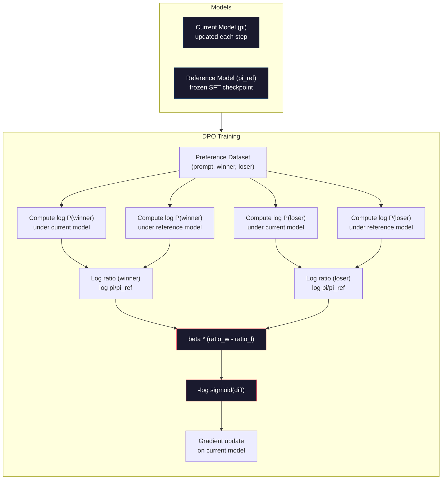

# 直接优先优化

> 虽然RLHF有效果──但它也需要训练三个模型──SFT、奖励模型、政策),管理PPO的不稳定性,并调节 KL罚款──DPO 会问:如果你能跳过这一切呢?DPO 直接在偏好对上优化语言模型──不需要奖励模型──不需要PPO──一个训练循环──相同的结果──

**Type:** Build
**Languages:** Python (with numpy)
**Prerequisites:** Phase 10, Lesson 07 (RLHF)
**Time:** ~90 分钟

## 学习目标
- 实现DPO培训,直接在偏好对上优化语言模型,而不使用单独的奖励模型
- 推导DPO损失函数,并解释它如何通过政策的记录概率 隐式表示奖励模型
- 从训练稳定性,计算成本和需要模型数量角度来看,比较DPO与RLHF
- 调节beta参数,控制训练后的政策 偏离参考模型的程度

## 问题
你在07课中构建了一个RLHF管道――三个阶段――三个模型――SFT模型、奖励模型,以及使用PPO 优化政策模型――仅需要数千个个人类偏好对和一个单独的培训循环――PPO 需要仔细调节KL系数、学习率、剪辑比和时代数量――

在实践中,PPO训练以不稳定名义――很小的超参数变化就可能导致训练发散――奖励模型是人类偏好的不完美代理,而政策将找到利用其弱点的方式――KL惩罚有帮助,但它本身也需要调节:太低会导致奖励黑客,太高则模型几乎学不到东西――

这种复杂性解释了为什么在InstructGPT发布后的多年里,大多数开源模型都很难使用RLHF――三阶段管道很脆弱――每个阶段都有自己的故障模式,并且错误会叠加――

2023年5月,斯坦福大学的拉斐尔·拉斐尔·拉菲洛夫、阿奇特·夏马及其同事发表了"直接偏好优化:你的语言模型是秘密的奖励模型──核心洞见是:你不需要单独的奖励模型──最优的奖励功能 在数学上由语言模型本身的代币概率决定──你可以完全跳过奖励模型,直接在偏好对上上优化语言模型──

比尔-7B是最早的大规模使用 DPO 的模型之一,在多个基准中上追平或超过了使用完整的 RLHF 训练模型. 在Llama 3 的配线管道中,Meta 已经使用 DPO 比尔. 在其配线研究中也提到过 DPO 风格的方法.

## 概念
### 关键的见解

优化这个目标:

```
maximize: E[R(x, y)] - beta * KL(pi || pi_ref)
```

其中R是奖励模型,pi是政策,pi_ref是参考模型,beta是KL系数──

证明,这个目标存在于闭式最优解――对于任意的奖励函数R,最优政策是:

```
pi*(y | x) = pi_ref(y | x) * exp(R(x, y) / beta) / Z(x)
```

其中,Z(x) 是归纳常数.

```
R(x, y) = beta * log(pi*(y | x) / pi_ref(y | x)) + beta * log Z(x)
```

这就是突破点. 奖励 完全使用政策模型的概率和参考模型的概率来表达.

取代了布拉德利-特里偏好模式:

```
P(y_w > y_l | x) = sigmoid(R(x, y_w) - R(x, y_l))
                  = sigmoid(beta * (log pi(y_w|x)/pi_ref(y_w|x) - log pi(y_l|x)/pi_ref(y_l|x)))
```

由于两个答案都以同一个提示 x 为条件――下面仅仅是政策模型和参考模型 在优先和拒绝答案上的日志概率函数――

### 局的损失

```
L_DPO = -log(sigmoid(beta * (log pi(y_w|x)/pi_ref(y_w|x) - log pi(y_l|x)/pi_ref(y_l|x))))
```

我们拆解了每一部分:

- **y_w**= 首选的答案
- **y_l**= 拒绝了
- **x**快速
- **pi**现在的模型 (正在训练)
- **pi_ref**= 参考模型 (结的SFT检查站)
- **beta**控制偏离参考温度 参数(通常为0.1~0.5)

比值`log pi(y|x) / pi_ref(y|x)`当这个比率为正时,当前模型赋予反应的概率高于参考时,当它为负时,当前模型赋予的概率更低.

通过测试,测试结果的数据可被测到,可在测试结果中得到更大的数据.



### 为什么DPO更简单

| Aspect | RLHF (PPO) | DPO |
|--------|-----------|-----|
| 需要训练的模型 | 3（SFT + reward + policy） | 1（仅 policy） |
| Training loops | 3（SFT、RM training、PPO） | 2（SFT、DPO） |
| Hyperparameters | lr、KL coeff、clip ratio、RM lr、epochs x3 | lr、beta、epochs |
| Reward model | 必需（单独训练） | 隐式存在于模型概率中 |
| RL algorithm | PPO（复杂、不稳定） | Supervised learning（稳定） |
| GPU memory | PPO 期间内存中有 3-4 个模型 | 2 个模型（current + reference） |
| 训练稳定性 | 对 hyperparameters 敏感 | 稳健，类似 SFT |

对于70B模型,每副本在FP16下需要140GB──除掉带来的内存节省非常可观──

### 当DPO超过RLHF时

**小数据集。**在5000到20,000个优先对的规模下,DPO通常可以追赶或超过RLHF.

**计算资源有限。**对于没有大型GPU集群的团队来说,这是更实际的选择.

**快速迭代。**想尝试10个不同的偏好数据集,看看哪个可以产生最佳模型?DPO 让你能在几小时内完成每个实验.

### 当RLHF超过DPO时

**大规模训练。**在GPT-4或Claude的规模上,RLHF的单独奖励模型可以捕捉更细节的偏好信号.

**复杂 reward signals。**当更好涉及多个维度 (益性,无害性,诚实) 时,奖励模型可以学习这种多目标权衡――DPO将每个偏好对视为二元信号:一个更好,一个更差,而不会建模原因――

**迭代式 alignment。**通过RLHF管道可以使用当前的政策产生新反应,让人类评分,然后在线循环中重新训练奖励模型――DPO作用于固定的偏好对数据集――宪法AI(人类方法) 大量使用了RLHF的这种代特性――

### 其他:KTO,ORPO,SimPO

简化调整方法.

**KTO (Kahneman-Tversky Optimization, 2024)：**你甚至不需要对数据进行分析.使用未配对反:只需将每个答案标记为好或坏,而无需将其与另一个替代项进行比较. 这大大简化了数据收集.不是向标记者展示两个答案并询问哪个更好?,而是展示一个答案并询问这是好吗?损失函数 应用前景理论中的损失恶性:受到了惩罚的坏答案比受到了好答案的奖励.

**ORPO (Odds Ratio Preference Optimization, 2024)：**将 SFT 和对齐合并 合并到一个训练步骤中.ORPO 不是先做 SFT 再做 DPO,而是修改 SFT Loss,使其包含偏好信号.该 Loss 有两项:偏好反应 上的标准下一个代币预测损失,加上一个机会比率,用于增加偏好和拒绝反应的概率之间的差距.

**SimPO (Simple Preference Optimization, 2024)：**完全取消参考模型──SIMPO 不再针对结的参考 计算日志概率比,而是使用响应的平均日志概率──按长度归结) 作为隐式回报──这省内存──不需要参考模型──并简化训练──长度归结防止模型偏好更短的响应──

| Method | Year | Models in Memory | Needs Pairs? | Needs Reference? | Training Loops |
|--------|------|-----------------|-------------|-----------------|----------------|
| RLHF | 2022 | 3-4 | Yes（用于 RM） | Yes | 3 |
| DPO | 2023 | 2 | Yes | Yes | 2 |
| KTO | 2024 | 2 | No（未配对） | Yes | 2 |
| ORPO | 2024 | 1 | Yes | No | 1 |
| SimPO | 2024 | 1 | Yes | No | 1 |

趋势很清楚:每种方法都消除了部分复杂性――RLHF 需要奖励模型 和 PPO――DPO 消除了二者――KTO 消除了成对数据――ORPO 消除了单独的SFT 阶段――SIMPO 消除了参考模型――结合税,即从基本模型到结合模型所需的计算和复杂性成本正在持续下降――

### 实际的DPO部署

**Zephyr-7B (HuggingFace, October 2023)：**以Mistral 7B基础为基础,在UltraChat (200K例) 上做SFT,然后在UltraFeedback (60K偏好对) 上做DPO. 在MT-Bench上得分6.47,是当时最高的7B模型.

**Llama 3 (Meta, April 2024)：**在初始RLHF阶段之后使用DPO.这种组合表明DPO和RLHF可以互补:RLHF用于广泛的配线,DPO用于有针对性的改进.

**Neural Magic / nm-chat (2024)：**将DPO应用于多个开源模型,并稳定地显示出相对的仅SFT基线在对齐基准上5-15%的提升.


```figure
dpo-loss
```

## 构建它
### 步骤1: 首选数据集

与RLHF 使用相同格式:(快速,优先,拒绝) 三元组──DPO 直接消费这些数据,不需要中间的奖励模式──

```python
import numpy as np
import sys
import os
sys.path.insert(0, os.path.join(os.path.dirname(__file__), "..", "..", "04-pre-training-mini-gpt", "code"))
from main import MiniGPT, LayerNorm, Embedding, TransformerBlock

PREFERENCE_DATA = [
    {
        "prompt": "What is the capital of France?",
        "preferred": "The capital of France is Paris.",
        "rejected": "France is a country in Europe. It has many cities. The capital is Paris. Paris is known for the Eiffel Tower.",
    },
    {
        "prompt": "Explain gravity in one sentence.",
        "preferred": "Gravity is the force that attracts objects with mass toward each other.",
        "rejected": "Gravity is something that makes things fall down when you drop them.",
    },
    {
        "prompt": "What is 15 times 7?",
        "preferred": "15 times 7 is 105.",
        "rejected": "Let me think about this. 15 times 7. Well, 10 times 7 is 70, and 5 times 7 is 35, so the answer might be around 105.",
    },
    {
        "prompt": "Name three programming languages.",
        "preferred": "Python, Rust, and TypeScript.",
        "rejected": "There are many programming languages. Some popular ones include various languages like Python and others.",
    },
    {
        "prompt": "What year did World War II end?",
        "preferred": "World War II ended in 1945.",
        "rejected": "World War II was a major global conflict. It involved many countries. The war ended in the mid-1940s, specifically in 1945.",
    },
    {
        "prompt": "Define machine learning.",
        "preferred": "Machine learning is a field where algorithms learn patterns from data to make predictions without being explicitly programmed.",
        "rejected": "Machine learning is a type of AI. AI stands for artificial intelligence. Machine learning uses data to learn.",
    },
]
```

### 步骤 2:序列记录概率

需要计算给定提示时某个响应的总日记概率. 这意味着要在完整的(快速+响应) 序列上运行模型,并对每个响应代币的日记概率求和.

```python
def tokenize_sequence(text, vocab_size=256):
    return [min(t, vocab_size - 1) for t in list(text.encode("utf-8"))]


def compute_sequence_log_prob(model, prompt_tokens, response_tokens, max_seq_len=128):
    full_sequence = prompt_tokens + response_tokens
    if len(full_sequence) > max_seq_len:
        full_sequence = full_sequence[:max_seq_len]

    if len(full_sequence) < 2:
        return 0.0

    input_ids = np.array(full_sequence[:-1]).reshape(1, -1)
    target_ids = np.array(full_sequence[1:])

    logits = model.forward(input_ids)
    logits = logits[0]

    max_logits = logits.max(axis=-1, keepdims=True)
    log_probs = logits - max_logits - np.log(
        np.exp(logits - max_logits).sum(axis=-1, keepdims=True)
    )

    prompt_len = len(prompt_tokens)
    response_start = max(0, prompt_len - 1)
    response_end = len(target_ids)

    if response_start >= response_end:
        return 0.0

    response_log_probs = log_probs[response_start:response_end, :]
    response_targets = target_ids[response_start:response_end]

    total_log_prob = 0.0
    for i, target in enumerate(response_targets):
        total_log_prob += response_log_probs[i, target]

    return total_log_prob
```

这个函数是DPO的核心工具.对于每个偏好对,它会运行四次:模型计算优先响应,模型计算拒绝响应,参考计算优先响应,参考计算拒绝响应――也就是每个训练例子4次前进通过;相比之下,RLHF 需要生成+奖励分数+价值估计+PPO更新――更简单,更快,更稳定――

### 步骤3: 投资者损失

论文核心用代码表示──一个函数──一个损失──不需要奖励模型──

```python
def sigmoid(x):
    return np.where(
        x >= 0,
        1.0 / (1.0 + np.exp(-x)),
        np.exp(x) / (1.0 + np.exp(x))
    )


def dpo_loss(policy_logprob_preferred, policy_logprob_rejected,
             ref_logprob_preferred, ref_logprob_rejected, beta=0.1):
    preferred_ratio = policy_logprob_preferred - ref_logprob_preferred
    rejected_ratio = policy_logprob_rejected - ref_logprob_rejected

    logit = beta * (preferred_ratio - rejected_ratio)

    loss = -np.log(sigmoid(logit) + 1e-8)

    preferred_reward = beta * preferred_ratio
    rejected_reward = beta * rejected_ratio

    return loss, {
        "preferred_ratio": float(preferred_ratio),
        "rejected_ratio": float(rejected_ratio),
        "logit": float(logit),
        "implicit_preferred_reward": float(preferred_reward),
        "implicit_rejected_reward": float(rejected_reward),
        "reward_margin": float(preferred_reward - rejected_reward),
    }
```

`preferred_ratio`和 `rejected_ratio`是DPO推导中的日志概率比率――当前模型 (当前模型) 与参考相比) 为优先反应 分配更高概率,并为拒绝反应 分配更低概率时,逻辑为正,损失较低――训练信号正是把模型推向这个方向――

`implicit_preferred_reward`和 `implicit_rejected_reward`们可以利用这些奖励来验证训练是否有效: 优惠和拒绝奖励之间的差距应该在训练过程中增加.

### 步骤4: 防务部培训循环

没有PPO,没有奖励模式,只有前进通过和梯度更新.

```python
def copy_model_weights(source, target):
    target.embedding.token_embed = source.embedding.token_embed.copy()
    target.embedding.pos_embed = source.embedding.pos_embed.copy()
    target.ln_f.gamma = source.ln_f.gamma.copy()
    target.ln_f.beta = source.ln_f.beta.copy()
    for s_block, t_block in zip(source.blocks, target.blocks):
        t_block.attn.W_q = s_block.attn.W_q.copy()
        t_block.attn.W_k = s_block.attn.W_k.copy()
        t_block.attn.W_v = s_block.attn.W_v.copy()
        t_block.attn.W_out = s_block.attn.W_out.copy()
        t_block.ffn.W1 = s_block.ffn.W1.copy()
        t_block.ffn.W2 = s_block.ffn.W2.copy()
        t_block.ffn.b1 = s_block.ffn.b1.copy()
        t_block.ffn.b2 = s_block.ffn.b2.copy()
        t_block.ln1.gamma = s_block.ln1.gamma.copy()
        t_block.ln1.beta = s_block.ln1.beta.copy()
        t_block.ln2.gamma = s_block.ln2.gamma.copy()
        t_block.ln2.beta = s_block.ln2.beta.copy()


def dpo_train(policy_model, reference_model, preference_data,
              num_epochs=5, lr=5e-6, beta=0.1, max_seq_len=128):
    print(f"DPO Training: {len(preference_data)} pairs, {num_epochs} epochs, "
          f"lr={lr}, beta={beta}")
    print()

    losses = []
    margins = []

    for epoch in range(num_epochs):
        epoch_loss = 0.0
        epoch_margin = 0.0
        num_examples = 0

        indices = np.random.permutation(len(preference_data))

        for idx in indices:
            pair = preference_data[idx]

            prompt_tokens = tokenize_sequence(pair["prompt"])
            preferred_tokens = tokenize_sequence(pair["preferred"])
            rejected_tokens = tokenize_sequence(pair["rejected"])

            pi_logprob_w = compute_sequence_log_prob(
                policy_model, prompt_tokens, preferred_tokens, max_seq_len
            )
            pi_logprob_l = compute_sequence_log_prob(
                policy_model, prompt_tokens, rejected_tokens, max_seq_len
            )
            ref_logprob_w = compute_sequence_log_prob(
                reference_model, prompt_tokens, preferred_tokens, max_seq_len
            )
            ref_logprob_l = compute_sequence_log_prob(
                reference_model, prompt_tokens, rejected_tokens, max_seq_len
            )

            loss, metrics = dpo_loss(
                pi_logprob_w, pi_logprob_l,
                ref_logprob_w, ref_logprob_l, beta
            )

            update_direction = 1.0 if metrics["logit"] < 0 else -0.1
            for block in policy_model.blocks:
                block.ffn.W1 += lr * update_direction * np.random.randn(*block.ffn.W1.shape) * 0.01
                block.ffn.W2 += lr * update_direction * np.random.randn(*block.ffn.W2.shape) * 0.01

            epoch_loss += loss
            epoch_margin += metrics["reward_margin"]
            num_examples += 1
            losses.append(float(loss))
            margins.append(metrics["reward_margin"])

        avg_loss = epoch_loss / max(num_examples, 1)
        avg_margin = epoch_margin / max(num_examples, 1)

        print(f"  Epoch {epoch + 1}/{num_epochs} | Loss: {avg_loss:.4f} | "
              f"Avg Margin: {avg_margin:.4f}")

    return policy_model, losses, margins
```

与RLHF相比,这个训练循环简洁而令人耳目一新――对于每个偏好对:计算四个日志概率――两个模型――两个答案),将它们代入DPO损失,计算渐进,更新政策――没有生成步骤――没有奖励模型推断――没有优势估计――没有剪辑――

### 步骤5:比较DPO与RLHF

测量隐式奖励率和日志概率变化将将DPO与07课中的RLHF模型进行比较.

```python
def evaluate_preference_accuracy(model, reference_model, preference_data, beta=0.1, max_seq_len=128):
    correct = 0
    total = 0

    for pair in preference_data:
        prompt_tokens = tokenize_sequence(pair["prompt"])
        preferred_tokens = tokenize_sequence(pair["preferred"])
        rejected_tokens = tokenize_sequence(pair["rejected"])

        pi_w = compute_sequence_log_prob(model, prompt_tokens, preferred_tokens, max_seq_len)
        pi_l = compute_sequence_log_prob(model, prompt_tokens, rejected_tokens, max_seq_len)
        ref_w = compute_sequence_log_prob(reference_model, prompt_tokens, preferred_tokens, max_seq_len)
        ref_l = compute_sequence_log_prob(reference_model, prompt_tokens, rejected_tokens, max_seq_len)

        preferred_reward = beta * (pi_w - ref_w)
        rejected_reward = beta * (pi_l - ref_l)

        if preferred_reward > rejected_reward:
            correct += 1
        total += 1

    return correct / max(total, 1)


def analyze_implicit_rewards(model, reference_model, preference_data, beta=0.1, max_seq_len=128):
    print("Implicit Reward Analysis:")
    print("-" * 65)
    print(f"  {'Prompt':<30} {'Pref Reward':>12} {'Rej Reward':>12} {'Margin':>10}")
    print("  " + "-" * 60)

    for pair in preference_data:
        prompt_tokens = tokenize_sequence(pair["prompt"])
        preferred_tokens = tokenize_sequence(pair["preferred"])
        rejected_tokens = tokenize_sequence(pair["rejected"])

        pi_w = compute_sequence_log_prob(model, prompt_tokens, preferred_tokens, max_seq_len)
        pi_l = compute_sequence_log_prob(model, prompt_tokens, rejected_tokens, max_seq_len)
        ref_w = compute_sequence_log_prob(reference_model, prompt_tokens, preferred_tokens, max_seq_len)
        ref_l = compute_sequence_log_prob(reference_model, prompt_tokens, rejected_tokens, max_seq_len)

        pref_reward = beta * (pi_w - ref_w)
        rej_reward = beta * (pi_l - ref_l)
        margin = pref_reward - rej_reward

        truncated = pair["prompt"][:28] + ".." if len(pair["prompt"]) > 30 else pair["prompt"]
        print(f"  {truncated:<30} {pref_reward:>12.4f} {rej_reward:>12.4f} {margin:>10.4f}")

    print()
```

### 步骤 6: 贝塔敏感性分析

贝塔参数是DPO 中对应RLHF 里 KL系数的参数. 它控制模型可以偏离参考程度.

```python
def beta_sensitivity_analysis(sft_model, preference_data, betas, max_seq_len=128):
    print("Beta Sensitivity Analysis")
    print("-" * 60)
    print(f"  {'Beta':>8} {'Final Loss':>12} {'Final Margin':>14} {'Accuracy':>10}")
    print("  " + "-" * 55)

    results = []

    for beta in betas:
        policy = MiniGPT(
            vocab_size=256, embed_dim=128, num_heads=4,
            num_layers=4, max_seq_len=max_seq_len, ff_dim=512
        )
        reference = MiniGPT(
            vocab_size=256, embed_dim=128, num_heads=4,
            num_layers=4, max_seq_len=max_seq_len, ff_dim=512
        )
        copy_model_weights(sft_model, policy)
        copy_model_weights(sft_model, reference)

        policy, losses, margins_list = dpo_train(
            policy, reference, preference_data,
            num_epochs=3, lr=5e-6, beta=beta, max_seq_len=max_seq_len
        )

        accuracy = evaluate_preference_accuracy(
            policy, reference, preference_data, beta, max_seq_len
        )

        final_loss = losses[-1] if losses else 0
        final_margin = margins_list[-1] if margins_list else 0

        print(f"  {beta:>8.3f} {final_loss:>12.4f} {final_margin:>14.4f} {accuracy:>10.1%}")
        results.append({
            "beta": beta,
            "final_loss": final_loss,
            "final_margin": final_margin,
            "accuracy": accuracy,
        })

        print()

    return results
```

较小的beta(0.01) 允许模型自由偏离参考:学习速度快,但有退化解风险――较大的beta(1.0) 将使模型保持接近参考:稳定但学习慢――大多数应用的最佳区间是0.1~0.3――

## 使用它
### 完整的DPO管道演示

```python
if __name__ == "__main__":
    np.random.seed(42)

    print("=" * 70)
    print("DPO: DIRECT PREFERENCE OPTIMIZATION")
    print("=" * 70)
    print()

    print("STEP 1: Initialize SFT Model (from Lesson 06)")
    print("-" * 50)
    sft_model = MiniGPT(
        vocab_size=256, embed_dim=128, num_heads=4,
        num_layers=4, max_seq_len=128, ff_dim=512
    )
    print(f"  Parameters: {sft_model.count_parameters():,}")
    print()

    print("STEP 2: DPO Training")
    print("-" * 50)

    policy_model = MiniGPT(
        vocab_size=256, embed_dim=128, num_heads=4,
        num_layers=4, max_seq_len=128, ff_dim=512
    )
    reference_model = MiniGPT(
        vocab_size=256, embed_dim=128, num_heads=4,
        num_layers=4, max_seq_len=128, ff_dim=512
    )
    copy_model_weights(sft_model, policy_model)
    copy_model_weights(sft_model, reference_model)

    policy_model, losses, margins = dpo_train(
        policy_model, reference_model, PREFERENCE_DATA,
        num_epochs=5, lr=5e-6, beta=0.1
    )
    print()

    print("=" * 70)
    print("STEP 3: Evaluate")
    print("=" * 70)
    print()

    pre_accuracy = evaluate_preference_accuracy(
        sft_model, reference_model, PREFERENCE_DATA, beta=0.1
    )
    post_accuracy = evaluate_preference_accuracy(
        policy_model, reference_model, PREFERENCE_DATA, beta=0.1
    )

    print(f"  Preference accuracy (pre-DPO):  {pre_accuracy:.1%}")
    print(f"  Preference accuracy (post-DPO): {post_accuracy:.1%}")
    print()

    analyze_implicit_rewards(policy_model, reference_model, PREFERENCE_DATA, beta=0.1)

    print("=" * 70)
    print("STEP 4: Training Dynamics")
    print("=" * 70)
    print()

    if losses:
        print("  Loss curve:")
        window = max(1, len(losses) // 5)
        for i in range(0, len(losses), window):
            chunk = losses[i:i + window]
            avg = sum(chunk) / len(chunk)
            print(f"    Steps {i:3d}-{i + len(chunk) - 1:3d}: loss = {avg:.4f}")
        print()

    if margins:
        print("  Reward margin curve:")
        window = max(1, len(margins) // 5)
        for i in range(0, len(margins), window):
            chunk = margins[i:i + window]
            avg = sum(chunk) / len(chunk)
            print(f"    Steps {i:3d}-{i + len(chunk) - 1:3d}: margin = {avg:.4f}")
        print()

    print("=" * 70)
    print("STEP 5: Beta Sensitivity")
    print("=" * 70)
    print()

    beta_results = beta_sensitivity_analysis(
        sft_model, PREFERENCE_DATA, betas=[0.01, 0.1, 0.3, 1.0]
    )

    print("=" * 70)
    print("DPO vs RLHF COMPARISON")
    print("=" * 70)
    print()
    print("  DPO advantages:")
    print("    - 1 training loop (vs 3 for RLHF)")
    print("    - 2 models in memory (vs 3-4 for RLHF)")
    print("    - Supervised learning (vs RL, more stable)")
    print("    - No reward model to train or maintain")
    print()
    print("  RLHF advantages:")
    print("    - Separate reward model captures complex preferences")
    print("    - Online learning: generate, rate, retrain")
    print("    - Better for multi-objective alignment")
    print("    - Proven at largest scales (GPT-4, Claude)")
    print()
    print("  Practical guidance:")
    print("    - Start with DPO. It's simpler and often sufficient.")
    print("    - Switch to RLHF if DPO plateaus on your eval metrics.")
    print("    - Many production systems use both: RLHF first, DPO to refine.")
```

## 交付它
本课会产出 `outputs/prompt-alignment-method-selector.md`提示:一个帮助你选择正确的配线方法 (SFT、RLHF、DPO、KTO、ORPO、SimPO) 提示.

## 练习
1. 实现KTO (Kahneman-Tversky优化) ・KTO不需要成对数据,只需要将每个反应标记为好或坏──好的反应的损失是`-log(sigmoid(beta * log_ratio))`没有什么反应.`-log(1 - sigmoid(beta * log_ratio))`由于不良反应, 损失使用损失恶乘数 (通常为1.5x) ⋅在同一份数据上训练, 分别将优先 当作好,拒绝 当作坏),并与DPO比较准确.

2. 实现长度正常化DPO──不要使用原始日志概率,而是除以响应代币的数量:`normalized_logprob = total_logprob / num_tokens`,这可以防止模型偏好更短的反应,它们具有更高的总日志问题.

3. 构建一个ORPO 风格的组合损失――向DPO Loss 中添加首选响应 上的标准下一个代码预测损失:`L = L_sft(preferred) + alpha * L_dpo`尝试 0.1、0.5 和 1.0 的阿尔法值──相结合的损失应产生一种既能遵循指令的模型,从SFT项来得到更好的反应,从而消除对单独的SFT阶段的需求──

4. 实现反复DPO──运行DPO3个时代,然后从训练后的模型中产生新反应,将它们与原来的优先反应配对为新的优先对,再次运行DPO──执行两轮这种自动流程──比较第一轮和第二轮后的优先精度,看看代的改进是否有帮助──

5. 比较使用不同参考模型的DPO──不要使用SFT检查点作为参考,而是尝试:((a) 基础模型(前SFT),(b) DPO 第1个时代的检查点,(c) 政策模型的指数动态平均值──报告哪个参考 产生最高的偏好精度和最稳定的训练曲线──

## 关键术语
| Term | What people say | What it actually means |
|------|----------------|----------------------|
| DPO | “没有 RL 的 RLHF” | Direct Preference Optimization：一种 supervised learning algorithm，直接在 preference pairs 上优化语言模型，绕过 reward model 和 PPO |
| Implicit reward | “reward 在模型里” | reward function 由 policy 与 reference models 之间的 log-probability ratio 决定，不需要单独的 reward model |
| Beta (DPO) | “temperature” | 控制 policy 可以偏离 reference model 的程度：小 beta 允许大偏离，大 beta 让模型保持接近 |
| Log-probability ratio | “模型变化了多少” | log pi(y\|x) - log pi_ref(y\|x)：正值表示当前模型分配的概率高于 reference |
| Reference model | “冻结的 checkpoint” | SFT model 的一个副本，其 weights 永不改变，用作计算概率比的锚点 |
| KTO | “没有成对数据的 DPO” | Kahneman-Tversky Optimization：使用未配对的“good”或“bad”labels，而不是要求 preference pairs |
| ORPO | “一步 alignment” | Odds Ratio Preference Optimization：通过向 SFT Loss 添加 preference term，将 SFT 和 alignment 合并到单个 training loop |
| SimPO | “不需要 reference” | Simple Preference Optimization：通过使用长度归一化的平均 log-probability 作为隐式 reward，消除 reference model |
| Alignment tax | “让模型安全的成本” | 从 base model 到 aligned model 所需的额外计算、数据和复杂性；DPO 显著降低了这一成本 |

## 延伸阅读
- [Rafailov et al., 2023 -- "Direct Preference Optimization: Your Language Model is Secretly a Reward Model"](https://arxiv.org/abs/2305.18290)-- 将从RLHF 简化为监督学习的DPO论文
- [Tunstall et al., 2023 -- "Zephyr: Direct Distillation of LM Alignment"](https://arxiv.org/abs/2310.16944)菲尔-7B,显示了超反的最高DPO在基准上追踪RLHF
- [Ethayarajh et al., 2024 -- "KTO: Model Alignment as Prospect Theoretic Optimization"](https://arxiv.org/abs/2402.01306)-- 消除对成对偏好的需求
- [Hong et al., 2024 -- "ORPO: Monolithic Preference Optimization without Reference Model"](https://arxiv.org/abs/2403.07691)-- 将SFT和配合 合并为一步
- [Meng et al., 2024 -- "SimPO: Simple Preference Optimization with a Reference-Free Reward"](https://arxiv.org/abs/2405.14734)-- 完全消除参考模型
- [Llama 3 Technical Report](https://arxiv.org/abs/2407.21783)-- 基准结合RLHF与DPO的配线管道
