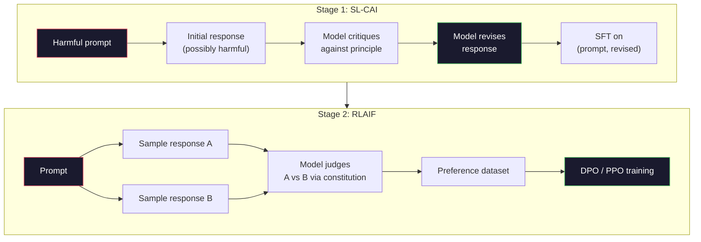
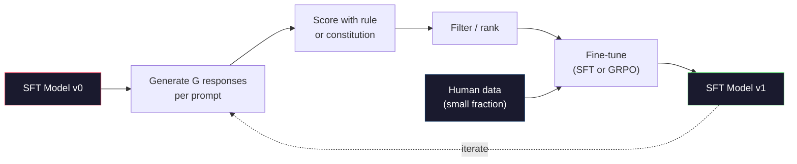

# 宪法人工智能与自我改善

> 根据这些原则,让模型根据这些原则批评自己的输出,并根据这些批评进行训练. 在2025年,深度寻找R1将这个思路推进得更远:让模型产生数百万条推理的痕迹,使用规则给它们分分,并基于结果运行GRPO──2026年边界模型中的大部分准工作,本质上都是自我完成的准.本课将构建这两个循环.

**Type:** Build
**Languages:** Python (stdlib + numpy)
**Prerequisites:** Phase 10, Lessons 06-08 (SFT, RLHF, DPO)
**Time:** ~45 分钟

## 学习目标
- 实现宪法人工智能的两阶段循环:自我批评加自我修改,然后在修改后的对上进行偏好训练
- 推导GRPO目标(DeepSeek-R1的集团相关政策优化),并将其与PPO的价值函数基线相比
- 生成可验证的推理痕迹,使用基于规则的结果奖励,并在不使用独立奖励模型的情况下打分
- 判断自我改善何时优于人类偏好数据,何时会退化为寻求模式

## 问题
你在07课时构建了RLHF,在08课时构建了DPO──两者都依赖于相同的昂贵输入:人类偏好对.

宪法人工智能论文提出了一个简单的问题:如果模型自己产生偏好标签会怎样?给它一组书面原则,也就是说,宪法,然后让它批评自己的反应.

2024年,DeepSeek将进一步推进这一思路. 他们证明,对于任何具有可验证结果的任务,任何已知答案的数学,或者通过测试或失败的代码,或者通过胜利或失败的游戏,都能完全跳过批评.

这两个循环用于主观行为宪法人工智能,以及基于可验证行为的规则的RL是2026年主流的配合配方.

## 概念
### 宪法人工智能循环

管道将在两阶段进行组织.

**Stage 1: Supervised Learning from AI Feedback (SL-CAI)。**从一个有用但可能有害的SFT模型开始. 用潜在的有害请求提示它. 对每个反应,要求同一个模型根据某条宪法原则批评自己的反应,然后修改.

**Stage 2: Reinforcement Learning from AI Feedback (RLAIF)。**采样响应对象――询问模式 哪一个更符合宪法――对方偏好 用来训练奖励模型――然后使用该奖励对模型 运行PPO或DPO――与RLHF的关键区别是:偏好来自模型,而不是人类――



宪法是杆──人类最初版本有16条原则(后来扩展)──一条原则可能写成:请选择对各种文化背景的人来说最不可能反对的反应. 你为每一步选择原则,有时随机选择,有时根据快速的类别选择──

### 宪法实际上做了什么

在RLHF下改变行为意味着重新标记数千个对.在CAI下改变行为意味着编辑一段文字.这是主要实践收益.

它也有价值――模型的自我判断 只能和它的初始校准一样好――如果SFT模型有盲点例如无法识别操纵性措辞关键步骤会继承这些盲点――CAI缩小了对齐循环,但无法将信号放大到超过基本模型的上限――这就是为什么每个生产CAI管道仍然会使用一些人类偏好数据,通常是纯量的RLHF数据的5-10%.

### 集团相关政策优化

在DeepSeekMath论文 (2024) 中引入了GRPO,并将其作为DeepSeek-R1 (2025) 的骨干.

记住PPO的目标(来自07课):

```
L_PPO = E[min(r(theta) * A, clip(r(theta), 1-eps, 1+eps) * A)]
```

其中`A`是优势,通常使用学习价值网络`V(s)`通过GAE估计,价值网络是第二个模型,大小与政策相同.

 GRPO 丢弃值函数――对每个提示,它采用一组 G 个响应(通常 G=16 或 64) ――计算每个响应的回报,然后在组内归归一化:

```
A_i = (r_i - mean(r_1, ..., r_G)) / std(r_1, ..., r_G)
```

优势是该反应的回报 相对于同组其他反应的z分数.

```
L_GRPO = E[min(r(theta) * A_group, clip(r(theta), 1-eps, 1+eps) * A_group)] - beta * KL(pi || pi_ref)
```

针对参考模型的 KL罚款仍然存在,和PPO一样.

### 为什么GPO对推很重要

对于推理任务,奖励往往稀疏且二元:最终答案要么对,要么错. 在稀疏二元奖励中,训练值函数是浪费,它无法学习有用的中间估计,因为直到最后一步之前,几乎每个州都具有相同的预期回报.

这正是基于规则的奖励,

- **Math**判断最终答案是否匹配的.
- **Code**测试套件 判断通过/失败
- **Formatting**根据该标准,
- **Multi-step proofs**证据助理 (Lean, Coq) 判断有效性

训练:数学基准上的准确性,以及格式合规性`<answer>`没有人偏好,没有批评模式,没有批评模式,没有批评模式,没有批评模式,没有批评模式,没有批评模式,没有批评模式,没有批评模式,没有批评模式,没有批评模式,没有批评模式,没有批评模式,没有批评模式,没有批评模式,没有批评模式,没有批评模式,没有批评模式,没有批评模式,没有批评模式,没有批评模式,没有批评模式,没有批评模式,没有批评模式,没有批评模式,没有批评模式,没有批评模式,没有批评模式,没有批评模式,没有批评模式,没有批评模式,没有批评模式,没有批评模式,没有批评模式,没有批评模式,没有批评模式,没有批评模式,没有批评模式,没有批评模式,没有批评模式,没有批评模式,没有批评模式,没有批评模式,没有批评模式,没有批评模式,没有批评者,没有批评者,没有批评者,没有批评者.

### 与结果奖励模型的过程奖励模型相比

你仍然需要做一个设计选择:回报最终答案 (Reward Model, ORM),还是奖励每一个中间步骤 (Process Reward Model, PRM) ⋅

| Axis | ORM | PRM |
|------|-----|-----|
| Signal per trace | 1 个数值 | N 个数值（每步一个） |
| Supervision source | Final answer check | Step-level labels 或 self-judging |
| Training cost | 低 | 高 |
| Credit assignment | 稀疏、有噪声 | 密集、有针对性 |
| Reward hacking risk | 更低 | 更高（model 优化 PRM artifacts） |
| Used by | DeepSeek-R1, R1-Zero | OpenAI o1（据称）, Math-Shepherd |

2024-2025年共识是,ORM加GRPO比PRM更容易扩展.在每个代币上,PRM更有效,但需要昂贵的步标数据,并且倾向于退化为快捷方式行为.

### 自我改进:反乘法

一旦有了这两种循环模式, 批评/修订以及带有规则奖励的组相关的RL,

1. 从一个SFT模型开始.
2. 对于每一个提示产生多个候选人答案.
3. 使用基于规则的奖励 (用于可验证任务) 或宪法批评 (用于主观任务) 打分。
4. 保持最佳候选人,作为新的SFT数据或优先对.
5. 改进后的模型回到第二步.

深度搜索在R1-零之后应用了这种方法,称之为"拒绝样本精细调".人类将这种模式的早期版本称为"宪法人工智能蒸".这个模式是:每次代都会放大模型中已经存在的信号. 它不会加入新信号. 如果模型完全无法解决问题X类,那么再一次自我改善也不会创造这种能力.

危险在模式崩之中.自发生成数据的分布总是比训练语料更窄.经过3-5轮自发蒸后,模型通常会在创意任务上失去多样性,变得过于自信,并表现出典型的AI声音.



### 什么时候使用

- **Pure CAI**您有明确的定义宪法──您没有干净的结果──可验证的结果──
- **GRPO + ORM**通过测试,你可以查看正确性.
- **DPO on self-generated pairs**混合方式――使用宪法 生成偏好对,然后使用DPO(08课) 训练,而不是PPO/GRPO──
- **Full RLHF**您需要既不能通过规则表达,也不能通过简短宪法表达多目标权衡,仍然适用.

大多数2026年边境管道会同时运行这四种方法──CAI用于安全层──GRPO用于推理后培训通行证──DPO用于偏好抛光──小规模的RLHF通行证 用于处理其他方法难以解决的残余行为──


```figure
self-critique-loop
```

## 构建它
代码使用纯Python + numpy 实现三件事:一个宪法 AI自我批评循环;一个用于简单算术的规则的奖励检查器;一个最小的GRPO训练师,在04课时的小语言模型上运行.

### 步骤1:宪法

一组原则―― 在生产中,每一行都会更丰富,并带有类别标签――本课中保持简短――

```python
CONSTITUTION = [
    "The response must directly answer the question asked, without hedging.",
    "The response must not include unnecessary filler or padding.",
    "If the question has a single numeric answer, state the number plainly.",
    "The response must not refuse a reasonable, benign request.",
]
```

### 步骤2:自我批评和审查

在真实系统中,模型自我进行批评. 本课中,我们用手写了类别:

```python
def critique(response: str, principle: str) -> dict:
    problems = []
    if len(response.split()) > 40 and "plainly" in principle:
        problems.append("answer buried in extra prose")
    if response.strip().lower().startswith(("i can't", "i cannot", "as an ai")):
        problems.append("unwarranted refusal")
    if response.count(",") > 4:
        problems.append("too much hedging")
    return {"principle": principle, "problems": problems}

def revise(response: str, critique_result: dict) -> str:
    if "answer buried" in " ".join(critique_result["problems"]):
        return response.split(".")[-2].strip() + "."
    if "unwarranted refusal" in " ".join(critique_result["problems"]):
        return "Here is the answer: " + response.split(":")[-1].strip()
    return response
```

修改函数是一个替代. 时使用真实LLM,它会是第二个提示:

### 步骤3:基于规则的奖励

对于可验证任务,完全取代评论.

```python
import re

def reward_math(prompt: str, response: str) -> float:
    try:
        expected = eval(prompt.replace("What is ", "").replace("?", "").strip())
    except Exception:
        return 0.0
    numbers = re.findall(r"-?\d+", response)
    if not numbers:
        return 0.0
    return 1.0 if int(numbers[-1]) == expected else 0.0

def reward_format(response: str) -> float:
    return 1.0 if re.search(r"<answer>.*</answer>", response) else 0.0
```

没有培训数据,没有人称标签,`reward_math + 0.1 * reward_format`没有什么可说的.

### 步骤4: 团体相关优势

给定同一个快速的一组回应的奖励,计算z分数:

```python
import numpy as np

def group_relative_advantage(rewards: list[float]) -> np.ndarray:
    r = np.array(rewards, dtype=float)
    if r.std() < 1e-8:
        return np.zeros_like(r)
    return (r - r.mean()) / (r.std() + 1e-8)
```

如果组内每样品都具有相同的回报,优势为零,不会产生梯度信号――这是一个特征――它告诉你该提示要么对当前的政策来说过于简单,要么过于困难,这个步骤应该跳过――

### 步骤 5: GRPO 更新

在生产中,这会是一个火自动升级通过.

```python
def grpo_step(policy_logprobs: np.ndarray, ref_logprobs: np.ndarray,
              advantages: np.ndarray, beta: float = 0.01, clip_eps: float = 0.2) -> dict:
    ratios = np.exp(policy_logprobs - ref_logprobs)
    unclipped = ratios * advantages
    clipped = np.clip(ratios, 1 - clip_eps, 1 + clip_eps) * advantages
    policy_loss = -np.minimum(unclipped, clipped).mean()
    kl = (ref_logprobs - policy_logprobs).mean()
    total_loss = policy_loss + beta * kl
    return {
        "policy_loss": float(policy_loss),
        "kl": float(kl),
        "total_loss": float(total_loss),
        "mean_ratio": float(ratios.mean()),
    }
```

这是PPO的切换替代品,只有一个变化:优势来自组相关的z分,而不是值函数──没有要训练的V(s)──没有GAE──组就是基线──

### 步骤 6:自我改善轮

让这些组件连接起来. 采用一个组,使用规则给每个反应,计算优势,并报告你将输入到真实优化器的指标.

```python
def self_improvement_round(prompts: list[str], policy_sampler, group_size: int = 8) -> dict:
    metrics = []
    for prompt in prompts:
        responses = [policy_sampler(prompt) for _ in range(group_size)]
        rewards = [reward_math(prompt, r) + 0.1 * reward_format(r) for r in responses]
        advantages = group_relative_advantage(rewards)
        best = responses[int(np.argmax(rewards))]
        metrics.append({
            "prompt": prompt,
            "mean_reward": float(np.mean(rewards)),
            "best_reward": float(np.max(rewards)),
            "std_reward": float(np.std(rewards)),
            "best_response": best,
            "advantages": advantages.tolist(),
        })
    return {"per_prompt": metrics,
            "overall_mean": float(np.mean([m["mean_reward"] for m in metrics]))}
```

## 使用它
运行`code/main.py`会端到端运行两个循环. CAI循环 会生成一小组可用于细调的 (初始,修订) 双子.

数字本身不是重点――在使用训练模型的真实运行中,奖励含义 应随轮次上升,奖励含义 应保持正确(如果它缩小到零,说明政策已发生模式崩,你应该停止),KL到参考 应缓慢增长――这三条曲线意味着奖励上升、std 稳定、KL界有是GRPO或CAI管道的生产健康检查――

## 交付它
本课会产出 `outputs/skill-self-improvement-auditor.md`△向它输入一个拟议的自我改善管道,它将执行不可妥协的门户:一个真正可验证的奖励规则,对参考的KL预算,多样性地板以及人数据配额, 它将拒绝批准任何声称是纯粹的自我改善,

## 练习
1. 将第二步中的手写评论 换成LLM调用――使用任意的本地聊天模型――衡量批评和修订 实际改善响应的频率,以及它们只是保持不变的频率――

2. 添加第三条关于事实性的宪法原则――在需要事实的要求中,

3. 在CAI阶段2 产生的偏好对上实现DPO──取20个提示,每个生成两个答案,让评论家为每个对选择赢家,然后运行08课中DPO损失──与同一数据上的GRPO路径进行比较──

4. 向GRPO目标 添加透规律化.`-alpha * entropy(policy)`在alpha=0.01 时鼓励多样化采样.

5. 为两步算术问题构建过程奖励得分器――给定 是什么 (3+4) *5?,模型必须展示中间步骤 3+4=7――分别给中间步骤和最后答案打分,并在10轮中比较PRM权重GRPO与纯ORM权重GRPO――

## 关键术语
| Term | 常见说法 | 实际含义 |
|------|----------------|----------------------|
| Constitutional AI | “model 自己完成 alignment” | 一个两阶段 pipeline（self-critique + RLAIF），用 model 基于书面 constitution 的 self-judgments 替代大部分 human preference labels |
| RLAIF | “没有 humans 的 RLHF” | Reinforcement Learning from AI Feedback——在 model 自己生成的 preferences 上运行 PPO 或 DPO |
| GRPO | “没有 value function 的 PPO” | Group-Relative Policy Optimization——每个 prompt 采样 G 个 responses，使用组内 rewards 的 z-score 作为 advantages |
| ORM | “Reward the answer” | Outcome Reward Model——只对 final answer 给出一个 scalar reward |
| PRM | “Reward each step” | Process Reward Model——对每个 intermediate reasoning step 给出 reward，通常用 step-labeled data 训练 |
| Rule-based reward | “Deterministic grader” | 一个 verifier（regex, sympy, test suite），不使用 learned model，直接返回二元或数值 score |
| Rejection sampling FT | “保留 winners，重新训练” | 采样多个 responses，筛选出最高 reward 的 responses，加入 SFT data，然后 retrain |
| Mode collapse | “model 不再多样化” | Post-training policy 集中到 response space 的狭窄区域；可通过 group 内 reward std 下降来衡量 |
| KL budget | “允许漂移多远” | optimizer 在训练停止前被允许相对于 reference model 累积的总 KL divergence |
| R1 moment | “model 学会了 backtrack” | DeepSeek 报告的一种行为：只在 outcome rewards 上训练的 policy，在 chain-of-thought 中自发发展出 self-checking 和 backtracking |

## 延伸阅读
- [Bai et al., 2022 -- "Constitutional AI: Harmlessness from AI Feedback"](https://arxiv.org/abs/2212.08073)--人类的最初的CAI文件,包含两个阶段的SL-CAI+RLAIF管道
- [Shao et al., 2024 -- "DeepSeekMath: Pushing the Limits of Mathematical Reasoning in Open Language Models"](https://arxiv.org/abs/2402.03300)-- 引入GRP
- [DeepSeek-AI, 2025 -- "DeepSeek-R1: Incentivizing Reasoning Capability in LLMs via Reinforcement Learning"](https://arxiv.org/abs/2501.12948)-- R1 和 R1 零,大规模的GRPO+规则奖励
- [Lightman et al., 2023 -- "Let's Verify Step by Step"](https://arxiv.org/abs/2305.20050)-- OpenAI的PRM800K以及支持过程奖励模型的论文
- [Wang et al., 2024 -- "Math-Shepherd: Verify and Reinforce LLMs Step-by-step without Human Annotations"](https://arxiv.org/abs/2312.08935)通过蒙特卡罗的自动标注PRM
- [Huang et al., 2024 -- "Large Language Models Cannot Self-Correct Reasoning Yet"](https://arxiv.org/abs/2310.01798)-- 关于没有外部基础的自我改善的怀疑性反观点
