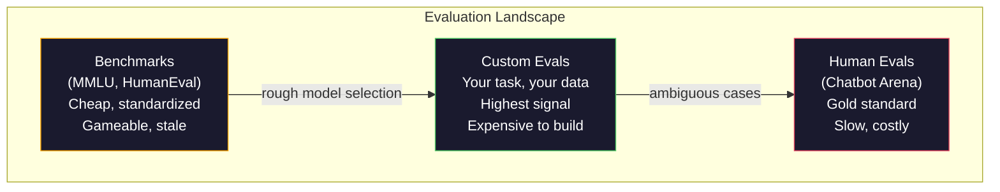
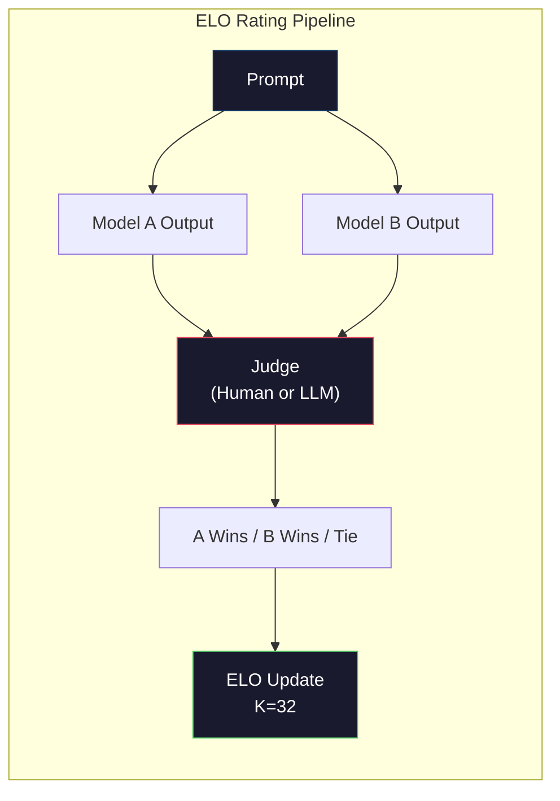

# 评估:基准,等值,LM运用

> 戈达特定律:当一个指标变成目标时,它就不再是一个好指标了. 每个边境实验室都会针对基准进行优化.

**Type:** Build
**Languages:** Python
**前置要求:**第十阶段课程01-05 (从零开始的LLM)
**Time:** ~90 minutes

## 学习目标
- 构建一个自定义评估套件,用于针对语言模型 运行多选择和开放的基准
- 解释为什么标准基准 (MMLU、HumanEval) 会和,并且无法区分边界模型
- 使用合适的指标 实现任务特定的评估:精确匹配、F1、BLEU 和 LLM作为评审分
- 设计面向您特定的使用情况的自定义评估套件,而不是仅依赖于公开的排名表

## 问题
据报道,在2020年发布的MMLU中,包含了57个学科的15908个道题.

同时,这些模型会在10岁的孩子不需要思考就能完成任务中失败.Claude 3.5 Sonnet在MMLU上得分88.7%,最初却无法计算"草"中的字母数量.这个任务不需要任何世界知识,也不需要推理,只需要角色级的代.HumanEval使用164个问题测试代码生成.模型在其中得分超过90%,但仍然在边界情况上生成崩的代码,而任何初级开发人员都能发现这些边界.

基准表现与现实世界可靠性之间的差距是LLM评估的核心问题.基准仅能告诉你模型在基准上表现如何.它们几乎无法告诉你模型在你的特定任务,你的特定数据,你的特定失败模式下将如何表现.如果你正在构建客户支持机器人,MLU就无关紧要.如果你正在构建代码助手,HumanEval只覆盖功能级代码,它对调试,重复或跨文件解释代码没有任何说明.

你需要定制评估. 不是因为基准没有用,对粗略模型的选择是很有用的,而是因为最终评估必须精准地匹配你的部署条件.

## 概念
### 伊瓦尔景观

评估分为三类,每个类别的成本和信号质量都不同.

**Benchmarks**优势是:所有人都使用相同的测试,因此可以比较模型. 劣势是:模型和训练数据越来越容易污染这些测试标准. 实验室会包含测试标准的问题.

**Custom evals**是你为自己的特定使用案例构建测试套件――你定义输入,预期输出和分数功能――法律文档总结器 要在法律文档上进行评估――SQL生成器要在你的数据库方案上进行评估――这些评估 创建成本高,但它们是唯一能够预测生产性能的评估――

**Human evals**使用付费注释器,根据有用性,正确性,流动性和安全等标准评判模型输出.对于自动化得分失效的开放式任务,这是金标准.$0.10-$速度和速度 (数小时到几天)



### 为什么标准标准会破裂

三种机制会导致基准分数不再反映实际能力.

**Data contamination。**训练语料会抓取互联网. 标签问题也在互联网上. 模型在训练期间看到答案.

**Teaching to the test。**实验室会针对基准性能 优化训练混合数据. 如果训练混合数据中有5%是MMLU式多选项,模型就会学会这种格式和答案分布.

**Saturation。**当每个边界模型在一个基准上都能达到85-90%,这个基准就停止了区分能力――剩下的10-15%的问题可能是模糊的,标记错误,或者需要冷门域知识――MLU从87%升至89%,可能意味着模型再次记住了两个冷门问题,而不是变得更聪明――

### 快速健康检查

困惑 衡量模型对一串代币有多意外.

```
PPL = exp(-1/N * sum(log P(token_i | context)))
```

困惑 为 10 表示模型在平均意义上,就像在每个代币位置中均选择一样不确定──越低越好──GPT-2 在WikiText-103上 的困惑 约为 30──GPT-3 约为 20──Llama 3 8B 约为 7──

困惑对同一测试组上比较模型很有用,但它有盲点.模型可以通过善于预测常见模式而获得低困惑,同时却非常不擅长罕见但重要的模式. 它也不能说明说明说明遵循指示或理性或事实准确性.

### 法律法官

使用强模型来评估 弱模型的输出――想法很简单:让GPT-4o或Claude Sonnet 根据 1-5 分评价反应的正确性、有用性和安全性――使用GPT-4o-mini 时,每次判断成本约为0.01美元,与人类判断的相关性都很高,大多数任务约有80%的同意――

评分快速比模型本身更重要.模糊快速. "这个响应率") 会产生噪音分数.

失败模式:评审模型会表现出位置偏见(在对称比较中偏好第一个反应) 变量偏见(偏好更长的反应) 和自我偏好(GPT-4对GPT-4的输出评分高于等价的克劳德输出) ◊缓解方法:随机化顺序、按长度归化、使用不同于被评估的模型评审者──

### 基于成比的ELO评级

这就是Chatbot Arena的方法. 向同一个提示展示来自不同模型的两个反应. 人类 (或LLM法官) 选择更好的一个. 通过成千上万次这样的比较,为每个模型计算了ELO评级,也就是国际象棋中使用的相同系统.

优势:比绝对得分更可靠,能优雅处理联系,并且比独立给每一个输出打分需要更少的比较 就能收──截至2026年初,Chatbot Arena 排名显示GPT-4o、Claude 3.5 Sonnet 和 Gemini 1.5 Pro 在榜首相差不多20个ELO分──



### 平等框架

**lm-evaluation-harness**标准的开源评估框架――支持200多个基准――用一条命令即可让任意拥抱面孔模型运行MMLU、HellaSwag、ARC等――Open LLM领袖板 使用它――

**RAGAS**答案是否匹配获取的文本? 相关性? 获取的文本是否与问题相关?) 和答案正确性.

**promptfoo**为了实现快速工程的配置驱动评估,在YAML中定义了测试案例,针对多个模型运行,获得通过/失败报告,适合了快速测试的回归测试,确保快速变化不会破坏已有的测试案例.

### 建立定制的

这是生产的唯一重要评估.

1. **Define the task。**模型到底应该做什么?要精确――"回答问题" 太模糊――"给出客户投诉电子邮件,提取产品名称,问题类别和情绪"才是一个可评估的任务――

2. **Create test cases。**试验案例为一个 (输入,预期_输出) 对――包含边缘案例:空输入、对立输入、双重输入、其他语言的输入──

3. **Define scoring。**结构化输出 使用精确匹配──文本相似度 使用 BLEU/ROUGE──开放式质量 使用 LLM作为法官──提取任务 使用 F1──用权重组合多个指标──

4. **Automate。**每个评估都能使用一个命令运行.

5. **Track over time。**单独一个评分分 没有意义――你需要趋势线――上一次的提示变化 后分数是否升级?切换模型后是否回归?把评分与提示 一起版本――

| Eval Type | 每次 judgment 成本 | 与人类的一致性 | 最适合 |
|-----------|------------------|----------------------|----------|
| Exact match | ~$0 | 100%（适用时） | Structured output、classification |
| BLEU/ROUGE | ~$0 | ~60% | Translation、summarization |
| LLM-as-judge | ~$0.01 | ~80% | Open-ended generation |
| Human eval | $0.10-$2.00 | N/A（即 ground truth） | Ambiguous、high-stakes tasks |


```figure
perplexity-loss
```

## 构建它
### 步骤1:最小Eval 框架

定义核心抽象──一个 eval 案例 有输入、预期输出 和可选的元数据 dict──一个得分者 接收预测 和参考,并返回 0 到 1 之间的分数──

```python
import json
from collections import Counter

class EvalCase:
    def __init__(self, input_text, expected, metadata=None):
        self.input_text = input_text
        self.expected = expected
        self.metadata = metadata or {}

class EvalSuite:
    def __init__(self, name, cases, scorers):
        self.name = name
        self.cases = cases
        self.scorers = scorers

    def run(self, model_fn):
        results = []
        for case in self.cases:
            prediction = model_fn(case.input_text)
            scores = {}
            for scorer_name, scorer_fn in self.scorers.items():
                scores[scorer_name] = scorer_fn(prediction, case.expected)
            results.append({
                "input": case.input_text,
                "expected": case.expected,
                "prediction": prediction,
                "scores": scores,
            })
        return results
```

### 步骤2: 评分函数

构建一个完全匹配的F1标志和一个模拟的法官作为评审者得分者.

```python
def exact_match(prediction, expected):
    return 1.0 if prediction.strip().lower() == expected.strip().lower() else 0.0

def token_f1(prediction, expected):
    pred_tokens = set(prediction.lower().split())
    exp_tokens = set(expected.lower().split())
    if not pred_tokens or not exp_tokens:
        return 0.0
    common = pred_tokens & exp_tokens
    precision = len(common) / len(pred_tokens)
    recall = len(common) / len(exp_tokens)
    if precision + recall == 0:
        return 0.0
    return 2 * (precision * recall) / (precision + recall)

def llm_judge_simulated(prediction, expected):
    pred_words = set(prediction.lower().split())
    exp_words = set(expected.lower().split())
    if not exp_words:
        return 0.0
    overlap = len(pred_words & exp_words) / len(exp_words)
    length_penalty = min(1.0, len(prediction) / max(len(expected), 1))
    return round(overlap * 0.7 + length_penalty * 0.3, 3)
```

### 步骤3:ELO评级系统

使用ELO更新实现对比. 这正是Chatbot Arena用于模型排名系统.

```python
class ELOTracker:
    def __init__(self, k=32, initial_rating=1500):
        self.ratings = {}
        self.k = k
        self.initial_rating = initial_rating
        self.history = []

    def _ensure_player(self, name):
        if name not in self.ratings:
            self.ratings[name] = self.initial_rating

    def expected_score(self, rating_a, rating_b):
        return 1 / (1 + 10 ** ((rating_b - rating_a) / 400))

    def record_match(self, player_a, player_b, outcome):
        self._ensure_player(player_a)
        self._ensure_player(player_b)

        ea = self.expected_score(self.ratings[player_a], self.ratings[player_b])
        eb = 1 - ea

        if outcome == "a":
            sa, sb = 1.0, 0.0
        elif outcome == "b":
            sa, sb = 0.0, 1.0
        else:
            sa, sb = 0.5, 0.5

        self.ratings[player_a] += self.k * (sa - ea)
        self.ratings[player_b] += self.k * (sb - eb)

        self.history.append({
            "a": player_a, "b": player_b,
            "outcome": outcome,
            "rating_a": round(self.ratings[player_a], 1),
            "rating_b": round(self.ratings[player_b], 1),
        })

    def leaderboard(self):
        return sorted(self.ratings.items(), key=lambda x: -x[1])
```

### 步骤 4: 困难计算

在实践中,你会从模型逻辑中获得这些值.

```python
import numpy as np

def perplexity(log_probs):
    if not log_probs:
        return float("inf")
    avg_neg_log_prob = -np.mean(log_probs)
    return float(np.exp(avg_neg_log_prob))

def token_log_probs_simulated(text, model_quality=0.8):
    np.random.seed(hash(text) % 2**31)
    tokens = text.split()
    log_probs = []
    for i, token in enumerate(tokens):
        base_prob = model_quality
        if len(token) > 8:
            base_prob *= 0.6
        if i == 0:
            base_prob *= 0.7
        prob = np.clip(base_prob + np.random.normal(0, 0.1), 0.01, 0.99)
        log_probs.append(float(np.log(prob)))
    return log_probs
```

### 步骤5:总结结果

计算一次评估运行的总结统计数据:平均,平均,门,下级通过率以及按指标的分类.

```python
def summarize_results(results, threshold=0.8):
    all_scores = {}
    for r in results:
        for metric, score in r["scores"].items():
            all_scores.setdefault(metric, []).append(score)

    summary = {}
    for metric, scores in all_scores.items():
        arr = np.array(scores)
        summary[metric] = {
            "mean": round(float(np.mean(arr)), 3),
            "median": round(float(np.median(arr)), 3),
            "std": round(float(np.std(arr)), 3),
            "min": round(float(np.min(arr)), 3),
            "max": round(float(np.max(arr)), 3),
            "pass_rate": round(float(np.mean(arr >= threshold)), 3),
            "n": len(scores),
        }
    return summary

def print_summary(summary, suite_name="Eval"):
    print(f"\n{'=' * 60}")
    print(f"  {suite_name} Summary")
    print(f"{'=' * 60}")
    for metric, stats in summary.items():
        print(f"\n  {metric}:")
        print(f"    Mean:      {stats['mean']:.3f}")
        print(f"    Median:    {stats['median']:.3f}")
        print(f"    Std:       {stats['std']:.3f}")
        print(f"    Range:     [{stats['min']:.3f}, {stats['max']:.3f}]")
        print(f"    Pass rate: {stats['pass_rate']:.1%} (threshold >= 0.8)")
        print(f"    N:         {stats['n']}")
```

### 步骤 6: 运行全管道

把所有内容连接起来――定义一个任务,创建测试案例,模拟两个模型,运行评估,从对比计算 ELO,并打印领先表――

```python
def demo_model_good(prompt):
    responses = {
        "What is the capital of France?": "Paris",
        "What is 2 + 2?": "4",
        "Who wrote Hamlet?": "William Shakespeare",
        "What language is PyTorch written in?": "Python and C++",
        "What is the boiling point of water?": "100 degrees Celsius",
    }
    return responses.get(prompt, "I don't know")

def demo_model_bad(prompt):
    responses = {
        "What is the capital of France?": "Paris is the capital city of France",
        "What is 2 + 2?": "The answer is four",
        "Who wrote Hamlet?": "Shakespeare",
        "What language is PyTorch written in?": "Python",
        "What is the boiling point of water?": "212 Fahrenheit",
    }
    return responses.get(prompt, "Unknown")

cases = [
    EvalCase("What is the capital of France?", "Paris"),
    EvalCase("What is 2 + 2?", "4"),
    EvalCase("Who wrote Hamlet?", "William Shakespeare"),
    EvalCase("What language is PyTorch written in?", "Python and C++"),
    EvalCase("What is the boiling point of water?", "100 degrees Celsius"),
]

suite = EvalSuite(
    name="General Knowledge",
    cases=cases,
    scorers={
        "exact_match": exact_match,
        "token_f1": token_f1,
        "llm_judge": llm_judge_simulated,
    },
)

results_good = suite.run(demo_model_good)
results_bad = suite.run(demo_model_bad)

print_summary(summarize_results(results_good), "Model A (concise)")
print_summary(summarize_results(results_bad), "Model B (verbose)")
```

"好"模型给出精确答案――"坏"模型给出冗长的表达语――精确的匹配会严重惩罚冗长模型――F1和法官更宽容――这说明了为什么测量选择很重要:同一个模型看起来很强大还是很差,取决于你如何得分――

### 步骤7: 欧联赛比赛

在多个轮中运行模型之间的对比性比较.

```python
elo = ELOTracker(k=32)

for case in cases:
    pred_a = demo_model_good(case.input_text)
    pred_b = demo_model_bad(case.input_text)

    score_a = token_f1(pred_a, case.expected)
    score_b = token_f1(pred_b, case.expected)

    if score_a > score_b:
        outcome = "a"
    elif score_b > score_a:
        outcome = "b"
    else:
        outcome = "tie"

    elo.record_match("model_a_concise", "model_b_verbose", outcome)

print("\nELO Leaderboard:")
for name, rating in elo.leaderboard():
    print(f"  {name}: {rating:.0f}")
```

### 步骤 8: 困惑比较

较不同质量水平的模型的

```python
test_text = "The quick brown fox jumps over the lazy dog in the garden"

for quality, label in [(0.9, "Strong model"), (0.7, "Medium model"), (0.4, "Weak model")]:
    log_probs = token_log_probs_simulated(test_text, model_quality=quality)
    ppl = perplexity(log_probs)
    print(f"  {label} (quality={quality}): perplexity = {ppl:.2f}")
```

## 使用它
### 评价器 (EleutherAI)

在任意模型上运行基准的标准工具.

```python
# pip install lm-eval
# Command line:
# lm_eval --model hf --model_args pretrained=meta-llama/Llama-3.1-8B --tasks mmlu --batch_size 8

# Python API:
# import lm_eval
# results = lm_eval.simple_evaluate(
#     model="hf",
#     model_args="pretrained=meta-llama/Llama-3.1-8B",
#     tasks=["mmlu", "hellaswag", "arc_easy"],
#     batch_size=8,
# )
# print(results["results"])
```

### 快速foo

在YAML中定义的测试中,并针对多家提供商运行.

```yaml
# promptfoo.yaml
providers:
  - openai:gpt-4o-mini
  - anthropic:claude-3-haiku

prompts:
  - "Answer in one word: {{question}}"

tests:
  - vars:
      question: "What is the capital of France?"
    assert:
      - type: contains
        value: "Paris"
  - vars:
      question: "What is 2 + 2?"
    assert:
      - type: equals
        value: "4"
```

### 针对RAG评估的RAGAS

```python
# pip install ragas
# from ragas import evaluate
# from ragas.metrics import faithfulness, answer_relevancy, context_precision
#
# result = evaluate(
#     dataset,
#     metrics=[faithfulness, answer_relevancy, context_precision],
# )
# print(result)
```

RAGAS 衡量通用评估 会遗漏的内容:模型答案是否基于检索的文本,而不是仅仅在抽象意义上是否正确──

## 交付它
本课会产出 `outputs/prompt-eval-designer.md`给它一个任务描述,它会生成测试案例,得分函数和通过/失败门建议.

它会再次出现.`outputs/skill-llm-evaluation.md`根据您的任务类型,预算和延迟要求,选择合适的评估策略.

## 练习
1. 添加一个"一致性"得分符:使用相同的输入 让模型运行5次,并衡量输出 匹配的频率――确定性输入 上的不一致答案会暴露于脆弱的提示或过高的温度设置――

2. 扩大ELO跟踪器,使其支持多个法官功能 (精确匹配、F1、LLM作为法官) 并为它们加权──比较当你大幅提高精确匹配权重与大幅提高F1权重时,领导板会如何变化──

3. 为一个具体任务构建评估套件:将电子邮件分类到5类. 创建100个测试案例,包含多种示例和边缘案例.

4. 实现污染检测:给定一组评估问题和一个培训组,检查有多少比例的评估问题 (或接近的句子) 出现在培训数据中.

5. 构建一个"模型差异"工具. 给定两个模型版本的评估结果,高亮哪些具体的测试案例 升级,哪些回归,哪些保持不变.

## 关键术语
| Term | 人们的说法 | 它实际上的含义 |
|------|----------------|----------------------|
| MMLU | "The benchmark" | Massive Multitask Language Understanding，包含 57 个学科的 15,908 道 multiple choice questions，到 2025 年已在 88% 以上饱和 |
| HumanEval | "Code eval" | OpenAI 的 164 个 Python function-completion problems，只测试 isolated function generation |
| SWE-bench | "Real coding eval" | 来自 12 个 Python repos 的 2,294 个 GitHub issues，衡量包括 test generation 在内的 end-to-end bug fixing |
| Perplexity | "How confused the model is" | exp(-avg(log P(token_i given context)))，越低表示模型给实际 tokens 分配的概率越高 |
| ELO rating | "Chess ranking for models" | 根据 pairwise win/loss records 计算的 relative skill rating，Chatbot Arena 用它对 100+ models 排名 |
| LLM-as-judge | "Using AI to grade AI" | 强模型按照 rubric 评价弱模型 outputs，与人类 judges 约 80% agreement，成本约 $0.01/judgment |
| Data contamination | "The model saw the test" | Training data 包含 benchmark questions，在不提升真实 capability 的情况下抬高分数 |
| Eval suite | "A bunch of tests" | 一个 versioned collection，由 (input, expected_output, scorer) triples 组成，用于衡量特定 capability |
| Pass rate | "What percentage it gets right" | Eval cases 中得分超过阈值的比例，比 mean score 更可操作，因为它衡量 reliability |
| Chatbot Arena | "Model ranking website" | LMSYS 平台，拥有 2M+ human preference votes，并通过 ELO ratings 生成最可信的 LLM leaderboard |

## 延伸阅读
- [Hendrycks et al., 2021 -- "Measuring Massive Multitask Language Understanding"](https://arxiv.org/abs/2009.03300)尽管已有,但仍是最多引用的LLM基准
- [Chen et al., 2021 -- "Evaluating Large Language Models Trained on Code"](https://arxiv.org/abs/2107.03374)--OpenAI的HumanEval论文,建立了代码生成评估方法
- [Zheng et al., 2023 -- "Judging LLM-as-a-Judge"](https://arxiv.org/abs/2306.05685)对于使用LLM评估LLM的系统分析,包括位置偏见和语句偏见发现
- [LMSYS Chatbot Arena](https://chat.lmsys.org/)-- 众筹模型比较平台,拥有2万多票,是最可信的现实世界LLM排名
