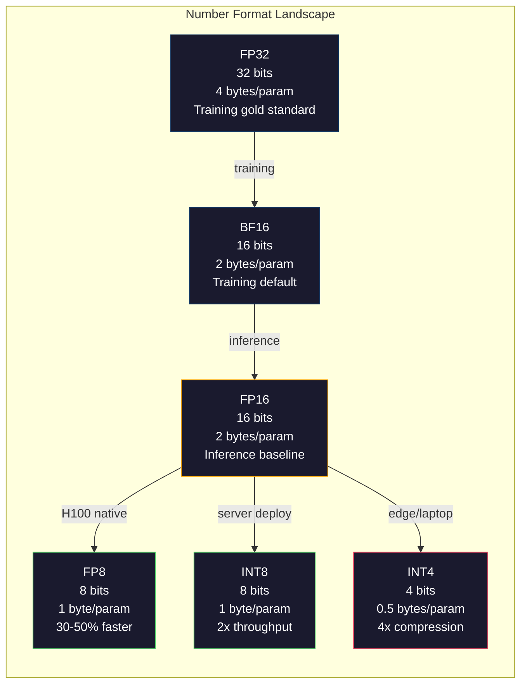
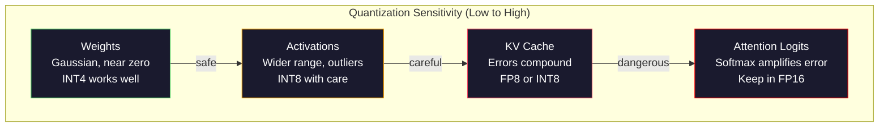
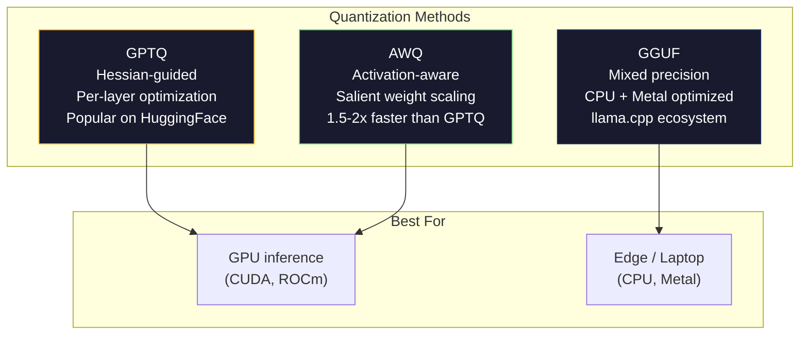

# 让模型装得下

> 一个70B 模型使用FP16需要140GB──光是权重就需要两张A100──量化到FP8:一张80GB的GPU──INT4:一台MacBook──

**Type:** Build
**Languages:** Python (with numpy)
**前置要求:**第十阶段课程01-10 (从零开始的LLM)
**Time:** ~120 minutes

## 学习目标
- 实现从FP16到INT8和INT4的对称与不对称量化,包括每ensor和每道缩小
- 计算量化 带来的内存节省,并判断哪种精确性能安装到给定的GPU的VRAM中
- 解释训练后量化 (PTQ) 与量化意识训练 (QAT) 的区别
- 使用GPTQ或 AWQ量化一个真实模型,并进行基准上衡量精度-记忆的交易

## 问题
拉马370B有7亿参数――每个参数是16位浮点号码――也就是1400亿字节――140GB――一张A100有80GB的VRAM――你甚至无法在单张GPU上加载权重,更别说运行推断――你需要两张A100,每张2美元/小时,才能服务一个模型――

但是每个参数使用16位很浪费――神经网络中的大部分权重都聚集在零附近――FP16的完整动态范围――从0.000000059到65,504几乎完全没有被使用――如果你测量Llama 3 70B中权重的实际分布,95%都在0.1到 +0.1 之间――你正在使用16位表示可以放入4位的值――

量子化使用低精度 数字替代高精度 数字──FP16到FP8将将内存切割半──FP16到INT4将切割到四分之一──那个140GB的模型将变成35GB──它可以装入单张消费级GPU──进一步推进到2位量子化(激进、有损,但可用于某些任务),同一个模型可以在16GB笔记本上运行──

代价是精确性――你移除的每一块都会破坏信息――问题是你会损失多少精确性,以及损失在哪里――一个量化得到好的INT4模型,在大多数基准上能保留原始模型的质量95%-99%.一次天真的量化到INT4可能会彻底摧毁模型――差异在技术上――

社区对Llama3做INT4GPTQ量化结果显示,在WikiText上大约损失1-2个困难点――Mistral发布了Mixtral 8x22B的FP8检查点,在MMLU上没有可测量的质量损失――GGUF格式支持了 llama.cpp,让70B模型能够运行在搭载M系列芯片的MacBook上――量化不是黑客――它是所有7B模型的标准署路径――

## 概念
### 数字格式: 每个小点做什么

每个浮点数有三部分:标志、元和分数(也叫标志和意义) ・标志是一个比特――元决定范围(数字可以有多大或多小) ・分数决定精度(你能得到多少位小数) 。

```
FP32:  [1 sign] [8 exponent] [23 mantissa]  = 32 bits
FP16:  [1 sign] [5 exponent] [10 mantissa]  = 16 bits
BF16:  [1 sign] [8 exponent] [7  mantissa]  = 16 bits
FP8:   [1 sign] [4 exponent] [3  mantissa]  = 8  bits (E4M3)
FP8:   [1 sign] [5 exponent] [2  mantissa]  = 8  bits (E5M2)
INT8:  [1 sign] [7 value]                   = 8  bits (uniform steps)
INT4:  [1 sign] [3 value]                   = 4  bits (16 levels total)
```

**FP32**范围:大约从1.2 x 10^-38 到 3.4 x 10^38──过去的训练几乎只使用FP32──现在它仍然用于积累矩阵乘法期间的运行求和)──

**FP16**把比特减半,10个 mantissa比特 给出约3.3位进制精度――指数缩小到5位,范围大幅缩小(最大值约65,504)。这对权重没问题(权重聚集在零附近),但对训练期间可能会突然增加激活和梯度很危险――FP16训练需要损失缩小以防止下流――

**BF16**(脑浮 16) 保持FP32的8位指数,但把 mantissa缩小到7位.范围和FP32相等,精度比FP16更低.谷歌专门为深度学习设计它.直觉是:对神经网络来说,范围比精度更重要.一个10^-20的基因在FP16中会下流到零,但在BF16中能保留下来.一个0.07342的权重在BF16中环绕到0.0734,也足够接近.每个现代训练运行都使用BF16或BF16/FP32混合.

**FP8**有两种形式──E4M3(4指数,3 mantissa) 用于推断 期间的重量和激活──E5M2(5指数,2 mantissa) 用于训练期间的梯度,此时范围比精度更重要──在H100GPU上,FP8推断相比FP16可实现 30-50%的加速度,且质量损失可忽略──

**INT8**优势是:整数算比浮点更快,更省电. A100 上的INT8矩阵乘法可达624TOPS,而 FP16 是312TFLOPS.

**INT4**质量完全取决于你如何选择尺度,以及量化哪些权重.



### 定量化 如何工作

核心操作很简单. 取一个浮点值的子,找到一个尺度因子,乘除,圆到最近的整数,然后存储整数加尺度因子.

**Quantize:**
```
scale = max(abs(tensor)) / max_int_value
quantized = round(tensor / scale)
```

**Dequantize:**
```
reconstructed = quantized * scale
```

对于对称范围的INT8 ((-127到127):
```
scale = max(abs(tensor)) / 127
quantized = clamp(round(tensor / scale), -128, 127)
```

误差就是圆形错误.`scale / 2`△一个层的总误差取决于你有多少权力,以及模型对这些权力的敏感性.

**Per-tensor vs per-channel quantization。**对于整个重量矩阵使用一个尺度因素――简单但有损失:如果一列有大值,另一列有小值,小值会损失大部分精度――每条道对每个输出道 (每条道或每一列) 使用一个尺度因素――开销更高――储存N个尺度因素而不是1个),但质量显著更好――所有生产量化方法都使用每条道或更细粒度――

**Asymmetric quantization**添加一个零点抵消:`quantized = round(tensor / scale) + zero_point`△这可以处理不以零为中心的分布――例如,RLU激活式永远是负的――对称量化会把半整数范围 浪费在永远不会出现的负值上――对称量化会把实际范围 [min,max] 映射到完整整整数范围――

### 敏感性等级

模型中的不同部分对量化的容忍度不相同.

**Weights（最稳健）。**模型权重在训练期间变化缓慢,并遵循大致以零为中心的高斯分布.它们非常适合量化.

**Activations（中等敏感）。**激活是推断的 期间流经网络的中间值――它们的动态范围比权重更宽,并且包含外观值――单个注意力头可能产生比平均值大于100倍的激活值――这些外观值对模型质量很关键――无数量化会破坏信息解决方案:把外观频道保持在更高的精度 (LLM.int8()),使用每代币或每频道激活规模――

**KV cache（高敏感）。**对于32K背景的70B模型,仅KV缓存在FP16下就是40GB──把KV缓存量量化到FP8或INT8 能节省大量的内存,但任何差异都会在所有后续的注意计算中累积──质量影响随着序列长度的扩大──

**Attention logits（最敏感）。**注意中软max对输入的微小变化高度敏感.预软max逻辑中0.01的量化错误也可能显著改变注意力分布.大多数量化方案即使在其他部分都被量化时,也会使注意力计算保持更高的精度.



### 关与关

**Post-Training Quantization (PTQ)**量化一个已经训练好的模型――不重新训练――你取FP16重量,计算尺度因素,圆,然后部署――它很快(几分钟到几小时) 且便宜――对INT8和FP8 效果很好――对INT4,无性PTQ往往失败得很严重,因为圆形错误 会积累――先进的PTQ方法(GPTQ、AWQ) 使用校准数据来最大化量化错误――

**Quantization-Aware Training (QAT)**在训练的前行通过插入虚假量化操作――模型会学会把重重力放在圆形错误的较小位置―― 通过直径估计器 (STE) 穿过虚假量化:假设圆形操作的梯度是1――QAT 产生的INT4 和INT2 模型比PTQ更好,但需要完整的训练运行――Google使用QAT 支双子的高效服务――Meta对一些Llama部署目标使用QAT――

| Aspect | PTQ | QAT |
|--------|-----|-----|
| Cost | 几分钟到几小时 | 完整 training run |
| Quality at INT8 | 极佳（< 0.1% 损失） | 极佳 |
| Quality at INT4 | 使用 GPTQ/AWQ 时良好（1-3% 损失） | 更好（< 1% 损失） |
| Quality at INT2 | 较差 | 对某些任务可用 |
| Calibration data | 128-1024 个 examples | 完整 training dataset |
| When to use | 部署、迭代 | 低 bit-width 下的最高质量 |

### 其他类型的产品

**GPTQ (GPT Quantization)**是一种单次PTQ方法――它一次量化一个层,使用小型校准数据集 (通常是128个例子) 来测量赫西安 (Hessian) 信息,描述输出对每个重量的敏感性) ・赫西安认为重要权重会被更谨慎地量化――GPTQ是第一个让INT4量化对 LLM 实用方法――Hugging Face 上的TheBlock 通过发布数百个模型的量化版本普及了GPTQ――

**AWQ (Activation-Aware Weight Quantization)**观察少量权重 (约1%) 极其重要,因为它们会与较大的激活值相乘──AWQ 使用校准数据 找到这些突出权重,并量化前放大它们,然后对应激活量缩小──这将使重要权重保持在INT4量化准确表示范围内的──AWQ质量通常匹配或略优于GPTQ,同时应用速度快 1.5-2x──

**GGUF (GPT-Generated Unified Format)**是 llama.cpp 及其生态使用的文件格式. 它支持混合量化:不同层使用不同位宽度. 第一层和最后层. 嵌入和输出头) 通常保持更高的精度. 中层使用INT4或INT3. GGUF文件是自含的:重量,托克尼泽,元数据都在一个文件中. 该格式面向CPU推断和果的设计,在这些环境中,把整个模型加载到内存中,并运行CPU金属GPU上行变量或矩阵乘法是标准路径. Q4_K_M是最流行的GGUF量化,在质量和大小之间取得平衡.



### 质量测量

你怎么知道量化模型是否仍然足够好?

**Perplexity。**最常见的指标――越低越好――在已被保留的数据集中(WikiText-2 是标准) 上分计算原始模型和量化模型的困惑――delta 会告诉你量化破坏了多少信息――经验法则:delta <0.5 极佳,0.5-1.0 好,1.0-2.0对大多数任务可接受,>表示2.0某处出错了――

**Task-specific benchmarks。**在MMLU、HumanEval、GSM8K或你的自定义评估套件上运行量化模型──与原始模型相比──量化对不同能力的影响不均──数学和代码任务比一般知识更容易受到精度损失的影响────────────────────────────────────────────────────────────────────────────────────────────────────────────────────────────────────────────────────────────────────────────────────────────────────────────────────────────────────────────────────────────────────────────────────────────────────────────────────────────────────────────────────────────────────────────────────────────────────────────────────────────────────────────────────────────────────────────────────────────────────────────────────────────────────────────────────────────────────────────────────────────────────────────────────────────────────────────────────────────────────────────────────────────────────────────────────────────────────────────────────────────────────────────────────────────────────────────────────────────────────────────────────────────────────────────────────────────────────────────────────────────────────

**Output comparison。**在相同的提示上让两个模型产生反应并比较.LLM作为判断者 (?? 课 10) 在这里非常有效.计算胜利率:量化模型在多少比例的提示上匹配或超过原始模型?

**Latency and throughput。**量子化存在于使模型更快,更便宜的目的. 测量每秒的代币,时间到第一个代币和记忆使用.

| Model | Format | Size | Perplexity (WikiText-2) | MMLU | Tokens/sec (A100) |
|-------|--------|------|------------------------|------|-------------------|
| Llama 3 70B | FP16 | 140GB | 3.12 | 79.5% | 38 |
| Llama 3 70B | FP8 | 70GB | 3.14 | 79.3% | 55 |
| Llama 3 70B | GPTQ INT4 | 35GB | 4.32 | 77.8% | 72 |
| Llama 3 70B | AWQ INT4 | 35GB | 4.18 | 78.1% | 75 |
| Llama 3 70B | GGUF Q4_K_M | 40GB | 4.25 | 77.9% | 28 (CPU) |

规则是:FP8 几乎没有价格.INT4 损失了1-2个MMLU点,但吞吐翻倍,内存降至四分之一.

### 真实数字

恒温升高FP16到FP8: 恒温加快30-50%,质量损失<0.1%──这是显而易见的量化──每一个恒温升部署都应该使用它──

到INT8 (LLM.int8() 内存减少2倍,质量损失 <0.5%──混合精度方法 保持在FP16中,同时将其他的所有内容量化到INT8──

根据模型和方法,使70B模型能够在单张48GB的GPU上运行.

根据"中文版"的数据,在"中文版"中,可使用"中文版"中,可使用"中文版"中文版"中文版"中文版"中文版"中文版"中文版"中文版"中文版"中文版"中文版"中文版"中文版"中文版"中文版"中文版"中文版"中文版"中文版"中文版"中文版"中文版"中文版"中文版"中文版"中文版"中文版"中文版"中文版"中文版"中文版"中文版"中文版"中文版"中文版"中文版"中文版"中文版"中文版"中文版"中文版"中文版"中文版"中文版"中文版"中文版"中文版"中文版"中文版"中文版"中文文版"中文文文文中,中文文文中文文中文文中文文中文文中文中文文中文文中文文文中,

根据FP16到INT2:内存减少8倍,质量损失5-15%――只适合可以容忍退化的特定狭窄任务――研究前沿,不适合通用生产――


```figure
quantization
```

## 构建它
### 步骤 1: 数字格式表示

构建每个格式的位级表示,准确观察标志的作用.

```python
import numpy as np


def float_to_fp32_bits(value):
    bits = np.float32(value).view(np.uint32)
    sign = (bits >> 31) & 1
    exponent = (bits >> 23) & 0xFF
    mantissa = bits & 0x7FFFFF
    return {"sign": int(sign), "exponent": int(exponent), "mantissa": int(mantissa),
            "exponent_bits": format(int(exponent), '08b'),
            "mantissa_bits": format(int(mantissa), '023b'),
            "value": float(value),
            "actual_exponent": int(exponent) - 127}


def float_to_fp16_bits(value):
    fp16 = np.float16(value)
    bits = fp16.view(np.uint16)
    sign = (bits >> 15) & 1
    exponent = (bits >> 10) & 0x1F
    mantissa = bits & 0x3FF
    return {"sign": int(sign), "exponent": int(exponent), "mantissa": int(mantissa),
            "exponent_bits": format(int(exponent), '05b'),
            "mantissa_bits": format(int(mantissa), '010b'),
            "value": float(fp16),
            "actual_exponent": int(exponent) - 15}


def float_to_bf16_bits(value):
    fp32_bits = np.float32(value).view(np.uint32)
    bf16_bits = (fp32_bits >> 16).astype(np.uint16)
    sign = (bf16_bits >> 15) & 1
    exponent = (bf16_bits >> 7) & 0xFF
    mantissa = bf16_bits & 0x7F
    reconstructed = np.uint32(bf16_bits.astype(np.uint32) << 16).view(np.float32)
    return {"sign": int(sign), "exponent": int(exponent), "mantissa": int(mantissa),
            "exponent_bits": format(int(exponent), '08b'),
            "mantissa_bits": format(int(mantissa), '07b'),
            "value": float(reconstructed),
            "actual_exponent": int(exponent) - 127}


def simulate_fp8_e4m3(value):
    sign = 1 if value < 0 else 0
    abs_val = abs(value)
    max_val = 448.0
    abs_val = min(abs_val, max_val)
    if abs_val == 0:
        return {"sign": sign, "exponent": 0, "mantissa": 0, "value": 0.0,
                "exponent_bits": "0000", "mantissa_bits": "000"}
    exp = int(np.floor(np.log2(abs_val)))
    exp = max(-6, min(8, exp))
    mantissa_val = abs_val / (2.0 ** exp) - 1.0
    mantissa_quant = round(mantissa_val * 8) / 8
    mantissa_quant = max(0, min(0.875, mantissa_quant))
    reconstructed = (1.0 + mantissa_quant) * (2.0 ** exp)
    if sign:
        reconstructed = -reconstructed
    mantissa_int = int(round(mantissa_quant * 8))
    return {"sign": sign, "exponent": exp + 7, "mantissa": mantissa_int,
            "exponent_bits": format(exp + 7, '04b'),
            "mantissa_bits": format(mantissa_int, '03b'),
            "value": float(reconstructed),
            "actual_exponent": exp}


def display_format_comparison(value):
    fp32 = float_to_fp32_bits(value)
    fp16 = float_to_fp16_bits(value)
    bf16 = float_to_bf16_bits(value)
    fp8 = simulate_fp8_e4m3(value)

    print(f"\n  Value: {value}")
    print(f"  {'Format':<8} {'Stored Value':>14} {'Error':>12} {'Sign':>5} {'Exp Bits':>10} {'Man Bits':>25}")
    print(f"  {'-'*76}")
    print(f"  {'FP32':<8} {fp32['value']:>14.6f} {abs(fp32['value'] - value):>12.8f} {fp32['sign']:>5} {fp32['exponent_bits']:>10} {fp32['mantissa_bits']:>25}")
    print(f"  {'FP16':<8} {fp16['value']:>14.6f} {abs(fp16['value'] - value):>12.8f} {fp16['sign']:>5} {fp16['exponent_bits']:>10} {fp16['mantissa_bits']:>25}")
    print(f"  {'BF16':<8} {bf16['value']:>14.6f} {abs(bf16['value'] - value):>12.8f} {bf16['sign']:>5} {bf16['exponent_bits']:>10} {bf16['mantissa_bits']:>25}")
    print(f"  {'FP8e4m3':<8} {fp8['value']:>14.6f} {abs(fp8['value'] - value):>12.8f} {fp8['sign']:>5} {fp8['exponent_bits']:>10} {fp8['mantissa_bits']:>25}")
```

### 步骤2:对称量化 (每ensor 和每道)

基础量化操作――对整个矩阵的每ensor 使用一个尺度――对每个行或每个列的每道使用一个尺度――

```python
def quantize_symmetric(tensor, num_bits=8):
    qmin = -(2 ** (num_bits - 1))
    qmax = 2 ** (num_bits - 1) - 1
    abs_max = np.max(np.abs(tensor))
    if abs_max == 0:
        return np.zeros_like(tensor, dtype=np.int32), 1.0
    scale = abs_max / qmax
    quantized = np.clip(np.round(tensor / scale), qmin, qmax).astype(np.int32)
    return quantized, float(scale)


def dequantize_symmetric(quantized, scale):
    return quantized.astype(np.float64) * scale


def quantize_per_channel(tensor, num_bits=8, axis=0):
    qmin = -(2 ** (num_bits - 1))
    qmax = 2 ** (num_bits - 1) - 1

    if axis == 0:
        abs_max = np.max(np.abs(tensor), axis=1, keepdims=True)
    else:
        abs_max = np.max(np.abs(tensor), axis=0, keepdims=True)

    abs_max = np.where(abs_max == 0, 1.0, abs_max)
    scales = abs_max / qmax
    quantized = np.clip(np.round(tensor / scales), qmin, qmax).astype(np.int32)
    return quantized, scales.squeeze()


def dequantize_per_channel(quantized, scales, axis=0):
    if axis == 0:
        return quantized.astype(np.float64) * scales.reshape(-1, 1)
    else:
        return quantized.astype(np.float64) * scales.reshape(1, -1)


def quantize_asymmetric(tensor, num_bits=8):
    qmin = 0
    qmax = 2 ** num_bits - 1
    t_min = np.min(tensor)
    t_max = np.max(tensor)
    if t_max == t_min:
        return np.zeros_like(tensor, dtype=np.int32), 1.0, 0
    scale = (t_max - t_min) / (qmax - qmin)
    zero_point = int(np.round(qmin - t_min / scale))
    zero_point = max(qmin, min(qmax, zero_point))
    quantized = np.clip(np.round(tensor / scale + zero_point), qmin, qmax).astype(np.int32)
    return quantized, float(scale), int(zero_point)


def dequantize_asymmetric(quantized, scale, zero_point):
    return (quantized.astype(np.float64) - zero_point) * scale
```

### 步骤3:质量测量

量化测量 破坏了多少信息――平均二次错误、信号与噪音比,以及原始子与重构子之间的共数相似性――

```python
def quantization_error(original, reconstructed):
    diff = original - reconstructed
    mse = float(np.mean(diff ** 2))
    rmse = float(np.sqrt(mse))
    max_error = float(np.max(np.abs(diff)))
    signal_power = float(np.mean(original ** 2))
    snr_db = 10 * np.log10(signal_power / max(mse, 1e-20))

    orig_flat = original.flatten()
    recon_flat = reconstructed.flatten()
    norm_orig = np.linalg.norm(orig_flat)
    norm_recon = np.linalg.norm(recon_flat)
    if norm_orig == 0 or norm_recon == 0:
        cosine_sim = 0.0
    else:
        cosine_sim = float(np.dot(orig_flat, recon_flat) / (norm_orig * norm_recon))

    return {"mse": mse, "rmse": rmse, "max_error": max_error,
            "snr_db": float(snr_db), "cosine_similarity": cosine_sim}


def compare_quantization_methods(tensor, num_bits=8):
    q_pt, s_pt = quantize_symmetric(tensor, num_bits)
    recon_pt = dequantize_symmetric(q_pt, s_pt)
    err_pt = quantization_error(tensor, recon_pt)

    q_pc, s_pc = quantize_per_channel(tensor, num_bits, axis=0)
    recon_pc = dequantize_per_channel(q_pc, s_pc, axis=0)
    err_pc = quantization_error(tensor, recon_pc)

    q_asym, s_asym, zp = quantize_asymmetric(tensor, num_bits)
    recon_asym = dequantize_asymmetric(q_asym, s_asym, zp)
    err_asym = quantization_error(tensor, recon_asym)

    print(f"\n  Quantization Comparison ({num_bits}-bit, tensor shape {tensor.shape}):")
    print(f"  {'Method':<20} {'MSE':>12} {'SNR (dB)':>10} {'Cosine Sim':>12} {'Max Error':>12}")
    print(f"  {'-'*68}")
    print(f"  {'Per-tensor sym':<20} {err_pt['mse']:>12.8f} {err_pt['snr_db']:>10.2f} {err_pt['cosine_similarity']:>12.8f} {err_pt['max_error']:>12.8f}")
    print(f"  {'Per-channel sym':<20} {err_pc['mse']:>12.8f} {err_pc['snr_db']:>10.2f} {err_pc['cosine_similarity']:>12.8f} {err_pc['max_error']:>12.8f}")
    print(f"  {'Asymmetric':<20} {err_asym['mse']:>12.8f} {err_asym['snr_db']:>10.2f} {err_asym['cosine_similarity']:>12.8f} {err_asym['max_error']:>12.8f}")

    return {"per_tensor": err_pt, "per_channel": err_pc, "asymmetric": err_asym}
```

### 步骤 4: 微幅扫描

用不同位宽度 (二,三,四,八,一) 量化同一个子,并以每个级别量量质量.

```python
def bit_width_sweep(tensor):
    print(f"\n  Bit-Width Sweep (tensor shape {tensor.shape}):")
    print(f"  {'Bits':>6} {'Levels':>8} {'MSE':>14} {'SNR (dB)':>10} {'Cosine Sim':>12} {'Compression':>12}")
    print(f"  {'-'*64}")

    results = []
    for bits in [2, 3, 4, 8, 16]:
        q, s = quantize_per_channel(tensor, bits, axis=0)
        recon = dequantize_per_channel(q, s, axis=0)
        err = quantization_error(tensor, recon)
        levels = 2 ** bits
        compression = 32.0 / bits

        print(f"  {bits:>6} {levels:>8} {err['mse']:>14.8f} {err['snr_db']:>10.2f} {err['cosine_similarity']:>12.8f} {compression:>11.1f}x")
        results.append({"bits": bits, "levels": levels, "error": err, "compression": compression})

    return results
```

### 步骤5:敏感性实验

模拟量化变压器的不同部分,并衡量哪些组件最敏感――这显示了敏感度等级:重量 <激活 < KV缓存 <注意――

```python
def simulate_transformer_layer(input_data, weights, kv_scale=1.0):
    hidden = input_data @ weights["qkv"]
    seq_len = hidden.shape[1]
    d_model = weights["qkv"].shape[1] // 3
    q, k, v = hidden[:, :, :d_model], hidden[:, :, d_model:2*d_model], hidden[:, :, 2*d_model:]

    attn_scores = (q @ k.transpose(0, 2, 1)) / np.sqrt(d_model) * kv_scale
    attn_max = np.max(attn_scores, axis=-1, keepdims=True)
    attn_exp = np.exp(attn_scores - attn_max)
    attn_weights = attn_exp / np.sum(attn_exp, axis=-1, keepdims=True)

    attn_output = attn_weights @ v
    output = attn_output @ weights["out"]
    return output, {"q": q, "k": k, "v": v, "attn_scores": attn_scores,
                    "attn_weights": attn_weights, "attn_output": attn_output}


def sensitivity_experiment(batch_size=2, seq_len=16, d_model=64, num_bits=8):
    np.random.seed(42)
    input_data = np.random.randn(batch_size, seq_len, d_model) * 0.1

    weights = {
        "qkv": np.random.randn(d_model, 3 * d_model) * (2.0 / d_model) ** 0.5,
        "out": np.random.randn(d_model, d_model) * (2.0 / d_model) ** 0.5,
    }

    baseline_output, baseline_internals = simulate_transformer_layer(input_data, weights)

    experiments = {}

    q_qkv, s_qkv = quantize_per_channel(weights["qkv"], num_bits, axis=0)
    q_out, s_out = quantize_per_channel(weights["out"], num_bits, axis=0)
    quantized_weights = {
        "qkv": dequantize_per_channel(q_qkv, s_qkv, axis=0),
        "out": dequantize_per_channel(q_out, s_out, axis=0),
    }
    weight_quant_output, _ = simulate_transformer_layer(input_data, quantized_weights)
    experiments["Weights only"] = quantization_error(baseline_output, weight_quant_output)

    _, fresh_internals = simulate_transformer_layer(input_data, weights)
    q_act, s_act = quantize_per_channel(
        fresh_internals["attn_output"].reshape(-1, d_model), num_bits, axis=0
    )
    quant_attn_out = dequantize_per_channel(q_act, s_act, axis=0).reshape(batch_size, seq_len, d_model)
    act_quant_output = quant_attn_out @ weights["out"]
    experiments["Activations only"] = quantization_error(baseline_output, act_quant_output)

    q_k, s_k = quantize_per_channel(fresh_internals["k"].reshape(-1, d_model), num_bits, axis=0)
    q_v, s_v = quantize_per_channel(fresh_internals["v"].reshape(-1, d_model), num_bits, axis=0)
    quant_k = dequantize_per_channel(q_k, s_k, axis=0).reshape(batch_size, seq_len, d_model)
    quant_v = dequantize_per_channel(q_v, s_v, axis=0).reshape(batch_size, seq_len, d_model)
    attn_scores_kv = (fresh_internals["q"] @ quant_k.transpose(0, 2, 1)) / np.sqrt(d_model)
    attn_max_kv = np.max(attn_scores_kv, axis=-1, keepdims=True)
    attn_exp_kv = np.exp(attn_scores_kv - attn_max_kv)
    attn_weights_kv = attn_exp_kv / np.sum(attn_exp_kv, axis=-1, keepdims=True)
    kv_quant_output = (attn_weights_kv @ quant_v) @ weights["out"]
    experiments["KV cache only"] = quantization_error(baseline_output, kv_quant_output)

    noise_scale = np.std(fresh_internals["attn_scores"]) * 0.05
    noisy_scores = fresh_internals["attn_scores"] + np.random.randn(*fresh_internals["attn_scores"].shape) * noise_scale
    noisy_max = np.max(noisy_scores, axis=-1, keepdims=True)
    noisy_exp = np.exp(noisy_scores - noisy_max)
    noisy_weights = noisy_exp / np.sum(noisy_exp, axis=-1, keepdims=True)
    attn_quant_output = (noisy_weights @ fresh_internals["v"]) @ weights["out"]
    experiments["Attention logits (5% noise)"] = quantization_error(baseline_output, attn_quant_output)

    print(f"\n  Sensitivity Experiment ({num_bits}-bit quantization):")
    print(f"  {'Component':<30} {'MSE':>14} {'SNR (dB)':>10} {'Cosine Sim':>12}")
    print(f"  {'-'*68}")
    for name, err in sorted(experiments.items(), key=lambda x: x[1]["mse"]):
        print(f"  {name:<30} {err['mse']:>14.8f} {err['snr_db']:>10.2f} {err['cosine_similarity']:>12.8f}")

    return experiments
```

### 步骤 6:模拟GPTQ

GPTQ 一次量化 一列,使用赫西式决定如何分配圆形错误──这是一个简化版本,抓住了核心思想:使用校准数据测量重量重要性,然后更激进地量化 最不重要权重──

```python
def simulated_gptq(weight_matrix, calibration_inputs, num_bits=4):
    n_in, n_out = weight_matrix.shape
    qmin = -(2 ** (num_bits - 1))
    qmax = 2 ** (num_bits - 1) - 1

    H = np.zeros((n_in, n_in))
    for x in calibration_inputs:
        x = x.reshape(-1, 1) if x.ndim == 1 else x
        for row in range(x.shape[0]):
            xi = x[row].reshape(-1, 1)
            H += xi @ xi.T
    H /= len(calibration_inputs)
    H += np.eye(n_in) * 1e-4

    weight_importance = np.diag(H)

    quantized = np.zeros_like(weight_matrix, dtype=np.int32)
    scales = np.zeros(n_out)
    errors = np.zeros(n_out)

    W = weight_matrix.copy()

    for col in range(n_out):
        w_col = W[:, col]
        abs_max = np.max(np.abs(w_col))
        if abs_max == 0:
            scales[col] = 1.0
            continue
        scale = abs_max / qmax
        scales[col] = scale

        q_col = np.clip(np.round(w_col / scale), qmin, qmax).astype(np.int32)
        quantized[:, col] = q_col

        quant_error = w_col - q_col * scale
        errors[col] = np.sqrt(np.mean(quant_error ** 2))

        if col < n_out - 1:
            importance_weights = weight_importance / (np.max(weight_importance) + 1e-10)
            for next_col in range(col + 1, min(col + 4, n_out)):
                compensation = quant_error * importance_weights * 0.1
                W[:, next_col] += compensation

    return quantized, scales, {"column_errors": errors,
                               "mean_error": float(np.mean(errors)),
                               "max_error": float(np.max(errors))}


def dequantize_gptq(quantized, scales):
    result = np.zeros_like(quantized, dtype=np.float64)
    for col in range(quantized.shape[1]):
        result[:, col] = quantized[:, col] * scales[col]
    return result
```

### 步骤 7: AWQ 模拟

识别突出重量 (与大激活相乘的重量),并通过量化前扩展来保护它们.

```python
def simulated_awq(weight_matrix, calibration_inputs, num_bits=4, salient_fraction=0.01):
    n_in, n_out = weight_matrix.shape
    qmin = -(2 ** (num_bits - 1))
    qmax = 2 ** (num_bits - 1) - 1

    activation_magnitudes = np.zeros(n_in)
    for x in calibration_inputs:
        if x.ndim == 1:
            activation_magnitudes += np.abs(x)
        else:
            activation_magnitudes += np.mean(np.abs(x), axis=0)
    activation_magnitudes /= len(calibration_inputs)

    n_salient = max(1, int(n_in * salient_fraction))
    salient_indices = np.argsort(activation_magnitudes)[-n_salient:]

    scale_factors = np.ones(n_in)
    for idx in salient_indices:
        col_max = np.max(np.abs(weight_matrix[idx, :]))
        if col_max > 0:
            scale_factors[idx] = min(4.0, 1.0 / (col_max + 1e-8) * np.mean(np.abs(weight_matrix)))

    scaled_weights = weight_matrix * scale_factors.reshape(-1, 1)

    quantized, scales = quantize_per_channel(scaled_weights, num_bits, axis=0)
    dequantized = dequantize_per_channel(quantized, scales, axis=0)

    result = dequantized / scale_factors.reshape(-1, 1)

    err = quantization_error(weight_matrix, result)

    return result, {"salient_indices": salient_indices,
                    "scale_factors": scale_factors[salient_indices],
                    "error": err,
                    "n_salient": n_salient}
```

### 步骤 8: 完整的管道

让所有内容连接起来. 在同一权重矩阵上比较天真的量化,每道,GPTQ和 AWQ.

```python
def full_quantization_comparison(d_in=256, d_out=512, num_bits=4, n_calibration=32):
    np.random.seed(42)

    weight = np.random.randn(d_in, d_out) * 0.02
    outlier_rows = np.random.choice(d_in, size=5, replace=False)
    weight[outlier_rows] *= 10

    calibration = [np.random.randn(8, d_in) * 0.1 for _ in range(n_calibration)]

    q_naive, s_naive = quantize_symmetric(weight, num_bits)
    recon_naive = dequantize_symmetric(q_naive, s_naive)
    err_naive = quantization_error(weight, recon_naive)

    q_pc, s_pc = quantize_per_channel(weight, num_bits, axis=0)
    recon_pc = dequantize_per_channel(q_pc, s_pc, axis=0)
    err_pc = quantization_error(weight, recon_pc)

    q_gptq, s_gptq, gptq_info = simulated_gptq(weight, calibration, num_bits)
    recon_gptq = dequantize_gptq(q_gptq, s_gptq)
    err_gptq = quantization_error(weight, recon_gptq)

    recon_awq, awq_info = simulated_awq(weight, calibration, num_bits)
    err_awq = awq_info["error"]

    print(f"\n  Full Quantization Comparison ({num_bits}-bit, {d_in}x{d_out} matrix)")
    print(f"  Matrix has {len(outlier_rows)} outlier rows (10x scale)")
    print()
    print(f"  {'Method':<20} {'MSE':>14} {'SNR (dB)':>10} {'Cosine Sim':>12}")
    print(f"  {'-'*58}")
    print(f"  {'Naive per-tensor':<20} {err_naive['mse']:>14.8f} {err_naive['snr_db']:>10.2f} {err_naive['cosine_similarity']:>12.8f}")
    print(f"  {'Per-channel':<20} {err_pc['mse']:>14.8f} {err_pc['snr_db']:>10.2f} {err_pc['cosine_similarity']:>12.8f}")
    print(f"  {'Simulated GPTQ':<20} {err_gptq['mse']:>14.8f} {err_gptq['snr_db']:>10.2f} {err_gptq['cosine_similarity']:>12.8f}")
    print(f"  {'Simulated AWQ':<20} {err_awq['mse']:>14.8f} {err_awq['snr_db']:>10.2f} {err_awq['cosine_similarity']:>12.8f}")

    test_input = np.random.randn(4, d_in) * 0.1
    baseline = test_input @ weight
    output_naive = test_input @ recon_naive
    output_pc = test_input @ recon_pc
    output_gptq = test_input @ recon_gptq
    output_awq = test_input @ recon_awq

    print(f"\n  End-to-End Output Error (matmul with test input):")
    print(f"  {'Method':<20} {'Output MSE':>14} {'Output Cosine':>14}")
    print(f"  {'-'*50}")
    for name, output in [("Naive", output_naive), ("Per-channel", output_pc),
                          ("GPTQ", output_gptq), ("AWQ", output_awq)]:
        out_err = quantization_error(baseline, output)
        print(f"  {name:<20} {out_err['mse']:>14.8f} {out_err['cosine_similarity']:>14.8f}")

    return {"naive": err_naive, "per_channel": err_pc, "gptq": err_gptq, "awq": err_awq}


def memory_calculator(num_params_billions, bits_per_param):
    bytes_per_param = bits_per_param / 8
    total_bytes = num_params_billions * 1e9 * bytes_per_param
    total_gb = total_bytes / (1024 ** 3)
    return total_gb


def print_memory_table():
    print("\n  Memory Requirements by Model and Precision:")
    print(f"  {'Model':<15} {'FP32':>8} {'FP16':>8} {'FP8':>8} {'INT8':>8} {'INT4':>8} {'INT2':>8}")
    print(f"  {'-'*64}")
    for name, params in [("7B", 7), ("13B", 13), ("34B", 34), ("70B", 70), ("405B", 405)]:
        fp32 = memory_calculator(params, 32)
        fp16 = memory_calculator(params, 16)
        fp8 = memory_calculator(params, 8)
        int8 = memory_calculator(params, 8)
        int4 = memory_calculator(params, 4)
        int2 = memory_calculator(params, 2)
        print(f"  {name:<15} {fp32:>7.1f}G {fp16:>7.1f}G {fp8:>7.1f}G {int8:>7.1f}G {int4:>7.1f}G {int2:>7.1f}G")


if __name__ == "__main__":
    np.random.seed(42)

    print("=" * 70)
    print("QUANTIZATION: MAKING MODELS FIT")
    print("=" * 70)

    print("\nSTEP 1: Number Format Comparison")
    print("-" * 50)
    for val in [0.1, 3.14159, -0.00073, 42.5, 0.0000012]:
        display_format_comparison(val)

    print("\n\nSTEP 2: Memory Requirements")
    print("-" * 50)
    print_memory_table()

    print("\n\nSTEP 3: Quantization Methods Comparison")
    print("-" * 50)
    weight_matrix = np.random.randn(128, 256) * 0.02
    weight_matrix[0] *= 15
    weight_matrix[42] *= 8
    compare_quantization_methods(weight_matrix, num_bits=8)
    compare_quantization_methods(weight_matrix, num_bits=4)

    print("\n\nSTEP 4: Bit-Width Sweep")
    print("-" * 50)
    sweep_tensor = np.random.randn(64, 128) * 0.05
    bit_width_sweep(sweep_tensor)

    print("\n\nSTEP 5: Sensitivity Experiment")
    print("-" * 50)
    print("\n  INT8:")
    sensitivity_experiment(num_bits=8)
    print("\n  INT4:")
    sensitivity_experiment(num_bits=4)

    print("\n\nSTEP 6: GPTQ vs AWQ vs Naive (INT4)")
    print("-" * 50)
    full_quantization_comparison(d_in=256, d_out=512, num_bits=4)

    print("\n\nSTEP 7: Distribution Analysis")
    print("-" * 50)
    np.random.seed(0)
    simulated_weights = np.random.randn(1000) * 0.02
    abs_vals = np.abs(simulated_weights)
    pct_in_range = np.mean(abs_vals < 0.1) * 100
    print(f"\n  Simulated weight distribution (1000 params, std=0.02):")
    print(f"  Weights in [-0.1, 0.1]: {pct_in_range:.1f}%")
    print(f"  Weights in [-0.05, 0.05]: {np.mean(abs_vals < 0.05) * 100:.1f}%")
    print(f"  Weights in [-0.01, 0.01]: {np.mean(abs_vals < 0.01) * 100:.1f}%")
    print(f"  Max absolute value: {np.max(abs_vals):.6f}")
    print(f"  Mean absolute value: {np.mean(abs_vals):.6f}")

    histogram = np.histogram(simulated_weights, bins=20)
    print(f"\n  Weight histogram:")
    max_count = max(histogram[0])
    for i in range(len(histogram[0])):
        bar_len = int(histogram[0][i] / max_count * 40)
        lo = histogram[1][i]
        hi = histogram[1][i + 1]
        print(f"  [{lo:>7.4f}, {hi:>7.4f}] {'#' * bar_len} ({histogram[0][i]})")

    print("\n\n" + "=" * 70)
    print("DONE")
    print("=" * 70)
```

## 使用它
### 使用AutoGPTQ进行量化

```python
# pip install auto-gptq transformers
# from auto_gptq import AutoGPTQForCausalLM, BaseQuantizeConfig
# from transformers import AutoTokenizer
#
# model_id = "meta-llama/Llama-3.1-8B"
# quantize_config = BaseQuantizeConfig(
#     bits=4,
#     group_size=128,
#     desc_act=False,
# )
#
# tokenizer = AutoTokenizer.from_pretrained(model_id)
# model = AutoGPTQForCausalLM.from_pretrained(model_id, quantize_config)
#
# calibration = [tokenizer(t, return_tensors="pt") for t in calibration_texts[:128]]
# model.quantize(calibration)
# model.save_quantized("llama-8b-gptq-int4")
```

### 通过AutoAWQ进行量化

```python
# pip install autoawq
# from awq import AutoAWQForCausalLM
# from transformers import AutoTokenizer
#
# model_id = "meta-llama/Llama-3.1-8B"
# model = AutoAWQForCausalLM.from_pretrained(model_id)
# tokenizer = AutoTokenizer.from_pretrained(model_id)
#
# model.quantize(tokenizer, quant_config={"zero_point": True, "q_group_size": 128, "w_bit": 4})
# model.save_quantized("llama-8b-awq-int4")
```

### 转换为GGUF

```bash
# pip install llama-cpp-python
# python convert_hf_to_gguf.py meta-llama/Llama-3.1-8B --outtype q4_k_m --outfile llama-8b-q4km.gguf
# llama-server -m llama-8b-q4km.gguf -c 4096 -ngl 99
```

### 用vLLM服务

```python
# pip install vllm
# vllm serve model-awq --quantization awq --dtype half --max-model-len 8192
```

对于H100上的FP8,添加`--dtype float8_e4m3fn`,我知道.

## 交付它
本课会产出 `outputs/skill-quantization.md`给你的模型大小,目标硬件和质量要求,它会告诉你应该使用哪种格式,方法和验证步骤.它包含内存预算计算,每个组件的精确性建议,以及面向vLLM、llama.cpp 和 TensorRT-LLM的部署配方.

## 练习
1. 实现群体量化――不要每个频道一个尺度,而是在一个频道内每 128 个权重使用一个尺度――这正是GPTQ 和 AWQ 实际使用的方式――在同一权重矩阵上比较32、64、128和256的群体尺寸――较小的群体质量更好,但尺度因素的存储开销更高――

2. 构建混合精度量化器――将多层网络的第一层和最后层量化为INT8,同时将中层量化为INT4――把端到端输出质量与统一INT4和统一INT8相比――衡量对所有INT8的内存节省――

3. 为量化意识训练 实现直径估计器 (STE) ,在一个用于回归任务的简单两层网络的前进通过插入虚假量化/量化操作,比较正常训练,然后 PTQ到 INT4的模型与从一开始就使用QAT训练的模型之间的最终损失.

4. 构建受 LLM.int8的源量化器――启发的源量化量化器――检测激活大小超过平均值的6x频道――把这些频道保持在FP16,并把其他的所有内容量化到INT8――使用不同源值的值――3x、6x、10x),在步骤5的变压器层上衡量端到端质量――

5. 实现量化质量仪表板――给定一个权重矩阵,计算并显示:权重分布图,量化错误分布,每个道尺度因素,量化得最差的道,以及100个随机输入 上原始输出与量化输出之间的宇宙相似性――识别哪些道应该保持更高的精度――

## 关键术语
| Term | What people say | What it actually means |
|------|----------------|----------------------|
| FP16 | “Half precision” | 16-bit float，包含 5 个 exponent bits 和 10 个 mantissa bits，最大值 65,504，标准 inference format |
| BF16 | “Brain float” | 16-bit float，包含 8 个 exponent bits（范围与 FP32 相同）和 7 个 mantissa bits，由 Google 为 training 设计 |
| FP8 | “Eight-bit float” | 两种 variants：E4M3（inference，更高 precision）和 E5M2（training，更大范围），H100 原生支持 |
| INT8 | “Eight-bit integer” | 从 -128 到 127 的 256 个均匀间隔值，需要 scale factor 从 floats 映射过来 |
| INT4 | “Four-bit integer” | 总共 16 个 levels，需要复杂方法（GPTQ、AWQ）来维持质量 |
| Per-channel quantization | “One scale per row” | 为每个 output channel 使用单独的 scale factor，而不是整个 tensor 共用一个，大幅降低误差 |
| GPTQ | “The Hessian method” | 使用二阶信息最小化 output error 的 post-training quantization，一次处理一个 layer |
| AWQ | “Activation-aware” | 在 quantization 前 scaling salient weights（那些与大 activations 相乘的权重）以保护它们 |
| GGUF | “The llama.cpp format” | 包含 mixed-precision layers 的自包含模型文件，针对 CPU 和 Apple Silicon inference 优化 |
| PTQ | “Quantize after training” | 不重新训练，将已训练模型的权重转换为更低 precision；速度快，但在极限压缩下受限 |
| QAT | “Quantize during training” | 在 forward pass 中插入 fake quantization，让模型学会容忍 rounding；在 INT4/INT2 下更好 |
| Calibration data | “The 128 examples” | 通过模型运行的小型 dataset，用于计算 activation statistics 以设置 scale factors |
| Scale factor | “The multiplier” | 在 floating-point range 和 integer range 之间转换：`float_val = int_val * scale` |
| Perplexity delta | “How much worse” | 原始模型与 quantized model 之间的 perplexity 差值，< 0.5 极佳，> 2.0 表示有问题 |

## 延伸阅读
- [Frantar et al., 2022 -- "GPTQ: Accurate Post-Training Quantization for Generative Pre-trained Transformers"](https://arxiv.org/abs/2210.17323)通过Hessian指导的权重圆化,使INT4对 LLM的量化变得实用
- [Lin et al., 2023 -- "AWQ: Activation-aware Weight Quantization for LLM Compression and Acceleration"](https://arxiv.org/abs/2306.00978)通过量化前扩展来保护显著的重量,质量匹配或超过GPTQ
- [Dettmers et al., 2022 -- "LLM.int8(): 8-bit Matrix Multiplication for Transformers at Scale"](https://arxiv.org/abs/2208.07339)--混合精密 INT8,把异常特征保持在FP16,在不损质量的情况下支持 INT8推断
- [Xiao et al., 2023 -- "SmoothQuant: Accurate and Efficient Post-Training Quantization for Large Language Models"](https://arxiv.org/abs/2211.10438)-- 将量化难度从激活 转移到重量,实现W8A8部署
- [Micikevicius et al., 2022 -- "FP8 Formats for Deep Learning"](https://arxiv.org/abs/2209.05433)-- NVIDIA/ARM/Intel 论文,定义了如今在H100上原生支持的E4M3和E5M2格式
