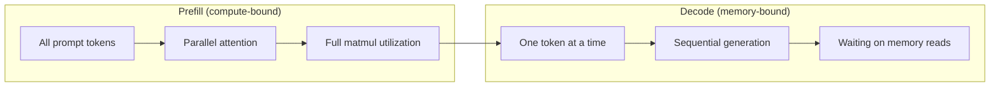
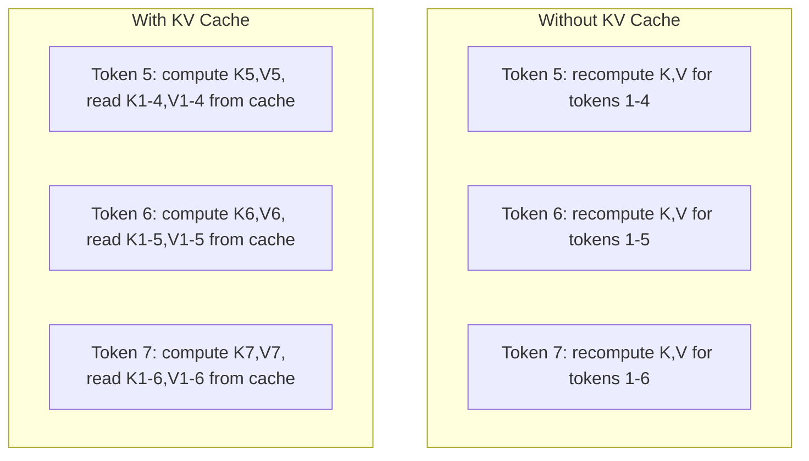
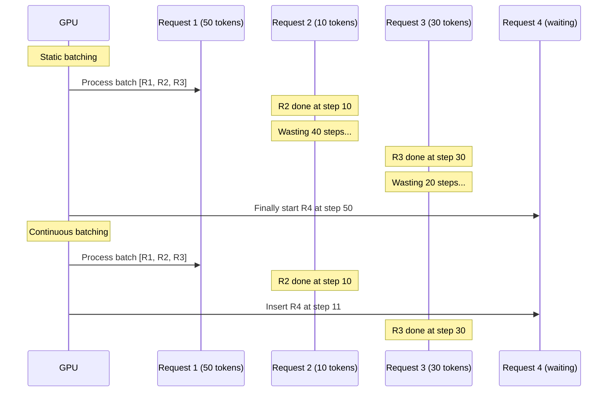
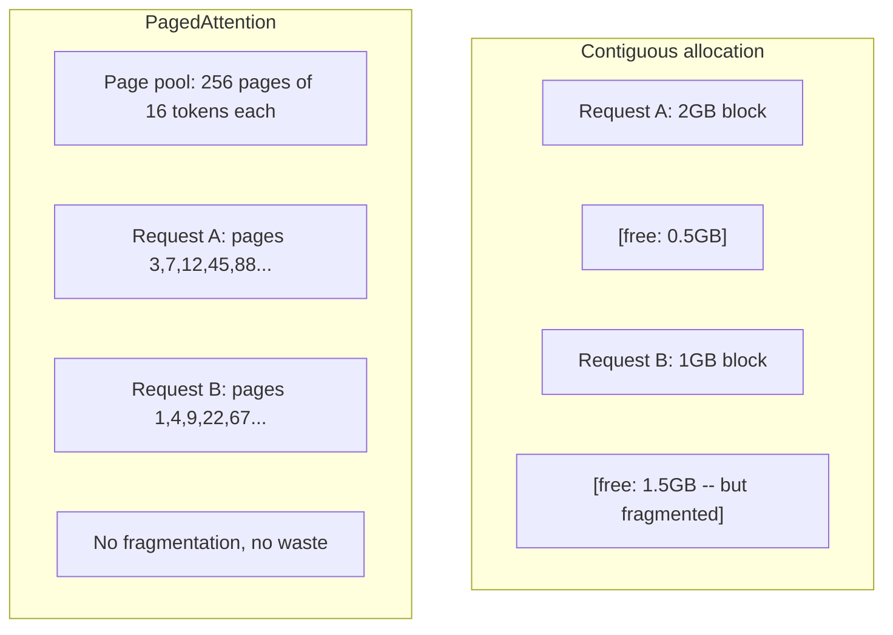
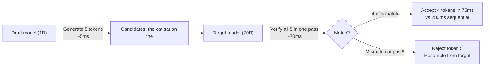

# 推理 优化

> 两个阶段定义了LLM推断――预填并处理你的提示――计算-绑定――解码一次生成一个代币――记忆-绑定――每个优化都针对其中一个或两个阶段――

**Type:** Build
**Languages:** Python
**Prerequisites:** Phase 10, Lessons 01-08 (Transformer architecture, attention)
**Time:** ~120 分钟

## 学习目标

- 实现KV缓存,以消除自行退行代币 生成期间的冗余计算
- 解释LLM推断的预填和解码阶段以及为什么两者有不同的瓶 (计算机绑定与记忆绑定)
- 实现连续批量和页面关注 概念,以在并发请求下最大化GPU利用率
- 比较推断 优化技术 KV缓存 投机解码 闪光注意)及其吞吐量/延迟 取舍

## 问题

你在4xA100GPU上部署Llama 3 70B──单个用户每秒能获得约50个代币──感觉很快──然后100个用户同时访问终端点──通过输出掉到3个代币/秒/用户──你每月25,000美元的GPU账单,提供响应速度却比人打字还慢──

模型本身在 1 个用户和 100 个用户之间没有变化.同样的权重,同样的架构,同样的数学. 改变的是你如何调度工作. 简单的推理会浪费90%以上可用的GPU计算. 47 个等待代币的用户将占据整个批量插槽,而 GPU 内存巴士在对象之间空. 同时,一个新用户的 2,000 个代币提示本可以使用有用的计算填充这个死时间.

这不是扩展问题. 这就是规划问题. 本课中的技术 - KV缓存,连续批量,PagedAttention,推测解码,预先缓存 - 正是将每月25万美元的推断 账单与每月5万美元的服务相同流量的账单区分开关键.

在4xA100-80GB上服务Llama 3 70B 时,在低并发下达到约50个代币/秒/用户,并通过连续批量和 PagedAttention 在 100 个并发请求下维持15-25 TPS/用户──没有这些优化,同样的硬件在该并发下只能提供5 TPS/用户──同样的GPU──同样的模型,吞吐量提升4倍──

## 概念

### 预填与解码

每个士推断的请求都有两个不同的阶段.

**Prefill**处理整个输入提示──所有代币都已知,因此注意力可以在完整的序列上并行计算──这是一个大型矩阵乘法--GPU核心会保持忙碌──瓶是计算:你的硬件每秒能提供多少FLOPS──A100可达到 312 TFLOPS (BF16)──在单张A100 上,70B 模型对 4,096-代币提示做预填 需要约400ms──

**Decode**一次生成输出代币――每次传递的新代币都会参加所有前代币,但每次传递只会产生一个代币――重量矩阵的尺寸和预填的时间相同,但你使用单个向量而不是矩阵去乘它们――GPU核心在微秒级完成,然后等待下一批重量从内存到达――瓶是内存带宽:你能以多快速将模型重量从HBM到计算单元――A100流有2TB/s带宽――70B模型使用FP16是140GB――完整阅读一次模型需要70ms――这就是单次解码的下限――



**ops:byte ratio**(也称算术强度) 刻画了这种取舍――它衡量每一个从内存加载一个字节,你执行多少操作――

```
ops:byte ratio = FLOPs per token / bytes read from memory
```

在 4,096 个代币的批量中,每次加载一个重量,你会执行约 4,096 次的乘积积运算.这个比率很高. 你是计算的. 在批量大小为 1 的解码中,每次加载一个重量,你只执行约 1 次的运算.这个比率很低. 你是记忆的.

核心洞察:*解码是记忆的,因为你读取整个模型只能产生一个代币*──下面的每个优化,要么减少读取内容,要么增加每次读取所处理的代币批量,要么完全避免读取──

### 存储器

在注意中,每个代币的查询会关注每一个前一个代币的关键和值向量――没有缓存时,生成代币 N 需要重新计算前面 N-1个代币的关键和值预测――代币 1 在生成代币 2 时被投影,然后生成代币 3 时又一次,生成代币 4 时又一次――到 1,000 时,你已经投影代币 1 了 999 次――

存储所有前代币的关键和值预测――生成代币N 时,你只计算代币N的关键和值,然后将它们与代币1到N-1的缓存K/V拼写起来――



**KV cache 的 memory 公式：**

```
KV cache size = 2 * num_layers * num_kv_heads * head_dim * seq_len * bytes_per_param
```

对于Llama 3 70B ((80层、8KV头,GQA、头_dim=128、BF16):

```
per token: 2 * 80 * 8 * 128 * 2 bytes = 327,680 bytes = 320 KB
at 4,096 tokens: 320 KB * 4,096 = 1.28 GB
at 128K tokens: 320 KB * 131,072 = 40 GB
```

一个Llama 3 70B的 128K语境对话会耗耗40GBKV缓存--半张A100的内存──100个并发用户、每个人4K代币时,只需要128GB的KV缓存──这就是为什么KV缓存管理是推断优化核心挑战──

### 连续批量

静态批量会等待一批N 个请求到达,将它们一起处理,并等到*全部*完成后才接受新请求――如果一个请求需要500个代币,另一个需要10个,短请求完成后还需要置490个解码步骤――

连续批量 (也称为代级批量) 将在任意请求完成后立即把新请求插入批量. 每个解码步骤都会重新评估批量.



产量提升取决于输出长度的变化程度──长度一致时,连续批量与静态批量相等──长度可变时,常见情况,连续批量可以提供2-5倍更高的产量,因为GPU槽永远不会空置──

### 页面关注

每个请求的KV缓存是一个连续内存块――随着请求到达和离开,内存会碎片化――就像操作系统中的RAM碎片化――一个4K标记的请求需要连续1.28GB的请求――即使总共2GB免费,你也可能没有1.28GB的连续*――你要浪费内存,要么拒绝请求――

页面注意力 (PageAttention) 来自vLLM) 将使用OS式虚拟内存用于KV缓存――它不是为每个请求分配一个连接的区块,而是分配固定的大小的"页面"――通常每页16个代币)――页面可以位于物理GPU内存的任何位置――页面表将每个请求的逻辑序列位置映射到物理页面位置――



页面关注 还支持共享预写的**copy-on-write**如果 50 个请求共享同一个系统提示,该系统提示的 KV缓存页面只存储一次,并被 50 个请求共同引用.

报告称,通过PagedAttention可实现接近零的记忆浪费 (约4%,而无明的分配为约60-80%) ⋅

### 投机式解码

解码慢是因为它是序列的--你生成一个代币,把它反回去,再生成下一个.

投机解码 使用一个小而快的**draft model**生成 K 个候选标志──大型**target model**随后在单次前进通行中处理所有K个候选人(看起来像预填 - 平行、计算-绑定、高效) ⋅如果目标模型同意草案模型的预测,你就在一次目标前进通行时间内接受所有K个代币――如果它在位置 j 不同意,你接受代币 1 到 j-1,并丢弃其余部分――



速度取决于**acceptance rate**通过Llama 3 8B 为Llama 3 70B做草稿时,在自然语言中典型的接受率为70-85%──这将转化为2~3倍的解码速度──

投机解码的三种方法:

| Method | Draft source | Acceptance rate | Overhead |
|--------|-------------|-----------------|----------|
| Draft-target (Leviathan et al.) | 独立小模型 | 70-85% | Draft model memory |
| EAGLE (Li et al.) | Target 上的轻量 head | 75-90% | ~1% extra parameters |
| N-gram lookup | Token n-gram table | 40-60% | 可忽略 |

**EAGLE**在目标模型的隐藏状态上训练一个小型的自动降级头――它使用目标模型的倒数第二层功能来预测下一个代币的嵌入.因为它操作的是目标模型的自身表示,而不是独立模型的),所以可以以极少的额外内存获得更高的接受率.

**N-gram speculative decoding**维护来自当前的背景或预构建的体积的n-gram延续表. 如果草案匹配与此前出现的内容,它将以零神经网络的总费率进行触发.

投机解码是数学上精确的--输出分布与目标模型的分布完全相同――它不是近似的――验证步骤 确保每个被接受的代币都具有目标模型的确切概率――

### 预写 缓存

许多请求共享相同的预写.Chatbot系统提示――RAG文本区块――少拍的例子设置――没有预写.

当新请求带着已知预写到达时,系统会复制 (或引用) 缓存的KV输入,并只计算独特的后音的KV──

对于所有请求共享的2000代币系统提示,预先缓存会消除每个请求的400ms预先填写. 在100个请求/秒钟,这每秒节省了40秒的GPU计算 - - 超过一张GPU的工作量.

根据代币内容索引代币.任何匹配存储的代币的请求都会免费获得其KV缓存. 该树支持部分代币匹配.

### 推进引擎

三个引擎 主导生产 LLM服务:

| Engine | Key innovation | Best for |
|--------|---------------|----------|
| vLLM | PagedAttention、continuous batching | 通用 serving、最高兼容性 |
| SGLang | RadixAttention（prefix caching）、structured generation | Multi-turn chatbots、constrained decoding |
| TensorRT-LLM | NVIDIA kernel fusion、FP8 quantization | NVIDIA hardware 上的最大 single-GPU throughput |

**vLLM**是默认起点──它支持最广泛的模型,可在任何GPU供应商 (NVIDIA、AMD、Intel) 上运行,并通过 PagedAttention +连续批量实现强度吞吐量──OpenAI兼容的API意味着你可以将其作为任何OpenAI API调用的替代品直接连接──

**SGLang**建立在与vLLM相似的基础上,但增加了用于预写缓存的RadixAttention,以及用于结构化的LLM程序的域特定语言.如果您的工作负载包含多轮对话,工具使用或限制式解码,JSON输出,雷杰克斯指导的生成),SGLang往往能通过预写重复使用比vLLM快 2-5倍.

**TensorRT-LLM**将模型编译成优化NVIDIA GPU内核――它融合操作(注意+线性+激活在一个内核中),在H100 GPU上使用FP8,并与NVIDIA Triton 推广服务器集成进行生产部署――它在NVIDIA硬件上实现最高单个GPU吞吐量,但设置更多,并且仅适用于NVIDIA GPUs――

拉马370B 的真实世界数字(4xA100-80GB,BF16):

| Metric | vLLM | SGLang | TensorRT-LLM |
|--------|------|--------|---------------|
| Throughput（1 user） | ~50 TPS | ~55 TPS | ~65 TPS |
| Throughput（100 users） | ~2,500 total TPS | ~3,200 total TPS | ~3,000 total TPS |
| Time to first token | ~400ms | ~300ms（prefix hit） | ~350ms |
| Max context | 128K | 128K | 128K |

### 字节 框架

你无法优化自己,没有测量的东西.ops:byte ratio会告诉你工作负载是计算的,也是记忆的,而这决定了什么优化是真正重要的.

```
Compute roof: peak FLOPS of the GPU
Memory roof:  peak bandwidth * ops:byte ratio
```

当 ops:byte 较低时 ((decode、小批量),你会触及内存带宽屋顶──增加更多的计算──更高的时钟、更多的核心) 没有帮助──你需要减少内存阅读──量子化、KV缓存压缩),或增加批量,将阅读 分摊到更多有用工作上──

当 ops:byte 较高时 ((prefill、大批量),你会触及计算屋顶──内存带宽优化没有帮助──你需要更快的GPU、核融合或更低精度来挤出更多的FLOPS──

| Scenario | ops:byte | Bound | Optimize with |
|----------|----------|-------|---------------|
| Prefill, batch=1 | ~4,096 | Compute | Kernel fusion, FP8 |
| Decode, batch=1 | ~1 | Memory | Quantization, KV compression |
| Decode, batch=32 | ~32 | Memory | Larger batch, continuous batching |
| Decode, batch=256 | ~256 | Transitioning | 两者都重要 |
| Decode, batch=1024 | ~1,024 | Compute | Kernel fusion, tensor parallelism |

超过156个时,你是记忆绑定的.高于156个时,你是计算绑定的.


```figure
context-window-slide
```

## 构建它

### 步骤1:从零实现KV缓存

我们构建了一个多头KV缓存,按层,头,存储密钥和值预测,并显示内存增长模式.

```python
import numpy as np

class KVCache:
    def __init__(self, num_layers, num_heads, head_dim, max_seq_len, dtype=np.float16):
        self.num_layers = num_layers
        self.num_heads = num_heads
        self.head_dim = head_dim
        self.max_seq_len = max_seq_len
        self.dtype = dtype

        self.k_cache = np.zeros(
            (num_layers, num_heads, max_seq_len, head_dim), dtype=dtype
        )
        self.v_cache = np.zeros(
            (num_layers, num_heads, max_seq_len, head_dim), dtype=dtype
        )
        self.seq_len = 0

    def update(self, layer_idx, new_keys, new_values):
        num_new = new_keys.shape[1]
        end = self.seq_len + num_new
        self.k_cache[layer_idx, :, self.seq_len:end, :] = new_keys
        self.v_cache[layer_idx, :, self.seq_len:end, :] = new_values
        return (
            self.k_cache[layer_idx, :, :end, :],
            self.v_cache[layer_idx, :, :end, :]
        )

    def advance(self, num_tokens):
        self.seq_len += num_tokens

    def memory_bytes(self):
        return self.k_cache.nbytes + self.v_cache.nbytes

    def used_bytes(self):
        per_token = 2 * self.num_layers * self.num_heads * self.head_dim * np.dtype(self.dtype).itemsize
        return per_token * self.seq_len
```

### 步骤2: 使用KV缓存注意

一个简化的多头注意,在解码步骤中使用KV缓存.

```python
def scaled_dot_product_attention(query, keys, values):
    head_dim = query.shape[-1]
    scores = np.matmul(query, keys.transpose(0, 1, 3, 2)) / np.sqrt(head_dim)
    seq_len_q = scores.shape[-2]
    seq_len_k = scores.shape[-1]
    if seq_len_q > 1:
        mask = np.triu(np.ones((seq_len_q, seq_len_k), dtype=np.float32), k=seq_len_k - seq_len_q + 1)
        scores = scores + mask * (-1e9)
    max_scores = np.max(scores, axis=-1, keepdims=True)
    exp_scores = np.exp(scores - max_scores)
    attn_weights = exp_scores / np.sum(exp_scores, axis=-1, keepdims=True)
    return np.matmul(attn_weights, values)


class MultiHeadAttention:
    def __init__(self, d_model, num_heads):
        self.num_heads = num_heads
        self.head_dim = d_model // num_heads
        scale = np.sqrt(2.0 / d_model)
        self.W_q = np.random.randn(d_model, d_model).astype(np.float32) * scale
        self.W_k = np.random.randn(d_model, d_model).astype(np.float32) * scale
        self.W_v = np.random.randn(d_model, d_model).astype(np.float32) * scale
        self.W_o = np.random.randn(d_model, d_model).astype(np.float32) * scale

    def forward(self, x, kv_cache=None, layer_idx=0):
        batch, seq_len, d_model = x.shape
        Q = np.matmul(x, self.W_q).reshape(batch, seq_len, self.num_heads, self.head_dim).transpose(0, 2, 1, 3)
        K = np.matmul(x, self.W_k).reshape(batch, seq_len, self.num_heads, self.head_dim).transpose(0, 2, 1, 3)
        V = np.matmul(x, self.W_v).reshape(batch, seq_len, self.num_heads, self.head_dim).transpose(0, 2, 1, 3)

        if kv_cache is not None:
            K_full, V_full = kv_cache.update(layer_idx, K[0], V[0])
            K = K_full[np.newaxis, :, :, :]
            V = V_full[np.newaxis, :, :, :]
            if seq_len == 1:
                kv_cache.advance(1)

        attn_out = scaled_dot_product_attention(Q, K, V)
        attn_out = attn_out.transpose(0, 2, 1, 3).reshape(batch, -1, d_model)
        return np.matmul(attn_out, self.W_o)
```

### 步骤3:连续批量模拟器

它模拟静态批发与连续批发之间的调度差异.

```python
import heapq

class Request:
    def __init__(self, request_id, prompt_tokens, output_tokens, arrival_step):
        self.request_id = request_id
        self.prompt_tokens = prompt_tokens
        self.output_tokens = output_tokens
        self.arrival_step = arrival_step
        self.tokens_generated = 0
        self.start_step = None
        self.end_step = None

    def is_done(self):
        return self.tokens_generated >= self.output_tokens


def simulate_static_batching(requests, batch_size):
    step = 0
    completed = []
    queue = list(requests)
    queue.sort(key=lambda r: r.arrival_step)

    while queue:
        batch = []
        while queue and len(batch) < batch_size:
            r = queue.pop(0)
            r.start_step = max(step, r.arrival_step)
            batch.append(r)

        if batch:
            step = max(step, max(r.start_step for r in batch))
            max_output = max(r.output_tokens for r in batch)
            for r in batch:
                r.tokens_generated = r.output_tokens
                r.end_step = step + max_output
            step += max_output
            completed.extend(batch)

    return completed


def simulate_continuous_batching(requests, batch_size):
    step = 0
    completed = []
    queue = sorted(requests, key=lambda r: r.arrival_step)
    queue_idx = 0
    active = []
    waiting = []

    while queue_idx < len(queue) or active or waiting:
        while queue_idx < len(queue) and queue[queue_idx].arrival_step <= step:
            waiting.append(queue[queue_idx])
            queue_idx += 1

        while waiting and len(active) < batch_size:
            r = waiting.pop(0)
            r.start_step = step
            active.append(r)

        if not active:
            if waiting:
                step += 1
                continue
            elif queue_idx < len(queue):
                step = queue[queue_idx].arrival_step
                continue
            else:
                break

        for r in active:
            r.tokens_generated += 1

        done = [r for r in active if r.is_done()]
        for r in done:
            r.end_step = step + 1
            completed.append(r)
        active = [r for r in active if not r.is_done()]

        step += 1

    return completed


def batching_stats(completed):
    latencies = [r.end_step - r.arrival_step for r in completed]
    total_time = max(r.end_step for r in completed) - min(r.arrival_step for r in completed)
    total_tokens = sum(r.output_tokens for r in completed)
    return {
        "avg_latency": np.mean(latencies),
        "p50_latency": np.median(latencies),
        "p99_latency": np.percentile(latencies, 99),
        "total_time": total_time,
        "throughput": total_tokens / total_time if total_time > 0 else 0,
    }
```

### 步骤 4: 预写缓存

一个基于trie的预写缓存,用于存储共享预写的KV输入.

```python
class TrieNode:
    def __init__(self):
        self.children = {}
        self.kv_data = None
        self.hit_count = 0


class PrefixCache:
    def __init__(self, max_entries=1000):
        self.root = TrieNode()
        self.max_entries = max_entries
        self.total_entries = 0
        self.hits = 0
        self.misses = 0

    def _walk(self, token_ids):
        node = self.root
        depth = 0
        for tid in token_ids:
            if tid not in node.children:
                break
            node = node.children[tid]
            depth += 1
        return node, depth

    def lookup(self, token_ids):
        node, depth = self._walk(token_ids)
        if depth > 0:
            self.hits += 1
            current = self.root
            for tid in token_ids[:depth]:
                current = current.children[tid]
                current.hit_count += 1
            kv_entries = []
            current = self.root
            for tid in token_ids[:depth]:
                current = current.children[tid]
                if current.kv_data is not None:
                    kv_entries.append(current.kv_data)
            return depth, kv_entries
        self.misses += 1
        return 0, []

    def insert(self, token_ids, kv_per_token):
        node = self.root
        for i, tid in enumerate(token_ids):
            if tid not in node.children:
                if self.total_entries >= self.max_entries:
                    return i
                node.children[tid] = TrieNode()
                self.total_entries += 1
            node = node.children[tid]
            if i < len(kv_per_token):
                node.kv_data = kv_per_token[i]
        return len(token_ids)

    def hit_rate(self):
        total = self.hits + self.misses
        return self.hits / total if total > 0 else 0.0
```

### 步骤 5: 投机解码器

我们使用可配置的接受率模拟草案目标猜测解码.

```python
class DraftModel:
    def __init__(self, vocab_size, acceptance_rate=0.8):
        self.vocab_size = vocab_size
        self.acceptance_rate = acceptance_rate

    def generate(self, context, num_tokens):
        tokens = np.random.randint(0, self.vocab_size, size=num_tokens)
        return tokens

    def get_probs(self, context, token):
        probs = np.random.dirichlet(np.ones(self.vocab_size))
        return probs


class TargetModel:
    def __init__(self, vocab_size):
        self.vocab_size = vocab_size

    def get_probs(self, context, tokens=None):
        if tokens is not None:
            return [np.random.dirichlet(np.ones(self.vocab_size)) for _ in tokens]
        return np.random.dirichlet(np.ones(self.vocab_size))


def speculative_decode(draft_model, target_model, context, num_speculative=5,
                       draft_cost=1.0, target_cost=10.0, verify_cost=12.0):
    total_tokens = 0
    total_cost = 0.0
    accepted_counts = []
    context = list(context)

    max_tokens = 100

    while total_tokens < max_tokens:
        draft_tokens = draft_model.generate(context, num_speculative)
        total_cost += draft_cost * num_speculative

        target_probs = target_model.get_probs(context, draft_tokens)
        total_cost += verify_cost

        accepted = 0
        for i, token in enumerate(draft_tokens):
            draft_p = draft_model.get_probs(context + list(draft_tokens[:i]), token)
            target_p = target_probs[i]

            r = np.random.random()
            acceptance_prob = min(1.0, target_p[token] / (draft_p[token] + 1e-10))

            if r < draft_model.acceptance_rate:
                accepted += 1
                context.append(token)
                total_tokens += 1
            else:
                new_token = np.random.choice(draft_model.vocab_size, p=target_p)
                context.append(new_token)
                total_tokens += 1
                break

        accepted_counts.append(accepted)

        if accepted == num_speculative:
            bonus_probs = target_model.get_probs(context)
            bonus_token = np.random.choice(draft_model.vocab_size, p=bonus_probs)
            context.append(bonus_token)
            total_tokens += 1

    sequential_cost = total_tokens * target_cost
    return {
        "total_tokens": total_tokens,
        "speculative_cost": total_cost,
        "sequential_cost": sequential_cost,
        "speedup": sequential_cost / total_cost if total_cost > 0 else 1.0,
        "avg_accepted": np.mean(accepted_counts),
        "acceptance_rate": np.mean(accepted_counts) / num_speculative,
    }


def compare_speculation_strategies(vocab_size=1000, num_trials=20):
    results = {}

    for name, acceptance_rate, spec_tokens in [
        ("Draft-target (8B->70B)", 0.78, 5),
        ("EAGLE", 0.85, 6),
        ("N-gram", 0.50, 4),
        ("No speculation", 0.0, 0),
    ]:
        if spec_tokens == 0:
            results[name] = {
                "speedup": 1.0,
                "acceptance_rate": 0.0,
                "avg_accepted": 0.0,
            }
            continue

        trial_results = []
        for _ in range(num_trials):
            draft = DraftModel(vocab_size, acceptance_rate=acceptance_rate)
            target = TargetModel(vocab_size)
            context = list(np.random.randint(0, vocab_size, size=10))
            result = speculative_decode(draft, target, context, num_speculative=spec_tokens)
            trial_results.append(result)

        results[name] = {
            "speedup": np.mean([r["speedup"] for r in trial_results]),
            "acceptance_rate": np.mean([r["acceptance_rate"] for r in trial_results]),
            "avg_accepted": np.mean([r["avg_accepted"] for r in trial_results]),
        }

    return results
```

### 步骤 6: KV缓存内存配置文件

计算真实模型配置的KV缓存存储器要求――

```python
MODEL_CONFIGS = {
    "Llama-3-8B": {
        "num_layers": 32, "num_kv_heads": 8, "head_dim": 128,
        "model_params_b": 8, "gqa": True,
    },
    "Llama-3-70B": {
        "num_layers": 80, "num_kv_heads": 8, "head_dim": 128,
        "model_params_b": 70, "gqa": True,
    },
    "Llama-3-405B": {
        "num_layers": 126, "num_kv_heads": 8, "head_dim": 128,
        "model_params_b": 405, "gqa": True,
    },
    "Mistral-7B": {
        "num_layers": 32, "num_kv_heads": 8, "head_dim": 128,
        "model_params_b": 7, "gqa": True,
    },
    "GPT-4-est": {
        "num_layers": 120, "num_kv_heads": 96, "head_dim": 128,
        "model_params_b": 1800, "gqa": False,
    },
}


def kv_cache_memory(config, seq_len, dtype_bytes=2):
    per_token = 2 * config["num_layers"] * config["num_kv_heads"] * config["head_dim"] * dtype_bytes
    total = per_token * seq_len
    return {
        "per_token_bytes": per_token,
        "per_token_kb": per_token / 1024,
        "total_bytes": total,
        "total_mb": total / (1024 ** 2),
        "total_gb": total / (1024 ** 3),
    }


def memory_budget(config, gpu_memory_gb, model_dtype_bytes=2, kv_dtype_bytes=2):
    model_memory_gb = config["model_params_b"] * 1e9 * model_dtype_bytes / (1024 ** 3)
    overhead_gb = gpu_memory_gb * 0.1
    available_for_kv = gpu_memory_gb - model_memory_gb - overhead_gb

    if available_for_kv <= 0:
        return {"error": "Model does not fit in GPU memory", "model_memory_gb": model_memory_gb}

    per_token = 2 * config["num_layers"] * config["num_kv_heads"] * config["head_dim"] * kv_dtype_bytes
    max_tokens = int(available_for_kv * (1024 ** 3) / per_token)

    return {
        "gpu_memory_gb": gpu_memory_gb,
        "model_memory_gb": round(model_memory_gb, 1),
        "overhead_gb": round(overhead_gb, 1),
        "available_for_kv_gb": round(available_for_kv, 1),
        "max_total_tokens": max_tokens,
        "max_users_at_2k": max_tokens // 2048,
        "max_users_at_4k": max_tokens // 4096,
        "max_users_at_32k": max_tokens // 32768,
    }
```

## 使用它

使用vLLM:

```python
from vllm import LLM, SamplingParams

llm = LLM(
    model="meta-llama/Llama-3-70B-Instruct",
    tensor_parallel_size=4,
    enable_prefix_caching=True,
    max_model_len=8192,
    gpu_memory_utilization=0.9,
)

params = SamplingParams(temperature=0.7, max_tokens=256)
outputs = llm.generate(["Explain inference optimization in one paragraph."], params)
```

使用SGLang做预写缓存 +结构输出:

```python
import sglang as sgl

@sgl.function
def classify(s, text):
    s += sgl.system("You are a classifier. Output JSON only.")
    s += sgl.user(f"Classify this text: {text}")
    s += sgl.assistant(sgl.gen("result", regex=r'\{"label": "(positive|negative|neutral)"\}'))

runtime = sgl.Runtime(model_path="meta-llama/Llama-3-70B-Instruct", tp_size=4)
sgl.set_default_backend(runtime)

results = classify.run_batch([
    {"text": "This product is amazing!"},
    {"text": "Terrible experience."},
    {"text": "It was okay I guess."},
])
```

使用TensorRT-LLM:

```python
import tensorrt_llm
from tensorrt_llm.runtime import ModelRunner

runner = ModelRunner.from_dir("./llama-70b-trt-engine/", rank=0)

outputs = runner.generate(
    batch_input_ids=[tokenizer.encode("Explain KV caching.")],
    max_new_tokens=256,
    temperature=0.7,
)
```

## 交付它

本课产出:
- `outputs/skill-inference-optimization.md`-- 一个用于诊断和优化LLM推断服务的技能

## 练习

1. 修改KV缓存配置文件,比较FP16对FP8对INT4KV缓存量化――对于4K背景下,计算每种设置在4xA100-80GB上最大并发用户数量――KV量化到INT4应该大约让用户容量增加4倍――

2. 扩展连续批量 模拟器,以跟踪GPU使用(每一步被填满的批量插槽比如) ・对静态和连续批量 分别绘制利用时间,其中50个请求的输出长度服从帕雷托分布(形状=1.5尺寸=20) ・连续批量应保持>80%的利用量。

3. 实现一个集成查询注意的版本的KV缓存,其中`num_kv_heads < num_query_heads`拉马3 70B 使用 64 个查询头,但只有 8 个KV头――计算相对于完整的多头注意力的存储存储量(KV缓存大小减少了 8 倍)

4. 构建一个使用 LRU 驱逐的预写缓存.将设置为500,并生成1,000个请求,其中60%共享5个常见预写之一.测量击率并与无限缓存比较.

5. 扩展投机解码器 模拟器,实现基于树的投机(EAGLE-2风格) ――不是单条 K个草案代币的链,而是产生候选人树(例如每3层各 2个分支 = 8个叶子候选人) ――比较每一个验证轮 接受的全部代币与线性投机的差异──

## 关键术语

| Term | 人们怎么说 | 它实际意味着什么 |
|------|----------------|----------------------|
| Prefill | "Processing the prompt" | 在所有输入 tokens 上并行计算 attention -- compute-bound，因为完整 matrix multiplication 会让 GPU cores 保持忙碌 |
| Decode | "Generating tokens" | 每次 forward pass 产生一个 token，每次都读取完整 model weights -- memory-bound，因为 compute 会在下一批 weights 到达前完成 |
| KV cache | "Caching attention states" | 存储所有 previous tokens 的 key 和 value projections，使它们不会在每个 decode step 被重新计算 -- 用 memory 换 compute |
| Continuous batching | "Dynamic batching" | 在任何请求完成后立即将新请求插入 running batch，每个 decode iteration 都进行评估，而不是等待整个 batch |
| PagedAttention | "Virtual memory for KV cache" | 用固定大小 pages 而不是 contiguous blocks 分配 KV cache，消除 memory fragmentation，并为 shared prefixes 启用 copy-on-write |
| Speculative decoding | "Draft and verify" | 使用快速 draft model 提出多个 tokens，然后在一次 target model forward pass 中全部验证 -- 数学上精确，2-3 倍 speedup |
| EAGLE | "Self-speculative decoding" | 一种 speculative decoding 变体，在 target model 自身的 hidden states 上训练 lightweight head，相比独立 draft model 获得更高 acceptance rates |
| Prefix caching | "Reusing system prompt KV" | 为 common prefixes（system prompts、few-shot examples）存储已计算的 KV cache entries，并跨请求复用它们以跳过冗余 prefill |
| Ops:byte ratio | "Arithmetic intensity" | Compute operations 与读取的 memory bytes 之比 -- 决定 workload 是 compute-bound（高 ratio）还是 memory-bound（低 ratio） |
| Time to first token | "TTFT" | 从接收请求到产生第一个输出 token 的延迟 -- 对于长 prompts，主要由 prefill time 主导 |

## 延伸阅读

- 昆等人",用页面注意力服务的大语言模型的有效内存管理" (2023) --介绍页面KV缓存管理的vLLM论文,如今它已成为推断服务的行业标准
- 利维亚坦等",通过推测解码从变压器快速推理" (2023) -- 基础论文,证明草案验证推测 在实现2-3倍的加速同时,会产生精确的目标模型分布
- 李等人",EAGLE:投机性样本采集需要重新思考特征不确定性" (2024) -- 通过在目标模型 自身特征 上训练头,而不是使用独立的草案模型,获得更高的接受率
- 等人",SGLang:结构化语言模型程序的有效执行" (2024) --介绍用于预写缓存的RadixAttention以及用于多调用LLM程序的编程模型
- 威廉姆斯等人",屋顶线:多核架构的洞察力视觉性能模型" (2009) -- 原始的屋顶线纸,形式化用于推理计算与记忆瓶的 ops:byte 框架
