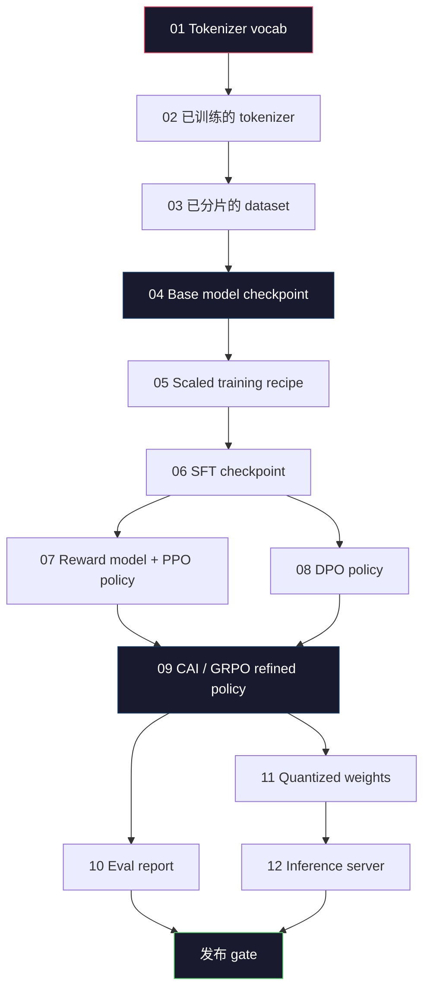
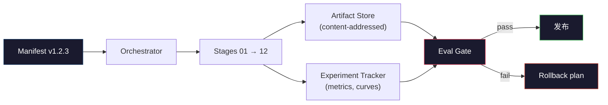

# 构建完整的LLM管道

> 课程01到12的内容都是同一管道的一个阶段. 本课是把这些阶段转化为一个端到端运行的脚本架:托克尼化,预训练,规模,SFT,配线,评估,量化,服务.你不会在笔记本电脑上训练一个70B模型.你会出台一个管弦层,表现,时代门和滚动套件计划,也就是2026年边境团队用决定什么可以发布的机制.这是本阶段的关键石.

**Type:** Build
**Languages:** Python (stdlib)
**Prerequisites:** All Phase 10 lessons 01-12
**Time:** ~120 minutes

## 学习目标
- 将前十一课) 组合成一个可复制的管道规范
- 定义各阶段之间的文物合同:每个阶段消费什么,产出什么,以及下一个阶段如何验证输入
- 构建一个管弦仪,用于跟踪实验,对文物进行哈希,并根据评估门决定是否通过发布门
- 设计回归计划:哪些文物重建运行成本低,哪些成本高以及一个破产的检查点会带来什么代价

## 问题
前面的课程每一课都能独立工作――托基纳化器 已训练完成――Tiny GPT 已完成预训练――SFT数据集 已组装――回报模型 已训练――DPO 已运行――等价 已测量――量化权重 已导出――输入服务器 已启动――每项都是笔记本书――每项都有自己的约定、自己的输出路径、自己的种子――

边境训练运行 不是笔记本电脑――Llama 3 405B 大约花了3000万H100小时,持续了54天――DeepSeek-V3花了约2.8亿H800小时――在这段时间里,一个坏的检查点――一次数据污染――一次评估回归,都可能让团队损失一周的墙钟和一个月的GPU预算――团队靠管道卫生生存下来:每个阶段都有确定的输入,确定的输出,确定的表现,和门――

这就是终点石. 你不会在笔记本电脑上端到端运行整个管道. 你会编写协调各阶段的管弦演员.

这种模式从100M到1T参数都不变.相同的四个组件 - - 显现器,乐团器,门,文物商店 - - 既能运行Llama 3,也能运行您的余额GPT.

## 概念
### 十二个阶段

每一节10阶段课程都是一个阶段. 下面是完整的依赖图.



阶段 07 和 08 可以并行运行. 其它所有阶段都是硬依赖.

### 显而易见的

文件是单一文件,它必须完整到足以重播的描述.

```
pipeline_version: 1.2.3
seed: 42
git_commit: a1b2c3d4
stages:
  01_tokenizer:
    recipe: bpe_32k
    input_hash: sha256:...
    output_hash: sha256:...
    wall_clock_sec: 3600
    cost_usd: 12
```

阶段 N 的输出哈希就是阶段 N+1 的输入哈希――只要有任何偏差,管道就会停止――这就是你尽早发现数据腐败的方法――这也是不同大陆的队友验证他们的重播是否产生与你相同的文物的方式――

实践中,团队将使用一个小型的YAML方案,加上一个明示检查器,用于和上一次成功运行做不同.

### 工艺品的类型

每个阶段的输出都是打字的文物――不是一个目录,不是,而是一个带有已知方案的命名类型――

| Stage | Artifact Type | Key Fields |
|-------|--------------|-----------|
| 01-02 | Tokenizer | vocab.json, merges.txt, config.json, hash |
| 03 | Dataset | shards[], row count, token count, dedup stats |
| 04-05 | Checkpoint | weights.safetensors, config.json, optimizer state, step count |
| 06 | SFT Model | checkpoint + SFT recipe + data mix |
| 07 | Reward Model | RM checkpoint + preference data hash |
| 08-09 | Policy | checkpoint + reference hash + beta + KL budget consumed |
| 10 | Eval Report | benchmark scores + regression diffs + eval data hash |
| 11 | Quantized Model | quantized weights + calibration data + accuracy delta vs FP16 |
| 12 | Server Spec | endpoint + model hash + config + observability hooks |

输入 能防止最常见的失败模式:把阶段08的输出当成阶段06的输入,通过SFT 路径发布一个DPO 训练过的模型――类型的文物和类型的阶段签名将使这些错误变成编译时失败,而不是第五天才发现的失败――

### 伊瓦尔门

发布不是培训完成──发布是培训完成和评估门通过──门 在运行开始前就定义好──

```
gates:
  mmlu:      >= baseline + 0.5   # 无 regression
  humaneval: >= baseline + 1.0
  truthfulqa: >= baseline         # 无下降
  safety_refusal_rate: <= 0.05
  kl_from_reference: <= 25.0
  cost_total_usd: <= 50000
```

每个门都是数字门──没有看起来很好门──没有主观的签名──如果所有门都通过,文物将被标记为可运输的──如果任何门失败,这次运行将被保留,等待具名评审员的明显的过失,而过失本人也将记录到明示中──

两个门户能抓住大多数灾难――*退缩*门(新模型在核心基准上必须至少和之前一样好) 能抓住训练错误――*KL预算*门(相一致的政策 偏离参考程度不能超过X) 能抓住对齐过度加工――每个生产管道都同时拥有这两种――

### 乐团主持人

这是一个小段代码,读取表格,发送阶段,跟踪文物,在任何违反合同上停止.

乐团主管的职责很狭:

1. 从表达 解析 DAG──
2. 对于每个阶段,检查预期输出是否已经正确存在 hash 
3. 运行该阶段,捕获stdout/stderr,测量墙钟和成本
4. 根据下游阶段预期的输入哈希验证输出哈希――
5. 失败时,写入包含精确失败阶段的部分表达,并以非零状态退出.

这大约是200行Python. 它看起来像本课中的.`code/main.py`文件――底层真实管道 会使用`torchrun`或`ray`在集群上执行各阶段,但管弦乐员本身运行在单台机器上.

### 实验跟踪和艺术品存储

两种外部系统支管道

**Experiment tracker (wandb, neptune, mlflow).**按阶段记录损失曲线,测量指标,系统遥测. 当你需要比较运行A和运行B时,追踪器就是你看的地方.

**Artifact store (S3, R2, GCS).**通过哈希寻址而不是通过文件名.像`latest.pt`这样的文件名是脚步枪;`ckpt-7b-step-20000-sha256:abc123.safetensors`只有合同.

演唱会员 会同时写入二者──追踪者 面向看图的人──文物商店 面向需要查找输入的下一个阶段──

### 成本

边境运行 绑定一个美元号码.

**Pre-run estimate.**从表 计算预期FLOPs(预训:6x参数 x代币) 、预期GPU时间(FLOPs/峰值吞吐量/利用率),以及按当前租金率 计算的美元成本──如果估计超过预算门,管道会拒绝启动──

**In-run tracking.**阶段的墙钟和成本会记录到表. 阶段后,都会检查剩余的预算. 如果某个阶段超支,下一个阶段的门将使用新的剩余的预算进行评估.

报告的成本是$61M。DeepSeek-V3 报告 main pre-training run 为 $5.6M──这个比例主要来自硬件效率以及专家混合 - 但具体成本是可见的,因为两个团队都按阶段跟踪,而不是仅仅按整个阶段跟踪.

### 复制性与确定性

二者不同──*可复制*意味着相同的表现加相同的代码加相同的基础设施,会产生一个在下游指标上等价的检查点──*确定性*意味着比特相同的输出──

现代LLM培训是可复制的,但不是决定性的――分布式培训的减少序列、GPU内核非决定性主义(cuBLAS、闪-attn) 以及混合精度圆化会共同产生运行在1e-5 量级不同的浮间间间――对最终指标来说,这是没有问题,因为它们不会移动――但如果你试图使用比特级差异调试,这是致命的――解决方法是记录每个阶段的输入哈希,输出哈希和标题指标――如果这些匹配,即使重量不像比特一样,这次运行也算是重复的──



### 滚动计划

在运行开始之前,写下每一个阶段失败时会发生什么.

- **重新运行成本低**标记器, 标记器, 定量化, 输入服务器, 直播重新运行.
- **中等成本**(日):SFT、DPO、CAI──保留基模型;只重新运行对齐阶段──
- **成本高**们在们的前训练中,我们不需要再车,而是用最后一个好的检查点,并使用修改后的数据重新运行更便宜的下游阶段.

由于阶段依赖性是类型的和哈希的,乐队员可以自动计算滚动设置:使失败阶段及其所有后代失效.

### 2026年观察到的生产配方

大多数边境队都得到了相同的骨.

- 标记器:128k BPE 字节倒退――基于小型的平衡多语言切片训练――
- 预训练:10-20T代币,主要由网络加代码加合成组成──Muon或AdamW优化器──FSDP2或DeepSpeed ZeRO-3──渐进检查点──BF16重量,FP32主──
- 混合人和合成,并严格对评估集做分
- 配合:DPO或CAI+GRPO──只有在优先信号中使用RLHF──
- ,加上一个公开的私人,永远看不到的设置.
- 量化:服务 使用4位GPTQ或 AWQ;精度分辨率 重要安全评估 使用8位──
- 服务:vLLM、TensorRT-LLM 或内部──持续批量──可预测解码──KV缓存驱逐──

字数每六个月都会变化.


```figure
beam-search
```

## 构建它
本课代码是管弦和表现检查器,而不是十二个训练脚本.每个阶段都使用了位数控件模拟,生成具有正确形状和哈希的输出文物.

完整实现见`code/main.py`◎关键部分:

- `Manifest`数据类:管道版本、种子、git commit、阶段、门──
- `Stage`数据类:名称、类型、输入(hashes) 、输出(hash) 、墙钟、成本──
- `Orchestrator.run()`分析 DAG、发送阶段、验证哈希,更新表.
- `EvalGate.check()`读取门与最新评估报告比较 返回通过/失败
- `ArtifactStore`按哈希插入/获取,模拟S3──
- `CostTracker`阶段和累计成本,超过限制 时停止.

`main.py`中部管道会运行12个位数控器阶段,生成一个表达,并演示一个失败的评估门,以展示运行的样式.

## 使用它
尼加工作流程有三个命令.

```
python code/main.py plan    # 验证 manifest，计算 cost estimate，打印 DAG
python code/main.py run     # 执行 stages，写入 manifest.out.yaml
python code/main.py gate    # 读取 manifest.out.yaml，应用 eval gates，ship-or-hold
```

每次都先运行`plan`△大多数管道漏洞 会在计划时间 出现-- 缺失门门,固定的哈希,预算过剩――运行`plan`是免费的.`run`很贵. 通过便宜的一边抓住虫子来省钱.

`gate`输出要么是`SHIP`现在,我们要做什么?`HOLD: <reason>`◎ ◎ ◎ ◎ ◎ ◎ ◎ ◎ ◎ ◎ ◎ ◎ ◎ ◎ ◎ ◎ ◎ ◎ ◎ ◎ ◎ ◎ ◎ ◎ ◎ ◎ ◎ ◎ ◎ ◎ ◎ ◎ ◎ ◎ ◎ ◎ ◎ ◎ ◎ ◎ ◎ ◎ ◎ ◎ ◎ ◎ ◎ ◎ ◎ ◎ ◎ ◎ ◎ ◎ ◎ ◎ ◎ ◎ ◎ ◎ ◎ ◎ ◎ ◎ ◎ ◎ ◎ ◎ ◎ ◎ ◎ ◎ ◎ ◎ ◎ ◎ ◎ ◎ ◎ ◎ ◎ ◎ ◎ ◎ ◎ ◎ ◎ ◎ ◎ ◎ ◎ ◎ ◎ ◎ ◎ ◎ ◎ ◎ ◎ ◎ ◎ ◎ ◎ ◎ ◎ ◎ ◎ ◎ ◎ ◎ ◎ ◎ ◎ ◎ ◎ ◎ ◎ ◎ ◎ ◎ ◎ ◎ ◎ ◎ ◎ ◎ ◎ ◎ ◎ ◎ ◎ ◎ ◎ ◎ ◎ ◎ ◎ ◎ ◎ ◎ ◎ ◎ ◎ ◎ ◎ ◎ ◎ ◎

## 交付它
本课会产出 `outputs/skill-llm-pipeline-reviewer.md`△把一个拟议的管道公布给它,它会检查所有合同:阶段键字"",hash链"",门"",回滚计划"",成本估计――对于缺失的评估门"",没有边界的KL预算,或者混合的评估和培训数据的运行,它会拒绝批准公布――

## 练习
1. 扩展管弦乐器,让它支持阶段 07 和 08 的并行执行――使用 stdlib `concurrent.futures`确认最终表现记录了两个阶段的输出,并且阶段09的输入哈希是第二个的确定性组合.

2. 添加一个污染检查门──给定评估数据集哈希和训练数据集碎片,计算重叠(精确串匹配或13克匹配)──如果重叠超过0.1%,门失败──进入一个被污染的训练集,并确认门将保持这个次运行──

3. 从第一原则 实现一个成本估计器――对于阶段 04(预训),将FLOPs 估计为6x参数 x代币,假设H100上BF16为989 TFLOPs,MFU(模型FLOPs利用率) 为40%,价格为2.50美元/GPU-小时――报告一个在2T代币上训练的7B模型的估计――与公开的Llama 2 数字比较――

4. 构建部分滚动――模拟阶段 09(CAI) 失败,然后在保留 01-08缓存的情况下重新运行阶段 09 到 12──乐团主管应该通过哈希检查缓存文物并跳过它们──测量与完整的重新运行相比省的墙钟──

5. 增加可观测性──为每个阶段发出OpenTelemetry跨度,属性包括参数、见的代币、损失和成本──将跨度 管道传到本地收藏器──重点不是仪表板;重点是每个阶段的健康 都能通过单个痕迹ID 追踪──

## 关键术语
| Term | What people say | What it actually means |
|------|----------------|----------------------|
| Manifest | “recipe file” | 描述 pipeline version、seed、per-stage config 和 gate thresholds 的 YAML 或 JSON，足以 replay 一次 run |
| Content-addressed | “按 hash 而不是 name” | Artifacts 按其内容的 SHA-256 存储，因此你永远不会把 version A 和 version B 混淆 |
| Eval gate | “发布标准” | Benchmark metrics 和 safety scores 上的 numeric thresholds，必须通过后 artifact 才会被标记为 shippable |
| KL budget | “alignment drifted 有多远” | 对 alignment stages 上累计 KL(policy || reference) 的 cap，并作为 gate 强制执行 |
| MFU | “你用了多少 GPU” | Model FLOPs Utilization，即 achieved FLOPs 除以 theoretical peak。70B scale 典型值为 40%，7B 为 55% |
| Rollback plan | “出问题时我们做什么” | 每个阶段失败时预先写好的 actions：re-run、fall back、使用修订后的 inputs retrain |
| Orchestrator | “conductor” | 读取 manifest、dispatch stages、验证 hashes，并在任何 contract violation 时停止的 process |
| Artifact store | “用于 weights 的 versioned S3” | Immutable content-addressed object store，是 checkpoints、datasets、eval reports 的 single source of truth |
| Reproducible | “Replay 时 metrics 相同” | Bit-level weights 不同但 downstream metrics 等价，这是 distributed LLM training 的现实目标 |
| Cost gate | “不能超过 X” | Pre-run cost estimate 加 in-run tracker；如果 estimate 超过 budget，pipeline 会拒绝启动 |

## 延伸阅读
- [Dubey et al., 2024 -- "The Llama 3 Herd of Models"](https://arxiv.org/abs/2407.21783)对于边境管道 最详细的公开描述,包括数据,培训,调整,
- [DeepSeek-AI, 2024 -- "DeepSeek-V3 Technical Report"](https://arxiv.org/abs/2412.19437)-- 以效率优先的管道,成本约为Llama3类培训的10/1
- [Kaplan et al., 2020 -- "Scaling Laws for Neural Language Models"](https://arxiv.org/abs/2001.08361)--最初的计算数据参数扩展关系
- [Hoffmann et al., 2022 -- "Training Compute-Optimal Large Language Models (Chinchilla)"](https://arxiv.org/abs/2203.15556)对于卡普兰的修改,重新校准现代数据预算
- [PyTorch FSDP2 documentation](https://pytorch.org/docs/stable/fsdp.html)-- 在 PyTorch 2.4+ 中替代FSDP1的分布式训练原始
- [Weights & Biases LLM Reports](https://wandb.ai/site/llms)-- 开源LLM运行的真实表现和实验追踪器输出,可作为可借鉴的模板
