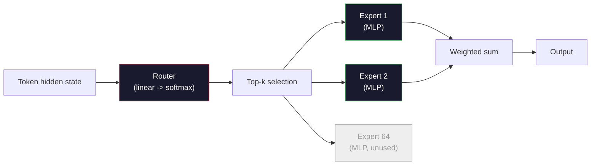

# 开放模式: 架构讲解

> 你在第4课从零构建一个GPT-2小――2026年前沿开放模型 属于同一个家族,只是有五六项具体变化――使用RMSNorm 取代LayerNorm――使用SwiGLU 取代GELU――使用RoPE 取代学到的位置――使用GQA或MLA 取代完整的MHA――使用大规模的专家混合――你已经掌握了数学覆盖了其中95%――本会并排阅读Llama 3、DeepSeek-V3、Mixtral、Qwen 和 Gemma,并指出每个架构发生分歧的确切位置――

**Type:** Learn
**Languages:** Python (stdlib)
**Prerequisites:** Phase 10, Lessons 04, 05, 12 (Pre-training, Scaling, Inference)
**Time:** ~45 minutes

## 学习目标
- 阅读Llama 3、Mistral、Mixtral、Gemma 2、Qwen 2.5 和DeepSeek-V3 的配置.
- 描述每一个模型对GPT-2的具体结构变化,并从第一性原理说明理由
- 仅根据配置计算任意开放模型的参数,KV缓存大小和激活内存
- 在给定延迟,内存和能力时, 约束时,为部署目标选择合适的开放模型

## 问题
在第4课中,你写了350行的编号,得到了一个GPT-2形状模型――Llama 3 405B有一个200页的技术报告――你的直觉可能认为它们是不同的物种――实际上不是――那200页的描述是同一个对象,只是有五六个动机明确的修改,再加上关于扩展的大量实现细节――骨架没有变化:嵌入式、变压器块注意力、MLP、规范头、――

本课是一个不同之处. 对每个主要开放模型,我们会准确列出它与GPT-2相比.

实际收益是:当Meta发布Llama 5或DeepSeek发布V4时,你不需要新的心智模型――你会查看配置,看到有哪些众所周知的旋律被调动,然后知道下游影响是什么――2026年的架构是一个有限的工具箱――每个新模型只是选择不同的子集――

## 概念
### 变化不变的核心

所有的自动退缩型号都共享:

- 标志嵌入矩阵 ((语音大小 x 隐藏_dim) 』
- 个解码器块的堆叠:标准,自我注意,残留标准,MLP残留.
- 最终标准和投影到语音大小的线性头 (通常与嵌入式重量绑定)
- 原因面具,下一个代号交叉缩损失.

这就是形状. 其余都是旋.

### 六个真正起作用的节点

在所有2024-2026年前沿开放模式中,同样出现了六个设计选择:

1. **Normalization.**层规则 -> RMS规则──
2. **Positional encoding.**,我知道,我知道,我知道.
3. **Activation.** (GELU) ->  (SwiGLU)  (GELU)
4. **Attention head sharing.**美国国家安全局 -> GQA -> MQA -> MLA。
5. **Dense vs sparse MLP.**密集的 -> 专家混合物――
6. **Pre-norm placement.**保持前规则.

其他一切 (学习速度时间表,数据组合,批量大小,文本长度) 都属于训练配置,而不是架构.

### 按1:RMSNorm

层规则将减去平均值,除以STD,缩放并平移.

```
RMSNorm(x) = x / sqrt(mean(x^2) + eps) * gamma
```

没有平均值消除──没有偏见──每个代币少一次 matmul── Zhang and Sennrich (2019) 认为它在机器翻译上可以匹配LayerNorm,同时快 10%──所有现代开放模型都使用它──

代价:没有──收益:小幅产量 提升,代码更简单──

### 子 2: 子

在GPT-2中,一个1024槽位的查找表.

通过在注意点产品之前,将每个Q和K向量按维度旋转来注入位置.旋转角是位置的确定性函数,所以没有需要学习的东西,也不会耗尽.借助扩展技巧.

```
q_rotated = rotate(q, angle(pos))
k_rotated = rotate(k, angle(pos))
score = q_rotated . k_rotated
```

每个Llama、Mistral、Qwen、DeepSeek 和 Gemma 都使用RoPE──Gemma 2 使用混合方式(大多数层使用RoPE,其他层使用本地滑动窗口注意)──

### 结3: 转移

 GPT-2 的 MLP 是`x -> gelu(xW1 + b1) -> (...)W2 + b2`〔SwiGLU〕Shazeer 2020) 用关闭产品 替换激活:

```
SwiGLU(x) = (xW1) * sigmoid(xW1) * xV
```

两个并行投影,而不是一个,由Swiss激活 进行门.实证上,它在每参数的困难上更强.Llama 2 采用它,然后大家都跟进.MLP的隐藏大小通常会设置让总参数匹配原始密集 MLP:如果 GPT-2 使用`ff_dim = 4 * hidden`快速使用`ff_dim = (2/3) * 4 * hidden = 8/3 * hidden`,我知道.

### 节点4: 关注头部共享

 GPT-2 使用 **Multi-Head Attention (MHA)**每个头都有自己的Q、K、V投影.

**Multi-Query Attention (MQA, Shazeer 2019)**在所有头脑之间共享一个K和一个V──将KV缓存按数_头数缩小,在典型模型上就是12x到32x的下降──精度在困难基准上会略有下降──

**Grouped-Query Attention (GQA, Ainslie et al. 2023)**是中间方案:G组 Q头 共享一个K 和一个V──Llama 3 8B 使用GQA,包含32个Q头和8个KV头(G=8),所以相比较完整的MHA,KV缓存缩小4x──

**Multi-Head Latent Attention (MLA, DeepSeek 2024)**将K 和 V 压缩到共享的低级潜伏中,再按头投影回去. 它进一步降低了KV缓存,同时保留了每个头的表达能力.

| Scheme | KV Heads | KV Cache | Accuracy |
|--------|----------|----------|----------|
| MHA    | num_heads | full | 最好 |
| GQA    | num_groups (G < num_heads) | num_heads / G 缩减 | 接近 MHA |
| MQA    | 1 | num_heads 缩减 | 小幅损失 |
| MLA    | latent, per-head decompression | 小于 MQA | 接近 MHA |

对于任何超过13B参数的模型,GQA或MLA实际上都是必需的.

### 五节:专家组合

密集MLP会为每个代币 激活所有参数――MOE MLP 在每个区块中有K个专家,以及一个路由器,它为每个代币 选择顶级K专家――通常是顶级-2)――只有这些专家的权重会对该代币 执行前进传递――

```
router_logits = xW_r
indices, weights = top_k(router_logits, k=2)
output = sum_i weights[i] * expert[indices[i]](x)
```

吸引力在于:你可以有64个各自的7B大小的专家,所以总参数巨大,但每个代币只运行其中2个,所以每代币计算匹配密集7B模型) ・混合8x7B总参数为47B,但每个代币只激活13B――DeepSeek-V3总参数为671B,但每个代币只激活37B――



优点:相同的计算、更多参数、更强的容量──缺点:专家内存 仍然必须放在某个地方(所以服务需要比密集等价模型更多的VRAM) 路由器的负载平衡很难,而且在调整期间调整路由器 本身就是一个研究领域──

### 按6: 预规停留

原始变压器 在每个子层 之后应用层规范――自GPT-2以来,每个开放模型都把它放在每个子层 *之前*――前规范 在深层训练时严格更容易――没有争议――

### 模型以模型的差异

下面的表表将所有内容具体化.

| Model | Year | Total Params | Active Params | Norm | Activation | Position | Attention | MoE | Context |
|-------|------|-------------|---------------|------|-----------|----------|-----------|-----|---------|
| GPT-2 Small | 2019 | 124M | 124M | LayerNorm | GELU | Learned | MHA (12 heads) | no | 1k |
| Llama 3 8B | 2024 | 8B | 8B | RMSNorm | SwiGLU | RoPE | GQA (32/8) | no | 128k |
| Llama 3 70B | 2024 | 70B | 70B | RMSNorm | SwiGLU | RoPE | GQA (64/8) | no | 128k |
| Llama 3 405B | 2024 | 405B | 405B | RMSNorm | SwiGLU | RoPE | GQA (128/16) | no | 128k |
| Mistral 7B | 2023 | 7.2B | 7.2B | RMSNorm | SwiGLU | RoPE | GQA | no | 32k |
| Mixtral 8x7B | 2023 | 47B | 13B | RMSNorm | SwiGLU | RoPE | GQA | yes (8 experts, top-2) | 32k |
| Gemma 2 9B | 2024 | 9B | 9B | RMSNorm (pre+post) | GeGLU | RoPE + sliding | GQA | no | 8k |
| Qwen 2.5 72B | 2024 | 72B | 72B | RMSNorm | SwiGLU | RoPE (YaRN) | GQA (64/8) | no | 128k |
| DeepSeek V2 236B | 2024 | 236B | 21B | RMSNorm | SwiGLU | RoPE | MLA | yes (160 experts, top-6) | 128k |
| DeepSeek V3 | 2024 | 671B | 37B | RMSNorm | SwiGLU | RoPE | MLA | yes (256 experts, top-8) | 128k |

扫描这些列. RMSNorm是通用的. SwiGLU 或其GGLU 近亲是通用的. RoPE是通用的.

### 阅读一个config.json

号3 8B配置:

```
{
  "hidden_size": 4096,
  "intermediate_size": 14336,
  "num_hidden_layers": 32,
  "num_attention_heads": 32,
  "num_key_value_heads": 8,
  "max_position_embeddings": 131072,
  "rope_theta": 500000.0,
  "rms_norm_eps": 1e-5,
  "vocab_size": 128256
}
```

每个段落都应对你已经实现的东西.

- `hidden_size`:嵌入维度
- `intermediate_size`,我很高兴看到你能看到我的照片.
- `num_hidden_layers`子深度:
- `num_attention_heads`头
- `num_key_value_heads`车头
- `max_position_embeddings`培训背景长度
- `rope_theta`基频率:RoPE基频率:Meta将它从默认的10k尺度到500k,用于长文本抽象.
- `rms_norm_eps`数字稳定性:
- `vocab_size`标签:

仅仅使用这些,你可以计算总参数,KV缓存和峰值激活内存.`code/main.py`,我知道.

### 激活内存预算

在超过几十亿参数之后,激活会主导训练记忆――预训练的经验法则 (使用梯度检查) 是:

```
activation_mem ~ batch_size * seq_len * hidden_size * num_layers * bytes_per_element
```

对于Llama 3 8B,在批量1、秒 8192、BF16、32层、隐藏 4096 时:仅激活就需要大约8GB(使用检查点),不使用则约40GB──这就是闪光注意和环节注意 重要原因:它们重写注意计算,让激活能够放下──

### 库存预算

对于最大的背景下下的推断:

```
kv_cache = 2 * num_layers * num_kv_heads * head_dim * max_seq_len * bytes_per_element
```

拉马3 8B 在 128k 背景 BF16 头_dim = 隐藏 / num_heads = 128 时:
`2 * 32 * 8 * 128 * 131072 * 2 = 17.2 GB`每个序列.

8B重量在BF16中是16GB──单个128k序列的KV缓存比重量还大──这就是推动GQA、MLA和KV缓存量化研究的内存压力──

### 每个模特都会赢得

- **单张 80GB GPU，无 MoE**子子子子子子子子子子子子子子子子子子子子子子子子子子子子子子子子子子子子子子子子子子子子子子子子子子子子子子子子子子子子子子子子子子子子子子子子子子子子子子子子子子子子子子子子子子子子子子子子子子子子子子子子子子子子子子子子子子子子子子
- **单节点（8x80GB），大 capacity**光电源:Llama 3 70B、Qwen 2.5 72B──最高密度开放能力──
- **最大的 open capability，可接受 MoE 复杂度**查V3、混合8x22B──每一个活跃的FLOP的功能 最佳──
- **Long-context 需求**通过ROPE扩展 达到128k) 深度搜索
- **Low-latency serving**低长文本计算)


```figure
rmsnorm-vs-layernorm
```

## 构建它
本课程的代码是一个计算器.给定任意的 config.json,它将按组件分类参数量,最大的背景打印下面的KV缓存,SwiGLU MLP比率以及关于架构的简短判断.

```python
config = {
    "hidden_size": 4096, "intermediate_size": 14336,
    "num_hidden_layers": 32, "num_attention_heads": 32,
    "num_key_value_heads": 8, "vocab_size": 128256,
    "max_position_embeddings": 131072,
}
```

脚本会逐字段遍历架构,计算嵌入,注意,带 GQA 减少,MLP 带 SwiGLU 扩展,层规范和头的参数.

实现见`code/main.py`,我知道.

## 使用它
运行计算器,使用脚本中捆绑的Llama 3 8B、Mistral 7B、Mixtral 8x7B 和 DeepSeek V3配置──比较参数分解──注意MoE模型的总参数远超密集型号,但活跃参数数数往往更小──注意DeepSeek V3的KV缓存虽然总参数更多,但却小于Llama 3 405B的KV缓存──这就是MLA的效果──

然后插入您本地任意模型的配置,阅读简介,并判断它是否适合您的GPU.

## 交付它
本课会生成`outputs/skill-open-model-picker.md`△给定一个部署目标 (GPU类型,VRAM,文本长度,延迟预算) 和一个任务图像 (聊天,代码,推理,长文) 它将推一个开放的模型,第11课中的量化方案以及第12课中的推断堆,并显然说明了六个架构旋相关推理.

## 练习
1. 从 HuggingFace 阅读Qwen 2.5 72B配置. 从零计算总参数量.

2. 通过使用256名专家,并采用前8位路由,并计算激活专家与总专家比例,并与混合型8x7B的8位中前2位进行比较.

3. 计算Llama 3 405B 在 128k 背景下 下使用FP8 和 BF16 时的 KV缓存──FP8是 BF16 数值的一半── 在单个8xH100 节点上(每张 80GB = 总计 640GB,减重内存),你能服务多少的平行序列?

4. 交替使用全注意 和滑动窗户注意层――当一半层使用4096代币滑动窗户而不是全文文文本时,写出KV缓存的数学公式――在8k总文本下能节省多少内存?

5. 找一个在本课程写完后发布的近期前沿开放模型――识别它选择了哪些六旋转,以及它是否引入了第七旋转――课程将在新架构发布的那一刻显得过时―― 目标是在不重建智力模型的前提下更新你的表格――

## 关键术语
| Term | What people say | What it actually means |
|------|----------------|----------------------|
| RMSNorm | “没有均值的 LayerNorm” | 只按 root mean square 进行 normalize，并使用 learned scale -- 更便宜且可与 LayerNorm 相比 |
| RoPE | “Rotary positions” | 将每个 Q 和 K Vector 按 2D pairs 旋转，角度取决于 position -- 结合 scaling 技巧可外推到训练长度之外 |
| SwiGLU | “新的 MLP activation” | 带 Swish 的 gated linear unit：`(xW1) * sigmoid(xW1) * xV` -- 是每个 2024+ open model 的标准配置 |
| GQA | “中间路线 attention” | Grouped-Query Attention：G 组 Q heads 共享一个 K 和一个 V head -- 在避免 MQA accuracy 损失的同时缩小 KV cache |
| MLA | “DeepSeek 的 attention” | Multi-Head Latent Attention：将 K/V 压缩到共享 low-rank latent，再按 head 解压 -- 大模型中最小的 KV cache |
| MoE | “Sparse experts” | Mixture of Experts：每个 block 有 N 个 MLPs，router 为每个 Token 选择 top-k -- 巨大的 total params，较小的 active params |
| Top-k routing | “每个 Token 选择 k 个 experts” | Router 为每个 expert 计算分数，并激活最高的 k 个 -- 典型 k 从 2（Mixtral）到 8（DeepSeek） |
| YaRN | “拉伸 RoPE” | Yet another RoPE extension -- 通过插值 rotary angles，在 inference 时将 context 从 8k 扩展到 128k+ |
| Sliding-window attention | “不要 attend to everything” | 每个 Token 只 attend 到最近 W 个 Tokens -- 将 attention cost 限制为每 Token O(W)，用于 Gemma 2 和早期 Mistral |
| Active params | “每个 Token 实际运行的部分” | 对于 MoE models，指每个 Token 会经历 forward pass 的参数量（远小于 total params）-- 决定 per-token FLOPs |

## 延伸阅读
- [Dubey et al., 2024 -- "The Llama 3 Herd of Models"](https://arxiv.org/abs/2407.21783)--密集的拉马3家族的架构与训练参考
- [DeepSeek-AI, 2024 -- "DeepSeek-V3 Technical Report"](https://arxiv.org/abs/2412.19437)-- MLA 加辅助减损免负载平衡 加 671B MOE
- [Jiang et al., 2024 -- "Mixtral of Experts"](https://arxiv.org/abs/2401.04088)-- 经典MoE开放模式论文
- [Su et al., 2021 -- "RoFormer: Enhanced Transformer with Rotary Position Embedding"](https://arxiv.org/abs/2104.09864)-- 罗佩论文
- [Shazeer, 2020 -- "GLU Variants Improve Transformer"](https://arxiv.org/abs/2002.05202),,,,,,,,,,,,,,,,,,,,,,,,,,,,,,,,,,,,,,,,,,,,,,,,,,,,,,,,,,,,,,,,,,,,,,,,,,,,,,,,,,,,,,,,,,,,,,,,,,,,,,,,,,,,,,,,,,,,,,,,,,,,,,,,,,,,,,,,,,,,,,,,,,,,,,,,,,,,,,,,,,,,,,,,,,,,,,,,,,,,,,,,,,,,,,,,,,,,,,,,,,,,,,,,,,,,,,,,,,,,,,,,,,,,,,,,,,,,,,,,,,,,,,,,,,,,,,
- [Ainslie et al., 2023 -- "GQA: Training Generalized Multi-Query Transformer Models"](https://arxiv.org/abs/2305.13245)-- 关于"GQA"论文
- [Gemma 2 Team, 2024 -- "Gemma 2: Improving Open Language Models at a Practical Size"](https://arxiv.org/abs/2408.00118)--混合式全+滑动注意力、前+后标准
- [Qwen Team, 2024 -- "Qwen 2.5 Technical Report"](https://arxiv.org/abs/2412.15115)-- YaRN 背景扩展和长文本培训食谱
