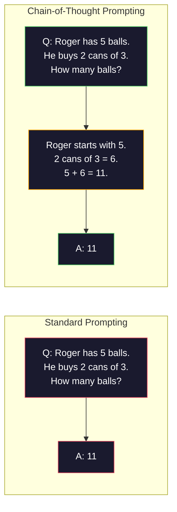
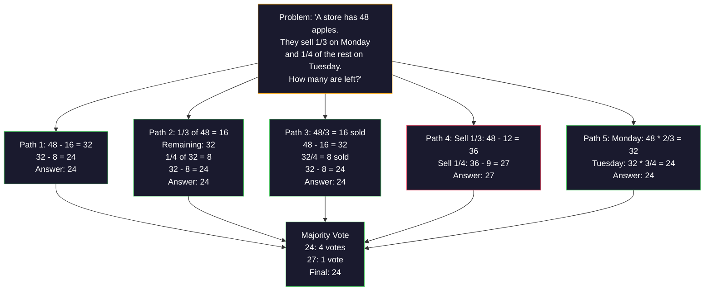
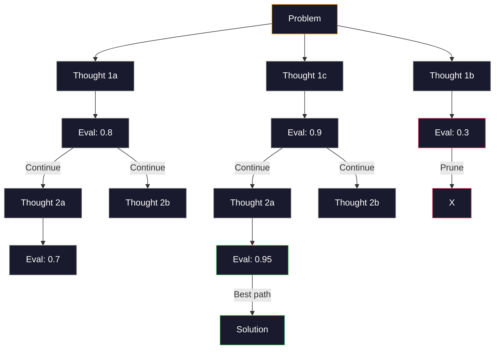

# 想象链,想象树

> 告诉模型要做什么是提示. 展示它如何思考才是工程. 同一个模型,同一个任务,同一个数据,从78%到91%的准确率差距,不是更好的模型,而是更好的推理策略.

**类型：**构建
**语言：**字符串
**先修要求：**11.01课 (即时工程)
**时间：**约45分钟

## 学习目标

- 通过选择和格式化示例演示实现少量提示,从而最大化任务准确率
- 应用思想链 (CoT) 推理,提高数学应用题等多步骤问题的准确率
- 构建思路树,探索多条推理路径并选择最佳路径
- 在标准基准上测量零射击,少射击与CT带来的准确率提升

## 问题

你正在构建一个数学辅导应用程序. 你的提示写道:解决这个词问题. 在 GSM8K 这个标准小学数学基准上,GPT-5 有94%的时间能回答对比.

加上五个词 让我们逐步思考准确率升到91%,再加上几个完整解法例子,就能达到95%――同一个模型――同一个温度――同一个API 成本――唯一的区别是你给了模型草稿纸――

这不是. 这就是推理工作方式. 人类不会一次心跳就解决多步骤的问题. 变压器也不会. 当你迫使模型生成中间代币时,这些代币将成为下一个代币的上下文.

但是,如果你采样五条推理路径,然后进行多数投票会怎么样?如果你让模型探索一个可能性树,评估并剪分支会怎么样?如果你把推理和工具使用交织在一起,会怎么样?这些不是假设.它们已经发表了并有实验升级技术,本课你将把它们全部构建出来.

## 核心概念

### 零射击对少数射击:示例何时胜过指令

只有给模型一个任务,除此之外什么都不给.

微等 (2022) 在8个基准上测量了这一点.对于情感分类等简单任务,零射和少数射的表现差距在2%内.对于多步骤算术和符号推理等复杂任务,少数射的准确率将提高10-25%.

直觉是:示例是压缩后的指令. 与其描述输出格式,不如直接展示. 与其解释推理过程,不如直接演示. 相比解释抽象指令,模型更可靠地在示例上进行模式匹配.


**few-shot 适合的场景：**对于形式敏感任务,分类,结构化抽取领域的专用术语,以及任何需要模型匹配特定模式的任务.

**zero-shot 适合的场景：**简单的事实问题,示例会限制创造力创意任务,以及找到比写好指令更难的好示例任务.

### 示例选择:相似胜过随机

选择与目标输入相似的例子,在分类任务上随机选择高出5-15% (Liu等, 2022)

1. **语义相似性**:选择嵌入空间中最接近输入的示例
2. **标签多样性**举例: 覆盖所有输出类别
3. **难度匹配**符合目标问题的复杂性水平

对于大多数任务,最佳示例数量为3-5个. 较少于3个时,模型没有足够的信号抽取模式. 超过5个时,收益减少,并浪费的文本窗口.

### 思想链:给模型草稿纸

思想很简单:不要只要求模型给答案,而是先要求它展示推理步骤.



从机器上看,为什么这有效?变压器生成的每个代币都会成为下一个代币的上下文.没有Cot,模型必须把所有推理压缩到一次前进传递的隐藏状态中.有Cot,模型将把中间计算外化为代币.每个推理代币都延长有效计算深度.

**GSM8K benchmark（小学数学，8.5K 道题）：**

| Model | Zero-Shot | Zero-Shot CoT | Few-Shot CoT |
|-------|-----------|---------------|--------------|
| GPT-4o | 78% | 91% | 95% |
| GPT-5 | 94% | 97% | 98% |
| o4-mini (reasoning) | 97% | — | — |
| Claude Opus 4.7 | 93% | 97% | 98% |
| Gemini 3 Pro | 92% | 96% | 98% |
| Llama 4 70B | 80% | 89% | 94% |
| DeepSeek-V3.1 | 89% | 94% | 96% |

**关于 reasoning models 的说明。**对于推理模型,我们将一步一步思考是重复的,有时甚至适合其反它们已经做过了──

有两种形式:

**Zero-shot CoT**                                                                                                                                                                                                                                                              

**Few-shot CoT**提供包含推理步骤的示例. 它比零射击CT更有效,因为模型可以看到你期望的精确推理形式.

**CoT 会伤害表现的场景**简单事实回忆(法国的首都是什么?) 单步分类、速度比准确率更重要任务──CoT 每次查询会增加50-200个推理代币的开销──对于高吞吐量、低复杂性任务,这是浪费成本──

### 独立一致:多次采样,一次投票

张等 (2023) 提出了自相一致性.核心洞察是:单条 CoT 路径可能包含推理错误.



在原始的PALM 540B实验中,自相一致性将从56.5%的GSM8K准确率提升到N=40时的74.4%的单条CoT. 在GPT-5上升很小,97%到98%),因为基础准确率已经接近和.该技术最适合的基础CoT准确率在60-85%的模型中.

权衡是:N 个样本意味着N 倍API 成本和延迟――实践中,N=5 能获得大部分收益――N=3 是有意义的投票最低值――对大多数任务来说,N > 10 收益递减――

### 思想树:分支式探索

和其他2023年提出了"思想树" (ToT) ――CoT沿着一条线性推理路径进步,而ToT会探索多个分支,并继续评估哪些分支有最前景――



只有三个组成部分:

1. **Thought generation**产生多个候选人 下一步
2. **State evaluation**:为每个候选人打分(可以使用LLM 作为评估器)
3. **Search algorithm**通过BFS或DFS 遍历树木,并剪枝低分分支

在24任务中 ([[用算术组合4个数字得到24),使用标准提示的GPT-4解题率为7.3%──使用CoT为4.0%──CoT在这里实际上有害,因为搜索空间很宽.──使用ToT则达到74%.──

树中的每个节点都需要一次LLM调用. 分支因子为3个,深度为3个树最需要39次LLM调用.

### 反应:思考+做

和其他 (2022) 将推理轨迹与动作结合起来――模型在思考 (生成推理) 和行动 (调用工具,搜索,计算) 之间交换――

```mermaid
graph LR
    Q["Question:\nWhat is the\npopulation of the\ncountry where\nthe Eiffel Tower\nis located?"]
    T1["Thought: I need to\nfind which country\nhas the Eiffel Tower"]
    A1["Action: search\n'Eiffel Tower location'"]
    O1["Observation:\nParis, France"]
    T2["Thought: Now I need\nFrance's population"]
    A2["Action: search\n'France population 2024'"]
    O2["Observation:\n68.4 million"]
    T3["Thought: I have\nthe answer"]
    F["Answer:\n68.4 million"]

    Q --> T1 --> A1 --> O1 --> T2 --> A2 --> O2 --> T3 --> F

    style Q fill:#1a1a2e,stroke:#ffa500,color:#fff
    style T1 fill:#1a1a2e,stroke:#51cf66,color:#fff
    style A1 fill:#1a1a2e,stroke:#e94560,color:#fff
    style O1 fill:#1a1a2e,stroke:#808080,color:#fff
    style T2 fill:#1a1a2e,stroke:#51cf66,color:#fff
    style A2 fill:#1a1a2e,stroke:#e94560,color:#fff
    style O2 fill:#1a1a2e,stroke:#808080,color:#fff
    style T3 fill:#1a1a2e,stroke:#51cf66,color:#fff
    style F fill:#1a1a2e,stroke:#51cf66,color:#fff
```



在知识密集型任务中,ReAct优于纯CT,因为它可以在真实数据中定推理.在HotpotQA (HotpotQA) 多跳问答) 上,使用GPT-4的ReAct达到35.1%的精确匹配,而单独CT为29.4%.真正的力量在于,推理错误会被观察纠正.

反应是现代人工智能代理的基础.每个代理框架 (长链,机组,自动生成) 都会实现某种思考-行动-观察循环变体.

### 结构化提示:XML标签、界限符、标题

随着提示变复杂,结构能防止模型混不同部分──三种方法:

**XML tags**(最适合克劳德,在各处都稳健):
```
<context>
You are reviewing a pull request.
The codebase uses TypeScript and React.
</context>

<task>
Review the following diff for bugs, security issues, and style violations.
</task>

<diff>
{diff_content}
</diff>

<output_format>
List each issue with: file, line, severity (critical/warning/info), description.
</output_format>
```

**Markdown headers**其他类型:
```
## Role
Senior security engineer at a fintech company.

## Task
Analyze this API endpoint for vulnerabilities.

## Input
{api_code}

## Rules
- Focus on OWASP Top 10
- Rate each finding: critical, high, medium, low
- Include remediation steps
```

**Delimiters**简单但有效:
```
---INPUT---
{user_text}
---END INPUT---

---INSTRUCTIONS---
Summarize the above in 3 bullet points.
---END INSTRUCTIONS---
```

### 快速链接:顺序分解

一些任务对单个提示来说太复杂了.


链接 优于单速 有三个原因:

1. **每一步更简单**模型处理一个聚焦任务,而不是同时兼顾所有事情
2. **中间输出可检查**您可以在步骤之间验证和纠正
3. **不同步骤可以使用不同模型**采用便宜模型做抽取,采用昂贵模型做推

### 性能对比

| Technique | Best For | GSM8K Accuracy (GPT-5) | API Calls | Token Overhead | Complexity |
|-----------|----------|------------------------|-----------|----------------|------------|
| Zero-Shot | 简单任务 | 94% | 1 | 无 | 极低 |
| Few-Shot | 格式匹配 | 96% | 1 | 200-500 tokens | 低 |
| Zero-Shot CoT | 快速推理提升 | 97% | 1 | 50-200 tokens | 极低 |
| Few-Shot CoT | 最高单次调用准确率 | 98% | 1 | 300-600 tokens | 低 |
| Self-Consistency (N=5) | 高风险推理 | 98.5% | 5 | 5x token cost | 中 |
| Reasoning model (o4-mini) | CoT 的直接替代 | 97% | 1 | hidden (2-10x internal) | 极低 |
| Tree-of-Thought | 搜索/规划问题 | N/A (74% on Game of 24) | 10-40+ | 10-40x token cost | 高 |
| ReAct | 基于知识的推理 | N/A (35.1% on HotpotQA) | 3-10+ | 可变 | 高 |
| Prompt Chaining | 复杂多步骤任务 | 96% (pipeline) | 2-5 | 2-5x token cost | 中 |

正确技术取决于三个因素:准确率要求,延迟预算和成本耐受性.


```figure
few-shot-curve
```

## 构建它

我们将构建一个数学问题求解器,把几个枪的提示,思想链,推理和自律投票,组合成一个管道.

完整实现在`code/advanced_prompting.py`中――下面是关键组件――

### 步骤1:少拍的例子店

第一个组件管理少数镜头的例子,并为给定问题选择最相关的例子.

```python
GSM8K_EXAMPLES = [
    {
        "question": "Janet's ducks lay 16 eggs per day. She eats three for breakfast every morning and bakes muffins for her friends every day with four. She sells every egg at the farmers' market for $2. How much does she make every day at the farmers' market?",
        "reasoning": "Janet's ducks lay 16 eggs per day. She eats 3 and bakes 4, using 3 + 4 = 7 eggs. So she has 16 - 7 = 9 eggs left. She sells each for $2, so she makes 9 * 2 = $18 per day.",
        "answer": "18"
    },
    ...
]
```

每个示例包含三部分:问题、推理链和最终答案――推理链会把常规的几次示例转换为CT的几次示例――

### 步骤2:链接思考的提示构建器

提示构建器将系统信息带推理链的几个例子,以及目标问题组装成一个提示.

```python
def build_cot_prompt(question, examples, num_examples=3):
    system = (
        "You are a math problem solver. "
        "For each problem, show your step-by-step reasoning, "
        "then give the final numerical answer on the last line "
        "in the format: 'The answer is [number]'."
    )

    example_text = ""
    for ex in examples[:num_examples]:
        example_text += f"Q: {ex['question']}\n"
        example_text += f"A: {ex['reasoning']} The answer is {ex['answer']}.\n\n"

    user = f"{example_text}Q: {question}\nA:"
    return system, user
```

格式约束(答案是[数])至关重要──没有它,自律就无法跨样本抽取并比较答案──

### 步骤3:自主一致性投票

采样 N 条推理路径,并取多数答案.

```python
def self_consistency_solve(question, examples, client, model, n_samples=5):
    system, user = build_cot_prompt(question, examples)

    answers = []
    reasonings = []
    for _ in range(n_samples):
        response = client.chat.completions.create(
            model=model,
            messages=[
                {"role": "system", "content": system},
                {"role": "user", "content": user}
            ],
            temperature=0.7
        )
        text = response.choices[0].message.content
        reasonings.append(text)
        answer = extract_answer(text)
        if answer is not None:
            answers.append(answer)

    vote_counts = Counter(answers)
    best_answer = vote_counts.most_common(1)[0][0] if vote_counts else None
    confidence = vote_counts[best_answer] / len(answers) if best_answer else 0

    return best_answer, confidence, reasonings, vote_counts
```

温度0.7 很重要.在温度0.0 时,所有的样本都会相同,从而失去意义.

### 步骤4:思维树解决器

对于线性推理失败的问题,我们会探索多种方法,并评估哪个方向有最好的前景.

```python
def tree_of_thought_solve(question, client, model, breadth=3, depth=3):
    thoughts = generate_initial_thoughts(question, client, model, breadth)
    scored = [(t, evaluate_thought(t, question, client, model)) for t in thoughts]
    scored.sort(key=lambda x: x[1], reverse=True)

    for current_depth in range(1, depth):
        next_thoughts = []
        for thought, score in scored[:2]:
            extensions = extend_thought(thought, question, client, model, breadth)
            for ext in extensions:
                ext_score = evaluate_thought(ext, question, client, model)
                next_thoughts.append((ext, ext_score))
        scored = sorted(next_thoughts, key=lambda x: x[1], reverse=True)

    best_thought = scored[0][0] if scored else ""
    return extract_answer(best_thought), best_thought
```

评估器本身也是一次LLM调用――你问模型:在0.0到1.0的尺度上,这个推理方法如何解决问题?

### 步骤5:完整的管道

通过升级策略组合所有技术.

```python
def solve_with_escalation(question, examples, client, model):
    system, user = build_cot_prompt(question, examples)
    single_response = call_llm(client, model, system, user, temperature=0.0)
    single_answer = extract_answer(single_response)

    sc_answer, confidence, _, _ = self_consistency_solve(
        question, examples, client, model, n_samples=5
    )

    if confidence >= 0.8:
        return sc_answer, "self_consistency", confidence

    tot_answer, _ = tree_of_thought_solve(question, client, model)
    return tot_answer, "tree_of_thought", None
```

升级逻辑:先尝试便宜方案(单次CoT) ――如果自律性信心低于0.8(5个样本中低于4个一致),则升级到ToT──这样能平衡成本和准确率大多数问题便宜地解决,难题得到更多计算──

## 使用它

### 通过"长链"

长链为提示模板和输出解析提供内置支持,能简化一些拍摄和Cot模式:

```python
from langchain_core.prompts import FewShotPromptTemplate, PromptTemplate
from langchain_openai import ChatOpenAI

example_prompt = PromptTemplate(
    input_variables=["question", "reasoning", "answer"],
    template="Q: {question}\nA: {reasoning} The answer is {answer}."
)

few_shot_prompt = FewShotPromptTemplate(
    examples=examples,
    example_prompt=example_prompt,
    suffix="Q: {input}\nA: Let's think step by step.",
    input_variables=["input"]
)

llm = ChatOpenAI(model="gpt-4o", temperature=0.7)
chain = few_shot_prompt | llm
result = chain.invoke({"input": "If a train travels 120 km in 2 hours..."})
```

长链也用于语义相似性选择.`ExampleSelector`类:

```python
from langchain_core.example_selectors import SemanticSimilarityExampleSelector
from langchain_openai import OpenAIEmbeddings

selector = SemanticSimilarityExampleSelector.from_examples(
    examples,
    OpenAIEmbeddings(),
    k=3
)
```

### 通过DSPy

您无需手写CT提示,而是定义一个签名,然后让DSPy 优化提示:

```python
import dspy

dspy.configure(lm=dspy.LM("openai/gpt-4o", temperature=0.7))

class MathSolver(dspy.Module):
    def __init__(self):
        self.solve = dspy.ChainOfThought("question -> answer")

    def forward(self, question):
        return self.solve(question=question)

solver = MathSolver()
result = solver(question="Janet's ducks lay 16 eggs per day...")
```

鱼类的`ChainOfThought`会自动添加推理轨迹.`dspy.majority`实现自律性:

```python
result = dspy.majority(
    [solver(question=q) for _ in range(5)],
    field="answer"
)
```

### 对比:从零到框架

| Feature | From-Scratch (this lesson) | LangChain | DSPy |
|---------|--------------------------|-----------|------|
| 对 prompt format 的控制 | 完全控制 | 基于 template | 自动 |
| Self-consistency | 手动投票 | 手动 | 内置（`dspy.majority`） |
| Example selection | 自定义逻辑 | `ExampleSelector` | `dspy.BootstrapFewShot` |
| Tree-of-Thought | 自定义 tree search | Community chains | 未内置 |
| Prompt optimization | 手动迭代 | 手动 | 自动编译 |
| 最适合 | 学习、自定义 pipelines | 标准 workflows | 研究、优化 |

## 交付它

本课会产出两个文物.

**1. Reasoning Chain Prompt**(`outputs/prompt-reasoning-chain.md`):一个准备生产的提示模板,用于带有自律性的几次CoT──接入你的示例和问题领域即可使用──

**2. CoT Pattern Selection Skill**(`outputs/skill-cot-patterns.md`):一个基于任务类型的决策框架,准确率要求和成本约束选择合适的推理技术.

## 练习

1. **衡量差距**通过零射,少射,零射,零射,零射,零射,零射,并解每一个问题,记录每种方法的准确率,

2. **示例选择实验**对于同样的10个方法问题,比较随机示例选择与手工选择相似示例.

3. **Self-consistency 成本曲线**图形准确率与 成本总代币) 对于你的模型来说,曲线的拐点在哪里?

4. **构建 ReAct loop**通过计算器工具扩展管道.`eval()`测量工具定定理是否优于纯质量

5. **ToT 用于创意任务**创意写作任务: 写一个有趣和悲伤的6字的故事.

## 关键术语

| Term | 人们通常说 | 实际含义 |
|------|----------------|----------------------|
| Few-shot prompting | “给它一些示例” | 在 prompt 中包含 input-output demonstrations，用于锚定模型的输出格式和行为 |
| Chain-of-Thought | “让它一步步思考” | 引出中间推理 Token，在生成最终答案前延长模型的有效计算 |
| Self-Consistency | “多运行几次” | 在 temperature > 0 下采样 N 条多样推理路径，并通过多数投票选择最常见的最终答案 |
| Tree-of-Thought | “让它探索选项” | 对推理分支进行结构化搜索，每个部分解法都会被评估，只有有前景的路径会被扩展 |
| ReAct | “思考 + 工具使用” | 在 Thought-Action-Observation loop 中交织推理轨迹与外部动作（搜索、计算、API calls） |
| Prompt chaining | “拆成步骤” | 将复杂任务分解为顺序 prompts，每一步输出都会馈入下一步输入 |
| Zero-shot CoT | “只加上 ‘think step by step’” | 不提供任何示例，只在 prompt 后追加推理触发短语，依赖模型的潜在推理能力 |

## 延伸阅读

- [Chain-of-Thought Prompting Elicits Reasoning in Large Language Models](https://arxiv.org/abs/2201.11903)微博的核心结果:
- [Self-Consistency Improves Chain of Thought Reasoning in Language Models](https://arxiv.org/abs/2203.11171)关于自律论文表 1 有你需要的所有数字
- [Tree of Thoughts: Deliberate Problem Solving with Large Language Models](https://arxiv.org/abs/2305.10601)和其他2023年.
- [ReAct: Synergizing Reasoning and Acting in Language Models](https://arxiv.org/abs/2210.03629)现代人工智能代理的基础. 第3节解释了思想行动观察循环.
- [Large Language Models are Zero-Shot Reasoners](https://arxiv.org/abs/2205.11916)让我们一步一步思考论文――以如此简单的方式取得出人意图的效果――
- [DSPy: Compiling Declarative Language Model Calls into Self-Improving Pipelines](https://arxiv.org/abs/2310.03714)哈塔布等人 2023年,将引发视为编译问题.
- [OpenAI — Reasoning models guide](https://platform.openai.com/docs/guides/reasoning)关于何时链接思考会从快速水平的技巧 变成内部 根据代币计价的 理性模式的供应商指导.
- [Lightman et al., "Let's Verify Step by Step" (2023)](https://arxiv.org/abs/2305.20050)-- 过程奖励模型 (PRM),用于给链中的每一步打分;这是比仅结果奖励更成功的推理监督信号.
- [Snell et al., "Scaling LLM Test-Time Compute Optimally" (2024)](https://arxiv.org/abs/2408.03314)对于CT长度,自律性采样和MCTS的系统研究;当准确率比延迟更重要时,
