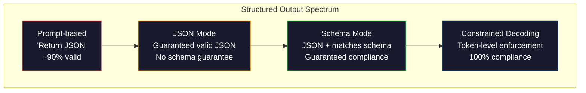
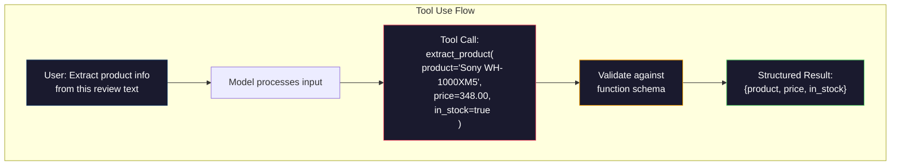

# 结构化输出:JSON、方案验证、限制解码

> 你的LLM 返回是字符串. 你的应用需要JSON. 这个差异导致生产系统崩,比任何模型都觉得多. 结构化输出是自然语言和类型化数据之间的桥梁.

**类型：**建立
**语言：**字符串
**先修要求：**第十阶段,课时01-05 (从零开始的LLM)
**时间：**约90分钟
**相关内容：**阶段 5 · 20 (结构化输出和限制式解码) 涵盖解码器层面的理论(FSM/CFG逻辑处理器、概要、XGrammar) ――本课聚焦生产环境中的SDK接口(OpenAI`response_format`‧人类工具使用‧指导) 如果你想理解API下发生了什么,请先阅读5期·20期.

## 学习目标

- 使用OpenAI和人类API 参数实现JSON模式和方案限制输出
- 构建一个Pydantic验证层,用于拒绝形式错误的LLM输出,并通过错误反进行重试
- 解释限制解码 如何在代币层面强制生成有效JSON,而无需后处理
- 设计稳健的抽取提示,将非结构化文本可靠转换为类型化数据结构

## 问题

你问法师:从本文中抽取产品名称、价格和库存状态.

```
The product is the Sony WH-1000XM5 headphones, which cost $348.00 and are currently in stock.
```

这是一个完全正确的答案. 对于你的应用,它也完全没有用.`{"product": "Sony WH-1000XM5", "price": 348.00, "in_stock": true}`△你需要一个具有特定键,特定类型和特定取值束的JSON对象.

简单解法:在快速里加上响应在JSON──这在90%的情况下有效──另外10%的情况下,模型将JSON包装在标记码围中,或者加上类似.

这不是快速工程问题. 这是一个解码问题. 模型从左到右生成代币. 在每个位置,它会从10万多个选项的词汇中选择最可能的下一个代币. 在任意的特定位置,其中大多数选项都会产生无效的JSON. 如果模型刚刚输出.`{"price":`必须是数字,引号,用于字符串.`null`,我知道.`true`,我知道.`false`或负号――其他任何内容都会产生无效的JSON――没有限制,模型可能会选择一个看起来完全合理的英语单词,但在语法上是灾难性的错误――

## 概念

### 结构化输出谱系

结构化输出控制有四个层次,每个层次都比前一层更可靠.



**基于 Prompt**(回答在有效的JSON):没有强制约束.模型通常会遵守,但有时不会.可靠性:约90%──失败模式:标记围、前言文本、截断输出、结构错误──

**JSON mode**现在,我们可以看到一个新的版本.`response_format: { type: "json_object" }`输出可以无错解,但它不一定符合你期望的方案,可能有额外的关键,错误类型,缺失字段.

**Schema mode**截至2026年,所有主要供应商都将支持这一点.`response_format: { type: "json_schema", json_schema: {...} }`(也可通过)`tool_choice="required"`)、人类的工具使用 配合 `input_schema`双子座的`response_schema`其他`response_mime_type: "application/json"`输出包含你指定的精确关键,类型和约束.

**Constrained decoding**: 在生成过程中,每个代币的位置,解码器会屏蔽所有导致无效输出代币.如果该方案要求一个数字,而模型即将输出一个字母,该代币的概率将设为零.

### 标签: 标签: 标签: 标签: 标签: 标签: 标签: 标签: 标签: 标签: 标签: 标签: 标签: 标签: 标签: 标签: 标签: 标签: 标签: 标签: 标签: 标签: 标签: 标签: 标签: 标签: 标签: 标签: 标签: 标签: 标签: 标签: 标签: 标签: 标签: 标签: 标签: 标签: 标签: 标签: 标签

 JSON Schema 是一个用来告诉模型的方法 (或验证层) 输出必须具有什么形状的方法.

```json
{
  "type": "object",
  "properties": {
    "product": { "type": "string" },
    "price": { "type": "number", "minimum": 0 },
    "in_stock": { "type": "boolean" },
    "categories": {
      "type": "array",
      "items": { "type": "string" }
    }
  },
  "required": ["product", "price", "in_stock"]
}
```

这个图表表示:输出必须是一个对象,包含字符串类型`product`、非负数 类型 `price`尔式 类型`in_stock`并且一个可选的字符串数组`categories`任何不匹配的输出都会被拒绝.

方案可以处理困难情况:嵌套对象、包含类型化对象的数组、enums(将字符串约束到特定取值) 模式匹配(对字符串使用regex),以及组合器(用于多态输出oneOf、任何Of、allOf) ⋅

### 平式模式

在Python中,你不会手写JSON Schema──你定义了一个Pydantic模型,它会为你生成一个 schema──

```python
from pydantic import BaseModel

class Product(BaseModel):
    product: str
    price: float
    in_stock: bool
    categories: list[str] = []
```

这将生成与上述相同的JSON Schema──Instructor library(以及 OpenAI的 SDK) 可以直接接受Pydantic模型:传入模型类,返回经验证的实例──如果LLM输出不匹配,Instructor会自动重试──

### 函数调用/工具使用

这是同一个问题的另一种接口――你不是让模型直接生成JSON,而是定义带有类型化参数的工具(函数)――模型输出一个带有结构性参数的函数调用――OpenAI称之为函数调用──人类称之为工具使用──结果相同:结构性数据──



当模型需要选择调用哪个函数,而不仅仅是填充参数时,使用工具更合适.如果你有10种不同的抽取方案,并且模型必须根据输入选择正确的模式,使用工具会同时给你选择方案和结构化输出.

### 常见失败模式

即使有规划执行,结构化输出仍然可能以微妙的方式失败.

**幻觉值**输出匹配方案,但包含编制的数据.`{"price": 299.99}`△方案验证 捕捉不到这一点 类型正确,但值错误

**Enum 混淆**您将字段约束为`["in_stock", "out_of_stock", "preorder"]`模型输出`"available"`语义正确,但不允许集合中.优秀的限制解码可以避免这一点.

**嵌套 object 深度**它们是模型可能忘记结构的位置.

**Array 长度**模型可能在数组中生成过多或过少的项目.`minItems`和 `maxItems`但并非所有提供商都在解码层面强制执行它们.

**可选字段省略**模型会省略技术上可选的内容,但对你的使用例在语义上是重要的段落.即使有时数据缺失,也必须在方案中设置它们作为必要的强制模型显然生成.`null`,我知道.


```figure
mx-schema-funnel
```

## 构建它

### 步骤1:JSON方案验证器

从零构建一个验证器,用于检查Python对象是否匹配JSON方案.

```python
import json

def validate_schema(data, schema):
    errors = []
    _validate(data, schema, "", errors)
    return errors

def _validate(data, schema, path, errors):
    schema_type = schema.get("type")

    if schema_type == "object":
        if not isinstance(data, dict):
            errors.append(f"{path}: expected object, got {type(data).__name__}")
            return
        for key in schema.get("required", []):
            if key not in data:
                errors.append(f"{path}.{key}: required field missing")
        properties = schema.get("properties", {})
        for key, value in data.items():
            if key in properties:
                _validate(value, properties[key], f"{path}.{key}", errors)

    elif schema_type == "array":
        if not isinstance(data, list):
            errors.append(f"{path}: expected array, got {type(data).__name__}")
            return
        min_items = schema.get("minItems", 0)
        max_items = schema.get("maxItems", float("inf"))
        if len(data) < min_items:
            errors.append(f"{path}: array has {len(data)} items, minimum is {min_items}")
        if len(data) > max_items:
            errors.append(f"{path}: array has {len(data)} items, maximum is {max_items}")
        items_schema = schema.get("items", {})
        for i, item in enumerate(data):
            _validate(item, items_schema, f"{path}[{i}]", errors)

    elif schema_type == "string":
        if not isinstance(data, str):
            errors.append(f"{path}: expected string, got {type(data).__name__}")
            return
        enum_values = schema.get("enum")
        if enum_values and data not in enum_values:
            errors.append(f"{path}: '{data}' not in allowed values {enum_values}")

    elif schema_type == "number":
        if not isinstance(data, (int, float)):
            errors.append(f"{path}: expected number, got {type(data).__name__}")
            return
        minimum = schema.get("minimum")
        maximum = schema.get("maximum")
        if minimum is not None and data < minimum:
            errors.append(f"{path}: {data} is less than minimum {minimum}")
        if maximum is not None and data > maximum:
            errors.append(f"{path}: {data} is greater than maximum {maximum}")

    elif schema_type == "boolean":
        if not isinstance(data, bool):
            errors.append(f"{path}: expected boolean, got {type(data).__name__}")

    elif schema_type == "integer":
        if not isinstance(data, int) or isinstance(data, bool):
            errors.append(f"{path}: expected integer, got {type(data).__name__}")
```

### 步骤2:Pydantic 风格 模型到方案

构建一个最小的类到方案转换器――定义一个Python类,并自动生成它的JSON方案――

```python
class SchemaField:
    def __init__(self, field_type, required=True, default=None, enum=None, minimum=None, maximum=None):
        self.field_type = field_type
        self.required = required
        self.default = default
        self.enum = enum
        self.minimum = minimum
        self.maximum = maximum

def python_type_to_schema(field):
    type_map = {
        str: "string",
        int: "integer",
        float: "number",
        bool: "boolean",
    }

    schema = {}

    if field.field_type in type_map:
        schema["type"] = type_map[field.field_type]
    elif field.field_type == list:
        schema["type"] = "array"
        schema["items"] = {"type": "string"}
    elif isinstance(field.field_type, dict):
        schema = field.field_type

    if field.enum:
        schema["enum"] = field.enum
    if field.minimum is not None:
        schema["minimum"] = field.minimum
    if field.maximum is not None:
        schema["maximum"] = field.maximum

    return schema

def model_to_schema(name, fields):
    properties = {}
    required = []

    for field_name, field in fields.items():
        properties[field_name] = python_type_to_schema(field)
        if field.required:
            required.append(field_name)

    return {
        "type": "object",
        "properties": properties,
        "required": required,
    }
```

### 步骤3:限制的标记过器

模拟限制解码──给定一个部分 JSON字符串和一个方案,判断当前位点哪些代币 类别是有效的──

```python
def next_valid_tokens(partial_json, schema):
    stripped = partial_json.strip()

    if not stripped:
        return ["{"]

    try:
        json.loads(stripped)
        return ["<EOS>"]
    except json.JSONDecodeError:
        pass

    last_char = stripped[-1] if stripped else ""

    if last_char == "{":
        return ['"', "}"]
    elif last_char == '"':
        if stripped.endswith('":'):
            return ['"', "0-9", "true", "false", "null", "[", "{"]
        return ["a-z", '"']
    elif last_char == ":":
        return [" ", '"', "0-9", "true", "false", "null", "[", "{"]
    elif last_char == ",":
        return [" ", '"', "{", "["]
    elif last_char in "0123456789":
        return ["0-9", ".", ",", "}", "]"]
    elif last_char == "}":
        return [",", "}", "]", "<EOS>"]
    elif last_char == "]":
        return [",", "}", "<EOS>"]
    elif last_char == "[":
        return ['"', "0-9", "true", "false", "null", "{", "[", "]"]
    else:
        return ["any"]

def demonstrate_constrained_decoding():
    partial_states = [
        '',
        '{',
        '{"product"',
        '{"product":',
        '{"product": "Sony"',
        '{"product": "Sony",',
        '{"product": "Sony", "price":',
        '{"product": "Sony", "price": 348',
        '{"product": "Sony", "price": 348}',
    ]

    print(f"{'Partial JSON':<45} {'Valid Next Tokens'}")
    print("-" * 80)
    for state in partial_states:
        valid = next_valid_tokens(state, {})
        display = state if state else "(empty)"
        print(f"{display:<45} {valid}")
```

### 步骤4:抽取管道

把所有内容组合成一个抽取管道:定义方案,模拟LLM 生成结构化输出,验证输出,并处理重试――

```python
def simulate_llm_extraction(text, schema, attempt=0):
    if "headphones" in text.lower() or "sony" in text.lower():
        if attempt == 0:
            return '{"product": "Sony WH-1000XM5", "price": 348.00, "in_stock": true, "categories": ["audio", "headphones"]}'
        return '{"product": "Sony WH-1000XM5", "price": 348.00, "in_stock": true}'

    if "laptop" in text.lower():
        return '{"product": "MacBook Pro 16", "price": 2499.00, "in_stock": false, "categories": ["computers"]}'

    return '{"product": "Unknown", "price": 0, "in_stock": false}'

def extract_with_retry(text, schema, max_retries=3):
    for attempt in range(max_retries):
        raw = simulate_llm_extraction(text, schema, attempt)

        try:
            data = json.loads(raw)
        except json.JSONDecodeError as e:
            print(f"  Attempt {attempt + 1}: JSON parse error -- {e}")
            continue

        errors = validate_schema(data, schema)
        if not errors:
            return data

        print(f"  Attempt {attempt + 1}: Schema validation errors -- {errors}")

    return None

product_schema = {
    "type": "object",
    "properties": {
        "product": {"type": "string"},
        "price": {"type": "number", "minimum": 0},
        "in_stock": {"type": "boolean"},
        "categories": {"type": "array", "items": {"type": "string"}},
    },
    "required": ["product", "price", "in_stock"],
}
```

### 步骤5:运行完整管道

```python
def run_demo():
    print("=" * 60)
    print("  Structured Output Pipeline Demo")
    print("=" * 60)

    print("\n--- Schema Definition ---")
    product_fields = {
        "product": SchemaField(str),
        "price": SchemaField(float, minimum=0),
        "in_stock": SchemaField(bool),
        "categories": SchemaField(list, required=False),
    }
    generated_schema = model_to_schema("Product", product_fields)
    print(json.dumps(generated_schema, indent=2))

    print("\n--- Schema Validation ---")
    test_cases = [
        ({"product": "Test", "price": 10.0, "in_stock": True}, "Valid object"),
        ({"product": "Test", "price": -5.0, "in_stock": True}, "Negative price"),
        ({"product": "Test", "in_stock": True}, "Missing price"),
        ({"product": "Test", "price": "ten", "in_stock": True}, "String as price"),
        ("not an object", "String instead of object"),
    ]

    for data, label in test_cases:
        errors = validate_schema(data, product_schema)
        status = "PASS" if not errors else f"FAIL: {errors}"
        print(f"  {label}: {status}")

    print("\n--- Constrained Decoding Simulation ---")
    demonstrate_constrained_decoding()

    print("\n--- Extraction Pipeline ---")
    texts = [
        "The Sony WH-1000XM5 headphones are priced at $348 and currently available.",
        "The new MacBook Pro 16-inch laptop costs $2499 but is sold out.",
        "This is a random sentence with no product info.",
    ]

    for text in texts:
        print(f"\n  Input: {text[:60]}...")
        result = extract_with_retry(text, product_schema)
        if result:
            print(f"  Output: {json.dumps(result)}")
        else:
            print(f"  Output: FAILED after retries")
```

## 使用它

### 开放AI结构化输出

```python
# from openai import OpenAI
# from pydantic import BaseModel
#
# client = OpenAI()
#
# class Product(BaseModel):
#     product: str
#     price: float
#     in_stock: bool
#
# response = client.beta.chat.completions.parse(
#     model="gpt-5-mini",
#     messages=[
#         {"role": "system", "content": "Extract product information."},
#         {"role": "user", "content": "Sony WH-1000XM5, $348, in stock"},
#     ],
#     response_format=Product,
# )
#
# product = response.choices[0].message.parsed
# print(product.product, product.price, product.in_stock)
```

开放AI的结构化输出模式在内部使用限制式解码中.模型生成的每个代币都被保证产生匹配的Pydantic图案输出.

### 人类工具的使用

```python
# import anthropic
#
# client = anthropic.Anthropic()
#
# response = client.messages.create(
#     model="claude-opus-4-7",
#     max_tokens=1024,
#     tools=[{
#         "name": "extract_product",
#         "description": "Extract product information from text",
#         "input_schema": {
#             "type": "object",
#             "properties": {
#                 "product": {"type": "string"},
#                 "price": {"type": "number"},
#                 "in_stock": {"type": "boolean"},
#             },
#             "required": ["product", "price", "in_stock"],
#         },
#     }],
#     messages=[{"role": "user", "content": "Extract: Sony WH-1000XM5, $348, in stock"}],
# )
```

通过工具使用实现结构化输出模型会发出一个工具调用,其中包含匹配的输入_方案的结构化参数.

### 导师图书馆

```python
# pip install instructor
# import instructor
# from openai import OpenAI
# from pydantic import BaseModel
#
# client = instructor.from_openai(OpenAI())
#
# class Product(BaseModel):
#     product: str
#     price: float
#     in_stock: bool
#
# product = client.chat.completions.create(
#     model="gpt-5-mini",
#     response_model=Product,
#     messages=[{"role": "user", "content": "Sony WH-1000XM5, $348, in stock"}],
# )
```

导师 包装任意的LLM客户端,并加入带验证的自动复试. 如果第一次尝试验证失败,它将错误作为文本发送给模型,并要求模型修复输出.

## 交付它

本课会产出 `outputs/prompt-structured-extractor.md`可复制的提示模板,用于根据方案定义从任意文本中抽取结构化数据――给它一个JSON方案和非结构化文本,它将返回经过验的JSON――

它会再次出现.`outputs/skill-structured-outputs.md`一个决策框架,根据您的供应商的可靠性要求和方案 复杂性选择正确的结构化输出策略.

## 练习

1. 扩展方案验证器,使其支持`oneOf`(数据必须恰好匹配多个方案中的一个) .`Product`它们的形状也可以不同.`Service`目标

2. 构建一个不同方案的工具,用于比较两个方案,并识别破解变化,

3. 实现一个更真实的限制解码模拟器――给定一个包含100个代币的JSON方案和一个含有100个代币的词汇――字母,数字,分点,关键字),逐步走过一代,在每个位置屏蔽不行代币――衡量每个步骤的词汇中有效的代币的比例――

4. 构建一个抽取评估套件――创建50条产品描述,并手工标记JSON输出――在全部50条上运行你的抽取管道,并衡量精确的匹配、现场级准确和类型合规――找出哪些字段最难正确抽取――

5. 为您的抽取管道 添加信任分数──对每个抽取字段,估计模型的信任度──基于代币概率,或通过运行3次抽取并测量一致性──将低置信度字段标记为人工审核──

## 关键术语

| Term | 人们通常怎么说 | 它实际意味着什么 |
|------|----------------|----------------------|
| JSON mode | “返回 JSON” | 一个 API flag，保证输出在语法上是有效 JSON，但不强制任何特定 schema |
| Structured output | “类型化 JSON” | 匹配特定 JSON Schema 的输出，具有正确的 key、type 和 constraint |
| Constrained decoding | “引导式生成” | 在每个 Token 位置屏蔽会产生无效输出的 Tokens——保证 100% schema compliance |
| JSON Schema | “一个 JSON template” | 用于描述 JSON 数据结构、type 和 constraint 的声明式语言（被 OpenAPI、JSON Forms 等使用） |
| Pydantic | “Python dataclasses+” | Python library，用于定义带有 type validation 的 data models，FastAPI 和 Instructor 使用它生成 JSON Schemas |
| Function calling | “Tool use” | LLM 输出结构化 function invocation（name + typed arguments），而不是 free text——OpenAI 和 Anthropic 都支持 |
| Instructor | “面向 LLMs 的 Pydantic” | Python library，用于包装 LLM clients 以返回经过验证的 Pydantic instances，并在 validation failure 时自动 retry |
| Token masking | “过滤 vocabulary” | 在 generation 期间将特定 Token probabilities 设为零，使模型无法生成它们 |
| Schema compliance | “匹配形状” | 输出包含每个 required field、正确 types、约束范围内的 values，并且没有额外的不允许字段 |
| Retry loop | “不断重试直到成功” | 将 validation errors 发回给模型，并要求它修复输出——Instructor 会自动执行这一点，最多重试到可配置上限 |

## 延伸阅读

- [OpenAI Structured Outputs Guide](https://platform.openai.com/docs/guides/structured-outputs)OpenAI API 中基于JSON方案的限制解码 官方文档
- [Willard & Louf, 2023——“Efficient Guided Generation for Large Language Models”](https://arxiv.org/abs/2307.09702)概述论文,描述如何将JSON方案编译为有限状态机器以实现代币级约束
- [Instructor documentation](https://python.useinstructor.com/)使用Pydantic验证和反复试验 从任意的LLM 获取结构化输出标准库
- [Anthropic Tool Use Guide](https://docs.anthropic.com/en/docs/tool-use)Claude 如何通过工具使用 和 JSON Schema input_schema 实现结构化输出
- [JSON Schema specification](https://json-schema.org/)所有主要结构化输出 系统使用的方案语言 完整规范
- [Outlines library](https://github.com/outlines-dev/outlines)使用regex 和编译为有限状态机的JSON方案 进行开源限制生成
- [Dong et al., “XGrammar: Flexible and Efficient Structured Generation Engine for Large Language Models” (MLSys 2025)](https://arxiv.org/abs/2411.15100)当前最先进的语法引擎;推倒自动组合,可以以约100ns / 代币的速度屏蔽代币.
- [Beurer-Kellner et al., “Prompting Is Programming: A Query Language for Large Language Models” (LMQL)](https://arxiv.org/abs/2212.06094)LMQL 论文,将限制解码表述为带有类型和值限制的查询语言
- [Microsoft Guidance (framework docs)](https://github.com/guidance-ai/guidance)模板驱动的限制性生成;概要和XGrammar的供应商无知性补充
