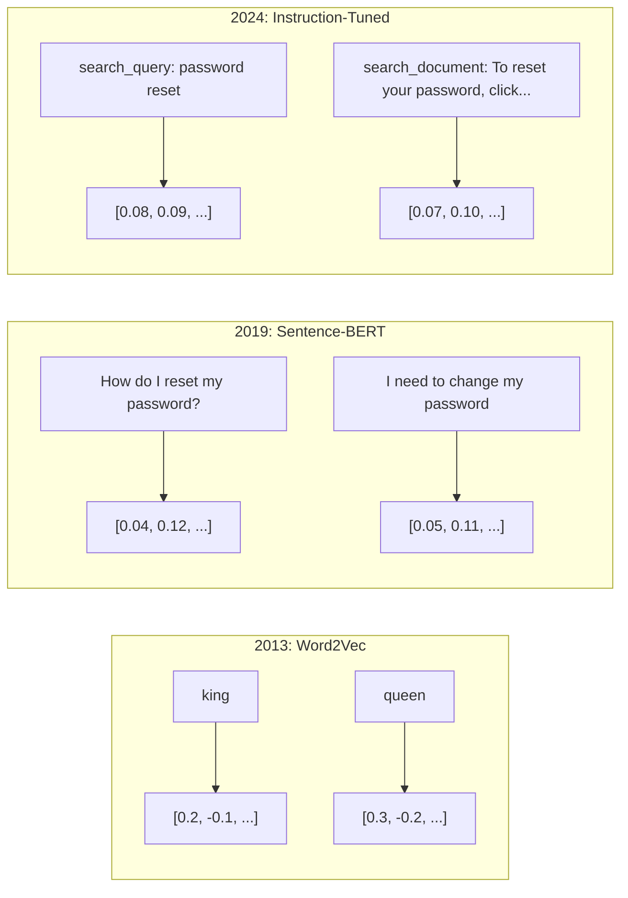
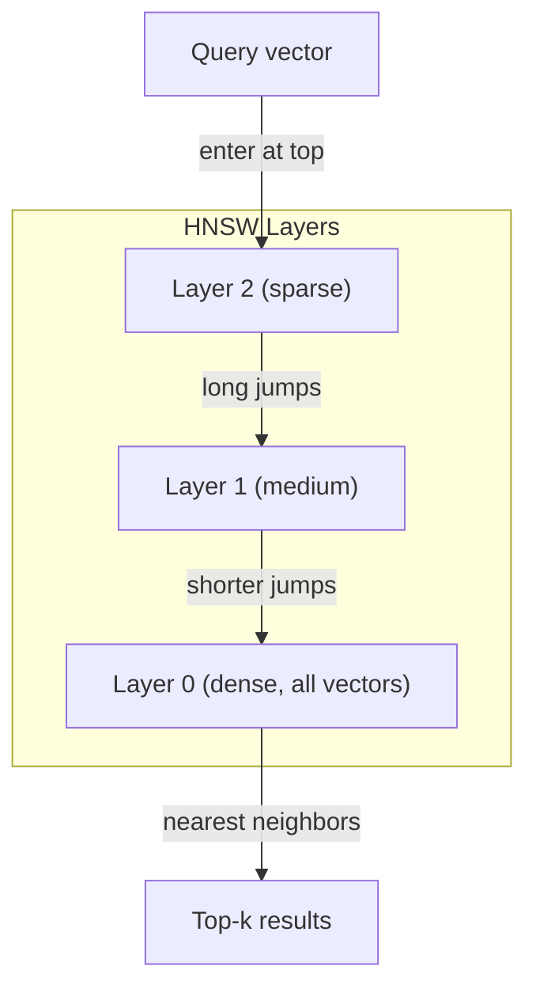

# 嵌入与向量表示

> 文本是离散的.数学是连续的. 每当你要求LLM 搜索相似文档,比较含义,或超越关键词进行搜索时,你都依赖于连接这两个世界的一个桥.

**Type:** Build
**Languages:** Python
**Prerequisites:** Phase 11, Lesson 01 (Prompt Engineering)
**Time:** ~75 minutes
**Related:**阶段 5 · 22 (嵌入模型深度潜水) 涵盖密集对稀少对多向量对比的矩阵截断,以及按轴选择模型――本课聚焦生产管道――向量DBs、HNSW、相似度数学) ・在选择模型之前,请先阅读阶段 5 · 22。

## 学习目标
- 使用API提供商和开源模型 生成文本嵌入式,并计算它们之间的共性相似性
- 解释为什么嵌入式能解决关键词搜索无法处理的词汇不匹配问题
- 构建一个语义搜索索引,根据含义而不是精确关键词匹配来检查文档
- 使用检索基准(精度@k、回忆) 评估嵌入质量,并为您的任务选择合适的嵌入模型

## 问题
你有10,000张支持工单――一位客户写道:我的付款没有通过. 你需要找到相似的历史工单――关键词搜索会找到包含付款和没有通过的工单――它会漏掉 交易失败, 收费被拒绝, 和 账单错误. 这些工单用完全不同的词描述完全相同的问题――

这就是词汇不匹配问题――人类语言有很多表达相同的事情的方式――关键词搜索 把每个词都当作没有意义的独立符号――它无法知道 退 和 没有经过指的是同一个概念――

你需要一种文本表示,让相似性由含义决定,而不是由拼写决定. 你需要一种方法,把我的付款没有通过和交易被拒绝放到某个数学空间中相近的位置,同时把我的付款到达了时间很远,即使它共享了这个词.

这种表示就是嵌入.

## 概念
### 植入是什么?

嵌入是由浮点数组成的密集向量,用于表示文本的含义.

猫坐在床上会变成类似的`[0.023, -0.041, 0.087, ..., 0.012]`根据模型不同,一个包含768到3072个数字的列表. 这些数字编码了意义.

###  Word2Vec 突破

2013年,谷歌的托马斯·米科洛夫及其同事发表了Word2Vec──核心洞见是:训练一个神经网络,根据邻近词预测一个词(或根据一个词预测邻近词),隐藏层权重就会变成有意义的向量表示──

著名结果:

```
king - man + woman = queen
```

对于词嵌入进行矢量算术可以捕捉语义关系――从男到女的方向,大致等于从王到女王的方向――这是该领域意识到几何可以编码含义的时刻――

词2Vec 生成300维向量──每一个词无论上下文如何,都只有一个向量──银行在河岸和银行账户中拥有相同的嵌入式──这个限制推动了十年的研究──

### 从单词到句子

词嵌入表示单个代币.生产系统需要对整个句子,段落或文档进行嵌入.出现了四种方法:

**Averaging**取句子中所有词向量的平均值. 成本低,有损,但对短文文出奇地还不错.

**CLS token**转换器模型 (BERT, 2018) 输出一个特殊的 [CLS]代币嵌入,表示整个输入――比平均更好,但[CLS]代币是为下一句预测 训练的,不是为相似度训练的――

**Contrastive learning**模型使用这种方法,并成为现代嵌入式模型的基础. 给定 如何重置我的密码?  和 我需要改变我的密码, 模型会学习到它们应该拥有几乎相同的向量.

**Instruction-tuned embeddings**查询_查询_文件:),告诉模型要生成哪种嵌入式. 这让一个模型可以服务多个任务.



### 现代嵌入式模型

市场已经收到了少数几个生产级的选项,截至2026年初的MTEB分数,MTEB v2):

| Model | Provider | Dimensions | MTEB | Context | Cost / 1M tokens |
|-------|----------|-----------|------|---------|------------------|
| Gemini Embedding 2 | Google | 3072 (Matryoshka) | 67.7 (retrieval) | 8192 | $0.15 |
| embed-v4 | Cohere | 1024 (Matryoshka) | 65.2 | 128K | $0.12 |
| voyage-4 | Voyage AI | 1024/2048 (Matryoshka) | 66.8 | 32K | $0.12 |
| text-embedding-3-large | OpenAI | 3072 (Matryoshka) | 64.6 | 8192 | $0.13 |
| text-embedding-3-small | OpenAI | 1536 (Matryoshka) | 62.3 | 8192 | $0.02 |
| BGE-M3 | BAAI | 1024 (dense+sparse+ColBERT) | 63.0 multilingual | 8192 | Open-weight |
| Qwen3-Embedding | Alibaba | 4096 (Matryoshka) | 66.9 | 32K | Open-weight |
| Nomic-embed-v2 | Nomic | 768 (Matryoshka) | 63.1 | 8192 | Open-weight |

MTEB(Massive Text Embedding Benchmark) v2 覆盖100多个任务,包括搜索,分类,集成,重新排名和总结.

### 类似度指标

给定两个嵌入式向量,有三种方法来衡量它们有多种相似性:

**Cosine similarity**两个向量 之间角的余弦值──范围从 -1 相反) 到 1 方向相同) ⋅忽略大小 如果一个 10 词句和一个 500 词文档指向相同方向,它们可以得到 1.0 ⋅这是90%的默认选择──

```
cosine_sim(a, b) = dot(a, b) / (||a|| * ||b||)
```

**Dot product**:两个向量的原始内积──当向量已归结 (单位长度) 时,它与宇宙相似等价──计算更快──OpenAI的嵌入式已归结,因此点产量和宇宙会给出相同排序──

```
dot(a, b) = sum(a_i * b_i)
```

**Euclidean (L2) distance**矢量 空间中的直线距离――越小 = 越相似――对大小差异敏感――当空间中的绝对位置重要,而不是仅仅是方向重要时使用――

```
L2(a, b) = sqrt(sum((a_i - b_i)^2))
```

何时使用哪一种:

| Metric | Use when | Avoid when |
|--------|----------|------------|
| Cosine similarity | 比较长度不同的文本；大多数 retrieval 任务 | 大小携带信息 |
| Dot product | Embeddings 已经归一化；需要最高速度 | Vectors 大小不同 |
| Euclidean distance | Clustering；空间 nearest-neighbor 问题 | 比较长度差异巨大的文档 |

### 矢量数据库和HNSW

暴力相似性搜索将查询与每个已存储的向量进行逐步比较.

矢量数据库 用近邻的方法解决这个问题――主要算法是HNSW (上级导航小世界):

1. 构建一个多层的向量图
2. 顶层是稀疏的 建立长距离连接
3. 底层是密集的 在邻近的向量之间建立细粒度连接
4. 搜索从顶层开始,贪心下降并逐渐细化
5. 以 O  时间返回近似的顶级结果,而不是 O 

在1000万向量时,暴力搜索需要几秒钟.



生产选项:

| Database | Type | Best for | Max scale |
|----------|------|----------|-----------|
| Pinecone | Managed SaaS | 零运维生产环境 | Billions |
| Weaviate | Open source | 自托管、hybrid search | 100M+ |
| Qdrant | Open source | 高性能、过滤 | 100M+ |
| ChromaDB | Embedded | 原型开发、本地开发 | 1M |
| pgvector | Postgres extension | 已经使用 Postgres | 10M |
| FAISS | Library | 进程内、研究 | 1B+ |

### 碎策略

文档太长,不能作为单个矢量 进行嵌入. 一个50页的PDF 覆盖几十个主题.

**Fixed-size chunking**标记:每一个 N 个标记 切分一次,并带 M 标记重叠――简单且可预测――当文档没有清晰结构时效果很好――一个 512 个标记的部分带 50 个标记重叠:部分 1 是标记 0-511,部分 2 是标记 462-973――

**Sentence-based chunking**在句子边界切分,将句子分组直到达到标志限制. 每个部分至少是一个完整的句子.

**Recursive chunking**首先尝试在最大边界处分开.如果仍然太大,再尝试段落界限.然后是句子界限.最后是字符界限.`RecursiveCharacterTextSplitter`对于混合格式的体体效果很好.

**Semantic chunking**嵌入式:对每个句子做嵌入式,然后把嵌入式相似连续句子分组──当嵌入式相似性低于某个值时,开始新的部分──成本高──需要对每个句子单独做嵌入式,但能产生最连贯的部分──

| Strategy | Complexity | Quality | Best for |
|----------|-----------|---------|----------|
| Fixed-size | Low | Decent | 非结构化文本、logs |
| Sentence-based | Low | Good | 文章、emails |
| Recursive | Medium | Good | Markdown、HTML、mixed docs |
| Semantic | High | Best | 对 retrieval 质量要求关键的场景 |

大多数系统的甜点区间:256-512个代币块,带50个代币重叠.

### 双码码器与交叉码器相比

双编码器会独立于查询和文件做嵌入,然后比较向量――速度快你只需要对查询做一次嵌入,然后与预先计算的文件嵌入比较――这是检索使用的方法――

跨编码器将查询和一个文档作为单个输入,并输出相关性分数――速度慢它将使每个查询-文档对通过完整模型――但准确得多,因为它可以同时对查询和文档代币做注意――

生产模式是:双编码器检查前100名候选人,跨编码器将其重新排名到前10位.


排名模型:Cohere排名3.5(每1000次查询 $2) 、BGE排名-v2(免费,开源) 、Jina排名 v2(免费,开源) 。

### 马特里奥斯卡嵌入式

传统嵌入式是全有或全无.一个1536维向量使用1536个浮动.

模型被训练成让前 N 个维度捕捉最重要的信息,就像俄罗斯套娃. 把一个1536d的马特里奥斯卡嵌入式截至 256维会损失一些准确率,但仍然可用.

通过 OpenAI 的文字嵌入3小 和文字嵌入3大`dimensions`参数支持马特里奥斯卡 截断――请求 256维而不是 1536维,储存减少了6倍,在MTEB基准上准确率约损失3-5%.

### 双数量化

一个1536维嵌入以float32 存储需要6,144字节──乘以1000万文档:仅载体需要61GB──

双数量化 把每个浮动 转成单个位:正值变成 1,负值变成 0――存储从 6,144 字节降至 192 字节减少 32 倍――相似度使用密距离 (统计不同位数) 计算,CPU可使用单条命令完成――

检索回忆准确率影响大约是5-10%.常见模式是:先使用二进制量化在数百万向量上进行第一轮搜索,然后使用全精度向量对顶1000重新打分分.这样可以使用32倍的内存获得95%+的全精度准确率.


```figure
cosine-similarity
```

## 构建它
我们从零开始构建一个语义搜索引擎――不使用向量数据库――不使用外部嵌入式API――只使用Python和numpy做数学计算――

### 步骤1: 文字分类

```python
def chunk_text(text, chunk_size=200, overlap=50):
    words = text.split()
    chunks = []
    start = 0
    while start < len(words):
        end = start + chunk_size
        chunk = " ".join(words[start:end])
        chunks.append(chunk)
        start += chunk_size - overlap
    return chunks


def chunk_by_sentences(text, max_chunk_tokens=200):
    sentences = text.replace("\n", " ").split(".")
    sentences = [s.strip() + "." for s in sentences if s.strip()]
    chunks = []
    current_chunk = []
    current_length = 0
    for sentence in sentences:
        sentence_length = len(sentence.split())
        if current_length + sentence_length > max_chunk_tokens and current_chunk:
            chunks.append(" ".join(current_chunk))
            current_chunk = []
            current_length = 0
        current_chunk.append(sentence)
        current_length += sentence_length
    if current_chunk:
        chunks.append(" ".join(current_chunk))
    return chunks
```

### 步骤 2:从零开始构建嵌入式

我们使用TF-IDF和L2正常化实现简单的密集嵌入式. 这不是神经嵌入式,但它遵循相同的契约:输入文本,输出固定大小的向量,相似文本产生相似的向量.

```python
import math
import numpy as np
from collections import Counter

class SimpleEmbedder:
    def __init__(self):
        self.vocab = []
        self.idf = []
        self.word_to_idx = {}

    def fit(self, documents):
        vocab_set = set()
        for doc in documents:
            vocab_set.update(doc.lower().split())
        self.vocab = sorted(vocab_set)
        self.word_to_idx = {w: i for i, w in enumerate(self.vocab)}
        n = len(documents)
        self.idf = np.zeros(len(self.vocab))
        for i, word in enumerate(self.vocab):
            doc_count = sum(1 for doc in documents if word in doc.lower().split())
            self.idf[i] = math.log((n + 1) / (doc_count + 1)) + 1

    def embed(self, text):
        words = text.lower().split()
        count = Counter(words)
        total = len(words) if words else 1
        vec = np.zeros(len(self.vocab))
        for word, freq in count.items():
            if word in self.word_to_idx:
                tf = freq / total
                vec[self.word_to_idx[word]] = tf * self.idf[self.word_to_idx[word]]
        norm = np.linalg.norm(vec)
        if norm > 0:
            vec = vec / norm
        return vec
```

### 步骤3:相似性函数

```python
def cosine_similarity(a, b):
    dot = np.dot(a, b)
    norm_a = np.linalg.norm(a)
    norm_b = np.linalg.norm(b)
    if norm_a == 0 or norm_b == 0:
        return 0.0
    return float(dot / (norm_a * norm_b))


def dot_product(a, b):
    return float(np.dot(a, b))


def euclidean_distance(a, b):
    return float(np.linalg.norm(a - b))
```

### 步骤 4: 向索引与残酷力搜索

```python
class VectorIndex:
    def __init__(self):
        self.vectors = []
        self.texts = []
        self.metadata = []

    def add(self, vector, text, meta=None):
        self.vectors.append(vector)
        self.texts.append(text)
        self.metadata.append(meta or {})

    def search(self, query_vector, top_k=5, metric="cosine"):
        scores = []
        for i, vec in enumerate(self.vectors):
            if metric == "cosine":
                score = cosine_similarity(query_vector, vec)
            elif metric == "dot":
                score = dot_product(query_vector, vec)
            elif metric == "euclidean":
                score = -euclidean_distance(query_vector, vec)
            else:
                raise ValueError(f"Unknown metric: {metric}")
            scores.append((i, score))
        scores.sort(key=lambda x: x[1], reverse=True)
        results = []
        for idx, score in scores[:top_k]:
            results.append({
                "text": self.texts[idx],
                "score": score,
                "metadata": self.metadata[idx],
                "index": idx
            })
        return results

    def size(self):
        return len(self.vectors)
```

### 步骤5:语义搜索引擎

```python
class SemanticSearchEngine:
    def __init__(self, chunk_size=200, overlap=50):
        self.embedder = SimpleEmbedder()
        self.index = VectorIndex()
        self.chunk_size = chunk_size
        self.overlap = overlap

    def index_documents(self, documents, source_names=None):
        all_chunks = []
        all_sources = []
        for i, doc in enumerate(documents):
            chunks = chunk_text(doc, self.chunk_size, self.overlap)
            all_chunks.extend(chunks)
            name = source_names[i] if source_names else f"doc_{i}"
            all_sources.extend([name] * len(chunks))
        self.embedder.fit(all_chunks)
        for chunk, source in zip(all_chunks, all_sources):
            vec = self.embedder.embed(chunk)
            self.index.add(vec, chunk, {"source": source})
        return len(all_chunks)

    def search(self, query, top_k=5, metric="cosine"):
        query_vec = self.embedder.embed(query)
        return self.index.search(query_vec, top_k, metric)

    def search_with_scores(self, query, top_k=5):
        results = self.search(query, top_k)
        return [
            {
                "text": r["text"][:200],
                "source": r["metadata"].get("source", "unknown"),
                "score": round(r["score"], 4)
            }
            for r in results
        ]
```

### 步骤 6: 比较相似度指标

```python
def compare_metrics(engine, query, top_k=3):
    results = {}
    for metric in ["cosine", "dot", "euclidean"]:
        hits = engine.search(query, top_k=top_k, metric=metric)
        results[metric] = [
            {"score": round(h["score"], 4), "preview": h["text"][:80]}
            for h in hits
        ]
    return results
```

## 使用它
使用生产嵌入API 时,架构保持一致.

```python
from openai import OpenAI

client = OpenAI()

def openai_embed(texts, model="text-embedding-3-small", dimensions=None):
    kwargs = {"model": model, "input": texts}
    if dimensions:
        kwargs["dimensions"] = dimensions
    response = client.embeddings.create(**kwargs)
    return [item.embedding for item in response.data]
```

使用OpenAI的Matryoshka 截断同一个模型,更少维度,更低存储:

```python
full = openai_embed(["semantic search query"], dimensions=1536)
compact = openai_embed(["semantic search query"], dimensions=256)
```

256-d 矢量使用存储量减少了6倍.

使用Cohere 进行重新排名:

```python
import cohere

co = cohere.ClientV2()

results = co.rerank(
    model="rerank-v3.5",
    query="What is the refund policy?",
    documents=["Full refund within 30 days...", "No refunds after 90 days..."],
    top_n=3
)
```

使用本地嵌入式,不依赖API:

```python
from sentence_transformers import SentenceTransformer

model = SentenceTransformer("BAAI/bge-small-en-v1.5")
embeddings = model.encode(["semantic search query", "another document"])
```

我们构建的向量索引类可以配合这些任意方案使用.

## 交付它
本课产出:
- `outputs/prompt-embedding-advisor.md`一个用于特定用途的选择 嵌入模型和策略的提示
- `outputs/skill-embedding-patterns.md`一个教授代理 如何有效使用嵌入式的技能在生产中

## 练习
1. **Metric comparison**通过使用宇宙相似性、点产量 和尤克利德距离,对样本文件运行相同的5个查询.记录每种方法的前3个结果.

2. **Chunk size experiment**通过50、100、200和500字的分片大小索引样本文档──对每种设置运行 5个查询,并记录前一的相似度评分──绘制分片大小与检索质量之间的关系──找到更大的分片 开始产生负面影响点──

3. **Matryoshka simulation**构建一个将产生500d向量的简单嵌入器──截至50、100、200 和500维──衡量每种截取下回忆如何下降──这可以在不需要真实训练技巧的情况下模拟马特里奥斯卡行为──

4. **Binary quantization**取搜索引擎中嵌入式,将它们转换为二进制的正数为 1,负数为 0),并实现密距离搜索――将排名前十的结果与完全精确的共数相似性比较――衡量重叠百分比比比――

5. **Sentence-based chunking**使用`chunk_by_sentences`换成固定尺寸的分块化. 运行相同的查询并比较检索分数.

## 关键术语
| Term | What people say | What it actually means |
|------|----------------|----------------------|
| Embedding | “文本到数字” | 一种 dense Vector，其中几何接近性编码语义相似性 |
| Word2Vec | “最早的经典 Embedding” | 2013 年通过预测上下文词学习 word vectors 的模型；证明 Vector arithmetic 可以编码含义 |
| Cosine similarity | “两个 Vectors 有多相似” | Vectors 夹角的余弦值；1 = 方向相同，0 = 正交，-1 = 相反 |
| HNSW | “快速 Vector search” | Hierarchical Navigable Small World graph——一种多层结构，可实现 O(log n) 的 approximate nearest neighbor search |
| Bi-encoder | “分开 Embedding，快速比较” | 将 query 和 document 独立编码为 Vectors；支持预计算和快速 retrieval |
| Cross-encoder | “慢但准确的 reranker” | 让 query-document pair 联合通过完整模型处理；准确率更高，但无法预计算 |
| Matryoshka embeddings | “可截断的 Vectors” | 经过训练的 Embeddings，使前 N 个维度捕捉最重要的信息，从而支持可变大小存储 |
| Binary quantization | “1-bit embeddings” | 将 float vectors 转换为 binary（仅保留 sign bit），通过 Hamming distance search 实现 32 倍存储减少 |
| Chunking | “为 Embedding 拆分文档” | 将文档拆成 256-512 token 片段，使每个片段都可以独立 Embedding 和检索 |
| Vector database | “Embeddings 的搜索引擎” | 为存储 Vectors 并在规模化场景下执行 approximate nearest neighbor search 而优化的数据存储 |
| Contrastive learning | “通过比较训练” | 一种训练方法，把相似配对的 Embeddings 拉近，把不相似配对的 Embeddings 推远 |
| MTEB | “Embedding benchmark” | Massive Text Embedding Benchmark——覆盖 8 类任务的 56 个数据集；用于比较 Embedding models 的标准 |

## 延伸阅读
- 通过国王-女王类比开启嵌入 革命
- 雷默斯和古雷维奇, "Sentence-BERT:Sentence Embeddings using Siamese BERT-Networks" (2019) 如何训练用于句子级相似度的双码码器,现代嵌入模型的基础
- 库苏帕蒂等人",马特里奥斯卡表示学习" (2022) 可变维度嵌入式 背后的技术,OpenAI在文本嵌入式-3中采用它
- 马尔科夫和雅舒宁, "使用层次导航式小世界图表的近邻近距离效率和强度" (2018) HNSW 论文,多数生产向量搜索 背后的算法
- 基于"化"的概念,它可以被定义为"化" (化)
- 实际时代基准,用于比较所有嵌入式模型在不同任务和语言上的表现
- [Muennighoff et al., "MTEB: Massive Text Embedding Benchmark" (EACL 2023)](https://arxiv.org/abs/2210.07316)定义8类任务 (类别: 类别: 类别: 类别: 类别: 类别: 类别: 类别: 类别: 类别: 类别: 类别: 类别: 类别: 类别: 类别: 类别: 类别: 类别: 类别: 类别: 类别: 类别: 类别: 类别: 类别: 类别: 类别: 类别: 类别: 类别: 类别: 类别: 类别: 类别: 类别: 类别: 类别: 类别: 类别: 类别: 类别: 类别: 类别: 类别: 类别: 类别: 类别: 类别: 类别: 类别: 类别: 类别: 类别: 类别: 类别: 类别: 类别: 类别: 类别: 类别: 类别: 类别: 类: 类: 类: 类: 类: 类: 类: 类: 类: 类: 类: 类: 类: 类: 类: 类: 类: 类: 类: 类: 类: 类: 类: 类: 类: 类: 类: 类: 类: 类: 类: 类: 类: 类: 类: 类: 类: 类: 类: 类: 类: 类: 类: 类: 类: 类: 类: 类: 类: 类: 类: 类: 类: 类: 类: 类: 类: 类: 类: 类: 类: 类: 类: 类: 类: 类: 类: 类: 类: 类: 类: 类: 类: 类: 类: 类: 类: 类: 类: 类: 类: 类: 类: 类: 
- [Sentence Transformers documentation](https://www.sbert.net/)比编码器与跨编码器的集成策略以及实现的摄入分化嵌入式储存RAG管道的权力参考
