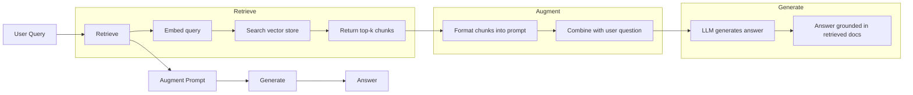
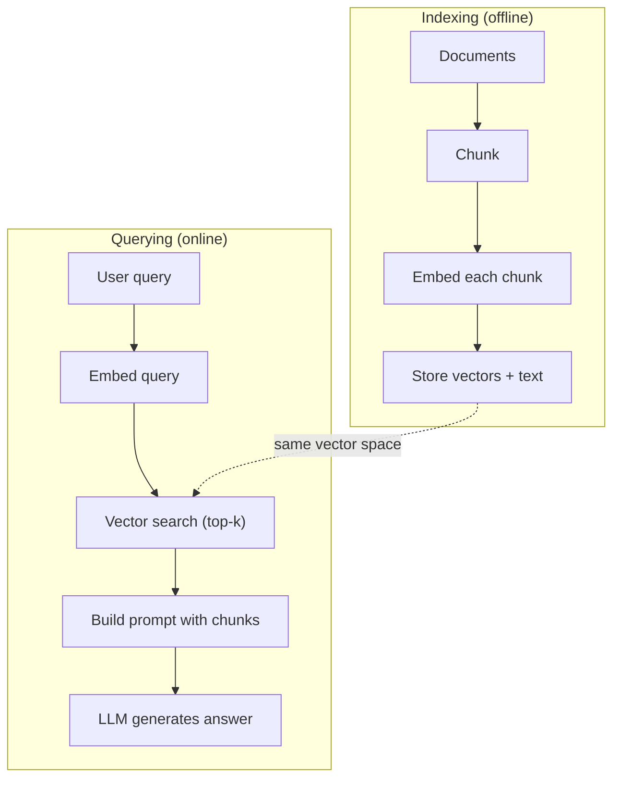

# 恢复增强的产物

> 你的LLM了解到之前的训练截止时间的一切――它不了解你的公司的文档,你的代码库,也不了解上周的会议记录――RAG通过检查相关文档并将它们插入以解决这个问题――它是生产环境中部署最广泛的AI模式――如果你只从这个课程中构建一个东西,那就构建一个RAG管道――

**Type:** Build
**Languages:** Python
**Prerequisites:** Phase 10 (LLMs from Scratch), Phase 11 Lessons 01-05
**Time:** ~90 minutes
**Related:**讲解六种采用模式和各自适用的场景――5期·22期 (嵌入模型深入潜水) 讲解如何选择嵌入器――11期·07期 (先进RAG) 讲解混合搜索、重新排名和查询转换――

## 学习目标
- 构建完整的RAG管道:文件加载,分块化,嵌入,载体存储,恢复和生成
- 使用向量数据库 (ChromaDB、FAISS 或 Pinecone)并配合适的索引,实现语义搜索
- 解释为什么在知识基础的应用中RAG 优于细节调整 (成本,新鲜度,可归因性)
- 使用检索指标 (准确性,回忆) 和生成指标 (忠实性,相关性) 评估RAG质量

## 问题
你为公司建立了一个聊天机器人.客户问:企业方案退款政策是什么?LLM 给出了一个关于典型的SaaS退款政策的全方位答案.实际政策埋在一个200页的内部维基中,规定企业客户有60个窗口,并可以按比例退款.LLM 从未见过这个文档.

调整是解决方案之一. 拿这本士,用你的内部文档训练它,然后部署更新后的模型. 这可行,但有严重的问题.

RAG是另一种解决方案. 保持模型不变. 当问题出现时,在您的文档商店中搜索相关段落,将它们粘贴到问题前面的提示中,让模型基于这些段落 作为文本来回答. 文档商店可以在几分钟内更新. 你可以清楚地看到具体检索到哪些文档.

## 概念
### 红色电气模式

整个模式可以概括为四步:



查询 -> 检索 -> 增强提示 -> 生成――每个RAG系统都遵循这个模式――生产级RAG系统之间的差异现在体现在每个步骤的细节中:如何分块"",如何嵌入"",如何搜索"",以及如何构建提示――

### 为什么RAG比调整更好

| Concern | Fine-tuning | RAG |
|---------|------------|-----|
| 成本 | 每次 training run 需要 $1,000-$100,000+ | 每次 query 约 $0.01-$0.10（embedding + LLM） |
| 新鲜度 | 重新训练前一直过时 | 通过重新 indexing docs，可在几分钟内更新 |
| 可审计性 | 无法追踪 answer 到 source | 可以展示准确检索到的 passages |
| Hallucination | 仍然会自由 hallucinate | 基于检索到的 documents |
| 数据隐私 | training data 被烘焙进 weights | documents 留在你的 vector store 中 |

细调会永久改变模型的重量――RAG会临时改变模型的背景――对于大多数应用来说,临时的背景是你想要的――

优化 胜出的唯一场景:你需要采用某种特定风格,语气或推理模式的模型,而这些不能仅仅通过提示实现.

### 嵌入模型

嵌入模型 会把文本转换为密集向量──相似文本会在这个高维空间中产生彼此接近的向量── 我如何重置密码? 和  我需要改变密码 尽管共享的词很少,但会产生几乎相同的向量── 猫坐在床 则会产生非常不同的向量──

常见嵌入模型(2026 阵容  完整分析见5期 · 22期):

| Model | Dimensions | Provider | Notes |
|-------|-----------|----------|-------|
| text-embedding-3-small | 1536 (Matryoshka) | OpenAI | 适合大多数用例的最佳性价比 |
| text-embedding-3-large | 3072 (Matryoshka) | OpenAI | 更高准确率，可截断到 256/512/1024 |
| Gemini Embedding 2 | 3072 (Matryoshka) | Google | 顶级 MTEB retrieval；8K context |
| voyage-4 | 1024/2048 (Matryoshka) | Voyage AI | 领域变体（code、finance、law） |
| Cohere embed-v4 | 1024 (Matryoshka) | Cohere | 强 multilingual，128K context |
| BGE-M3 | 1024 (dense + sparse + ColBERT) | BAAI (open-weight) | 一个模型提供三种视图 |
| Qwen3-Embedding | 4096 (Matryoshka) | Alibaba (open-weight) | 顶级 open-weight retrieval score |
| all-MiniLM-L6-v2 | 384 | Open-weight (Sentence Transformers) | prototyping baseline |

在本课中,我们将使用TF-IDF构建自己的简单嵌入式. 不是因为TF-IDF是生产系统会使用的方案,而是因为它使概念变得具体:文本输入,向量输出,相似文本产生相似的向量.

### 矢量相似性

给定两个向量,如何衡量相似性?

**Cosine similarity**两个向量 之间角的余弦值──范围从 -1 相反) 到 1 完全相同)  忽略大小,只关注方向──这是RAG的默认选择──

```
cosine_sim(a, b) = dot(a, b) / (||a|| * ||b||)
```

**Dot product**它们的数量更高. 它们的数量更大.

```
dot(a, b) = sum(a_i * b_i)
```

**L2 (Euclidean) distance**距离越小 = 越相似――对大小差异敏感――

```
L2(a, b) = sqrt(sum((a_i - b_i)^2))
```

随着大小的归结,能优雅处理不同长度的文档. 当有人说"向量搜索"时,几乎总是指"随量相似之处".

### 碎策略

文件太长,不能作为单个向量来嵌入. 一个50页的PDF可能会产生很糟糕的嵌入,因为它包含几十个主题. 相反,你应该把文件拆分成块,并分别嵌入每个块.

**Fixed-size chunking**单个512代币块 配合50代币重叠,意味着第1个是0-511代币,第2个是462-973代币,以此类推推.

**Semantic chunking**在自然界处分分──段落、章节或标记标题──每块都是一个语义连贯的单元──实现更复杂,但检索效果更好──

**Recursive chunking**首先尝试在最大边界处拆分 (分开) 部分标题. 如果某个部分仍然太大,就按照段落边界拆分. 如果某个段落仍然太大,就按照句子边界拆分.这是LangChain Recursive CharacterTextSplitter的方法,在实践中效果很好.

部分大小比人们想象的更重要:

- 太小(64-128代币):每块都没有背景── 上个季度增长了15%.
- 太大(2048+代币):每块 覆盖多个主题,稀释相关性──当你搜索收入数据时,你得到10% 关于收入的90% 关于人数的部分──
- 理想范围 ((256-512代币):文本 足够自含,同时足够聚焦以保持相关性.

大多数生产级RAG系统使用256-512个代币块,并配50个代币重叠──人类的RAG指南推这个范围──

### 矢量数据库

一旦有嵌入式,你就需要存储和搜索它们的地方.

| Database | Type | Best for |
|----------|------|----------|
| FAISS | Library (in-process) | Prototyping，中小型 datasets |
| Chroma | Lightweight DB | 本地开发，小型部署 |
| Pinecone | Managed service | 无需运维负担的生产环境 |
| Weaviate | Open source DB | 自托管生产环境 |
| pgvector | Postgres extension | 已经在使用 Postgres |
| Qdrant | Open source DB | 高性能自托管 |

在本课程中,我们将构建一个简单的内存向量存储器――它将向量放在存在列表中,并执行粗武宇宙相似之处搜索――这等于使用平面索引的 FAISS――它在变化之前大约可以扩展到10万向量――生产系统使用HNSW,这种类型的近邻算法,在毫秒级搜索数百万向量――

### 整个管道



在生产环境中,索引可能需要数小时处理数百万文件. 查询必须在一秒内响应.

### 真实数字

大多数生产级RAG系统使用这些参数:

- **k = 5 to 10**: 每次查询 检索的块 数量
- **Chunk size = 256 to 512 tokens**并配50个代币重叠
- **Context budget**查询每次使用2500至5000个代币的获取内容
- **Total prompt**系统提示+检索的部分+对话历史记录+用户查询)
- **Embedding dimension**取决于模型
- **Indexing throughput**:使用API嵌入 时每秒100-1,000文件
- **Query latency**产品的产品:


```figure
rag-chunking
```

## 构建它
### 步骤1:文件的分化

```python
def chunk_text(text, chunk_size=200, overlap=50):
    words = text.split()
    chunks = []
    start = 0
    while start < len(words):
        end = start + chunk_size
        chunk = " ".join(words[start:end])
        chunks.append(chunk)
        start += chunk_size - overlap
    return chunks
```

### 步骤 2: TF-IDF嵌入

我们构建了一个简单的嵌入函数――TF-IDF (Term Frequency-Inverse Document Frequency) 不是神经嵌入,但它可以以捕捉词语的重要性的方式将文本转换为向量――某文档中频繁出现的词语会获得更高的TF――在整个体内罕见的词语会获得更高的IDF――二者相乘以一个向量,其中重要且有区别的词语具有更高的价值――

```python
import math
from collections import Counter

def build_vocabulary(documents):
    vocab = set()
    for doc in documents:
        vocab.update(doc.lower().split())
    return sorted(vocab)

def compute_tf(text, vocab):
    words = text.lower().split()
    count = Counter(words)
    total = len(words)
    return [count.get(word, 0) / total for word in vocab]

def compute_idf(documents, vocab):
    n = len(documents)
    idf = []
    for word in vocab:
        doc_count = sum(1 for doc in documents if word in doc.lower().split())
        idf.append(math.log((n + 1) / (doc_count + 1)) + 1)
    return idf

def tfidf_embed(text, vocab, idf):
    tf = compute_tf(text, vocab)
    return [t * i for t, i in zip(tf, idf)]
```

### 步骤3: 求真相相似性

```python
def cosine_similarity(a, b):
    dot = sum(x * y for x, y in zip(a, b))
    norm_a = math.sqrt(sum(x * x for x in a))
    norm_b = math.sqrt(sum(x * x for x in b))
    if norm_a == 0 or norm_b == 0:
        return 0.0
    return dot / (norm_a * norm_b)

def search(query_embedding, stored_embeddings, top_k=5):
    scores = []
    for i, emb in enumerate(stored_embeddings):
        sim = cosine_similarity(query_embedding, emb)
        scores.append((i, sim))
    scores.sort(key=lambda x: x[1], reverse=True)
    return scores[:top_k]
```

### 步骤4:快速建设

这就是RAG中增加的发生的地方. 取出检查到的部分,将它们格式化成提示,然后要求LLM基于给定的背景答案.

```python
def build_rag_prompt(query, retrieved_chunks):
    context = "\n\n---\n\n".join(
        f"[Source {i+1}]\n{chunk}"
        for i, chunk in enumerate(retrieved_chunks)
    )
    return f"""Answer the question based ONLY on the following context.
If the context doesn't contain enough information, say "I don't have enough information to answer that."

Context:
{context}

Question: {query}

Answer:"""
```

### 步骤5:完整的RAG管道

```python
class RAGPipeline:
    def __init__(self):
        self.chunks = []
        self.embeddings = []
        self.vocab = []
        self.idf = []

    def index(self, documents):
        all_chunks = []
        for doc in documents:
            all_chunks.extend(chunk_text(doc))
        self.chunks = all_chunks
        self.vocab = build_vocabulary(all_chunks)
        self.idf = compute_idf(all_chunks, self.vocab)
        self.embeddings = [
            tfidf_embed(chunk, self.vocab, self.idf)
            for chunk in all_chunks
        ]

    def query(self, question, top_k=5):
        query_emb = tfidf_embed(question, self.vocab, self.idf)
        results = search(query_emb, self.embeddings, top_k)
        retrieved = [(self.chunks[i], score) for i, score in results]
        prompt = build_rag_prompt(
            question, [chunk for chunk, _ in retrieved]
        )
        return prompt, retrieved
```

### 步骤 6: 代 (模拟)

在生产环境中,我们将使用LLM API. 在本课程中,我们通过从检查到的背景中提取最相关的句子来模拟生成.

```python
def simple_generate(prompt, retrieved_chunks):
    query_words = set(prompt.lower().split("question:")[-1].split())
    best_sentence = ""
    best_score = 0
    for chunk in retrieved_chunks:
        for sentence in chunk.split("."):
            sentence = sentence.strip()
            if not sentence:
                continue
            words = set(sentence.lower().split())
            overlap = len(query_words & words)
            if overlap > best_score:
                best_score = overlap
                best_sentence = sentence
    return best_sentence if best_sentence else "I don't have enough information."
```

## 使用它
使用真实嵌入模型 和 LLM 时,代码几乎不变:

```python
from openai import OpenAI

client = OpenAI()

def embed(text):
    response = client.embeddings.create(
        model="text-embedding-3-small",
        input=text
    )
    return response.data[0].embedding

def generate(prompt):
    response = client.chat.completions.create(
        model="gpt-4o-mini",
        messages=[{"role": "user", "content": prompt}],
        temperature=0
    )
    return response.choices[0].message.content
```

或使用人类:

```python
import anthropic

client = anthropic.Anthropic()

def generate(prompt):
    response = client.messages.create(
        model="claude-sonnet-4-20250514",
        max_tokens=1024,
        messages=[{"role": "user", "content": prompt}]
    )
    return response.content[0].text
```

管道是一样的. 替换嵌入功能. 替换生成功能. 检索逻辑. 块化. 快速构建.

对于大规模的向量存储,使用合适的向量数据库 替换粗 lực搜索:

```python
import chromadb

client = chromadb.Client()
collection = client.create_collection("my_docs")

collection.add(
    documents=chunks,
    ids=[f"chunk_{i}" for i in range(len(chunks))]
)

results = collection.query(
    query_texts=["What is the refund policy?"],
    n_results=5
)
```

Chroma 会在内部处理嵌入式中使用全MiniLM-L6-v2),并把向量存储在本地数据库中.

## 交付它
本课会产出:
- `outputs/prompt-rag-architect.md`一个用于特定用途设计的RAG系统提示
- `outputs/skill-rag-pipeline.md`一个教练代理 如何构建和调试RAG管道的技能

## 练习
1. 用简单的字包 方法替换TF-IDF嵌入式(二值:词存在则为 1,不存在则为 0) ⋅在样本文件上比较检索质量――TF-IDF 应该表现得更好,因为它会给罕见词更高权重――

2. 试验不同部分尺寸:在同一文件集上尝试50、100、200 和500字──对每个尺寸,运行相同的5个查询,并统计有多少可以在前3中返回相关部分──找到检索质量 达到峰值的甜点──

3. 为每一个部分 添加元数据 (来源文件名称,部分位置) 修改提示模板以包含源属性,让LLM引用其来源.

4. 实现一个简单的评估:给定10个问题-答案对,让每个问题通过RAG管道,并衡量检索到的块中有多少比例含有答案.

5. 构建对话意识的RAG管道:维护最近3轮交易所的历史,并将其与检索的块 一起包含在即时中.

## 关键术语
| Term | What people say | What it actually means |
|------|----------------|----------------------|
| RAG | “能阅读你文档的 AI” | 检索相关 documents，把它们粘贴到 prompt 中，并生成一个基于这些 documents 的 answer |
| Embedding | “把文本转换成数字” | 文本的 dense vector representation，其中相似含义会产生相似 vectors |
| Vector database | “面向 AI 的搜索引擎” | 为存储 vectors 并按 similarity 找到 nearest neighbors 而优化的数据存储 |
| Chunking | “把 docs 拆成片段” | 将 documents 拆成更小的 segments（通常 256-512 tokens），以便每个 segment 可以独立 embed 和 retrieve |
| Cosine similarity | “两个 vectors 有多相似” | 两个 vectors 之间夹角的余弦值；1 = 方向相同，0 = 正交，-1 = 相反 |
| Top-k retrieval | “取 k 个最佳匹配” | 从 vector store 中返回与 query 最相似的 k 个 chunks |
| Context window | “LLM 能看到多少文本” | LLM 在单次请求中可以处理的最大 tokens 数；retrieved chunks 必须放入这个范围内 |
| Augmented generation | “使用给定 context 回答” | 使用检索到的 documents 作为 context 来生成响应，而不是仅依赖训练得到的知识 |
| TF-IDF | “词语重要性评分” | Term Frequency 乘以 Inverse Document Frequency；根据词语在 corpus 中的区分度为其加权 |
| Indexing | “为搜索准备 docs” | 离线执行 chunking、embedding 和 storing documents 的过程，使它们能在 query time 被搜索 |

## 延伸阅读
- 易斯等人, 获取知识密集型NLP任务的增强代代 (2020) Facebook人工智能研究提出的原始RAG论文,形式化了获取然后生成模式
- 关于零件尺寸的实践指南,即时构建和评估
-   用清晰可视化解释RAG管道,并包含生产环境考量
- 文本-BERT:Reimers & Gurevych (2019) 全MiniLM嵌入模型 背后的论文,展示如何为语义相似性 训练双码器
- [Karpukhin et al., “Dense Passage Retrieval for Open-Domain Question Answering” (EMNLP 2020)](https://arxiv.org/abs/2004.04906) DPR 论文,证明密集的双码码检索 在开放域的QA 上优于BM25,并建立了现代RAG检索器的模式.
- [LlamaIndex High-Level Concepts](https://docs.llamaindex.ai/en/stable/getting_started/concepts.html) 构建RAG管道 时需要了解主要概念:数据加载器、节点分类器、指数、检索器、响应合成器──
- [LangChain RAG tutorial](https://python.langchain.com/docs/tutorials/rag/) 另一种风格的管弦乐器;以链运行物 视角理解同一个恢复然后生成模式
