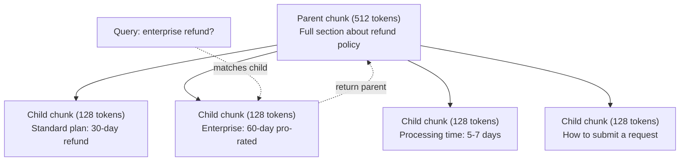
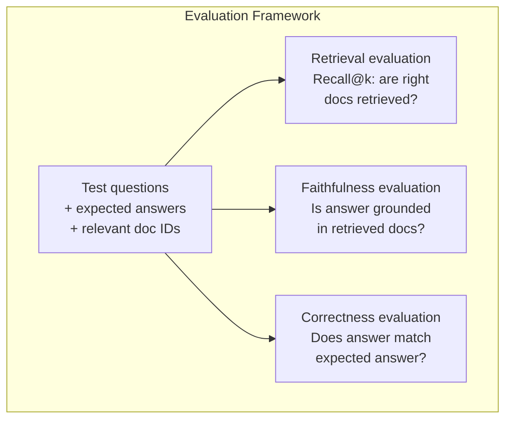

# 复杂的RAG(缩小、重新排名、混合搜索)

> 基本RAG会检查最相似的顶部部分――这对简单的问题有效――但面对多跳推理、模糊查询 和大规模的库存时就会失效――高级RAG是能够在10个文档上运行的演示与能够在1000万个文档上运行的系统之间的区别――

**类型：**构建
**语言：**字符串
**前置要求：**阶段11 第06课 (RAG)
**时间：**时间90分钟
**相关：**阶段5 · 23 (RAG的零碎策略) 涵盖了所有六种零碎算法:递归,语义,句子,父母文档,迟到零碎,文本检索,并包含VECTARA/ANTHROPIC基准. 本课在此基础上继续:混合搜索,重新排名,查询转换.

## 学习目标

- 实现能够保留文档结构和上下文的先进分化策略
- 构建一个混合搜索管道,将BM25与语义向量搜索和跨码重新排名的关键字匹配
- 应用查询转换 技术 技术 技术 技术 技术 技术 技术 技术 技术 技术 技术 技术 技术 技术 技术 技术 技术 技术 技术 技术 技术 技术 技术 技术 技术 技术 技术 技术 技术 技术 技术 技术 技术 技术 技术 技术 技术 技术 技术 技术 技术 技术 技术 技术 技术 技术 技术 技术 技术 技术 技术 技术 技术 技术 技术 技术 技术 技术 技术 技术 技术 技术 技术 技术 技术 技术 技术 技术 技术 技术 技术 技术 技术 技术 技术 技术 技术 技术 技术 技术 技术 技术 技术 技术 技术 技术 技术 技术 技术 技术 技术 技术 技术 技术 技术 技术 技术 技术 技术 技术 技术 技术 技术 技术 技术 技术 技术 技术 技术 技术 技术 技术 技术 技术 技术 技术 技术 技术 技术 技术 技术 技术 技术 技术 技术 技术 技术 技术 技术 技术 技术 技术 技术 技术 技术 技术 技术 技术 技术 技术 技术 技术 技术 技术 技术 技术 技术 技术 技术 技术 技术 技术 技术 技术 技术 技术 技术 技术 技术 技术 技术 技术 技术 技术 技术 技术 技术 技术 技术 技术 技术 技术 技术 技术 技术 技术 技术 技术 技术 技术 技术 技术 技术 技术 技术 技术 技术 技术 技术 技术 技术 技术 技术 技术 技术 技术 技术 技术 技术 技术 技术 技术 技术 技术 技术 技术 技术 技术 技术 技术 技术 技术 技术 技术 技术 技术 技术 技术 技术 技术 技术 技术 技术 技术 技术 技术 技术 技术 技术 技术 技术 技术 技术 技术 技术 技术 技术 技术 技术 技术 技术 技术 技术 技术 技术 技术 技术 技术 技术 技术 技术 技术
- 诊断并修复常见RAG 失败:检索到错误的部分、答案不在背景中、多跳推理 崩

## 问题

你在第06课中构建了一个基本的RAG管道. 它在小型体内回答直接问题时表现不错.

**模糊 query**:"上个季度收入是什么?"语义搜索 返回关于收入战略,收入预测以及财务总监对收入增长的看法部分──它们都与单词"收入"语义相似──但都不包含实际数字──正确部分$47.2M in Q3 2025"，但使用的是 "earnings" 而不是 "revenue"。Embedding model 认为 "revenue strategy" 比 "Q3 earnings were $更多关于"查询"的信息

**Multi-hop question**:"哪个团队获得了最高的客户满意度评分改善?" 这需要找到每个团队的满意度评分,进行比较,并识别最大值――没有任何单个部分 包含答案――信息分散在每个团队报告中――

**大规模 corpus 问题**你有200万个部分──正确答案在部分#1,847,293──你的前五回复 拉取了部分#14、#89,201、#1,200,000、#44 和 #901,333──它们在嵌入空间中接近,但没有一个包含答案──在这种规模下,近乎最近的邻居搜索会引入足够多的错误,导致相关结果被挤出到顶层.

基本RAG 失败的原因是矢量相似性 不等于相关性――一个部分可以在语义上与查询相似,但对答案问题没有帮助――先进RAG使用四种技术解决这个问题:混合搜索 (加入关键词匹配) ‧重新排名 (更仔细给候选人打分) ‧查询转换 (在搜索前修改查询),以及更好的查询 (为了适合粒度检查) ‧

## 核心概念

### 混合搜索:语义 +关键词

语义搜索(矢量相似性)擅长理解含义──"我如何取消订阅?" 即使与"终止你的计划的步骤" 没有共享单词,也能匹配──但它会漏掉精确匹配──"错误代码E-4021"可能无法匹配包含"E-4021"的部分,因为嵌入模型可能把它当作噪音──

据了解,这项计划是"终止你的计划"",取消我的订阅",但如果文档写"终止你的计划"",取消我的订阅",会返回零结果.

混合搜索会同时运行两者,然后合并结果.

**BM25**据悉,该技术是"搜索引擎的核心".

```
BM25(q, d) = sum over terms t in q:
    IDF(t) * (tf(t,d) * (k1 + 1)) / (tf(t,d) + k1 * (1 - b + b * |d| / avgdl))
```

其中 tf(t,d) 是术语 t 在文档 d 中的术语频率,IDF(t) 是逆文档频率,

通俗地说:当文档包含查询术语 (尤其是稀有术语) 时,BM25 会给文档更高分,但重复术语的收益会递减――一个包含"收入"的文档,不比包含一次的文档相关性高50倍――

### 相互级别融合 (RRF)

你有两个排名列表:一个来自向量搜索,一个来自BM25. 如何组合它们?

```
RRF_score(d) = sum over rankings R:
    1 / (k + rank_R(d))
```

其中,k 是一个常数 (通常为60),用于防止排名第一的结果占据过大优势.

一个在向量搜索中排名 #1 位,在BM25中排名 #5 的文档得分为:1/(60+1) +1/(60+5) =0.0164 +0.0154 =0.0318

一个在向量搜索中排名 #3 ٬在 BM25 中排名 #2 的文档得分为:1/(60+3) +1/(60+2) =0.0159 +0.0161 =0.0320

RRF 会自然平衡这两类信号.一个在两个列表中排名很高的文档会获得最佳分数.一个在某个列表中排名为#1,但在另一个列表中缺失的文档会获得中等分数.

### 排名重定

检索 (无论是矢量,关键字还是混合) 速度快,但不够精确――它使用双编码器:查询 和每个文档 独立进行嵌入,然后比较――嵌入 会提前计算并缓存――这可以扩展到数百万文档――

排名使用跨编码器:查询 和候选文件 会一起输入模型,模型输出相关性分数――模型可以同时看到两段文本,因此可以捕捉它们之间的细粒度交互――跨编码器能理解"Q3的收益是什么?"与包含"Q3中的47.2M美元"的部分高度相关,即使双编码器漏掉了这种联系――

权衡是:交叉编码器比双编码器慢100-1000倍,因为它需要联合处理查询文档对――你无法为一百万文档预计算交叉编码器 分数――解决方案是:先检查一个更大的候选组――混合搜索的前50),然后使用交叉编码器重新排名,最终得到前五――


常见重新排名模型(2026 阵容):
- 合并排名3.5:管理API,多语言,在混合体上回忆获利 最佳
- 旅行重排-2.5:管理API,托管选项中延迟 最低
- 更多语言:开放权重,支持100+ 语言
- 开放权重强基线
- 跨码码器/ms-marco-MiniLM-L-6-v2:开放权重,可在CPU上运行,适合原型制作
- 结合了许多不同的测量,在评分时是 O(tokens) 而不是 O(docs)

### 查询转换

有时问题不在检索,而在查询本身――"新政策变化是什么?" 是一个非常糟糕的搜索查询――它没有任何具体的术语――嵌入式 很模糊――没有检索系统

**Query rewriting**您可以在此进行搜索.

```
User: "What was that thing about the new policy change?"
Rewritten: "Recent policy changes and updates"
```

**HyDE（Hypothetical Document Embeddings）**没有用查询搜索,而是先生做一个假设答案,对它做嵌入,然后搜索相似的真实文档.

```
Query: "What is the refund policy for enterprise?"
Hypothetical answer: "Enterprise customers are eligible for a full refund
within 60 days of purchase. Refunds are pro-rated based on the remaining
subscription period and processed within 5-7 business days."
```

对于假设答案做嵌入,并搜索与它相似的真实文档.直觉是:相比原始问题,假设答案在嵌入空间中更接近真实答案.

代会在检索前增加一次LLM调用. 这会增加500-2000ms的延迟.

### 亲子的分手

标准分块 迫使你做取舍:小分块 用于精确的检索,大分块 用于提供足够的背景――父母-孩子分块 消除了这个取舍――

索引小块 (小块) 128代币) 用于检索. 当检索到小块时,把它的母块 (小块) 512代币) 回复给提示. 小块能精确匹配查询.



查询"企业退款?" 会精确匹配儿童部分C2――但提示 收到的是完整的父母部分P,其中包含处理时间和提交流程的周边环境――

### 分析数据

在运行向量搜索之前,根据元数据 过体:date、source、category、author、language──这会缩小搜索空间并避免不相关结果──

如果没有过元数据,你会搜索整个文件库,可能检索到一个2年前的安全文件,只是因为它在语义上很像――

产品RAG系统将元数据与每个部分进行存储:源文档、创建日期、类别、作者、版本──矢量数据库 支持在类似性搜索前按元数据进行预过,这对大规模性能至关重要──

### 评估

你建立了一个RAG系统. 如何知道它是否有效?

**Retrieval relevance（Recall@k）**对于一组已知相关文档的测试问题,相关文档出现在前五的结果中比例是多少?

**Faithfulness**如果检索部分写着"60天退款窗口",模型回答"90天退款窗口",那就是忠诚度失败.模型在拥有正确的背景的情况下仍然幻觉.

**Answer correctness**结果是否与预期的答案相匹配?这是端到端指标.

一个简单的忠实性检查:取生成答案中的每个索赔,并验证它是否在实质上出现在检索的部分中. 如果答案包含任何检索的部分中没有事实,它很可能是幻觉.




```figure
agentic-rag-loop
```

## 构建

### 步骤1:BM25 实现

```python
import math
from collections import Counter

class BM25:
    def __init__(self, k1=1.2, b=0.75):
        self.k1 = k1
        self.b = b
        self.docs = []
        self.doc_lengths = []
        self.avg_dl = 0
        self.doc_freqs = {}
        self.n_docs = 0

    def index(self, documents):
        self.docs = documents
        self.n_docs = len(documents)
        self.doc_lengths = []
        self.doc_freqs = {}

        for doc in documents:
            words = doc.lower().split()
            self.doc_lengths.append(len(words))
            unique_words = set(words)
            for word in unique_words:
                self.doc_freqs[word] = self.doc_freqs.get(word, 0) + 1

        self.avg_dl = sum(self.doc_lengths) / self.n_docs if self.n_docs else 1

    def score(self, query, doc_idx):
        query_words = query.lower().split()
        doc_words = self.docs[doc_idx].lower().split()
        doc_len = self.doc_lengths[doc_idx]
        word_counts = Counter(doc_words)
        score = 0.0

        for term in query_words:
            if term not in word_counts:
                continue
            tf = word_counts[term]
            df = self.doc_freqs.get(term, 0)
            idf = math.log((self.n_docs - df + 0.5) / (df + 0.5) + 1)
            numerator = tf * (self.k1 + 1)
            denominator = tf + self.k1 * (1 - self.b + self.b * doc_len / self.avg_dl)
            score += idf * numerator / denominator

        return score

    def search(self, query, top_k=10):
        scores = [(i, self.score(query, i)) for i in range(self.n_docs)]
        scores.sort(key=lambda x: x[1], reverse=True)
        return scores[:top_k]
```

### 步骤2:相互级别融合

```python
def reciprocal_rank_fusion(ranked_lists, k=60):
    scores = {}
    for ranked_list in ranked_lists:
        for rank, (doc_id, _) in enumerate(ranked_list):
            if doc_id not in scores:
                scores[doc_id] = 0.0
            scores[doc_id] += 1.0 / (k + rank + 1)
    fused = sorted(scores.items(), key=lambda x: x[1], reverse=True)
    return fused
```

### 步骤3:混合搜索管道

```python
def hybrid_search(query, chunks, vector_embeddings, vocab, idf, bm25_index, top_k=5, fusion_k=60):
    query_emb = tfidf_embed(query, vocab, idf)
    vector_results = search(query_emb, vector_embeddings, top_k=top_k * 3)
    bm25_results = bm25_index.search(query, top_k=top_k * 3)
    fused = reciprocal_rank_fusion([vector_results, bm25_results], k=fusion_k)
    return fused[:top_k]
```

### 步骤4:简单的重排

在生产中,你会使用跨编码模型.这里我们构建一个重排器,使用词汇重叠,术语的重要性和句子匹配.

```python
def rerank(query, candidates, chunks):
    query_words = set(query.lower().split())
    stop_words = {"the", "a", "an", "is", "are", "was", "were", "what", "how",
                  "why", "when", "where", "do", "does", "for", "of", "in", "to",
                  "and", "or", "on", "at", "by", "it", "its", "this", "that",
                  "with", "from", "be", "has", "have", "had", "not", "but"}
    query_terms = query_words - stop_words

    scored = []
    for doc_id, initial_score in candidates:
        chunk = chunks[doc_id].lower()
        chunk_words = set(chunk.split())

        term_overlap = len(query_terms & chunk_words)

        query_bigrams = set()
        q_list = [w for w in query.lower().split() if w not in stop_words]
        for i in range(len(q_list) - 1):
            query_bigrams.add(q_list[i] + " " + q_list[i + 1])
        bigram_matches = sum(1 for bg in query_bigrams if bg in chunk)

        position_boost = 0
        for term in query_terms:
            pos = chunk.find(term)
            if pos != -1 and pos < len(chunk) // 3:
                position_boost += 0.5

        rerank_score = (
            term_overlap * 1.0
            + bigram_matches * 2.0
            + position_boost
            + initial_score * 5.0
        )
        scored.append((doc_id, rerank_score))

    scored.sort(key=lambda x: x[1], reverse=True)
    return scored
```

### 步骤 5:HyDE(假设文件嵌入)

```python
def hyde_generate_hypothesis(query):
    templates = {
        "what": "The answer to '{query}' is as follows: Based on our documentation, {topic} involves specific policies and procedures that define how the process works.",
        "how": "To address '{query}': The process involves several steps. First, you need to initiate the request. Then, the system processes it according to the defined rules.",
        "default": "Regarding '{query}': Our records indicate specific details and policies related to this topic that provide a comprehensive answer."
    }
    query_lower = query.lower()
    if query_lower.startswith("what"):
        template = templates["what"]
    elif query_lower.startswith("how"):
        template = templates["how"]
    else:
        template = templates["default"]

    topic_words = [w for w in query.lower().split()
                   if w not in {"what", "is", "the", "how", "do", "does", "a", "an",
                                "for", "of", "to", "in", "on", "at", "by", "and", "or"}]
    topic = " ".join(topic_words) if topic_words else "this topic"

    return template.format(query=query, topic=topic)


def hyde_search(query, chunks, vector_embeddings, vocab, idf, top_k=5):
    hypothesis = hyde_generate_hypothesis(query)
    hypothesis_emb = tfidf_embed(hypothesis, vocab, idf)
    results = search(hypothesis_emb, vector_embeddings, top_k)
    return results, hypothesis
```

### 步骤6:父母-孩子的碎

```python
def create_parent_child_chunks(text, parent_size=200, child_size=50):
    words = text.split()
    parents = []
    children = []
    child_to_parent = {}

    parent_idx = 0
    start = 0
    while start < len(words):
        parent_end = min(start + parent_size, len(words))
        parent_text = " ".join(words[start:parent_end])
        parents.append(parent_text)

        child_start = start
        while child_start < parent_end:
            child_end = min(child_start + child_size, parent_end)
            child_text = " ".join(words[child_start:child_end])
            child_idx = len(children)
            children.append(child_text)
            child_to_parent[child_idx] = parent_idx
            child_start += child_size

        parent_idx += 1
        start += parent_size

    return parents, children, child_to_parent
```

### 步骤7:忠诚度评估

```python
def evaluate_faithfulness(answer, retrieved_chunks):
    answer_sentences = [s.strip() for s in answer.split(".") if len(s.strip()) > 10]
    if not answer_sentences:
        return 1.0, []

    grounded = 0
    ungrounded = []
    context = " ".join(retrieved_chunks).lower()

    for sentence in answer_sentences:
        words = set(sentence.lower().split())
        stop_words = {"the", "a", "an", "is", "are", "was", "were", "and", "or",
                      "to", "of", "in", "for", "on", "at", "by", "it", "this", "that"}
        content_words = words - stop_words
        if not content_words:
            grounded += 1
            continue

        matched = sum(1 for w in content_words if w in context)
        ratio = matched / len(content_words) if content_words else 0

        if ratio >= 0.5:
            grounded += 1
        else:
            ungrounded.append(sentence)

    score = grounded / len(answer_sentences) if answer_sentences else 1.0
    return score, ungrounded


def evaluate_retrieval_recall(queries_with_relevant, retrieval_fn, k=5):
    total_recall = 0.0
    results = []

    for query, relevant_indices in queries_with_relevant:
        retrieved = retrieval_fn(query, k)
        retrieved_indices = set(idx for idx, _ in retrieved)
        relevant_set = set(relevant_indices)
        hits = len(retrieved_indices & relevant_set)
        recall = hits / len(relevant_set) if relevant_set else 1.0
        total_recall += recall
        results.append({
            "query": query,
            "recall": recall,
            "hits": hits,
            "total_relevant": len(relevant_set)
        })

    avg_recall = total_recall / len(queries_with_relevant) if queries_with_relevant else 0
    return avg_recall, results
```

## 使用

使用真实跨码码器 进行重新排名:

```python
from sentence_transformers import CrossEncoder

reranker = CrossEncoder("cross-encoder/ms-marco-MiniLM-L-6-v2")

def rerank_with_cross_encoder(query, candidates, chunks, top_k=5):
    pairs = [(query, chunks[doc_id]) for doc_id, _ in candidates]
    scores = reranker.predict(pairs)
    scored = list(zip([doc_id for doc_id, _ in candidates], scores))
    scored.sort(key=lambda x: x[1], reverse=True)
    return scored[:top_k]
```

使用Cohere的管理重排器:

```python
import cohere

co = cohere.Client()

def rerank_with_cohere(query, candidates, chunks, top_k=5):
    docs = [chunks[doc_id] for doc_id, _ in candidates]
    response = co.rerank(
        model="rerank-english-v3.0",
        query=query,
        documents=docs,
        top_n=top_k
    )
    return [(candidates[r.index][0], r.relevance_score) for r in response.results]
```

使用真实 LLM 实现HyDE:

```python
import anthropic

client = anthropic.Anthropic()

def hyde_with_llm(query):
    response = client.messages.create(
        model="claude-sonnet-4-20250514",
        max_tokens=256,
        messages=[{
            "role": "user",
            "content": f"Write a short paragraph that would be a good answer to this question. Do not say you don't know. Just write what the answer would look like.\n\nQuestion: {query}"
        }]
    )
    return response.content[0].text
```

使用Weaviate 进行生产混合搜索:

```python
import weaviate

client = weaviate.connect_to_local()

collection = client.collections.get("Documents")
response = collection.query.hybrid(
    query="enterprise refund policy",
    alpha=0.5,
    limit=10
)
```

基本的控制权力:0.0 = 纯键词(BM25),1.0 = 纯向量,0.5 = 等权重――大多数生产系统使用0.3到0.7 之间的 alpha――

## 交付

本课会产出:
- `outputs/prompt-advanced-rag-debugger.md`-- 用于诊断和修复RAG质量问题
- `outputs/skill-advanced-rag.md`-- 用于构建具有混合搜索和重新排名的生产级RAG技能

## 练习

1. 在样本文档上比较BM25、矢量搜索和混合搜索――对于每一个5个测试查询中,记录哪种方法在位置#1 返回最相关的部分――混合搜索应至少在5个中赢得3个――

2. 实现元数据过器──为每份文件 添加一个"类别"字段(安全、结账、api、产品)──在运行向量搜索前,只过出相关类别的部分──用"使用什么加密?" 测试,并验证它只搜索安全类别的部分──

3. 使用06课中的简单生成函数 构建完整的HyDE管道──在全部的5个测试查询中上比较直接查询搜索与HyDE搜索的检索质量(前三相关性)──HyDE 应能改善模糊查询的结果──

4. 在样本文件上实现父母-孩子分量策略. 使用儿童分量=30 和父母分量=100. 用儿童分量 搜索,但在快速中返回父母分量.将生成答案与分量=50 的标准分量.进行比较.

5. 创建评估数据集:10 个问题,带已知答案部分──分别测量 (a) 仅向量搜索,(b) 仅BM25,(c) 混合搜索,(d) 混合+重排的 Recall@3、Recall@5 和 Recall@10──绘制结果,并识别重排 最有帮助的位置──

## 关键术语

| Term | 人们通常怎么说 | 实际含义 |
|------|----------------|----------------------|
| BM25 | "Keyword search" | 一种概率排序算法，根据 term frequency、inverse document frequency 和 document length normalization 给文档打分 |
| Hybrid search | "Best of both worlds" | 并行运行 semantic（Vector）search 和 keyword（BM25）search，然后用 rank fusion 合并结果 |
| Reciprocal Rank Fusion | "Merge ranked lists" | 对每个文档在所有列表中的 1/(k + rank) 求和，从而组合多个 ranked list |
| Reranking | "Second pass scoring" | 使用成本更高的 cross-encoder model，对 initial retrieval 得到的 candidate set 重新打分 |
| Cross-encoder | "Joint query-document model" | 将 query 和 document 作为单个输入并生成相关性分数的模型；比 bi-encoder 更准确，但对 full corpus search 来说太慢 |
| Bi-encoder | "Independent embedding model" | 独立对 query 和 document 做 Embedding 的模型；由于 Embedding 可预计算，因此速度快，但不如 cross-encoder 准确 |
| HyDE | "Search with a fake answer" | 为 query 生成 hypothetical answer，对其做 Embedding，并搜索与它相似的真实文档 |
| Parent-child chunking | "Small search, big context" | 为精确 retrieval 索引小 chunk，但返回更大的 parent chunk 以提供足够 context |
| Metadata filtering | "Narrow before searching" | 在运行 Vector search 前，根据属性（date、source、category）过滤文档以缩小搜索空间 |
| Faithfulness | "Did it stay grounded" | 生成答案是否由 retrieved document 支持，而不是来自模型训练数据的 hallucination |

## 延伸阅读

- 罗伯逊和萨拉戈萨, "概率相关性框架:BM25及其它领域" (2009) --BM25的权威参考,解释公式背后的概率基础
- 科尔麦克等人",相互级别融合优于康多塞特和个人级别学习方法" (2009) -- RRF 原始论文,展示它优于更复杂的融合方法
- 盖奥等人",没有相关性标签的精确零射集密度检索" (2022) -- HyDE论文,证明假设文件 嵌入式可以在没有任何训练数据的情况下改善检索
- 诺格耶拉和乔, "通过BERT重新排名" (2019) -- 展示在BM25 之上进行跨编码重新排名能显著提升检索质量
- [Khattab et al., "DSPy: Compiling Declarative Language Model Calls into Self-Improving Pipelines" (2023)](https://arxiv.org/abs/2310.03714)阅读此文,以了解"程序LLM",而不是"快速LLM".
- [Edge et al., "From Local to Global: A Graph RAG Approach to Query-Focused Summarization" (Microsoft Research 2024)](https://arxiv.org/abs/2404.16130)-- GraphRAG 论文:实体关系提取+莱登社区检测,用于查询重点总结;以及全球与本地检索的区别.
- [Asai et al., "Self-RAG: Learning to Retrieve, Generate, and Critique through Self-Reflection" (ICLR 2024)](https://arxiv.org/abs/2310.11511)-- 带反射代币的自评估RAG;静态检索-然后生成 后的代理前沿──
- [LangChain Query Construction blog](https://blog.langchain.dev/query-construction/)-- 如何将自然语言查询转换为结构化数据库查询(文本到SQL、Cypher),作为预检索步骤──
