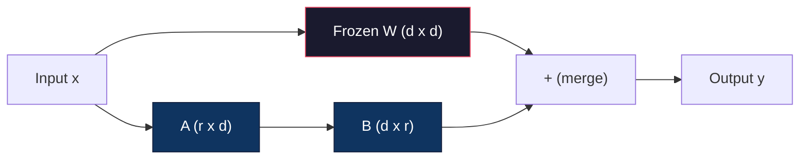
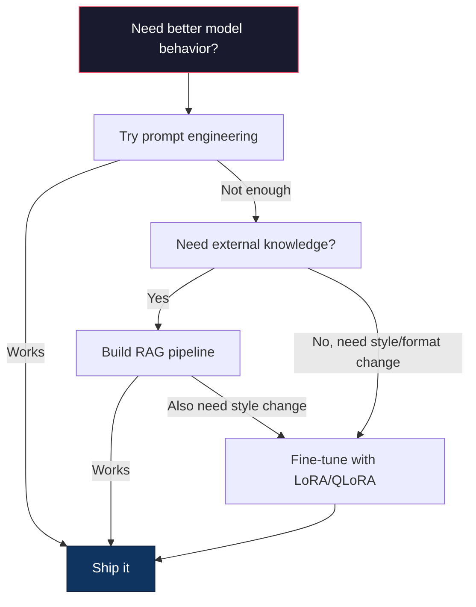

# 使用LoRA & QLoRA 进行精细调节

> 对于一个7B模型做完整的调整,需要56GB的VRAM――你没有这么多――大多数公司也没有――LoRA 通过训练不到1%的参数,让你能够在6GB中调整与同一个模型――这不是妥协――它在大多数任务中可以达到完整的调整质量――整个开源调整的态度都建立在这个技巧上――

**Type:** Build
**Languages:** Python
**Prerequisites:** Phase 10, Lesson 06 (Instruction Tuning / SFT)
**Time:** ~75 minutes
**Related:**课程将这些连接到2026 PEFT 工具链 (PEFT, TRL, Unsloth, Axolotl, LLaMA-Factory) .

## 学习目标
- 通过将低排调适配器矩阵(A 和 B) 注入预训练模型的注意力层来实现LoRA
- 计算 LoRA 相比全细调的参数节省:排名 r、d_模型 维度时,训练是 2*r*d 个参数,而不是 d^2
- 使用QLoRA(4位量化基 + LoRA适配器) 细调一个模型,使其适应消费级GPU内存
- 将LoRA重量合并回基模型 用于部署,并比较带适配器与不带适配器的推断速度

## 问题
你有一个基本模型――Llama 3 8B――你希望它能用你的公司语气回答客户支持工单――SFT是答案――但SFT有成本问题――

在fp16中,每个参数占据2字节──只需要16GB的加载权重.在训练期间,你还需要梯度(16GB)、亚当的优化状态(momentum + variance 需要32GB) 以及激活量──总计:单个8B模型大约需要56GB的VRAM──

云服务提供商每小时花费$3-4。用 50,000 个样本训练 3 个 epochs 需要 6-10 小时。每次实验就是 $为了调整超参数,你已经花了400美元,

扩展到Llama 3 70B,数字会变得荒唐. 只有重量需要140GB.

另外一个更深层次的问题――完整调整会修改模型中的每一个重量――如果你在客户支持数据上调整,可能会损害模型的通用能力――这被称为灾难性遗忘――模型在你的任务上变得好,在其他一切上变得差异――

你需要一种方法:训练更少参数,使用更少的记忆,并且不会破坏模型已有的知识.

## 概念
### 低级调整

爱德华·胡和微软的同事在2021年6月发表了LoRA──论文的洞察是:调整期间的权重更新 具有低内在等级──你不需要更新一个4096x4096权重矩阵中全部1670万个参数──更新中有用的信息可以从16或32级的矩阵中获取──

数学如下――一个标准线性层计算:

```
y = Wx
```

其中W是一个d_out xd_in矩阵.对于4096x4096的注意力投影,这就是16777,216个参数.

洛拉结 W,并添加一个低排分解:

```
y = Wx + BAx
```

其中B 是 (d_out x r),A 是 (r x d_in) ――排名r 远小于d--通常是8、16或32、

对于4096x4096层上层的 r=16:
- 原始参数:4096 x 4096 = 16,777,216
- 参数:(4096 x 16) + (16 x 4096) = 65,536 + 65,536 = 131,072
- 减少比例:131,072 / 16,777,216 = 0.78%

你训练的参数是0.78%,但获得了95%-100%的质量.



一个使用随机的高斯语初始化――B初始化为零――这意味着LoRA贡献从零开始 - 模型从原始行为开始训练,然后逐步学习适应――

### 规模因素:阿尔法

洛拉引入了扩展因子阿尔法,用于控制低排行更新对输出的影响程度:

```
y = Wx + (alpha / r) * BAx
```

当alpha = r 时,规模是1x──当alpha = 2r常见默认值) 当,规模是2x──这个超参数独立于基础学习率 控制LoRA路径的学习率──

实践建议:
-  ()  ()  ()  ()  ()  ()  ()  ()  ()  ()  ()  ()  ()  ()  ()  ()  ()  ()  ()  ()  ()  ()  ()  ()  ()  ()  ()  ()  ()  ()  ()  ()  ()  ()  ()  ()  ()  ()  () )  () )
- 提供1x扩展,保守但稳定
- 更高的阿尔法意味着每一步都会增加更新,可能会加快收费,也可能导致不稳定

### 适用Lora的地点

一个变压器有很多线性层――你不需要给所有层添加LoRA――原始论文测试了不同的组合:

| Target Layers | Trainable Params (7B) | Quality |
|--------------|----------------------|---------|
| q_proj only | 4.7M | 好 |
| q_proj + v_proj | 9.4M | 更好 |
| q_proj + k_proj + v_proj + o_proj | 18.9M | 对 attention 最好 |
| All linear (attention + MLP) | 37.7M | 边际收益，参数量 2x |

大多数任务的甜点位:q_proj + v_proj──这会准备自我注意 中的查询和值预测,它们控制模型 关注什么以及提取什么信息──添加MLP层对代码生成等复杂任务有帮助,但会让参数数翻倍,对简单任务则收益减少──

### 排名选择

排名 控制适应的表现能力:

| Rank | Trainable Params (per layer) | Best For |
|------|---------------------------|----------|
| 4 | 32,768 | 简单 classification、sentiment |
| 8 | 65,536 | 单领域 Q&A、summarization |
| 16 | 131,072 | 多领域任务、instruction following |
| 32 | 262,144 | 复杂 reasoning、代码生成 |
| 64 | 524,288 | 大多数任务收益递减 |
| 128 | 1,048,576 | 很少值得使用 |

胡等人表示,对于简单任务,r=4 已经能够捕获大部分适应性.r=8 和 r=16 是实践中最常见的选择.

### 定量:4位量化+LORA

蒂姆·德特默斯和华盛顿大学的同事在2023年5月发表了QLoRA.

这会显著改变记忆:

| Method | Weight Memory (7B) | Training Memory (7B) | GPU Required |
|--------|-------------------|---------------------|-------------|
| Full fine-tune (fp16) | 14GB | ~56GB | 1x A100 80GB |
| LoRA (fp16 base) | 14GB | ~18GB | 1x A100 40GB |
| QLoRA (4-bit base) | 3.5GB | ~6GB | 1x RTX 3090 24GB |

罗拉有三项技术贡献:

**NF4 (Normal Float 4-bit)**对于正常分布的量子素上,这是最优的.与统一的4位量子化 (INT4) 或标准 Float4相比,它损失的信息更少.

**Double quantization**对于7B模型,这将额外占0.4GB──双次量化将这些常量量化到fp8,把总费降至0.1GB──虽然小但会积累──

**Paged optimizers**训练期间,长序列上的优化器状态可能超过GPU内存. 页面优化器使用NVIDIA统一内存,在GPU内存耗尽时自动将优化器状态页到CPU RAM,并在需要时页面回来.

### 质量问题

减少参数或量化基础会损害质量吗?多篇论文的结果:

| Method | MMLU (5-shot) | MT-Bench | HumanEval |
|--------|--------------|----------|-----------|
| Full fine-tune (Llama 2 7B) | 48.3 | 6.72 | 14.6 |
| LoRA r=16 | 47.9 | 6.68 | 14.0 |
| QLoRA r=16 (NF4) | 47.5 | 6.61 | 13.4 |
| QLoRA r=64 (NF4) | 48.1 | 6.70 | 14.2 |

在 r=16时,在大多数基准上与完全调整相差不到1%──QLoRA在 r=16时又损失零点几百分点──QLoRA在 r=64时基本匹配于完全调整,同时使用90%的内存──

### 实际成本

在5万个样本上调整了拉马3 8B(3个时代):

| Method | GPU | Time | Cost |
|--------|-----|------|------|
| Full fine-tune | 2x A100 80GB | 8 hours | ~$32 |
| LoRA r=16 | 1x A100 40GB | 4 hours | ~$8 |
| QLoRA r=16 | 1x RTX 4090 24GB | 6 hours | ~$5 |
| QLoRA r=16 (Unsloth) | 1x RTX 4090 24GB | 2.5 hours | ~$2 |
| QLoRA r=16 | 1x T4 16GB | 12 hours | ~$4 |

在单张消费级GPU上运行QLoRA的成本不到一顿午餐. 这就是为什么开放权重细调社区在2023年爆发的原因,也是为什么下面的每个培训框架都默认提供QLoRA在2026年.

### 根据"2026年"的标准,

| Framework | What it is | Pick when |
|-----------|-----------|-----------|
| **Hugging Face PEFT** | 规范的 LoRA/QLoRA/DoRA/IA3 library | 你想要原始控制权，并且 training loop 已经基于 `transformers.Trainer` |
| **TRL** | HF 的 reinforcement-from-feedback trainers（SFT, DPO, GRPO, PPO, ORPO） | 你在 SFT 后需要 DPO/GRPO；构建在 PEFT 之上 |
| **Unsloth** | forward/backward pass 的 Triton-kernel 重写 | 你想要 2-5x 加速 + 一半 VRAM 且无 accuracy loss；Llama/Mistral/Qwen 系列 |
| **Axolotl** | PEFT + TRL + DeepSpeed + Unsloth 之上的 YAML-config wrapper | 你想要可复现、版本控制的 training runs |
| **LLaMA-Factory** | PEFT + TRL 之上的 GUI/CLI/API | 你想要 zero-code fine-tuning；支持 100+ model families |
| **torchtune** | Native PyTorch recipes，无 `transformers` 依赖 | 你想要最少依赖，且组织已经标准化使用 PyTorch |

经验法则:研究用途或一次性实验 → PEFT──可重复的生产管道 → 启动Unsloth核的Axolotl──一次性原型 → LLaMA-Factory──

### 融合适配器

训练后,你有两种东西:结的基模型和一个小型的LoRA适配器 (通常是10-100MB)

1. **保持分离**为了不同任务切换适配器,这是使用一个基础模型的方法.

2. **永久合并**计算 W' = W + (alpha/r) * BA,并把结果保存为一个新的完整模型――与原始模型相结合模型 大小相同――没有推断的上海费――没有适配器需要管理――

如果服务多个任务,则将其部署单个专用模型.

用于组合多个适配器的高级合并技术:

- **TIES-Merging**参数,解决标志冲突,然后合并――减少适配器 之间的干扰――
- **DARE**(Yu et al. 2023):在合并前随机丢弃适配器参数时,并重新缩小剩余部分――组合能力时出人意料地有效――
- **Task arithmetic**直接加减适配器重量――把一个"代码"适配器和一个"数学"适配器相加,通常会得到一个两者都擅长的模型――

### 什么时候不调整

调整是第三个选择,不是第一个.

**第一：prompt engineering。**写一个更好的系统提示――加入一些拍摄的例子――使用链接思考――这没有成本,只需要几分钟――如果提示已经达到80%,你可能不需要细节调――

**第二：RAG。**如果模型需要了解你的特定数据,请查看文档,知识库,产品目录,

**第三：fine-tuning。**当你需要模型采用特定的风格,格式或推理模式,而提示无法实现时使用它. 当你需要一致的结构化输出时. 当你需要把一个更大的模型蒸到更小的模型时. 当延迟时,很重要,并且你承担不起少数拍摄提示时.




```figure
lora-params
```

## 构建它
我们使用纯PyTorch从零实现LoRA──没有图书馆──没有魔法──你会构建LoRA层,将它注入模型,训练它,并把重量合并回去──

### 步骤1:洛拉层

```python
import torch
import torch.nn as nn
import math

class LoRALayer(nn.Module):
    def __init__(self, in_features, out_features, rank=8, alpha=16):
        super().__init__()
        self.rank = rank
        self.alpha = alpha
        self.scaling = alpha / rank

        self.A = nn.Parameter(torch.randn(in_features, rank) * (1 / math.sqrt(rank)))
        self.B = nn.Parameter(torch.zeros(rank, out_features))

    def forward(self, x):
        return (x @ self.A @ self.B) * self.scaling
```

缩放后的随机值初始化――B初始化为零――乘积BA从零开始,所以模型以原始行为开始――

### 步骤 2: 洛拉绕线性层

```python
class LinearWithLoRA(nn.Module):
    def __init__(self, linear, rank=8, alpha=16):
        super().__init__()
        self.linear = linear
        self.lora = LoRALayer(
            linear.in_features, linear.out_features, rank, alpha
        )

        for param in self.linear.parameters():
            param.requires_grad = False

    def forward(self, x):
        return self.linear(x) + self.lora(x)
```

原始线性层被结结. 只有LoRA参数.

### 步骤 3: 注入LoRA到模型中

```python
def inject_lora(model, target_modules, rank=8, alpha=16):
    for param in model.parameters():
        param.requires_grad = False

    lora_layers = {}
    for name, module in model.named_modules():
        if isinstance(module, nn.Linear):
            if any(t in name for t in target_modules):
                parent_name = ".".join(name.split(".")[:-1])
                child_name = name.split(".")[-1]
                parent = dict(model.named_modules())[parent_name]
                lora_linear = LinearWithLoRA(module, rank, alpha)
                setattr(parent, child_name, lora_linear)
                lora_layers[name] = lora_linear
    return lora_layers
```

首先,结论模型中每个参数――然后穿过模型树,找到与你的目标名称匹配的线性层,并使用LoRA包装的版本替换它们――LoRA A 和 B矩阵是整个模型中唯一可训练的参数――

### 步骤 4: 计数参数

```python
def count_parameters(model):
    total = sum(p.numel() for p in model.parameters())
    trainable = sum(p.numel() for p in model.parameters() if p.requires_grad)
    frozen = total - trainable
    return {
        "total": total,
        "trainable": trainable,
        "frozen": frozen,
        "trainable_pct": 100 * trainable / total if total > 0 else 0
    }
```

### 步骤 5: 重量重量重量重量重量重量重量重量重量重量重量重量重量重量重量重量重量重量重量重量重量重量重量重量重量重量重量重量重量重量重量重量重量重量重量重量重量重量重量重量重量重量重量重量重量重量重量重量重量重量重量重量重量重量重量重量重量重量重量重量重量重量重量重量重量重量重量重量重量重量重量重量重量重量重量重量重量重量重量重量重量重量重量重量重量重量重量重量重量重量重量重量重量重量重量重量重量重量重量重量重量重量重量重量重量重量重量重量重量重量重量重量重量重量重量重量重量重量重量重量重量重量重量重量重量重量重量重量重量重量重量重量重量重量重量重量重量重量重量重量重量重量重量重量重量重量重量重量重量重量重量重量重量重量重量重量重量重量重量重量重量重量重量重量重量重量重量重量重量重量重量重量重量重量重量重量重量重量重量重量重量重量重量重量重量重量重量重量重量重量重量重量重重量重量重量重量重量重量重重量重量重重重量重量重量重量重量重量重重重重重重重重重重重重重重重重重重重重重重重重重重重重重重重重重重重重重重重重重重重重重重重重重重重重重重重重重重重重重重重重重重重重重重重重重重重重重重重重重重重重重重重重重

```python
def merge_lora_weights(model):
    for name, module in model.named_modules():
        if isinstance(module, LinearWithLoRA):
            with torch.no_grad():
                merged = (
                    module.lora.A @ module.lora.B
                ) * module.lora.scaling
                module.linear.weight.data += merged.T
            parent_name = ".".join(name.split(".")[:-1])
            child_name = name.split(".")[-1]
            if parent_name:
                parent = dict(model.named_modules())[parent_name]
            else:
                parent = model
            setattr(parent, child_name, module.linear)
```

合并后,LoRA层消失──模型与原始模型大小相同,适应被进重量──没有推断的上──

### 步骤 6:模拟QLoRA量化

```python
def quantize_to_nf4(tensor, block_size=64):
    blocks = tensor.reshape(-1, block_size)
    scales = blocks.abs().max(dim=1, keepdim=True).values / 7.0
    scales = torch.clamp(scales, min=1e-8)
    quantized = torch.round(blocks / scales).clamp(-8, 7).to(torch.int8)
    return quantized, scales

def dequantize_from_nf4(quantized, scales, original_shape):
    dequantized = quantized.float() * scales
    return dequantized.reshape(original_shape)
```

通过将重量映射到每64个元素块内的16个离散层次来模拟4位量子化――生产级QLoRA使用位数和字节库在GPU实现真正的NF4――

### 步骤 7: 训练循环

```python
def train_lora(model, data, epochs=5, lr=1e-3, batch_size=4):
    optimizer = torch.optim.AdamW(
        [p for p in model.parameters() if p.requires_grad], lr=lr
    )
    criterion = nn.MSELoss()

    losses = []
    for epoch in range(epochs):
        epoch_loss = 0.0
        n_batches = 0
        indices = torch.randperm(len(data["inputs"]))

        for i in range(0, len(indices), batch_size):
            batch_idx = indices[i:i + batch_size]
            x = data["inputs"][batch_idx]
            y = data["targets"][batch_idx]

            output = model(x)
            loss = criterion(output, y)

            optimizer.zero_grad()
            loss.backward()
            optimizer.step()

            epoch_loss += loss.item()
            n_batches += 1

        avg_loss = epoch_loss / n_batches
        losses.append(avg_loss)

    return losses
```

### 步骤 8: 完整的演示

```python
def demo():
    torch.manual_seed(42)
    d_model = 256
    n_classes = 10

    model = nn.Sequential(
        nn.Linear(d_model, 512),
        nn.ReLU(),
        nn.Linear(512, 512),
        nn.ReLU(),
        nn.Linear(512, n_classes),
    )

    n_samples = 500
    x = torch.randn(n_samples, d_model)
    y = torch.randint(0, n_classes, (n_samples,))
    y_onehot = torch.zeros(n_samples, n_classes).scatter_(1, y.unsqueeze(1), 1.0)

    data = {"inputs": x, "targets": y_onehot}

    params_before = count_parameters(model)

    lora_layers = inject_lora(
        model, target_modules=["0", "2"], rank=8, alpha=16
    )

    params_after = count_parameters(model)

    losses = train_lora(model, data, epochs=20, lr=1e-3)

    merge_lora_weights(model)
    params_merged = count_parameters(model)

    return {
        "params_before": params_before,
        "params_after": params_after,
        "params_merged": params_merged,
        "losses": losses,
    }
```

这个演示 创建一个小模型,将LoRA注入两个层,训练它,并把重量合并回去.

## 使用它
在拥抱面孔 生态中,对真实模型使用LORA大约只需要20 行:

```python
from transformers import AutoModelForCausalLM, AutoTokenizer
from peft import LoraConfig, get_peft_model, TaskType

model = AutoModelForCausalLM.from_pretrained("meta-llama/Llama-3.1-8B")
tokenizer = AutoTokenizer.from_pretrained("meta-llama/Llama-3.1-8B")

lora_config = LoraConfig(
    task_type=TaskType.CAUSAL_LM,
    r=16,
    lora_alpha=32,
    lora_dropout=0.05,
    target_modules=["q_proj", "v_proj"],
)

model = get_peft_model(model, lora_config)
model.print_trainable_parameters()
```

对于QLoRA,添加比特和字节量化:

```python
from transformers import BitsAndBytesConfig

bnb_config = BitsAndBytesConfig(
    load_in_4bit=True,
    bnb_4bit_quant_type="nf4",
    bnb_4bit_compute_dtype=torch.bfloat16,
    bnb_4bit_use_double_quant=True,
)

model = AutoModelForCausalLM.from_pretrained(
    "meta-llama/Llama-3.1-8B",
    quantization_config=bnb_config,
    device_map="auto",
)

model = get_peft_model(model, lora_config)
```

现在就有了4位的LoRA适配器,以fp16训练,整个过程可以装入6GB.

使用拥抱面部训练师

```python
from transformers import TrainingArguments, Trainer
from datasets import load_dataset

dataset = load_dataset("tatsu-lab/alpaca", split="train[:5000]")

training_args = TrainingArguments(
    output_dir="./lora-llama",
    num_train_epochs=3,
    per_device_train_batch_size=4,
    gradient_accumulation_steps=4,
    learning_rate=2e-4,
    fp16=True,
    logging_steps=10,
    save_strategy="epoch",
    optim="paged_adamw_8bit",
)

trainer = Trainer(
    model=model,
    args=training_args,
    train_dataset=dataset,
)

trainer.train()

model.save_pretrained("./lora-adapter")
```

保存的适配器是10-100MB──基本模型保持不变──你可以在 Hugging Face Hub 上分享适配器,而无需重新分发完整的模型──

## 交付它
本课产出:
- `outputs/prompt-lora-advisor.md`-- 一个提示,帮助你确定特定任务,
- `outputs/skill-fine-tuning-guide.md`-- 一个技能,教代理人判断何时以及如何调整决策树

## 练习
1. **Rank ablation study。**使用排名 2、4、8、16、32 和 64 运行演示――绘制最终损失与排名――找到收益递减点,即排名 翻倍不再让损失 减半位置――对于256维特征上述简单分类任务,这应该在r=8-16 附近――

2. **Target module comparison。**修改注射_lora,使其分别只为目标层 "0"、只为目标层 "2"、只为目标层 "4"以及全部三层──每个变体都训练20个时代──比较化速度和最终损失──这应在真实场景中选择目标 q_proj、v_proj或所有线性层的决策──

3. **Quantization error analysis。**获取训练模型 在量化_到_nf4 / 量化_从_nf4 前后的权重矩阵――计算平均平方错误、最大绝对错误,以及原始和重建的权重之间的相关性──尝试区块_大小取值 32、64、128 和 256。

4. **Multi-adapter serving。**在不同数据集中 (即使是指数与奇数指数) 上练两个LoRA适配器──保存两个适配器──只加载一次基模型,然后切换适配器,并验证它们对相同输入产生不同的输出──这就是生产系统使用一个基 服务多个细调模型的方式──

5. **Merge vs. unmerged inference。**比较 100 个输入 上 LoRA 模型 在 merge_lora_weights 前后的输出――验证输出相似(在 1e-5 的浮点容忍内) ⋅然后基准 两个推断速度 - 合并 应该稍快,因为它是单次矩阵乘法,而不是两次――

## 关键术语
| Term | What people say | What it actually means |
|------|----------------|----------------------|
| LoRA | "Efficient fine-tuning" | Low-Rank Adaptation：冻结 base weights，训练两个小 matrices A 和 B，其乘积近似完整 weight update |
| QLoRA | "Fine-tune on a laptop" | Quantized LoRA：以 4-bit NF4 加载 base model，在其上用 fp16 训练 LoRA adapters，从而让 7B fine-tuning 能在 6GB VRAM 中完成 |
| Rank (r) | "How much the model can learn" | A 和 B matrices 的内部维度；控制表达能力与参数量之间的权衡 |
| Alpha | "LoRA learning rate" | 应用于 LoRA output 的 scaling factor；alpha/r 会缩放 adaptation 对 final output 的贡献 |
| NF4 | "4-bit quantization" | Normal Float 4：一种 4-bit data type，其 quantization levels 位于 normal distribution quantiles 上，对 Neural Network weights 最优 |
| Adapter | "The small trained part" | 作为单独文件保存的 LoRA A 和 B matrices（10-100MB），可以加载到 base model 的任意副本之上 |
| Target modules | "Which layers to LoRA" | 注入 LoRA adapters 的特定 linear layers（q_proj、v_proj 等） |
| Merging | "Bake it in" | 计算 W + (alpha/r) * BA 并替换原始 weight，从而消除 inference 时的 adapter overhead |
| Paged optimizers | "Don't OOM during training" | 当 GPU memory 耗尽时，将 optimizer states（Adam momentum、variance）offload 到 CPU |
| Catastrophic forgetting | "Fine-tuning broke everything else" | 更新所有 weights 导致 model 丢失先前学到的能力 |

## 延伸阅读
- 胡等人",LoRA:大语言模型的低级适应" (2021) --介绍低排序分解方法的原始论文,在GPT-3 175B 上测试,排名低至4
- 德特默斯等人",QLoRA:量化语言模型的有效调整" (2023) -- 引入NF4、双量化和页面优化器,使单张48GB的GPU上调整65B成为可能
- 接脸 生态中 LoRA、QLoRA 及其他参数效率方法的标准图书馆
- 亚达夫等人",TIES-Merging: Solving Interference When Merging Models" (2023) -- 在不降低质量的情况下组合多个LoRA适配器的技术
- [Rafailov et al., "Direct Preference Optimization: Your Language Model is Secretly a Reward Model" (NeurIPS 2023)](https://arxiv.org/abs/2305.18290)后的偏好调整阶段,无需奖励模式――
- [TRL documentation](https://huggingface.co/docs/trl/)现在,`SFTTrainer`,我知道.`DPOTrainer`,我知道.`KTOTrainer`及与PEFT/bitsandbytes/Unsloth 集成面的官方参考.
- [Unsloth documentation](https://docs.unsloth.ai/)-- 融合核,可让细调节吞吐量 翻倍并将内存 减半;TRL 下方的性能层――
- [Axolotl documentation](https://axolotl-ai-cloud.github.io/axolotl/)对于手写脚本的配置作为代码替代方案.
