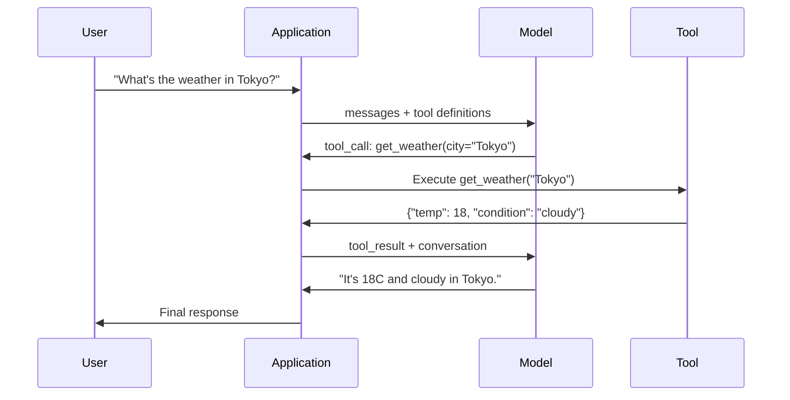

# 函数调用与工具使用

> 它们本身不能做任何事情.它们生成文本. 这就是全部能力.它们不能查看天气,查询数据库,发送电子邮件,运行代码或读取文件.

**Type:** Build
**Languages:** Python
**Prerequisites:** Phase 11 Lesson 03 (Structured Outputs)
**Time:** ~75 minutes
**Related:**11 · 14阶段 (模式文本协议)  当一个工具需要跨主机共享时,应从线上调用函数升级为MCP服务器──本课覆盖线上场景;MCP覆盖协议──场景──

## 学习目标
- 实现一个函数调用循环:定义工具方案、解析模型的工具调用 JSON、执行函数,并返回结果
- 设计有明确的描述和打字参数的工具方案,使模型能够可靠调用
- 构建一个多轮代理循环,通过串联多次函数调用来回答复杂的查询
- 处理调用函数 边界情况:并行工具调用、错误传播,以及防止无限工具循环

## 问题
你构建了一个聊天机器人.用户问:现在东京天气是什么?

模型回答:我没有实时天气数据,但根据季节,东京可能在15摄氏度左右...

这就是一个无辜的外衣幻觉.模型不知道天气.它永远不会知道.天气每小时都在变化.

正确答案需要调用OpenWeatherMap API,获取当前温度,并返回真实数值――模型不能调用API――你的代码可以――缺失的一个环节是:一个结构化协议,让模型可以说我需要使用这些参数调用天气API,并让你的代码执行它,再把结果回模型――

这就是函数调用――模型输出结构化 JSON,描述要用什么参数调用哪个函数――你的应用程序执行函数――结果回到对话 中――模型使用结果生成最终答案――

没有功能,LLM是百科全书.

## 概念
### 调用循环的功能

每次使用工具的交互都遵循相同的五步循环.



步骤1:用户发送消息――步骤2:模型接收消息以及工具定义――描述可用的函数的JSON方案――步骤3:模型不直接返回文本,而是输出一个工具调用,也就是包含函数名称和参数的结构化JSON对象――步骤4:你的代码执行函数并捕获结果――步骤5:结果返回模型,模型现在拥有真实数据,可以生成最终答案――

模型从不执行任何东西. 它只决定调用什么,以及使用什么参数.

### 工具定义:JSON方案合同

每个工具都由一个JSON方案定义,它告诉模型该函数做什么,接收哪些参数,以及这些参数必须是什么类型的.

```json
{
  "type": "function",
  "function": {
    "name": "get_weather",
    "description": "Get current weather for a city. Returns temperature in Celsius and conditions.",
    "parameters": {
      "type": "object",
      "properties": {
        "city": {
          "type": "string",
          "description": "City name, e.g. 'Tokyo' or 'San Francisco'"
        },
        "units": {
          "type": "string",
          "enum": ["celsius", "fahrenheit"],
          "description": "Temperature units"
        }
      },
      "required": ["city"]
    }
  }
}
```

`description`模型会读取它们,以决定何时以及如何使用工具. 描述是用于工具选择的提示.

### 提供商的比较

每个主要供应商都支持函数调用,但API表面有所不同.

| Provider | API Parameter | Tool Call Format | Parallel Calls | Forced Calling |
|----------|--------------|-----------------|---------------|----------------|
| OpenAI (GPT-5, o4) | `tools` | `tool_calls[].function` | Yes (multiple per turn) | `tool_choice="required"` |
| Anthropic (Claude 4.6/4.7) | `tools` | `content[].type="tool_use"` | Yes (multiple blocks) | `tool_choice={"type":"any"}` |
| Google (Gemini 3) | `function_declarations` | `functionCall` | Yes | `function_calling_config` |
| Open-weight (Llama 4, Qwen3, DeepSeek-V3) | Native `tools` on Llama 4; Hermes or ChatML on others | Mixed | Model-dependent | Prompt-based or `tool_choice` if supported |

到2026年,三个关闭的供应商已经获得了几乎相同的 JSON 方案的形式.`tools`对于跨主机共享工具,优先使用MCP (Phase 11 · 14) 而不是线上函数调用,因为服务器对所有主机都是相同的.

### 工具选择:自动,要求,具体

您可以控制使用工具的模式.

**Auto**模型自行决定是调用工具 还是直接回答.

**Required**模型必须至少使用一个工具. 当你知道用户意图需要工具时,使用它.

**Specific function**强制模型调用某个特定的功能.`tool_choice={"type":"function", "function": {"name": "get_weather"}}`保证天气工具 会被调用,无论查询是什么.将其用于路由,即上游逻辑已经判断了需要哪个工具的场景.

### 并行函数调用

用户问:东京和纽约天气如何?模型会同时输出两个工具调用:

```json
[
  {"name": "get_weather", "arguments": {"city": "Tokyo"}},
  {"name": "get_weather", "arguments": {"city": "New York"}}
]
```

你的代码执行两者 (理想情况下并发执行),返回两个结果,然后模型合成一个统一答案――这将使回路从2次减少到1次――对于每个查询需要5-10次的工具调用代理,并行调用可将延迟降低60-80%.

### 结构化输出与函数调用相比

课程3 覆盖结构化输出――使用相同的JSON方案机制,但目的不同――

**Structured outputs**强制模型以特定形状生成数据.输出就是最终产品.`{name, price, in_stock}`,我知道.

**Function calling**模型声明执行某个行动的意图――输出是中间步骤――示例:`get_weather(city="Tokyo")`模型是要求一个行动,而不是生成最终答案.

当你需要数据提取时,使用结构化输出. 当你需要模型与外部系统交互时,使用函数调用.

### 安全:不可妥协的规则

函数调用是你能赋予LLM最危险的能力――模型选择要执行什么――如果你的工具集包含数据库查询,模型就会构建查询――如果它包含器命令,模型就会编写它们――

**Rule 1: Never pass model-generated SQL directly to a database.**模型可能且确实会生成DROP TABLE、UNION注射,或者返回每行查询──始终参数化──始终验证──始终使用操作允许列表──始终使用操作列表──始终验证──始终验证──始终使用操作列表──始终验证──始终验证──始终验证──始终验证──始终验证──始终验证──始终验证──始终验证──始终验证──始终验证──始终验证──始终验证──始终验证──始终验证──始终验证

**Rule 2: Allowlist functions.**模型只能调用你明确定义的函数――永远不要构建一个通用按名称执行任意函数的工具――如果你有50个内部函数,只能暴露用户需要的5个.

**Rule 3: Validate arguments.**模型可能传入一个城市的名字:`"; DROP TABLE users; --"`△执行前要根据预期的类型、范围和格式 验证每个参数──

**Rule 4: Sanitize tool results.**如果工具返回敏感数据 (API 密钥,PII 内部错误),在将其发回模型之前先过──模型将把工具的结果原样包含在它的反应中──

**Rule 5: Rate limit tool calls.**处于循环中的模型可能调用工具 数百次――设置一个最大值――每次对话 10-20次电话是合理的――打断无限循环――

### 错误处理

工具会失败――API会超时――数据库会机――文件不存在――模型需要知道工具何时失败以及为什么失败――

将错误作为结构化工具结果返回,而不是抛出例外:

```json
{
  "error": true,
  "message": "City 'Toky' not found. Did you mean 'Tokyo'?",
  "code": "CITY_NOT_FOUND"
}
```

模型读取这个结果,调整论点,并重试――模型很擅长从结构化错误信息中自我纠正――它们不擅长从空反应或泛泛的错误中恢复――

### 标准:模式背景协议

MCP 是人类面向工具互操作性的开放标准. 它不让每个应用程序定义自己的工具,而是提供一个通用协议:由MCP服务器提供的工具,并由MCP客户端提供 (如Claude Code、Cursor或你的应用程序) 消费.

一个MCP服务器可以向任何兼容客户端 暴露工具――后代MCP服务器 让任何MCP兼容代理获得数据库访问――GitHub MCP服务器 让任何代理获得存储库访问――工具 定义一次,到处使用――

 MCP 之于函数调用,就像 HTTP 之于网络化. 它标准化了运输层,使工具变得便携式.


```figure
mx-tool-call-loop
```

## 构建它
### 步骤1:定义工具登记库

构建一个登录库,用于存储工具定义及其实现.每个工具都有一个JSON Schema定义.

```python
import json
import math
import time
import hashlib


TOOL_REGISTRY = {}


def register_tool(name, description, parameters, function):
    TOOL_REGISTRY[name] = {
        "definition": {
            "type": "function",
            "function": {
                "name": name,
                "description": description,
                "parameters": parameters,
            },
        },
        "function": function,
    }
```

### 步骤 2: 实施5种工具

构建一个计算器,天气搜索,网络搜索模拟器,文件阅读器和代码运行器.

```python
def calculator(expression, precision=2):
    allowed = set("0123456789+-*/.() ")
    if not all(c in allowed for c in expression):
        return {"error": True, "message": f"Invalid characters in expression: {expression}"}
    try:
        result = eval(expression, {"__builtins__": {}}, {"math": math})
        return {"result": round(float(result), precision), "expression": expression}
    except Exception as e:
        return {"error": True, "message": str(e)}


WEATHER_DB = {
    "tokyo": {"temp_c": 18, "condition": "cloudy", "humidity": 72, "wind_kph": 14},
    "new york": {"temp_c": 22, "condition": "sunny", "humidity": 45, "wind_kph": 8},
    "london": {"temp_c": 12, "condition": "rainy", "humidity": 88, "wind_kph": 22},
    "san francisco": {"temp_c": 16, "condition": "foggy", "humidity": 80, "wind_kph": 18},
    "sydney": {"temp_c": 25, "condition": "sunny", "humidity": 55, "wind_kph": 10},
}


def get_weather(city, units="celsius"):
    key = city.lower().strip()
    if key not in WEATHER_DB:
        suggestions = [c for c in WEATHER_DB if c.startswith(key[:3])]
        return {
            "error": True,
            "message": f"City '{city}' not found.",
            "suggestions": suggestions,
            "code": "CITY_NOT_FOUND",
        }
    data = WEATHER_DB[key].copy()
    if units == "fahrenheit":
        data["temp_f"] = round(data["temp_c"] * 9 / 5 + 32, 1)
        del data["temp_c"]
    data["city"] = city
    return data


SEARCH_DB = {
    "python function calling": [
        {"title": "OpenAI Function Calling Guide", "url": "https://platform.openai.com/docs/guides/function-calling", "snippet": "Learn how to connect LLMs to external tools."},
        {"title": "Anthropic Tool Use", "url": "https://docs.anthropic.com/en/docs/tool-use", "snippet": "Claude can interact with external tools and APIs."},
    ],
    "MCP protocol": [
        {"title": "Model Context Protocol", "url": "https://modelcontextprotocol.io", "snippet": "An open standard for connecting AI models to data sources."},
    ],
    "weather API": [
        {"title": "OpenWeatherMap API", "url": "https://openweathermap.org/api", "snippet": "Free weather API with current, forecast, and historical data."},
    ],
}


def web_search(query, max_results=3):
    key = query.lower().strip()
    for db_key, results in SEARCH_DB.items():
        if db_key in key or key in db_key:
            return {"query": query, "results": results[:max_results], "total": len(results)}
    return {"query": query, "results": [], "total": 0}


FILE_SYSTEM = {
    "data/config.json": '{"model": "gpt-4o", "temperature": 0.7, "max_tokens": 4096}',
    "data/users.csv": "name,email,role\nAlice,alice@example.com,admin\nBob,bob@example.com,user",
    "README.md": "# My Project\nA tool-use agent built from scratch.",
}


def read_file(path):
    if ".." in path or path.startswith("/"):
        return {"error": True, "message": "Path traversal not allowed.", "code": "FORBIDDEN"}
    if path not in FILE_SYSTEM:
        available = list(FILE_SYSTEM.keys())
        return {"error": True, "message": f"File '{path}' not found.", "available_files": available, "code": "NOT_FOUND"}
    content = FILE_SYSTEM[path]
    return {"path": path, "content": content, "size_bytes": len(content), "lines": content.count("\n") + 1}


def run_code(code, language="python"):
    if language != "python":
        return {"error": True, "message": f"Language '{language}' not supported. Only 'python' is available."}
    forbidden = ["import os", "import sys", "import subprocess", "exec(", "eval(", "__import__", "open("]
    for pattern in forbidden:
        if pattern in code:
            return {"error": True, "message": f"Forbidden operation: {pattern}", "code": "SECURITY_VIOLATION"}
    try:
        local_vars = {}
        exec(code, {"__builtins__": {"print": print, "range": range, "len": len, "str": str, "int": int, "float": float, "list": list, "dict": dict, "sum": sum, "min": min, "max": max, "abs": abs, "round": round, "sorted": sorted, "enumerate": enumerate, "zip": zip, "map": map, "filter": filter, "math": math}}, local_vars)
        result = local_vars.get("result", None)
        return {"success": True, "result": result, "variables": {k: str(v) for k, v in local_vars.items() if not k.startswith("_")}}
    except Exception as e:
        return {"error": True, "message": f"{type(e).__name__}: {e}"}
```

### 步骤3: 记录所有工具

```python
def register_all_tools():
    register_tool(
        "calculator", "Evaluate a mathematical expression. Supports +, -, *, /, parentheses, and decimals. Returns the numeric result.",
        {"type": "object", "properties": {"expression": {"type": "string", "description": "Math expression, e.g. '(10 + 5) * 3'"}, "precision": {"type": "integer", "description": "Decimal places in result", "default": 2}}, "required": ["expression"]},
        calculator,
    )
    register_tool(
        "get_weather", "Get current weather for a city. Returns temperature, condition, humidity, and wind speed.",
        {"type": "object", "properties": {"city": {"type": "string", "description": "City name, e.g. 'Tokyo' or 'San Francisco'"}, "units": {"type": "string", "enum": ["celsius", "fahrenheit"], "description": "Temperature units, defaults to celsius"}}, "required": ["city"]},
        get_weather,
    )
    register_tool(
        "web_search", "Search the web for information. Returns a list of results with title, URL, and snippet.",
        {"type": "object", "properties": {"query": {"type": "string", "description": "Search query"}, "max_results": {"type": "integer", "description": "Maximum results to return", "default": 3}}, "required": ["query"]},
        web_search,
    )
    register_tool(
        "read_file", "Read the contents of a file. Returns the file content, size, and line count.",
        {"type": "object", "properties": {"path": {"type": "string", "description": "Relative file path, e.g. 'data/config.json'"}}, "required": ["path"]},
        read_file,
    )
    register_tool(
        "run_code", "Execute Python code in a sandboxed environment. Set a 'result' variable to return output.",
        {"type": "object", "properties": {"code": {"type": "string", "description": "Python code to execute"}, "language": {"type": "string", "enum": ["python"], "description": "Programming language"}}, "required": ["code"]},
        run_code,
    )
```

### 步骤 4: 构建调用循环的函数

它模拟模型决定调用哪个工具,执行该工具,并将结果回去.

```python
def simulate_model_decision(user_message, tools, conversation_history):
    msg = user_message.lower()

    if any(word in msg for word in ["weather", "temperature", "forecast"]):
        cities = []
        for city in WEATHER_DB:
            if city in msg:
                cities.append(city)
        if not cities:
            for word in msg.split():
                if word.capitalize() in [c.title() for c in WEATHER_DB]:
                    cities.append(word)
        if not cities:
            cities = ["tokyo"]
        calls = []
        for city in cities:
            calls.append({"name": "get_weather", "arguments": {"city": city.title()}})
        return calls

    if any(word in msg for word in ["calculate", "compute", "math", "what is", "how much"]):
        for token in msg.split():
            if any(c in token for c in "+-*/"):
                return [{"name": "calculator", "arguments": {"expression": token}}]
        if "+" in msg or "-" in msg or "*" in msg or "/" in msg:
            expr = "".join(c for c in msg if c in "0123456789+-*/.() ")
            if expr.strip():
                return [{"name": "calculator", "arguments": {"expression": expr.strip()}}]
        return [{"name": "calculator", "arguments": {"expression": "0"}}]

    if any(word in msg for word in ["search", "find", "look up", "google"]):
        query = msg.replace("search for", "").replace("look up", "").replace("find", "").strip()
        return [{"name": "web_search", "arguments": {"query": query}}]

    if any(word in msg for word in ["read", "file", "open", "cat", "show"]):
        for path in FILE_SYSTEM:
            if path.split("/")[-1].split(".")[0] in msg:
                return [{"name": "read_file", "arguments": {"path": path}}]
        return [{"name": "read_file", "arguments": {"path": "README.md"}}]

    if any(word in msg for word in ["run", "execute", "code", "python"]):
        return [{"name": "run_code", "arguments": {"code": "result = 'Hello from the sandbox!'", "language": "python"}}]

    return []


def execute_tool_call(tool_call):
    name = tool_call["name"]
    args = tool_call["arguments"]

    if name not in TOOL_REGISTRY:
        return {"error": True, "message": f"Unknown tool: {name}", "code": "UNKNOWN_TOOL"}

    tool = TOOL_REGISTRY[name]
    func = tool["function"]
    start = time.time()

    try:
        result = func(**args)
    except TypeError as e:
        result = {"error": True, "message": f"Invalid arguments: {e}"}

    elapsed_ms = round((time.time() - start) * 1000, 2)
    return {"tool": name, "result": result, "execution_time_ms": elapsed_ms}


def run_function_calling_loop(user_message, max_iterations=5):
    conversation = [{"role": "user", "content": user_message}]
    tool_definitions = [t["definition"] for t in TOOL_REGISTRY.values()]
    all_tool_results = []

    for iteration in range(max_iterations):
        tool_calls = simulate_model_decision(user_message, tool_definitions, conversation)

        if not tool_calls:
            break

        results = []
        for call in tool_calls:
            result = execute_tool_call(call)
            results.append(result)

        conversation.append({"role": "assistant", "content": None, "tool_calls": tool_calls})

        for result in results:
            conversation.append({"role": "tool", "content": json.dumps(result["result"]), "tool_name": result["tool"]})

        all_tool_results.extend(results)
        break

    return {"conversation": conversation, "tool_results": all_tool_results, "iterations": iteration + 1 if tool_calls else 0}
```

### 步骤5: 证据验证

构建一个验证器,在执行前根据JSON Schema检查工具调用参数──

```python
def validate_tool_arguments(tool_name, arguments):
    if tool_name not in TOOL_REGISTRY:
        return [f"Unknown tool: {tool_name}"]

    schema = TOOL_REGISTRY[tool_name]["definition"]["function"]["parameters"]
    errors = []

    if not isinstance(arguments, dict):
        return [f"Arguments must be an object, got {type(arguments).__name__}"]

    for required_field in schema.get("required", []):
        if required_field not in arguments:
            errors.append(f"Missing required argument: {required_field}")

    properties = schema.get("properties", {})
    for arg_name, arg_value in arguments.items():
        if arg_name not in properties:
            errors.append(f"Unknown argument: {arg_name}")
            continue

        prop_schema = properties[arg_name]
        expected_type = prop_schema.get("type")

        type_checks = {"string": str, "integer": int, "number": (int, float), "boolean": bool, "array": list, "object": dict}
        if expected_type in type_checks:
            if not isinstance(arg_value, type_checks[expected_type]):
                errors.append(f"Argument '{arg_name}': expected {expected_type}, got {type(arg_value).__name__}")

        if "enum" in prop_schema and arg_value not in prop_schema["enum"]:
            errors.append(f"Argument '{arg_name}': '{arg_value}' not in {prop_schema['enum']}")

    return errors
```

### 步骤 6: 运行演示

```python
def run_demo():
    register_all_tools()

    print("=" * 60)
    print("  Function Calling & Tool Use Demo")
    print("=" * 60)

    print("\n--- Registered Tools ---")
    for name, tool in TOOL_REGISTRY.items():
        desc = tool["definition"]["function"]["description"][:60]
        params = list(tool["definition"]["function"]["parameters"].get("properties", {}).keys())
        print(f"  {name}: {desc}...")
        print(f"    params: {params}")

    print(f"\n--- Argument Validation ---")
    validation_tests = [
        ("get_weather", {"city": "Tokyo"}, "Valid call"),
        ("get_weather", {}, "Missing required arg"),
        ("get_weather", {"city": "Tokyo", "units": "kelvin"}, "Invalid enum value"),
        ("calculator", {"expression": 123}, "Wrong type (int for string)"),
        ("unknown_tool", {"x": 1}, "Unknown tool"),
    ]
    for tool_name, args, label in validation_tests:
        errors = validate_tool_arguments(tool_name, args)
        status = "VALID" if not errors else f"ERRORS: {errors}"
        print(f"  {label}: {status}")

    print(f"\n--- Tool Execution ---")
    direct_tests = [
        {"name": "calculator", "arguments": {"expression": "(10 + 5) * 3 / 2"}},
        {"name": "get_weather", "arguments": {"city": "Tokyo"}},
        {"name": "get_weather", "arguments": {"city": "Mars"}},
        {"name": "web_search", "arguments": {"query": "python function calling"}},
        {"name": "read_file", "arguments": {"path": "data/config.json"}},
        {"name": "read_file", "arguments": {"path": "../etc/passwd"}},
        {"name": "run_code", "arguments": {"code": "result = sum(range(1, 101))"}},
        {"name": "run_code", "arguments": {"code": "import os; os.system('rm -rf /')"}},
    ]
    for call in direct_tests:
        result = execute_tool_call(call)
        print(f"\n  {call['name']}({json.dumps(call['arguments'])})")
        print(f"    -> {json.dumps(result['result'], indent=None)[:100]}")
        print(f"    time: {result['execution_time_ms']}ms")

    print(f"\n--- Full Function Calling Loop ---")
    test_queries = [
        "What's the weather in Tokyo?",
        "Calculate (100 + 250) * 0.15",
        "Search for MCP protocol",
        "Read the config file",
        "Run some Python code",
        "Tell me a joke",
    ]
    for query in test_queries:
        print(f"\n  User: {query}")
        result = run_function_calling_loop(query)
        if result["tool_results"]:
            for tr in result["tool_results"]:
                print(f"    Tool: {tr['tool']} ({tr['execution_time_ms']}ms)")
                print(f"    Result: {json.dumps(tr['result'], indent=None)[:90]}")
        else:
            print(f"    [No tool called -- direct response]")
        print(f"    Iterations: {result['iterations']}")

    print(f"\n--- Parallel Tool Calls ---")
    multi_city_query = "What's the weather in tokyo and london?"
    print(f"  User: {multi_city_query}")
    result = run_function_calling_loop(multi_city_query)
    print(f"  Tool calls made: {len(result['tool_results'])}")
    for tr in result["tool_results"]:
        city = tr["result"].get("city", "unknown")
        temp = tr["result"].get("temp_c", "N/A")
        print(f"    {city}: {temp}C, {tr['result'].get('condition', 'N/A')}")

    print(f"\n--- Security Checks ---")
    security_tests = [
        ("read_file", {"path": "../../etc/passwd"}),
        ("run_code", {"code": "import subprocess; subprocess.run(['ls'])"}),
        ("calculator", {"expression": "__import__('os').system('ls')"}),
    ]
    for tool_name, args in security_tests:
        result = execute_tool_call({"name": tool_name, "arguments": args})
        blocked = result["result"].get("error", False)
        print(f"  {tool_name}({list(args.values())[0][:40]}): {'BLOCKED' if blocked else 'ALLOWED'}")
```

## 使用它
### 开放AI函数调用

```python
# from openai import OpenAI
#
# client = OpenAI()
#
# tools = [{
#     "type": "function",
#     "function": {
#         "name": "get_weather",
#         "description": "Get current weather for a city",
#         "parameters": {
#             "type": "object",
#             "properties": {
#                 "city": {"type": "string"},
#                 "units": {"type": "string", "enum": ["celsius", "fahrenheit"]}
#             },
#             "required": ["city"]
#         }
#     }
# }]
#
# response = client.chat.completions.create(
#     model="gpt-4o",
#     messages=[{"role": "user", "content": "Weather in Tokyo?"}],
#     tools=tools,
#     tool_choice="auto",
# )
#
# tool_call = response.choices[0].message.tool_calls[0]
# args = json.loads(tool_call.function.arguments)
# result = get_weather(**args)
#
# final = client.chat.completions.create(
#     model="gpt-4o",
#     messages=[
#         {"role": "user", "content": "Weather in Tokyo?"},
#         response.choices[0].message,
#         {"role": "tool", "tool_call_id": tool_call.id, "content": json.dumps(result)},
#     ],
# )
# print(final.choices[0].message.content)
```

开放AI将调用工具回复为`response.choices[0].message.tool_calls`每个电话都有一个.`id`模型使用这个ID将结果匹配到呼叫. GPT-4o可以在单个响应中回复多个工具呼叫,需要遍历并执行所有呼叫.

### 人类工具的使用

```python
# import anthropic
#
# client = anthropic.Anthropic()
#
# response = client.messages.create(
#     model="claude-sonnet-4-20250514",
#     max_tokens=1024,
#     tools=[{
#         "name": "get_weather",
#         "description": "Get current weather for a city",
#         "input_schema": {
#             "type": "object",
#             "properties": {
#                 "city": {"type": "string"},
#                 "units": {"type": "string", "enum": ["celsius", "fahrenheit"]}
#             },
#             "required": ["city"]
#         }
#     }],
#     messages=[{"role": "user", "content": "Weather in Tokyo?"}],
# )
#
# tool_block = next(b for b in response.content if b.type == "tool_use")
# result = get_weather(**tool_block.input)
#
# final = client.messages.create(
#     model="claude-sonnet-4-20250514",
#     max_tokens=1024,
#     tools=[...],
#     messages=[
#         {"role": "user", "content": "Weather in Tokyo?"},
#         {"role": "assistant", "content": response.content},
#         {"role": "user", "content": [{"type": "tool_result", "tool_use_id": tool_block.id, "content": json.dumps(result)}]},
#     ],
# )
```

人类将工具调用 返回为带有`type: "tool_use"`内容块──工具结果 放在带有`type: "tool_result"`关注关键区别:人类使用 `input_schema`定义工具参数,而OpenAI 使用 `parameters`,我知道.

### 集成MCP

```python
# MCP servers expose tools over a standardized protocol.
# Any MCP-compatible client can discover and call these tools.
#
# Example: connecting to a Postgres MCP server
#
# from mcp import ClientSession, StdioServerParameters
# from mcp.client.stdio import stdio_client
#
# server_params = StdioServerParameters(
#     command="npx",
#     args=["-y", "@modelcontextprotocol/server-postgres", "postgresql://localhost/mydb"],
# )
#
# async with stdio_client(server_params) as (read, write):
#     async with ClientSession(read, write) as session:
#         await session.initialize()
#         tools = await session.list_tools()
#         result = await session.call_tool("query", {"sql": "SELECT count(*) FROM users"})
```

您的代理人只是发现并调用工具,它不需要每个集成 编写供应商特定代码.

## 交付它
本课会产出 `outputs/prompt-tool-designer.md`给它一个关于你想要的工具做什么的描述,它会产生完整的JSON方案定义,包括描述,类型和限制.

它会再次出现.`outputs/skill-function-calling-patterns.md`作为一个在生产中实现函数调用的决策框架,覆盖工具设计,错误处理,安全和供应商特定模式.

## 练习
1. **Add a 6th tool: database query.**实现一个模拟SQL工具,使用内存表――该工具接收表名和过条件(不是原始SQL) ――验证表名 位于允许列表中,并且过操作员仅限于`=`,我知道.`>`,我知道.`<`,我知道.`>=`,我知道.`<=`△将匹配行 作为 JSON 返回──

2. **Implement retry with error feedback.**当工具调用时失败时(例如城市未找到),把错误信息回回模型决策函数,并让它修改参数――记录每个调用需要多少次重复尝试――为每个工具调用设置最多3次重复尝试――

3. **Build a multi-step agent.**某些查询 需要串联工具调用:阅读配置文件,告诉我是什么模型配置,然后在网上搜索该模型的定价.实现一个循环,持续运行直到模型决定不再需要工具,并把积累的结果传进每个决策步骤――限制为10次代,以防止无限循环――

4. **Measure tool selection accuracy.**创建30个带有预期工具名称的测试查询. 在所有30个查询中,运行你的决策功能,并衡量它选择正确的工具的比例.

5. **Implement tool call caching.**如果在60秒内调用相同的论点,则返回缓存结果,而不是重新执行.`(tool_name, frozenset(args.items()))`为关键的词典──衡量包含20个查询的对话 中的缓存击率──

## 关键术语
| Term | What people say | What it actually means |
|------|----------------|----------------------|
| Function calling | “Tool use” | 模型输出结构化 JSON，描述要用特定 arguments 调用的 function，由你的代码执行，而不是模型执行 |
| Tool definition | “Function schema” | 一个 JSON Schema object，描述 tool 的 name、purpose、parameters 和 types，模型读取它来决定何时以及如何使用该 tool |
| Tool choice | “Calling mode” | 控制模型必须调用 tool（required）、可以调用 tool（auto），还是必须调用特定 tool（named） |
| Parallel calling | “Multi-tool” | 模型在单个 turn 中输出多个 tool calls，从而减少 round trips，GPT-4o 和 Claude 都支持这一点 |
| Tool result | “Function output” | 执行 tool 后得到的 return value，作为 message 发回模型，使它能在 response 中使用真实数据 |
| Argument validation | “Input checking” | 在执行 tool 前，验证模型生成的 arguments 是否匹配预期 types、ranges 和 constraints |
| MCP | “Tool protocol” | Model Context Protocol，即 Anthropic 的 open standard，用于通过 servers 暴露 tools，让任何兼容 client 都能发现并调用 |
| Agent loop | “ReAct loop” | model-decides-tool、code-executes-tool、result-feeds-back 的迭代循环，直到模型拥有足够信息作出回答 |
| Tool poisoning | “Prompt injection via tools” | 一种攻击，其中 tool results 包含会操纵模型行为的 instructions，因此要 sanitize 所有 tool outputs |
| Rate limiting | “Call budget” | 设置每个 conversation 中 tool calls 的最大数量，以防止 infinite loops 和失控的 API costs |

## 延伸阅读
- [OpenAI Function Calling Guide](https://platform.openai.com/docs/guides/function-calling)使用GPT-4o 进行工具使用权力参考,包括并行调用,强迫调用和结构性论证
- [Anthropic Tool Use Guide](https://docs.anthropic.com/en/docs/tool-use) Claude 的工具使用实现,包括 input_schema、多工具响应和工具_选择配置
- [Model Context Protocol Specification](https://modelcontextprotocol.io) 跨人工智能应用的工具互操作性 开放标准,包含服务器/客户端架构
- [Schick et al., 2023 — “Toolformer: Language Models Can Teach Themselves to Use Tools”](https://arxiv.org/abs/2302.04761) 关于培训 LLM决定何时以及如何调用外部工具的基础论文
- [Patil et al., 2023 — “Gorilla: Large Language Model Connected with Massive APIs”](https://arxiv.org/abs/2305.15334) 针对1645个API的准确API调用,减少幻觉
- [Berkeley Function Calling Leaderboard](https://gorilla.cs.berkeley.edu/leaderboard.html) 实时基准,对比GPT-4o、Claude、Gemini 和开放模型的函数调用精度
- [Yao et al., “ReAct: Synergizing Reasoning and Acting in Language Models” (ICLR 2023)](https://arxiv.org/abs/2210.03629)思想行动观察循环,它是每次工具调用外层的代理循环;本课结束处,正是阶段14 接下来的处.
- [Anthropic — Building effective agents (Dec 2024)](https://www.anthropic.com/research/building-effective-agents) 从单一工具使用原始的构建中出了五种可组合的模式 (即时链接,路由,并行化,管弦乐队员工,评估者优化器) 
