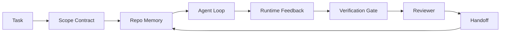

# 机关工程:为什么能力强的模型仍然会失败

> 只有有能力强的模型不够.可靠的代理人需要一个工作位:说明,状态,范围,反,验证,审查和交付.

**Type:** Learn + Build
**Languages:** Python (stdlib)
**Prerequisites:** Phase 14 · 01 (Agent Loop), Phase 14 · 26 (Failure Modes)
**Time:** ~45 minutes

## 学习目标
- 区分模型能力与执行可靠性.
- 如何处理工作桌面的七个表面
- 在一个小型的 repo 任务上比较快速运行与工作台指导运行.
- 产出一个失败模式报告,将每个缺失的表面映射到它造成的症状.

## 问题
你把一个边界模型放进真实备忘录,让它添加输入验证. 它打开了四个文件,写出看似合理的代码,宣布成功,然后停止. 你运行测试.

模型不是不懂字符串. 它不懂这个工作. 它不知道什么才要完成. 它不懂哪里可以写.

这不是模型错误. 这是一个工作台错误. 代理周围的表面缺少必要部分,无法将一次性生成转化为可靠的可恢复工程工作.

## 概念
工作台是任务期间包裹模型的运行环境.

| Surface | 它承载什么 | 缺失时的失败 |
|---------|------------|--------------|
| Instructions | 启动规则、禁止动作、完成定义 | Agent 猜测交付意味着什么 |
| State | 当前任务、已触碰文件、blockers、下一步动作 | 每个 session 都从零开始 |
| Scope | 允许文件、禁止文件、验收标准 | 修改泄漏到无关代码 |
| Feedback | 捕获进 loop 的真实命令输出 | Agent 在 400 上宣布成功 |
| Verification | Tests、lint、smoke run、scope check | “看起来不错”进入 main |
| Review | 由不同角色执行的第二遍检查 | Builder 批改自己的作业 |
| Handoff | 改了什么、为什么改、还剩什么 | 下一个 session 重新发现一切 |

工作台 独立于模型――你可以替换模型并保留这些表面――你不能替换表面 还保持可靠性――



这一循环 关闭在状态文件上,而不是聊天历史上.聊天是易失的.

### 工作台与快速工程

提示 告诉模型这个轮子你想要什么――工作台 告诉模型如何跨轮次、跨会议 地完成工作――大多数代理人 失败故事,其实是披着提示工程 外衣的工作台 失败――

### 与工作台与框架的比较

框架提供运行时间 (LangGraph、AutoGen、Agents SDK) ∙工作台 给代理提供一个工作场所 在运行时间中──两者都需要──这个迷你轨道讲的是第二个──

### 基于原始的推理而不是来自供应商的分类

现在有大量关于哈尼斯工程的文章. 关于哈尼斯工程的文章. 关于哈尼斯工程的文章. 关于哈尼斯的文章. 关于哈尼斯的文章. 关于哈尼斯的文章. 关于哈尼斯工程的文章. 关于哈尼斯的文章. 关于哈尼斯的文章. 关于哈尼斯的文章. 关于哈尼斯的文章. 关于哈尼斯工程的文章. 关于哈尼斯工程的文章. 关于哈尼斯工程的文章. 关于哈尼斯工程的文章. 关于哈尼斯工程的文章. 关于哈尼斯的文章. 关于哈尼斯的文章. 关于哈尼斯的文章. 关于哈尼斯的文章. 关于哈尼斯工程的文章. 关于哈尼斯工程的文章. 关于哈尼斯的文章. 关于哈尼斯工程的文章. 关于哈尼斯工程的文章. 关于哈尼斯工程的文章. 关于哈尼斯技术的文章. 关于哈尼斯技术的文章.

一次运行是跨时间,进程和机器的计算.

| Primitive | 它是什么 | 它为 agent 承载什么 |
|-----------|----------|---------------------|
| Function | 类型化 handler。尽可能保持纯。拥有自己的 inputs 和 outputs。 | 一次 tool call、一次 rule check、一个 verification step、一次模型调用 |
| Worker | 拥有一个或多个 functions 和 lifecycle 的长生命周期进程 | builder、reviewer、verifier、一个 MCP server |
| Trigger | 调用 function 的事件源 | Agent loop tick、HTTP request、queue message、cron、file change、hook |
| Runtime | 决定什么在哪里运行、使用什么 timeouts 和 resources 的边界 | Claude Code 的 process、LangGraph 的 runtime、一个 worker container |
| HTTP / RPC | caller 与 worker 之间的网络线缆 | Tool-call protocol、MCP request、model API |
| Queue | trigger 与 worker 之间的持久 buffer；back-pressure、retry、idempotency | task board、feedback log、review inbox |
| Session persistence | 在 crashes、restarts、model swaps 后仍保留的 state | `agent_state.json`、checkpoints、KV stores、repo 本身 |
| Authorization policy | 谁能以什么 scope 调用什么 function | allowed/forbidden files、approval boundaries、MCP capability lists |

现在把七个工作桌面表面映射到这些原始上.

- **Instructions**政策+功能元数据──规则是检查功能路由器`AGENTS.md`) 是运行时间启动上述政策的附加.
- **State**会议持续性――运行时间 每一步都会读取的关键存储――文件、KV或DB;持续性语义 重要,存储后端 不重要――
- **Scope** 每个任务的授权政策.允许/禁止的球是ACL.
- **Feedback**写入队列的呼唤日志. 每次的呼叫都是一张记录,持久、可重放──
- **Verification** 一个函数――对输入 确定性――由任务关闭 触发――失败时关闭――
- **Review** 一个独立工人,对建筑物有阅读权,对审查报告只有写作权.
- **Handoff** 由会话结束触发器发出持久记录. 下一个会话启动触发器 会读取它.

机器人循环 本身就是一个员工,它消费事件(用户消息、工具结果、时间点击),调用函数(先是模型,然后是模型选择的工具),写记录(状态、反),并发出触发器(验证、评论、支持) ⋅没有神秘之处;形状与工作处理器相同──

### 流行模式,转换为原始

每种流行的带纹理都可以归类为八种原始.

| Vendor or community pattern | 它实际是什么 |
|------------------------------|--------------|
| Ralph Loop（Claude Code、Codex、agentic_harness book）— 当 agent 试图过早停止时，把原始意图重新注入一个新的 context window | 一个将 task 以干净 context 重新入队的 trigger；session persistence 负责把目标向前传递 |
| Plan / Execute / Verify (PEV) | 三个 workers，每个角色一个，通过 state 和 phases 之间的 queue 通信 |
| Harness-compute separation（OpenAI Agents SDK，April 2026）— 将 control plane 与 execution plane 分开 | 对 control-plane / data-plane 的重新表述。比 agent 标签早几十年就存在 |
| Open Agent Passport（OAP，March 2026）— 在执行前根据声明式 policy 签名并审计每次 tool call | 由 pre-action worker 强制执行的 authorization policy，并带有 signed audit queue |
| Guides and Sensors（Birgitta Böckeler / Thoughtworks）— feedforward rules + feedback observability | Authorization policy + verification functions + observability traces |
| Progressive compaction, 5-stage（Claude Code reverse engineering，April 2026） | 一个 state-management worker，像 cron 一样在 session persistence 上运行，使其保持在 budget 内 |
| Hooks / middleware（LangChain、Claude Code）— 拦截 model 和 tool calls | 包裹 runtime invocation path 的 triggers + functions |
| Skills as Markdown with progressive disclosure（Anthropic、Flue） | 一个 function registry，其中 function metadata 会 just-in-time 加载到 context 中 |
| Sandbox agents（Codex、Sandcastle、Vercel Sandbox） | compute plane：具备隔离 filesystem、network 和 lifecycle 的 runtime |
| MCP servers | 通过稳定 RPC 暴露 functions 的 workers，capability lists 作为 authorization |

在这个表中,每个项目都是代理社区到达一个早已在分布式系统中名字的原始,然后给它起了一个新的名字.

### 实际上说明了什么

现在有数据支.值得了解,因为这也是反驳的,只要等更聪明的模型就好了.

- 终端台2.0  同一个模型,只利用改变 就让一个编码代理从前30 之外提升到第五名(长链,*机器人运用器的解剖*) 
- 维尔塞尔  删除其代理 80% 的工具;成功率从 80% 跳到 100% MongoDB) 
- 哈维 法律代理 仅通过利用优化就让准确度翻倍以上
- 88%的企业AI代理项目未能进入生产――失败集中在运行时间,而不是推理――preprints.org*Harness Engineering for Language Agents*,2026年3月)
- 一项2025年基准研究在三个流行开源框架中 上报告了约50%的任务完成;长文本WebAgent在长文本条件下从40-50% 跌至10% 以下,主要是由于无限循环和目标损失(2026年初的写作中广泛讨论)

要点不是harness 永远胜出──模型会随着时间的推移吸收手术──要点是今天,承担负重的工程在模型周围,而不是模型内部;承担这些负载的原始人,正是每个生产系统总是需要的东西──

### 销售人员写作 止步的地方

这部分你不需要客气.

- 长链的*代理器的解剖学* 列出了十个组件 提示,工具,,沙盒,配套,记忆,技能,副器以及一个运行时间循环. 它没有命名队列,作为部署单位的员工,触发语义,作为独立关注点的会议持久性,或授权政策. 它把器作为你配置的对象,而不是一个你部署的系统.
- 艾迪·奥斯曼尼的* 代理装工程* 提出了`Agent = Model + Harness`子的结构和子模式,但没有进一步说明子是由什么构成的.
- 关于表面的讨论最深,但仍在各自的运行时间内――2026年4月 代理SDK中的哈纳斯-计算分离公告是第一个明确可确认的控制平面/数据平面分离的供应商片――那是一个原始的想法,不是新东西――
- 机关系统将使用 视为配置对象(Jaymin West的 *Agentic Engineering*,第6章),其中最有力的一句话是机关系统中的主要安全边界──这只是授权政策的重新表述──
- 黑客新闻线程 一直抵达同一个地方──2026年4月线程 *代理带属于沙盒外面* 认为带应该位于更像是一个处在一切之外的处并基于文本和用户授权访问的超级浏览器──这再次是作为独立平面的授权政策──

你不需要反对这些文章中的任何一篇,也可以看到缺陷.它们在写一个已经存在的系统的UX描述. 我们要写的是系统.当系统构建正确时,七个表面会自然涌现出原始中.当系统构建错误时,再多.`AGENTS.md`色也修不好缺失的队列.

所以,当你在其他地方听到哈纳斯工程时,把它翻译成原始的──提示和规则是政策和函数──架构是运行时间──保护是授权+验证──子是触发器──记忆是会议持续性──拉尔夫环是排列.


```figure
wb-seven-surfaces
```

## 构建它
`code/main.py`会把一个微型备忘录任务运行两次.第一次是只提示,第二次是连接七个表面.

备忘录任务 刻意设计很小:给一个单个文件快API式处理器 添加输入验证,并写一个通过的测试.

运行它:

```
python3 code/main.py
```

输出:两次运行的隔壁日志,一个总结 仅运行即时的`failure_modes.json`工作位的第一行判决.

作为一个非常小的规则的子,重点是表面,而不是模型. 在这个迷你轨道的其他部分,你将把每个表面重建为真实可复用的文物.

## 使用它
现在,已经存在工作桌面,

- **Claude Code, Codex, Cursor.** `AGENTS.md`和 `CLAUDE.md`是指令表面――Slash命令是范围――Hooks是验证――
- **LangGraph, OpenAI Agents SDK.**检查点和会议店是国家表面.
- **真实 repo 上的 CI。**测试,链接和类型检查是验证.

工作台工程是一种规律:把这些表面显式化,可复用化,而不是让每个团队自己重新发现它们.

## 交付它
`outputs/skill-workbench-audit.md`是一个可移植的技能,用于审计现有 repo 的七个工作台表面,并报告哪些缺失,哪些部分有,哪些健康.

## 练习
1. 选择一个你已经运行的代理的 repo――把七个表面从0(缺失) 到2(健康)打分――你最弱的表面是什么?
2. 扩展`main.py`让快速运行也产生一个假的成功声明.
3. 为什么它不能归纳到现有的七个之一?
4. 另一个会产生幻觉的, 写入文件的, 重新运行脚本.
5. 五个行业中出现的失败模式将映射到七个表面.

## 关键术语
| Term | What people say | What it actually means |
|------|----------------|------------------------|
| Workbench | “那套 setup” | 围绕模型设计的 engineered surfaces，使工作可靠 |
| Surface | “一个 doc” 或 “一个 script” | agent 每一轮读取或写入的命名、machine-readable input |
| System of record | “那些 notes” | chat history 消失后 agent 视为 truth 的文件 |
| Definition of done | “Acceptance” | 一个客观、file-backed 的 checklist，agent 无法伪造 |
| Workbench audit | “Repo readiness check” | 在工作开始前遍历七个 surfaces，标记缺失部分 |

## 延伸阅读
在决定是否采用某种概念之前,先把它翻译成原始的(功能、工人、触发器、运行时间、HTTP/RPC、排列、持久性、政策) 之前.

供应商的框架:

- [Addy Osmani, Agent Harness Engineering](https://addyosmani.com/blog/agent-harness-engineering/) `Agent = Model + Harness`和子模式;基础设施部分较薄
- [LangChain, The Anatomy of an Agent Harness](https://blog.langchain.com/the-anatomy-of-an-agent-harness/) 十一个组件:提示,工具,,配乐,沙盒,记忆,技能,副行李,运行时间,省略排队,部署,作者
- [OpenAI, Harness engineering: leveraging Codex in an agent-first world](https://openai.com/index/harness-engineering/) 科德斯团队对其运行时间的看法
- [OpenAI, Unrolling the Codex agent loop](https://openai.com/index/unrolling-the-codex-agent-loop/) 将代理循环归约为函数调用 上一个`while`
- [Anthropic, Effective harnesses for long-running agents](https://www.anthropic.com/engineering/effective-harnesses-for-long-running-agents) 特定运行时间内长视界表面
- [Anthropic, Harness design for long-running application development](https://www.anthropic.com/engineering/harness-design-long-running-apps) 应用型设计笔记
- [LangChain Deep Agents harness capabilities](https://docs.langchain.com/oss/python/deepagents/harness)运行时间配置表面

有可用的细节的实践者文章:

- [Martin Fowler / Birgitta Böckeler, Harness engineering for coding agent users](https://martinfowler.com/articles/harness-engineering.html)指导向前传感器反;最清晰的控制理论框架
- [HumanLayer, Skill Issue: Harness Engineering for Coding Agents](https://www.humanlayer.dev/blog/skill-issue-harness-engineering-for-coding-agents)  这不是模型问题,而是配置问题
- [MongoDB, The Agent Harness: Why the LLM Is the Smallest Part of Your Agent System](https://www.mongodb.com/company/blog/technical/agent-harness-why-llm-is-smallest-part-of-your-agent-system)证据:80%到100%的变量,哈维的准确度2倍,终端位30到5
- [Augment Code, Harness Engineering for AI Coding Agents](https://www.augmentcode.com/guides/harness-engineering-ai-coding-agents) 限制-第一步通行
- [Sequoia podcast, Harrison Chase on Context Engineering Long-Horizon Agents](https://sequoiacap.com/podcast/context-engineering-our-way-to-long-horizon-agents-langchains-harrison-chase/)运行时间问题 高于模型问题

书籍、论文与参考实施:

- [Jaymin West, Agentic Engineering — Chapter 6: Harnesses](https://www.jayminwest.com/agentic-engineering-book/6-harnesses)书长处理,将使用视为首要安全界限
- [preprints.org, Harness Engineering for Language Agents (March 2026)](https://www.preprints.org/manuscript/202603.1756)将其作为控制/代理/运行时间的学术框架
- [walkinglabs/awesome-harness-engineering](https://github.com/walkinglabs/awesome-harness-engineering) 跨文本,评价,可观察性,配乐的编辑阅读列表
- [ai-boost/awesome-harness-engineering](https://github.com/ai-boost/awesome-harness-engineering) 另一份整理的列表 (工具,数据,记忆,MCP,许可)
- [andrewgarst/agentic_harness](https://github.com/andrewgarst/agentic_harness)生产准备的参考实现,带 Redis支持的内存和评估套件
- [HKUDS/OpenHarness](https://github.com/HKUDS/OpenHarness)内置个人代理的开放代理带

值得阅读其分歧而非共识的黑客新闻讨论:

- [HN: Effective harnesses for long-running agents](https://news.ycombinator.com/item?id=46081704)
- [HN: Improving 15 LLMs at Coding in One Afternoon. Only the Harness Changed](https://news.ycombinator.com/item?id=46988596)
- [HN: The agent harness belongs outside the sandbox](https://news.ycombinator.com/item?id=47990675) 主张将授权 作为独立平面

在本课程中交叉引用:

- 阶段14 · 23  开放电力学GenAI公约:传感器文献指向的可观性层
- 七个表面 设计来吸收故障模式目录
- 阶段 14 · 27  位于授权政策原始上的快速注射防御
- 阶段14 · 29  生产运行时间队列、事件、cron:本课中的原始在部署中位置
