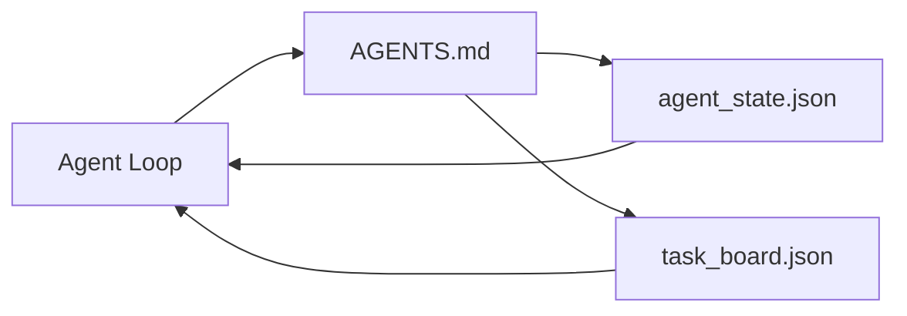

# 最小的代理工作台

> 最小可用的工作台只有三个文件:一个根指示路由器,一个状态文件,以及一个任务板.

**Type:** Build
**Languages:** Python (stdlib)
**Prerequisites:** Phase 14 · 31（为什么强大的模型仍然失败）
**Time:** ~45 分钟

## 学习目标
- 定义构成可行的工作台的三个文件.
- 解释为什么一个简短的根路由器胜过一个长长的单体`AGENTS.md`,我知道.
- 构建一个代理 每一轮都能读取,并在结束时写入状态文件.
- 构建一个不依赖聊天历史的任务板,也能支多次会议.

## 问题
大多数团队会通过写一个3000行.`AGENTS.md`模型将加载它,忽略那些无法总结的部分,然后仍然在它一直失败的相同的表面上失败.

你需要的是相反的东西. 一个很小的根文件,只需要在相关的时间把代理 路由到更深层的文件.

每份文件都有一个责任. 每份文件都足够机器可读,

## 概念


### 代理.md 是路由器,不是手动

很好`AGENTS.md`很短. 它把代理指向:

- 美国政府的文件
- 任务委员会还剩什么)
- 更深层的规则`docs/agent-rules.md`现在,我们要去做什么?
- 验证命令如何知道它能工作)

长内容将放入更深层次的文档,只需要加载时间.长手册会被忽视.短路由器会被遵循.

### 代理_状态.json 是记录系统

状态携带:主动任务 id、被触及的文件、已做出的假设、阻塞者,以及下一步的行动──代理 每一轮都会读取它──下一次会议 读取它,而不是重放聊天──

状态存在文件里,因为聊天历史不可靠. 会议会结束.

### 任务板.json 是排队

任务板 携带每个任务,状态为`todo | in_progress | done | blocked`,当状态为空时,它是代理拉取任务的队列;当你想知道代理是否在正轨上时,它也是你读取的队列.

董事会上的工作有身份,目标,所有者`builder`,我知道.`reviewer`或`human`机组有意保持小:当它长到超过一屏时,你遇到的是规划问题,而不是机组问题.

### 三文件是底线,不是上限

后续课程将添加范围合同,反运行者,验证门,审查员检查列表和交付包.


```figure
wb-three-files
```

## 构建它
`code/main.py`会把最小工作台写入一个空置,并演示单轮代理转,它会:

1. 读取`agent_state.json`,我知道.
2. 如果状态为空,就从`task_board.json`拉取下一个任务.
3. 在范围内触碰单个文件.
4. 写回更新后的状态.

运行它:

```
python3 code/main.py
```

脚本会在自己旁边创建`workdir/`放下这三个文件,运行一轮,然后打印一轮,再运行它,观察第二轮从第一轮停下来继续.

## 使用它
在生产级代理产品中,同样的三份文件会以不同的名称出现:

- **Claude Code:**用`AGENTS.md`或`CLAUDE.md`作为路由器,用`.claude/state.json`风格的商店 作为国家,用子作为板块.
- **Codex / Cursor:**作为路由器,会议内存 作为状态,聊天侧 中的排队任务 作为板块──
- **Custom Python agent:**这就是你刚刚写的文件.

名称会变化――形状不会――

## 真实场景中的生产模式

当三种模式被叠加到最小工作台上时,它就能经历真正的单机测试.

**带 nearest-wins precedence 的嵌套 `AGENTS.md`。**开通AI在主要 repo中发布了88个`AGENTS.md`文件,每个子组件 一个――Codex、Cursor、Claude Code 和 Copilot 都会从当前工作文件一路向 repo 根遍历,并连接在找到的每个 文件`AGENTS.md`△子目录 文件扩展根文件──代码 添加了`AGENTS.override.md`为了替换而不是扩展;过渡机制是Codex-specific,做跨工具工作时应避免使用.`AGENTS.md`文件带来的质量升级,相当于从海库升级到Opus;最差的文件会让输出比完全没有文件更差.

**即使看起来像 coverage，也要拒绝的 anti-patterns。**相互冲突的指示 会把代理从互动模式 降到贪模式(ICLR 2026 AMBIG-SWE:48.8% → 28% 解析率);应给优先事项 编号,而不是把它们平铺堆叠――不可验证的风格规则(遵循谷歌Python风格指南) 如果没有执行命令,就会让代理自行想象的遵守;每条风格规则都应该配上精确的 lint命令;;以风格开头而不是以命令开头,会埋没验证路径;命令在前风格,在后风格,在后面――为人类而不是代理写内容浪费的文本预算;简洁会是一种特征.

**Cross-tool symlinks。**一个单一的根文件 配合符号链接`ln -s AGENTS.md CLAUDE.md`,我知道.`ln -s AGENTS.md .github/copilot-instructions.md`,我知道.`ln -s AGENTS.md .cursorrules`),让每个编码代理都使用相同的真理来源.`nx ai-setup`基于单个配置,在Claude Code、Cursor、Copilot、Gemini、Codex和OpenCode之间自动完成这一点.

## 交付它
`outputs/skill-minimal-workbench.md`会为任何新备案生成三文件工作台:一个按项目调优的`AGENTS.md`路由器一个包含正确的密钥`agent_state.json`作为一个使用当前后备的初始化`task_board.json`,我知道.

## 练习
1. 给我一个`agent_state.json`添加一个`last_run`如果文件24小时前,除非运营商确认,否则拒绝运行.
2. 给任务板添加一个`priority`改拉,使其总是选择优先级最高的`todo`,我知道.
3. 将`task_board.json`迁移到JSON 线条,让每个任务占一行,并让在版本控制中保持清晰.
4. 编写一个`lint_workbench.py`现在`AGENTS.md`超过80行,或引用不存在文件时失败.
5. 判断这三个文件中丢失了最大的伤害.

## 关键术语
| Term | What people say | What it actually means |
|------|----------------|------------------------|
| Router | `AGENTS.md` | 指向更深层 docs 和 files 的简短 root file |
| State file | "The notes" | 记录 agent 所在位置的 machine-readable 记录，每一轮都会写入 |
| Task board | "The backlog" | 带有 status、owner、acceptance 的工作 JSON queue |
| System of record | "Source of truth" | 当 chat 消失时，workbench 视为权威的文件 |

## 延伸阅读
- [agents.md — the open spec](https://agents.md/)被Cursor、Code、Claude Code、Copilot、Gemini、OpenCode 采用
- [Augment Code, A good AGENTS.md is a model upgrade. A bad one is worse than no docs at all](https://www.augmentcode.com/blog/how-to-write-good-agents-dot-md-files)测得的质量提升
- [Blake Crosley, AGENTS.md Patterns: What Actually Changes Agent Behavior](https://blakecrosley.com/blog/agents-md-patterns)什么是实实证有效,什么是无效的
- [Datadog Frontend, Steering AI Agents in Monorepos with AGENTS.md](https://dev.to/datadog-frontend-dev/steering-ai-agents-in-monorepos-with-agentsmd-13g0)嵌套优先的实践
- [Nx Blog, Teach Your AI Agent How to Work in a Monorepo](https://nx.dev/blog/nx-ai-agent-skills) 跨六种工具的单源生成
- [The Prompt Shelf, AGENTS.md Best Practices: Structure, Scope, and Real Examples](https://thepromptshelf.dev/blog/agents-md-best-practices/) 能经受审查的部分订单
- [Anthropic, Claude Code subagents and session store](https://docs.anthropic.com/en/docs/agents-and-tools/claude-code/sub-agents)
- 阶段14 · 31  最低吸收故障模式
- 第14阶段 · 34  本课预览的持久状态方案
