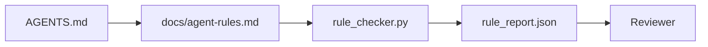

# 代理指令作为可执行的束

> 工作台将每条规则都变成代理,可在运行中检查,评审者可以在后验证的东西.

**类型：**构建
**语言：**字符串 (stdlib)
**前置要求：**阶段14 · 32 (最低工作时间)
**时间：**约50分钟

## 学习目标

- 将路由说明与操作规则分开.
- 启动规则,禁止操作,完成定义,不确定性处理和审批边界表达为机器可检查的约束.
- 实现规则检查器,使用规则集进行评分.
- 让规则集变得更容易,以便评审能够查看发生了什么变化.

## 问题

典型的`AGENTS.md`读起来像进入职档. 它告诉代理人要谨慎和充分测试,以及不确定是否要问.

当命令是可操作的,它们很强;当命令只是视觉的,它们很弱.

## 概念

规则应该被放下`docs/agent-rules.md`中,远离简短的根路由器.



### 覆盖大多数规则的五个类别

| 类别 | 规则回答的问题 | 示例 |
|----------|---------------------------|---------|
| Startup | 工作开始前必须满足什么？ | “state file exists and is fresh” |
| Forbidden | 什么事情绝对不能发生？ | “do not edit `scripts/release.sh`” |
| Definition of done | 什么能证明任务已完成？ | “pytest exits 0 and acceptance line passes” |
| Uncertainty | Agent 不确定时该做什么？ | “open a question note instead of guessing” |
| Approval | 什么需要人工审批？ | “any new dependency, any prod write” |

无法归纳在这五类规则中的一个,通常应该分成两条规则.

### 规则是机器可读的

每条规则都有一个字符,一个类别,一个描述,以及一个`check`字段,指向`rule_checker.py`检查器随着工作台一起增长.

### 规则便于不同

规则在一个标记文件中,每条规则占一个标题. 改名在不同中可见. 新规则放在其类别的顶部. 过时规则应删除,而不是注释,因为工作台才是真相来源,不是团队的季度感受如何聊天记录.

### 规则与框架护

框架护 (OpenAI Agents SDK护,长图中断) 在运行时层面执行规则――本课中的规则集是这些护实现的人类可读、可评审的契约――两者都需要:运行时会在一轮中捕获违规,而规则集会证明运行时正在做正确的事――

### 逐步披露:地图,而不是百科全书

`AGENTS.md`由于每次事件都会增加一条规则,但很少有事件会删除一条规则.一年后,该文件可能有两千行;经理阅读第一屏就耗尽注意力预算,只能执行其中一小部分.

修复方式不是写一个更短的文件,而是写一个分层的文件――根路由器必须小到每个会议都能读完,并且只保存指针――深度内容放在主题文件里,只有当任务触及应对主题时,代理才加载――给代理一个地图,而不是整个百科全书,让它自己走到需要的页面――

```text
AGENTS.md                  # router，少于 50 行：这个 repo 是什么、去哪里看、5 条硬规则
docs/
  agent-rules.md           # 完整规则集（本课）
  architecture.md          # 任务触及 module boundaries 时加载
  testing.md               # 任务编写或运行 tests 时加载
  deploy.md                # 只在 release 工作中加载，并受 approval rule 保护
feature_list.json          # backlog（Phase 14 · 36）
```

| Tier | 存放位置 | 读取时机 | 大小预算 |
|------|----------|----------|----------|
| Router | `AGENTS.md` | 每个 session，始终读取 | 少于约 50 行 |
| Rules | `docs/agent-rules.md` | 每个 session 启动时 | 每个 category 一屏 |
| Topic docs | `docs/<topic>.md` | 只有任务触及该主题时 | 需要多深就多深 |

两个测试能让分层保持诚实. 第一是可访问性测试:代理应该能从路由器中出发,最多两跳到任何规则,所以路由器必须按路径链接每个主题文档,而不是用散文模糊描述.第二是新鲜性测试:路由器 足够短,评论员会在每个 PR 里重读它,这是防止它长回百科全书的唯一方法.


```figure
wb-rule-checkoff
```

## 构建它

`code/main.py`提供:

- `agent-rules.md`解析器将规则加载到数据类中──
- `rule_checker.py`风格的检查函数,每个 `check`引用对应一个.
- 一个示范代理运行,违反了两条规则,

运行它:

```
python3 code/main.py
```

输出:解析后的规则集,运行跟踪,每个规则的通过/失败以及保存在脚本旁边的`rule_report.json`,我知道.

## 生产中的模式

有三种模式可以将一个持续一个季度的规则集与一个在一周内衰退的规则集分开.

**编写时标注严重性。**每条规则都带有`severity`其他:`block`,我知道.`warn`或`info`查器会报告三者;运行时只会在`block`上拒绝――大多数团队早期会高估严重性,然后在截止日期压力下削弱它;在编写时标签会迫使团队提前校准――与验证门 (Phase 14 · 38) 配合使用,它将对任何`block`规则的过失 签入 `overrides.jsonl`审计记录

**规则过期作为强制机制。**每条规则都带有`expires_at`日期 ((默认是编写后 90 天) ⋅当某条未过期规则连续 60 天没有任何违规时,检查器会发出警告;下一次季度评审要说明保留的理由,要么将削弱为`info`据"云飞机生产人工智能代码审查数据"显示,带有明确过期机制的规则集集集能保持在每个过期机制的规则30条;没有过期机制的规则集成增长到80+,而且大多数从未触发过.

**Markdown 作为 source，JSON 作为 cache。** `agent-rules.md`是作者维护文件;`agent-rules.lock.json`是检查器在热路中读取的缓存──锁由预订重新生成──Markdown 便于评审;JSON解析不会进入每个转──形态与`package.json`现在,`package-lock.json`和 `Cargo.toml`现在,`Cargo.lock`同样.

## 使用它

在生产中:

- 检查器将在CI中重新运行这些规则,以捕获无声漂移.
- 开放AI代理SDK护将同样检查注册为输入和输出护──标记是文件表面;SDK是运行时表面──
- 拉格格拉夫打断会在执行节点 违反规则时触发. 打断操作员 读取规则,询问人类,然后恢复.

这个规则集可以被移植到三者之间,因为它只是一个标记加函数名称.

## 交付它

`outputs/skill-rule-set-builder.md`会面试项目主将他们现有的散文式指令分类为五类,并输出带版的`agent-rules.md`另外一个检查器.

## 练习

1. 如果你的产品确实需要第六类,请添加它.
2. 扩展检查器,让规则可以带来严重性`block`,我知道.`warn`,我知道.`info`),并让报告按严重性聚合.
3. 如果最新的代理运行中, 区块严格规则失败,则让构建失败.
4. 为每条规则添加一个 过期 字段.
5. 找一个真实的`AGENTS.md`它们中的多少行是可操作的?有多少行是可视的?

## 关键术语

| 术语 | 人们的说法 | 它实际意味着什么 |
|------|----------------|------------------------|
| Operational rule | “一条真正的指令” | 工作台可在运行时检查的规则 |
| Aspirational rule | “谨慎一点” | 没有检查的规则；要么删除，要么升级 |
| Definition of done | “Acceptance” | 证明任务已完成的客观、基于文件的证据 |
| Block severity | “硬规则” | 违规会中止运行；没有 operator 不能静默处理 |
| Rule expiry | “过时规则清理” | 在 N 天内没有失败的规则可以考虑退役 |

## 延伸阅读

- [OpenAI Agents SDK guardrails](https://platform.openai.com/docs/guides/agents-sdk/guardrails)
- [LangGraph interrupts](https://langchain-ai.github.io/langgraph/how-tos/human_in_the_loop/breakpoints/)
- [Anthropic, Building Effective Agents](https://www.anthropic.com/research/building-effective-agents)
- [Rick Hightower, Agent RuleZ: A Deterministic Policy Engine](https://medium.com/@richardhightower/agent-rulez-a-deterministic-policy-engine-for-ai-coding-agents-9489e0561edf) 生产中的阻塞/警告/信息 严重性
- [Cloudflare, Orchestrating AI Code Review at Scale](https://blog.cloudflare.com/ai-code-review/) 131k 次 运行,规则组合经验
- [microservices.io, GenAI development platform — part 1: guardrails](https://microservices.io/post/architecture/2026/03/09/genai-development-platform-part-1-development-guardrails.html) 规则与CI之间的深度防御
- [Type-Checked Compliance: Deterministic Guardrails (arXiv 2604.01483)](https://arxiv.org/pdf/2604.01483) 4 作为规则的上限
- [logi-cmd/agent-guardrails](https://github.com/logi-cmd/agent-guardrails)融合门 实现:范围,变化测试,违规预算
- 阶段14 · 32  规则集所接入的最低工作台
- 消费规则报告的验证门
- 阶段14 · 39  对规则合规性评价的审查员
