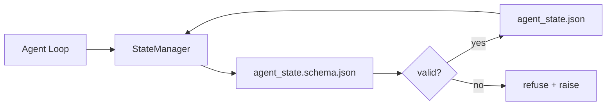

# 存储器和持久状态

> 聊天历史是易失的. 报告是持久的. 工作台将代理状态存储在带版本文件中,这样下一个会议,下一个代理,下一个评论家都能从同一个来源的真相读取.

**Type:** Build
**Languages:** Python (stdlib + `jsonschema` optional)
**Prerequisites:** Phase 14 · 32 (Minimal Workbench)
**Time:** ~60 minutes

## 学习目标
- 定义什么属于备忘录,什么属于聊天历史.
- 为`agent_state.json`和 `task_board.json`编写JSON方案――
- 构建一个国家管理者,用于原子化地加载,验证,变更和持久化状态.
- 使用方案 在坏写入破坏工作台之前拒绝它们.

## 问题
代理完成一个会议――聊天 关闭了――下一个会议――打开并询问从哪里开始――模型说让我检查文件,读过的笔记,然后重复完成了工作――更糟糕的是,它会重写一个完成的文件,因为没有人告诉它这个文件已经完成了――

工作台的修复方式是 repo 存储器:状态存在 repo 中的 JSON 文件里,按方案写入,以原子方式持久化,并且在代码审查中对差异友好。聊天是临时的输送;repo 是记录系统。

## 概念


### 什么属于备忘录

| 属于 | 不属于 |
|---------|-----------------|
| Active task id | 原始 chat transcripts |
| 本 session 触碰过的文件 | Token-level reasoning traces |
| agent 做出的假设 | "The user seemed frustrated" |
| 未解决的 blockers | Sampled completions |
| 下一步 action | Vendor-specific model ids |

判断标准是持久性:三个月后在CI重新运行时,这还有用吗?如果有,放进备用.

### 方案第一状态

没有它,每个代理都会发明新字段,每个评论员都需要学习一种新形状,每个CI脚本都必须对过去版本做特殊案例.

覆盖方案:

- 必须要把钥匙.
- 允许的`status`价值
- 禁止的值(例如数组的`null`
- 模式限制 任务标识 匹配`T-\d{3,}`
- 用于迁移的版本字段.

### 原子写道

写入需要能承受部分失败:写入 Tempfile,fsync,然后重新命名覆盖目标.

### 移民

当 schema 变化时,在 schema bump 旁边交付一个迁移脚本――状态文件 带有`schema_version`管理员会拒绝加载它无法移动的版本文件.


```figure
wb-state-persist
```

## 构建它
`code/main.py`实现:

- `agent_state.schema.json`和 `task_board.schema.json`,我知道.
- 一个仅使用stdlib的验证器(JSON Schema 子集:required、type、enum、pattern、items) 👇
- 带有原子气温和重命名 写入的`StateManager.load`,我知道.`StateManager.update`,我知道.`StateManager.commit`,我知道.
- 一个演示:变更状态,持久化,重新加载,并证明回路.

运行它:

```
python3 code/main.py
```

脚本会写入`workdir/agent_state.json`和 `workdir/task_board.json`通过两个转变变变变,并在每一步印过验证状态.

## 真实场景中的生产模式

通过四种模式,将课程的最低限度转化为可承受的多代理单机.

**Atomic temp-and-rename 不是可选项。**2026年3月份的一份"蜂巢项目错误报告"清晰记录了这种失败模式:`state.json`通过`write_text()`写入,并且例外 被捕后静默忽略. 部分写入让会议在没有信号的情况下基于损坏状态恢复.`tempfile.mkstemp`写入,`fsync`没有任何`os.replace`它们是原子的重命名.`atomic_write`正是这样做.

**每个非幂等 tool call 都要有 idempotency keys。**如果代理在调用工具后,检查点后,结果之前崩,恢复过程会重试该工具的呼叫.对阅读安全;对电子邮件,DB插件,文件上传危险.模式是:在执行前将每个工具的呼叫 ID记录到.`pending_calls.jsonl`△重试时检查该ID;如果存在,跳过调用并使用缓存结果──人类和兰格链都在2026年指南中指出这一点;长图的检查点出于同样的原因持久性等待写作──

**将大型 artifacts 与 state 分离。**不要把CSV,长文本或生成的文件存储进来`agent_state.json`△将文物保存为单独文件,或上传到物体存储,状态 中只保留路径,检查点 保持小而快;文物 独立增长,

**Event sourcing 用于 audit，snapshots 用于 resume。**每次突变都会添加到事件日志`state.events.jsonl`);定期截图到`state.json`简历 读取快照,然后播放快照时间印 之后的所有事件. 这会消耗更多磁盘,但允许你逐字播放代理决定,这对调试长视线运行至关重要.

**Schema migrations，否则拒绝加载。** `schema_version`当管理员加载未知版本文件时,它会拒绝读取.`tools/migrate_state.py`在每次启动中,

## 使用它
在生产中:

- **LangGraph checkpointers。**同一个想法,不同的存储.检查点将图形状态 持久化到SQLite,Postgres或定制后台.本课讲的方案是当检查点失效,你需要手工读取状态时将使用到的东西.
- **Letta memory blocks。**带有结构化方案的持续块 (阶段14 · 08) ⋅同样的纪律,作用域是长期的人物──
- **OpenAI Agents SDK session store。**插入式后台, schema-aware──本课中的状态文件就是本课中的本文件后台──

## 交付它
`outputs/skill-state-schema.md`会生成对项目特定的JSON Schema (状态 + 板) 个连接到原子写的Python`StateManager`确保下一次的计划跳动不会破坏工作台.

## 练习
1. 添加一个`last_human_touch`拒绝任何在后五秒内的代理写下来.
2. 扩展验证器 以支持`oneOf`它们可以是构建任务,也可以是复习任务,并且两者都有不同的要求领域.
3. 添加`schema_version`编写从v1到v2的迁移`blockers`重命名为`risks`
4. 将存储后台从本地文件移动到SQLite.`StateManager`它们的 API 不变.
5. 让两个代理以50ms写比赛同时写入同一个状态文件.

## 关键术语
| Term | What people say | What it actually means |
|------|----------------|------------------------|
| Repo memory | "Notes file" | 按 schema 存储在 repo 的 tracked files 中的 state |
| Schema-first | "Validate inputs" | 先定义契约再写 writer，拒绝漂移 |
| Atomic write | "Just rename" | 写入 temp，fsync，rename，因此 partial failures 无法破坏 |
| Migration | "Schema bump" | 将 vN state 转换为 v(N+1) state 的 script |
| System of record | "Source of truth" | workbench 视为权威的 artifact |

## 延伸阅读
- [JSON Schema specification](https://json-schema.org/specification.html)
- [LangGraph checkpointers](https://langchain-ai.github.io/langgraph/concepts/persistence/)
- [Letta memory blocks](https://docs.letta.com/concepts/memory)
- [Fast.io, AI Agent State Checkpointing: A Practical Guide](https://fast.io/resources/ai-agent-state-checkpointing/) 方案第一检查与等性
- [Fast.io, AI Agent Workflow State Persistence: Best Practices 2026](https://fast.io/resources/ai-agent-workflow-state-persistence/)同步控制,TTL,事件采购
- [Hive Issue #6263 — non-atomic state.json writes silently ignored](https://github.com/aden-hive/hive/issues/6263)真实项目 中的失败模式
- [eunomia, Checkpoint/Restore Systems: Evolution, Techniques, Applications](https://eunomia.dev/blog/2025/05/11/checkpointrestore-systems-evolution-techniques-and-applications-in-ai-agents/)从OS 历史 应用于代理的CR原始
- [Indium, 7 State Persistence Strategies for Long-Running AI Agents in 2026](https://www.indium.tech/blog/7-state-persistence-strategies-ai-agents-2026/)
- [Microsoft Agent Framework, Compaction](https://learn.microsoft.com/en-us/agent-framework/agents/conversations/compaction)供应商检查站经理
- 阶段14 · 08  记忆区块和睡眠时间计算
- 阶段14 · 32  本课为其方案的三档次最低
- 阶段14 · 40  从同一个方案读取的交付包
