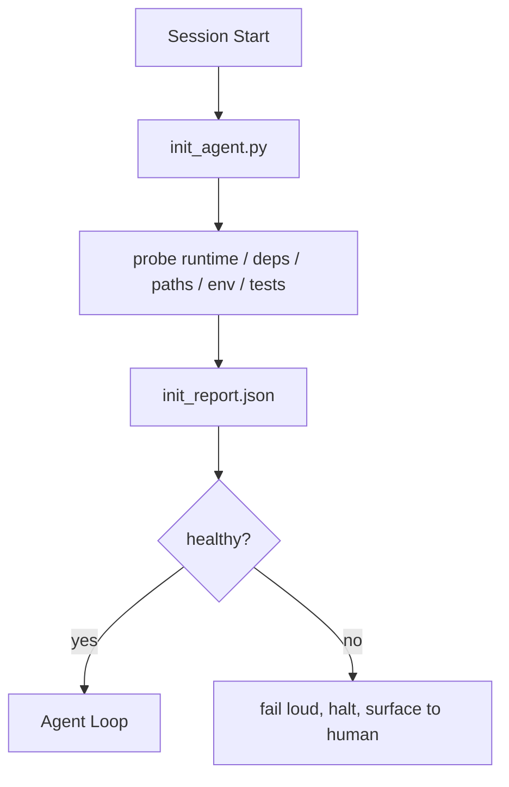

# 代理的初始脚本

> 每个冷启动的会议都需要付出代价. 代理会读取相同的文件,重试相同的搜索,并重新发现相同的路径.

**Type:** Build
**Languages:** Python (stdlib)
**先修要求：**阶段14 · 32 (最低工作台),阶段14 · 34 (报告记忆)
**Time:** ~45 分钟

## 学习目标
- 识别代理不应该在每次会议中重复完成工作.
- 构建一个确定性的初始脚本,用于查找运行时间,依赖性和备忘录健康.
- 持久化查询结果,让代理阅读它,而不是重新运行查询.
- 当初始化失败时,要响亮、快速地失败,并提供唯一的排查位置.

## 问题
打开一个会议――代理 猜测Python版本――猜测测试命令――为了找到入口点,列出 repo root 五次――尝试进口一个尚未安装的包――询问用户配置文件 在哪里――等到它真正开始编辑时,已经有万个代币花在本应由一个脚本完成的设置工作上――

修复方式是使用一个初始化脚本:它在代理做任何事之前运行,并写入一个供代理启动时读取的`init_report.json`,我知道.

## 概念


### 开始的脚本

| Probe | 为什么重要 |
|-------|------------|
| Runtime versions | 错误的 Python 或 Node version 意味着悄无声息的错误版本 bug |
| Dependency availability | 缺失的 package 如果到后面才发现，成本会是现在捕获它的十倍 |
| Test command | Agent 必须知道如何 verify；如果 command 缺失，workbench 就坏了 |
| Repo paths | Hard-coded paths 会漂移；一次性解析并固定下来 |
| Environment variables | 缺失 `OPENAI_API_KEY` 是一个 failure surface，而不是 runtime mystery |
| State + board freshness | 崩溃 session 留下的陈旧 state 是一个 footgun |
| Last-known-good commit | 作为 session 结束时 handoff diff 的锚点 |

### 快速显然失败,并集中在一个失败的地方

试验失败意味着停止并向人呈现. 不要说, 代理会自己弄清楚.

### 无力

连续运行两次. 第二次除了刷新时间标签之外,应该是没有开放权.

### 启动规则与初始规则

规则 (阶段14 · 33) 描述行动前必须满足什么. 开始是建立这些规则可检查的脚本. 没有规则将变成小心.


```figure
wb-init-probes
```

## 构建它
`code/main.py`实现了`init_agent.py`其他:

- 五个探测器: 字thon版本,通过`importlib.util.find_spec`列出的依赖性,测试命令可解决性,要求环境,状态文件新鲜性.
- 每个探测器都回来了`(name, status, detail)`,我知道.
- 脚本写入包含完整的探测组`init_report.json`失败时, 退出非零状态.

运行它:

```
python3 code/main.py
```

脚本会打印探测器 表,写入 `init_report.json`在幸福的道路上以零状态退出,或者在失败时以非零状态退出并列出失败的探测器.

## 真实场景中的生产模式

三种模式可以区分有用的初始脚本和仪式感.

**Last-known-good commit anchoring.**将当前承诺与上次成功合并时写入`LKG`文件 进行查询. 如果差异超过预算,拒绝启动,并要求人确认新的基线.

**Lock files with TTL.**在第一次成功的调查通过后写入`prereqs.lock`◎后续运行会在N 小时内信任该锁(默认24h),并跳过昂贵的探测器.

**No network, no LLM, no surprises in the hot path.**试验探针不是试验探针;它是工作流程. 如果一个试验探针在干燥运行中超过三秒钟,就把它视为工作桌气味,并将它移动到 init 或缓存其结果.

## 使用它
在生产中:

- **Claude Code hooks.** `pre-task`调用初始脚本,并在失败时拒绝启动代理.
- **GitHub Actions.** `setup-agent`工作运行 init脚本; 代理工作取决于它.
- **Docker entrypoint.**执行代理运行之前运行 init脚本;失败时呈现日志──

由于它不调用任何特定框架,所以 init脚本是可移植的.

## 交付它
`outputs/skill-init-script.md`会面谈项目,将其设置工作 分类为探测,并产出特定项目`init_agent.py`并且在任何代理步骤之前运行它的CI工作流程.

## 练习
1. 添加一个探测器,用于不同当前提交和最后已知-好提交;如果变更超过50个文件,就拒绝启动.
2. 让它写入.`prereqs.lock`文件,并锁定 超过七天时拒绝启动.
3. 添加一个`--fix`旗,自动安装缺失的开发器依赖,但未经批准绝不修改运行时间依赖.
4. 将探测器从硬码函数移动到YAML注册表.
5. 运行超过三秒的探测器是一种工作桌气.

## 关键术语
| Term | 人们会怎么说 | 它实际意味着什么 |
|------|--------------|------------------|
| Probe | “一个 check” | 返回 `(name, status, detail)` 的确定性函数 |
| Init report | “Setup output” | 与 state 放在一起、写有 probe results 的 JSON |
| Idempotent | “可以安全重新运行” | 连续两次运行会生成除 timestamp 外完全相同的 reports |
| Fail loud | “不要吞掉” | 停止并呈现给 human；没有 silent fallback |
| Setup tax | “Bootstrap cost” | Agent 每个 session 为重新发现显而易见信息所花费的 Token |

## 延伸阅读
- [Anthropic, Effective harnesses for long-running agents](https://www.anthropic.com/engineering/effective-harnesses-for-long-running-agents)
- [GitHub Actions, composite actions for setup](https://docs.github.com/en/actions/sharing-automations/creating-actions/creating-a-composite-action)
- [microservices.io, GenAI 开发平台：guardrails](https://microservices.io/post/architecture/2026/03/09/genai-development-platform-part-1-development-guardrails.html)预约+CI 检查作为初始
- [Augment Code, How to Build Your AGENTS.md (2026)](https://www.augmentcode.com/guides/how-to-build-agents-md)初始期望
- [Codex Blog, Codex CLI Context Compaction](https://codex.danielvaughan.com/2026/03/31/codex-cli-context-compaction-architecture/)开始会议作为紧缩意识的 init
- 阶段 14 · 33  此脚本启动规则集
- 阶段14 · 34  此脚本播种的状态文件
- 阶段14 · 38  init脚本 供给的验证门
- 消费初步报告的最后一项已知好转
