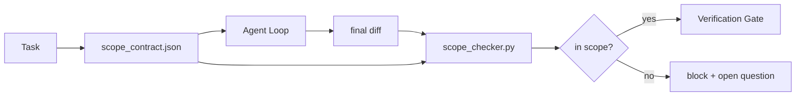

# 合同范围与任务边界

> 工作的范围合同是一个每任务文件,用来说明工作从哪里开始,在哪里结束,以及一旦越界应该如何推翻.

**类型:**建立
**语言:**字符串 (stdlib)
**先修:**阶段14·32 (最低工作时间),阶段14·33 (规则作为限制)
**时间:**时间50分钟

## 学习目标

- 编写一个范围合同,让代理在任务开始时读取,并让验证人在任务结束时读取.
- 指定允许的文件,禁止的文件,接受标准,反弹计划和批准界限.
- 实现一个范围检查,将与合同相比不同并标记违规.
- 让范围爬行可见,自动化和可审查.

## 问题

机关人员会爬──任务是修复登录错误──diff 触碰登录路线,电子邮件助手,数据库驱动程序,README和发布脚本──每次触碰时都有一个看似合理的理由──一起,它们已经变得与原来的评论内容不同.

范围是代理工作中最缺乏监控的失败模式,因为代理会真诚地讲述每一步.

## 概念



### 合同范围中包含什么

| Field | Purpose |
|-------|---------|
| `task_id` | 链接到 board 上的 task |
| `goal` | reviewer 可以验证的一句话 |
| `allowed_files` | agent 可以写入的 globs |
| `forbidden_files` | agent 即使意外也不得触碰的 globs |
| `acceptance_criteria` | 证明完成的 test commands 或 assertion lines |
| `rollback_plan` | 如果需要 halt，operator 可以执行的一段说明 |
| `approvals_required` | scope 外需要明确 human sign-off 的 actions |

没有`forbidden_files`合同是不完整的.负空间是合同的一半.

### 使用球体而不是原始路径

实际的回报会移动文件――把合同固定到全球`app/**/*.py`现在`tests/test_signup*.py`),这样的会议 之间发生反应器 时不会让合同失效.

### 轮是范围的一部分

列出如何推翻会迫使合同作者思考可能出什么问题――不能推翻的合同是不应批准的合同――

### 范围检查 是差异检查

写出差异.检查器 读取差异.允许的球,禁止的球,以及任何已运行的接受命令的列表.

### 范围的两种高度:特征列表和任务合同

约束范围合同是一个任务――它不约束整个项目――代理可以在修复登录问题时完美留在合同内,但下一轮又决定项目还需要设置页面,暗模式转换,以及路由器重写――合同 从来没有被问过这个项目范围是什么,它只回答了这个任务的哪些文件在范围──

第二个高度需要自己的原始:一个会议 启动时读取`feature_list.json`△它是项目后备的机器可读,有序文件.`status`为`todo`让它.`id`写入活跃范围合同,并被禁止在同一会话中启动第二个功能.

```json
{
  "project": "knowledge-base",
  "active": "import-pdf",
  "features": [
    { "id": "import-pdf", "status": "in_progress", "goal": "import a PDF into the library", "done_when": "pytest tests/test_import.py && a sample PDF appears in the library view" },
    { "id": "full-text-search", "status": "todo", "goal": "search document text and rank hits", "done_when": "query returns ranked results with snippets" },
    { "id": "cite-answers", "status": "todo", "goal": "answers carry source citations", "done_when": "every answer renders at least one clickable citation" }
  ]
}
```

| Field | Purpose |
|-------|---------|
| `active` | 当前 session 唯一允许触及的 feature；为空时表示选择一个并设置它 |
| `features[].id` | scope contract 的 `task_id` 指向的稳定 slug |
| `features[].status` | `todo`、`in_progress`、`done`、`blocked`；同一时间最多一个 `in_progress` |
| `features[].goal` | reviewer 能验证的一句话 |
| `features[].done_when` | 将 `in_progress` 翻转为 `done` 的 acceptance line |

两条规则让这个名单成为承重结构,而不是装饰.`at most one in_progress`这个不变 本身就是启动检查(阶段14 · 33):如果列表出现两个,会拒绝启动,直到人类解决. 第二,功能列表是文件,不是聊天消息,因为聊天会滚出文本,而文件会跨会议,跨代理 持久存在.`done`接下来,我们会看到准确的表格,而不是重新推剩下的什么.

通过最小特权组合,方式与下文描述的合并 相同:任务合同的 `allowed_files`必须落在所触及的范围内,不能越界.


```figure
wb-scope-bounce
```

## 构建它

`code/main.py`实现:

- `scope_contract.json`图片的集,全球阵列)
- 一个不同的解析器,将触及文件列表和运行命令列表转换为`RunSummary`,我知道.
- 一个`scope_check`根据合同 返回`(violations, in_scope, off_scope)`,我知道.
- 两个演示:一个保持在范围,另一个发生.

运行:

```
python3 code/main.py
```

输出:合同,两次运行,每次运行的判决,以及保存`scope_report.json`,我知道.

## 真实生产中的模式

一位运行 标签  (在调用代理前使用YAML范围合同) 实践者 报告说,在没有更换代理的情况下,子洞率在三周内从52%降至21%──作用是合同,不是模型──有三个模式 让收益持续──

**Violation budgets，而不是 binary failures。** `agent-guardrails`(Claude Code、Cursor、Windsurf、Codex 通过MCP使用的OSS合并门) 为每个任务提供`violationBudget`预算内微小范围的分片会作为警告 暴露;只有超过预算时,合并门才会拒绝.`violationSeverity: "error" | "warning"`预算决定是否被采用,还是被团队禁止使用.

**按 path family 做 severity asymmetry。**对于`docs/**`写作通常是`warn`对`scripts/**`,我知道.`migrations/**`,我知道.`config/prod/**`总是写的`block`△这种不对称性必须存在于合同中,而不是运行时间中,因为它是项目特定的,并且每个任务都会变化.

**Time 和 network budgets 与 file budgets 并列。** `time_budget_minutes`没有重新批准的情况下拒绝继续超过它.`network_egress`访问不属于任务的外部API. 这些也是范围.

**Multi-contract merge semantics（least privilege）。**当两个范围合同同时适用时 (例如项目范围合同加上任务特定合同),合并规则是:**intersect** `allowed_files`(两项合同必须允许该路径),**union** `forbidden_files`(任意一个可以禁止),`time_budget_minutes`取最严格值 (min),`approvals_required`累积.`network_egress`在中,`None`表示不执行,`[]`拒绝所有,`[...]`表示允许;合并时,`None`让位于另一边,两个列表取交集,拒绝一切 保持拒绝一切.把这一点写入合同方案,这样合并就是机械且可审查的.

## 使用它

生产模式:

- **Claude Code slash commands.** `/scope`命令 写入合同,并将其固定为会议背景──
- **GitHub PRs.**将合同作为JSON文件推送到PR体中,或作为检查的文物.
- **LangGraph interrupts.**违规范围 触发中断;处理者 询问人 是需要扩大合同,还是代理 需要后退.

合同 随着任务 流转. 当任务 关闭时,合同 会归档到`outputs/scope/closed/`,我知道.

## 交付它

`outputs/skill-scope-contract.md`作为任务描述, 生成一个范围合同,以及一个能感知到的球,并对每个代理运行的CI进行检查.

## 练习

1. 添加一个`network_egress`列出允许的外部主机――拒绝触碰其他主机的运行――
2. 扩展检查器,让它对`docs/**`软失败对对`scripts/**`硬失败――说明这种不对称的原因――
3. 使用静态规则设置(不使用LLM)让合同从 `goal`推导 字段`allowed_files`第一个边缘案例会出什么问题?
4. 添加`time_budget_minutes`现在,我不想继续.
5. 对于同一个不同运行两个合同. 当两者都适用时,正确的合并语义是什么?

## 关键术语

| Term | What people say | What it actually means |
|------|----------------|------------------------|
| Scope contract | “任务 brief” | per-task JSON，列出 allowed/forbidden files、acceptance、rollback |
| Scope creep | “它还 touched 了...” | 同一 task 中发生了 contract 外的文件变更 |
| Rollback plan | “我们可以 revert” | 用于 halt 的一段 operator runbook |
| Approval boundary | “需要 sign-off” | contract 中列出的、需要明确 human approval 的 action |
| Diff check | “Path audit” | 将 touched files 与 contract globs 比较 |

## 延伸阅读

- [LangGraph human-in-the-loop 中断](https://langchain-ai.github.io/langgraph/concepts/human_in_the_loop/)
- [OpenAI Agents SDK tool approval policies](https://platform.openai.com/docs/guides/agents-sdk)
- [logi-cmd/agent-guardrails — merge gates 与 scope validation](https://github.com/logi-cmd/agent-guardrails)违规预算,严重程度级别
- [Dev|Journal, Preventing AI Agent Configuration Drift with Agent Contract Testing](https://earezki.com/ai-news/2026-05-05-i-built-a-tiny-ci-tool-to-keep-ai-agent-configs-from-drifting-in-my-repo/) 无外部部署的`--strict`模式
- [Agentic Coding Is Not a Trap (production logs)](https://dev.to/jtorchia/agentic-coding-is-not-a-trap-i-answered-the-viral-hn-post-with-my-own-production-logs-33d9) 预测收益:52% → 21%
- [OpenCode permission globs](https://opencode.ai/docs/agents/) 细粒度每许可范围
- [Knostic, AI Coding Agent Security: Threat Models and Protection Strategies](https://www.knostic.ai/blog/ai-coding-agent-security) 作为最小特权 一部分的范围
- [Augment Code, AI Spec Template](https://www.augmentcode.com/guides/ai-spec-template) 三层边界系统(必须/不需要)
- 配套的快速注射防御
- 阶段14 · 33  合同 针对每个任务 专门规则
- 期14 · 38 检查器 汇报进入的验证门
