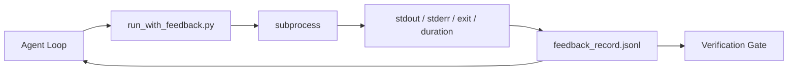

# 运行时间反循环

> 看不到真实命令输出的代理只能猜测.反运行商会把stdout、stderr、出口代码和时间 捕获为结构化记录,供下一轮读取.

**Type:** Build
**Languages:** Python (stdlib)
**先修要求：**阶段14 · 32 (最小工作台),阶段14 · 35 (初始脚本)
**Time:** ~50 minutes

## 学习目标
- 区分运行时间反与可观测性远程测量.
- 构建一个反运行器,使用它包装命令并持久化结构化记录.
- 为了确定性地切断大型输出,让循环保持在代币预算内.
- 当反缺失时,拒绝推进循环.

## 问题
实际上没有任何测试被运行. 代理想象出口,或者它运行命令,但从来没有读取结果,或者它读取结果却断断失线.

反运行商将消除这一缺陷――每个命令都通过运行商执行――每条记录都包含命令、捕获的 stdout 和 stderr、出口代码、墙钟时间,以及一行代理注册―― 代理 在下一轮读取记录――验证门 在任务结束时读取这些记录――

## 概念


### 反记录中包含什么

| Field | 为什么重要 |
|-------|----------------|
| `command` | 精确 argv，避免 shell expansion 意外 |
| `stdout_tail` | 最后 N 行，确定性截断 |
| `stderr_tail` | 最后 N 行，与 stdout 分开 |
| `exit_code` | 明确无歧义的成功信号 |
| `duration_ms` | 暴露缓慢探测和失控进程 |
| `started_at` | 用于 replay 的 timestamp |
| `agent_note` | Agent 写下的一行预期说明 |

### 切割是确定性的

运行员会保留头和尾巴,并加入`...truncated N lines...`标记;这是确定性的,因此相同输出总会产生相同记录――不做样本; 代理需要看到的部分(最终错误、最终总结) 位于尾部――

### 反与远程测量

电气测量 (Fase 14 · 23,OTel GenAI) 用于人类操作员跨时间审查运行.

### 没有反就拒绝推进

如果跑步者在抓获出口之前出错,记录会包含`exit_code: null`和 `error: <reason>`△ 代理循环必须拒绝`null`没有出口,没有进步.


```figure
wb-feedback-loop
```

## 构建它
`code/main.py`实现:

- `run_with_feedback(command, agent_note)`包装`subprocess.run`捕获停机/停机/出机/持续时间,确定性截止,并增加到`feedback_record.jsonl`,我知道.
- 一个小装机将JSONL流到Python列表中.
- 一个演示,运行三个命令,并打印每个命令的最后条记录.

运行:

```
python3 code/main.py
```

输出:三条反记录 会增加到 `feedback_record.jsonl`通过多次重复运行尾巴,可以看到循环如何积累.

## 真实生产中的生产模式

跑步者可以在线上加快到可行程度.

**写入时 redaction，而不是读取时 redaction。**任何接触或接触的记录 都可能泄露秘密.`^Bearer `,我知道.`password=`,我知道.`api[_-]?key=`,我知道.`AKIA[0-9A-Z]{16}`没有什么可言.`xox[baprs]-`根据生产运行时间中观察到的秘密格式 审计编辑模式.

**Rotation policy，而不是单个文件。**将`feedback_record.jsonl`限制每文件1MB; 溢出时旋转到`.1`,我知道.`.2`丢弃了`.5`△代理的循环只读取当前文件,因此运行时间成本 有界――CI文物存储 获取完整的旋转集――没有旋转时,每次加载器的调用都会被这个文件拖成瓶――

**用于 retry chains 的 parent-command id。**每条记录都有`command_id`退休 携带`parent_command_id`审核门的审核都沿着这个链接追踪.没有这个链接,试验看起来像彼此独立的成功,审计会隐藏失败历史.

## 使用它
生产模式:

- **Claude Code Bash tool。**这种工具已经捕获了,,出口和持续时间. 本课中的运行者是任何代理产品都能使用的框架-无知等价物.
- **LangGraph nodes。**将任意的结包装进运行器,让记录在图形状态之外持久化
- **CI logs。**让JSONL管到你的CI文物存储;评论员可以重播任意命令,而不必重新运行会议.

运行者是一个薄包装;它能经历每一次框架迁移,因为它掌握了记录的形状.

## 交付它
`outputs/skill-feedback-runner.md`会生成一个特定项目`run_with_feedback.py`包含正确的缩短预算,连接到工作台的JSONL编写器,以及每轮读取的载体.

## 练习
1. 为每条记录 添加`cwd`字段,这样可以从不同目录运行的相同命令区分.
2. 添加一个`redaction`步骤,剥离匹配`^Bearer `或`password=`,我在一个小时前,
3. 通过旋转到`.1`,我知道.`.2`文件,将 `feedback_record.jsonl`总大小限制为1 MB──为轮换政策辩护──
4. 添加`parent_command_id`让链接再试看:哪个命令产生下一个命令消费输入.
5. 列出该图的8个关键特征,在审查中必须显示.

## 关键术语
| Term | 人们常说 | 实际含义 |
|------|----------------|------------------------|
| Feedback record | “Run log” | 包含 command、output、exit、duration 的结构化 JSONL entry |
| Tail truncation | “Trim the log” | 确定性 head+tail 捕获，让 records 适配 token budget |
| Refuse-on-null | “Block on missing data” | 当 `exit_code` 为 null 时，loop 不得推进 |
| Agent note | “Expectation tag” | Agent 在读取结果前写下的一行预测 |
| Telemetry split | “Two log files” | Feedback 用于下一轮，telemetry 用于 operator |

## 延伸阅读
- [OpenTelemetry GenAI semantic conventions](https://opentelemetry.io/docs/specs/semconv/gen-ai/)
- [Anthropic, Effective harnesses for long-running agents](https://www.anthropic.com/engineering/effective-harnesses-for-long-running-agents)
- [Guardrails AI x MLflow — deterministic safety, PII, quality validators](https://guardrailsai.com/blog/guardrails-mlflow)将编辑模式作为回归测试
- [Aport.io, Best AI Agent Guardrails 2026: Pre-Action Authorization Compared](https://aport.io/blog/best-ai-agent-guardrails-2026-pre-action-authorization-compared/)工具 前/后捕获
- [Andrii Furmanets, 2026 年的 AI Agents：面向 Tools、Memory、Evals、Guardrails 的实用架构](https://andriifurmanets.com/blogs/ai-agents-2026-practical-architecture-tools-memory-evals-guardrails) 可观测性界面
- 电力测量方面的14期·23期
- 阶段14 · 24  代理可观测平台 ((Langfuse,Phoenix,Opik)
- 阶段14 · 33  要求在声明完成之前必须有反的规则
- 阶段 14 · 38 读取 JSONL 的验证门
