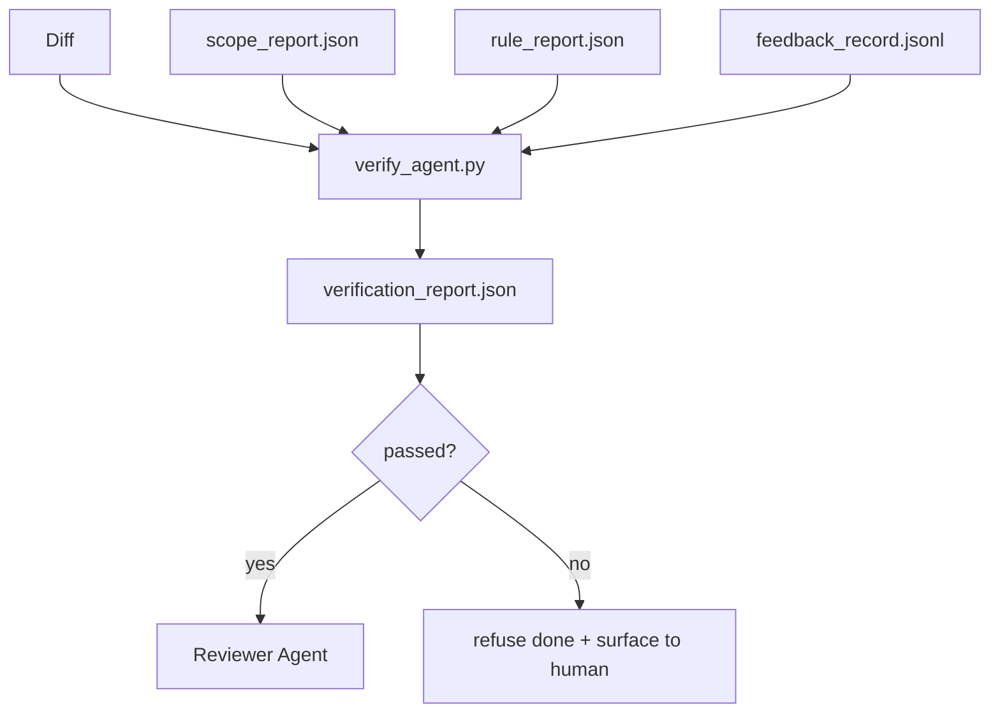

# 验证门

> 经理无法把自己的工作标记为完成. 验证门 会读取合同范围,反日志,规则报告 和 diff,并回答一个问题:这个任务真的完成吗?

**Type:** Build
**Languages:** Python (stdlib)
**Prerequisites:** Phase 14 · 33 (Rules), Phase 14 · 36 (Scope), Phase 14 · 37 (Feedback)
**Time:** ~55 分钟

## 学习目标
- 将验证门定义为作用于工作台文物的确定性函数.
- 报告将规则报告范围报告反记录 和不同 合并成一个判决.
- 输出审查员和城市信息中心`verification_report.json`,我知道.
- 只有出现任何区块严重性失败,就无例外拒绝推进任务.

## 问题
代理人 太容易宣称成功.

- 看起来不错. 模型读了自己的差异,然后认定它是正确的.
- 测试通过了. 说得很自信.
- 满足接受. 接受标准被解释得足够宽松,

工作台的修复方式是一个验证门,它读取代理 已生成的文物并做出判断.

## 概念


### 检查什么门

| Check | Source artifact | Severity |
|-------|-----------------|----------|
| 所有 acceptance commands 都已运行 | `feedback_record.jsonl` | block |
| 所有 acceptance commands 都以零退出码结束 | `feedback_record.jsonl` | block |
| Scope check 没有 forbidden writes | `scope_report.json` | block |
| Scope check 没有 off-scope writes | `scope_report.json` | block or warn |
| 所有 block-severity rules 都通过 | `rule_report.json` | block |
| feedback 中没有 `null` exit codes | `feedback_record.jsonl` | block |
| Touched files 匹配 `scope.allowed_files` | both | warn |

`warn`寻找会给判决 添注释;`block`找到会阻止`passed: true`,我知道.

### 确定性而不是概率性

对于相同的文物集,每次都必须产生相同的判决――不要 LLM 评审者――LLM 评审者――

### 一份报告,一个路径

每次任务完成,门都会输出一个.`verification_report.json`写入`outputs/verification/<task_id>.json`‧CI 消费同一个路径──使用不同的路径的多个门户 会分叉真理源──

### 无例外拒绝

区块重度发现 不能由代理覆盖.`override_reason`和 `overridden_by`转换是一次签名变更,不是代理 决策.


```figure
wb-gate-sequence
```

## 构建它
`code/main.py`实现:

- 每个输入文物的载体,全部在本地子里,使本课自含.
- 一个`verify(task_id, artifacts) -> VerdictReport`纯功能.
- 一台打印机,显示每项检查的结果和最终通过/失败.
- 没有任何可能的操作,

运行它:

```
python3 code/main.py
```

输出:三个判决报告,每个都保存到脚本旁边.

## 真实场景中的生产模式

                                                                                                                                                                                                                                                              

**Defense-in-depth，而不是 single gate。**预约 → CI状态检查 →预工具自动 →预合口门──每层都是确定性的,因此一层中的失败 会被下层捕获──微服务.io的2026年3月的玩法明确指出:预约是不可绕过的,因为与模型侧技能不同,它不依赖代理 遵循指令──验证门位于CI /预合口层──

**通过确定性 check 做 defense，model-judge 只处理细微差别。**代码是不是解决了问题?LLM条目 回答代码是否可读,安全,符合风格?gate 运行第一类;评审员(阶段14 · 39)运行第二类.

**签名 override log，而不是 Slack threads。**每次过渡都会在`outputs/verification/overrides.jsonl`中输出一行,包含:时间印章,寻找代码,理由,签字用户,当前的HEAD提交.

**将 coverage floor 作为一等 check。** `coverage_report.json`进口一个`coverage_floor`如果测试覆盖率低于地面,或者比上一次合并的地面低于1百分点,门将会失败.

**`--strict` mode 会将 warns 提升为 blocks。**对于释放分支,船舶封锁的公关或事件后的分类,`--strict`根据分支的选择, 没有全局默认, 因为严格的一切会腐蚀日常流动.

## 使用它
生产模式:

- **CI step。** `verify_agent`运行门.没有.`passed: true`合并保护会拒绝
- **Pre-handoff hook。**没有绿色判决,就没有交付.
- **Manual triage。**当代理人声称成功而人怀疑时,操作员会读取报告.

门是工作台流动中决定边缘.

## 交付它
`outputs/skill-verification-gate.md`将门 接入一个具体项目:哪些接受命令 会输入它,哪些规则是区块严格,哪些范围之外的写作被容忍,过渡审计日志 如何存储.

## 练习
1. 添加一个`coverage_floor`检查:测试命令必须生成覆盖报告,且至少达到80%──决定哪个文物 携带地板──
2. 支持`--strict`模式,将每个`warn`提升为`block`◎记录严格模式 适合作为默认值的场景──
3. 让门除了JSON之外还生成Markdown总结――论证哪些领域应属于总结――
4. 添加一个`time_since_last_human_touch`检查:人类按键后 60 秒内编辑过的任何文件,都免于范围外的旗.
5. 您的产品中的真实代理不同 上运行门. 结果是多少真实,多少噪音?门需要在哪里成长?

## 关键术语
| Term | What people say | What it actually means |
|------|----------------|------------------------|
| Verification gate | “阻止事情的 check” | 作用于 workbench artifacts 的确定性函数，生成 pass/fail verdict |
| Block severity | “Hard fail” | 会阻止 `passed: true` 并要求签名 override 的 finding |
| Override log | “我们为什么放行它” | 带有 reason 和 user id 的签名条目，由 review 审计 |
| Acceptance command | “证明” | 一个 shell command，其零退出码就是 `done` 的含义 |
| One report path | “Source of truth” | `outputs/verification/<task_id>.json`，由 CI 和 humans 共同消费 |

## 延伸阅读
- [Anthropic, Harness design for long-running application development](https://www.anthropic.com/engineering/harness-design-long-running-apps)
- [OpenAI Agents SDK guardrails](https://platform.openai.com/docs/guides/agents-sdk/guardrails)
- [microservices.io, GenAI dev platform: guardrails](https://microservices.io/post/architecture/2026/03/09/genai-development-platform-part-1-development-guardrails.html)预约与公众权益机构之间的深度防守
- [ICMD, The 2026 Playbook for Agentic AI Ops](https://icmd.app/article/the-2026-playbook-for-agentic-ai-ops-guardrails-costs-and-reliability-at-scale-1776661990431)批准门阶梯(草案 →批准 →车辆在门以下)
- [Type-Checked Compliance: Deterministic Guardrails (arXiv 2604.01483)](https://arxiv.org/pdf/2604.01483)  4 作为确定性门的上界
- [logi-cmd/agent-guardrails — merge gate 规范](https://github.com/logi-cmd/agent-guardrails)范围+突变测试门
- [Guardrails AI x MLflow](https://guardrailsai.com/blog/guardrails-mlflow)确定性验证器 作为CI评分器
- [Akira, Real-Time Guardrails for Agentic Systems](https://www.akira.ai/blog/real-time-guardrails-agentic-systems)工具调用前后的门
- 阶段14 · 27 快速注射防御(gate 的对抗对)
- 阶段14 · 36  此门执行的范围合同
- 阶段14 · 37  此门评分的反日志
- 阶段14 · 39  门将手放到审查员代理
