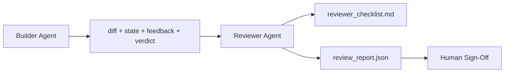

# 评审员: 将建筑师与标记分离

> 写代码的代理 不能给它打分――评论家是第二个循环,使用不同的系统提示、不同的目标,并且对构建者 产生的所有内容都是只读访问权限――构建者和评论家之间的间隔,是大部分可靠性所在――

**Type:** Build
**Languages:** Python (stdlib)
**Prerequisites:** Phase 14 · 38 (Verification Gate)
**Time:** ~55 分钟

## 学习目标
- 解释为什么同一个代理人不能靠谱地审查自己的工作.
- 构建一个审查代理 循环,它消费建筑物,并输出结构化审查报告.
- 编写一个评论员条目,按具体的维度评分,而不是凭感觉.
- 将评论员进入工作台,让人工评论从真实文物开始.

## 问题
你让代理修复一个bug. 它编辑了四个文件,运行测试,并报告完成.`passed: true`两天后你发现,这个修复解决了 bug 的另一半,而不是正确的另一半.

接受是必要的,但不充分的.评论员会问接受不能提出的问题:这是否正确解决问题?它是否在没有说明的情况下扩大范围?它是否记录了应被质疑的假设?它是否让工作台在下一个会议上可以接手的状态?

## 概念


### 审查员条款

五维度,每个维度评分为0到2

| Dimension | Question |
|-----------|----------|
| Problem fit | 这个变更是否解决了任务所陈述的问题，而不是相近的问题？ |
| Scope discipline | 编辑是否限制在 contract 内，或者 contract 的扩展是否是有意为之？ |
| Assumptions | 所有隐藏 assumptions 是否都写在了某个可 review 的地方？ |
| Verification quality | acceptance command 是否真的证明了目标，还是只证明了一个更弱的版本？ |
| Handoff readiness | 下一个 session 是否能从当前状态干净地接手？ |

总分10分. 低于7分是软失败;低于5分是硬失败.

### 评论员是独立角色,不是独立模型

关键约束是角色分离:不同的系统提示,不同的输入,对不同的没有写权的姿势变化就是信号的变化.

### 评论员 不能编辑不同

评论员读取不同,状态,反,判断. 它写了一个报告. 它没有补丁. 如果报告说修复这个,下一轮的构建者转向去修复.

### 对审查员的条款与验证门的比率

检查确定性事实:接受是否运行、规则是否通过、范围是否保持──审查员做定性判断:这是否正确的工作、是否有文档记录、批准是否可用──两者都需要──


```figure
wb-builder-marker
```

## 构建它
`code/main.py`实现:

- 一个`ReviewerInputs`读取的文物──
- 一个分分分分分分分分分分分分分分分分分分分分分分分分分分分分分分分分分分分分分分分分分分分分分分分分分分分分分分分分分分分分分分分分分分分分分分分分分分分分分分分分分分分分分分分分分分分分分分分分分分分分分分分分分分分分分分分分分分分分分分分分分分分分分分分分分分分分分分分分分分分分分分分分分分分分分分分分分分分分分分分分分分分分分分分分分分分分分分分分分分分分分分分分分分分分分分分分分分分分分分分分分分分分分分分分分分分分分分分分分分分分分分分分分分分分分分分分分分分分分分分分分分分分分分分分分分分分分分分分分分分分分分分分分分分分分分分分分分分分分分分分分分分分分分分分分分分分分分分分分分分分分分分分分分分分分分分分分分分分分分分分分分分分分分分分分分分分分分分分分分分分分分分分分分分分分分分分分分分分分分分分分分分分分分分分分分分分分分分分分分分分分分分分分分分分分分分分分分分分分分分分分分分分分分分分分分分分分分分分分分分分分分分分分分分分分分分分分分分分分分分分分分分分分分分分分分分分分分分分分分分分分分分分分分分分分分分分分分分分分分分分分分分分分分分分分分
- 一个`review_report.json`写作者,包含五分数,总分和判决`pass`,我知道.`soft_fail`,我知道.`hard_fail`
- 两个演示案例:一个干净的变化,以及一个测试正确,问题错误的变化.

运行:

```
python3 code/main.py
```

输出:两份复习报告 写入磁盘,并在控制台中显示一张维度分数表.

## 真实场景中的生产模式

证据如下:Cloudflare 在2026年4月的AI代码审查系统中,在30天内跨越5,169个备份、48,095个合并请求 运行了131,246次审查。审查 完成时间中位数为3分39秒──最多七名专业审查员 ((安全、性能、代码质量、文档、发布管理、合规、工程编辑) 在审查协调员下并行运行,由模型协调员重重复调查并判断严重性──顶级 仅保留协调员;专业人员 运行在更便宜的层次上.

让它能够扩大运作的模式.

**Specialist pool, not one big reviewer.**对于单独的回复来说,一个带5维分类的评论家 足够. 一旦代码库有安全关键的性能关键和文件表面,就把它分成即时更小的专家,协调员做重;专家从不运行完整的分类.

**Bias mitigation as design requirement, not optimization.**法律法官会表现出四类稳定偏见(Adnan Masood,2026年4月):位置偏见(GPT-4 在 (A,B) 与 (B,A) 排序上约40%不一致) 率偏见(更长输出有约15%的分数通胀) ‧自偏见(法官 偏好同样模型家庭的输出) ‧权威(法官会高估名作者的引用) ‧缓解方式:同时评估两种排名,只计算一致获胜;使用明确奖励简洁度的1-4度尺度;跨模型家庭 轮换法官;评分前移除作者姓名.

**Calibration set, not vibes.**准备一个包含10-20个历史任务,并且有已知正确判决的集合. 每次修改提示后都运行评论员. 如果与历史记录的一致性低于80%,则在发布评论员前需要修改.

**Hybrid norm with the gate.**审核门 (Verification gate)  (第14阶段 · 38) 处理确定性检查 (处理确定性检查) (接受否运行,测试否通过,范围否保持) (评论员处理语义检查) (这是否正确的工作,假设是否有记录,支持否可用) (Anthropic的2026年指导明确强调这种分断:不要让评论员重做门已经证明的事情――).

## 使用它
生产模式:

- **Claude Code subagents.**在"关闭任务后运行"中,它在"公关上发布了带有标题分数的评论.
- **OpenAI Agents SDK handoffs.**建筑师在完成任务时交给评论家.
- **Two-model pairing.**建筑者运行在更快,更便宜的模型上―― 评论者运行在更强的模型上,使用更小的文本,专注于判断――

评论员是当人类无法亲自完成每次审查时,工作台长出第二双眼.

## 交付它
`outputs/skill-reviewer-agent.md`生成一个项目专业审查员条目"",一个连接建筑物文物审查员代理片段",以及与验证门的集成,让人工审查从书面报告开始,而不是从空白页开始.

## 练习
1. 添加第六个与你的产品域相关的维度.说明为什么它没有被现有的五维吸收.
2. 运行审查员――哪种会产生人类更可能阅读的报告?
3. 为每一个维度加`confidence`报告拒绝发布.
4. 构建一个校准集:10 个具有已知正确判决的历史任务关闭.
5. 添加一个 要求更多证据 提供:评论员可以在评分前要求构建者运行某种特定的测试.

## 关键术语
| Term | What people say | What it actually means |
|------|----------------|------------------------|
| Reviewer rubric | “Checklist” | 五维 0-2 评分，每个维度都有一个书面问题 |
| Soft fail | “Needs revisions” | 总分低于 7；builder 获得需要处理的 findings |
| Hard fail | “Reject” | 总分低于 5，或任一维度为 0；暂停并呈现给 human |
| Role separation | “Different prompt” | 同一个 model 可以承担两个角色；关键约束是 inputs 和 posture |
| Confidence floor | “Don't ship low-signal reports” | 当 rubric 不确定时，拒绝输出 verdict |

## 延伸阅读
- [OpenAI Agents SDK handoffs](https://platform.openai.com/docs/guides/agents-sdk/handoffs)
- [Anthropic Claude Code subagents](https://docs.anthropic.com/en/docs/agents-and-tools/claude-code/sub-agents)
- [Cloudflare, Orchestrating AI Code Review at Scale](https://blog.cloudflare.com/ai-code-review/) 7 个专家 + 协调员 架构,30 天 131k 次运行
- [Agent-as-a-Judge: Evaluating Agents with Agents (OpenReview / ICLR)](https://openreview.net/forum?id=DeVm3YUnpj) DevAI基准,366层次解决方案要求
- [Adnan Masood, Rubric-Based Evaluations and LLM-as-a-Judge: Methodologies, Biases, Empirical Validation](https://medium.com/@adnanmasood/rubric-based-evals-llm-as-a-judge-methodologies-and-empirical-validation-in-domain-context-71936b989e80) 4种偏见与缓解方式
- [MLflow, LLM-as-a-Judge Evaluation](https://mlflow.org/llm-as-a-judge) 用于分离建筑/评估者的生产工具
- [LangChain, How to Calibrate LLM-as-a-Judge with Human Corrections](https://www.langchain.com/articles/llm-as-a-judge)校准设置工作流程
- [Evidently AI, LLM-as-a-judge: a complete guide](https://www.evidentlyai.com/llm-guide/llm-as-a-judge)
- [Arize, LLM as a Judge — Primer and Pre-Built Evaluators](https://arize.com/llm-as-a-judge/)
- 阶段14 · 05 自我精炼和批判性 (单机自我审查的基准)
- 阶段14 · 30 Eval驱动剂开发校准组生成器)
- 阶段14 · 38 审查员 读取的验证门
- 阶段14 · 40 审查员报告输入的交付包
