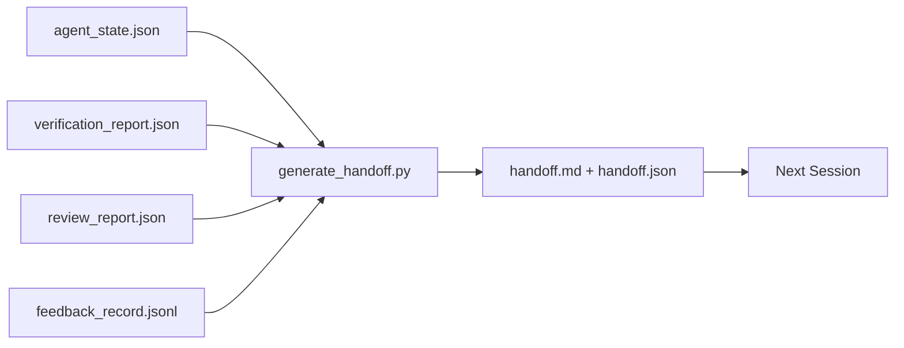

# 多次会议交换

> 会议要结束.工作还没有结束. 包包是一种文物,它把 代理工作一个小时转化为 下一个会议在第一分钟就能产出.

**类型:**建立
**语言:**字符串 (stdlib)
**先修:**期14·34 (报告记忆),期14·38 (验证),期14·39 (审查者)
**时间:**时间50分钟

## 学习目标

- 识别每一个交付包都需要的七个字段.
- 工作桌上的文物生成交换,而不是手写说明文字.
- 将大型反日志剪成适合交付的摘要.
- 让下一个会议的第一个动作具有确定性.

## 问题

会议结束. 代理说很好,我们取得了进展. 下一个会议开幕. 下一个代理问我们上次停在哪里? 首个代理的答案已经不见. 下一个代理重新发现问题,重新运行相同的命令,重新向人类询问相同的问题,并花了三十分钟,只恢复上一个会议. 最后的三十秒信息.

糟糕的交付成本,将在任务生命周期中的每一个会议中持续支付.修复方式是在会议结束时自动生成一个包:改了什么?为什么改了什么?尝试过什么?什么失败了?还剩什么?下一次首先做什么?

## 概念



### 每次交给都带着七段段

| Field | 它回答的问题 |
|-------|---------------------|
| `summary` | 一段话说明完成了什么 |
| `changed_files` | 一眼看清 diff |
| `commands_run` | 实际执行过什么 |
| `failed_attempts` | 尝试过什么，以及为什么没有成功 |
| `open_risks` | 下个 session 可能踩到什么坑，附 severity |
| `next_action` | 下个 session 采取的第一个具体步骤 |
| `verdict_pointer` | 指向 verification + review reports 的路径 |

`next_action`字段是承重字段. 一个包含所有内容,但缺少.`next_action`报道是状态报告,而不是报道.

### 交付是生成的,不是写出来的

手写手稿,就是在困难的日子里会被跳过的手稿――生成器 读取工作桌文物 并输出包――代理的职责是让工作桌处于生成器可以总结的状态,而不是亲自写总结――

### 两种形式:可读于人和可读于机器

`handoff.md`供人类阅读.`handoff.json`供下一个代理 加载――两者来自同一批原始文物――如果它们出现分歧,以JSON为准――

### 回复记录 裁剪

完整的`feedback_record.jsonl`现在,我们可以把最后一个K条带到我们的手里,以及每一个非零出口的记录.

### 留下干净状态

简单的状态 让工作恢复.它们不是同样的事情. 如果下一个会议 开时面对的是半截差,代理 忘记了临时文件,游离分支,以及尚未真正运行的报错测试,那么再完美.`handoff.md`另外,下一个代理会先花10分钟清理一个会议,而不是继续构建;这个成本会在任务生命周期中的每个会议中增加利.

所以,会议不是在功能运行时结束,而是在工作桌上 处于生成器可以总结,下一个会议可以信任状态时结束.

| Check | Clean means | Dirty blocks because |
|-------|-------------|----------------------|
| Working tree | 每个变更都已 commit，或明确 stash 并附带说明 | 半截 diff 会被下一个 agent 看成有意图的工作 |
| Temp artifacts | 没有 `*.tmp`、scratch dirs、debug prints 或留下的注释块 | 游离文件会污染 diff 和下一个 agent 的 mental model |
| Tests | 绿色，或红色但在 `open_risks` 中命名了失败 | 沉默的红色 test 是下一个 session 会踩进去的陷阱 |
| Feature board | `feature_list.json` status 反映真实状态（Phase 14 · 36） | 过期 board 会把下一个 session 派去做已经完成的工作 |
| Branch | 位于预期 branch，没有 detached HEAD，没有 orphan branches | 错误 branch 会让下一个 session 的第一个 commit 落到错误位置 |

清理阶段会产出一个`clean_state.json`建立在脏树上的交付不是交付,而是转发混乱──两个文物成对出现:清洁 证明工作台可以安全离开,证明下一个会议 知道从哪里开始──


```figure
wb-handoff-packet
```

## 构建它

`code/main.py`实现了:

- 一个加载器将状态,判断,审查和反汇总成单个`WorkbenchSnapshot`,我知道.
- 一个`generate_handoff(snapshot) -> (markdown, payload)`函数――
- 一个过器,选择最后的K条反条目加上所有非零出口.
- 一个演示,在脚本旁边写入`handoff.md`和 `handoff.json`,我知道.

运行它:

```
python3 code/main.py
```

输出:印出的手机机,以及磁盘上的两个文件.

## 真实生产中的模式

编程CLI、Claude Code 和 OpenCode 各自提供不同的缩放方案;结构化交付包位于此三者之上.

**Compaction 策略各不相同；packet schema 不变。**代码CLI的 POST /v1/responses/compact 是一个服务器侧不透明的AES片(OpenAI模型的快速路径);fallback 是一个本地handoff摘要,作为`_summary`加入. Claude Code 在语境中 达到 95% 时运行五阶段进步缩小. 开放代码 使用基于时间印记的信息隐藏加上五头LLM摘要. 三种不同的机制,同一个需求:把压缩后保留的内容序列化成可移植的文物.

**Fresh-session handoff 不是 compaction。**紧缩 延长一个会议;handoff 干净地关闭一个会议,并启动下一个.

**每个 branch 和 topic 只保留一个 active handoff。**由于过时的交付而不是糟糕的模型输出.`branch`,我知道.`last_known_good_commit`及`active | superseded | archived`之一的`status`◎ 暂时的交付会被档案化;只有活跃的那个驱动下一个会议── 这就是交付作为笔记与交付作为状态的区别──

**在 50-75% context 之前收尾，不要等到撞墙。**手写模式玩册 (CCLAUDE.md + HANDOVER.md) 报告说,当会议在环境预算的50-75% 结束,而不是 95% 时,效果最好――包装发电机 会在压缩文物 污染源状态 之前干净运行――环境 完整时写入成本低;模型已经找不到位置时,成本高――

## 使用它

生产模式:

- **Session-end hook。**运行时间 在用户关闭聊天时触发发电机.`outputs/handoff/<session_id>/`,我知道.
- **PR template。**评论员无需打开另一个文件就能阅读.
- **Cross-agent handoff。**用一个产品构建 (Claude Code),用另一个继续 (Codex) 包是通用语──

节省下来的成本会随着每个会议的复利增长.

## 发布它

`outputs/skill-handoff-generator.md`发动一个适应项目器件路径生成器,一个运行它的会议结束,以及下一个代理 启动时读取`handoff.json`计划

## 练习

1. 添加一个`assumptions_to_validate`字段,被曝建筑者记录过,但评审者评分不超过1个假设.
2. 对失败的运行和通过的运行 使用不同方式剪裁反总结――为这种不对称辩护――
3. 加入一个问题进入包,而不是进入聊天消息的值是什么?
4. 让发电机具有无效的力量:运行两次产生相同的包.
5. 添加一个 下一个会议预备条例 部分,精确列出下一个会议 在行动前必须加载的文物.

## 关键术语

| Term | 人们常说 | 实际含义 |
|------|----------------|------------------------|
| Handoff packet | “Session summary” | 携带七个字段的生成 artifact，同时包含 markdown 和 JSON |
| Next action | “首先做什么” | 启动下一个 session 的一个具体步骤 |
| Feedback trim | “Log summary” | 最后 K 条 records 加上每个非零 exit |
| Status report | “我们做了什么” | 缺少 `next_action` 的文档；有用，但不是 handoff |
| Verdict pointer | “Receipt” | 指向 verification + review reports 的路径，用于 traceability |

## 延伸阅读

- [Anthropic，面向 long-running agents 的有效 harnesses](https://www.anthropic.com/engineering/effective-harnesses-for-long-running-agents)
- [OpenAI Agents SDK handoffs](https://platform.openai.com/docs/guides/agents-sdk/handoffs)
- [Codex Blog，Codex CLI Context Compaction：架构、配置、管理长会话](https://codex.danielvaughan.com/2026/03/31/codex-cli-context-compaction-architecture/) POST /v1/回应/紧 和本地倒退
- [Justin3go，Shedding Heavy Memories：Context Compaction in Codex, Claude Code, OpenCode](https://justin3go.com/en/posts/2026/04/09-context-compaction-in-codex-claude-code-and-opencode) 三家供应商的紧缩对比
- [JD Hodges，Claude Handoff Prompt：如何跨 Sessions 保持 Context (2026)](https://www.jdhodges.com/blog/ai-session-handoffs-keep-context-across-conversations/)CLAUDE.md + HANDOVER.md,50-75%的文本预算
- [Mervin Praison，Managing Handoffs in Multi-Agent Coding Sessions：Fresh Context Without Losing Continuity](https://mer.vin/2026/04/managing-handoffs-in-multi-agent-coding-sessions-fresh-context-without-losing-continuity/)分布式系统 视角
- [Hermes Issue #20372 — compression 变得有风险时自动 fresh-session handoff](https://github.com/NousResearch/hermes-agent/issues/20372)
- [Hermes Issue #499 — Context Compaction Quality Overhaul](https://github.com/NousResearch/hermes-agent/issues/499)                                         
- [Microsoft Agent Framework，Compaction](https://learn.microsoft.com/en-us/agent-framework/agents/conversations/compaction)
- [OpenCode，Context Management and Compaction](https://deepwiki.com/sst/opencode/2.4-context-management-and-compaction)
- [LangChain，Context Engineering for Agents](https://www.langchain.com/blog/context-engineering-for-agents)
- 阶段14 · 34 生成器 读取的状态文件
- 阶段14 · 38  包指向的验证判决
- 第14阶段 · 39  打包进包的审查报告
