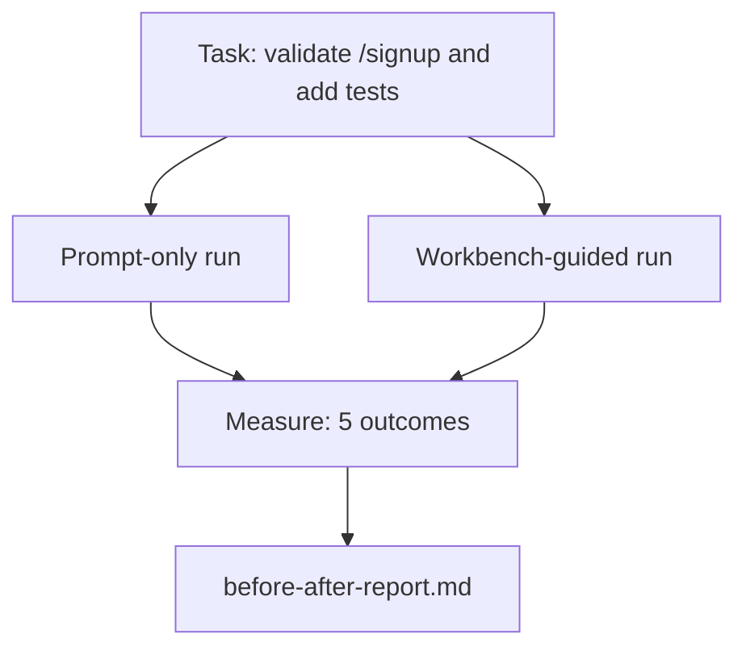

# 在真实 Repo 上使用工作台

> 十一节关于表面的课程,如果不能经受真实代码基础检查,就毫无价值. 本课程将在一个小样本应用上运行同一任务两次:

**Type:** Build
**Languages:** Python (stdlib)
**Prerequisites:** Phases 14 · 32 to 14 · 40
**Time:** ~60 minutes

## 学习目标
- 将七个工作桌面表面汇集成一个小型应用中.
- 将同一个任务运行两次 (仅即时和工作台指导),并衡量五个结果.
- 阅读报告前/后,并判断哪些表面提供最大杆──
- 面对但我的模型已经足够好的反驳时,为工作台辩护.

## 问题
在玩具任务上做演示 说服不了任何人. 工作台的价值在一个有真实感的 repo 上完成一个有真实感的任务时体现出来:更少的失败,更少的逆转,并产生下一次会议可使用的包.

本课提供了这种有真实感的回复,并让同一个任务经过两条管道.

## 概念


### 样本应用程序

`sample_app/`中一个最小的快API 风格处理器:

- `app.py`包含`/signup`没有验证.
- `test_app.py`包含一个快乐道路测试.
- `README.md`和 `scripts/release.sh`作为禁止区域的子.

### 任务

> 为`/signup`添加输入验证:拒绝短于8个字符的密码,返回带输入错误包的422.

### 两条管道

仅即时使用:

1. 阅读阅读阅读阅读
2. 阅读 `app.py`,我知道.
3. 编辑文件.
4. 声称完成.

工作台指导:

1. 运行初始脚本 (教训 35)
2. 阅读合同范围的内容 (课 36)
3. 读取状态 (教训 34)
4. 只有编辑允许的文件.
5. 通过反运行命令 (通过反运行) 接受命令 (通过反运行命令)
6. 运行验证门 (教训 38)
7. 运行评论员 (教训39)
8. 让我来看看看.

### 衡量的五个结果

| Outcome | Why it matters |
|---------|----------------|
| `tests_actually_run` | 大多数“tests passed”声明都无法验证 |
| `acceptance_met` | 证明目标达成的 test 必须就是实际运行过的 test |
| `files_outside_scope` | Scope creep 是主要的静默 failure |
| `handoff_quality` | 下一次 session 会为此付出代价或从中受益 |
| `reviewer_total` | 在 gate 之上的定性判断 |


```figure
wb-ab-runs
```

## 构建它
`code/main.py`针对同一个样本应用程序固定 编排两条管道──两条管道都是脚本的(循环中没有LLM),因此测量可复现──该脚本会将比较 写入`before-after-report.md`和 `comparison.json`,我知道.

运行:

```
python3 code/main.py
```

输出:按管道 显示结果的控制台表,保存到脚本旁边的标记报告,以及给想做图的人使用的JSON──

## 真实生产中的生产模式

怀疑者的问题是:工作台到底有多少帮助?

**Terminal Bench Top-30 到 Top-5，使用同一个 model。**兰格链的 *机器人运行器的解剖学*(2026年4月):一个编码器只通过改变运行器,就从终端子2.0的30名开外跃升到第5名――同一个模型――不同的表面――25个名次的差距――

**Vercel 通过删除 tools 从 80% 到 100%。**据Vercel报告,除了其代理的80%的工具,成功率从80%升至100%──较小的工具表面──更清晰的范围──较少的失败路径──负空间获胜──

**Harvey 仅靠 harness 实现 2x accuracy。**通过利用优化将提高精度到两倍以上,没有更改模型.

**88% 的企业 AI agent projects 未能进入 production。**预示.org的*语言代理人使用工程*论文(2026年3月) 将导致失败归因于运行时间,而不是推理:

**Long-context collapse。**长期的成功率为40-50%,下降到10%以下,主要原因是无限循环和目标损失.

**False negatives 仍然存在。**单步事实任务,单行线程,格式运行,任何模型已逐字记住的内容,这些都只使用提示会更快.

结论不是ness 永远胜──模型会随着时间的推移吸收丝技巧──结论是:今天,工程负载落在这七个表面上,而数字证明这一点──

## 使用它
在以下情况发生时,可以引用本课作为案件文件:

- 有人问为什么每个公关都带着`agent-rules.md`和合同的范围.
- 团队想就在这个冲刺中,
- 您需要一个便携式基准来判断它是否真的节省时间.

字比解释传播得更远.

## 交付它
`outputs/skill-workbench-benchmark.md`是一个便携式评估带,可以让任意代理产品在某个项目 自己的样本应用 上跑过两条管道,并报告五个结果.

## 练习
1. 添加第六个结果:时间到第一时间有意义的编辑.
2. 在你的代码库中一个真实的第二天任务上运行比较――工作台的数字在哪里下滑?
3. 添加一个假负通过:列出即时只 本会更快,工作桌面上是真实成本的任务.
4. 为了换成真实的LLM电话.
5. 写一页给非工程师的摘要.

## 关键术语
| Term | What people say | What it actually means |
|------|----------------|------------------------|
| Sample app | “Toy repo” | 足够小，但也足够现实，能够演练全部七个 surface |
| Pipeline | “Workflow” | agent 遵循的 surface read/write 有序序列 |
| Before/after report | “The receipts” | 你交给怀疑者的 artifact |
| False negative | “Workbench overkill” | prompt-only 更快的任务；诚实列出它们很有用 |
| Workbench benchmark | “Reliability score” | 在你的 codebase 上运行 comparison 的 portable harness |

## 延伸阅读
- [LangChain, The Anatomy of an Agent Harness](https://blog.langchain.com/the-anatomy-of-an-agent-harness/)终端台前-30至前5的证据
- [MongoDB, The Agent Harness: Why the LLM Is the Smallest Part of Your Agent System](https://www.mongodb.com/company/blog/technical/agent-harness-why-llm-is-smallest-part-of-your-agent-system) 维尔塞尔 + 哈维 数字
- [preprints.org, Harness Engineering for Language Agents](https://www.preprints.org/manuscript/202603.1756) 88% 企业失败率
- [HN: Improving 15 LLMs at Coding in One Afternoon. Only the Harness Changed](https://news.ycombinator.com/item?id=46988596) 在15个模型上复现
- [Cloudflare, Orchestrating AI Code Review at Scale](https://blog.cloudflare.com/ai-code-review/)生产 中 30 天 / 131k 审核运行
- [Anthropic, Building Effective Agents](https://www.anthropic.com/research/building-effective-agents)
- 阶段14 · 32至14 · 40 本课端到端演练的表面
- 阶段14 · 19 SWE-bench、GAIA、AgentBench,作为补充本课程的宏观基准
- 阶段14 · 30  评估驱动的代理开发,同一个带可以连接到其中
