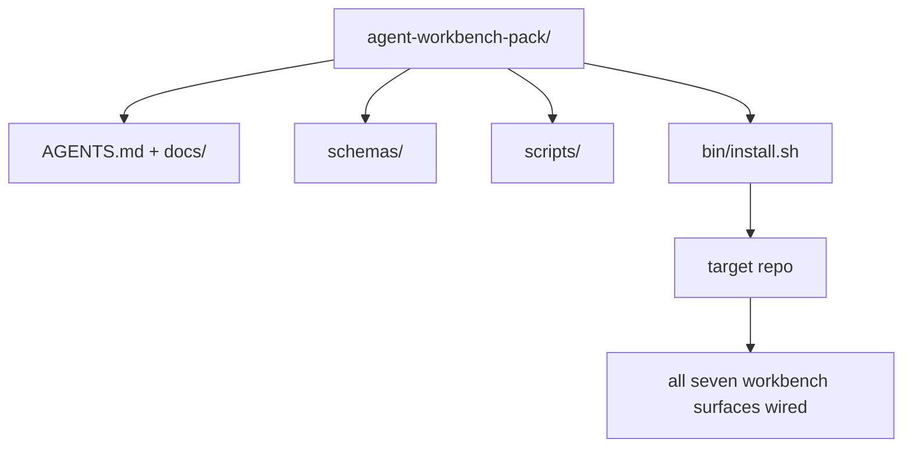

# 交付可复用代理工作台包

> 这部小曲子是可以放进任何一个备忘录包的.`cp -r`接下来第二天早上让代理稳定工作. 这里是课程真正交付的艺术品.

**类型：**建立
**语言：**字符串 (stdlib)
**前置要求：**阶段14 · 31 到14 · 41
**时间：**七十五分钟

## 学习目标

- 将七个工作桌面面包装成一个可以直接放入的目录.
- 固定方案、脚本和模板,让新 repo 获得已知可用的基线.
- 添加一个安装脚本,用等方式放置这个包.
- 决定哪些内容留在包装中,哪些内容留在外面,并为每个人辩护.

## 问题

一个存在于Google文档,聊天历史和三个只被模糊记忆的脚本中的工作台,一个每季度都会重建的工作台.

在课结束时,你将在磁盘上交付.`outputs/agent-workbench-pack/`另外一个可以放入任何目标的存储器.`bin/install.sh`,我知道.

## 概念



### 包装布局

```
outputs/agent-workbench-pack/
├── AGENTS.md
├── docs/
│   ├── agent-rules.md
│   ├── reliability-policy.md
│   ├── handoff-protocol.md
│   └── reviewer-rubric.md
├── schemas/
│   ├── agent_state.schema.json
│   ├── task_board.schema.json
│   └── scope_contract.schema.json
├── scripts/
│   ├── init_agent.py
│   ├── run_with_feedback.py
│   ├── verify_agent.py
│   └── generate_handoff.py
├── bin/
│   └── install.sh
└── README.md
```

### 什么留下,什么放在外面

留下:

- 表面的图案――它们就是合约――
- 上面的四个脚本.
- 它们是规则和条例.

放在外面:

- 项目特定任务――任务属于目标 repo 的董事会,不属于包.
- 供应商 SDK 调用――这个包与框架无关――
- 包装 文案. 这个包装 放在团队已经有上机 旁边,而不是放在其中.

### 安装器

一个简短的`bin/install.sh`(或 `bin/install.py`):

1. 没有`--force`时,拒绝覆盖安装到已有包装上.
2. 将包装复制成目标 repo.
3. 如果存在`.github/workflows/`接入了CI.
4. 打印后续步骤:填写板、设置接受命令、运行 init脚本──

### 版本管理

这个包带一个`VERSION`文件──需要迁移的方案和脚本 变更会大──只需要文件的变更会补丁──目标 repo 的`agent_state.json`记录它初始化时对应的包装版本.


```figure
wb-pack-install
```

## 构建它

`code/main.py`现在,我们要把包装放在课旁边.`outputs/agent-workbench-pack/`作为种子,我使用了这部小曲的前面课程的方案和脚本,以及你已经写的文档.

运行它:

```
python3 code/main.py
```

这个脚本会复制并固定表面,写入 README,打印包树,然后以零退出.

## 真实生产中的模式

一个包只能在经受叉的更新和不友好的上游时才有价值.

**`VERSION` 是 contract，不是 marketing。**需要状态迁移. 小的需要重新运行检查器.`.workbench-version`写入目标 repo;如果目标的锁与包装的 `VERSION`不一致`lint_pack.py`我拒绝交付.`npm`,我知道.`Cargo`和 `pyproject.toml`能经历10年的炼方式;代理不会改变这些规则.

**跨工具分发的单一来源。**提供一个`nx ai-setup`单个配置 放置`AGENTS.md`,我知道.`CLAUDE.md`,我知道.`.cursor/rules/`,我知道.`.github/copilot-instructions.md`和一个MCP服务器──这个包也应该这样做;安装器输出链接(`ln -s AGENTS.md CLAUDE.md`让单一事实来源分发到每个编码代理.

**`uninstall.sh` 会在存在非平凡 state 时拒绝执行。**卸载这个包 不能删除用户的`agent_state.json`,我知道.`task_board.json`或`outputs/`◎ 装置将删除方案,脚本,doc 和 `AGENTS.md`带`--keep-agents-md`否则,如果该状态文件有任何未提交变更,就拒绝继续.

**Skill-as-publishable。SkillKit-style 分发。**这个包作为SkillKit技能交付:`skillkit install agent-workbench-pack`从单个来源把它放在32个AI代理中――包装备是事实来源;SkillKit是发送道――卖家锁定会消失;七个表面保持不变――

## 使用它

包会在三个地方交付:

- **作为一个你放进 repo 的目录。** `cp -r outputs/agent-workbench-pack /path/to/repo`,我知道.
- **作为一个公开 template repo。**叉和定制,并用 `VERSION`控制漂移.
- **作为一个 SkillKit skill。**接入你的代理 产品,让一个命令完成放置.

每次安装都是一个服务.

## 交付它

`outputs/skill-workbench-pack.md`根据团队历史变得更清晰,全球范围将匹配备,分类尺寸将扩展一个领域特定条目.

## 练习

1. 为了取代辩护而,
2. 用Python 重写安装器,并添加 `--dry-run`标与标的比较.
3. 添加一个`bin/uninstall.sh`没有任何特殊的历史,拒绝执行.
4. 添加一个`lint_pack.py`包装 偏离`VERSION`时失败. 把它连接到自己的存储器中.
5. 写一个从手工工作台 迁移到这个包的运行簿――什么操作顺序可以最大限度地减少停机时间?

## 关键术语

| 术语 | 人们常说 | 它实际含义 |
|------|----------------|------------------------|
| Workbench pack | “starter kit” | 一个带版本的目录，携带全部七个 surface |
| Installer | “Setup script” | 以幂等方式放置 pack 的 `bin/install.sh` |
| Pack version | “VERSION” | schema/script 变更使用 major bump，仅 doc 变更使用 patch |
| Drop-in pack | “cp -r and go” | Pack 在第一天无需按 repo 定制即可工作 |
| Forkable template | “GitHub template” | GitHub 的 “Use this template” 可以从中 clone 的公开 repo |

## 延伸阅读

- 阶段14 · 31 到14 · 41  这个包装 打包的每个表面
- [SkillKit](https://github.com/rohitg00/skillkit) 在32个人工智能代理中安装这个技能
- [Nx Blog, Teach Your AI Agent How to Work in a Monorepo](https://nx.dev/blog/nx-ai-agent-skills) 跨六种工具的单一来源发电机
- [agents.md — the open spec](https://agents.md/) 您的包的路由器必须实现内容
- [HKUDS/OpenHarness](https://github.com/HKUDS/OpenHarness)包装等效的参考实现
- [andrewgarst/agentic_harness](https://github.com/andrewgarst/agentic_harness) 带 eval套件的 Redis支持 参考实现
- [Augment Code, A good AGENTS.md is a model upgrade](https://www.augmentcode.com/blog/how-to-write-good-agents-dot-md-files)包装文件的质量门
- [Anthropic, Effective harnesses for long-running agents](https://www.anthropic.com/engineering/effective-harnesses-for-long-running-agents)
- [Anthropic, Harness design for long-running application development](https://www.anthropic.com/engineering/harness-design-long-running-apps)
- 阶段14 · 30  消费这个包的验证门的评估驱动代理开发
- 阶段14 · 41  该包必须改进前/后的基准
