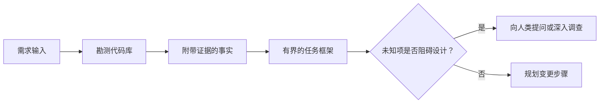

# 在代理 写代码前框定任务

> 编码智能体 (编码代理) 能极其快速实现一个清晰的任务――它也极其快速实现一个模糊的任务――两者速度完全相同,但价格却天差异――

**Type:** Learn + Build
**Languages:** Python (stdlib)
**Prerequisites:** Phase 14 第 31 课与第 36 课
**Time:** ~60 分钟

## 学习目标

- 在修改代码之前,将原始需求转化为有明确边界的任务框架.
- 对于代码库的客观事实和主观假设,
- 明确定义允许修改的路径,禁止接触的路径以及验证证.
- 判断何时代码勘测(识别) 已经充分,可以正式开展工作.

## 代价高昂的失败

增加重复邮箱防护 听起来很明确,但实际上并非如此.这种唯一的校验是否应该放在API层,领域服务层还是数据库层?邮箱比较是否区分大小写?对外公开的错误响应结构是什么?是否允许引入数据库迁移?哪个测试可以证明这种行为?

一个强大的智能体会用看起来合情合理的选择来填补这些空白――而这是最危险的情况:它的代码实现可能整洁优雅,单测完整,但仍然与整个系统格格不入.

因此,编码智能体的第一单元绝不是直接修改代码,而是建立一个由代码库真正证据支的任务框架.

## 任务框架(任务框架)

一个实用任务框架包含六个核心要素:

| 字段 | 核心问题 |
|---|---|
| 目标（Goal） | 必须改变哪些可观测的行为？ |
| 代码库事实（Repository facts） | 你在代码、测试、配置或历史提交中验证了什么？ |
| 允许修改路径（Allowed paths） | 变更允许落在哪些位置？ |
| 禁止触碰路径（Forbidden paths） | 哪些文件与目录必须保持原样？ |
| 验收证据（Acceptance evidence） | 哪些具体命令或观测现象能证明目标已达成？ |
| 未知项（Unknowns） | 哪些决策仍需补充证据或依赖人类判断？ |

事实必须附带确定的证据. API 遇到重复项回报 409不是事实,直到你明确指出已有的测试用例或请求处理函数位置.



## 勘测旨在寻找约束

不要试图通读整个代码库.你应该寻找能够对待这种变化构成约束的各种边界表面:

1. 当前行为表现及其调用方式
2. 最近的现有测试例.
3. 公共契约或序列化后的数据结构
4. 管辖该路径的项目规范和指令.
5. 构建与验证命令.
6. 过去完成的类似变化,从中提炼局部代码模式.

当计划中的每一个决策都已有客观证据支持,已确定的授权代理决策,或已被列为已知未知项目的,测试即可停止.

## 未知项并非工作失误

无知项是受控信息空白;而未经验证的假设则是对该空白的未受控假设.

将每个未知的项目分类:

- **可探查的（Discoverable）：**代码库本身或运行中的系统能够提供答案.
- **可自决的（Decidable）：**任务契约授予智能体自主选择权.
- **需人类判断的（Human）：**选择将改变产品行为,成本,系统风险或外部兼容性.
- **延后处理的（Deferred）：**选择超出了当前切片的范围,属于非目标 (非目标)

智能体应自主处理可查找和授权自决的未知项目;但遇到需要人类判断的未知项目,必须在决策被固化到代码之前主动暂停并确认.

## 实现之前先定验收标准

在编写补丁之前,先写出完成证明.

- 一条针对单元测试或集成测试命令;
- 一次指定视频口和预期状态端到端浏览器操作流程;
- 一次网络请求及完全符合的响应协议;
- 达到特定的性能度量;
- 一项确认没有无关文件被改动的范围检查.

测试通过并不是有效的证明方案.必须明确确定具有裁决权的测试用例及其证明的主张.

## 构建它

本课的实验将创建一个`TaskFrame`对象,校验其边界与证据的有效性,并输出`outputs/task-frame.md`,我知道.

在当前课程目录下运行:

```bash
python3 code/main.py
python3 -m unittest discover code/tests -v
```

尝试通过四种方式故意破坏示例:删除目标,删除事实凭证,制造允许路径和禁止路径的重叠,以及删除验收命令.

## 在真实代码库中使用

在要求智能体修改代码之前:

1. 目标表述为具体行为而不是修改文件.
2. 记录两到三条带有确凭证的代码库事实.
3. 指定最小的允许修改路径集合──
4. 明确写出禁止触碰的负空间 (负空间)
5. 编写能够宣告任务的闭环验证命令或观测手段.
6. 列出你目前尚未确定且没有决定权的决策项目的

任务框架应能在一个屏幕内完整地展示. 如果超出一个屏幕,说明任务可能包含多个可以独立验证的变化,应被分开.

## 练习

1. 为你一个代码库中的真实 bug 框定一个任务框架,而整个过程没有提出任何具体的解决方案.
2. 找出任务框架中的一条实际上只是主张的主观假设,用客观证据取代它.
3. 增加一个将改变外部公开协议,因此必须由人类决策未知项目的.
4. 将一个范围过大的修改路径分为最小的安全路径集.
5. 在接受证书中加入一个用于防范越界修改范围凭证 (Scope receipt) 👇

## 延伸阅读

- [Nuseibeh and Easterbrook, Requirements Engineering: A Roadmap](https://www.cs.toronto.edu/~sme/papers/2000/ICSE2000.pdf)探讨如何实现软件,以实现真实世界目标和不断发展的约束条件.
- [Yang et al., SWE-agent: Agent-Computer Interfaces Enable Automated Software Engineering](https://arxiv.org/abs/2405.15793)编码智能体周围的接口与束系统对其工作效果具有决定性的影响.

## 交付物与沉

请妥善保留生成的`outputs/task-frame.md`是下一节课程的直接输入,其中该框架将转化为由证据支的执行计划.
