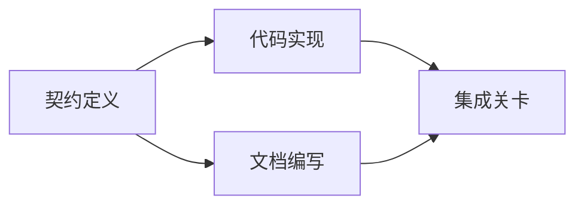

# 建立基于证据的执行计划

> 计划绝对不是一个更好的待机清单 (To-do list) ――它是一个依赖图:其中每一个改动都有理由,每个终端节点都有明确的验证证证――

**Type:** Learn + Build
**Languages:** Python (stdlib)
**Prerequisites:** Phase 14 第 43 课
**Time:** ~65 分钟

## 学习目标

- 将任务框架转化为具有客观证据和验证证明的工作项目.
- 执行序列的建模将依赖于图,而不是散文式的线性步骤.
- 在修改代码之前检查缺失的事实、未知依赖以及循环依赖──
- 区分哪些步骤可以并行执行,哪些步骤必须按序列等待.

## 为什么智能体的计划总是失败

脆弱的计划只是为了未来的时代,

1. 更新了API.
2. 添加测试──
3. 更新文档.

这一清单没有说明发现什么代码事实,为什么修改这些文件是正确的,哪些协议需要优先修改,也没有说明哪些工作可以发起.

一个实质的计划,对每个工作项目 (工作项目) 都做出了五项承诺:

| 承诺要素 | 核心作用 |
|---|---|
| 标识符（Identifier） | 用于依赖声明与会话交接（Handoff）的稳定引用 |
| 变更内容（Change） | 最小颗粒度的行为或契约改动 |
| 事实证据（Evidence） | 证明该变更合情合理且必要据实的代码库证据 |
| 前置依赖（Dependencies） | 必须率先完成并成立的前置工作项 |
| 验收证明（Proof） | 能够确凿宣告该工作项闭环的检查手段 |

## 在具体实现之前先规划协议

当多个不同的代码表面依赖于相同行为时,必须优先定义行为契约.



这张依赖图清楚地揭示了安全并发的可能性:在协议固定后,代码实现和文档编写可以并发,而最终的集成阶段则等待两者都在绪.

## 事实证据应具有改变计划的能力

代码库事实绝对是无可无限的,它必须能够对工作规划产生实际影响:

- 发现已存在的辅助函数,从而取消原本计划新建的抽象层次.
- 兼容性测试存在,迫使计划必须增加数据迁移.
- 部署环境的约束,将模式 (模式) 变更分成另一个独立任务中.
- 公共响应类型的格式,改变了编码实现和文档编写的前后顺序.

如果一个所谓的证据根本无法改变你的计划,那么它很可能根本不是支持这个决定的有效证据.

## 面向会话中断而设计

编码智能体的会话往往会无预警中断――一个具有可恢复性的 (可回复) 计划,其工作项目的粒度足够细致,使得另一个会话接入时能够立即判断:

- 哪项工作已完成;
- 哪项验收证明已经运行;
- 哪些产品文件已修改;
- 哪些依赖项目已解除阻;
- 下一个可以安全执行的工作项是什么?

切勿把执行状态仅仅存于聊天窗口中的勾选框中.

## 计划有效性校验

在正式执行前,如果出现以下情况应直接拒绝计划:

- 存在重复工作项标识符;
- 某项工作缺乏事实证据支;
- 某项工作缺乏验证证;
- 依赖项目指向一个不存在的工作项目;
- 循环依赖图中存在;
- 在相关不确定性尚未消除之前,我们已经安排了第一个不可逆的操作.

前五项检查可通过程序机械化自动完成;最后一个则需要工程判断力,应在审核中明确强调.

## 构建它

`code/main.py`建模了工作项,校验其证凭证,通过拓排序计算执行波次(执行波次),并将结果写入`outputs/evidence-plan.json`,我知道.

运行命令:

```bash
python3 code/main.py
python3 -m unittest discover code/tests -v
```

在本示例中会产生三个执行波次:首先执行契约定义;随后代码实现与文档编写并发行运行;最后运行集成关卡──

## 配合编码智能体使用

在允许智能体修改代码文件之前,要求它先输出这个计划.

1. 每个路径和行为主张是否有具体的代码库凭证支.
2. 每个工作项目是否有单一的完工证明.
3. 根据图是否将会昂贵或不可逆转的工作延迟到依赖不确定性消除后.

审批是具体的清晰计划,而不是空洞的一句话.

## 练习

1. 增加一个需要显然的人类批准的数据库迁移工作.
2. 构建一个循环依赖,并解释其背后隐藏的产品分歧.
3. 拆分一个包含两条不同的证明命令的工作项.
4. 添加一个可以在第二波运行,而没有触及任何已有的分支工作项目.
5. 将计划染为Markdown格式展示,同时保持JSON作为单一事实来源.

## 延伸阅读

- [Nuseibeh and Easterbrook, Requirements Engineering: A Roadmap](https://www.cs.toronto.edu/~sme/papers/2000/ICSE2000.pdf)探索目标,规范,共识与发展之间的关系.
- [Barry Boehm, A Spiral Model of Software Development and Enhancement](https://dl.acm.org/doi/10.1145/12944.12948)如何组织研发过程

## 交付物与沉

请妥善保留生成的`outputs/evidence-plan.json`〔它将作为下一节中任务委托的契约依据〕
