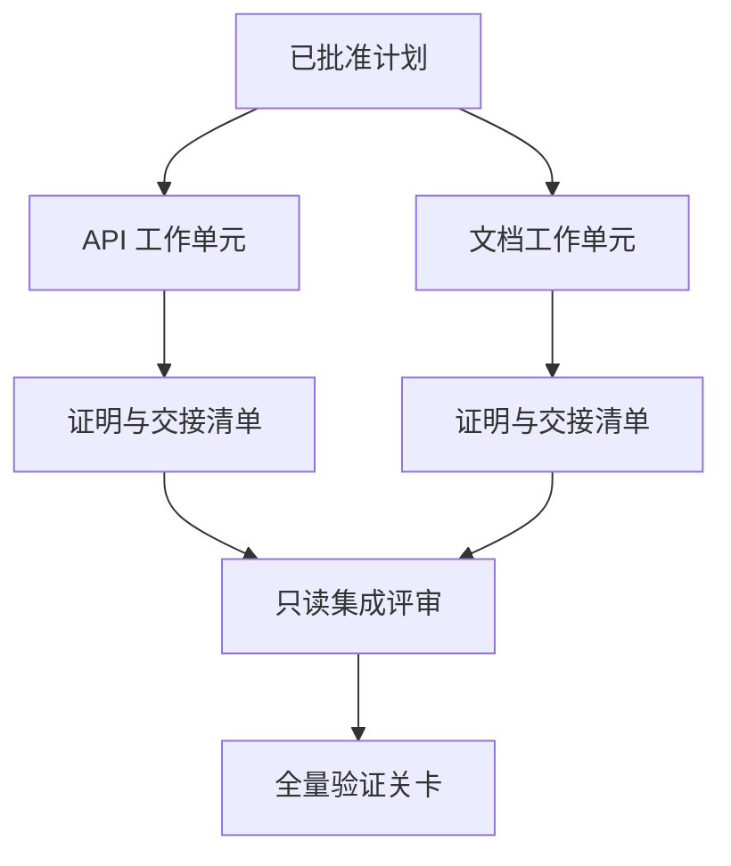

# 带隔离与合并协议的代理委托

> 只有在真正独立的工作中才能节省物理时间.否则,它们只会把一个清晰的任务变成更高的协调成本,更快的失败速度.

**Type:** Learn + Build
**Languages:** Python (stdlib)
**Prerequisites:** Phase 14 第 39 课与第 44 课
**Time:** ~70 分钟

## 学习目标

- 根据真正的独立性判断任务是否合理.
- 为每一个工作单元 (劳动者) 赋予他的文件修改权和显然完成证明.
- 基于依赖计算安全的执行波次 (基于执行波)
- 设计合并契约 (合并合同) 为了安全融合多个智能体的工作产品.

## 经验标准

只有当满足以下至少一个条件时,委托才具有合理性:

- 两项调查能够独立解决不同的未知的问题;
- 实现两种代码具有相互不重叠的文件路径和协议接口;
- 评审智能体 (智能体) 评审员) 可以在不修改产品的前提下独立进行检查;
- 长时间的外部检查可以在本地工作推进同时后台运行.

当多个智能体需要修改相同文件时, 必须坚持执行, 需要依赖于相同的未解决的决策,

## 工作单元就是一份契约

每个委托工作单位都需要明确规定:

| 字段 | 含义 |
|---|---|
| 目标（Goal） | 单一可观测的结果 |
| 负责人（Owner） | 单一负责执行的工作智能体 |
| 路径（Paths） | 排他的写入所有权 |
| 前置依赖（Dependencies） | 启动前必须已完工的前置单元 |
| 证明（Proof） | 返回给集成者的确凿验证证据 |
| 交接清单（Handoff） | 已修改的文件、已做出的决策以及残留风险 |

处理后端逻辑 没有合格的工作单元.`app/accounts.py`实现重复检查并通过针对账户专项测试证明才是合格的工作单元.

## 隔离的三层体系

1. **文件系统隔离（Filesystem isolation）：**独立工作树 (工作树) 或沙箱,防止意外发生并发共享写入.
2. **所有权隔离（Ownership isolation）：**严格的契约限制,防止两个智能体故意修改相同的路径.
3. **状态隔离（State isolation）：**独立日志和输出目录,防止一个智能体覆盖另一个智能体沉重的证据.

文件系统隔离无法解决设计所有权问题. 两个干干净净的工作树仍然可能产生相互冲突的架构设计.



## 集成者不负责重构代码

集成者 (集成者) 集成者 (集成者) 的职责应是:

1. 确认每个交往成果均严格落在其分配范围内;
2. 认真审查验证证的输出,而不是仅仅是盲信工作智能体自写的摘要;
3. 根据依赖关系的时间序列进行合并改动;
4. 运行覆盖跨单元的全量验证关卡;
5. 坚决拒绝任何隐蔽范围的扩张;
6. 为了解决冲突的新决策而不是私下默默修改.

如果集成阶段需要重写某个工作智能体的大部分代码产品,说明最初的任务分解本身是错误的.

## 人类与智能体的角色分工

任务委托并不意味着放弃人类判断力.人类仍然坚持掌握那些将改变系统外部行为,风险等级,安全权限或带来不可逆成本的核心决策.

这就是**校准型自主（Calibrated Autonomy）**系统在充分且易于回转的证据中给予智能体高度自由,因此在严重关键环节中,强制建立人类检查卡.

## 构建它

本课程的实验程序将检查路径重叠,验证依赖关系,计算安全的执行波次,并将结果输出到`outputs/delegation-plan.json`,我知道.

运行命令:

```bash
python3 code/main.py
python3 -m unittest discover code/tests -v
```

尝试修改文档单元,让它拥有`app/`目录所有权.由于该路径与API单元存在重叠,计划应自动拦截并报错.

## 练习

1. 实际业务将分为两个独立的子工作单元和一个集成角色.
2. 找出一个表面上看似独立但实际上合并的并行分离方案,明确指出它们共享隐性决策.
3. 增加一个只读的研究型智能体 (研究员),其产品为一个事实表格.
4. 增加一个合并关卡(Merge Gate),对照所有工作单元契约检查最终修改的文件集合──
5. 为工作单元定义取消规则:当其前置依赖失效时,及时停止后续执行.

## 延伸阅读

- [Reid Smith, The Contract Net Protocol](https://doi.org/10.1109/TC.1980.1675516)分布式任务分配与结果汇报的早期形式化经典研究.
- [Eric Horvitz, Principles of Mixed-Initiative User Interfaces](https://dl.acm.org/doi/10.1145/302979.303030)探讨自动化机制何时应自主行动何时应将控制权交还给人类

## 交付物与沉

请妥善保留生成的`outputs/delegation-plan.json`,它记录了分离方案是为什么安全的,每个路径都归于谁所有,以及集成必须接受什么样的证明.
